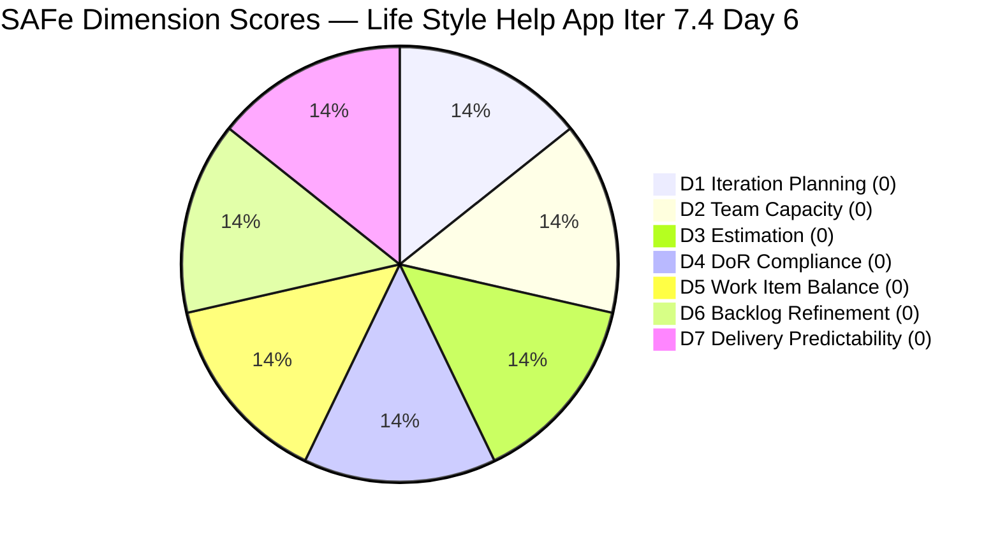

# Life Style Help App Team — SAFe Iteration Audit A60

**Audit Date:** 2026-05-23 09:00 PHT
**Auditor:** Claude Code (SAFe PM Consultant)
**Workspace:** `ado_ls_dev`
**ADO Board:** [Life Style Help App Team](https://dev.azure.com/jairo/Life%20Style%20Help%20App/_boards/board/t/Life%20Style%20Help%20App%20Team/Stories%20and%20Deliverables)

---

## 1. Audit Metadata

| Field | Value |
|-------|-------|
| Audit Number | A60 |
| Audit Date | 2026-05-23 |
| Audit Time | 09:00 PHT |
| Iteration | 7.4 |
| Iteration Dates | May 18 – May 31, 2026 |
| Sprint Day | Day 6 of 14 |
| ADO Project | Life Style Help App (`0f447778-7156-4451-ab21-27be3c4a5888`) |
| ADO Team | Life Style Help App Team (`a2a805bc-0b30-4ef3-9a8a-b7f3081157a6`) |
| Iteration ID | `85ef1e2d-7286-4593-9607-5b3df96255f4` |
| Prior Audit | AUDIT_20260522_0900.md (Score: 0.0 — Critical) |
| **Overall Score** | **0.0 / 100** |
| **Risk Band** | **Critical** |

---

## 2. Executive Summary

Iteration 7.4, **Day 6 of 14**. The Life Style Help App project continues in complete sprint collapse. The backlog API returns **zero work items** and the capacity API confirms **no team capacity is configured** — unchanged from Days 1–5. Today marks the **sixth consecutive day of full inactivity** and the **first day past the point of no return** for Iteration 7.4.

With 8 working days remaining and zero committed items, meaningful sprint delivery is statistically impossible in Iteration 7.4. All seven SAFe dimensions score 0, yielding an overall score of **0.0 / 100 (Critical)** for the sixth consecutive day.

> **Portfolio Note:** This workspace is excluded from portfolio-health and portfolio-meeting-prep aggregation per owner directive (2026-05-21). Individual audits continue per batch run policy.

> **Escalation Status:** Six consecutive zero-score audits with no observed recovery action. A formal project disposition decision is overdue.

**Overall Score: 0.0 / 100 — Critical**

---

## 3. Previous Audit Delta

| Metric | 2026-05-22 (Audit A59) | 2026-05-23 (Audit A60) | Change |
|--------|------------------------|------------------------|--------|
| Sprint Day | Day 5 | Day 6 | +1 |
| Items in Iteration | 0 | 0 | 0 |
| Capacity Configured | 0 | 0 | 0 |
| Story Points Committed | 0 SP | 0 SP | 0 |
| SP Closed | 0 | 0 | 0 |
| Recovery Action | None | None | 0 |
| Overall Score | 0.0 | 0.0 | 0.0 |
| Risk Band | Critical | Critical | — |

### Sprint Collapse Tracker

| Indicator | Day 1 | Day 2 | Day 3 | Day 4 | Day 5 | Day 6 |
|-----------|-------|-------|-------|-------|-------|-------|
| Zero committed items | ✗ | ✗ | ✗ | ✗ | ✗ | ✗ |
| Zero capacity configured | ✗ | ✗ | ✗ | ✗ | ✗ | ✗ |
| No recovery action observed | ✗ | ✗ | ✗ | ✗ | ✗ | ✗ |
| Delivery probability | — | — | — | Very Low | Zero | **Zero** |

**Assessment:** Day 6 confirms the mathematical impossibility of meaningful Iteration 7.4 delivery. The sprint is in a terminal state. No SAFe metric can recover within the remaining 8 days without a complete sprint reset — which, given the portfolio exclusion directive, is also unlikely. This audit series has run for 6 days on a project in administrative pause, generating cost without insight value.

---

## 4. Current Iteration Snapshot

**Iteration 7.4** · May 18 – May 31, 2026 · **Day 6 of 14**

| Field | Value |
|-------|-------|
| Visible Root Backlog Items | **0** |
| Items in Iteration 7.4 | **0** |
| Total SP Committed | **0 SP** |
| Capacity Configured | **0** (API: "No iteration capacity assigned") |
| Items Active | **0** |
| SP Burned | **0 SP** |
| Days Remaining in Sprint | 8 |
| Recovery Possible (within Iter 7.4) | **No** |

---

## 5. Work Item Analysis

**No work items are present in the Life Style Help App Team's backlog.** No analysis is possible.

| Metric | Value |
|--------|-------|
| visible_root_backlog_items | 0 |
| current_iteration_root_items | 0 |
| contributors_with_current_work | 0 |
| contributors_with_capacity | 0 |
| point_eligible_current_items | 0 |
| estimated_current_items | 0 |
| dor_compliant_current_items | 0 |
| fresh_visible_root_items | 0 |
| stale_90_visible_root_items | 0 |
| stale_180_visible_root_items | 0 |
| committed_story_points | 0 |
| closed_story_points | 0 |

---

## 6. SAFe Compliance Scorecard

| Dimension | Score | Evidence | Notes |
|-----------|-------|----------|-------|
| D1 — Iteration Planning | 0.0 | 0/0 items; visible backlog = 0 | Formula: 0 if visible = 0 |
| D2 — Team Capacity | 0.0 | 0 contributors with work; capacity API error | No configured capacity |
| D3 — Estimation | 0.0 | 0/0 eligible items | Formula: 0 if eligible = 0 |
| D4 — DoR Compliance | 0.0 | 0/0 items | Formula: 0 if no items |
| D5 — Work Item Balance | 0.0 | No items; no User Story → no valid score base | max(0, 100−40) inapplicable with 0 items |
| D6 — Backlog Refinement | 0.0 | 0 items; fresh ratio undefined | Formula: base = 0/0 = 0 |
| D7 — Delivery Predictability | 0.0 | 0/0 SP committed | Formula: 0 if committed = 0 |

**Overall Score: (0+0+0+0+0+0+0) / 7 = 0.0 / 100 — Critical**

---

## 7. Dimension Findings

### D1 — Iteration Planning (0.0) 🔴
No items exist in the backlog. The Iteration 7.4 path (`Life Style Help App\2026-PI7\Iteration 7.4`, ID: `85ef1e2d-7286-4593-9607-5b3df96255f4`) is valid and confirmed, but no items are assigned to it. Sprint planning was not executed for Iteration 7.4.

### D2 — Team Capacity (0.0) 🔴
Capacity API returns: "No iteration capacity assigned to the team." No team member has configured capacity for Iteration 7.4. This is consistent with a project in administrative pause.

### D3 — Estimation (0.0) 🔴
No items to estimate.

### D4 — DoR Compliance (0.0) 🔴
No items to check.

### D5 — Work Item Balance (0.0) 🔴
No items to assess.

### D6 — Backlog Refinement (0.0) 🔴
No backlog items. The project backlog was decommissioned (all items moved to Removed state per Audit A58 findings).

### D7 — Delivery Predictability (0.0) 🔴
No committed story points; no closed story points. 0/0 scores 0 per rubric.

---

## 8. Risks and Bottlenecks

| Risk | Severity | Status |
|------|----------|--------|
| Complete sprint failure — 0 items, 0 capacity | **Critical** | Confirmed — 6th consecutive day |
| Sprint unrecoverable (Day 6, 8 days remaining, 0 items) | **Critical** | Mathematical certainty |
| All project work items in Removed state | **Critical** | Confirmed via Audit A58 |
| No capacity configured for any team member | **Critical** | API confirms |
| No project disposition decision from owner | High | 6 days of escalation with no observed response |
| Continued audit overhead on a non-active project | Moderate | 6 daily audits at 0.0 — resource cost without value |

---

## 9. Prioritized Recommendations

With Day 6 past the point of no return, sprint recovery is no longer a viable recommendation. The following apply:

1. **Project Owner decision required immediately** — Ramon should make an explicit organizational decision on the Life Style Help App project status by end of May 23:
   - **(a) Formal pause:** Archive Iteration 7.4 in ADO with a documented pause note. Update workspace CLAUDE.md to reflect the pause status and suppression of daily audits until reactivation.
   - **(b) Re-launch in Iteration 7.5:** Execute full sprint planning for Iteration 7.5 (Jun 1–14 estimated) — define sprint goal, restore work items from prior backlog or create new ones, assign team members, configure capacity.
   - **(c) Discontinuation:** Archive the ADO project, document the decision in CLAUDE.md, and remove from the automated audit rotation.

2. **Suppress automated audits until decision** — Six consecutive 0.0 audits with no recovery action indicate an organizational decision gap, not a sprint delivery gap. Continuing daily audits on a project in administrative pause generates audit fatigue without actionable output.

3. **Document the portfolio exclusion rationale** — The 2026-05-21 portfolio exclusion directive was issued, but no corresponding ADO project status update was made. Aligning ADO project status with the portfolio decision improves traceability.

4. **If restarting in Iteration 7.5:** Do not repeat the planning gap. Ensure sprint goal, work items, assignments, and capacity are all configured on Day 1 (Jun 1). Use the DoR checklist from prior audits to fast-track item quality.

---

## 10. Evidence Gaps and Limitations

| Gap | Impact | Notes |
|-----|--------|-------|
| All 7 dimensions score 0 | Complete rubric failure | Not a data quality issue — the backlog is genuinely empty |
| Root cause of item removal unverifiable | Cannot confirm pause vs. discontinuation | API does not expose removal reason; prior audit confirmed "Removed" state |
| Team member roster unknown | D2 unavailable | No active assignees; no capacity configured |
| Portfolio exclusion status | Scope note | Workspace excluded from portfolio-health aggregation per 2026-05-21 directive; individual audit continues per batch policy |

---

## Visualization

> All segments are equal (all scores = 0). Chart confirms complete scoring failure across all 7 dimensions.

### Score Trend (Iteration 7.4)

| Date | Audit | Score | Band | Sprint Day |
|------|-------|-------|------|-----------|
| May 18 | A55 | 0.0 | Critical | Day 1 |
| May 19 | A56 | 0.0 | Critical | Day 2 |
| May 20 | A57 | 0.0 | Critical | Day 3 |
| May 21 | A58 | 0.0 | Critical | Day 4 |
| May 22 | A59 | 0.0 | Critical | Day 5 |
| **May 23** | **A60** | **0.0** | **Critical** | **Day 6 (PoNR)** |

Six consecutive Critical scores. No trend movement. Sprint 7.4 will close at 0% delivery. Project disposition decision is the only remaining action.

---

*Audit generated by Claude Code (claude-sonnet-4-6) on 2026-05-23. Evidence sourced from Azure DevOps MCP (Life Style Help App project). Rubric: SAFe 6.0 7-dimension scorecard. Note: This workspace is excluded from portfolio-level aggregation per portfolio-health exclusion policy (2026-05-21).*
