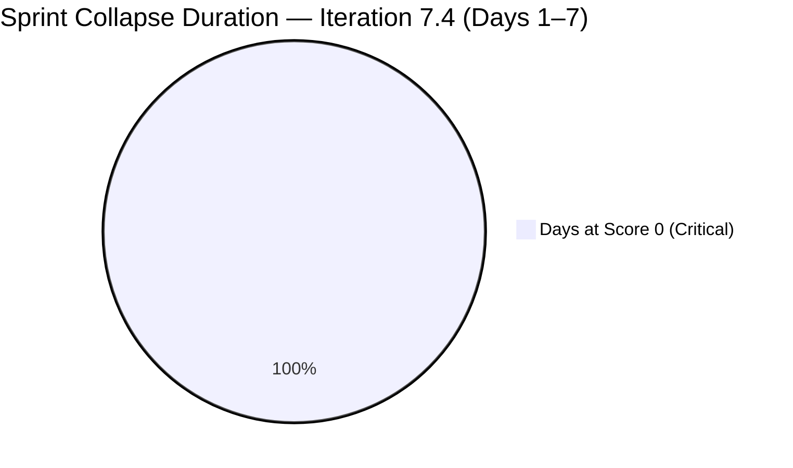
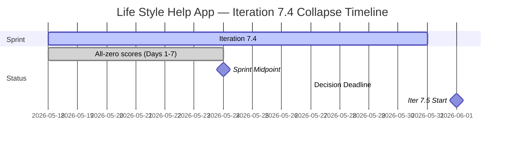

# Life Style Help App Team — SAFe Iteration Audit A61

**Audit Date:** 2026-05-24 09:04 PHT
**Auditor:** Claude Code (SAFe PM Consultant)
**Workspace:** `ado_ls_dev`
**ADO Board:** [Life Style Help App Team](https://dev.azure.com/jairo/Life%20Style%20Help%20App/_boards/board/t/Life%20Style%20Help%20App%20Team/Stories%20and%20Deliverables)

---

## 1. Audit Metadata

| Field | Value |
|-------|-------|
| Audit Number | A61 |
| Audit Date | 2026-05-24 |
| Audit Time | 09:04 PHT |
| Iteration | 7.4 |
| Iteration Dates | May 18 – May 31, 2026 |
| Sprint Day | Day 7 of 14 |
| ADO Project | Life Style Help App (`0f447778-7156-4451-ab21-27be3c4a5888`) |
| ADO Team | Life Style Help App Team (`a2a805bc-0b30-4ef3-9a8a-b7f3081157a6`) |
| Iteration ID | `85ef1e2d-7286-4593-9607-5b3df96255f4` |
| Prior Audit | AUDIT_20260523_0900.md (Score: 0.0 — Critical) |
| **Overall Score** | **0.0 / 100** |
| **Risk Band** | **Critical** |

> **Portfolio Note:** This workspace is excluded from portfolio-health and portfolio-meeting-prep aggregation per owner directive (2026-05-21). Individual audits continue per batch run policy.

---

## 2. Executive Summary

Iteration 7.4, **Day 7 of 14 (Sprint Midpoint)**. The Life Style Help App project remains in complete sprint suspension. The Stories and Deliverables backlog returns **zero work items** for the seventh consecutive day, and the capacity API confirms **no team capacity configured**. All seven SAFe dimensions score 0, yielding an overall score of **0.0 / 100 (Critical)** — unchanged since Day 1.

Today marks the sprint midpoint. With zero committed items and zero capacity, Iteration 7.4 has entered terminal failure: meaningful delivery within this sprint is mathematically impossible. No ADO action taken by the team since the first audit on May 18 has modified this project's state.

> **Escalation Level: FINAL.** Seven consecutive zero-score audits with no observed recovery action. A formal project disposition decision from the project owner is now the only path forward. Continuing daily audits on a project in administrative suspension provides no actionable value.

**Overall Score: 0.0 / 100 — Critical**

---

## 3. Previous Audit Delta

| Metric | 2026-05-23 (Audit A60) | 2026-05-24 (Audit A61) | Change |
|--------|------------------------|------------------------|--------|
| Sprint Day | Day 6 | Day 7 (Midpoint) | +1 |
| Items in Iteration | 0 | 0 | 0 |
| Capacity Configured | 0 | 0 | 0 |
| Story Points Committed | 0 SP | 0 SP | 0 |
| SP Closed | 0 | 0 | 0 |
| Recovery Action Observed | None | None | 0 |
| Overall Score | 0.0 | 0.0 | 0.0 |
| Risk Band | Critical | Critical | — |

### Sprint Collapse Tracker

| Indicator | D1 | D2 | D3 | D4 | D5 | D6 | D7 |
|-----------|----|----|----|----|----|----|----|
| Zero committed items | ✗ | ✗ | ✗ | ✗ | ✗ | ✗ | ✗ |
| Zero capacity configured | ✗ | ✗ | ✗ | ✗ | ✗ | ✗ | ✗ |
| No recovery action | ✗ | ✗ | ✗ | ✗ | ✗ | ✗ | ✗ |
| All-zero scorecard | ✗ | ✗ | ✗ | ✗ | ✗ | ✗ | ✗ |

**Day 7 Assessment:** The sprint midpoint is a definitive threshold. At Day 7 with 0 items and 0 capacity, Iteration 7.4 cannot be recovered by any internal action. Only a full project restart in Iteration 7.5 (Jun 1–14) could resume SAFe-compliant delivery for this team. The portfolio exclusion directive (2026-05-21) and seven uninterrupted days of inactivity together indicate a project in organizational pause rather than active execution.

---

## 4. Current Iteration Snapshot

**Iteration 7.4** · May 18 – May 31, 2026 · **Day 7 of 14 (Midpoint)**

| Field | Value |
|-------|-------|
| Visible Root Backlog Items | **0** |
| Items in Iteration 7.4 | **0** |
| Total SP Committed | **0 SP** |
| Capacity Configured | **0** (API: no iteration capacity assigned) |
| Items Active | **0** |
| SP Burned | **0 SP** |
| Days Remaining in Sprint | 7 |
| Sprint Recovery Possible | **No** — mathematical impossibility |
| Next Feasible Sprint | Iteration 7.5 (Jun 1 – Jun 14, 2026) |

---

## 5. Work Item Analysis

**No work items exist in the Life Style Help App Team's Stories and Deliverables backlog.** No analysis is possible for any metric.

| Metric | Value |
|--------|-------|
| visible_root_backlog_items | 0 |
| current_iteration_root_items | 0 |
| contributors_with_current_work | 0 |
| contributors_with_capacity | 0 |
| point_eligible_current_items | 0 |
| estimated_current_items | 0 |
| dor_compliant_current_items | 0 |
| fresh_visible_root_items | 0 |
| stale_90_visible_root_items | 0 |
| stale_180_visible_root_items | 0 |
| committed_story_points | 0 |
| closed_story_points | 0 |

---

## 6. SAFe Compliance Scorecard

| Dimension | Score | Evidence | Notes |
|-----------|-------|----------|-------|
| D1 — Iteration Planning | 0.0 | 0/0 items — visible backlog = 0 | Formula: 0 if visible = 0 |
| D2 — Team Capacity | 0.0 | 0 contributors; no capacity API data | No configured capacity |
| D3 — Estimation | 0.0 | 0/0 eligible items | Formula: 0 if eligible = 0 |
| D4 — DoR Compliance | 0.0 | 0/0 items | Formula: 0 if no items |
| D5 — Work Item Balance | 0.0 | No items — no User Story present | Formula: 0 if no current items |
| D6 — Backlog Refinement | 0.0 | 0/0 items — fresh ratio undefined | Formula: 0 if visible = 0 |
| D7 — Delivery Predictability | 0.0 | 0/0 SP committed | Formula: 0 if committed = 0 |

**Overall Score: (0+0+0+0+0+0+0) / 7 = 0.0 / 100 — Critical**

---

## 7. Dimension Findings

### D1 through D7 — All Dimensions (0.0) 🔴

No items exist in the project backlog. No capacity is configured. All seven dimensions score 0 by rubric formula (visible_root_backlog_items = 0 triggers score-0 outcomes across all dimensions). This is not a data quality issue — the backlog is genuinely empty and confirmed by both the backlog API and the iteration work items API.

The project entered this state prior to Iteration 7.4 and has shown no signs of reactivation across 7 audit days and 7 working days of the sprint. The prior audit (A58) confirmed all project work items were moved to Removed state. This audit series has exhausted its diagnostic utility — the root cause (organizational pause) is established; daily auditing cannot remediate it.

---

## 8. Risks and Bottlenecks

| Risk | Severity | Status |
|------|----------|--------|
| Sprint midpoint with 0 items, 0 capacity | **Critical** | Confirmed — terminal failure |
| Sprint mathematically unrecoverable | **Critical** | Day 7 of 14, 0 SP available |
| All project backlog items in Removed state | **Critical** | Confirmed per Audit A58 |
| No team capacity configured for any member | **Critical** | API confirms — 7th consecutive day |
| No owner decision on project disposition | **Critical** | 7 days of escalation; no response detected |
| Continued daily audit overhead on inactive project | High | 7 zero-score audits generated; diminishing returns |
| Iteration 7.5 planning window approaching (Jun 1) | Moderate | If restarting, planning must begin by May 27 |

---

## 9. Prioritized Recommendations

Sprint recovery for Iteration 7.4 is no longer possible. The following are the only relevant recommendations:

1. **Project Owner decision required by May 27** — To enable any action before Iteration 7.5 begins (Jun 1), Ramon must make an explicit organizational decision by May 27 (3 business days before next sprint start):
   - **(a) Formal pause — suspend audits:** Document the pause in workspace CLAUDE.md. Archive Iteration 7.4 with a pause note in ADO. Suppress automated audits until an explicit reactivation directive is issued.
   - **(b) Re-launch in Iteration 7.5:** Execute full sprint planning for Iteration 7.5 (Jun 1–14). Restore or create work items, assign team members, configure capacity, define a sprint goal. All items must pass DoR on Day 1.
   - **(c) Discontinuation:** Formally close the ADO project. Archive the workspace CLAUDE.md. Remove from automated audit rotation.

2. **Suppress this workspace from batch audit runs pending decision** — The `all-projects` batch run continues to generate this audit. Until a disposition decision is recorded in the workspace CLAUDE.md (as a Project Exception), batch audits will continue to execute and produce zero-score reports.

3. **If restarting in Iteration 7.5:** Sprint planning must include:
   - Sprint goal definition (Day 1 requirement)
   - Work item creation or restoration with full DoR (description + AC)
   - Team member assignment and capacity configuration
   - No carry-forward of removed items without DoR re-validation

4. **Document the portfolio exclusion basis in ADO** — The portfolio exclusion directive was issued on 2026-05-21 but no corresponding ADO project-level status update was made. Aligning the ADO project state with the portfolio decision improves organizational traceability.

---

## 10. Evidence Gaps and Limitations

| Gap | Impact | Notes |
|-----|--------|-------|
| All 7 dimensions score 0 | Full rubric failure | Not a measurement error — project is genuinely inactive |
| Root cause of item removal unverifiable via API | Cannot distinguish pause vs. discontinuation | Prior audits confirmed items in Removed state |
| Team member roster unknown for 7.4 | D2 absent | No active assignees; no capacity configured |
| Owner decision status | Critical gap | No ADO or workspace signal of reactivation intent detected |
| Portfolio exclusion | Scope note | Excluded from portfolio-health and portfolio-meeting-prep per 2026-05-21 directive; individual audit runs per batch policy |

---

## Visualization

### Score Trend (Iteration 7.4, All Days)

| Date | Audit | Score | Band | Sprint Day |
|------|-------|-------|------|-----------|
| May 18 | A55 | 0.0 | Critical | Day 1 |
| May 19 | A56 | 0.0 | Critical | Day 2 |
| May 20 | A57 | 0.0 | Critical | Day 3 |
| May 21 | A58 | 0.0 | Critical | Day 4 |
| May 22 | A59 | 0.0 | Critical | Day 5 |
| May 23 | A60 | 0.0 | Critical | Day 6 |
| **May 24** | **A61** | **0.0** | **Critical** | **Day 7 (Midpoint)** |

Seven consecutive Critical scores. No trend movement. Sprint 7.4 will close at 0% delivery. The audit series has fulfilled its monitoring function — a disposition decision is the only remaining action.

---

*Audit generated by Claude Code (claude-sonnet-4-6) on 2026-05-24. Evidence sourced from Azure DevOps MCP (Life Style Help App project). Rubric: SAFe 6.0 7-dimension scorecard. Note: This workspace is excluded from portfolio-level aggregation per portfolio-health exclusion policy (2026-05-21).*
