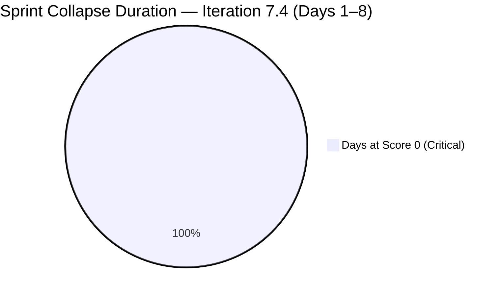
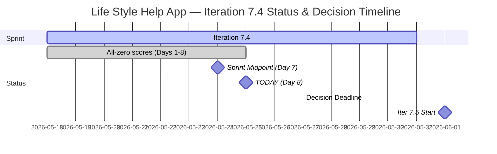

# Life Style Help App Team — SAFe Iteration Audit A62

**Audit Date:** 2026-05-25 09:00 PHT
**Auditor:** Claude Code (SAFe PM Consultant)
**Workspace:** `ado_ls_dev`
**ADO Board:** [Life Style Help App Team](https://dev.azure.com/jairo/Life%20Style%20Help%20App/_boards/board/t/Life%20Style%20Help%20App%20Team/Stories%20and%20Deliverables)

---

## 1. Audit Metadata

| Field | Value |
|-------|-------|
| Audit Number | A62 |
| Audit Date | 2026-05-25 |
| Audit Time | 09:00 PHT |
| Iteration | 7.4 |
| Iteration Dates | May 18 – May 31, 2026 |
| Sprint Day | Day 8 of 14 |
| ADO Project | Life Style Help App (`0f447778-7156-4451-ab21-27be3c4a5888`) |
| ADO Team | Life Style Help App Team (`a2a805bc-0b30-4ef3-9a8a-b7f3081157a6`) |
| Iteration ID | `85ef1e2d-7286-4593-9607-5b3df96255f4` |
| Prior Audit | AUDIT_20260524_0904.md (Score: 0.0 — Critical) |
| **Overall Score** | **0.0 / 100** |
| **Risk Band** | **Critical** |

> **Portfolio Note:** This workspace is excluded from portfolio-health and portfolio-meeting-prep aggregation per owner directive (2026-05-21). Individual audits continue per batch run policy.

---

## 2. Executive Summary

Iteration 7.4, **Day 8 of 14**. The Life Style Help App project enters the second half of the sprint in complete suspension. The Stories and Deliverables backlog returns **zero work items** for the eighth consecutive day; capacity API confirms no team capacity configured. All seven SAFe dimensions score 0, yielding an overall score of **0.0 / 100 (Critical)** — unchanged since Day 1.

With Day 8 now passed (sprint midpoint was Day 7), Iteration 7.4 is mathematically unrecoverable. No ADO activity has been observed in this project since prior to May 18. The sprint will close at 0% delivery with 0 items committed and 0 SP burned.

The decision deadline for Iteration 7.5 planning (Jun 1 start) is **May 27** — now 2 days away. If the project owner intends to reactivate this team in 7.5, planning must begin immediately.

> **Escalation Level: FINAL — Day 8 of 8 Post-Midpoint.** Eight consecutive zero-score audits. No recovery action observed. Owner decision is the only remaining path.

**Overall Score: 0.0 / 100 — Critical**

---

## 3. Previous Audit Delta

| Metric | 2026-05-24 (Audit A61) | 2026-05-25 (Audit A62) | Change |
|--------|------------------------|------------------------|--------|
| Sprint Day | Day 7 (Midpoint) | Day 8 | +1 |
| Items in Iteration | 0 | 0 | 0 |
| Capacity Configured | 0 | 0 | 0 |
| Story Points Committed | 0 SP | 0 SP | 0 |
| SP Closed | 0 | 0 | 0 |
| Recovery Action Observed | None | None | 0 |
| Owner Decision Signal | None detected | None detected | 0 |
| Overall Score | 0.0 | 0.0 | 0.0 |
| Risk Band | Critical | Critical | — |
| Days to Iter 7.5 Planning Deadline | 3 days | **2 days** | **−1** |

### Day 8 Assessment

No change from Day 7. The sprint has crossed its midpoint with no committed items, no capacity, and no observable ADO activity. The eight-day record is a consistent null signal: the project is in organizational pause, not active execution.

The singular time-sensitive event is the **May 27 planning deadline**: two days remain to initiate Iteration 7.5 planning if the project is to restart. Absent owner action by May 27, Iteration 7.5 will begin on June 1 with no plan, continuing the suspension pattern.

---

## 4. Current Iteration Snapshot

**Iteration 7.4** · May 18 – May 31, 2026 · **Day 8 of 14**

| Field | Value |
|-------|-------|
| Visible Root Backlog Items | **0** |
| Items in Iteration 7.4 | **0** |
| Total SP Committed | **0 SP** |
| Capacity Configured | **0** |
| Items Active | **0** |
| SP Burned | **0 SP** |
| Days Remaining in Sprint | 6 |
| Sprint Recovery Possible | **No** — mathematical impossibility |
| Next Feasible Sprint | Iteration 7.5 (Jun 1 – Jun 14, 2026) |
| Decision Deadline for 7.5 | **May 27, 2026 — 2 days** |

---

## 5. Work Item Analysis

No work items exist in the Life Style Help App Team's Stories and Deliverables backlog. No analysis is possible.

| Metric | Value |
|--------|-------|
| visible_root_backlog_items | 0 |
| current_iteration_root_items | 0 |
| contributors_with_current_work | 0 |
| contributors_with_capacity | 0 |
| point_eligible_current_items | 0 |
| estimated_current_items | 0 |
| dor_compliant_current_items | 0 |
| fresh_visible_root_items | 0 |
| stale_90_visible_root_items | 0 |
| stale_180_visible_root_items | 0 |
| committed_story_points | 0 |
| closed_story_points | 0 |

---

## 6. SAFe Compliance Scorecard

| Dimension | Score | Evidence | Notes |
|-----------|-------|----------|-------|
| D1 — Iteration Planning | 0.0 | 0/0 items — visible backlog = 0 | Formula: score 0 if visible = 0 |
| D2 — Team Capacity | 0.0 | 0 contributors; capacity API returns no data | No configured capacity |
| D3 — Estimation | 0.0 | 0/0 eligible items | Formula: score 0 if eligible = 0 |
| D4 — DoR Compliance | 0.0 | 0/0 items | Formula: score 0 if no items |
| D5 — Work Item Balance | 0.0 | No items — no User Story present | Formula: score 0 if no current items |
| D6 — Backlog Refinement | 0.0 | 0/0 items — fresh ratio undefined | Formula: score 0 if visible = 0 |
| D7 — Delivery Predictability | 0.0 | 0/0 SP committed | Formula: score 0 if committed = 0 |

**Overall Score: (0+0+0+0+0+0+0) / 7 = 0.0 / 100 — Critical**

---

## 7. Dimension Findings

### D1 through D7 — All Dimensions (0.0) 🔴

The backlog is empty. No capacity is configured. All seven dimensions score 0 by rubric formula. This is not a measurement error — the project is confirmed inactive. All work items were previously moved to Removed state (confirmed in Audit A58). No item creation or restoration has been observed in 8 audit days.

---

## 8. Risks and Bottlenecks

| Risk | Severity | Status |
|------|----------|--------|
| Day 8 past midpoint with 0 items, 0 capacity | **Critical** | Iteration 7.4 unrecoverable |
| All project backlog items in Removed state | **Critical** | Confirmed — no items to work |
| No team capacity configured for any member | **Critical** | 8th consecutive day |
| No owner decision on project disposition | **Critical** | Decision deadline: May 27 (2 days) |
| Iteration 7.5 planning window closes May 27 | **Critical** | If restarting, planning must begin by May 27 |
| Continued daily audit overhead on inactive project | High | 8 zero-score audits generated; diminishing analytical value |

---

## 9. Prioritized Recommendations

Sprint recovery for Iteration 7.4 is not possible. The only meaningful recommendations are forward-looking:

1. **Project Owner decision required by May 27 (2 days)** — Three options remain:
   - **(a) Formal pause — suspend audits:** Document in workspace CLAUDE.md. Archive Iteration 7.4 in ADO with a pause note. Suppress batch audits until explicit reactivation.
   - **(b) Re-launch in Iteration 7.5 (Jun 1–14):** Begin planning now. Create or restore work items, assign team members, configure capacity, define sprint goal. All items must pass DoR (description ≥30 chars + AC ≥20 chars) on Day 1.
   - **(c) Discontinuation:** Formally close the ADO project. Archive workspace CLAUDE.md. Remove from automated audit rotation.

2. **If restarting in Iteration 7.5 (action required by May 27):**
   - Sprint planning must produce: sprint goal, work items with full DoR, member assignment, capacity configuration
   - No carry-forward of Removed items without full DoR re-validation
   - Day 1 audit should show D1 > 0, D2 > 0, D3 > 0, D4 > 0

3. **Document the portfolio exclusion basis in ADO** — The portfolio exclusion directive (2026-05-21) is not reflected in any ADO project-level status field. Aligning ADO state with organizational decision improves traceability.

4. **Suppress from batch audits pending decision** — The `all-projects` batch run continues to generate this audit. Adding a `Project Exception` entry to the workspace CLAUDE.md (e.g., "Suppress audits from YYYY-MM-DD until [condition]") would prevent continued zero-score report generation.

---

## 10. Evidence Gaps and Limitations

| Gap | Impact | Notes |
|-----|--------|-------|
| All 7 dimensions score 0 | Full rubric failure | Confirmed project inactivity, not measurement error |
| Root cause of suspension unverifiable via API | Cannot distinguish temporary pause vs. discontinuation | Owner decision is required to classify |
| Team member roster unknown | D2 absent | No active assignees, no capacity |
| Owner decision status | Critical gap | No ADO or workspace signal detected in 8 days |
| Portfolio exclusion | Scope note | Excluded from portfolio-health and portfolio-meeting-prep per 2026-05-21 directive |

---

## Visualization

### Score Trend (Iteration 7.4, All Days)

| Date | Audit | Score | Band | Sprint Day |
|------|-------|-------|------|-----------|
| May 18 | A55 | 0.0 | Critical | Day 1 |
| May 19 | A56 | 0.0 | Critical | Day 2 |
| May 20 | A57 | 0.0 | Critical | Day 3 |
| May 21 | A58 | 0.0 | Critical | Day 4 |
| May 22 | A59 | 0.0 | Critical | Day 5 |
| May 23 | A60 | 0.0 | Critical | Day 6 |
| May 24 | A61 | 0.0 | Critical | Day 7 (Midpoint) |
| **May 25** | **A62** | **0.0** | **Critical** | **Day 8** |

Eight consecutive Critical scores. No trend movement. Iteration 7.4 will close at 0% delivery. Decision deadline is May 27.

---

*Audit generated by Claude Code (claude-sonnet-4-6) on 2026-05-25. Evidence sourced from Azure DevOps MCP (Life Style Help App project). Rubric: SAFe 6.0 7-dimension scorecard. Note: This workspace is excluded from portfolio-level aggregation per portfolio-health exclusion policy (2026-05-21).*
