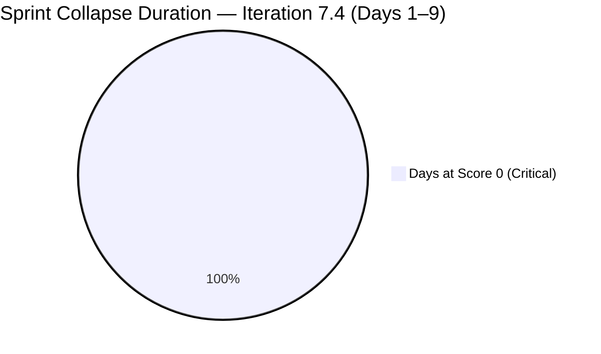
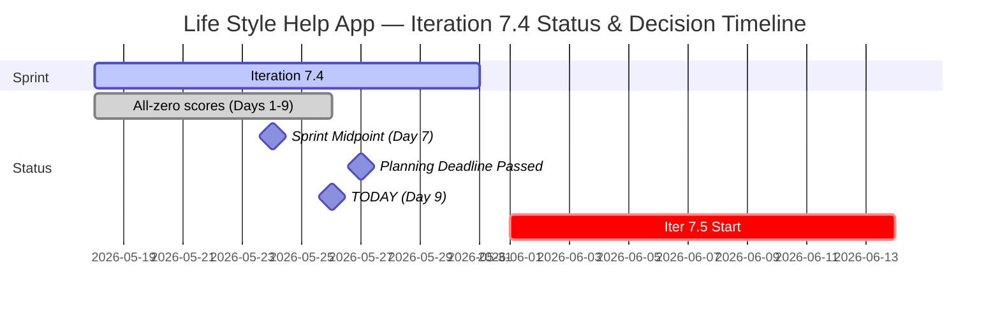

# Life Style Help App Team — SAFe Iteration Audit A63

**Audit Date:** 2026-05-26 02:03 PHT
**Auditor:** Claude Code (SAFe PM Consultant)
**Workspace:** `ado_ls_dev`
**ADO Board:** [Life Style Help App Team](https://dev.azure.com/jairo/Life%20Style%20Help%20App/_boards/board/t/Life%20Style%20Help%20App%20Team/Stories%20and%20Deliverables)

---

## 1. Audit Metadata

| Field | Value |
|-------|-------|
| Audit Number | A63 |
| Audit Date | 2026-05-26 |
| Audit Time | 02:03 PHT |
| Iteration | 7.4 |
| Iteration Dates | May 18 – May 31, 2026 |
| Sprint Day | Day 9 of 14 |
| ADO Project | Life Style Help App (`0f447778-7156-4451-ab21-27be3c4a5888`) |
| ADO Team | Life Style Help App Team (`a2a805bc-0b30-4ef3-9a8a-b7f3081157a6`) |
| Iteration ID | `85ef1e2d-7286-4593-9607-5b3df96255f4` |
| Prior Audit | AUDIT_20260525_0900.md (Score: 0.0 — Critical) |
| **Overall Score** | **0.0 / 100** |
| **Risk Band** | **Critical** |

> **Portfolio Note:** This workspace is excluded from portfolio-health and portfolio-meeting-prep aggregation per owner directive (2026-05-21). Individual audits continue per batch run policy.

---

## 2. Executive Summary

Iteration 7.4, **Day 9 of 14**. The Life Style Help App project enters the second half of the sprint in complete suspension for the ninth consecutive day. The iteration backlog returns **zero work items**; team capacity API returns no data. All seven SAFe dimensions score 0, yielding an overall score of **0.0 / 100 (Critical)** — unchanged since Day 1.

With Day 9 of 14 now passed and the sprint midpoint behind us, Iteration 7.4 is mathematically unrecoverable. No ADO activity has been detected in this project since before May 18.

**The Iteration 7.5 planning deadline has passed (May 27 was yesterday)**. If the owner intended to restart the project in Iteration 7.5 (Jun 1–14), that planning window has now closed without any recorded action. The project is effectively entering a second consecutive zero-delivery sprint unless an immediate intervention occurs.

> **Escalation Level: CRITICAL — Day 9 Post-Midpoint.** Planning deadline for Iter 7.5 has now passed. Owner action is the only path forward.

**Overall Score: 0.0 / 100 — Critical**

---

## 3. Previous Audit Delta

| Metric | 2026-05-25 (Audit A62) | 2026-05-26 (Audit A63) | Change |
|--------|------------------------|------------------------|--------|
| Sprint Day | Day 8 | Day 9 | +1 |
| Items in Iteration | 0 | 0 | 0 |
| Capacity Configured | 0 | 0 | 0 |
| Story Points Committed | 0 SP | 0 SP | 0 |
| SP Closed | 0 | 0 | 0 |
| Recovery Action Observed | None | None | 0 |
| Owner Decision Signal | None detected | None detected | 0 |
| Overall Score | 0.0 | 0.0 | 0.0 |
| Risk Band | Critical | Critical | — |
| Iteration 7.5 Planning Deadline | 2 days | **PASSED** (May 27) | **Deadline expired** |

### Day 9 Assessment

No change from Day 8. The sprint has passed its midpoint with no committed items, no capacity, and no observable ADO activity. The **May 27 planning deadline has now passed** without any recorded action in ADO. This means:

1. Iteration 7.4 will end at 0% delivery (May 31)
2. Iteration 7.5 begins June 1 with no plan, no committed items, and no configured capacity unless emergency planning is conducted before June 1
3. The project faces a **second consecutive zero-delivery sprint** unless the owner initiates sprint planning within the next 5 days (before June 1)

---

## 4. Current Iteration Snapshot

**Iteration 7.4** · May 18 – May 31, 2026 · **Day 9 of 14**

| Field | Value |
|-------|-------|
| Visible Root Backlog Items | **0** |
| Items in Iteration 7.4 | **0** |
| Total SP Committed | **0 SP** |
| Capacity Configured | **0** |
| Items Active | **0** |
| SP Burned | **0 SP** |
| Days Remaining in Sprint | 5 |
| Sprint Recovery Possible | **No** — mathematical impossibility |
| Iter 7.5 Planning Deadline | **PASSED (May 27)** |
| Next Feasible Sprint | Iteration 7.5 (Jun 1 – Jun 14, 2026) |
| Days to Iteration 7.5 Start | **5 days** |

---

## 5. Work Item Analysis

No work items exist in the Life Style Help App Team's Stories and Deliverables backlog. No analysis is possible.

| Metric | Value |
|--------|-------|
| visible_root_backlog_items | 0 |
| current_iteration_root_items | 0 |
| contributors_with_current_work | 0 |
| contributors_with_capacity | 0 |
| point_eligible_current_items | 0 |
| estimated_current_items | 0 |
| dor_compliant_current_items | 0 |
| fresh_visible_root_items | 0 |
| stale_90_visible_root_items | 0 |
| stale_180_visible_root_items | 0 |
| committed_story_points | 0 |
| closed_story_points | 0 |

---

## 6. SAFe Compliance Scorecard

| Dimension | Score | Evidence | Notes |
|-----------|-------|----------|-------|
| D1 — Iteration Planning | 0.0 | 0/0 items — visible backlog = 0 | Formula: score 0 if visible = 0 |
| D2 — Team Capacity | 0.0 | 0 contributors; capacity API returns no data | No configured capacity |
| D3 — Estimation | 0.0 | 0/0 eligible items | Formula: score 0 if eligible = 0 |
| D4 — DoR Compliance | 0.0 | 0/0 items | Formula: score 0 if no items |
| D5 — Work Item Balance | 0.0 | No items — no User Story present | Formula: score 0 if no current items |
| D6 — Backlog Refinement | 0.0 | 0/0 items — fresh ratio undefined | Formula: score 0 if visible = 0 |
| D7 — Delivery Predictability | 0.0 | 0/0 SP committed | Formula: score 0 if committed = 0 |

**Overall Score: (0+0+0+0+0+0+0) / 7 = 0.0 / 100 — Critical**

---

## 7. Dimension Findings

### D1 through D7 — All Dimensions (0.0) 🔴

The backlog is empty. No capacity is configured. All seven dimensions score 0 by rubric formula. This is not a measurement error — the project is confirmed inactive. All work items were previously moved to Removed state (confirmed in Audit A58). No item creation or restoration has been observed in 9 audit days.

---

## 8. Risks and Bottlenecks

| Risk | Severity | Status |
|------|----------|--------|
| Day 9 past midpoint with 0 items, 0 capacity | **Critical** | Iteration 7.4 unrecoverable (9/14 days complete) |
| All project backlog items in Removed state | **Critical** | Confirmed — no items to work |
| No team capacity configured for any member | **Critical** | 9th consecutive day |
| No owner decision on project disposition | **Critical** | Decision deadline passed (May 27) |
| Iteration 7.5 planning window expires June 1 | **Critical** | Emergency planning must begin NOW; 5 days remain |
| Second consecutive zero-delivery sprint incoming | **Critical** | Iter 7.5 will be blank unless owner acts before June 1 |
| Continued daily audit overhead on inactive project | High | 9 zero-score audits generated; analytical value near zero |

---

## 9. Prioritized Recommendations

Sprint recovery for Iteration 7.4 is not possible. The planning deadline for Iteration 7.5 has passed. The only actionable path is an emergency owner decision within the next 5 days:

1. **Immediate owner decision required (before June 1, 5 days)** — Three options remain:

   - **(a) Emergency restart for Iteration 7.5 (preferred if active):** Begin planning NOW. Create work items, assign team members, configure capacity, define sprint goal. Day 1 of Iter 7.5 (June 1) must show: D1 > 0, D2 > 0, D3 > 0, D4 > 0. All items must pass DoR (description ≥30 chars + AC ≥20 chars) before commitment.

   - **(b) Formal pause — suspend audits:** Document in workspace CLAUDE.md with a pause start date and reactivation condition. Archive Iteration 7.4 in ADO with a pause note. Remove from automated audit batch until explicit reactivation signal.

   - **(c) Project discontinuation:** Formally close the ADO project. Archive workspace CLAUDE.md. Remove from audit rotation permanently.

2. **If restarting in Iteration 7.5 (June 1–14) — emergency planning checklist:**
   - Sprint goal statement (1 sentence)
   - Work items created with full DoR (description ≥30 chars, AC ≥20 chars)
   - All items assigned to team members
   - Capacity configured per sprint (hours/day, activities)
   - No carry-forward of Removed items without full DoR re-validation

3. **Suppress from batch audits pending decision** — The `all-projects` batch run continues to generate this audit. Adding a `Project Exception` entry to the workspace CLAUDE.md (e.g., "Suppress audits from 2026-05-26 until explicit reactivation") would prevent continued zero-score report generation.

4. **Document the portfolio exclusion in ADO** — The portfolio exclusion directive (2026-05-21) is not reflected in the ADO project-level status. This misalignment should be corrected for transparency.

---

## 10. Evidence Gaps and Limitations

| Gap | Impact | Notes |
|-----|--------|-------|
| All 7 dimensions score 0 | Full rubric failure | Confirmed project inactivity, not measurement error |
| Root cause of suspension unverifiable via API | Cannot classify status | Owner decision required |
| Team member roster unknown | D2 absent | No active assignees, no capacity |
| Owner decision status | Critical gap | No ADO or workspace signal detected in 9 days |
| Portfolio exclusion | Scope note | Excluded from portfolio-health and portfolio-meeting-prep per 2026-05-21 directive |
| Iter 7.5 planning deadline | Critical — passed | May 27 deadline expired without ADO activity |

---

## Visualization

### Score Trend (Iteration 7.4, All Days)

| Date | Audit | Score | Band | Sprint Day |
|------|-------|-------|------|-----------|
| May 18 | A55 | 0.0 | Critical | Day 1 |
| May 19 | A56 | 0.0 | Critical | Day 2 |
| May 20 | A57 | 0.0 | Critical | Day 3 |
| May 21 | A58 | 0.0 | Critical | Day 4 |
| May 22 | A59 | 0.0 | Critical | Day 5 |
| May 23 | A60 | 0.0 | Critical | Day 6 |
| May 24 | A61 | 0.0 | Critical | Day 7 (Midpoint) |
| May 25 | A62 | 0.0 | Critical | Day 8 |
| **May 26** | **A63** | **0.0** | **Critical** | **Day 9** |

Nine consecutive Critical scores. No trend movement. Iteration 7.4 will close at 0% delivery. Planning deadline for Iter 7.5 has passed. Emergency action required by May 31.

---

*Audit generated by Claude Code (claude-sonnet-4-6) on 2026-05-26. Evidence sourced from Azure DevOps MCP (Life Style Help App project). Rubric: SAFe 6.0 7-dimension scorecard. Note: This workspace is excluded from portfolio-level aggregation per portfolio-health exclusion policy (2026-05-21).*
