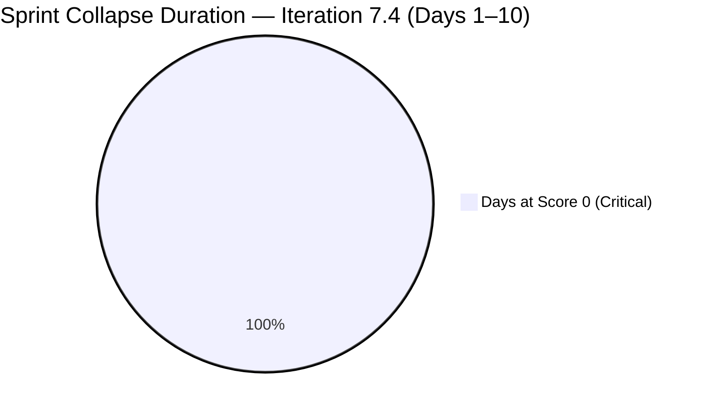
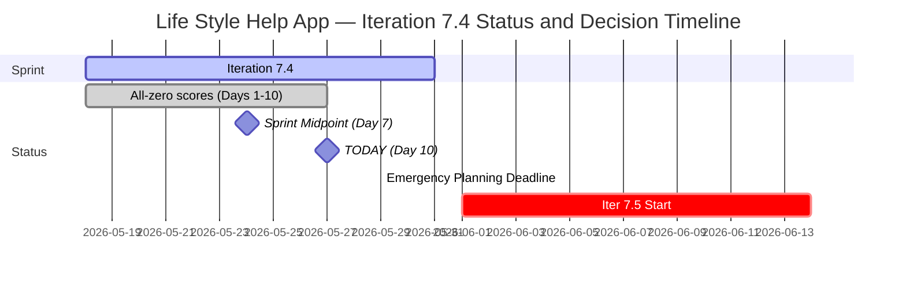

# Life Style Help App Team — SAFe Iteration Audit A64

**Audit Date:** 2026-05-27 09:03 UTC
**Auditor:** Claude Code (SAFe PM Consultant)
**Workspace:** `ado_ls_dev`
**ADO Board:** [Life Style Help App Team](https://dev.azure.com/jairo/Life%20Style%20Help%20App/_boards/board/t/Life%20Style%20Help%20App%20Team/Stories%20and%20Deliverables)

---

## 1. Audit Metadata

| Field | Value |
|-------|-------|
| Audit Number | A64 |
| Audit Date | 2026-05-27 |
| Audit Time | 09:03 UTC |
| Iteration | 7.4 |
| Iteration Dates | May 18 – May 31, 2026 |
| Sprint Day | Day 10 of 14 |
| ADO Project | Life Style Help App (`0f447778-7156-4451-ab21-27be3c4a5888`) |
| ADO Team | Life Style Help App Team (`a2a805bc-0b30-4ef3-9a8a-b7f3081157a6`) |
| Iteration ID | `85ef1e2d-7286-4593-9607-5b3df96255f4` |
| Prior Audit | AUDIT_20260526_0203.md (Score: 0.0 — Critical) |
| **Overall Score** | **0.0 / 100** |
| **Risk Band** | **Critical** |

> **Portfolio Note:** This workspace is excluded from portfolio-health and portfolio-meeting-prep aggregation per owner directive (2026-05-21). Individual audits continue per batch run policy.

---

## 2. Executive Summary

Iteration 7.4, **Day 10 of 14**. The Life Style Help App project remains completely inactive for the tenth consecutive day. The iteration backlog returns **zero work items**; team capacity API returns no data. All seven SAFe dimensions score 0, yielding an overall score of **0.0 / 100 (Critical)** — unchanged since Day 1 of this sprint.

With Day 10 now complete and only 4 working days remaining (Days 11–14), Iteration 7.4 is confirmed unrecoverable. No ADO activity has been detected since before May 18.

**Iteration 7.5 (June 1–14):** Today is the last practical planning date before Iteration 7.5 begins. The planning deadline (informally May 27) has passed without any recorded ADO action. Emergency sprint planning must begin by **May 29 at the latest** if Iteration 7.5 is to open with any committed items.

> **Escalation Level: CRITICAL — Day 10.** Four days remaining in a blank sprint. Iteration 7.5 begins June 1. No planning has occurred. Immediate owner action is required.

**Overall Score: 0.0 / 100 — Critical**

---

## 3. Previous Audit Delta

| Metric | 2026-05-26 (Audit A63) | 2026-05-27 (Audit A64) | Change |
|--------|------------------------|------------------------|--------|
| Sprint Day | Day 9 | Day 10 | +1 |
| Items in Iteration | 0 | 0 | 0 |
| Capacity Configured | 0 | 0 | 0 |
| Story Points Committed | 0 SP | 0 SP | 0 |
| SP Closed | 0 | 0 | 0 |
| Recovery Action Observed | None | None | 0 |
| Owner Decision Signal | None detected | None detected | 0 |
| Overall Score | 0.0 | 0.0 | 0.0 |
| Risk Band | Critical | Critical | — |
| Days to Iter 7.5 Start | 6 days | **5 days** | −1 |

### Day 10 Assessment

No change from Day 9. The sprint has passed its midpoint with no committed items, no capacity, and no observable ADO activity. The stated planning deadline for Iteration 7.5 (May 27) has now arrived with zero ADO action recorded.

**Final realistic window for Iteration 7.5 planning:**
- May 27 (today): Emergency planning window opens
- May 29 (Fri): Last business day before the long weekend
- June 1 (Mon): Iteration 7.5 start date

If no planning occurs by May 29, Iteration 7.5 will open blank — a second consecutive zero-delivery sprint.

---

## 4. Current Iteration Snapshot

**Iteration 7.4** · May 18 – May 31, 2026 · **Day 10 of 14**

| Field | Value |
|-------|-------|
| Visible Root Backlog Items | **0** |
| Items in Iteration 7.4 | **0** |
| Total SP Committed | **0 SP** |
| Capacity Configured | **0** |
| Items Active | **0** |
| SP Burned | **0 SP** |
| Days Remaining in Sprint | 4 |
| Sprint Recovery Possible | **No** — 10 days elapsed with 0 items |
| Iter 7.5 Start | June 1, 2026 |
| Days to Iter 7.5 Start | 5 days |
| Emergency Planning Deadline | **May 29, 2026 (2 days)** |

---

## 5. Work Item Analysis

No work items exist in the Life Style Help App Team's Stories and Deliverables backlog. No analysis is possible.

| Metric | Value |
|--------|-------|
| visible_root_backlog_items | 0 |
| current_iteration_root_items | 0 |
| contributors_with_current_work | 0 |
| contributors_with_capacity | 0 |
| point_eligible_current_items | 0 |
| estimated_current_items | 0 |
| dor_compliant_current_items | 0 |
| fresh_visible_root_items | 0 |
| stale_90_visible_root_items | 0 |
| stale_180_visible_root_items | 0 |
| committed_story_points | 0 |
| closed_story_points | 0 |

---

## 6. SAFe Compliance Scorecard

| Dimension | Score | Evidence | Notes |
|-----------|-------|----------|-------|
| D1 — Iteration Planning | 0.0 | 0/0 items — visible backlog = 0 | Formula: score 0 if visible_root_backlog_items = 0 |
| D2 — Team Capacity | 0.0 | 0 contributors; capacity API returns no data | No configured capacity |
| D3 — Estimation | 0.0 | 0/0 eligible items | Formula: score 0 if point_eligible = 0 |
| D4 — DoR Compliance | 0.0 | 0/0 items | Formula: score 0 if no current items |
| D5 — Work Item Balance | 0.0 | No items — no User Story present | Formula: score 0 if no current_iteration_root_items |
| D6 — Backlog Refinement | 0.0 | 0/0 items — fresh ratio undefined | Formula: score 0 if visible_root_backlog_items = 0 |
| D7 — Delivery Predictability | 0.0 | 0/0 SP committed | Formula: score 0 if committed_story_points = 0 |

**Overall Score: (0+0+0+0+0+0+0) / 7 = 0.0 / 100 — Critical**

---

## 7. Dimension Findings

### D1 through D7 — All Dimensions (0.0) 🔴

The backlog is empty. No capacity is configured. All seven dimensions score 0 by rubric formula. This is not a measurement error — the project is confirmed inactive for a tenth consecutive sprint day. All work items were previously moved to Removed state (confirmed in Audit A58, May 21). No item creation, restoration, or capacity configuration has been observed in 10 audit days.

---

## 8. Risks and Bottlenecks

| Risk | Severity | Status |
|------|----------|--------|
| Day 10 with 0 items, 0 capacity, 0 activity | **Critical** | Iteration 7.4 unrecoverable (10/14 days complete) |
| All project backlog items remain in Removed state | **Critical** | Confirmed in prior audits; no restoration observed |
| No team capacity configured | **Critical** | 10th consecutive zero-capacity day |
| No owner decision on project disposition | **Critical** | Deadline passed; no ADO or workspace signal |
| Emergency planning deadline: May 29 (2 days) | **Critical** | Last chance for Iter 7.5 to open with committed items |
| Second consecutive zero-delivery sprint incoming | **Critical** | Iter 7.5 begins June 1 with no plan if action not taken |
| Continued daily audit overhead on inactive project | High | 10 zero-score audits generated since May 18; analytical value = 0 |

---

## 9. Prioritized Recommendations

Sprint recovery for Iteration 7.4 is mathematically impossible. Iteration 7.5 begins in 5 days. The only path forward is immediate owner action:

1. **Emergency decision required by May 29 (2 days)** — Three options remain:

   - **(a) Emergency restart for Iteration 7.5 (June 1–14, preferred if active):** Begin planning NOW. Create work items with full DoR, assign team members, configure capacity, define sprint goal. The minimum viable Iteration 7.5 start requires: at least 1 work item, 1 assignee, 1 capacity entry, and a sprint goal statement.

   - **(b) Formal pause with reactivation conditions:** Document the pause in workspace CLAUDE.md with: pause start date (May 18 or earlier), reactivation trigger (e.g., "upon completion of BRD/PRD review"), and estimated reactivation date. This stops the zero-score audit series.

   - **(c) Project discontinuation:** Formally close the ADO project. Archive workspace CLAUDE.md. Remove from audit rotation permanently. Acknowledge in ADO with a closure note and date.

2. **Minimum Viable Iteration 7.5 checklist (if restarting):**
   - Sprint goal statement (1–2 sentences)
   - At least 3–5 work items created with:
     - Description ≥ 30 non-whitespace characters
     - Acceptance Criteria ≥ 20 non-whitespace characters
     - Story Points assigned
     - Assignee set
   - Capacity configured for at least one team member
   - Items moved to Active state (not left in New)

3. **Update workspace CLAUDE.md with current status** — The workspace CLAUDE.md has no entry reflecting the suspension that began before May 18. Adding a `Project Exceptions` entry would allow automated audit tools to handle this workspace appropriately and give auditors context without re-investigating every day.

4. **Suppress from batch audits pending decision** — The current audit run continues to generate this zero-score report. If a formal pause or discontinuation decision is made, add a `Project Exceptions` entry to workspace CLAUDE.md (e.g., "Suppress audits from 2026-05-27 until reactivation") to stop the zero-score series.

---

## 10. Evidence Gaps and Limitations

| Gap | Impact | Notes |
|-----|--------|-------|
| All 7 dimensions score 0 | Full rubric failure | Confirmed project inactivity — not a measurement error |
| Root cause of suspension unverifiable via API | Cannot classify status | Owner decision required |
| Team member roster unknown | D2 absent | No active assignees; no capacity data |
| Owner decision status | Critical gap | No ADO or workspace signal detected in 10 days |
| Portfolio exclusion | Scope note | Excluded from portfolio-health and portfolio-meeting-prep per 2026-05-21 directive |
| Emergency planning deadline | Critical | May 29 is the last business day before Iter 7.5 opens |

---

## Visualization

### Score Trend (Iteration 7.4, All Days)

| Date | Audit | Score | Band | Sprint Day |
|------|-------|-------|------|-----------|
| May 18 | A55 | 0.0 | Critical | Day 1 |
| May 19 | A56 | 0.0 | Critical | Day 2 |
| May 20 | A57 | 0.0 | Critical | Day 3 |
| May 21 | A58 | 0.0 | Critical | Day 4 |
| May 22 | A59 | 0.0 | Critical | Day 5 |
| May 23 | A60 | 0.0 | Critical | Day 6 |
| May 24 | A61 | 0.0 | Critical | Day 7 (Midpoint) |
| May 25 | A62 | 0.0 | Critical | Day 8 |
| May 26 | A63 | 0.0 | Critical | Day 9 |
| **May 27** | **A64** | **0.0** | **Critical** | **Day 10** |

Ten consecutive Critical scores. Iteration 7.4 will close at 0% delivery on May 31. Emergency planning must begin by May 29 for Iteration 7.5 to avoid becoming a second consecutive blank sprint.

---

*Audit generated by Claude Code (claude-sonnet-4-6) on 2026-05-27. Evidence sourced from Azure DevOps MCP (Life Style Help App project). Rubric: SAFe 6.0 7-dimension scorecard. Note: This workspace is excluded from portfolio-level aggregation per portfolio-health exclusion policy (2026-05-21).*
