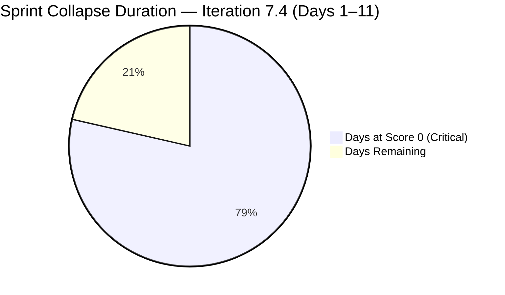
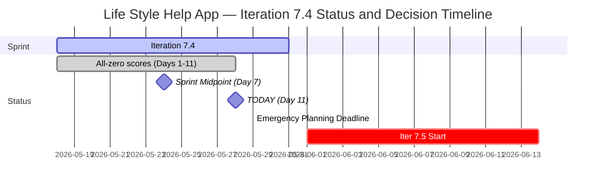

# Life Style Help App Team — SAFe Iteration Audit A65

**Audit Date:** 2026-05-28 02:04 UTC
**Auditor:** Claude Code (SAFe PM Consultant)
**Workspace:** `ado_ls_dev`
**ADO Board:** [Life Style Help App Team](https://dev.azure.com/jairo/Life%20Style%20Help%20App/_boards/board/t/Life%20Style%20Help%20App%20Team/Stories%20and%20Deliverables)

---

## 1. Audit Metadata

| Field | Value |
|-------|-------|
| Audit Number | A65 |
| Audit Date | 2026-05-28 |
| Audit Time | 02:04 UTC |
| Iteration | 7.4 |
| Iteration Dates | May 18 – May 31, 2026 |
| Sprint Day | Day 11 of 14 |
| ADO Project | Life Style Help App (`0f447778-7156-4451-ab21-27be3c4a5888`) |
| ADO Team | Life Style Help App Team (`a2a805bc-0b30-4ef3-9a8a-b7f3081157a6`) |
| Iteration ID | `85ef1e2d-7286-4593-9607-5b3df96255f4` |
| Prior Audit | AUDIT_20260527_0903.md (Score: 0.0 — Critical) |
| **Overall Score** | **0.0 / 100** |
| **Risk Band** | **Critical** |

> **Portfolio Note:** This workspace is excluded from portfolio-health and portfolio-meeting-prep aggregation per owner directive (2026-05-21). Individual audits continue per batch run policy.

---

## 2. Executive Summary

Iteration 7.4, **Day 11 of 14**. The Life Style Help App project remains completely inactive for the **eleventh consecutive day**. The backlog returns zero items; team capacity API returns no data. All seven SAFe dimensions score 0, yielding an overall score of **0.0 / 100 (Critical)** — unchanged since Day 1.

**Iteration 7.4 is now mathematically unrecoverable** — 11 of 14 sprint days have elapsed with zero items committed, zero SP delivered, and zero ADO activity. The project will close at 0% delivery on May 31, 2026.

**Iteration 7.5 begins in 4 days (June 1).** The emergency planning deadline previously identified as May 29 is now **3 days away**. If no planning action is taken by May 29, Iteration 7.5 will open as a second consecutive blank sprint.

No owner decision signal has been detected in any of the 11 daily audits conducted since May 18.

> **Escalation Level: CRITICAL — Day 11.** Three days remain in a blank sprint. Iteration 7.5 starts June 1. Emergency planning window closes May 29. Immediate owner action required.

**Overall Score: 0.0 / 100 — Critical**

---

## 3. Previous Audit Delta

| Metric | 2026-05-27 (Audit A64) | 2026-05-28 (Audit A65) | Change |
|--------|------------------------|------------------------|--------|
| Sprint Day | Day 10 | Day 11 | +1 |
| Items in Iteration | 0 | 0 | 0 |
| Capacity Configured | 0 | 0 | 0 |
| Story Points Committed | 0 SP | 0 SP | 0 |
| SP Closed | 0 | 0 | 0 |
| Recovery Action Observed | None | None | 0 |
| Owner Decision Signal | None detected | None detected | 0 |
| Overall Score | 0.0 | 0.0 | 0.0 |
| Risk Band | Critical | Critical | — |
| Days to Iter 7.5 Start | 5 days | **4 days** | −1 |
| Emergency Planning Deadline | 2 days | **3 days** | — (May 29) |
| Sprint Days Remaining | 4 | **3** | −1 |

### Day 11 Assessment

No change from Day 10. Eleven consecutive days of zero activity. The emergency planning deadline (May 29) is now 1 day closer. Sprint recovery is mathematically impossible — zero items cannot be delivered in 3 remaining days with no backlog.

**Decision countdown:**
- May 29 (2 days): **Last business day before long weekend** — emergency planning or formal pause decision must be made
- June 1 (4 days): Iteration 7.5 start — will open blank if no action taken
- May 31 (3 days): Sprint end — Iteration 7.4 closes at 0.0/100

---

## 4. Current Iteration Snapshot

**Iteration 7.4** · May 18 – May 31, 2026 · **Day 11 of 14**

| Field | Value |
|-------|-------|
| Visible Root Backlog Items | **0** |
| Items in Iteration 7.4 | **0** |
| Total SP Committed | **0 SP** |
| Capacity Configured | **0** |
| Items Active | **0** |
| SP Burned | **0 SP** |
| Sprint Days Elapsed | 11 |
| Sprint Days Remaining | **3** |
| Sprint Recovery Possible | **No** — 11 days elapsed, 0 items |
| Iter 7.5 Start | June 1, 2026 |
| Days to Iter 7.5 Start | 4 days |
| Emergency Planning Deadline | **May 29, 2026 (1 business day)** |

---

## 5. Work Item Analysis

No work items exist in the Life Style Help App Team's Stories and Deliverables backlog. The ADO backlog API returns an empty array. No analysis is possible.

| Metric | Value |
|--------|-------|
| visible_root_backlog_items | 0 |
| current_iteration_root_items | 0 |
| contributors_with_current_work | 0 |
| contributors_with_capacity | 0 |
| point_eligible_current_items | 0 |
| estimated_current_items | 0 |
| dor_compliant_current_items | 0 |
| fresh_visible_root_items | 0 |
| stale_90_visible_root_items | 0 |
| stale_180_visible_root_items | 0 |
| committed_story_points | 0 |
| closed_story_points | 0 |

---

## 6. SAFe Compliance Scorecard

| Dimension | Score | Evidence | Notes |
|-----------|-------|----------|-------|
| D1 — Iteration Planning | 0.0 | 0/0 items — visible backlog = 0 | Formula: score 0 if visible_root_backlog_items = 0 |
| D2 — Team Capacity | 0.0 | 0 contributors; capacity API returns no data | No configured capacity; API confirms team capacity absent |
| D3 — Estimation | 0.0 | 0/0 eligible items | Formula: score 0 if point_eligible = 0 |
| D4 — DoR Compliance | 0.0 | 0/0 items | Formula: score 0 if no current items |
| D5 — Work Item Balance | 0.0 | No items — no User Story present | Formula: score 0 if no current_iteration_root_items |
| D6 — Backlog Refinement | 0.0 | 0/0 items — backlog empty | Formula: score 0 if visible_root_backlog_items = 0 |
| D7 — Delivery Predictability | 0.0 | 0/0 SP committed | Formula: score 0 if committed_story_points = 0 |

**Overall Score: (0+0+0+0+0+0+0) / 7 = 0.0 / 100 — Critical**

---

## 7. Dimension Findings

### D1 through D7 — All Dimensions (0.0) 🔴

The backlog is empty. No capacity is configured. All seven dimensions score 0 by rubric formula. This is confirmed project inactivity — not a measurement error. All work items remain in Removed state (confirmed Audit A58, May 21). No item creation, restoration, or capacity configuration has been observed in 11 audit days.

The ADO API independently confirms:
- `wit_list_backlog_work_items`: returns empty array
- `wit_get_work_items_for_iteration`: returns empty array
- `work_get_team_capacity`: returns error "No team capacity assigned to the team"

---

## 8. Risks and Bottlenecks

| Risk | Severity | Status |
|------|----------|--------|
| Day 11 with 0 items, 0 capacity, 0 activity | **Critical** | Iteration 7.4 unrecoverable (11/14 days complete) |
| All project backlog items remain in Removed state | **Critical** | Confirmed in prior audits; no restoration observed |
| No team capacity configured | **Critical** | 11th consecutive zero-capacity day |
| No owner decision on project disposition | **Critical** | May 29 deadline; no ADO or workspace signal in 11 days |
| Emergency planning deadline: May 29 (1 business day) | **Critical** | Last chance for Iter 7.5 to open with committed items |
| Second consecutive zero-delivery sprint incoming | **Critical** | Iter 7.5 starts June 1 with no plan if action not taken |
| 11 consecutive zero-score audits | High | Sustained critical risk; analytical value = 0 per daily cycle |

---

## 9. Prioritized Recommendations

Sprint recovery for Iteration 7.4 is mathematically impossible. Iteration 7.5 begins in 4 days. The only path forward is immediate owner action. The May 29 deadline is now **1 business day away**.

1. **Emergency decision required by May 29 (TOMORROW)** — Three options remain:

   **(a) Emergency restart for Iteration 7.5 (June 1–14, preferred if active):**
   - Begin planning immediately
   - Create work items with full DoR (Description ≥30 chars, AC ≥20 chars, SP assigned)
   - Assign team members and configure capacity
   - Define a sprint goal
   - Minimum viable Iteration 7.5 start: at least 1 work item, 1 assignee, 1 capacity entry

   **(b) Formal pause with reactivation conditions:**
   - Document in workspace CLAUDE.md: pause start date (May 18 or earlier), reactivation trigger, estimated reactivation date
   - Add a `Project Exceptions` entry to stop the zero-score audit series
   - Communicate status to stakeholders

   **(c) Project discontinuation:**
   - Formally close the ADO project
   - Archive workspace CLAUDE.md with closure note and date
   - Remove from audit rotation permanently

2. **Update workspace CLAUDE.md with current status (regardless of path chosen)** — The workspace has no entry reflecting the suspension that began before May 18. Adding a `Project Exceptions` entry would immediately provide context to the audit system and prevent repeated escalation.

3. **Minimum Viable Iteration 7.5 checklist (if restarting):**
   - Sprint goal statement (1–2 sentences)
   - At least 3–5 work items with:
     - Description ≥ 30 non-whitespace characters
     - Acceptance Criteria ≥ 20 non-whitespace characters
     - Story Points assigned
     - Assignee set
   - Capacity configured for at least one team member
   - Items in Active state (not left in New)

---

## 10. Evidence Gaps and Limitations

| Gap | Impact | Notes |
|-----|--------|-------|
| All 7 dimensions score 0 | Full rubric failure | Confirmed project inactivity — not measurement error |
| Root cause of suspension unverifiable via API | Cannot classify status | Owner decision required |
| Team member roster unknown | D2 absent | No active assignees; no capacity data |
| Owner decision status | Critical gap | No ADO or workspace signal detected in 11 days |
| Portfolio exclusion | Scope note | Excluded from portfolio-health per 2026-05-21 directive |

---

## Visualization

### Score Trend (Iteration 7.4, All Days)

| Date | Audit | Score | Band | Sprint Day |
|------|-------|-------|------|-----------|
| May 18 | A55 | 0.0 | Critical | Day 1 |
| May 19 | A56 | 0.0 | Critical | Day 2 |
| May 20 | A57 | 0.0 | Critical | Day 3 |
| May 21 | A58 | 0.0 | Critical | Day 4 |
| May 22 | A59 | 0.0 | Critical | Day 5 |
| May 23 | A60 | 0.0 | Critical | Day 6 |
| May 24 | A61 | 0.0 | Critical | Day 7 (Midpoint) |
| May 25 | A62 | 0.0 | Critical | Day 8 |
| May 26 | A63 | 0.0 | Critical | Day 9 |
| May 27 | A64 | 0.0 | Critical | Day 10 |
| **May 28** | **A65** | **0.0** | **Critical** | **Day 11** |

Eleven consecutive Critical scores. Iteration 7.4 will close at 0% delivery on May 31. Emergency planning decision required by May 29 for Iteration 7.5 to avoid a second consecutive blank sprint.

---

*Audit generated by Claude Code (claude-sonnet-4-6) on 2026-05-28. Evidence sourced from Azure DevOps MCP (Life Style Help App project). Rubric: SAFe 6.0 7-dimension scorecard. This workspace is excluded from portfolio-level aggregation per portfolio-health exclusion policy (2026-05-21).*
