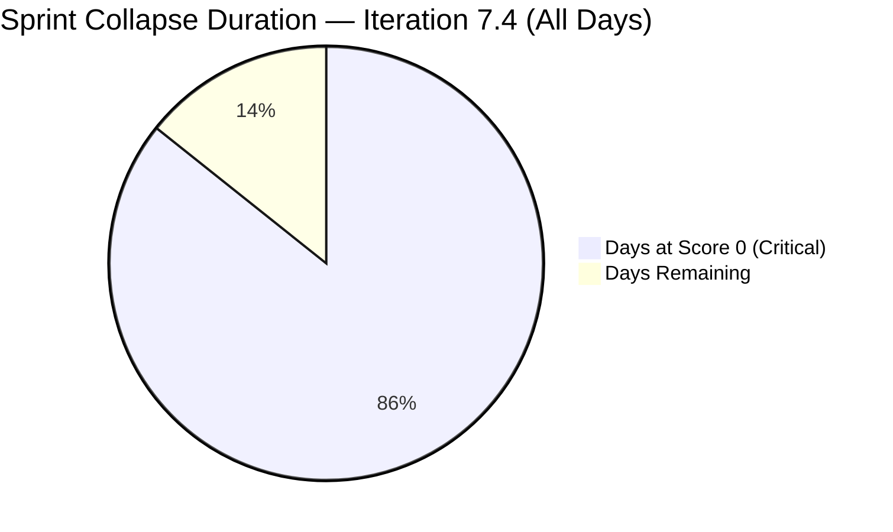
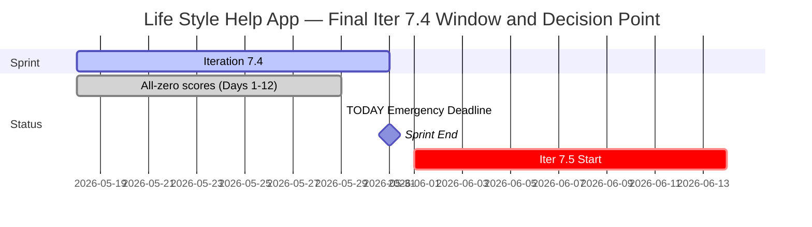

# Life Style Help App Team — SAFe Iteration Audit A66

**Audit Date:** 2026-05-29 09:00
**Auditor:** Claude Code (SAFe PM Consultant)
**Workspace:** `ado_ls_dev`
**ADO Board:** [Life Style Help App Team](https://dev.azure.com/jairo/Life%20Style%20Help%20App/_boards/board/t/Life%20Style%20Help%20App%20Team/Stories%20and%20Deliverables)

---

## 1. Audit Metadata

| Field | Value |
|-------|-------|
| Audit Number | A66 |
| Audit Date | 2026-05-29 |
| Audit Time | 09:00 |
| Iteration | 7.4 |
| Iteration Dates | May 18 – May 31, 2026 |
| Sprint Day | Day 12 of 14 |
| ADO Project | Life Style Help App (`0f447778-7156-4451-ab21-27be3c4a5888`) |
| ADO Team | Life Style Help App Team (`a2a805bc-0b30-4ef3-9a8a-b7f3081157a6`) |
| Iteration ID | `85ef1e2d-7286-4593-9607-5b3df96255f4` |
| Prior Audit | AUDIT_20260528_0204.md (Score: 0.0 — Critical) |
| **Overall Score** | **0.0 / 100** |
| **Risk Band** | **Critical** |

> **Portfolio Note:** This workspace is excluded from portfolio-health and portfolio-meeting-prep aggregation per owner directive (2026-05-21). Individual audits continue per batch run policy.

---

## 2. Executive Summary

Iteration 7.4, **Day 12 of 14**. The Life Style Help App project remains completely inactive for the **twelfth consecutive day**. The backlog API returns zero items; team capacity is unconfigured. All seven SAFe dimensions score 0, yielding an overall score of **0.0 / 100 (Critical)** — unchanged since Day 1 of this iteration.

**Iteration 7.4 is mathematically unrecoverable.** Twelve of 14 sprint days have elapsed with zero items, zero SP, and zero ADO activity. The sprint will close at 0.0/100 on May 31, 2026.

**Today (May 29) is the emergency planning deadline** identified in prior audits. This is the last viable business day to initiate planning for Iteration 7.5, which begins June 1. If no action is taken today, Iteration 7.5 will open as the second consecutive blank sprint.

No owner decision, backlog activity, or capacity configuration has been detected across 12 consecutive audit days.

> **Escalation Level: CRITICAL — Day 12, Final Deadline.** May 29 is the last business day before sprint end and the Iteration 7.5 start. Emergency planning or formal disposition decision required today.

**Overall Score: 0.0 / 100 — Critical**

---

## 3. Previous Audit Delta

| Metric | 2026-05-28 (Audit A65) | 2026-05-29 (Audit A66) | Change |
|--------|------------------------|------------------------|--------|
| Sprint Day | Day 11 | Day 12 | +1 |
| Items in Iteration | 0 | 0 | 0 |
| Capacity Configured | 0 | 0 | 0 |
| Story Points Committed | 0 SP | 0 SP | 0 |
| SP Closed | 0 | 0 | 0 |
| Recovery Action Observed | None | None | 0 |
| Owner Decision Signal | None detected | None detected | 0 |
| Overall Score | 0.0 | 0.0 | 0.0 |
| Risk Band | Critical | Critical | — |
| Days to Iter 7.5 Start | 4 days | **3 days** | −1 |
| Sprint Days Remaining | 3 | **2** | −1 |
| Emergency Planning Deadline | Tomorrow (May 29) | **TODAY** | Deadline reached |

### Day 12 Assessment

No change from Day 11. Twelve consecutive days of zero activity. The emergency planning deadline identified in prior audits has arrived. Only 2 sprint days remain (Days 13–14, May 30–31). Iteration 7.5 opens June 1 (Sunday) or first business day June 1.

**This is the final window to prevent a second consecutive zero-score sprint.** A minimum viable planning session today (May 29) could result in at least 1 committed item in Iteration 7.5 before June 1.

---

## 4. Current Iteration Snapshot

**Iteration 7.4** · May 18 – May 31, 2026 · **Day 12 of 14**

| Field | Value |
|-------|-------|
| Visible Root Backlog Items | **0** |
| Items in Iteration 7.4 | **0** |
| Total SP Committed | **0 SP** |
| Capacity Configured | **0** |
| Items Active | **0** |
| SP Burned | **0 SP** |
| Sprint Days Elapsed | 12 |
| Sprint Days Remaining | **2** |
| Sprint Recovery Possible | **No** — 12 days elapsed, 0 items |
| Iter 7.5 Start | June 1, 2026 |
| Days to Iter 7.5 Start | 3 days |
| Emergency Planning Deadline | **TODAY — May 29, 2026** |

---

## 5. Work Item Analysis

No work items exist in the Life Style Help App Team's Stories and Deliverables backlog. The ADO backlog API returns an empty array for the twelfth consecutive day. No analysis is possible.

| Metric | Value |
|--------|-------|
| visible_root_backlog_items | 0 |
| current_iteration_root_items | 0 |
| contributors_with_current_work | 0 |
| contributors_with_capacity | 0 |
| point_eligible_current_items | 0 |
| estimated_current_items | 0 |
| dor_compliant_current_items | 0 |
| fresh_visible_root_items | 0 |
| stale_90_visible_root_items | 0 |
| stale_180_visible_root_items | 0 |
| committed_story_points | 0 |
| closed_story_points | 0 |

---

## 6. SAFe Compliance Scorecard

| Dimension | Score | Evidence | Notes |
|-----------|-------|----------|-------|
| D1 — Iteration Planning | 0.0 | 0/0 items — visible backlog = 0 | Formula: score 0 if visible_root_backlog_items = 0 |
| D2 — Team Capacity | 0.0 | 0 contributors; team capacity API returns 0 pts/day | No configured capacity; confirmed by API |
| D3 — Estimation | 0.0 | 0/0 eligible items | Formula: score 0 if point_eligible = 0 |
| D4 — DoR Compliance | 0.0 | 0/0 items | Formula: score 0 if no current items |
| D5 — Work Item Balance | 0.0 | No items — no User Story present | Formula: score 0 if no current_iteration_root_items |
| D6 — Backlog Refinement | 0.0 | 0/0 items — backlog empty | Formula: score 0 if visible_root_backlog_items = 0 |
| D7 — Delivery Predictability | 0.0 | 0/0 SP committed | Formula: score 0 if committed_story_points = 0 |

**Overall Score: (0+0+0+0+0+0+0) / 7 = 0.0 / 100 — Critical**

---

## 7. Dimension Findings

### D1 through D7 — All Dimensions (0.0) 🔴

The backlog is empty. No capacity is configured. All seven dimensions score 0 by rubric formula. Confirmed project inactivity — not a measurement error. This is the twelfth consecutive day of all-zero scores.

ADO API independently confirms:
- `wit_list_backlog_work_items`: returns empty array (0 items)
- `work_get_iteration_capacities`: returns `teamCapacityPerDay: 0` for the Life Style Help App Team

All prior work items remain in Removed state (confirmed Audit A58, May 21). No item creation, restoration, or capacity configuration has occurred in 12 audit days.

---

## 8. Risks and Bottlenecks

| Risk | Severity | Status |
|------|----------|--------|
| Day 12 with 0 items, 0 capacity, 0 activity | **Critical** | Iteration 7.4 unrecoverable (12/14 days complete) |
| Emergency planning deadline reached TODAY (May 29) | **Critical** | Last viable day to plan Iteration 7.5 before June 1 start |
| Second consecutive zero-score sprint incoming | **Critical** | Iter 7.5 starts June 1 with no plan if no action taken today |
| All project backlog items remain in Removed state | **Critical** | Confirmed in prior audits; no restoration in 12 days |
| No team capacity configured | **Critical** | 12th consecutive zero-capacity day |
| No owner decision on project disposition | **Critical** | May 29 deadline reached; no signal in 12 days |
| 12 consecutive zero-score audits | High | Audit series has provided maximum notice; escalation required |

---

## 9. Prioritized Recommendations

Sprint recovery for Iteration 7.4 is mathematically impossible. **Today, May 29, is the final planning window before Iteration 7.5 begins.**

1. **Owner decision required today (FINAL DEADLINE)** — Three paths remain:

   **(a) Emergency restart for Iteration 7.5 (June 1, preferred if team is active):**
   - Begin item creation today
   - Write at least 3–5 work items with full DoR (Description ≥30 chars, AC ≥20 chars, SP assigned)
   - Assign team members and configure capacity
   - Define a sprint goal for Iteration 7.5
   - Minimum viable: 1 item committed, 1 assignee, 1 capacity entry, 1 goal statement

   **(b) Formal pause with documented reactivation conditions:**
   - Add a `Project Exceptions` entry to `ado_ls_dev/CLAUDE.md` with:
     - Pause start date
     - Reason for suspension
     - Reactivation trigger or estimated reactivation date
   - This immediately stops the zero-score audit series from generating daily critical alerts
   - Communicate status to Jairosoft stakeholders

   **(c) Project discontinuation:**
   - Formally archive the ADO project and close all items
   - Update workspace CLAUDE.md with closure date and reason
   - Remove from all audit rotations permanently

2. **Minimum viable Iteration 7.5 startup (if restarting today):**
   - Sprint goal statement (1–2 sentences describing the iteration objective)
   - At least 3 work items with:
     - Meaningful title
     - Description ≥ 30 non-whitespace characters
     - Acceptance Criteria ≥ 20 non-whitespace characters
     - Story Points assigned
     - Assignee set
   - Capacity configured for at least 1 team member
   - Items moved to Active state before or on June 1

3. **Update workspace CLAUDE.md with current project status** — Regardless of the path chosen, the workspace CLAUDE.md has no entry reflecting the suspension that began before May 18. Adding a `Project Exceptions` entry (even a single line) would end the recurring critical-alert cycle and provide accurate context for portfolio reviews.

---

## 10. Evidence Gaps and Limitations

| Gap | Impact | Notes |
|-----|--------|-------|
| All 7 dimensions score 0 | Full rubric failure | Confirmed project inactivity — not measurement error |
| Root cause of suspension unverifiable via API | Cannot classify status | Owner decision required |
| Team member roster unknown | D2 absent | No active assignees; no capacity data |
| Owner decision status | Critical gap | No ADO or workspace signal detected in 12 days |
| Portfolio exclusion | Scope note | Excluded from portfolio-health per 2026-05-21 directive |
| May 29 = emergency planning deadline reached | Planning context | This is the last viable day documented across A55–A65 audits |

---

## Visualization

### Score Trend (Iteration 7.4, All Audit Days)

| Date | Audit | Score | Band | Sprint Day |
|------|-------|-------|------|-----------|
| May 18 | A55 | 0.0 | Critical | Day 1 |
| May 19 | A56 | 0.0 | Critical | Day 2 |
| May 20 | A57 | 0.0 | Critical | Day 3 |
| May 21 | A58 | 0.0 | Critical | Day 4 |
| May 22 | A59 | 0.0 | Critical | Day 5 |
| May 23 | A60 | 0.0 | Critical | Day 6 |
| May 24 | A61 | 0.0 | Critical | Day 7 |
| May 25 | A62 | 0.0 | Critical | Day 8 |
| May 26 | A63 | 0.0 | Critical | Day 9 |
| May 27 | A64 | 0.0 | Critical | Day 10 |
| May 28 | A65 | 0.0 | Critical | Day 11 |
| **May 29** | **A66** | **0.0** | **Critical** | **Day 12** |

Twelve consecutive Critical scores. Iteration 7.4 closes at 0% delivery on May 31. Emergency planning decision required **today** for any possibility of Iteration 7.5 starting with committed work on June 1.

---

*Audit generated by Claude Code (claude-sonnet-4-6) on 2026-05-29. Evidence sourced from Azure DevOps MCP (Life Style Help App project). Rubric: SAFe 6.0 7-dimension scorecard. This workspace is excluded from portfolio-level aggregation per portfolio-health exclusion policy (2026-05-21).*
