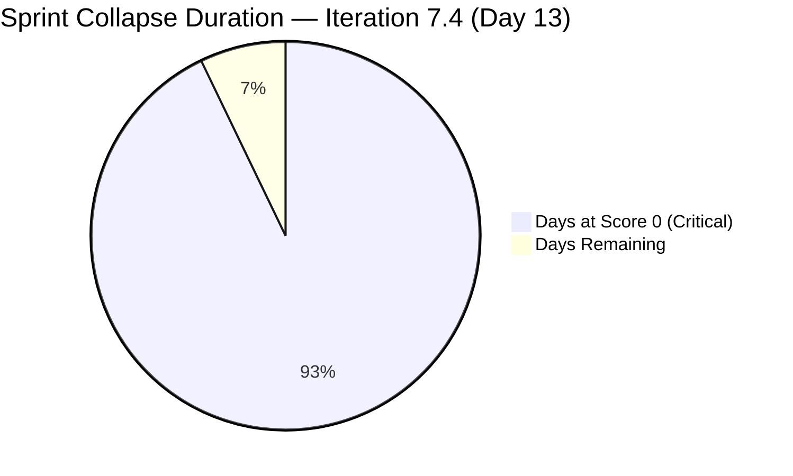
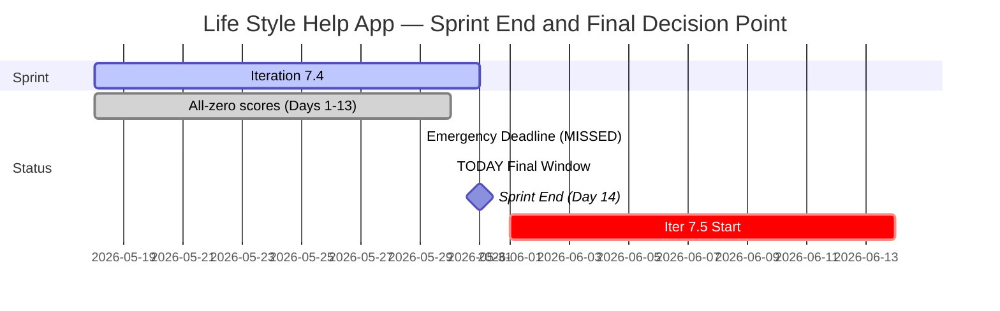

# Life Style Help App Team — SAFe Iteration Audit A67

**Audit Date:** 2026-05-30 09:00
**Auditor:** Claude Code (SAFe PM Consultant)
**Workspace:** `ado_ls_dev`
**ADO Board:** [Life Style Help App Team](https://dev.azure.com/jairo/Life%20Style%20Help%20App/_boards/board/t/Life%20Style%20Help%20App%20Team/Stories%20and%20Deliverables)

> **Portfolio Note:** This workspace is excluded from portfolio-health and portfolio-meeting-prep aggregation per owner directive (2026-05-21). Individual audits continue per batch run policy.

---

## 1. Audit Metadata

| Field | Value |
|-------|-------|
| Audit Number | A67 |
| Audit Date | 2026-05-30 |
| Audit Time | 09:00 |
| Iteration | 7.4 |
| Iteration Dates | May 18 – May 31, 2026 |
| Sprint Day | Day 13 of 14 |
| ADO Project | Life Style Help App (`0f447778-7156-4451-ab21-27be3c4a5888`) |
| ADO Team | Life Style Help App Team (`a2a805bc-0b30-4ef3-9a8a-b7f3081157a6`) |
| Iteration ID | `85ef1e2d-7286-4593-9607-5b3df96255f4` |
| Prior Audit | AUDIT_20260529_0900.md (Score: 0.0 — Critical) |
| **Overall Score** | **0.0 / 100** |
| **Risk Band** | **Critical** |

---

## 2. Executive Summary

Iteration 7.4, **Day 13 of 14 — penultimate sprint day.** The Life Style Help App project remains completely inactive for the **thirteenth consecutive day**. The backlog API returns zero items; team capacity is unconfigured at 0 pts/day. All seven SAFe dimensions score 0, yielding **0.0 / 100 (Critical)** — unchanged since Day 1 of this iteration.

**Iteration 7.4 is completely unrecoverable.** Thirteen of 14 sprint days have elapsed with zero items, zero story points, and zero ADO activity. Tomorrow (May 31) is the final day of Iteration 7.4. The sprint will close at 0.0/100.

**The May 29 emergency planning deadline passed with no observed action.** The prior audit (Audit A66) flagged May 29 as the last viable planning day for Iteration 7.5 (starting June 1, 2026). No response has been detected — no item creation, no capacity configuration, no owner signal.

**Day 14 (May 31) is now the absolute final window** to take any action before Iteration 7.5 opens. The team faces a second consecutive blank sprint unless immediate steps are taken.

**Overall Score: 0.0 / 100 — Critical**

---

## 3. Previous Audit Delta

| Metric | 2026-05-29 (Audit A66) | 2026-05-30 (Audit A67) | Change |
|--------|------------------------|------------------------|--------|
| Sprint Day | Day 12 | Day 13 | +1 |
| Items in Iteration | 0 | **0** | No change |
| Capacity Configured | 0 | **0** | No change |
| Story Points Committed | 0 SP | **0 SP** | No change |
| SP Closed | 0 | **0** | No change |
| Recovery Action Observed | None | **None** | No change |
| Owner Decision Signal | None detected | **None detected** | No change |
| Overall Score | 0.0 | **0.0** | No change |
| Risk Band | Critical | **Critical** | Unchanged |
| Days to Iter 7.5 Start | 3 days | **2 days** | −1 |
| Sprint Days Remaining | 2 | **1** | −1 |
| Emergency Planning Deadline | Yesterday (May 29) | **MISSED** | Deadline passed |

### Day 13 Assessment

The May 29 emergency planning deadline passed without any ADO activity. The backlog API continues to return zero items — identical to every prior day of this iteration. Only 1 sprint day remains (Day 14, May 31). Iteration 7.5 begins June 1, 2026.

This is the **thirteenth consecutive zero-activity audit.** No item creation, state change, capacity update, or owner comment has been detected since the start of Iteration 7.4 on May 18, 2026.

---

## 4. Current Iteration Snapshot

**Iteration 7.4** · May 18 – May 31, 2026 · **Day 13 of 14**

| Field | Value |
|-------|-------|
| Visible Root Backlog Items | **0** |
| Items in Iteration 7.4 | **0** |
| Total SP Committed | **0 SP** |
| Capacity Configured (pts/day) | **0** |
| Items Active | **0** |
| SP Burned | **0 SP** |
| Sprint Days Elapsed | 13 |
| Sprint Days Remaining | **1 (Day 14 = May 31)** |
| Sprint Recovery Possible | **No** — 13 days elapsed, 0 items |
| Iter 7.5 Start | June 1, 2026 |
| Days to Iter 7.5 Start | **2 days** |
| Emergency Planning Deadline | **MISSED — May 29 passed with no action** |

---

## 5. Work Item Analysis

No work items exist in the Life Style Help App Team's Stories and Deliverables backlog. The ADO backlog API returns an empty array for the thirteenth consecutive day. No analysis is possible.

| Metric | Value |
|--------|-------|
| visible_root_backlog_items | 0 |
| current_iteration_root_items | 0 |
| contributors_with_current_work | 0 |
| contributors_with_capacity | 0 |
| point_eligible_current_items | 0 |
| estimated_current_items | 0 |
| dor_compliant_current_items | 0 |
| fresh_visible_root_items | 0 |
| stale_90_visible_root_items | 0 |
| stale_180_visible_root_items | 0 |
| committed_story_points | 0 |
| closed_story_points | 0 |

---

## 6. SAFe Compliance Scorecard

| Dimension | Score | Evidence | Notes |
|-----------|-------|----------|-------|
| D1 — Iteration Planning | 0.0 | visible_root_backlog_items = 0 | Formula: score 0 when visible backlog = 0 |
| D2 — Team Capacity | 0.0 | contributors_with_current_work = 0; teamCapacityPerDay = 0 | No configured capacity; API confirmed |
| D3 — Estimation | 0.0 | point_eligible_current_items = 0 | Formula: score 0 when denominator = 0 |
| D4 — DoR Compliance | 0.0 | current_iteration_root_items = 0 | Formula: score 0 when denominator = 0 |
| D5 — Work Item Balance | 0.0 | current_iteration_root_items = 0 | Formula: score 0 when no current items |
| D6 — Backlog Refinement | 0.0 | visible_root_backlog_items = 0 | Formula: score 0 when backlog empty |
| D7 — Delivery Predictability | 0.0 | committed_story_points = 0 | Formula: score 0 when committed_SP = 0 |

**Overall Score: (0+0+0+0+0+0+0) / 7 = 0.0 / 100 — Critical**

---

## 7. Dimension Findings

### D1 through D7 — All Dimensions (0.0) 🔴

The backlog is empty. No capacity is configured. All seven dimensions score 0 by rubric formula. Confirmed project inactivity — not a measurement error. This is the thirteenth consecutive day of all-zero scores.

ADO API confirms:
- `wit_list_backlog_work_items`: empty array (0 items) — Day 13
- `work_get_iteration_capacities`: `teamCapacityPerDay: 0` for Life Style Help App Team — Day 13

No change from any prior audit in this iteration. The condition is stable and unchanging.

---

## 8. Risks and Bottlenecks

| Risk | Severity | Status |
|------|----------|--------|
| Day 13 with 0 items, 0 capacity, 0 activity | **Critical** | Iteration 7.4 unrecoverable (13/14 days complete) |
| May 29 emergency deadline MISSED | **Critical** | No owner action detected on the final planning day |
| Iteration 7.5 starts June 1 — 0 planning done | **Critical** | Second consecutive blank sprint now likely if no action today |
| Project backlog fully empty | **Critical** | 13 consecutive days; no restoration signal |
| No team capacity configured | **Critical** | 13th consecutive zero-capacity day |
| No owner decision or project disposition signal | **Critical** | Last window is Day 14 (May 31) |
| 13 consecutive zero-score audits | **High** | Audit series at maximum escalation level |

---

## 9. Prioritized Recommendations

Iteration 7.4 sprint recovery is impossible. **Day 14 (May 31) is the final window to prevent a second consecutive blank sprint.**

1. **Owner decision required on Day 14 (May 31) — ABSOLUTE FINAL WINDOW**

   Three paths remain for the project:

   **(a) Emergency restart for Iteration 7.5 (June 1):**
   - Create at least 3–5 work items with full DoR (Description ≥30 chars, AC ≥20 chars, SP assigned)
   - Assign team member(s) and configure capacity in ADO
   - Define a sprint goal for Iteration 7.5
   - Set items to Active/committed state before or on June 1
   - This is the only path that prevents a second consecutive zero-score sprint

   **(b) Formal documented pause:**
   - Add a `Project Exceptions` section to `ado_ls_dev/CLAUDE.md` with pause start date, reason, and reactivation trigger
   - This stops the escalating critical-alert audit series
   - Communicate status to Jairosoft stakeholders
   - No further daily audits would flag this as a planning failure once documented

   **(c) Project discontinuation:**
   - Formally archive the ADO project
   - Close or remove all items
   - Update workspace CLAUDE.md with closure date and reason
   - Remove from audit rotation permanently

2. **Minimum viable Iteration 7.5 startup (if restarting today, Day 14):**
   - One sprint goal statement
   - At least 3 work items with title, Description (≥30 chars), AC (≥20 chars), SP, and assignee
   - Capacity configured for at least 1 team member
   - Items assigned to Iteration 7.5 path

3. **If no action is taken by May 31:** Iteration 7.5 opens as the second consecutive blank sprint. The scoring rubric will produce 0.0/100 for all 14 days of Iteration 7.5 unless items are created. The project should be formally documented as paused or discontinued to end the recurring Critical audit flag.

---

## 10. Evidence Gaps and Limitations

| Gap | Impact | Notes |
|-----|--------|-------|
| All 7 dimensions score 0 | Full rubric failure | Confirmed project inactivity — not measurement error |
| Root cause of suspension unverifiable via API | Cannot classify status | Owner decision required |
| Team member roster unknown | D2 absent | No active assignees; no capacity data |
| Owner decision status | Critical gap | No ADO signal detected in 13 consecutive days |
| Portfolio exclusion | Scope note | Excluded from portfolio-health per 2026-05-21 directive |
| May 29 planning deadline missed | Escalation context | Emergency window closed; Day 14 is absolute last window |

---

## Visualization

### Score Trend (Iteration 7.4, All Audit Days)

| Date | Audit | Score | Band | Sprint Day |
|------|-------|-------|------|-----------|
| May 18 | A55 | 0.0 | Critical | Day 1 |
| May 19 | A56 | 0.0 | Critical | Day 2 |
| May 20 | A57 | 0.0 | Critical | Day 3 |
| May 21 | A58 | 0.0 | Critical | Day 4 |
| May 22 | A59 | 0.0 | Critical | Day 5 |
| May 23 | A60 | 0.0 | Critical | Day 6 |
| May 24 | A61 | 0.0 | Critical | Day 7 |
| May 25 | A62 | 0.0 | Critical | Day 8 |
| May 26 | A63 | 0.0 | Critical | Day 9 |
| May 27 | A64 | 0.0 | Critical | Day 10 |
| May 28 | A65 | 0.0 | Critical | Day 11 |
| May 29 | A66 | 0.0 | Critical | Day 12 |
| **May 30** | **A67** | **0.0** | **Critical** | **Day 13** |

Thirteen consecutive Critical scores. Iteration 7.4 closes at 0% delivery on May 31. Day 14 (May 31) is the absolute final window for owner decision before Iteration 7.5 opens.

---

*Audit generated by Claude Code (claude-sonnet-4-6) on 2026-05-30. Evidence sourced from Azure DevOps MCP (Life Style Help App project). Rubric: SAFe 6.0 7-dimension scorecard v1. This workspace is excluded from portfolio-level aggregation per portfolio-health exclusion policy (2026-05-21).*
