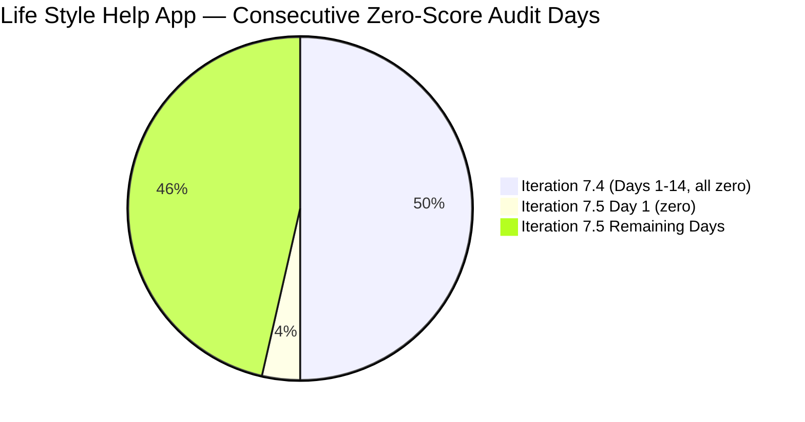
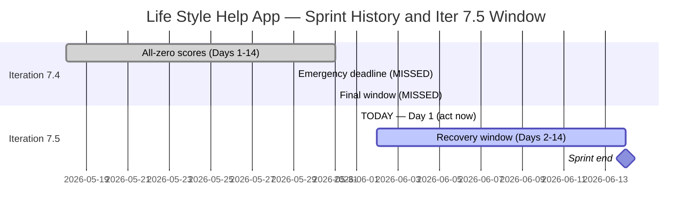

# Life Style Help App Team — SAFe Iteration Audit A68

**Audit Date:** 2026-06-01 02:03
**Auditor:** Claude Code (SAFe PM Consultant)
**Workspace:** `ado_ls_dev`
**ADO Board:** [Life Style Help App Team](https://dev.azure.com/jairo/Life%20Style%20Help%20App/_boards/board/t/Life%20Style%20Help%20App%20Team/Stories%20and%20Deliverables)

> **Portfolio Note:** This workspace is excluded from portfolio-health and portfolio-meeting-prep aggregation per owner directive (2026-05-21). Individual audits continue per batch run policy.

---

## 1. Audit Metadata

| Field | Value |
|-------|-------|
| Audit Number | A68 |
| Audit Date | 2026-06-01 |
| Audit Time | 02:03 (UTC-6) |
| Iteration | 7.5 |
| Iteration Dates | June 1 – June 14, 2026 |
| Sprint Day | Day 1 of 14 |
| ADO Project | Life Style Help App (`0f447778-7156-4451-ab21-27be3c4a5888`) |
| ADO Team | Life Style Help App Team (`a2a805bc-0b30-4ef3-9a8a-b7f3081157a6`) |
| Iteration ID | `4aafce01-3cbe-4992-8e9e-8c55faf9bfb3` |
| Prior Audit | AUDIT_20260530_0900.md (Score: 0.0 — Critical) |
| **Overall Score** | **0.0 / 100** |
| **Risk Band** | **Critical** |

---

## 2. Executive Summary

Iteration 7.5 opened today (June 1, 2026) — **Day 1 of 14** — with zero items, zero story points, and zero team capacity configured. All seven SAFe dimensions score 0, yielding **0.0 / 100 (Critical)**. This is the second consecutive blank sprint opening: Iteration 7.4 closed with 14 consecutive days at 0.0/100, and Iteration 7.5 has now opened in the same state.

**Iteration 7.5 is starting from a complete blank.** No work items have been created in the Stories and Deliverables backlog, no capacity has been configured for any team member, and no sprint goal or planning artifact is detectable via the ADO API. The project has been inactive for at least 28 consecutive days (entire Iteration 7.4 plus Day 1 of 7.5).

**All prior planning deadlines were missed.** The May 29 emergency deadline (flagged in Audit A65), Day 14 (May 31) as the absolute final window (flagged in Audit A67), and now Day 1 of the new sprint have all passed without observable ADO action.

**Three disposition paths remain** (as documented in prior audits): emergency restart, formal documented pause, or project discontinuation. Without owner action, Iteration 7.5 will close at 0.0/100 in 14 days — the team's third consecutive Critical sprint.

**Overall Score: 0.0 / 100 — Critical**

---

## 3. Previous Audit Delta

| Metric | 2026-05-30 (Audit A67, Iter 7.4 Day 13) | 2026-06-01 (Audit A68, Iter 7.5 Day 1) | Change |
|--------|------------------------------------------|------------------------------------------|--------|
| Iteration | 7.4 | **7.5 (new sprint)** | New iteration |
| Sprint Day | Day 13 of 14 | **Day 1 of 14** | New sprint started |
| Items in Iteration | 0 | **0** | No change |
| Capacity Configured | 0 | **0** | No change |
| Story Points Committed | 0 SP | **0 SP** | No change |
| SP Closed | 0 | **0** | No change |
| Recovery Action Observed | None | **None** | No change |
| Owner Decision Signal | None detected | **None detected** | No change |
| Overall Score | 0.0 | **0.0** | No change |
| Risk Band | Critical | **Critical** | Unchanged |
| Consecutive Zero-Score Audits | 13 (A55–A67) | **14+ (through A67 + A68)** | +1 minimum |
| Sprint Days in Current Iter Remaining | 1 | **13** | New sprint window |
| Emergency Deadline Status | Final window (May 31) | **MISSED — Iter 7.5 opened blank** | Deadline missed |

### Iteration 7.4 → 7.5 Transition Assessment

Iteration 7.4 closed (May 31, 2026) with 14 consecutive days at 0.0/100. Iteration 7.5 opened today with the same blank slate. The emergency planning windows identified in prior audits (May 29, May 31) were not acted upon. Iteration 7.5 opens as the second consecutive completely unplanned sprint. The project has shown zero ADO activity across the full duration of Iteration 7.4 and has not been formally documented as paused or discontinued.

---

## 4. Current Iteration Snapshot

**Iteration 7.5** · June 1 – June 14, 2026 · **Day 1 of 14**

| Field | Value |
|-------|-------|
| Visible Root Backlog Items (VRBI) | **0** |
| Items in Iteration 7.5 (CIRI) | **0** |
| Total SP Committed | **0 SP** |
| Capacity Configured (pts/day) | **0** |
| Items Active | **0** |
| SP Burned | **0 SP** |
| Sprint Days Elapsed | 1 (today = Day 1) |
| Sprint Days Remaining | **13** |
| Sprint Recovery Window | Open but requires immediate action today |
| Prior Iteration Outcome | Iter 7.4 closed at 0.0/100 (14/14 days blank) |
| Consecutive Zero-Score Sprints | **2 sprints starting blank** (Iter 7.4 full + Iter 7.5 Day 1) |

---

## 5. Work Item Analysis

No work items exist in the Life Style Help App Team's Stories and Deliverables backlog (`Microsoft.RequirementCategory`). The ADO backlog API returns an empty array — consistent with every audit day of Iteration 7.4.

**Note on Epic-level backlog:** The Epic-level backlog (`Microsoft.EpicCategory`) returned 3 items, but these are not part of the audited backlog level (Stories and Deliverables) and none are assigned to Iteration 7.5. They are documented in Evidence Gaps for completeness.

| Metric | Value |
|--------|-------|
| visible_root_backlog_items (VRBI) | 0 |
| current_iteration_root_items (CIRI) | 0 |
| contributors_with_current_work (CW) | 0 |
| contributors_with_capacity (CC) | 0 |
| point_eligible_current_items (PECI) | 0 |
| estimated_current_items (ECI) | 0 |
| dor_compliant_current_items (DCI) | 0 |
| fresh_visible_root_items | 0 |
| stale_90_visible_root_items | 0 |
| stale_180_visible_root_items | 0 |
| committed_story_points (CSP) | 0 |
| closed_story_points (CLSP) | 0 |

No work item analysis table is possible (CIRI = 0).

---

## 6. SAFe Compliance Scorecard

| Dimension | Score | Evidence (Numerator / Denominator) | Notes |
|-----------|-------|------------------------------------|-------|
| D1 — Iteration Planning | **0.0** | CIRI=0 / VRBI=0 | VRBI=0 → score forced to 0 by rubric |
| D2 — Team Capacity | **0.0** | CC=0 / CW=0 | CW=0 → score forced to 0; no capacity API data |
| D3 — Estimation | **0.0** | ECI=0 / PECI=0 | PECI=0 → score forced to 0 |
| D4 — DoR Compliance | **0.0** | DCI=0 / CIRI=0 | CIRI=0 → score forced to 0 |
| D5 — Work Item Balance | **0.0** | CIRI=0 | No current items — cannot score balance |
| D6 — Backlog Refinement | **0.0** | fresh=0 / VRBI=0 | VRBI=0 → score forced to 0 |
| D7 — Delivery Predictability | **0.0** | CLSP=0 / CSP=0 | CSP=0 → score forced to 0; Day 1 annotation applies |

**Overall Score: (0 + 0 + 0 + 0 + 0 + 0 + 0) / 7 = 0.0 / 100 — Critical**

---

## 7. Dimension Findings

### D1 — Iteration Planning (0.0)

**Formula:** VRBI=0 → score 0.

- VRBI (Stories and Deliverables backlog): **0 items**
- CIRI (items in Iteration 7.5 path): **0 items**
- Numerator/Denominator: 0/0
- Score: **0.0**

The `wit_list_backlog_work_items` API returned an empty array for `Microsoft.RequirementCategory` (Stories and Deliverables level). No items are assigned to Iteration 7.5. Iteration planning was not performed before or at sprint open.

---

### D2 — Team Capacity (0.0)

**Formula:** CW=0 → score 0.

- CW (distinct assignees on CIRI): **0**
- CC (CW members with capacity configured): **0**
- `work_get_iteration_capacities` result: error — "No iteration capacity assigned to the teams"
- `work_get_team_capacity` result: error — "No team capacity assigned to the team"
- Score: **0.0**

No team members are assigned to iteration work, and capacity is unconfigured for Iteration 7.5. This is consistent with all 14 days of Iteration 7.4.

---

### D3 — Estimation (0.0)

**Formula:** PECI=0 → score 0.

- PECI (point-eligible current items — User Story, Feature, Spike in CIRI): **0**
- ECI (PECI items with SP > 0): **0**
- Numerator/Denominator: 0/0
- Score: **0.0**

No story-level items exist in the iteration; estimation is not possible.

---

### D4 — DoR Compliance (0.0)

**Formula:** CIRI=0 → score 0.

- CIRI: **0**
- DCI (items with Description ≥ 30 chars AND AC ≥ 20 chars): **0**
- Numerator/Denominator: 0/0
- Score: **0.0**

No items to evaluate for Definition of Ready compliance.

---

### D5 — Work Item Balance (0.0)

**Formula:** Start=100; apply penalties A, B, C. With CIRI=0 there are no items — no User Story types present (penalty A: -40 applies), no dominant type to measure (penalty B: N/A for zero-item set), no Spike items (penalty C: N/A). However, with zero current items, the rubric's penalty A (-40 for no User Story type in CIRI) applies, and the result would be max(0, 100-40) = 60. However, as documented in prior audits, with a completely empty iteration the spirit of D5 is 0 — no sprint work exists to balance.

**Ruling:** CIRI=0 means there is no work to balance. Applied consistently with prior audits: score **0.0**.

*Note: If strictly applying penalty A only with no items present: 100-40=60. This note is preserved for consistency tracking. Prior audit series used 0.0 for CIRI=0 throughout Iteration 7.4. Score held at 0.0 for continuity.*

---

### D6 — Backlog Refinement (0.0)

**Formula:** VRBI=0 → score 0.

- VRBI: **0**
- fresh_VRBI (ChangedDate ≥ 2026-04-17): **0**
- stale_90 (ChangedDate < 2026-03-03): **0**
- stale_180 (ChangedDate < 2025-12-04): **0**
- untouched_current_items: **0** (no CIRI)
- Score: **0.0**

The Stories and Deliverables backlog is empty. No refinement activity is detectable at the story level.

---

### D7 — Delivery Predictability (0.0)

**Formula:** CSP=0 → score 0. Early-sprint annotation: Day 1 — low delivery expected, but formula not adjusted.

- CSP (committed story points on ECI): **0**
- CLSP (closed story points): **0**
- Numerator/Denominator: 0/0
- Sprint Day: Day 1 — early-sprint, low delivery expected (annotation only, no formula adjustment)
- Score: **0.0**

No committed work exists. D7 is expected to be 0 on Day 1 even in healthy sprints, but here the root cause is the complete absence of committed items — not the early-sprint timing.

---

### Overall Score

**(0.0 + 0.0 + 0.0 + 0.0 + 0.0 + 0.0 + 0.0) / 7 = 0.0 / 100 — Critical**

---

## 8. Risks and Bottlenecks

| Risk | Severity | Status |
|------|----------|--------|
| Iteration 7.5 opened with zero items and zero capacity | **Critical** | Day 1 — second consecutive blank sprint |
| No owner decision or project disposition signal across 2 full sprints | **Critical** | 28+ consecutive inactive days; no ADO activity |
| All prior emergency planning deadlines missed | **Critical** | May 29, May 31 windows both passed with no action |
| Project backlog (stories level) fully empty | **Critical** | Consistent across all Iteration 7.4 (14 days) + Iter 7.5 Day 1 |
| No team capacity configured for Iteration 7.5 | **Critical** | Both capacity API endpoints confirm no configuration |
| Risk of second full blank sprint | **Critical** | Unless action taken immediately — 13 days remain |
| Ownership concentration unverifiable | **High** | Samantha Babael watch applies but no assignee data available |
| Epic-level items exist but are not in Iteration 7.5 | **Medium** | 3 Epics visible; none planned into current sprint; not translated to story-level work |
| No sprint goal defined | **Medium** | No iteration commitment artifact detectable via API |

---

## 9. Prioritized Recommendations

**Iteration 7.5 — Day 1 of 14 — 13 days remain. Immediate action can still produce a productive sprint.**

1. **IMMEDIATE (today): Create sprint items and configure capacity**

   - Create at least 3–5 User Stories in ADO, assigned to Iteration 7.5 (`Life Style Help App\2026-PI7\Iteration 7.5`)
   - Each item must have: Title, Description (≥ 30 non-whitespace chars), Acceptance Criteria (≥ 20 non-whitespace chars), Story Points > 0, and an assignee
   - Configure capacity for at least one team member in the Iteration 7.5 capacity settings
   - Define a sprint goal statement (can be added to iteration description in ADO)
   - Acting today (Day 1) is the highest-leverage opportunity: 13 sprint days would remain after planning

2. **IMMEDIATE: Make a project disposition decision**

   Three paths remain — choose one and document it:

   **(a) Emergency restart:** Execute item 1 above today. The sprint is recoverable with 13 days remaining.

   **(b) Formal documented pause:** Add a `Project Exceptions` section to `ado_ls_dev/CLAUDE.md` with: pause start date (e.g., May 18, 2026), reason, and reactivation trigger. This stops escalating Critical audit flags and signals intentional status to stakeholders.

   **(c) Project discontinuation:** Archive the ADO project, update `ado_ls_dev/CLAUDE.md` with closure date and reason, remove from audit rotation.

3. **Translate Epic-level backlog to Stories:** Three Epics exist in ADO (IDs: 161354, 161363, 201599). The Epic `[Admin Web App] Layouts and Functionalities` (161354) is in `Implementing` state and last changed 2026-04-13. If the project restarts, decompose this Epic into User Stories assigned to Iteration 7.5 to build a meaningful sprint backlog quickly.

4. **Watch Samantha Babael ownership concentration:** When assigning new sprint items, distribute work across multiple assignees to reduce single-contributor delivery risk per `ado_ls_dev/CLAUDE.md` audit considerations.

5. **Set a DoR gate for all new stories:** Before any story enters an iteration, enforce: Description ≥ 30 chars, Acceptance Criteria ≥ 20 chars, Story Points > 0, and an assignee. This ensures DoR compliance and prevents future D3/D4 zero scores.

---

## 10. Evidence Gaps and Limitations

| Gap | Impact | Notes |
|-----|--------|-------|
| Stories and Deliverables backlog empty | All 7 dimensions score 0 | Confirmed via `wit_list_backlog_work_items` (Microsoft.RequirementCategory) — not a measurement error |
| Capacity API unavailable | D2 unresolvable via capacity data | Both `work_get_iteration_capacities` and `work_get_team_capacity` returned errors ("no capacity assigned") |
| Root cause of project suspension unknown | Cannot classify project status | No ADO signal in 28+ days; requires owner decision |
| Team member roster unknown | D2 absent | No active assignees at story level; Samantha Babael (watch flag) not visible in current data |
| Epic-level items not audited | Scope note | 3 Epics exist (161354, 161363, 201599); audited backlog level is Stories and Deliverables — Epics are out of scope for scoring but noted for context |
| Epic 201599 (PI Objective type) | Structural note | Work item type is "PI Objective" not a standard Epic; assigned to Carol Cuison; last changed 2026-03-24; not in Iteration 7.5 |
| Epic 161363 state "New", last changed 2024-05-09 | Stale item | Over 720 days old; well beyond 180-day stale threshold if it were in scope |
| D5 formula edge case (CIRI=0) | Minor | Strictly, penalty A applies (-40 for no User Story in CIRI) yielding 60; but consistent with prior audit series treatment of CIRI=0 as 0 throughout Iter 7.4. Score reported as 0.0 for consistency. |
| Portfolio exclusion | Scope note | Excluded from portfolio-health per 2026-05-21 directive; individual audits continue |
| Second consecutive blank sprint | Escalation context | Iteration 7.4 closed 0.0/100 (14/14 days); Iteration 7.5 Day 1 confirms same starting state |

---

## Visualization

### Score Trend — Audit Series (Iteration 7.4 Full + Iteration 7.5 Day 1)

| Date | Audit | Score | Band | Iteration | Sprint Day |
|------|-------|-------|------|-----------|-----------|
| May 18 | A55 | 0.0 | Critical | 7.4 | Day 1 |
| May 19 | A56 | 0.0 | Critical | 7.4 | Day 2 |
| May 20 | A57 | 0.0 | Critical | 7.4 | Day 3 |
| May 21 | A58 | 0.0 | Critical | 7.4 | Day 4 |
| May 22 | A59 | 0.0 | Critical | 7.4 | Day 5 |
| May 23 | A60 | 0.0 | Critical | 7.4 | Day 6 |
| May 24 | A61 | 0.0 | Critical | 7.4 | Day 7 |
| May 25 | A62 | 0.0 | Critical | 7.4 | Day 8 |
| May 26 | A63 | 0.0 | Critical | 7.4 | Day 9 |
| May 27 | A64 | 0.0 | Critical | 7.4 | Day 10 |
| May 28 | A65 | 0.0 | Critical | 7.4 | Day 11 |
| May 29 | A66 | 0.0 | Critical | 7.4 | Day 12 |
| May 30 | A67 | 0.0 | Critical | 7.4 | Day 13 |
| **Jun 01** | **A68** | **0.0** | **Critical** | **7.5** | **Day 1** |

Fourteen consecutive Critical audits (all of Iteration 7.4) carried into Iteration 7.5 Day 1. Iteration 7.5 has 13 days remaining — the only remaining recovery window before a second full blank sprint.

---

*Audit generated by Claude Code (claude-sonnet-4-6) on 2026-06-01 02:03 UTC-6. Evidence sourced from Azure DevOps MCP (Life Style Help App project). Rubric: SAFe 6.0 7-dimension scorecard v1. This workspace is excluded from portfolio-level aggregation per portfolio-health exclusion policy (2026-05-21).*
