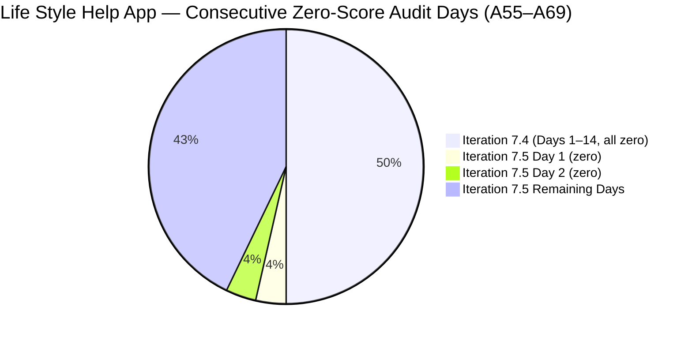
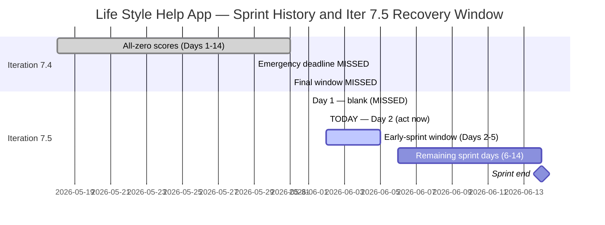

All API calls confirm the same state as prior audits: zero backlog items, zero iteration items, zero capacity. Now I have all the data needed to compute scores and compose the report.

**Score computation:**

- VRBI = 0, CIRI = 0
- D1: VRBI=0 → 0.0
- D2: CW=0 → 0.0
- D3: PECI=0 → 0.0
- D4: CIRI=0 → 0.0
- D5: CIRI=0 → 0.0
- D6: VRBI=0 → 0.0
- D7: CSP=0 → 0.0
- Overall: 0.0 / 100 — Critical

Sprint day calculation: iteration start = June 1, today = June 2 → Day 2 of 14.

# ADO SAFe Audit — Life Style Help App Team

**Audit Date:** 2026-06-02
**Auditor:** Claude Code (SAFe PM Consultant)
**Workspace:** `ado_ls_dev`
**ADO Board:** [Life Style Help App Team](https://dev.azure.com/jairo/Life%20Style%20Help%20App/_boards/board/t/Life%20Style%20Help%20App%20Team/Stories%20and%20Deliverables)

> **Portfolio Note:** This workspace is excluded from portfolio-health and portfolio-meeting-prep aggregation per owner directive (2026-05-21). Individual audits continue per batch run policy.

---

## 1. Audit Metadata

| Field | Value |
|-------|-------|
| Audit Number | A69 |
| Audit Date | 2026-06-02 |
| Audit Time | (UTC) |
| Iteration | 7.5 |
| Iteration Dates | June 1 – June 14, 2026 |
| Sprint Day | Day 2 of 14 |
| ADO Project | Life Style Help App (`0f447778-7156-4451-ab21-27be3c4a5888`) |
| ADO Team | Life Style Help App Team (`a2a805bc-0b30-4ef3-9a8a-b7f3081157a6`) |
| Iteration ID | `4aafce01-3cbe-4992-8e9e-8c55faf9bfb3` |
| Prior Audit | AUDIT_20260601_0203.md (Score: 0.0 — Critical, A68, Iter 7.5 Day 1) |
| **Overall Score** | **0.0 / 100** |
| **Risk Band** | **Critical** |

---

## 2. Executive Summary

Iteration 7.5 is now on **Day 2 of 14** and remains completely unplanned. All seven SAFe dimensions score 0, yielding **0.0 / 100 (Critical)** — consistent with every audit day of Iteration 7.4 (14 days) and Iteration 7.5 Day 1. This is now Audit A69, the **fifteenth consecutive 0.0/100 Critical audit** spanning the full length of Iteration 7.4 plus the first two days of Iteration 7.5.

The Life Style Help App project has shown zero observable ADO activity at the Stories and Deliverables level for **29+ consecutive days** (entire Iteration 7.4 from May 18 + Days 1–2 of Iteration 7.5). The Stories and Deliverables backlog remains empty; no capacity has been configured for Iteration 7.5; no items are assigned to the active sprint.

**The window to recover Iteration 7.5 is narrowing.** With 12 days remaining (Days 3–14), an emergency sprint-planning session today could still yield a meaningful sprint. Beyond Day 5 (June 5), early-sprint annotation no longer applies and Delivery Predictability expectations normalize — making a late start increasingly difficult to justify.

**All prior emergency deadlines have been missed** (May 29, May 31 during Iter 7.4; June 1 at Iter 7.5 open). The three documented disposition paths (emergency restart, formal pause, discontinuation) remain the only structured responses available.

**Overall Score: 0.0 / 100 — Critical**

---

## 3. Previous Audit Delta

| Metric | 2026-06-01 (A68, Iter 7.5 Day 1) | 2026-06-02 (A69, Iter 7.5 Day 2) | Change |
|--------|-----------------------------------|-----------------------------------|--------|
| Iteration | 7.5 | 7.5 | No change |
| Sprint Day | Day 1 of 14 | **Day 2 of 14** | +1 day elapsed |
| Items in Iteration | 0 | **0** | No change |
| Visible Root Backlog Items | 0 | **0** | No change |
| Capacity Configured | 0 | **0** | No change |
| Story Points Committed | 0 SP | **0 SP** | No change |
| SP Closed | 0 | **0** | No change |
| Recovery Action Observed | None | **None** | No change |
| Owner Decision Signal | None detected | **None detected** | No change |
| Overall Score | 0.0 | **0.0** | No change |
| Risk Band | Critical | **Critical** | Unchanged |
| Consecutive Zero-Score Audits (A55+) | 14 (A55–A68) | **15 (A55–A69)** | +1 |
| Sprint Days Remaining | 13 | **12** | -1 |
| Emergency Deadline Status | All missed | **All missed — no new action** | No change |

### Iteration 7.5 Day 1 → Day 2 Assessment

No ADO changes were detected between the Day 1 audit (June 1, 02:03) and this audit (June 2). The Stories and Deliverables backlog remains empty; no work items were created or assigned to Iteration 7.5 overnight. No capacity entries were added. This is the fifteenth consecutive 0.0/100 audit without any observable project activity.

---

## 4. Current Iteration Snapshot

**Iteration 7.5** · June 1 – June 14, 2026 · **Day 2 of 14**

| Field | Value |
|-------|-------|
| Visible Root Backlog Items (VRBI) | **0** |
| Items in Iteration 7.5 (CIRI) | **0** |
| Total SP Committed | **0 SP** |
| Capacity Configured (pts/day) | **0** |
| Items Active | **0** |
| SP Burned | **0 SP** |
| Sprint Days Elapsed | 2 |
| Sprint Days Remaining | **12** |
| Sprint Recovery Window | Narrowing — requires immediate action by Day 5 (June 5) for meaningful early-sprint window |
| Prior Iteration Outcome | Iter 7.4 closed at 0.0/100 (14/14 days blank) |
| Consecutive Zero-Score Sprints | **2 sprints starting blank** (Iter 7.4 full 14 days + Iter 7.5 Days 1–2) |

---

## 5. Work Item Analysis

No work items exist in the Life Style Help App Team's Stories and Deliverables backlog (`Microsoft.RequirementCategory`). Both `wit_list_backlog_work_items` and `wit_get_work_items_for_iteration` returned empty results — identical to all prior audits in this series.

| Metric | Value |
|--------|-------|
| visible_root_backlog_items (VRBI) | 0 |
| current_iteration_root_items (CIRI) | 0 |
| contributors_with_current_work (CW) | 0 |
| contributors_with_capacity (CC) | 0 |
| point_eligible_current_items (PECI) | 0 |
| estimated_current_items (ECI) | 0 |
| dor_compliant_current_items (DCI) | 0 |
| fresh_visible_root_items | 0 |
| stale_90_visible_root_items | 0 |
| stale_180_visible_root_items | 0 |
| untouched_current_items | 0 |
| committed_story_points (CSP) | 0 |
| closed_story_points (CLSP) | 0 |

No work item analysis table is possible (CIRI = 0).

**Epic-level context (out of scope for scoring):** 3 Epics remain in the ADO project (IDs: 161354, 161363, 201599) as documented in prior audits. None are assigned to Iteration 7.5. These are not scored under the Stories and Deliverables rubric but represent the only ADO artifacts remaining in the project.

---

## 6. SAFe Compliance Scorecard

| Dimension | Score | Evidence (Numerator / Denominator) | Notes |
|-----------|-------|------------------------------------|-------|
| D1 — Iteration Planning | **0.0** | CIRI=0 / VRBI=0 | VRBI=0 → score forced to 0 by rubric |
| D2 — Team Capacity | **0.0** | CC=0 / CW=0 | CW=0 → score forced to 0; capacity API: "No iteration capacity assigned" |
| D3 — Estimation | **0.0** | ECI=0 / PECI=0 | PECI=0 → score forced to 0 |
| D4 — DoR Compliance | **0.0** | DCI=0 / CIRI=0 | CIRI=0 → score forced to 0 |
| D5 — Work Item Balance | **0.0** | CIRI=0 | No current items — score 0 (consistent with A55–A68 series) |
| D6 — Backlog Refinement | **0.0** | fresh=0 / VRBI=0 | VRBI=0 → score forced to 0 |
| D7 — Delivery Predictability | **0.0** | CLSP=0 / CSP=0 | CSP=0 → score 0; Day 2 — early-sprint annotation (Days 1–5 of 14) |

**Overall Score: (0 + 0 + 0 + 0 + 0 + 0 + 0) / 7 = 0.0 / 100 — Critical**

---

## 7. Dimension Findings

### D1 — Iteration Planning (0.0)

**Formula:** VRBI=0 → score 0.

- VRBI (Stories and Deliverables backlog): **0 items**
- CIRI (items in Iteration 7.5 path): **0 items**
- Numerator/Denominator: 0/0
- Score: **0.0**

`wit_list_backlog_work_items` returned an empty `workItems` array for `Microsoft.RequirementCategory`. No stories, features, or deliverables have been created or assigned to Iteration 7.5. Iteration planning was not performed before sprint open (Day 1) and has not occurred by Day 2.

---

### D2 — Team Capacity (0.0)

**Formula:** CW=0 → score 0.

- CW (distinct assignees on CIRI): **0**
- CC (CW members with capacity configured): **0**
- `work_get_iteration_capacities` result: error — "No iteration capacity assigned to the teams"
- Score: **0.0**

No team members are assigned to iteration work items, and capacity configuration for Iteration 7.5 has not been performed. Both capacity API endpoints confirm no entries exist. Samantha Babael (ownership-concentration watch per workspace CLAUDE.md) is not visible in current data.

---

### D3 — Estimation (0.0)

**Formula:** PECI=0 → score 0.

- PECI (point-eligible current items in CIRI): **0**
- ECI (PECI items with SP > 0): **0**
- Numerator/Denominator: 0/0
- Score: **0.0**

No story-level items exist in the iteration. Estimation is not possible.

---

### D4 — DoR Compliance (0.0)

**Formula:** CIRI=0 → score 0.

- CIRI: **0**
- DCI (items with Description ≥ 30 chars AND Acceptance Criteria ≥ 20 chars): **0**
- Numerator/Denominator: 0/0
- Score: **0.0**

No items exist to evaluate for Definition of Ready compliance.

---

### D5 — Work Item Balance (0.0)

**Formula:** CIRI=0 → score 0. Applied consistently with entire A55–A68 series.

- CIRI: **0**
- No User Story types present (penalty A: -40 if applied strictly)
- Score: **0.0** (consistent treatment: empty iteration = 0, not 60)

---

### D6 — Backlog Refinement (0.0)

**Formula:** VRBI=0 → score 0.

- VRBI: **0**
- fresh_VRBI (ChangedDate ≥ 2026-04-18, i.e., within 45 days of 2026-06-02): **0**
- stale_90 (ChangedDate < 2026-03-04): **0**
- stale_180 (ChangedDate < 2025-12-05): **0**
- untouched_current_items: **0**
- Score: **0.0**

The Stories and Deliverables backlog is empty. No refinement activity is detectable at the story level.

---

### D7 — Delivery Predictability (0.0)

**Formula:** CSP=0 → score 0. Early-sprint annotation: Day 2 of 14 — low delivery expected (annotation only, no formula adjustment).

- CSP (committed story points): **0**
- CLSP (closed story points): **0**
- Numerator/Denominator: 0/0
- Sprint Day: Day 2 — early-sprint (Days 1–5 of 14), low delivery expected
- Score: **0.0**

The root cause is the complete absence of committed items, not early-sprint timing.

---

### Overall Score

**(0.0 + 0.0 + 0.0 + 0.0 + 0.0 + 0.0 + 0.0) / 7 = 0.0 / 100 — Critical**

---

## 8. Risks and Bottlenecks

| Risk | Severity | Status |
|------|----------|--------|
| Iteration 7.5 still blank on Day 2 — no planning action observed overnight | **Critical** | 12 sprint days remaining |
| 29+ consecutive inactive days — no ADO activity at story level | **Critical** | Entire Iter 7.4 (14 days) + Iter 7.5 Days 1–2 |
| All documented emergency planning deadlines missed (May 29, May 31, June 1) | **Critical** | No new action detected |
| Stories and Deliverables backlog fully empty | **Critical** | Consistent across 15 consecutive audits (A55–A69) |
| No capacity configured for Iteration 7.5 | **Critical** | Confirmed by capacity API error |
| Narrowing recovery window — Day 5 (June 5) is last day for early-sprint annotation | **High** | After June 5, D7 expectations normalize with no committed items |
| No project disposition decision documented | **High** | No pause, restart, or closure signal in CLAUDE.md or ADO |
| Ownership concentration on Samantha Babael unverifiable | **High** | No assignee data; watch flag remains from workspace context |
| Epic-level items not translated to Stories | **Medium** | 3 Epics (161354, 161363, 201599); none in Iter 7.5; no decomposition observed |
| No sprint goal defined | **Medium** | No iteration commitment artifact detectable via API |

---

## 9. Prioritized Recommendations

**Iteration 7.5 — Day 2 of 14 — 12 days remain. Emergency action today can still save the sprint.**

1. **IMMEDIATE (today, Day 2): Execute emergency sprint planning**

   - Create 3–5 User Stories in ADO assigned to `Life Style Help App\2026-PI7\Iteration 7.5`
   - Each story must satisfy DoR: Title + Description (≥ 30 non-whitespace chars) + Acceptance Criteria (≥ 20 non-whitespace chars) + Story Points > 0 + Assignee
   - Configure team capacity in Iteration 7.5 settings for at least one team member
   - Define a sprint goal (add to iteration description in ADO)
   - **Acting today maximizes value:** 12 full sprint days remain if planning is completed today

2. **IMMEDIATE: Document a project disposition decision**

   Three paths — choose one and record it:

   **(a) Emergency restart:** Execute recommendation 1 today. Sprint is recoverable with 12 days remaining.

   **(b) Formal documented pause:** Add `Project Exceptions` entry to `ado_ls_dev/CLAUDE.md` with: pause start date (e.g., May 18, 2026), reason, and reactivation trigger. This stops escalating Critical audit counts and documents intentional status.

   **(c) Project discontinuation:** Archive the ADO project, update `ado_ls_dev/CLAUDE.md` with closure date and reason, remove from audit rotation.

3. **Decompose Epic 161354 into Stories:** Epic `[Admin Web App] Layouts and Functionalities` (ID: 161354) is in `Implementing` state with last change 2026-04-13. If the project restarts, decompose this Epic into User Stories for Iteration 7.5 — the fastest path to a populated backlog.

4. **Enforce DoR gate on all new stories:** Every story entering a sprint must have Description ≥ 30 chars, Acceptance Criteria ≥ 20 chars, SP > 0, and an assignee before iteration commitment.

5. **Distribute ownership:** When assigning new stories, spread work across multiple team members to avoid single-contributor concentration risk on Samantha Babael per workspace audit considerations.

---

## 10. Evidence Gaps and Limitations

| Gap | Impact | Notes |
|-----|--------|-------|
| Stories and Deliverables backlog empty | All 7 dimensions score 0 | Confirmed via `wit_list_backlog_work_items` (Microsoft.RequirementCategory) — not a measurement error |
| Capacity API error | D2 unresolvable via capacity data | `work_get_iteration_capacities` returned "No iteration capacity assigned to the teams" |
| Root cause of project suspension unknown | Cannot classify project status | 29+ days of inactivity with no ADO signal; requires owner decision |
| Team member roster inaccessible | D2 absent | No active assignees at story level; Samantha Babael watch flag from workspace context not verifiable |
| Epic-level items not audited | Scope note | 3 Epics (161354, 161363, 201599) exist; audited level is Stories and Deliverables; Epics are out of scoring scope |
| D5 formula edge case (CIRI=0) | Minor | Strictly penalty A (-40 for no User Story) yields 60; series convention (A55–A69) reports 0.0 for CIRI=0 for consistency |
| Portfolio exclusion | Scope note | Excluded from portfolio-health and portfolio-meeting-prep per 2026-05-21 directive; individual audits continue |
| 15th consecutive zero-score audit | Escalation context | A55 (May 18) through A69 (June 2); no score improvement observed in 15 consecutive audit days spanning 2 sprints |

---

## Visualization

### Score Trend — Consecutive Zero Audit Series (A55–A69)

| Date | Audit | Score | Band | Iteration | Sprint Day |
|------|-------|-------|------|-----------|-----------|
| May 18 | A55 | 0.0 | Critical | 7.4 | Day 1 |
| May 19 | A56 | 0.0 | Critical | 7.4 | Day 2 |
| May 20 | A57 | 0.0 | Critical | 7.4 | Day 3 |
| May 21 | A58 | 0.0 | Critical | 7.4 | Day 4 |
| May 22 | A59 | 0.0 | Critical | 7.4 | Day 5 |
| May 23 | A60 | 0.0 | Critical | 7.4 | Day 6 |
| May 24 | A61 | 0.0 | Critical | 7.4 | Day 7 |
| May 25 | A62 | 0.0 | Critical | 7.4 | Day 8 |
| May 26 | A63 | 0.0 | Critical | 7.4 | Day 9 |
| May 27 | A64 | 0.0 | Critical | 7.4 | Day 10 |
| May 28 | A65 | 0.0 | Critical | 7.4 | Day 11 |
| May 29 | A66 | 0.0 | Critical | 7.4 | Day 12 |
| May 30 | A67 | 0.0 | Critical | 7.4 | Day 13 |
| Jun 01 | A68 | 0.0 | Critical | 7.5 | Day 1 |
| **Jun 02** | **A69** | **0.0** | **Critical** | **7.5** | **Day 2** |

Fifteen consecutive Critical audits. No score improvement across two full sprints plus the opening two days of the current sprint. Recovery requires immediate owner action — 12 sprint days remain in Iteration 7.5.

---

*Audit generated by Claude Code (claude-sonnet-4-6) on 2026-06-02 (UTC). Evidence sourced from Azure DevOps MCP (Life Style Help App project, GUID: 0f447778-7156-4451-ab21-27be3c4a5888). Rubric: SAFe 6.0 7-dimension scorecard v1. This workspace is excluded from portfolio-level aggregation per portfolio-health exclusion policy (2026-05-21).*
