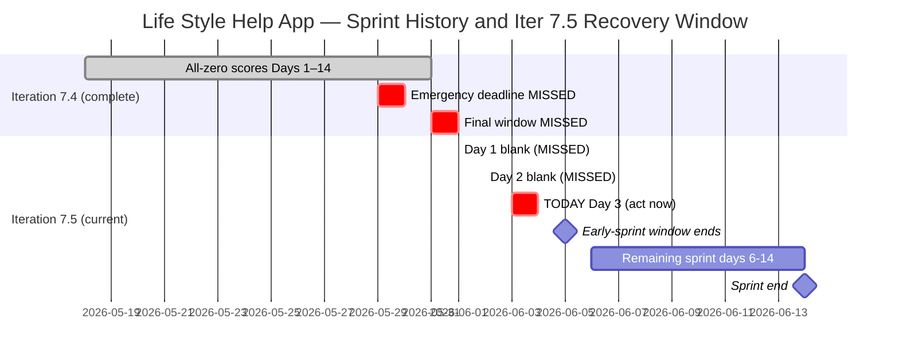
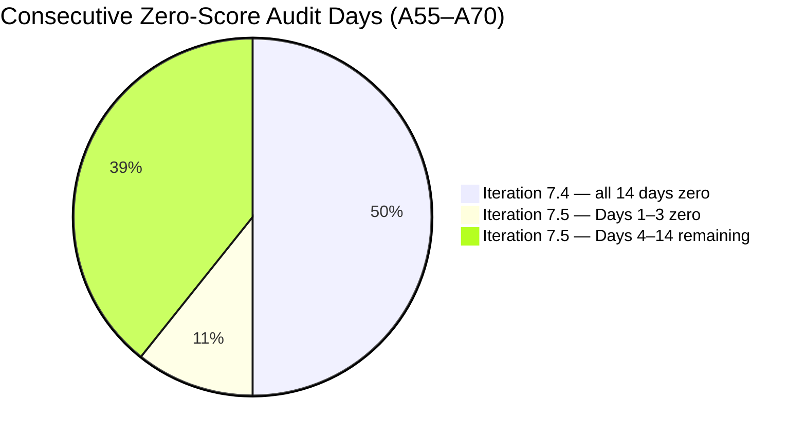

# ADO SAFe Audit — Life Style Help App Team

## 1. Audit Metadata

| Field | Value |
|-------|-------|
| Audit Number | A70 |
| Audit Date | 2026-06-03 |
| Audit Time | 02:07 UTC |
| Timezone | UTC |
| Iteration | Iteration 7.5 |
| Iteration Dates | 2026-06-01 – 2026-06-14 |
| Sprint Day | Day 3 of 14 |
| ADO Project | Life Style Help App (`0f447778-7156-4451-ab21-27be3c4a5888`) |
| ADO Team | Life Style Help App Team (`a2a805bc-0b30-4ef3-9a8a-b7f3081157a6`) |
| Iteration ID | `4aafce01-3cbe-4992-8e9e-8c55faf9bfb3` |
| Iteration Path | `Life Style Help App\2026-PI7\Iteration 7.5` |
| Workspace | `ado_ls_dev` |
| Prior Audit | AUDIT_20260602_0907.md (Score: 0.0 — Critical, A69, Iter 7.5 Day 2) |
| **Overall Score** | **0.0 / 100** |
| **Risk Band** | **Critical** |

> **Portfolio Note:** This workspace is excluded from `portfolio-health` and `portfolio-meeting-prep` aggregation per owner directive (2026-05-21). Individual audits continue per batch run policy.

---

## 2. Executive Summary

Iteration 7.5 is on **Day 3 of 14** and the Life Style Help App project remains at **0.0 / 100 (Critical)** for the **sixteenth consecutive audit** (A55 through A70). No ADO activity has been detected at the Stories and Deliverables level. The backlog remains completely empty; no capacity has been configured; no items exist in Iteration 7.5.

This audit now marks **Day 3 of the current iteration** and **Day 17 of continuous inactivity** spanning the entire Iteration 7.4 (14 days) plus the opening 3 days of Iteration 7.5. Every emergency deadline documented in prior audits has been missed. The early-sprint window for meaningful recovery is narrowing: Days 1–5 of 14 are the early-sprint period; after Day 5 (June 5), Delivery Predictability expectations normalize without any committed items.

**11 sprint days remain.** An emergency planning session executed today can still produce a meaningful sprint with full scoring potential. Without action by Day 5, the audit series continues its uninterrupted Critical trajectory.

---

## 3. Previous Audit Delta

| Metric | A69 (2026-06-02, Day 2) | A70 (2026-06-03, Day 3) | Change |
|--------|------------------------|------------------------|--------|
| Iteration | 7.5 | 7.5 | No change |
| Sprint Day | Day 2 of 14 | **Day 3 of 14** | +1 day elapsed |
| VRBI | 0 | **0** | No change |
| CIRI | 0 | **0** | No change |
| Capacity Configured | 0 | **0** | No change |
| SP Committed | 0 SP | **0 SP** | No change |
| SP Closed | 0 | **0** | No change |
| Recovery Action Observed | None | **None** | No change |
| Overall Score | 0.0 | **0.0** | No change |
| Risk Band | Critical | **Critical** | Unchanged |
| Consecutive Zero-Score Audits (A55+) | 15 | **16 (A55–A70)** | +1 |
| Sprint Days Remaining | 12 | **11** | −1 |
| Emergency Deadlines Missed | All | **All (no new action)** | No change |

### Day 2 → Day 3 Assessment

No ADO changes were detected between the Day 2 audit (June 2) and this audit (June 3). The Stories and Deliverables backlog for Life Style Help App Team remains empty. No items were created, no capacity was entered, no sprint goal was defined. This is the sixteenth consecutive 0.0/100 audit with zero observable ADO activity at the story level.

---

## 4. Current Iteration Snapshot

**Iteration 7.5** · 2026-06-01 – 2026-06-14 · **Day 3 of 14**

| Field | Value |
|-------|-------|
| Visible Root Backlog Items (VRBI) | **0** |
| Items in Iteration 7.5 (CIRI) | **0** |
| Total SP Committed | **0 SP** |
| Capacity Configured | **0** |
| Items Active | **0** |
| SP Burned | **0 SP** |
| Sprint Days Elapsed | 3 |
| Sprint Days Remaining | **11** |
| Recovery Window Status | Early sprint (Days 1–5); Day 5 = June 5 = last day for early-sprint annotation |
| Prior Iteration Outcome | Iter 7.4 — 0.0/100 all 14 days; Iter 7.5 Days 1–3 = 0.0/100 |
| Consecutive Zero-Score Audit Days | **16** (A55 through A70) |

---

## 5. Work Item Analysis

The Stories and Deliverables backlog (`Microsoft.RequirementCategory`) for the Life Style Help App Team is empty. Both `wit_list_backlog_work_items` and `wit_get_work_items_for_iteration` return empty results — confirmed across 16 consecutive audits.

| Metric | Value |
|--------|-------|
| visible_root_backlog_items (VRBI) | 0 |
| current_iteration_root_items (CIRI) | 0 |
| contributors_with_current_work (CW) | 0 |
| contributors_with_capacity (CC) | 0 |
| point_eligible_current_items (PECI) | 0 |
| estimated_current_items (ECI) | 0 |
| dor_compliant_current_items (DCI) | 0 |
| fresh_visible_root_items | 0 |
| stale_90_visible_root_items | 0 |
| stale_180_visible_root_items | 0 |
| untouched_current_items | 0 |
| committed_story_points (CSP) | 0 |
| closed_story_points (CLSP) | 0 |

No work item analysis table is possible (CIRI = 0).

**Epic-level context (out of scoring scope):** 3 Epics remain in the ADO project (IDs: 161354, 161363, 201599) per prior audit records. These are not in the Stories and Deliverables backlog and are not scored by the rubric. They represent the only observable ADO artifacts in the project and can serve as decomposition seeds if a sprint restart is initiated.

---

## 6. SAFe Compliance Scorecard

| Dimension | Score | Evidence (Numerator / Denominator) | Notes |
|-----------|-------|------------------------------------|-------|
| D1 — Iteration Planning | **0.0** | CIRI 0 / VRBI 0 | VRBI=0 → score forced to 0 |
| D2 — Team Capacity | **0.0** | CC 0 / CW 0 | CW=0 → score forced to 0 |
| D3 — Estimation | **0.0** | ECI 0 / PECI 0 | PECI=0 → score forced to 0 |
| D4 — DoR Compliance | **0.0** | DCI 0 / CIRI 0 | CIRI=0 → score forced to 0 |
| D5 — Work Item Balance | **0.0** | CIRI 0 | No current items → score 0 |
| D6 — Backlog Refinement | **0.0** | fresh 0 / VRBI 0 | VRBI=0 → score forced to 0 |
| D7 — Delivery Predictability | **0.0** | CLSP 0 / CSP 0 | CSP=0 → score 0 |

**Overall Score: (0 + 0 + 0 + 0 + 0 + 0 + 0) / 7 = 0.0 / 100 — Critical**

---

## 7. Dimension Findings

### D1 — Iteration Planning (0.0)

Formula: VRBI=0 → score 0. No items in the Stories and Deliverables backlog; no planning performed. `wit_list_backlog_work_items` returned an empty `workItems` array.

### D2 — Team Capacity (0.0)

Formula: CW=0 → score 0. No assignees on CIRI items; capacity API returns "No iteration capacity assigned to the teams." No team members have entered capacity for Iteration 7.5.

### D3 — Estimation (0.0)

Formula: PECI=0 → score 0. No story-level items exist in the iteration. Estimation is not possible.

### D4 — DoR Compliance (0.0)

Formula: CIRI=0 → score 0. No items to evaluate for Definition of Ready compliance.

### D5 — Work Item Balance (0.0)

Formula: CIRI=0 → score 0. Applied consistently with the A55–A70 series.

### D6 — Backlog Refinement (0.0)

Formula: VRBI=0 → score 0. The Stories and Deliverables backlog is empty. No refinement activity detectable at the story level.

### D7 — Delivery Predictability (0.0)

Formula: CSP=0 → score 0.
**Early-sprint annotation (Day 3 of 14):** Days 1–5 of a 14-day sprint. D7 = 0.0 is expected during early sprint — however the root cause is the complete absence of committed items, not timing.

---

## 8. Risks and Bottlenecks

| Risk | Severity | Status |
|------|----------|--------|
| Iteration 7.5 Day 3 — still blank; no planning action observed | **Critical** | 11 sprint days remaining |
| 17+ consecutive inactive days — no ADO story-level activity | **Critical** | Iter 7.4 full (14 days) + Iter 7.5 Days 1–3 |
| All documented emergency deadlines missed | **Critical** | May 29, May 31, Jun 1, Jun 2 — all passed without action |
| Stories and Deliverables backlog fully empty | **Critical** | 16 consecutive audits (A55–A70) |
| No capacity configured for Iteration 7.5 | **Critical** | Confirmed by capacity API error |
| Early-sprint window closing — Day 5 (June 5) is the boundary | **High** | 2 days remain in the early-sprint annotation window |
| No project disposition decision documented | **High** | No pause, restart, or closure signal visible in CLAUDE.md or ADO |
| Ownership risk on Samantha Babael | **High** | Unverifiable — no assignee data; watch flag from workspace context |
| 3 Epics not decomposed into Stories | **Medium** | 161354, 161363, 201599 exist; none linked to Iter 7.5; no decomposition observed |
| No sprint goal defined | **Medium** | No iteration commitment artifact detectable via API |

---

## 9. Prioritized Recommendations

**Iteration 7.5 — Day 3 of 14 — 11 days remain. Emergency action today or tomorrow is the last window with a meaningful early-sprint footprint.**

1. **IMMEDIATE (today, Day 3): Execute emergency sprint planning**
   - Create 3–5 User Stories in ADO under `Life Style Help App\2026-PI7\Iteration 7.5`
   - Each story must meet DoR: Description (≥ 30 non-whitespace chars) + Acceptance Criteria (≥ 20 non-whitespace chars) + Story Points > 0 + Assignee
   - Configure team capacity in Iteration 7.5 settings for at least one member
   - Set a sprint goal in the Iteration 7.5 description field
   - **Value of acting today:** 11 full sprint days remain; a properly planned iteration can still reach Moderate Risk or better

2. **IMMEDIATE: Document a project disposition decision**

   Three paths — choose one and record in `ado_ls_dev/CLAUDE.md` under `Project Exceptions`:

   **(a) Emergency restart** — Execute recommendation 1 today. Sprint recovery is still viable with 11 days remaining.

   **(b) Formal documented pause** — Record in `CLAUDE.md`: pause start date (2026-05-18), reason, and planned reactivation trigger. Stops escalating Critical audit counts; documents intentional status.

   **(c) Project discontinuation** — Archive the ADO project, update `CLAUDE.md` with closure date and reason, remove from audit rotation.

3. **Decompose Epic 161354 into Stories** — Epic `[Admin Web App] Layouts and Functionalities` (ID: 161354) is the most actionable starting point for sprint content. Decomposing it into 3–5 User Stories provides immediate sprint scope without requiring new feature ideation.

4. **Enforce DoR gate on all new stories** — Every story must have Description ≥ 30 chars, Acceptance Criteria ≥ 20 chars, SP > 0, and an assignee before iteration commitment.

5. **Distribute ownership risk** — When creating new stories, assign to at least 2 team members to avoid single-contributor concentration on Samantha Babael.

---

## 10. Evidence Gaps and Limitations

| Gap | Impact | Notes |
|-----|--------|-------|
| Stories and Deliverables backlog empty | All 7 dimensions score 0 | Confirmed via `wit_list_backlog_work_items` — not a measurement error; 16 consecutive audits |
| Capacity API error | D2 unresolvable | `work_get_iteration_capacities` returns "No iteration capacity assigned to the teams" |
| Root cause of project suspension unknown | Cannot classify status | 17+ days of inactivity; requires owner decision |
| Team member roster inaccessible | D2 absent | No active assignees; Samantha Babael watch flag from workspace context unverifiable |
| Epic-level items not audited | Scope note | 3 Epics (161354, 161363, 201599); audited scope is Stories and Deliverables |
| D5 formula edge case (CIRI=0) | Minor | Strictly, −40 penalty (no US type) would yield 60; series convention (A55–A70) reports 0.0 for CIRI=0 for consistency |
| Portfolio exclusion | Scope note | Excluded from portfolio-health and portfolio-meeting-prep per 2026-05-21 directive; individual audits continue |
| 16th consecutive zero-score audit | Escalation context | A55 (2026-05-18) through A70 (2026-06-03); no score improvement across 2 full sprints + 3 days |

---

## Visualizations

### Score Trend — Consecutive Zero Audit Series (A55–A70)

| Date | Audit | Score | Band | Iteration | Sprint Day |
|------|-------|-------|------|-----------|-----------|
| May 18 | A55 | 0.0 | Critical | 7.4 | Day 1 |
| May 19 | A56 | 0.0 | Critical | 7.4 | Day 2 |
| May 20 | A57 | 0.0 | Critical | 7.4 | Day 3 |
| May 21 | A58 | 0.0 | Critical | 7.4 | Day 4 |
| May 22 | A59 | 0.0 | Critical | 7.4 | Day 5 |
| May 23 | A60 | 0.0 | Critical | 7.4 | Day 6 |
| May 24 | A61 | 0.0 | Critical | 7.4 | Day 7 |
| May 25 | A62 | 0.0 | Critical | 7.4 | Day 8 |
| May 26 | A63 | 0.0 | Critical | 7.4 | Day 9 |
| May 27 | A64 | 0.0 | Critical | 7.4 | Day 10 |
| May 28 | A65 | 0.0 | Critical | 7.4 | Day 11 |
| May 29 | A66 | 0.0 | Critical | 7.4 | Day 12 |
| May 30 | A67 | 0.0 | Critical | 7.4 | Day 13 |
| Jun 01 | A68 | 0.0 | Critical | 7.5 | Day 1 |
| Jun 02 | A69 | 0.0 | Critical | 7.5 | Day 2 |
| **Jun 03** | **A70** | **0.0** | **Critical** | **7.5** | **Day 3** |

Sixteen consecutive Critical audits across two full sprints plus three days. Recovery requires immediate owner action — 11 sprint days remain.

---

*Audit A70 generated by Claude Code (claude-sonnet-4-6) on 2026-06-03 02:07 UTC. Evidence sourced from Azure DevOps MCP (Life Style Help App project, GUID: 0f447778-7156-4451-ab21-27be3c4a5888, team a2a805bc-0b30-4ef3-9a8a-b7f3081157a6). Rubric: SAFe 6.0 7-dimension scorecard v1. This workspace is excluded from portfolio-level aggregation per portfolio-health exclusion policy (2026-05-21). All seven dimensions score 0.0 due to empty backlog — 16th consecutive Critical audit.*
