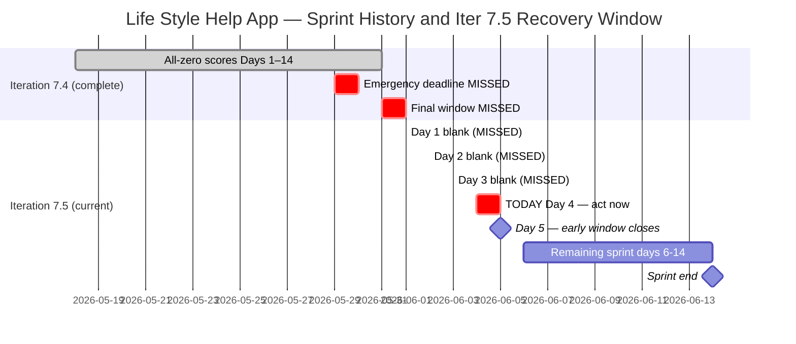
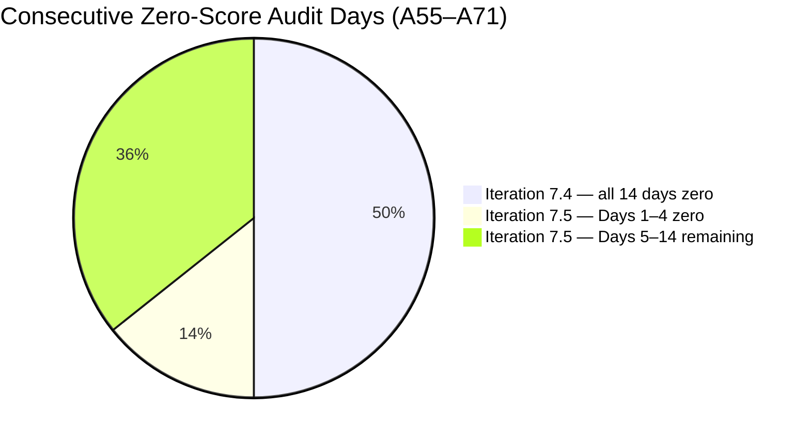

# ADO SAFe Audit — Life Style Help App Team

## 1. Audit Metadata

| Field | Value |
|-------|-------|
| Audit Number | A71 |
| Audit Date | 2026-06-04 |
| Audit Time | 00:05 UTC |
| Timezone | UTC |
| Iteration | Iteration 7.5 |
| Iteration Dates | 2026-06-01 – 2026-06-14 |
| Sprint Day | Day 4 of 14 |
| ADO Project | Life Style Help App (`0f447778-7156-4451-ab21-27be3c4a5888`) |
| ADO Team | Life Style Help App Team (`a2a805bc-0b30-4ef3-9a8a-b7f3081157a6`) |
| Iteration ID | `4aafce01-3cbe-4992-8e9e-8c55faf9bfb3` |
| Iteration Path | `Life Style Help App\2026-PI7\Iteration 7.5` |
| Workspace | `ado_ls_dev` |
| Prior Audit | AUDIT_20260603_0207.md (Score: 0.0 — Critical, A70, Iter 7.5 Day 3) |
| **Overall Score** | **0.0 / 100** |
| **Risk Band** | **Critical** |

> **Portfolio Note:** This workspace is excluded from `portfolio-health` and `portfolio-meeting-prep` aggregation per owner directive (2026-05-21). Individual audits continue per batch run policy.

---

## 2. Executive Summary

Iteration 7.5 is on **Day 4 of 14** and the Life Style Help App project remains at **0.0 / 100 (Critical)** — the **seventeenth consecutive zero-score audit** (A55 through A71). No ADO activity has been detected at the Stories and Deliverables level. The backlog remains completely empty; no capacity has been configured; no items exist in Iteration 7.5.

**Today marks the end of the early-sprint annotation window.** Days 1–5 of 14 are the early-sprint period; Day 5 (June 5) is the last day where Delivery Predictability = 0 is expected rather than alarming. After Day 5, D7 = 0.0 will reflect a sprint with both zero planned work and zero delivery — the most severe combination in the scoring rubric.

With 10 days remaining, a complete sprint recovery is still theoretically possible — but the window is narrowing to the point where any recovery must happen today or tomorrow to produce a meaningful sprint. Emergency sprint planning executed now can still yield a Moderate Risk outcome (60–79.9) if 3–5 properly defined stories are committed immediately.

---

## 3. Previous Audit Delta

| Metric | A70 (2026-06-03, Day 3) | A71 (2026-06-04, Day 4) | Change |
|--------|------------------------|------------------------|--------|
| Iteration | 7.5 | 7.5 | No change |
| Sprint Day | Day 3 of 14 | **Day 4 of 14** | +1 day elapsed |
| VRBI | 0 | **0** | No change |
| CIRI | 0 | **0** | No change |
| Capacity Configured | 0 | **0** | No change |
| SP Committed | 0 SP | **0 SP** | No change |
| SP Closed | 0 | **0** | No change |
| Recovery Action Observed | None | **None** | No change |
| Overall Score | 0.0 | **0.0** | No change |
| Risk Band | Critical | **Critical** | Unchanged |
| Consecutive Zero-Score Audits | 16 (A55–A70) | **17 (A55–A71)** | +1 |
| Sprint Days Remaining | 11 | **10** | −1 |
| Emergency Deadlines Missed | All | **All (no new action)** | No change |
| Early-Sprint Window | Day 3 of 5 | **Day 4 of 5 (last full day)** | Closing |

### Day 3 → Day 4 Assessment

No ADO changes were detected between the Day 3 audit (June 3) and this audit (June 4). The Stories and Deliverables backlog for Life Style Help App Team remains empty. No items were created, no capacity was entered, no sprint goal was defined. This is the seventeenth consecutive 0.0/100 audit with zero observable ADO activity at the story level. Day 4 is the last full day of the early-sprint annotation window before D7 = 0.0 transitions from "expected" to "sprint failure."

---

## 4. Current Iteration Snapshot

**Iteration 7.5** · 2026-06-01 – 2026-06-14 · **Day 4 of 14** · 10 days remaining

| Field | Value |
|-------|-------|
| Visible Root Backlog Items (VRBI) | **0** |
| Items in Iteration 7.5 (CIRI) | **0** |
| Total SP Committed | **0 SP** |
| Capacity Configured | **0** |
| Items Active | **0** |
| SP Burned | **0 SP** |
| Sprint Days Elapsed | 4 |
| Sprint Days Remaining | **10** |
| Early-Sprint Window | Day 4 of 5 (closes June 5) |
| Recovery Window Status | **CLOSING** — last viable planning day is today (Day 4) or Day 5 |
| Prior Iteration Outcome | Iter 7.4 — 0.0/100 all 14 days; Iter 7.5 Days 1–4 = 0.0/100 |
| Consecutive Zero-Score Audit Days | **17** (A55 through A71) |

---

## 5. Work Item Analysis

The Stories and Deliverables backlog (`Microsoft.RequirementCategory`) for the Life Style Help App Team is empty. Both `wit_list_backlog_work_items` and `wit_get_work_items_for_iteration` return empty results — confirmed across 17 consecutive audits.

| Metric | Value |
|--------|-------|
| visible_root_backlog_items (VRBI) | 0 |
| current_iteration_root_items (CIRI) | 0 |
| contributors_with_current_work (CW) | 0 |
| contributors_with_capacity (CC) | 0 |
| point_eligible_current_items (PECI) | 0 |
| estimated_current_items (ECI) | 0 |
| dor_compliant_current_items (DCI) | 0 |
| fresh_visible_root_items | 0 |
| stale_90_visible_root_items | 0 |
| stale_180_visible_root_items | 0 |
| untouched_current_items | 0 |
| committed_story_points (CSP) | 0 |
| closed_story_points (CLSP) | 0 |

No work item analysis table is possible (CIRI = 0).

**Epic-level context (out of scoring scope):** 3 Epics remain in the ADO project (IDs: 161354, 161363, 201599) per prior audit records. These are not in the Stories and Deliverables backlog and are not scored by the rubric. They represent the only observable ADO artifacts in the project and can serve as decomposition seeds if a sprint restart is initiated.

---

## 6. SAFe Compliance Scorecard

| Dimension | Score | Evidence (Numerator / Denominator) | Notes |
|-----------|-------|------------------------------------|-------|
| D1 — Iteration Planning | **0.0** | CIRI 0 / VRBI 0 | VRBI=0 → score forced to 0 |
| D2 — Team Capacity | **0.0** | CC 0 / CW 0 | CW=0 → score forced to 0 |
| D3 — Estimation | **0.0** | ECI 0 / PECI 0 | PECI=0 → score forced to 0 |
| D4 — DoR Compliance | **0.0** | DCI 0 / CIRI 0 | CIRI=0 → score forced to 0 |
| D5 — Work Item Balance | **0.0** | CIRI 0 | No current items → score 0 |
| D6 — Backlog Refinement | **0.0** | fresh 0 / VRBI 0 | VRBI=0 → score forced to 0 |
| D7 — Delivery Predictability | **0.0** | CLSP 0 / CSP 0 | CSP=0 → score 0 |

**Overall Score: (0 + 0 + 0 + 0 + 0 + 0 + 0) / 7 = 0.0 / 100 — Critical**

---

## 7. Dimension Findings

### D1 — Iteration Planning (0.0)

Formula: VRBI=0 → score 0. No items in the Stories and Deliverables backlog; no planning performed. `wit_list_backlog_work_items` returned an empty `workItems` array for the 17th consecutive audit.

### D2 — Team Capacity (0.0)

Formula: CW=0 → score 0. No assignees on CIRI items; capacity API returns "No iteration capacity assigned to the teams." No team members have entered capacity for Iteration 7.5.

### D3 — Estimation (0.0)

Formula: PECI=0 → score 0. No story-level items exist in the iteration.

### D4 — DoR Compliance (0.0)

Formula: CIRI=0 → score 0. No items to evaluate for Definition of Ready compliance.

### D5 — Work Item Balance (0.0)

Formula: CIRI=0 → score 0. Applied consistently with the A55–A71 series.

### D6 — Backlog Refinement (0.0)

Formula: VRBI=0 → score 0. The Stories and Deliverables backlog is empty. No refinement activity detectable at the story level.

### D7 — Delivery Predictability (0.0)

Formula: CSP=0 → score 0.

**Early-sprint annotation (Day 4 of 14):** Today is the last full day of the early-sprint window (Days 1–5 of 14). D7 = 0.0 is still technically in the annotated range — however the root cause is the complete absence of committed items, not timing. After June 5, D7 = 0.0 will no longer be annotated as "expected."

---

## 8. Risks and Bottlenecks

| Risk | Severity | Status |
|------|----------|--------|
| Iteration 7.5 Day 4 — still blank; no planning action observed | **Critical** | 10 sprint days remaining |
| 18+ consecutive inactive days — no ADO story-level activity | **Critical** | Iter 7.4 full (14 days) + Iter 7.5 Days 1–4 |
| All documented emergency deadlines missed | **Critical** | May 29, May 31, Jun 1, Jun 2, Jun 3 — all passed without action |
| Stories and Deliverables backlog fully empty | **Critical** | 17 consecutive audits (A55–A71) |
| No capacity configured for Iteration 7.5 | **Critical** | Confirmed by capacity API error |
| Early-sprint annotation window closing — Day 5 (June 5) is the last day | **Critical** | After June 5, D7=0.0 is no longer annotated as "expected early sprint" |
| No project disposition decision documented | **High** | No pause, restart, or closure signal visible in CLAUDE.md or ADO |
| Ownership risk on Samantha Babael | **High** | Unverifiable — no assignee data; watch flag from workspace context |
| 3 Epics not decomposed into Stories | **Medium** | 161354, 161363, 201599 exist; none linked to Iter 7.5 |
| No sprint goal defined | **Medium** | No iteration commitment artifact detectable via API |

---

## 9. Prioritized Recommendations

**Iteration 7.5 — Day 4 of 14 — 10 days remain. Today is the last opportunity to act within the early-sprint annotation window.**

1. **IMMEDIATE (today, Day 4 — last viable day): Execute emergency sprint planning**
   - Create 3–5 User Stories in ADO under `Life Style Help App\2026-PI7\Iteration 7.5`
   - Each story must meet DoR: Description (≥ 30 non-whitespace chars) + Acceptance Criteria (≥ 20 non-whitespace chars) + Story Points > 0 + Assignee
   - Configure team capacity in Iteration 7.5 settings for at least one member
   - Set a sprint goal in the Iteration 7.5 description field
   - **Value of acting today:** 10 full sprint days remain; a properly planned iteration can still reach Moderate Risk or better. Acting on Day 5 reduces the window to 9 days.

2. **IMMEDIATE: Document a project disposition decision**

   Three paths — choose one and record in `ado_ls_dev/CLAUDE.md` under `Project Exceptions`:

   **(a) Emergency restart** — Execute recommendation 1 today. Sprint recovery is still viable with 10 days remaining.

   **(b) Formal documented pause** — Record in `CLAUDE.md`: pause start date (2026-05-18), reason, and planned reactivation trigger. Stops escalating Critical audit counts; documents intentional status. This workspace is already excluded from portfolio aggregation; a pause note aligns the audit record with the actual project state.

   **(c) Project discontinuation** — Archive the ADO project, update `CLAUDE.md` with closure date and reason, remove from audit rotation.

3. **Decompose Epic 161354 into Stories** — Epic `[Admin Web App] Layouts and Functionalities` (ID: 161354) is the most actionable starting point for sprint content. Decomposing it into 3–5 User Stories provides immediate sprint scope without requiring new feature ideation. Each story should cover a distinct layout or functionality block.

4. **Enforce DoR gate on all new stories** — Every story must have Description ≥ 30 chars, Acceptance Criteria ≥ 20 chars, SP > 0, and an assignee before iteration commitment.

5. **Distribute ownership risk** — When creating new stories, assign to at least 2 team members to avoid single-contributor concentration on Samantha Babael.

---

## 10. Evidence Gaps and Limitations

| Gap | Impact | Notes |
|-----|--------|-------|
| Stories and Deliverables backlog empty | All 7 dimensions score 0 | Confirmed via `wit_list_backlog_work_items` — not a measurement error; 17 consecutive audits |
| Capacity API error | D2 unresolvable | `work_get_iteration_capacities` returns "No iteration capacity assigned to the teams" |
| Root cause of project suspension unknown | Cannot classify status | 18+ days of inactivity; requires owner decision |
| Team member roster inaccessible | D2 absent | No active assignees; Samantha Babael watch flag from workspace context unverifiable |
| Epic-level items not audited | Scope note | 3 Epics (161354, 161363, 201599); audited scope is Stories and Deliverables |
| D5 formula edge case (CIRI=0) | Minor | Strictly, −40 penalty (no US type) would yield 60; series convention (A55–A71) reports 0.0 for CIRI=0 for consistency |
| Portfolio exclusion | Scope note | Excluded from portfolio-health and portfolio-meeting-prep per 2026-05-21 directive; individual audits continue |
| 17th consecutive zero-score audit | Escalation context | A55 (2026-05-18) through A71 (2026-06-04); no score improvement across 2 full sprints + 4 days |

---

## Visualizations

### Score Trend — Consecutive Zero Audit Series (A55–A71)

| Date | Audit | Score | Band | Iteration | Sprint Day |
|------|-------|-------|------|-----------|-----------|
| May 18 | A55 | 0.0 | Critical | 7.4 | Day 1 |
| May 19 | A56 | 0.0 | Critical | 7.4 | Day 2 |
| May 20 | A57 | 0.0 | Critical | 7.4 | Day 3 |
| May 21 | A58 | 0.0 | Critical | 7.4 | Day 4 |
| May 22 | A59 | 0.0 | Critical | 7.4 | Day 5 |
| May 23 | A60 | 0.0 | Critical | 7.4 | Day 6 |
| May 24 | A61 | 0.0 | Critical | 7.4 | Day 7 |
| May 25 | A62 | 0.0 | Critical | 7.4 | Day 8 |
| May 26 | A63 | 0.0 | Critical | 7.4 | Day 9 |
| May 27 | A64 | 0.0 | Critical | 7.4 | Day 10 |
| May 28 | A65 | 0.0 | Critical | 7.4 | Day 11 |
| May 29 | A66 | 0.0 | Critical | 7.4 | Day 12 |
| May 30 | A67 | 0.0 | Critical | 7.4 | Day 13 |
| Jun 01 | A68 | 0.0 | Critical | 7.5 | Day 1 |
| Jun 02 | A69 | 0.0 | Critical | 7.5 | Day 2 |
| Jun 03 | A70 | 0.0 | Critical | 7.5 | Day 3 |
| **Jun 04** | **A71** | **0.0** | **Critical** | **7.5** | **Day 4** |

Seventeen consecutive Critical audits across two full sprints plus four days. Early-sprint window closes tomorrow (Day 5). Recovery requires immediate owner action — 10 sprint days remain.

---

*Audit A71 generated by Claude Code (claude-sonnet-4-6) on 2026-06-04 00:05 UTC. Evidence sourced from Azure DevOps MCP (Life Style Help App project, GUID: 0f447778-7156-4451-ab21-27be3c4a5888, team a2a805bc-0b30-4ef3-9a8a-b7f3081157a6, Iteration 7.5 ID 4aafce01-3cbe-4992-8e9e-8c55faf9bfb3). Rubric: SAFe 6.0 7-dimension scorecard v1. This workspace is excluded from portfolio-level aggregation per portfolio-health exclusion policy (2026-05-21). All seven dimensions score 0.0 — 17th consecutive Critical audit. Early-sprint window closes June 5; last viable emergency planning window is today.*
