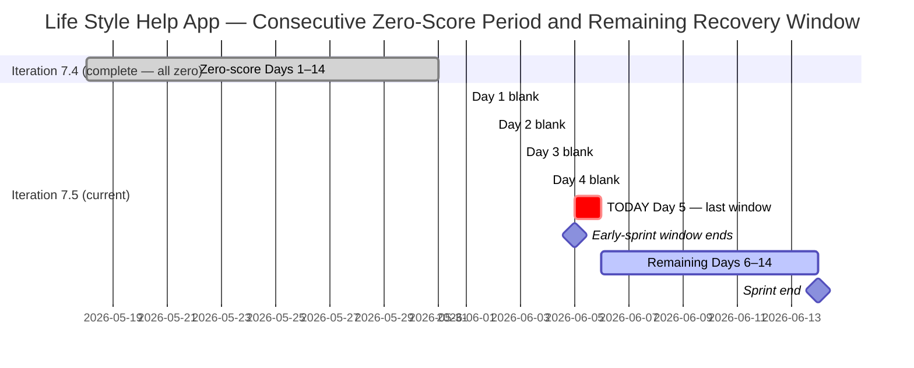
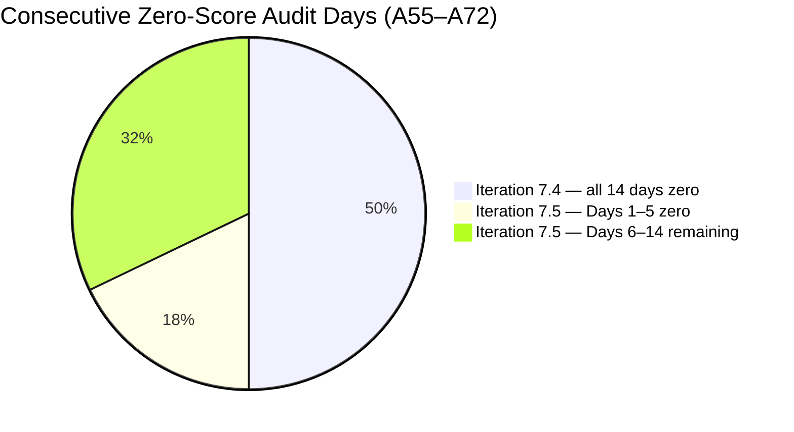

# ADO SAFe Audit — Life Style Help App Team

## 1. Audit Metadata

| Field | Value |
|-------|-------|
| Audit Number | A72 |
| Audit Date | 2026-06-05 |
| Audit Time | 09:00 UTC |
| Timezone | UTC |
| Iteration | Iteration 7.5 |
| Iteration Dates | 2026-06-01 – 2026-06-14 |
| Sprint Day | Day 5 of 14 |
| ADO Project | Life Style Help App (`0f447778-7156-4451-ab21-27be3c4a5888`) |
| ADO Team | Life Style Help App Team (`a2a805bc-0b30-4ef3-9a8a-b7f3081157a6`) |
| Iteration ID | `4aafce01-3cbe-4992-8e9e-8c55faf9bfb3` |
| Iteration Path | `Life Style Help App\2026-PI7\Iteration 7.5` |
| Workspace | `ado_ls_dev` |
| Prior Audit | AUDIT_20260604_0005.md (Score: 0.0 — Critical, A71, Day 4) |
| **Overall Score** | **0.0 / 100** |
| **Risk Band** | **Critical** |

> **Portfolio Note:** This workspace is excluded from `portfolio-health` and `portfolio-meeting-prep` aggregation per owner directive (2026-05-21). Individual audits continue per batch run policy.

---

## 2. Executive Summary

Iteration 7.5 is on **Day 5 of 14** and the Life Style Help App project remains at **0.0 / 100 (Critical)** — the **eighteenth consecutive zero-score audit** (A55 through A72). No ADO activity has been detected at the Stories and Deliverables level. The backlog remains completely empty; no capacity has been configured; no items exist in Iteration 7.5.

**Today marks the end of the early-sprint annotation window.** Day 5 is the last day where D7 = 0.0 is annotated as "expected early-sprint behavior." From Day 6 (June 6) onward, D7 = 0.0 will reflect a sprint with zero committed work and zero delivery — the most severe possible combination. There is no longer a technical excuse for the zero score.

The sprint recovery window is closing. With 9 days remaining (Days 6–14), a full sprint with properly defined stories can still yield Moderate Risk or better — but this requires immediate action. Every day of further inaction reduces both the recovery window and the maximum achievable score for the sprint.

**Recommended owner decision (repeated for 18th audit):** Choose one of three documented paths: (a) Emergency restart today, (b) Formal documented pause, or (c) Project discontinuation. No new path is available at this point.

---

## 3. Previous Audit Delta

| Metric | A71 (2026-06-04, Day 4) | A72 (2026-06-05, Day 5) | Change |
|--------|------------------------|------------------------|--------|
| Iteration | 7.5 | 7.5 | No change |
| Sprint Day | Day 4 of 14 | **Day 5 of 14** | +1 day elapsed |
| VRBI | 0 | **0** | No change |
| CIRI | 0 | **0** | No change |
| Capacity Configured | 0 | **0** | No change |
| SP Committed | 0 SP | **0 SP** | No change |
| SP Closed | 0 | **0** | No change |
| Recovery Action Observed | None | **None** | No change |
| Overall Score | 0.0 | **0.0** | No change |
| Risk Band | Critical | **Critical** | Unchanged |
| Consecutive Zero-Score Audits | 17 (A55–A71) | **18 (A55–A72)** | +1 |
| Sprint Days Remaining | 10 | **9** | −1 |
| Early-Sprint Window | Day 4 of 5 | **Day 5 of 5 — CLOSES TODAY** | Window closing |
| Emergency Deadlines Missed | All | **All (no new action)** | No change |

### Day 4 → Day 5 Assessment

No ADO changes were detected between the Day 4 audit (June 4) and this audit (June 5). The Stories and Deliverables backlog for Life Style Help App Team remains empty. The capacity API returns the same error ("No iteration capacity assigned to the teams"). This is the eighteenth consecutive 0.0/100 audit with zero observable ADO activity at the story level. Today (Day 5) is the last day of the early-sprint annotation window.

---

## 4. Current Iteration Snapshot

**Iteration 7.5** · 2026-06-01 – 2026-06-14 · **Day 5 of 14** · 9 days remaining

| Field | Value |
|-------|-------|
| Visible Root Backlog Items (VRBI) | **0** |
| Items in Iteration 7.5 (CIRI) | **0** |
| Total SP Committed | **0 SP** |
| Capacity Configured | **0** |
| Items Active | **0** |
| SP Burned | **0 SP** |
| Sprint Days Elapsed | 5 |
| Sprint Days Remaining | **9** |
| Early-Sprint Window | **Day 5 — CLOSES TODAY** |
| Recovery Window Status | **CRITICAL — last annotated day; action required now** |
| Prior Iteration Outcome | Iter 7.4 — 0.0/100 all 14 days; Iter 7.5 Days 1–5 = 0.0/100 |
| Consecutive Zero-Score Audit Days | **18** (A55 through A72) |

---

## 5. Work Item Analysis

The Stories and Deliverables backlog (`Microsoft.RequirementCategory`) for the Life Style Help App Team is empty. Both `wit_list_backlog_work_items` and `wit_get_work_items_for_iteration` return empty results — confirmed across 18 consecutive audits.

| Metric | Value |
|--------|-------|
| visible_root_backlog_items (VRBI) | 0 |
| current_iteration_root_items (CIRI) | 0 |
| contributors_with_current_work (CW) | 0 |
| contributors_with_capacity (CC) | 0 |
| point_eligible_current_items (PECI) | 0 |
| estimated_current_items (ECI) | 0 |
| dor_compliant_current_items (DCI) | 0 |
| fresh_visible_root_items | 0 |
| stale_90_visible_root_items | 0 |
| stale_180_visible_root_items | 0 |
| untouched_current_items | 0 |
| committed_story_points (CSP) | 0 |
| closed_story_points (CLSP) | 0 |

No work item analysis table is possible (CIRI = 0).

**Epic-level context (out of scoring scope):** 3 Epics remain in the ADO project (IDs: 161354, 161363, 201599) per prior audit records. These are not in the Stories and Deliverables backlog and are not scored. Epic 161354 ([Admin Web App] Layouts and Functionalities) remains the most actionable decomposition seed.

---

## 6. SAFe Compliance Scorecard

| Dimension | Score | Evidence (Numerator / Denominator) | Notes |
|-----------|-------|------------------------------------|-------|
| D1 — Iteration Planning | **0.0** | CIRI 0 / VRBI 0 | VRBI=0 → score 0 |
| D2 — Team Capacity | **0.0** | CC 0 / CW 0 | CW=0 → score 0 |
| D3 — Estimation | **0.0** | ECI 0 / PECI 0 | PECI=0 → score 0 |
| D4 — DoR Compliance | **0.0** | DCI 0 / CIRI 0 | CIRI=0 → score 0 |
| D5 — Work Item Balance | **0.0** | CIRI 0 | No items → score 0 |
| D6 — Backlog Refinement | **0.0** | fresh 0 / VRBI 0 | VRBI=0 → score 0 |
| D7 — Delivery Predictability | **0.0** | CLSP 0 / CSP 0 | CSP=0 → score 0 |

**Overall Score: (0 + 0 + 0 + 0 + 0 + 0 + 0) / 7 = 0.0 / 100 — Critical**

---

## 7. Dimension Findings

### D1 — Iteration Planning (0.0)

Formula: VRBI=0 → score 0. No items in the Stories and Deliverables backlog. 18th consecutive zero.

### D2 — Team Capacity (0.0)

Formula: CW=0 → score 0. Capacity API returns error: "No iteration capacity assigned to the teams." 18th consecutive zero.

### D3 — Estimation (0.0)

Formula: PECI=0 → score 0. No story-level items exist. 18th consecutive zero.

### D4 — DoR Compliance (0.0)

Formula: CIRI=0 → score 0. No items to evaluate. 18th consecutive zero.

### D5 — Work Item Balance (0.0)

Formula: CIRI=0 → score 0. Applied consistently with A55–A72 series.

### D6 — Backlog Refinement (0.0)

Formula: VRBI=0 → score 0. Empty backlog. 18th consecutive zero.

### D7 — Delivery Predictability (0.0)

Formula: CSP=0 → score 0.

**Early-sprint annotation (Day 5 — FINAL annotated day):** Today is the last day of the early-sprint window. From Day 6 onward, D7 = 0.0 is no longer annotated — it is a sprint failure signal. The root cause remains the complete absence of committed items, not timing. Tomorrow's score will carry no annotation.

---

## 8. Risks and Bottlenecks

| Risk | Severity | Status |
|------|----------|--------|
| Day 5 — early-sprint annotation window CLOSES TODAY | **Critical** | After today D7=0 is unmitigated sprint failure signal |
| Iteration 7.5 Day 5 — still blank; 19+ consecutive inactive days | **Critical** | Iter 7.4 full (14 days) + Iter 7.5 Days 1–5 (5 days) = 19 days of zero activity |
| 18 consecutive zero-score audits (A55–A72) | **Critical** | Spanning 2 full sprints + 5 days |
| All documented emergency deadlines missed | **Critical** | May 29, 31, Jun 1, 2, 3, 4 — all passed without action |
| Stories and Deliverables backlog empty for 19 days | **Critical** | Confirmed by API 18 consecutive times |
| No capacity configured for Iteration 7.5 | **Critical** | Capacity API error persists |
| No project disposition decision documented | **High** | No pause, restart, or closure signal in CLAUDE.md or ADO |
| 3 Epics not decomposed into Stories | **Medium** | 161354, 161363, 201599 — potential sprint content if action taken today |
| No sprint goal defined | **Medium** | No iteration commitment artifact detectable |

---

## 9. Prioritized Recommendations

**Iteration 7.5 — Day 5 of 14 — 9 sprint days remain. Today is the last day of the early-sprint annotation window. From Day 6 onward, every dimension scores at its worst possible state.**

1. **IMMEDIATE (today, Day 5): Choose and execute a disposition decision**

   Three paths — choose one and act:

   **(a) Emergency restart** — Execute sprint planning today:
   - Create 3–5 User Stories in ADO under `Life Style Help App\2026-PI7\Iteration 7.5`
   - Each story must have: Description ≥30 non-whitespace chars, Acceptance Criteria ≥20 non-whitespace chars, Story Points > 0, Assignee
   - Configure capacity for at least one team member
   - Set a sprint goal
   - **Value of acting today:** 9 full sprint days remain (Days 6–14). A properly planned 5-story sprint can still reach Moderate Risk (60–79.9) with consistent daily delivery.
   - Start with Epic 161354 ([Admin Web App] Layouts and Functionalities) — decompose into 3–5 layout or functionality stories.

   **(b) Formal documented pause** — Record in `ado_ls_dev/CLAUDE.md` under `Project Exceptions`:
   - Pause start date: 2026-05-18 (first zero-score audit A55)
   - Reason: [owner to supply]
   - Planned reactivation trigger: [owner to supply]
   - Effect: Stops escalating Critical audit counts; documents intentional status. Workspace already excluded from portfolio aggregation per 2026-05-21 directive; a pause note aligns audit record with actual project state.

   **(c) Project discontinuation** — Archive the ADO project:
   - Update `ado_ls_dev/CLAUDE.md` with closure date and reason
   - Remove from audit rotation
   - Archive ADO project (Life Style Help App, GUID: 0f447778-7156-4451-ab21-27be3c4a5888)

2. **If restarting: Enforce DoR gate** — Every new story must meet DoR before sprint commitment. No story added to Iter 7.5 without Description ≥30 chars, AC ≥20 chars, SP > 0, and Assignee.

3. **If restarting: Distribute ownership** — Assign to at least 2 team members to avoid concentration on Samantha Babael (flagged in workspace CLAUDE.md). Target: max 60% items per single assignee.

4. **If restarting: Decompose Epic 161354 first** — This is the most actionable starting point. Possible child stories: (a) Admin layout: Dashboard page structure, (b) Admin layout: Navigation sidebar, (c) Admin functionality: User authentication flow, (d) Admin functionality: Settings page, (e) Admin functionality: Data input forms.

---

## 10. Evidence Gaps and Limitations

| Gap | Impact | Notes |
|-----|--------|-------|
| Stories and Deliverables backlog empty | All 7 dimensions score 0 | Confirmed via `wit_list_backlog_work_items` — 18 consecutive audits |
| Capacity API error | D2 unresolvable | "No iteration capacity assigned to the teams" — 18 consecutive audits |
| Root cause of project suspension unknown | Cannot classify status | 19+ days of inactivity; owner decision required |
| Team member roster inaccessible | D2 absent | No active assignees; watch flag on Samantha Babael unverifiable |
| Epic-level items not audited | Scope note | 3 Epics (161354, 161363, 201599); audited scope is Stories and Deliverables only |
| Portfolio exclusion | Scope note | Excluded from portfolio-health and portfolio-meeting-prep per 2026-05-21 directive |
| 18 consecutive zero-score audits | Escalation context | A55 (2026-05-18) through A72 (2026-06-05); no improvement across 2 full sprints + 5 days |

---

## Visualizations

### Score Trend — Consecutive Zero Audit Series (A55–A72)

| Date | Audit | Score | Band | Iteration | Sprint Day |
|------|-------|-------|------|-----------|-----------|
| May 18 | A55 | 0.0 | Critical | 7.4 | Day 1 |
| May 19–31 | A56–A67 | 0.0 | Critical | 7.4 | Days 2–14 |
| Jun 01 | A68 | 0.0 | Critical | 7.5 | Day 1 |
| Jun 02 | A69 | 0.0 | Critical | 7.5 | Day 2 |
| Jun 03 | A70 | 0.0 | Critical | 7.5 | Day 3 |
| Jun 04 | A71 | 0.0 | Critical | 7.5 | Day 4 |
| **Jun 05** | **A72** | **0.0** | **Critical** | **7.5** | **Day 5 — Early-sprint window closes today** |

Eighteen consecutive Critical audits spanning two full sprints plus five days. From Day 6 onward there is no annotation. The rubric will report 0.0 as an unqualified sprint failure.

---

*Audit A72 generated by Claude Code (claude-sonnet-4-6) on 2026-06-05 09:00 UTC. Evidence sourced from Azure DevOps MCP (Life Style Help App project, GUID: 0f447778-7156-4451-ab21-27be3c4a5888, team a2a805bc-0b30-4ef3-9a8a-b7f3081157a6, Iteration 7.5 ID 4aafce01-3cbe-4992-8e9e-8c55faf9bfb3). Rubric: SAFe 6.0 7-dimension scorecard v1. This workspace is excluded from portfolio-level aggregation per portfolio-health exclusion policy (2026-05-21). All seven dimensions score 0.0 — 18th consecutive Critical audit. Early-sprint annotation window closes today (Day 5). 9 sprint days remain. Owner action required: restart, pause, or discontinue.*
