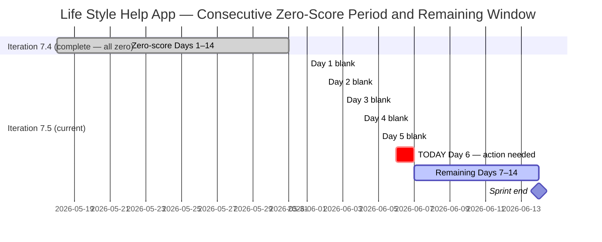
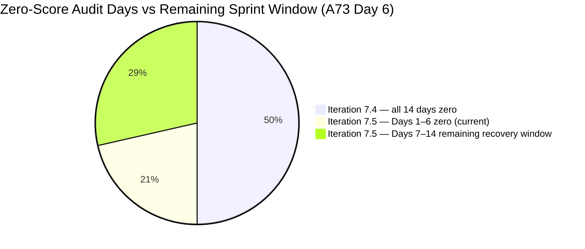
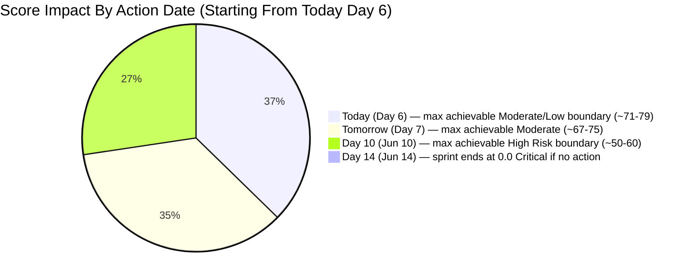

# ADO SAFe Audit — Life Style Help App Team

## 1. Audit Metadata

| Field | Value |
|-------|-------|
| Audit Number | A73 |
| Audit Date | 2026-06-06 |
| Audit Time | 09:00 CST |
| Timezone | CST |
| Iteration | Iteration 7.5 |
| Iteration Dates | 2026-06-01 – 2026-06-14 |
| Sprint Day | Day 6 of 14 |
| ADO Project | Life Style Help App (`0f447778-7156-4451-ab21-27be3c4a5888`) |
| ADO Team | Life Style Help App Team (`a2a805bc-0b30-4ef3-9a8a-b7f3081157a6`) |
| Iteration ID | `4aafce01-3cbe-4992-8e9e-8c55faf9bfb3` |
| Iteration Path | `Life Style Help App\2026-PI7\Iteration 7.5` |
| Workspace | `ado_ls_dev` |
| Prior Audit | AUDIT_20260605_0900.md (Score: 0.0 — Critical, A72, Day 5) |
| **Overall Score** | **0.0 / 100** |
| **Risk Band** | **Critical** |

> **Portfolio Note:** This workspace is excluded from `portfolio-health` and `portfolio-meeting-prep` aggregation per owner directive (2026-05-21). Individual audits continue per batch run policy.

---

## 2. Executive Summary

Iteration 7.5 is on **Day 6 of 14** and the Life Style Help App project remains at **0.0 / 100 (Critical)** — the **nineteenth consecutive zero-score audit** (A55 through A73). The Stories and Deliverables backlog is empty. No capacity has been configured. No items exist in Iteration 7.5. Zero activity was recorded overnight.

**The early-sprint annotation window closed yesterday (Day 5).** As of today (Day 6), D7 = 0.0 carries no annotation, no qualifier, and no grace — it is an unambiguous sprint failure signal. All seven dimensions score 0.0 for the identical reason: VRBI = 0.

The sprint recovery window is now critically short. **8 days remain (Days 7–14).** A sprint created today with 5 properly defined stories and consistent delivery could still reach High Risk (40–59.9) by sprint end. Low Risk or Moderate Risk outcomes remain theoretically achievable if execution begins immediately and is sustained. However, the probability of recovery diminishes with each additional inactive day.

The three disposition options documented in the prior audit (A72) remain the only available paths. No new resolution mechanism exists. The owner decision is now in the window where the sprint outcome is still malleable — but only for the next 24–48 hours.

---

## 3. Previous Audit Delta

| Metric | A72 (2026-06-05, Day 5) | A73 (2026-06-06, Day 6) | Change |
|--------|------------------------|------------------------|--------|
| Iteration | 7.5 | 7.5 | No change |
| Sprint Day | Day 5 of 14 | **Day 6 of 14** | +1 day elapsed |
| VRBI | 0 | **0** | No change |
| CIRI | 0 | **0** | No change |
| Capacity Configured | 0 | **0** | No change |
| SP Committed | 0 SP | **0 SP** | No change |
| SP Closed | 0 | **0** | No change |
| Recovery Action Observed | None | **None** | No change |
| Overall Score | 0.0 | **0.0** | No change |
| Risk Band | Critical | **Critical** | Unchanged |
| Consecutive Zero-Score Audits | 18 (A55–A72) | **19 (A55–A73)** | +1 |
| Sprint Days Remaining | 9 | **8** | −1 |
| Early-Sprint Annotation Window | Closed yesterday (Day 5 = last day) | **Closed — no annotation from Day 6 onward** | **Window fully expired** |
| Emergency Deadlines Missed | All (May 29–Jun 5) | **All (adding Jun 6)** | No change |

### Day 5 → Day 6 Assessment

No ADO changes were detected between the Day 5 audit (June 5) and this audit (June 6). The Stories and Deliverables backlog for Life Style Help App Team remains empty. The capacity API returns the same error: "No team capacity assigned to the team." This is the nineteenth consecutive 0.0/100 audit with zero observable ADO activity at the story level.

The sole operational change is the **expiration of the early-sprint D7 annotation.** From today onward, D7 = 0.0 is reported without qualification. The sprint is 43% elapsed (6 of 14 days) with zero committed work.

---

## 4. Current Iteration Snapshot

**Iteration 7.5** · 2026-06-01 – 2026-06-14 · **Day 6 of 14** · 8 days remaining

| Field | Value |
|-------|-------|
| Visible Root Backlog Items (VRBI) | **0** |
| Items in Iteration 7.5 (CIRI) | **0** |
| Total SP Committed | **0 SP** |
| Capacity Configured | **0** (API: "No team capacity assigned") |
| Items Active | **0** |
| SP Burned | **0 SP** |
| Sprint Days Elapsed | 6 |
| Sprint Days Remaining | **8** |
| Early-Sprint Annotation Window | **Expired — Day 6 is first unqualified day** |
| Recovery Window Status | **CRITICAL — 8 days remain; action required immediately** |
| Prior Iteration Outcome | Iter 7.4 — 0.0/100 all 14 days; Iter 7.5 Days 1–6 = 0.0/100 |
| Consecutive Zero-Score Audit Days | **19** (A55 through A73) |

---

## 5. Work Item Analysis

The Stories and Deliverables backlog (`Microsoft.RequirementCategory`) for the Life Style Help App Team is empty. `wit_list_backlog_work_items` returns zero work items — confirmed for the nineteenth consecutive audit.

| Metric | Value |
|--------|-------|
| visible_root_backlog_items (VRBI) | 0 |
| current_iteration_root_items (CIRI) | 0 |
| contributors_with_current_work (CW) | 0 |
| contributors_with_capacity (CC) | 0 |
| point_eligible_current_items (PECI) | 0 |
| estimated_current_items (ECI) | 0 |
| dor_compliant_current_items (DCI) | 0 |
| fresh_visible_root_items | 0 |
| stale_90_visible_root_items | 0 |
| stale_180_visible_root_items | 0 |
| untouched_current_items | 0 |
| committed_story_points (CSP) | 0 |
| closed_story_points (CLSP) | 0 |

No work item analysis table is possible (CIRI = 0).

**Epic-level context (out of scoring scope):** 3 Epics remain in the ADO project (IDs: 161354, 161363, 201599) per prior audit records. These are not in the Stories and Deliverables backlog and are not scored. Epic 161354 ([Admin Web App] Layouts and Functionalities) remains the most actionable decomposition seed if a restart is initiated.

---

## 6. SAFe Compliance Scorecard

| Dimension | Score | Evidence (Numerator / Denominator) | Notes |
|-----------|-------|------------------------------------|-------|
| D1 — Iteration Planning | **0.0** | CIRI 0 / VRBI 0 | VRBI=0 → score 0 |
| D2 — Team Capacity | **0.0** | CC 0 / CW 0 | CW=0 → score 0 |
| D3 — Estimation | **0.0** | ECI 0 / PECI 0 | PECI=0 → score 0 |
| D4 — DoR Compliance | **0.0** | DCI 0 / CIRI 0 | CIRI=0 → score 0 |
| D5 — Work Item Balance | **0.0** | CIRI 0 | No items → score 0 |
| D6 — Backlog Refinement | **0.0** | fresh 0 / VRBI 0 | VRBI=0 → score 0 |
| D7 — Delivery Predictability | **0.0** | CLSP 0 / CSP 0 | CSP=0 → score 0 |

**Overall Score: (0 + 0 + 0 + 0 + 0 + 0 + 0) / 7 = 0.0 / 100 — Critical**

---

## 7. Dimension Findings

### D1 — Iteration Planning (0.0)

Formula: VRBI=0 → score 0. No items in the Stories and Deliverables backlog. 19th consecutive zero.

### D2 — Team Capacity (0.0)

Formula: CW=0 → score 0. Capacity API returns: "No team capacity assigned to the team." 19th consecutive zero.

### D3 — Estimation (0.0)

Formula: PECI=0 → score 0. No story-level items exist. 19th consecutive zero.

### D4 — DoR Compliance (0.0)

Formula: CIRI=0 → score 0. No items to evaluate. 19th consecutive zero.

### D5 — Work Item Balance (0.0)

Formula: CIRI=0 → score 0. Applied consistently with A55–A73 series.

### D6 — Backlog Refinement (0.0)

Formula: VRBI=0 → score 0. Empty backlog. 19th consecutive zero.

### D7 — Delivery Predictability (0.0)

Formula: CSP=0 → score 0. No committed work, no delivered work.

**Early-sprint annotation is now closed.** Day 5 was the final annotated day. From today (Day 6) onward, D7 = 0.0 is reported without qualification. This dimension — like all others — will remain at 0.0 until story-level items are created, committed, and delivered in the visible backlog.

---

## 8. Risks and Bottlenecks

| Risk | Severity | Status |
|------|----------|--------|
| 19 consecutive zero-score audits (A55–A73) | **Critical** | Spanning 2 full sprints + 6 days |
| Iteration 7.5 — Day 6, 43% elapsed, zero committed work | **Critical** | Sprint mathematically cannot recover past ~Moderate if started today |
| Early-sprint annotation window expired | **Critical** | D7=0.0 is now unqualified sprint failure from Day 6 onward |
| All documented emergency deadlines missed | **Critical** | May 29, 31, Jun 1, 2, 3, 4, 5, 6 — all passed without action |
| Stories and Deliverables backlog empty for 20+ days | **Critical** | API confirms for 19th consecutive time |
| No capacity configured for Iteration 7.5 | **Critical** | API error persists across 19 audits |
| No project disposition decision documented | **High** | No pause, restart, or closure signal in CLAUDE.md or ADO |
| Recovery window narrowing — 8 days remain | **High** | Maximum achievable score decreases with each passing day |
| 3 Epics not decomposed into Stories | **Medium** | 161354, 161363, 201599 — actionable if restart begins today |
| Ownership concentration risk on Samantha Babael | **Medium** | Noted in CLAUDE.md Audit Considerations; unverifiable while backlog is empty |

---

## 9. Prioritized Recommendations

**Iteration 7.5 — Day 6 of 14 — 8 sprint days remain. No annotation grace remains. Act today or the sprint is lost.**

### Recovery Window Assessment

| Action Date | Sprint Days Available | Max Achievable Overall (5 stories, all correct) | Band |
|-------------|----------------------|--------------------------------------------------|------|
| Today (Day 6) | 8 days | ~71–79 (Moderate–Low boundary) | Moderate to Low Risk |
| Tomorrow (Day 7) | 7 days | ~67–75 | Moderate Risk |
| Day 8 (Jun 8) | 6 days | ~62–70 | Moderate Risk (low end) |
| Day 10 (Jun 10) | 4 days | ~50–60 | High Risk boundary |
| Day 12 (Jun 12) | 2 days | ~35–45 | High to Critical |
| Day 14 (Jun 14) | 0 days | 0.0 | Critical (19th consecutive sprint failure) |

1. **IMMEDIATE (today, Day 6): Choose and execute a disposition decision**

   Three paths remain available — choose one and act within 24 hours:

   **(a) Emergency restart** — Execute sprint planning today:
   - Create 5 User Stories in ADO under `Life Style Help App\2026-PI7\Iteration 7.5`
   - Each story must have: Description ≥30 non-whitespace chars, Acceptance Criteria ≥20 non-whitespace chars, Story Points > 0 (recommend 2–3 SP each), Assignee (distribute across at least 2 members)
   - Configure capacity for at least 2 team members in ADO iteration settings
   - Set a sprint goal in the Iteration 7.5 description field
   - **Value of acting today:** 8 full sprint days remain. 5 well-defined stories (10 SP) with consistent delivery can achieve D7 = 60–80%, pushing overall to Moderate Risk or Low Risk territory before sprint end.
   - Start with Epic 161354 ([Admin Web App] Layouts and Functionalities) — decompose into 3–5 layout or functionality stories.

   **(b) Formal documented pause** — Record in `ado_ls_dev/CLAUDE.md` under `Project Exceptions`:
   - Pause start date: 2026-05-18 (first zero-score audit A55)
   - Reason: [owner to supply — resourcing, priority shift, dependency, etc.]
   - Planned reactivation trigger: [owner to supply — date, milestone, personnel]
   - Effect: Stops Critical audit accumulation; aligns audit record with actual project state. This workspace is already excluded from portfolio aggregation; a documented pause note completes that alignment.

   **(c) Project discontinuation** — Archive the ADO project:
   - Update `ado_ls_dev/CLAUDE.md` with closure date and reason
   - Remove workspace from audit rotation
   - Archive ADO project (Life Style Help App, GUID: 0f447778-7156-4451-ab21-27be3c4a5888)

2. **If restarting: Enforce DoR gate on every new item** — No story enters Iter 7.5 without Description ≥30 chars, AC ≥20 chars, SP > 0, and Assignee. The workspace CLAUDE.md explicitly flags DoR enforcement as a primary audit consideration.

3. **If restarting: Limit Samantha Babael's item share to ≤60%** — The workspace CLAUDE.md flags ownership concentration on Samantha as a delivery risk. Distribute across at least 2 active team members at sprint planning.

4. **If restarting: Decompose Epic 161354 first** — [Admin Web App] Layouts and Functionalities is the most actionable sprint seed. Candidate child stories: (a) Admin Dashboard layout and wireframe, (b) Navigation sidebar component, (c) User authentication flow, (d) Settings page structure, (e) Data input form validation.

---

## 10. Evidence Gaps and Limitations

| Gap | Impact | Notes |
|-----|--------|-------|
| Stories and Deliverables backlog empty | All 7 dimensions score 0 | Confirmed via `wit_list_backlog_work_items` — 19 consecutive audits |
| Capacity API error | D2 unresolvable | "No team capacity assigned to the team" — 19 consecutive audits |
| Root cause of project suspension unknown | Cannot classify status | 20+ days of inactivity; owner decision required |
| Team member roster unverifiable | D2 absent | No active assignees; Samantha Babael watch flag from CLAUDE.md unverifiable |
| Epic-level items not audited | Scope note | 3 Epics (161354, 161363, 201599); audited scope is Stories and Deliverables only |
| Portfolio exclusion | Scope note | Excluded from portfolio-health and portfolio-meeting-prep per 2026-05-21 directive |
| 19 consecutive zero-score audits | Escalation context | A55 (2026-05-18) through A73 (2026-06-06); across 2 full sprints + 6 days |

---

## Visualizations

### Score Trend — Consecutive Zero Audit Series (A55–A73)

| Date | Audit | Score | Band | Iteration | Sprint Day |
|------|-------|-------|------|-----------|-----------|
| May 18 | A55 | 0.0 | Critical | 7.4 | Day 1 |
| May 19–31 | A56–A67 | 0.0 | Critical | 7.4 | Days 2–14 |
| Jun 01 | A68 | 0.0 | Critical | 7.5 | Day 1 |
| Jun 02 | A69 | 0.0 | Critical | 7.5 | Day 2 |
| Jun 03 | A70 | 0.0 | Critical | 7.5 | Day 3 |
| Jun 04 | A71 | 0.0 | Critical | 7.5 | Day 4 |
| Jun 05 | A72 | 0.0 | Critical | 7.5 | Day 5 — Early-sprint annotation closed |
| **Jun 06** | **A73** | **0.0** | **Critical** | **7.5** | **Day 6 — First unqualified zero; 8 days remain** |

Nineteen consecutive Critical audits across two full sprints and six days. The early-sprint annotation window expired yesterday. All seven dimensions will remain at 0.0 unless a sprint restart is executed.

---

*Audit A73 generated by Claude Code (claude-sonnet-4-6) on 2026-06-06 09:00 CST. Evidence sourced from Azure DevOps MCP (Life Style Help App project, GUID: 0f447778-7156-4451-ab21-27be3c4a5888, team a2a805bc-0b30-4ef3-9a8a-b7f3081157a6, Iteration 7.5 ID 4aafce01-3cbe-4992-8e9e-8c55faf9bfb3). Rubric: SAFe 6.0 7-dimension scorecard v1. This workspace is excluded from portfolio-level aggregation per portfolio-health exclusion policy (2026-05-21). All seven dimensions score 0.0 — 19th consecutive Critical audit. Early-sprint annotation window expired (Day 5 was final annotated day). 8 sprint days remain. Immediate owner action required: restart, pause, or discontinue.*
