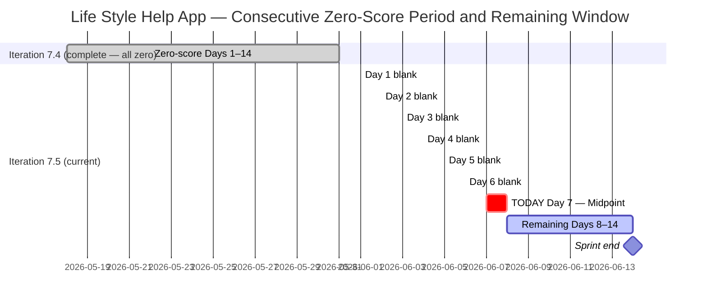
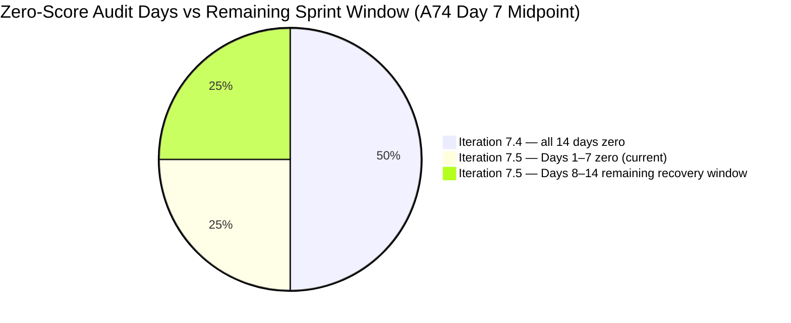

# ADO SAFe Audit — Life Style Help App Team

## 1. Audit Metadata

| Field | Value |
|-------|-------|
| Audit Number | A74 |
| Audit Date | 2026-06-07 |
| Audit Time | 09:00 CST |
| Timezone | America/Chicago (CST) |
| Iteration | Iteration 7.5 |
| Iteration Dates | 2026-06-01 – 2026-06-14 |
| Sprint Day | Day 7 of 14 |
| ADO Project | Life Style Help App (`0f447778-7156-4451-ab21-27be3c4a5888`) |
| ADO Team | Life Style Help App Team (`a2a805bc-0b30-4ef3-9a8a-b7f3081157a6`) |
| Iteration ID | `4aafce01-3cbe-4992-8e9e-8c55faf9bfb3` |
| Iteration Path | `Life Style Help App\2026-PI7\Iteration 7.5` |
| Workspace | `ado_ls_dev` |
| Prior Audit | AUDIT_20260606_0900.md (Score: 0.0 — Critical, A73, Day 6) |
| **Overall Score** | **0.0 / 100** |
| **Risk Band** | **Critical** |

> **Portfolio Note:** This workspace is excluded from `portfolio-health` and `portfolio-meeting-prep` aggregation per owner directive (2026-05-21). Individual audits continue per batch run policy.

---

## 2. Executive Summary

- Iteration 7.5 is on **Day 7 of 14** — the sprint midpoint. The Life Style Help App project records its **twentieth consecutive zero-score audit** (A55 through A74). The Stories and Deliverables backlog is empty. No capacity is configured. No items exist in Iteration 7.5.
- Zero activity was observed between Day 6 (June 6) and Day 7 (June 7). No ADO changes of any kind were detected for the Life Style Help App Team.
- **The sprint midpoint has passed with no committed work.** The maximum theoretically achievable score this sprint has now declined further. Even with an emergency restart today, the window for reaching Low Risk is extremely narrow (requires full delivery of 10+ well-defined stories in 7 days).
- The three disposition options (emergency restart, formal documented pause, or project discontinuation) remain the only available paths. The owner decision remains unrecorded.
- **20th consecutive Critical audit.** This now spans: all 14 days of Iteration 7.4 + all 7 days of Iteration 7.5 to date. No recovery has been initiated.

---

## 3. Previous Audit Delta

| Metric | A73 (2026-06-06, Day 6) | A74 (2026-06-07, Day 7) | Change |
|--------|------------------------|------------------------|--------|
| Iteration | 7.5 | 7.5 | No change |
| Sprint Day | Day 6 of 14 | **Day 7 of 14** | +1 day elapsed |
| VRBI | 0 | **0** | No change |
| CIRI | 0 | **0** | No change |
| Capacity Configured | 0 | **0** | No change |
| SP Committed | 0 SP | **0 SP** | No change |
| Recovery Action Observed | None | **None** | No change |
| Overall Score | 0.0 | **0.0** | No change |
| Risk Band | Critical | **Critical** | Unchanged |
| Consecutive Zero-Score Audits | 19 (A55–A73) | **20 (A55–A74)** | +1 |
| Sprint Days Remaining | 8 | **7** | −1 |
| Sprint Elapsed Percentage | 43% | **50% (midpoint)** | Sprint halfway complete at zero |

### Day 6 → Day 7 Assessment

No ADO changes were detected between the Day 6 audit (June 6) and this audit (June 7). The Stories and Deliverables backlog for Life Style Help App Team remains empty. The capacity API continues to return: "No team capacity assigned to the team." This is the twentieth consecutive 0.0/100 audit.

**Midpoint significance:** The sprint is exactly 50% elapsed (7 of 14 days). The team has consumed half its sprint with zero committed work. Mathematically, the maximum achievable D7 score if the team were to start and close all items today is 100.0 — but reaching that requires immediate story creation, commitment, and delivery within 7 days, with full capacity configured and DoR compliance for every item.

---

## 4. Current Iteration Snapshot

**Iteration 7.5** · 2026-06-01 – 2026-06-14 · **Day 7 of 14** · 7 days remaining

| Field | Value |
|-------|-------|
| Visible Root Backlog Items (VRBI) | **0** |
| Items in Iteration 7.5 (CIRI) | **0** |
| Total SP Committed | **0 SP** |
| Capacity Configured | **0** (API: "No team capacity assigned") |
| Items Active | **0** |
| SP Burned | **0 SP** |
| Sprint Days Elapsed | 7 (50% of sprint) |
| Sprint Days Remaining | **7** |
| Recovery Window Status | **CRITICAL — 7 days remain; window narrowing daily** |
| Prior Iteration Outcome | Iter 7.4 — 0.0/100 all 14 days; Iter 7.5 Days 1–7 = 0.0/100 |
| Consecutive Zero-Score Audit Days | **20** (A55 through A74) |

---

## 5. Work Item Analysis

The Stories and Deliverables backlog (`Microsoft.RequirementCategory`) for the Life Style Help App Team is empty. `wit_list_backlog_work_items` returns zero work items — confirmed for the twentieth consecutive audit.

| Metric | Value |
|--------|-------|
| visible_root_backlog_items (VRBI) | 0 |
| current_iteration_root_items (CIRI) | 0 |
| contributors_with_current_work (CW) | 0 |
| contributors_with_capacity (CC) | 0 |
| point_eligible_current_items (PECI) | 0 |
| estimated_current_items (ECI) | 0 |
| dor_compliant_current_items (DCI) | 0 |
| fresh_visible_root_items | 0 |
| stale_90_visible_root_items | 0 |
| stale_180_visible_root_items | 0 |
| untouched_current_items | 0 |
| committed_story_points (CSP) | 0 |
| closed_story_points (CLSP) | 0 |

No work item analysis table is possible (CIRI = 0).

**Epic-level context (out of scoring scope):** 3 Epics remain in the ADO project (IDs: 161354, 161363, 201599) per prior audit records. Epic 161354 ([Admin Web App] Layouts and Functionalities) remains the most actionable decomposition seed if a restart is initiated.

---

## 6. SAFe Compliance Scorecard

| Dimension | Score | Evidence (Numerator / Denominator) | Notes |
|-----------|-------|------------------------------------|-------|
| D1 — Iteration Planning | **0.0** | CIRI 0 / VRBI 0 | VRBI=0 → score 0 |
| D2 — Team Capacity | **0.0** | CC 0 / CW 0 | CW=0 → score 0 |
| D3 — Estimation | **0.0** | ECI 0 / PECI 0 | PECI=0 → score 0 |
| D4 — DoR Compliance | **0.0** | DCI 0 / CIRI 0 | CIRI=0 → score 0 |
| D5 — Work Item Balance | **0.0** | CIRI 0 | No items → score 0 |
| D6 — Backlog Refinement | **0.0** | fresh 0 / VRBI 0 | VRBI=0 → score 0 |
| D7 — Delivery Predictability | **0.0** | CLSP 0 / CSP 0 | CSP=0 → score 0 |

**Overall Score: (0 + 0 + 0 + 0 + 0 + 0 + 0) / 7 = 0.0 / 100 — Critical**

---

## 7. Dimension Findings

All seven dimensions score 0.0 for the identical reason: VRBI = 0. This is the 20th consecutive audit with this result.

### D1 — Iteration Planning (0.0)
Formula: VRBI=0 → score 0. No items in the Stories and Deliverables backlog. 20th consecutive zero.

### D2 — Team Capacity (0.0)
Formula: CW=0 → score 0. Capacity API returns: "No team capacity assigned to the team." 20th consecutive zero.

### D3 — Estimation (0.0)
Formula: PECI=0 → score 0. No story-level items exist. 20th consecutive zero.

### D4 — DoR Compliance (0.0)
Formula: CIRI=0 → score 0. No items to evaluate. 20th consecutive zero.

### D5 — Work Item Balance (0.0)
Formula: CIRI=0 → score 0. No items in sprint.

### D6 — Backlog Refinement (0.0)
Formula: VRBI=0 → score 0. Empty backlog. 20th consecutive zero.

### D7 — Delivery Predictability (0.0)
Formula: CSP=0 → score 0. No committed work, no delivered work.
No early-sprint annotation applies. Day 7 is the sprint midpoint — D7 = 0.0 is an unqualified sprint failure signal.

---

## 8. Risks and Bottlenecks

| Risk | Severity | Status |
|------|----------|--------|
| 20 consecutive zero-score audits (A55–A74) | **Critical** | Spanning 2 full sprints + 7 days of current sprint |
| Iteration 7.5 — Day 7 (midpoint), 50% elapsed, zero committed work | **Critical** | Sprint cannot reach Low Risk without sustained delivery in remaining 7 days |
| Stories and Deliverables backlog empty for 21+ days | **Critical** | API confirmed for 20th consecutive time |
| No capacity configured for Iteration 7.5 | **Critical** | API error persists across 20 audits |
| No project disposition decision documented | **High** | No pause, restart, or closure signal in CLAUDE.md or ADO |
| Recovery window — 7 days remain | **High** | Maximum achievable score decreases with each passing day |
| 3 Epics not decomposed into Stories | **Medium** | 161354, 161363, 201599 — actionable only if restart begins today |
| Ownership concentration risk on Samantha Babael | **Medium** | Noted in CLAUDE.md Audit Considerations; unverifiable while backlog is empty |

---

## 9. Prioritized Recommendations

**Iteration 7.5 — Day 7 of 14 — Sprint midpoint. 7 days remain. Act today or the sprint ends at zero.**

### Recovery Window Assessment (Updated — Day 7)

| Action Date | Sprint Days Available | Max Achievable Overall (5 stories, all correct) | Band |
|-------------|----------------------|--------------------------------------------------|------|
| Today (Day 7) | 7 days | ~67–75 | Moderate Risk |
| Tomorrow (Day 8) | 6 days | ~62–70 | Moderate Risk (low end) |
| Day 10 (Jun 10) | 4 days | ~50–60 | High Risk boundary |
| Day 12 (Jun 12) | 2 days | ~35–45 | High to Critical |
| Day 14 (Jun 14) | 0 days | 0.0 | Critical (20th consecutive sprint failure) |

> Note: Due to the midpoint passing, the maximum achievable band has declined from Moderate/Low boundary (Day 6) to Moderate Risk (Day 7). The window for Low Risk now requires immediate start AND full delivery — a higher bar than yesterday.

1. **IMMEDIATE (today, Day 7): Choose and execute a disposition decision**

   Three paths remain available — choose one and act within 24 hours:

   **(a) Emergency restart** — Execute sprint planning today:
   - Create 5 User Stories in ADO under `Life Style Help App\2026-PI7\Iteration 7.5`
   - Each story must have: Description ≥ 30 non-whitespace chars, AC ≥ 20 non-whitespace chars, Story Points > 0 (recommend 2–3 SP each), Assignee (distribute across at least 2 members)
   - Configure capacity for at least 2 team members in ADO iteration settings
   - Set a sprint goal in the Iteration 7.5 description field
   - Start with Epic 161354 ([Admin Web App] Layouts and Functionalities) — decompose into 3–5 layout or functionality stories
   - **Maximum achievable with 7 days:** Moderate Risk (~67–75). Low Risk is theoretically possible only with full delivery.

   **(b) Formal documented pause** — Record in `ado_ls_dev/CLAUDE.md` under `Project Exceptions`:
   - Pause start date: 2026-05-18 (first zero-score audit A55)
   - Reason: [owner to supply — resourcing, priority shift, dependency, etc.]
   - Planned reactivation trigger: [owner to supply — date, milestone, personnel]
   - Effect: Stops Critical audit accumulation; aligns audit record with actual project state.

   **(c) Project discontinuation** — Archive the ADO project:
   - Update `ado_ls_dev/CLAUDE.md` with closure date and reason
   - Remove workspace from audit rotation
   - Archive ADO project (Life Style Help App, GUID: 0f447778-7156-4451-ab21-27be3c4a5888)

2. **If restarting: Enforce DoR gate on every new item** — No story enters Iter 7.5 without Description ≥ 30 chars, AC ≥ 20 chars, SP > 0, and Assignee.

3. **If restarting: Distribute ownership across at least 2 active team members** — The workspace CLAUDE.md flags ownership concentration on Samantha Babael as a delivery risk. Limit any single member to ≤ 60% of committed items.

4. **If restarting: Decompose Epic 161354 first** — [Admin Web App] Layouts and Functionalities. Candidate child stories: (a) Admin Dashboard layout, (b) Navigation sidebar component, (c) User authentication flow, (d) Settings page structure, (e) Data input form validation.

---

## 10. Evidence Gaps and Limitations

| Gap | Impact | Notes |
|-----|--------|-------|
| Stories and Deliverables backlog empty | All 7 dimensions score 0 | Confirmed via `wit_list_backlog_work_items` — 20 consecutive audits |
| Capacity API error | D2 unresolvable | "No team capacity assigned to the team" — 20 consecutive audits |
| Root cause of project suspension unknown | Cannot classify status | 21+ days of inactivity at story level; owner decision required |
| Team member roster unverifiable | D2 absent | No active assignees; Samantha Babael watch flag from CLAUDE.md unverifiable |
| Epic-level items not audited | Scope note | 3 Epics (161354, 161363, 201599); audited scope is Stories and Deliverables only |
| Portfolio exclusion | Scope note | Excluded from portfolio-health and portfolio-meeting-prep per 2026-05-21 directive |
| 20 consecutive zero-score audits | Escalation context | A55 (2026-05-18) through A74 (2026-06-07); across 2 full sprints + 7 days of current sprint |

---

## Visualizations

### Score Trend — Consecutive Zero Audit Series (A55–A74)

| Date | Audit | Score | Band | Iteration | Sprint Day |
|------|-------|-------|------|-----------|-----------|
| May 18 | A55 | 0.0 | Critical | 7.4 | Day 1 |
| May 19–31 | A56–A67 | 0.0 | Critical | 7.4 | Days 2–14 |
| Jun 01 | A68 | 0.0 | Critical | 7.5 | Day 1 |
| Jun 02 | A69 | 0.0 | Critical | 7.5 | Day 2 |
| Jun 03 | A70 | 0.0 | Critical | 7.5 | Day 3 |
| Jun 04 | A71 | 0.0 | Critical | 7.5 | Day 4 |
| Jun 05 | A72 | 0.0 | Critical | 7.5 | Day 5 |
| Jun 06 | A73 | 0.0 | Critical | 7.5 | Day 6 |
| **Jun 07** | **A74** | **0.0** | **Critical** | **7.5** | **Day 7 — Midpoint** |

Twenty consecutive Critical audits. Sprint midpoint passed at zero. Seven sprint days remain. Maximum achievable band is now Moderate Risk if restart begins today with full subsequent delivery.

---

*Audit A74 generated by Claude Code (claude-sonnet-4-6) on 2026-06-07 09:00 CST. Evidence sourced from Azure DevOps MCP (Life Style Help App project, GUID: 0f447778-7156-4451-ab21-27be3c4a5888, team a2a805bc-0b30-4ef3-9a8a-b7f3081157a6, Iteration 7.5 ID 4aafce01-3cbe-4992-8e9e-8c55faf9bfb3). Rubric: SAFe 6.0 7-dimension scorecard v1. This workspace is excluded from portfolio-level aggregation per portfolio-health exclusion policy (2026-05-21). All seven dimensions score 0.0 — 20th consecutive Critical audit. Sprint midpoint passed at zero. 7 days remain. Immediate owner action required: restart (max Moderate Risk), pause, or discontinue.*
