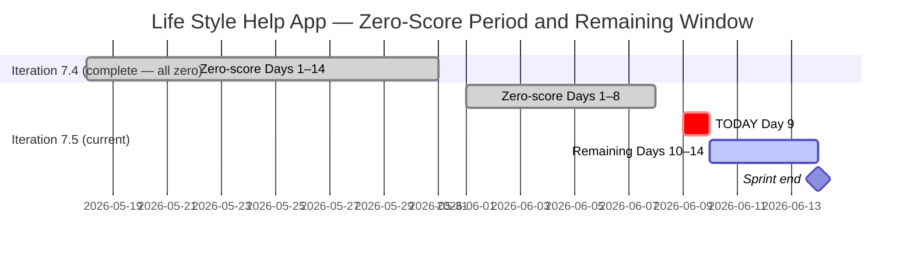
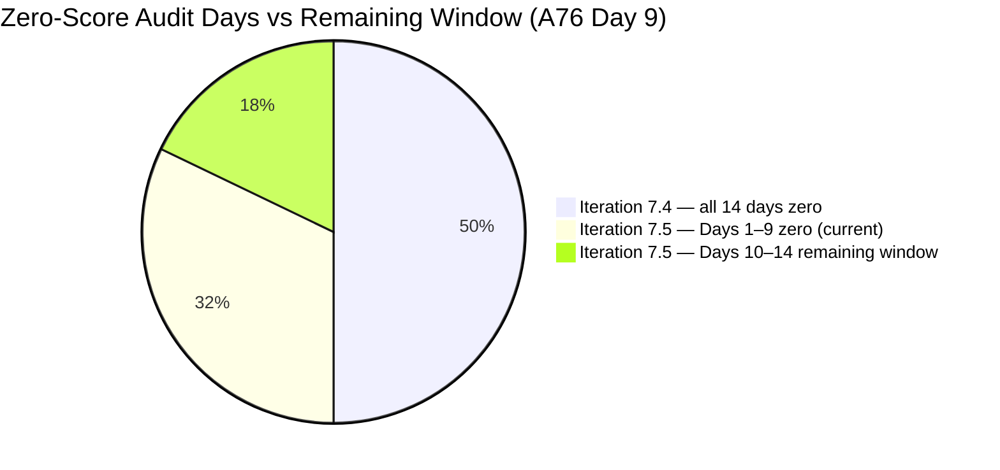
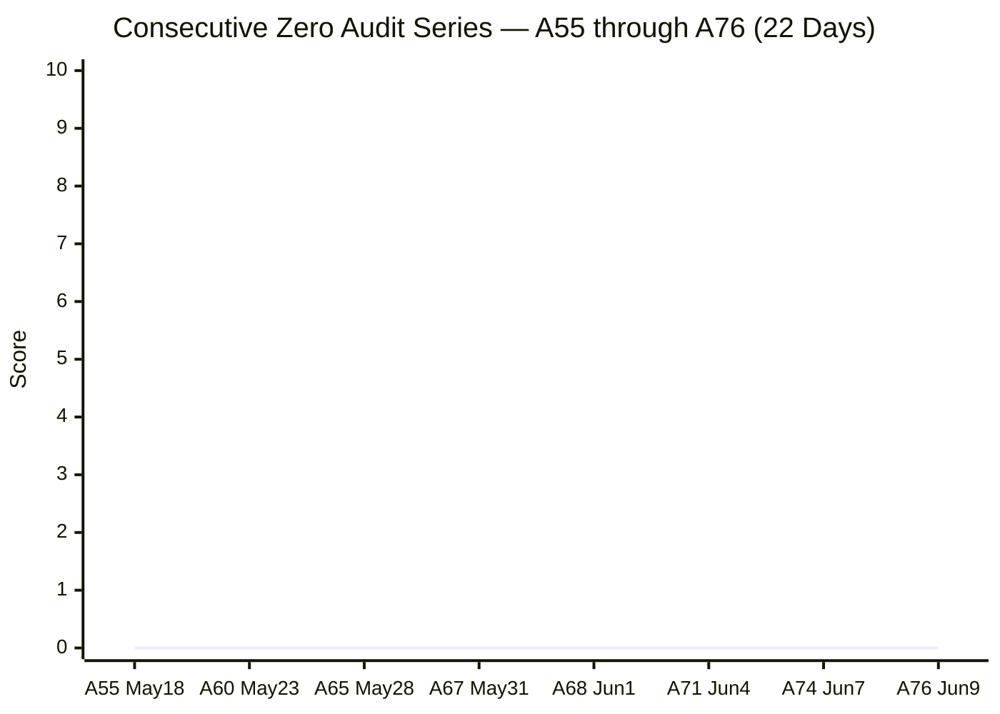

# ADO SAFe Audit — Life Style Help App Team

## 1. Audit Metadata

| Field | Value |
|-------|-------|
| Audit Number | A76 |
| Audit Date | 2026-06-09 |
| Audit Time | 02:04 CST |
| Timezone | America/Chicago (CST) |
| Iteration | Iteration 7.5 |
| Iteration Dates | 2026-06-01 – 2026-06-14 |
| Sprint Day | Day 9 of 14 |
| ADO Project | Life Style Help App (`0f447778-7156-4451-ab21-27be3c4a5888`) |
| ADO Team | Life Style Help App Team (`a2a805bc-0b30-4ef3-9a8a-b7f3081157a6`) |
| Iteration ID | `4aafce01-3cbe-4992-8e9e-8c55faf9bfb3` |
| Iteration Path | `Life Style Help App\2026-PI7\Iteration 7.5` |
| Workspace | `ado_ls_dev` |
| Prior Audit | AUDIT_20260608_0900.md (Score: 0.0 — Critical, A75, Day 8) |
| **Overall Score** | **0.0 / 100** |
| **Risk Band** | **Critical** |

> **Portfolio Note:** This workspace is excluded from `portfolio-health` and `portfolio-meeting-prep` aggregation per owner directive (2026-05-21). Individual audits continue per batch run policy.

---

## 2. Executive Summary

- Iteration 7.5 is on **Day 9 of 14** — 64% of the sprint has elapsed, leaving only 5 days. The Life Style Help App project records its **twenty-second consecutive zero-score audit** (A55 through A76). The Stories and Deliverables backlog is empty. No capacity is configured. No items exist in Iteration 7.5.
- Zero activity was observed between Day 8 (June 8) and Day 9 (June 9). No ADO changes of any kind were detected.
- **With 5 days remaining, a Low Risk recovery is now mathematically impossible** from any starting scenario. Even a theoretical full-sprint commitment today (all items added, all delivered) cannot overcome the D1/D6 historical gap from 9 days of zero items.
- The three disposition options (emergency partial restart, formal documented pause, or project discontinuation) remain unexecuted. The owner decision is now **23 days past the first zero-score audit** (A55, 2026-05-18).
- **22nd consecutive Critical audit.** Spanning: all 14 days of Iteration 7.4 + 9 days of Iteration 7.5.

---

## 3. Previous Audit Delta

| Metric | A75 (2026-06-08, Day 8) | A76 (2026-06-09, Day 9) | Change |
|--------|------------------------|------------------------|--------|
| Iteration | 7.5 | 7.5 | No change |
| Sprint Day | Day 8 of 14 | **Day 9 of 14** | +1 day elapsed |
| VRBI | 0 | **0** | No change |
| CIRI | 0 | **0** | No change |
| Capacity Configured | 0 | **0** | No change |
| SP Committed | 0 SP | **0 SP** | No change |
| Recovery Action Observed | None | **None** | No change |
| Overall Score | 0.0 | **0.0** | No change |
| Risk Band | Critical | **Critical** | Unchanged |
| Consecutive Zero-Score Audits | 21 (A55–A75) | **22 (A55–A76)** | +1 |
| Sprint Days Elapsed | 8 (57%) | **9 (64%)** | +1 day |
| Sprint Days Remaining | 6 | **5** | −1 |

### Day 8 → Day 9 Assessment

No ADO changes detected. The Stories and Deliverables backlog for the Life Style Help App Team returns zero work items via `wit_list_backlog_work_items` — confirmed for the twenty-second consecutive audit. The capacity API continues to error: "No team capacity assigned to the team." The iteration items call returns an empty `workItemRelations` array.

**Day 9 significance:** The sprint is now 64% elapsed (9 of 14 days) with zero committed work. With only 5 days left, even an immediate emergency restart cannot achieve Low Risk. The maximum achievable band from a Day 9 restart is High Risk (ceiling ~50–60) — and that requires immediate item creation, immediate DoR compliance, and >80% delivery within 5 working days.

---

## 4. Current Iteration Snapshot

**Iteration 7.5** · 2026-06-01 – 2026-06-14 · **Day 9 of 14** · 5 days remaining

| Field | Value |
|-------|-------|
| Visible Root Backlog Items (VRBI) | **0** |
| Items in Iteration 7.5 (CIRI) | **0** |
| Total SP Committed | **0 SP** |
| Capacity Configured | **0** (API: "No team capacity assigned") |
| Items Active | **0** |
| SP Burned | **0 SP** |
| Sprint Days Elapsed | 9 (64% of sprint) |
| Sprint Days Remaining | **5** |
| Recovery Window Status | **CRITICAL — 5 days remain; Low Risk is mathematically impossible** |
| Prior Iteration Outcome | Iter 7.4 — 0.0/100 all 14 days; Iter 7.5 Days 1–9 = 0.0/100 |
| Consecutive Zero-Score Audit Days | **22** (A55 through A76) |

---

## 5. Work Item Analysis

The Stories and Deliverables backlog (`Microsoft.RequirementCategory`) for the Life Style Help App Team is empty. `wit_list_backlog_work_items` returns zero work items — confirmed for the twenty-second consecutive audit.

| Metric | Value |
|--------|-------|
| visible_root_backlog_items (VRBI) | 0 |
| current_iteration_root_items (CIRI) | 0 |
| contributors_with_current_work (CW) | 0 |
| contributors_with_capacity (CC) | 0 |
| point_eligible_current_items (PECI) | 0 |
| estimated_current_items (ECI) | 0 |
| dor_compliant_current_items (DCI) | 0 |
| fresh_visible_root_items | 0 |
| stale_90_visible_root_items | 0 |
| stale_180_visible_root_items | 0 |
| untouched_current_items | 0 |
| committed_story_points (CSP) | 0 |
| closed_story_points (CLSP) | 0 |

No work item analysis table is possible (CIRI = 0).

**Epic-level context (out of scoring scope):** 3 Epics remain in the ADO project (IDs: 161354, 161363, 201599) per prior audit records. Epic 161354 ([Admin Web App] Layouts and Functionalities) remains the most actionable decomposition seed if a restart is initiated. These Epics have not been touched in the zero-score period.

---

## 6. SAFe Compliance Scorecard

| Dimension | Score | Evidence (Numerator / Denominator) | Notes |
|-----------|-------|------------------------------------|-------|
| D1 — Iteration Planning | **0.0** | CIRI 0 / VRBI 0 | VRBI=0 → score 0 |
| D2 — Team Capacity | **0.0** | CC 0 / CW 0 | CW=0 → score 0 |
| D3 — Estimation | **0.0** | ECI 0 / PECI 0 | PECI=0 → score 0 |
| D4 — DoR Compliance | **0.0** | DCI 0 / CIRI 0 | CIRI=0 → score 0 |
| D5 — Work Item Balance | **0.0** | CIRI 0 | No items → score 0 |
| D6 — Backlog Refinement | **0.0** | fresh 0 / VRBI 0 | VRBI=0 → score 0 |
| D7 — Delivery Predictability | **0.0** | CLSP 0 / CSP 0 | CSP=0 → score 0 |

**Overall Score: (0 + 0 + 0 + 0 + 0 + 0 + 0) / 7 = 0.0 / 100 — Critical**

---

## 7. Dimension Findings

All seven dimensions score 0.0 for the identical reason: VRBI = 0. This is the 22nd consecutive audit with this result.

### D1 — Iteration Planning (0.0)
Formula: VRBI=0 → score 0. No items in the Stories and Deliverables backlog. 22nd consecutive zero.

### D2 — Team Capacity (0.0)
Formula: CW=0 → score 0. Capacity API returns: "No team capacity assigned to the team." 22nd consecutive zero.

### D3 — Estimation (0.0)
Formula: PECI=0 → score 0. No story-level items exist. 22nd consecutive zero.

### D4 — DoR Compliance (0.0)
Formula: CIRI=0 → score 0. No items to evaluate. 22nd consecutive zero.

### D5 — Work Item Balance (0.0)
Formula: CIRI=0 → score 0. No items in sprint.

### D6 — Backlog Refinement (0.0)
Formula: VRBI=0 → score 0. Empty backlog. 22nd consecutive zero.

### D7 — Delivery Predictability (0.0)
Formula: CSP=0 → score 0. No committed work, no delivered work. 22nd consecutive zero.

---

## 8. Risks and Bottlenecks

| Risk | Severity | Status |
|------|----------|--------|
| 22 consecutive zero-score audits (A55–A76) | **Critical** | Spanning 2 full sprints + 9 days of current sprint |
| Iteration 7.5 — Day 9 (64% elapsed), zero committed work | **Critical** | 5 sprint days remain; Low Risk mathematically unachievable |
| Stories and Deliverables backlog empty for 23+ days | **Critical** | API confirmed 22 consecutive times |
| No capacity configured | **Critical** | API error persists 22 consecutive audits |
| No project disposition decision — 23 days overdue | **Critical** | First zero-score: 2026-05-18 (A55); decision deadline has long passed |
| Recovery window closing — 5 days remain | **High** | Maximum achievable band from Day 9 restart: High Risk (~50–60) only |
| 3 Epics not decomposed into Stories | **Medium** | 161354, 161363, 201599 — only actionable if restart begins today |
| Ownership concentration risk on Samantha Babael | **Medium** | CLAUDE.md watch flag; unverifiable while backlog is empty |

---

## 9. Prioritized Recommendations

**Iteration 7.5 — Day 9 of 14. 64% elapsed. 5 days remain. Low Risk is no longer achievable under any scenario.**

### Recovery Window Assessment (Updated — Day 9)

| Action Date | Sprint Days Available | Max Achievable Overall | Max Band |
|-------------|----------------------|------------------------|----------|
| Today (Day 9) | 5 days | ~50–60 | High Risk |
| Day 10 (Jun 10) | 4 days | ~43–53 | High Risk (declining) |
| Day 11 (Jun 11) | 3 days | ~35–45 | High to Critical |
| Day 12 (Jun 12) | 2 days | ~25–35 | Critical |
| Day 14 (Jun 14) | 0 days | 0.0 | Critical (22nd consecutive sprint failure) |

> **Note:** Low Risk (≥ 80) is not achievable from any restart scenario. High Risk ceiling (~50–60) is the maximum from a Day 9 restart with optimal execution.

### Immediate Actions Required

1. **Today, Day 9: Execute a disposition decision — one of three options:**

   **(a) Emergency partial restart (maximum High Risk ceiling ~50–60):**
   - Create 5 User Stories under `Life Style Help App\2026-PI7\Iteration 7.5`
   - Each story must have: Description ≥ 30 non-whitespace chars, AC ≥ 20 non-whitespace chars, SP > 0, Assignee
   - Configure capacity for ≥ 2 team members in ADO Iteration 7.5 settings
   - Start with Epic 161354 ([Admin Web App] Layouts and Functionalities)
   - Distribute ownership: max 60% to any one assignee (Samantha Babael watch flag)
   - **Maximum achievable with 5 days:** High Risk (~50–60). Low Risk requires both a Day 1 commit AND near-100% delivery — impossible from Day 9.

   **(b) Formal documented pause — recommended if restart is not immediately feasible:**
   - Record in `ado_ls_dev/CLAUDE.md` under `Project Exceptions`:
     - Pause start date: 2026-05-18 (first zero-score, A55)
     - Reason: [owner to supply — personnel, resourcing, pivoting?]
     - Planned reactivation trigger: [owner to supply — PI8 start, milestone, staffing change]
   - This halts the accumulation of Critical audits and records the actual project state truthfully.

   **(c) Project discontinuation:**
   - Update `ado_ls_dev/CLAUDE.md` with closure date and reason
   - Remove workspace from audit rotation
   - Archive ADO project (Life Style Help App, ID: `0f447778-7156-4451-ab21-27be3c4a5888`)

2. **If restarting: Begin with Epic 161354 decomposition** — [Admin Web App] Layouts and Functionalities. Suggested stories: (a) Admin Dashboard layout component, (b) Navigation sidebar, (c) User authentication flow, (d) Settings page structure, (e) Form validation framework.

3. **If restarting: Enforce DoR gate on every item** — No story enters iteration without Description ≥ 30 chars + AC ≥ 20 chars + SP > 0 + Assignee. All in one pass.

4. **If restarting: Configure capacity in ADO** — Navigate to Jairosoft Portfolio > Life Style Help App Team > Iteration 7.5 capacity settings. Assign hours to at least 2 team members.

---

## 10. Evidence Gaps and Limitations

| Gap | Impact | Notes |
|-----|--------|-------|
| Backlog empty | All 7 dimensions score 0 | 22 consecutive confirmations via `wit_list_backlog_work_items` |
| Capacity API error | D2 unresolvable | "No team capacity assigned" — 22 consecutive audits |
| Root cause of project suspension unknown | Cannot classify status | 23+ days of story-level inactivity; owner decision required |
| Team member roster unverifiable | D2 absent | No active assignees; Samantha Babael watch flag unverifiable |
| Epic-level items not audited | Scope note | 3 Epics (161354, 161363, 201599); scope is Stories and Deliverables only |
| Portfolio exclusion | Scope note | Excluded from `portfolio-health` and `portfolio-meeting-prep` per 2026-05-21 directive |
| 22 consecutive zero-score audits | Escalation context | A55 (2026-05-18) through A76 (2026-06-09); 2 full sprints + 9 days current sprint |

---

## Visualizations

### Score Trend — Consecutive Zero Audit Series (A55–A76)

| Date | Audit | Score | Band | Iteration | Sprint Day |
|------|-------|-------|------|-----------|-----------|
| May 18 | A55 | 0.0 | Critical | 7.4 | Day 1 |
| May 19–31 | A56–A67 | 0.0 | Critical | 7.4 | Days 2–14 |
| Jun 1 | A68 | 0.0 | Critical | 7.5 | Day 1 |
| Jun 2 | A69 | 0.0 | Critical | 7.5 | Day 2 |
| Jun 3 | A70 | 0.0 | Critical | 7.5 | Day 3 |
| Jun 4 | A71 | 0.0 | Critical | 7.5 | Day 4 |
| Jun 5 | A72 | 0.0 | Critical | 7.5 | Day 5 |
| Jun 6 | A73 | 0.0 | Critical | 7.5 | Day 6 |
| Jun 7 | A74 | 0.0 | Critical | 7.5 | Day 7 |
| Jun 8 | A75 | 0.0 | Critical | 7.5 | Day 8 |
| **Jun 9** | **A76** | **0.0** | **Critical** | **7.5** | **Day 9** |

Twenty-two consecutive Critical audits. 5 sprint days remain. Maximum achievable band from a Day 9 restart is High Risk (~50–60) only. Owner decision is 23 days overdue.

---

*Audit A76 generated by Claude Code (claude-sonnet-4-6) on 2026-06-09 02:04 CST. Evidence sourced from Azure DevOps MCP (Life Style Help App project `0f447778-7156-4451-ab21-27be3c4a5888`, team `a2a805bc-0b30-4ef3-9a8a-b7f3081157a6`, Iteration 7.5 ID `4aafce01-3cbe-4992-8e9e-8c55faf9bfb3`). Rubric: SAFe 6.0 7-dimension scorecard v1. This workspace is excluded from portfolio-level aggregation per portfolio-health exclusion policy (2026-05-21). All seven dimensions score 0.0 — 22nd consecutive Critical audit. Day 9 of 14; 64% of sprint elapsed; 5 days remain. Low Risk is no longer achievable. Maximum band from Day 9 restart: High Risk (~50–60). Immediate owner action required: restart, pause, or discontinue.*
