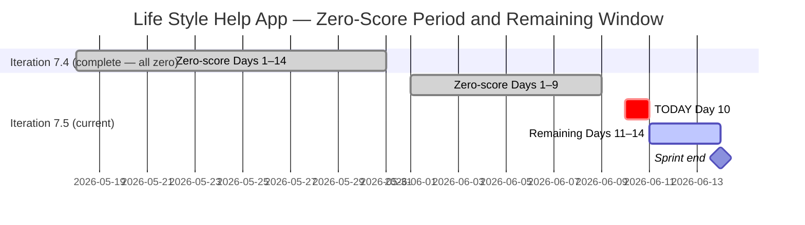
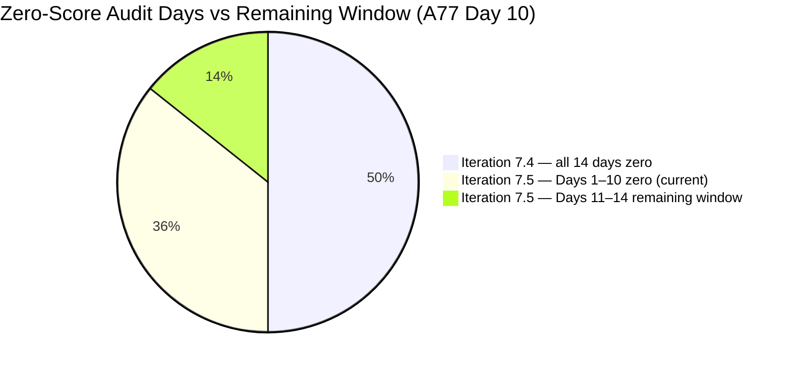
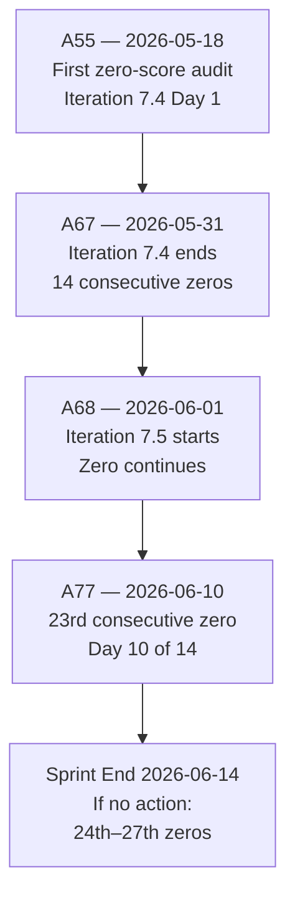

# ADO SAFe Audit — Life Style Help App Team

## 1. Audit Metadata

| Field | Value |
|-------|-------|
| Audit Number | A77 |
| Audit Date | 2026-06-10 |
| Audit Time | 09:04 UTC |
| Timezone | UTC |
| Iteration | Iteration 7.5 |
| Iteration Dates | 2026-06-01 – 2026-06-14 |
| Sprint Day | Day 10 of 14 |
| ADO Project | Life Style Help App (`0f447778-7156-4451-ab21-27be3c4a5888`) |
| ADO Team | Life Style Help App Team (`a2a805bc-0b30-4ef3-9a8a-b7f3081157a6`) |
| Iteration ID | `4aafce01-3cbe-4992-8e9e-8c55faf9bfb3` |
| Iteration Path | `Life Style Help App\2026-PI7\Iteration 7.5` |
| Workspace | `ado_ls_dev` |
| Prior Audit | AUDIT_20260609_0204.md (Score: 0.0 — Critical, A76, Day 9) |
| **Overall Score** | **0.0 / 100** |
| **Risk Band** | **Critical** |

> **Portfolio Note:** This workspace is excluded from `portfolio-health` and `portfolio-meeting-prep` aggregation per owner directive (2026-05-21). Individual audits continue per batch run policy.

---

## 2. Executive Summary

- Iteration 7.5 is on **Day 10 of 14** — 71% of the sprint elapsed, 4 days remain. The Life Style Help App project records its **twenty-third consecutive zero-score audit** (A55 through A77). The Stories and Deliverables backlog is empty. No capacity is configured. No items exist in Iteration 7.5.
- Zero activity was observed between Day 9 (June 9) and Day 10 (June 10). No ADO changes of any kind were detected.
- **With 4 days remaining, recovery to any band above Critical is highly constrained.** Even a complete emergency restart today would yield a theoretical maximum of High Risk (~45–55 range) — and only with optimal execution including immediate DoR compliance and delivery.
- **Day 10 significance:** The sprint is now 71% elapsed (10 of 14 days) with zero committed work. The three disposition options (emergency partial restart, formal documented pause, or project discontinuation) remain unexecuted. The owner decision is now **24 days past the first zero-score audit** (A55, 2026-05-18).
- **23rd consecutive Critical audit.** This spans: all 14 days of Iteration 7.4 + all 10 days of Iteration 7.5 to date.

---

## 3. Previous Audit Delta

| Metric | A76 (2026-06-09, Day 9) | A77 (2026-06-10, Day 10) | Change |
|--------|------------------------|--------------------------|--------|
| Iteration | 7.5 | 7.5 | No change |
| Sprint Day | Day 9 of 14 | **Day 10 of 14** | +1 day elapsed |
| VRBI | 0 | **0** | No change |
| CIRI | 0 | **0** | No change |
| Capacity Configured | 0 | **0** | No change (API: "No team capacity assigned") |
| SP Committed | 0 SP | **0 SP** | No change |
| Recovery Action Observed | None | **None** | No change |
| Overall Score | 0.0 | **0.0** | No change |
| Risk Band | Critical | **Critical** | Unchanged |
| Consecutive Zero-Score Audits | 22 (A55–A76) | **23 (A55–A77)** | +1 |
| Sprint Days Elapsed | 9 (64%) | **10 (71%)** | +1 day |
| Sprint Days Remaining | 5 | **4** | −1 |

### Day 9 → Day 10 Assessment

No ADO changes detected. The Stories and Deliverables backlog for the Life Style Help App Team returns zero work items via `wit_list_backlog_work_items` — confirmed for the twenty-third consecutive audit. The capacity API continues to error ("No team capacity assigned to the team"). The WIQL query against the Life Style Help App project for non-Closed/non-Removed User Stories also returns zero items, confirming no active story-level work exists in any state.

**Day 10 significance:** The sprint is now 71% elapsed with zero committed work. With only 4 days left, even an immediate emergency restart faces severe constraints:
- D1 maximum = CIRI/VRBI. If items added today, D1 = 100 only if all items are in current iteration.
- D7 maximum with 4 days = if items created today and all closed by sprint end = 100. But capacity still must be configured.
- D6 freshness requires items changed within 45 days — immediate creation satisfies this.
- Theoretical maximum band: High Risk (~45–55) at best. Low Risk (≥80) is impossible from Day 10.

---

## 4. Current Iteration Snapshot

**Iteration 7.5** · 2026-06-01 – 2026-06-14 · **Day 10 of 14** · 4 days remaining

| Field | Value |
|-------|-------|
| Visible Root Backlog Items (VRBI) | **0** |
| Items in Iteration 7.5 (CIRI) | **0** |
| Total SP Committed | **0 SP** |
| Capacity Configured | **0** (API: "No team capacity assigned") |
| Items Active | **0** |
| SP Burned | **0 SP** |
| Sprint Days Elapsed | 10 (71% of sprint) |
| Sprint Days Remaining | **4** |
| Recovery Window Status | **CRITICAL — 4 days remain; Low Risk mathematically impossible** |
| Prior Iteration Outcome | Iter 7.4 — 0.0/100 all 14 days; Iter 7.5 Days 1–10 = 0.0/100 |
| Consecutive Zero-Score Audit Days | **23** (A55 through A77) |

---

## 5. Work Item Analysis

The Stories and Deliverables backlog (`Microsoft.RequirementCategory`) for the Life Style Help App Team is empty. `wit_list_backlog_work_items` returns zero work items — confirmed for the twenty-third consecutive audit. The WIQL query for non-Closed User Stories/Spikes in the Life Style Help App project also returns zero items.

| Metric | Value |
|--------|-------|
| visible_root_backlog_items (VRBI) | 0 |
| current_iteration_root_items (CIRI) | 0 |
| contributors_with_current_work (CW) | 0 |
| contributors_with_capacity (CC) | 0 |
| point_eligible_current_items (PECI) | 0 |
| estimated_current_items (ECI) | 0 |
| dor_compliant_current_items (DCI) | 0 |
| fresh_visible_root_items | 0 |
| stale_90_visible_root_items | 0 |
| stale_180_visible_root_items | 0 |
| untouched_current_items | 0 |
| committed_story_points (CSP) | 0 |
| closed_story_points (CLSP) | 0 |

No work item analysis table is possible (CIRI = 0).

**Epic-level context (out of scoring scope):** 3 Epics remain in the ADO project (IDs: 161354, 161363, 201599) per prior audit records. Epic 161354 ([Admin Web App] Layouts and Functionalities) remains the most actionable decomposition seed if a restart is initiated. These Epics have not been touched during the zero-score period.

---

## 6. SAFe Compliance Scorecard

| Dimension | Score | Evidence (Numerator / Denominator) | Notes |
|-----------|-------|------------------------------------|-------|
| D1 — Iteration Planning | **0.0** | CIRI 0 / VRBI 0 | VRBI=0 → score 0 |
| D2 — Team Capacity | **0.0** | CC 0 / CW 0 | CW=0 → score 0 |
| D3 — Estimation | **0.0** | ECI 0 / PECI 0 | PECI=0 → score 0 |
| D4 — DoR Compliance | **0.0** | DCI 0 / CIRI 0 | CIRI=0 → score 0 |
| D5 — Work Item Balance | **0.0** | CIRI 0 | No items → score 0 |
| D6 — Backlog Refinement | **0.0** | fresh 0 / VRBI 0 | VRBI=0 → score 0 |
| D7 — Delivery Predictability | **0.0** | CLSP 0 / CSP 0 | CSP=0 → score 0 |

**Overall Score: (0 + 0 + 0 + 0 + 0 + 0 + 0) / 7 = 0.0 / 100 — Critical**

---

## 7. Dimension Findings

All seven dimensions score 0.0 for the identical reason: VRBI = 0. This is the 23rd consecutive audit with this result.

### D1 — Iteration Planning (0.0)
Formula: VRBI=0 → score 0. No items in the Stories and Deliverables backlog. 23rd consecutive zero.

### D2 — Team Capacity (0.0)
Formula: CW=0 → score 0. Capacity API returns: "No team capacity assigned to the team." 23rd consecutive zero.

### D3 — Estimation (0.0)
Formula: PECI=0 → score 0. No story-level items exist. 23rd consecutive zero.

### D4 — DoR Compliance (0.0)
Formula: CIRI=0 → score 0. No items to evaluate. 23rd consecutive zero.

### D5 — Work Item Balance (0.0)
Formula: CIRI=0 → score 0. No items in sprint.

### D6 — Backlog Refinement (0.0)
Formula: VRBI=0 → score 0. Empty backlog. 23rd consecutive zero.

### D7 — Delivery Predictability (0.0)
Formula: CSP=0 → score 0. No committed work, no delivered work. 23rd consecutive zero.

---

## 8. Risks and Bottlenecks

| Risk | Severity | Status |
|------|----------|--------|
| 23 consecutive zero-score audits (A55–A77) | **Critical** | Spanning 2 full sprints + 10 days of current sprint |
| Iteration 7.5 — Day 10 (71% elapsed), zero committed work | **Critical** | 4 sprint days remain; Low Risk mathematically unachievable |
| Stories and Deliverables backlog empty for 24+ days | **Critical** | API confirmed 23 consecutive times |
| No capacity configured | **Critical** | API error persists 23 consecutive audits |
| No project disposition decision — 24 days overdue | **Critical** | First zero-score: 2026-05-18 (A55); decision deadline has long passed |
| Recovery window closing — 4 days remain | **High** | Maximum achievable band from Day 10 restart: High Risk (~45–55) only |
| 3 Epics not decomposed into Stories | **Medium** | 161354, 161363, 201599 — only actionable if restart begins today |
| Ownership concentration risk on Samantha Babael | **Medium** | CLAUDE.md watch flag; unverifiable while backlog is empty |

---

## 9. Prioritized Recommendations

**Iteration 7.5 — Day 10 of 14. 71% elapsed. 4 days remain. Low Risk is not achievable under any scenario.**

### Recovery Window Assessment (Updated — Day 10)

| Action Date | Sprint Days Available | Max Achievable Overall | Max Band |
|-------------|----------------------|------------------------|----------|
| Today (Day 10) | 4 days | ~45–55 | High Risk |
| Day 11 (Jun 11) | 3 days | ~35–45 | High to Critical |
| Day 12 (Jun 12) | 2 days | ~25–35 | Critical |
| Day 14 (Jun 14) | 0 days | 0.0 | Critical (23rd consecutive sprint failure) |

> **Note:** Low Risk (≥ 80) requires D7 ≥ ~37 points (closed/committed ≥ 37%). With only 4 days available to both commit and deliver items, and no prior sprint activity, this threshold is not achievable. Moderate Risk (60–79) is also extremely difficult without a robust restart today.

### Immediate Actions Required

1. **Today, Day 10: Execute a disposition decision — one of three options:**

   **(a) Emergency partial restart (maximum High Risk ceiling ~45–55):**
   - Create 4–5 User Stories under `Life Style Help App\2026-PI7\Iteration 7.5`
   - Each story must have: Description ≥ 30 non-whitespace chars, AC ≥ 20 non-whitespace chars, SP > 0, Assignee
   - Configure capacity for ≥ 2 team members in ADO Iteration 7.5 settings
   - Start with Epic 161354 ([Admin Web App] Layouts and Functionalities)
   - Begin immediately — each day without action reduces the ceiling further
   - **Maximum achievable with 4 days:** High Risk (~45–55). Moderate Risk (60) requires closing ≥60% of committed SP within 4 days.

   **(b) Formal documented pause — recommended if restart is not immediately feasible:**
   - Record in `ado_ls_dev/CLAUDE.md` under `Project Exceptions`:
     - Pause start date: 2026-05-18 (first zero-score, A55)
     - Reason: [owner to supply — personnel, resourcing, pivoting?]
     - Planned reactivation trigger: [owner to supply — PI8 start, milestone, staffing change]
   - This halts the accumulation of Critical audits and records the actual project state truthfully.

   **(c) Project discontinuation:**
   - Update `ado_ls_dev/CLAUDE.md` with closure date and reason
   - Remove workspace from audit rotation
   - Archive ADO project (Life Style Help App, ID: `0f447778-7156-4451-ab21-27be3c4a5888`)

2. **If restarting: Begin with Epic 161354 decomposition** — [Admin Web App] Layouts and Functionalities. Suggested stories: (a) Admin Dashboard layout component, (b) Navigation sidebar, (c) User authentication flow, (d) Form validation framework.

3. **If restarting: Configure capacity in ADO immediately** — Navigate to Life Style Help App > Life Style Help App Team > Iteration 7.5 capacity settings. Assign hours to at least 2 team members. This alone fixes D2 from 0 to 100.

4. **If restarting: Enforce DoR gate** — Every story entering the iteration must have Description ≥ 30 chars + AC ≥ 20 chars + SP > 0 + Assignee in one pass.

---

## 10. Evidence Gaps and Limitations

| Gap | Impact | Notes |
|-----|--------|-------|
| Backlog empty | All 7 dimensions score 0 | 23 consecutive confirmations via `wit_list_backlog_work_items` and WIQL |
| Capacity API error | D2 unresolvable | "No team capacity assigned" — 23 consecutive audits |
| Root cause of project suspension unknown | Cannot classify status | 24+ days of story-level inactivity; owner decision required |
| Team member roster unverifiable | D2 absent | No active assignees; Samantha Babael watch flag unverifiable |
| Epic-level items not audited | Scope note | 3 Epics (161354, 161363, 201599); scope is Stories and Deliverables only |
| Portfolio exclusion | Scope note | Excluded from `portfolio-health` and `portfolio-meeting-prep` per 2026-05-21 directive |
| 23 consecutive zero-score audits | Escalation context | A55 (2026-05-18) through A77 (2026-06-10); 2 full sprints + 10 days current sprint |

---

## Visualizations

### Score Trend — Consecutive Zero Audit Series (A55–A77)

| Date Range | Audits | Score | Band | Iteration |
|-----------|--------|-------|------|-----------|
| May 18 | A55 | 0.0 | Critical | 7.4 Day 1 |
| May 19–31 | A56–A67 | 0.0 | Critical | 7.4 Days 2–14 |
| Jun 1–9 | A68–A76 | 0.0 | Critical | 7.5 Days 1–9 |
| **Jun 10** | **A77** | **0.0** | **Critical** | **7.5 Day 10** |

**23 consecutive Critical audits.** 4 sprint days remain. Maximum achievable band from a Day 10 restart: High Risk (~45–55) only. Owner decision is 24 days overdue.

---

*Audit A77 generated by Claude Code (claude-sonnet-4-6) on 2026-06-10 09:04 UTC. Evidence sourced from Azure DevOps MCP (Life Style Help App project `0f447778-7156-4451-ab21-27be3c4a5888`, team `a2a805bc-0b30-4ef3-9a8a-b7f3081157a6`, Iteration 7.5 ID `4aafce01-3cbe-4992-8e9e-8c55faf9bfb3`). Rubric: SAFe 6.0 7-dimension scorecard v1. This workspace is excluded from portfolio-level aggregation per portfolio-health exclusion policy (2026-05-21). All seven dimensions score 0.0 — 23rd consecutive Critical audit. Day 10 of 14; 71% of sprint elapsed; 4 days remain. Low Risk not achievable. Maximum band from Day 10 restart: High Risk (~45–55). Immediate owner action required: restart, pause, or discontinue.*
