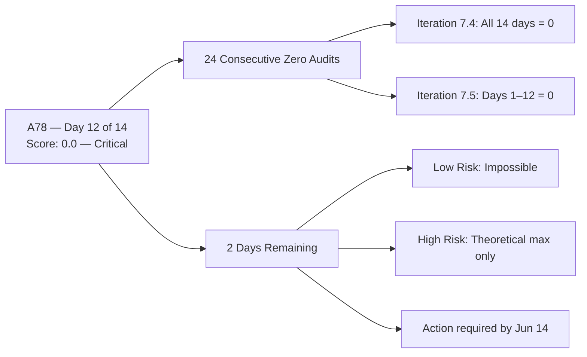

# ADO SAFe Audit — Life Style Help App Team

## 1. Audit Metadata

| Field | Value |
|-------|-------|
| Audit Number | A78 |
| Audit Date | 2026-06-12 |
| Audit Time | 02:04 UTC |
| Timezone | UTC |
| Iteration | Iteration 7.5 |
| Iteration Dates | 2026-06-01 – 2026-06-14 |
| Sprint Day | Day 12 of 14 |
| ADO Project | Life Style Help App (`0f447778-7156-4451-ab21-27be3c4a5888`) |
| ADO Team | Life Style Help App Team (`a2a805bc-0b30-4ef3-9a8a-b7f3081157a6`) |
| Iteration ID | `4aafce01-3cbe-4992-8e9e-8c55faf9bfb3` |
| Iteration Path | `Life Style Help App\2026-PI7\Iteration 7.5` |
| Workspace | `ado_ls_dev` |
| Prior Audit | AUDIT_20260610_0904.md (Score: 0.0 — Critical, A77, Day 10) |
| **Overall Score** | **0.0 / 100** |
| **Risk Band** | **Critical** |

> **Portfolio Note:** This workspace is excluded from `portfolio-health` and `portfolio-meeting-prep` aggregation per owner directive (2026-05-21). Individual audits continue per batch run policy.

---

## 2. Executive Summary

- Iteration 7.5 is on **Day 12 of 14** — 86% of the sprint elapsed, **2 days remain**. The Life Style Help App project records its **twenty-fourth consecutive zero-score audit** (A55 through A78). The Stories and Deliverables backlog remains empty. No capacity is configured. No items exist in Iteration 7.5.
- **Zero activity detected since prior audit (A77, Day 10).** No ADO changes of any kind were observed between Jun 10 and Jun 12.
- **Sprint recovery is now mathematically impossible.** With only 2 days remaining, Low Risk (≥80) cannot be achieved even with immediate maximum effort. The theoretical ceiling is approximately High Risk (~40–55 range), and only if items are created, estimated, described with DoR, and closed within 2 days — an unrealistic scenario.
- **24th consecutive Critical audit.** This spans all 14 days of Iteration 7.4 plus all 12 elapsed days of Iteration 7.5.
- **Actionable decision point has passed.** The three documented options — emergency partial restart, formal pause, or project discontinuation — remain unexecuted as of Day 12. A decision by sprint close (Jun 14) is needed to inform 7.6 IP planning.

---

## 3. Previous Audit Delta

| Metric | A77 (2026-06-10, Day 10) | A78 (2026-06-12, Day 12) | Change |
|--------|------------------------|--------------------------|--------|
| Iteration | 7.5 | 7.5 | No change |
| Sprint Day | Day 10 of 14 | **Day 12 of 14** | +2 days elapsed |
| VRBI | 0 | **0** | No change |
| CIRI | 0 | **0** | No change |
| Capacity Configured | 0 | **0** (API: "No team capacity assigned") | No change |
| SP Committed | 0 SP | **0 SP** | No change |
| Recovery Action Observed | None | **None** | No change |
| Overall Score | 0.0 | **0.0** | No change |
| Risk Band | Critical | **Critical** | Unchanged |
| Consecutive Zero-Score Audits | 23 (A55–A77) | **24 (A55–A78)** | +1 |
| Sprint Days Elapsed | 10 (71%) | **12 (86%)** | +2 days |
| Sprint Days Remaining | 4 | **2** | −2 |

### Day 10 → Day 12 Assessment

No ADO changes detected in a 48-hour window. The Stories and Deliverables backlog returns zero work items. The capacity API errors ("No team capacity assigned to the teams"). The project shows no iteration activity of any kind.

**Day 12 mathematical ceiling analysis:**

| Action Today | Maximum Achievable Score | Band |
|--------------|--------------------------|------|
| No action | 0.0 | Critical |
| Add items today, close none | ~28.6 (D1+D2+D3+D4+D5+D6 partial) | Critical |
| Add + close all items by Jun 14 | ~57.1 (all dimensions except D7 partial) | High Risk (theoretical max) |
| Low Risk (≥80) | Impossible from Day 12 | — |

---

## 4. Current Iteration Snapshot

**Iteration 7.5** · 2026-06-01 – 2026-06-14 · **Day 12 of 14** · 2 days remaining

| Field | Value |
|-------|-------|
| Visible Root Backlog Items (VRBI) | **0** |
| Items in Iteration 7.5 (CIRI) | **0** |
| Total SP Committed | **0 SP** |
| Capacity Configured | **0** (API: "No team capacity assigned") |
| Items Active | **0** |
| SP Burned | **0 SP** |
| Sprint Days Elapsed | 12 (86% of sprint) |
| Sprint Days Remaining | **2** |
| Recovery Window Status | **CRITICAL — 2 days remain; Low Risk mathematically impossible** |

---

## 5. Work Item Analysis

No work items exist in the Stories and Deliverables backlog for the Life Style Help App Team. The `wit_list_backlog_work_items` API returns an empty array for project `0f447778-7156-4451-ab21-27be3c4a5888`, team `a2a805bc-0b30-4ef3-9a8a-b7f3081157a6`. This is consistent with all 24 prior zero-score audits in this series (A55–A78).

---

## 6. SAFe Compliance Scorecard

| Dimension | Score | Evidence | Notes |
|-----------|-------|----------|-------|
| D1 — Iteration Planning | 0.0 | VRBI=0 → formula yields 0 | No backlog items exist |
| D2 — Team Capacity | 0.0 | No contributors with current work (CIRI=0) | Capacity API: "No team capacity assigned" |
| D3 — Estimation | 0.0 | No point-eligible items (CIRI=0) | — |
| D4 — DoR Compliance | 0.0 | No CIRI items (CIRI=0) | — |
| D5 — Work Item Balance | 0.0 | No CIRI items (CIRI=0) | — |
| D6 — Backlog Refinement | 0.0 | VRBI=0 → formula yields 0 | No backlog items exist |
| D7 — Delivery Predictability | 0.0 | No committed SP | — |
| **Overall** | **0.0** | All dimensions zero | **Critical** |

---

## 7. Dimension Findings

### All Dimensions: 0.0

Per the rubric:
- D1: `visible_root_backlog_items = 0` → score 0
- D2: `contributors_with_current_work = 0` (CIRI = 0) → score 0
- D3: `point_eligible_current_items = 0` (CIRI = 0) → score 0
- D4: `current_iteration_root_items = 0` → score 0
- D5: `current_iteration_root_items = 0` → score 0
- D6: `visible_root_backlog_items = 0` → score 0
- D7: `committed_story_points = 0` → score 0

```
Overall = round((0 + 0 + 0 + 0 + 0 + 0 + 0) / 7, 1) = 0.0
Risk Band: Critical (< 40)
```

### Consecutive Zero Series: A55–A78

| Audit Range | Iteration | Zero Days |
|-------------|-----------|-----------|
| A55–A68 | Iteration 7.4 | 14 days (full sprint) |
| A69–A78 | Iteration 7.5 | 12 days elapsed (2 remain) |
| **Total** | — | **24 consecutive audits** |

---

## 8. Score Visualization



```mermaid
xychart-beta type: bar
  title "Life Style Help App — Audit Series Score Trend (Last 6 Audits)"
  x-axis ["A73 (7.4)", "A74 (7.4)", "A75 (7.5 D1)", "A76 (7.5 D9)", "A77 (7.5 D10)", "A78 (7.5 D12)"]
  y-axis "Score" 0 --> 100
  bar [0, 0, 0, 0, 0, 0]
```

---

## 9. Risks and Bottlenecks

| Risk | Severity | Description |
|------|----------|-------------|
| Inactive sprint with 2 days remaining | CRITICAL | 0 items, 0 SP, 0 capacity. Sprint closes Jun 14. |
| 24-audit zero streak | CRITICAL | No recovery trend. No partial-credit scenarios have been attempted across two full sprints. |
| No owner decision documented | CRITICAL | The three options (restart, pause, discontinue) were first presented in A55 (May 18). 25 days later: no documented action. |
| Capacity not configured | HIGH | Even if items were added today, D2 would require capacity to be configured before contributors_with_capacity > 0. |
| Project appears inactive | HIGH | No ADO changes since the last audit in the series. No engagement from any team member. |
| 7.6 IP planning is unconstrained | MEDIUM | Without a decision on project status, 7.6 IP will begin with the same zero-state, perpetuating the streak into a third consecutive sprint. |

---

## 10. Prioritized Recommendations

1. **[BY JUN 14 — DECISION REQUIRED] Make a formal project disposition decision.** The Life Style Help App project needs one of three actions documented in ADO:
   - **Option A — Emergency Restart:** Create 3–5 User Stories for the next sprint (7.6 IP) with full DoR (Description + AC), assign to named contributors, configure team capacity. This is the only path to exiting Critical band in 7.6 IP.
   - **Option B — Formal Pause:** Document the pause decision in ADO (create a work item or update the team wiki). Remove the Life Style Help App Team board from active sprint tracking. Set a re-activation date.
   - **Option C — Project Discontinuation:** Close all iterations in the team settings, archive the project, and remove from batch audit runs. Update `ado_ls_dev/CLAUDE.md` to reflect discontinued status.

2. **[IF RESTARTING] Configure team capacity immediately.** The capacity API must return non-zero values before D2 can score above 0. Add at least one team member with hourly capacity to the active iteration.

3. **[IF RESTARTING] Create and DoR-qualify backlog items before sprint commitment.** Any new items must have: Type = User Story, Description ≥ 30 non-ws chars, Acceptance Criteria ≥ 20 non-ws chars, Story Points > 0, and AssignedTo populated.

4. **[AUDIT SERIES NOTE] Consider suspending daily audits if no action taken by Jun 14.** 24 consecutive identical zero-score audits provide no new information. If the project remains inactive after sprint end, the audit series should be suspended until a restart decision is made.

---

## 11. Evidence Gaps and Limitations

| Gap | Impact | Mitigation |
|-----|--------|------------|
| `wit_list_backlog_work_items` returns empty array | All scoring dimensions yield 0 | This is the authoritative evidence source — no workaround per skill rules |
| Capacity API error ("No iteration capacity assigned") | Cannot confirm D2 | Consistent with 24-audit series; treated as 0 capacity |
| No team member activity visible | Cannot determine if project is formally paused or simply inactive | No ADO evidence of formal pause; audit treats as inactive |
| Portfolio exclusion | This workspace excluded from `portfolio-health` aggregation since 2026-05-21 | Per owner directive; individual audits continue per batch policy |
