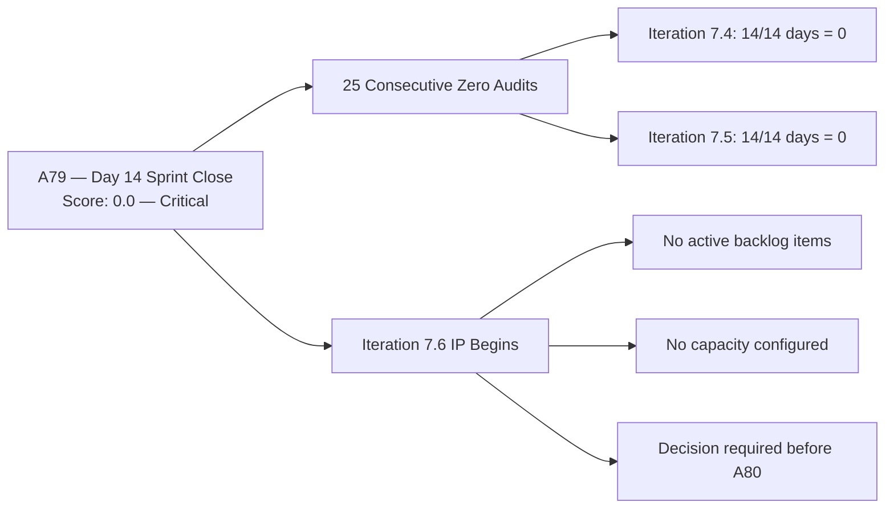
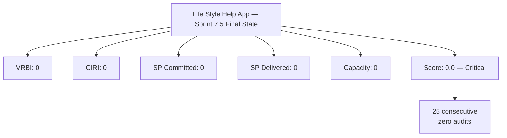

# ADO SAFe Audit — Life Style Help App Team

## 1. Audit Metadata

| Field | Value |
|-------|-------|
| Audit Number | A79 |
| Audit Date | 2026-06-14 |
| Audit Time | 02:00 UTC |
| Timezone | UTC |
| Iteration | Iteration 7.5 |
| Iteration Dates | 2026-06-01 – 2026-06-14 |
| Sprint Day | Day 14 of 14 (Sprint Close) |
| ADO Project | Life Style Help App (`0f447778-7156-4451-ab21-27be3c4a5888`) |
| ADO Team | Life Style Help App Team (`a2a805bc-0b30-4ef3-9a8a-b7f3081157a6`) |
| Iteration ID | `4aafce01-3cbe-4992-8e9e-8c55faf9bfb3` |
| Iteration Path | `Life Style Help App\2026-PI7\Iteration 7.5` |
| Workspace | `ado_ls_dev` |
| Prior Audit | AUDIT_20260612_0204.md (Score: 0.0 — Critical, A78, Day 12) |
| **Overall Score** | **0.0 / 100** |
| **Risk Band** | **Critical** |

> **Portfolio Note:** This workspace is excluded from `portfolio-health` and `portfolio-meeting-prep` aggregation per owner directive (2026-05-21). Individual audits continue per batch run policy.

---

## 2. Executive Summary

- Iteration 7.5 has **closed** — Day 14 final audit. The Life Style Help App project records its **twenty-fifth consecutive zero-score audit** (A55 through A79), spanning two complete sprints plus this close.
- **Zero activity at sprint close.** The Stories and Deliverables backlog returned zero work items (`wit_list_backlog_work_items` → empty array). The iteration returned zero items (`wit_get_work_items_for_iteration` → empty). Capacity API continues to return "No team capacity assigned."
- **No ADO changes detected** between Day 12 (Jun 12) and sprint close (Jun 14). The project ended Iteration 7.5 in the same state it began it.
- **Iteration 7.5 is now closed with 0 SP delivered, 0 items committed, 0 capacity configured.** Iteration 7.6 IP will begin in this same state unless a formal decision is made before or during the next sprint's IP ceremony.
- **The three-option decision** (Emergency Restart / Formal Pause / Project Discontinuation) presented in A55 (May 18, 2026) remains undocumented and unexecuted after 28 days.

---

## 3. Previous Audit Delta

| Metric | A78 (2026-06-12, Day 12) | A79 (2026-06-14, Day 14) | Change |
|--------|--------------------------|--------------------------|--------|
| Iteration | 7.5 | 7.5 (now closed) | Sprint close |
| Sprint Day | Day 12 of 14 | **Day 14 of 14 (Closed)** | Final |
| VRBI | 0 | **0** | No change |
| CIRI | 0 | **0** | No change |
| Capacity Configured | 0 | **0** (API: "No team capacity assigned") | No change |
| SP Committed | 0 SP | **0 SP** | No change |
| SP Burned | 0 SP | **0 SP** | No change |
| Recovery Action Observed | None | **None** | No change |
| Overall Score | 0.0 | **0.0** | No change |
| Risk Band | Critical | **Critical** | Unchanged |
| Consecutive Zero-Score Audits | 24 (A55–A78) | **25 (A55–A79)** | +1 |
| Sprint Status | In-progress | **Closed** | Iteration 7.5 ended |

### Sprint Close Assessment

Iteration 7.5 closed with zero output on all measurable dimensions. No recovery actions were taken in the final 48-hour window (Days 12–14). The window for any partial credit in this sprint has passed.

**Iteration 7.5 final state summary:**

| Action | Status |
|--------|--------|
| Items created in backlog | 0 |
| Items committed to iteration | 0 |
| SP estimated | 0 |
| SP delivered | 0 |
| Capacity configured | 0 |
| Formal project status decision | None documented |

---

## 4. Current Iteration Snapshot

**Iteration 7.5** · 2026-06-01 – 2026-06-14 · **Day 14 of 14 (Sprint Closed)**

| Field | Value |
|-------|-------|
| Visible Root Backlog Items (VRBI) | **0** |
| Items in Iteration 7.5 (CIRI) | **0** |
| Total SP Committed | **0 SP** |
| Capacity Configured | **0** (API: "No team capacity assigned") |
| Items Active / New / Closed | **0** |
| SP Burned | **0 SP** |
| Sprint Status | **Closed — no output** |
| Consecutive zero-score sprints | **2 full sprints** (7.4 + 7.5) |

---

## 5. Work Item Analysis

No work items exist in the Stories and Deliverables backlog for the Life Style Help App Team.

- `wit_list_backlog_work_items` for project `0f447778` / team `a2a805bc` → **empty array**
- `wit_get_work_items_for_iteration` for iteration `4aafce01` → **empty relations**
- `work_get_iteration_capacities` for iteration `4aafce01` → **error: "No team capacity assigned"**

This is consistent with all 25 prior zero-score audits (A55–A79). Iteration 7.5 closes with no traceable ADO activity of any kind.

---

## 6. SAFe Compliance Scorecard

| Dimension | Score | Evidence | Notes |
|-----------|-------|----------|-------|
| D1 — Iteration Planning | 0.0 | VRBI=0 → formula yields 0 | No backlog items exist |
| D2 — Team Capacity | 0.0 | No contributors with current work (CIRI=0) | Capacity API: error |
| D3 — Estimation | 0.0 | No point-eligible items (CIRI=0) | — |
| D4 — DoR Compliance | 0.0 | No CIRI items (CIRI=0) | — |
| D5 — Work Item Balance | 0.0 | No CIRI items (CIRI=0) | — |
| D6 — Backlog Refinement | 0.0 | VRBI=0 → formula yields 0 | No backlog items exist |
| D7 — Delivery Predictability | 0.0 | No committed SP | — |
| **Overall** | **0.0** | All dimensions zero | **Critical** |

```
Overall = round((0 + 0 + 0 + 0 + 0 + 0 + 0) / 7, 1) = 0.0
Risk Band: Critical (< 40)
```

---

## 7. Dimension Findings

### All Dimensions: 0.0

Per rubric:
- D1: `visible_root_backlog_items = 0` → score 0
- D2: `contributors_with_current_work = 0` (CIRI = 0) → score 0
- D3: `point_eligible_current_items = 0` → score 0
- D4: `current_iteration_root_items = 0` → score 0
- D5: `current_iteration_root_items = 0` → score 0
- D6: `visible_root_backlog_items = 0` → score 0
- D7: `committed_story_points = 0` → score 0

### Consecutive Zero Series: A55–A79

| Audit Range | Iteration | Zero Days |
|-------------|-----------|-----------|
| A55–A68 | Iteration 7.4 | 14 days (full sprint) |
| A69–A79 | Iteration 7.5 | 14 days (full sprint) |
| **Total** | **2 complete sprints** | **25 consecutive zero audits** |

Iteration 7.6 IP begins after today. If no action is taken before the next sprint start, A80 will open at 0.0.

---

## 8. Score Visualization





---

## 9. Risks and Bottlenecks

| Risk | Severity | Description |
|------|----------|-------------|
| Sprint 7.5 closed with zero output | CRITICAL | Iteration ended with no items, no SP, no capacity. Second complete sprint at 0.0. |
| 25-audit zero streak continues | CRITICAL | No recovery trend. Two full sprints elapsed without any ADO activity. |
| Decision undocumented for 28+ days | CRITICAL | The restart/pause/discontinue options were first presented in A55 (May 18). Still no formal decision as of Day 14. |
| Iteration 7.6 IP will begin at 0.0 | HIGH | Without a decision, 7.6 IP planning starts with an empty board, perpetuating the streak into a third sprint. |
| Capacity not configured | HIGH | Even if items were created, D2 would score 0 until capacity is configured for the team in the ADO iteration settings. |
| Audit series producing no information value | MEDIUM | 25 identical zero-score audits provide no diagnostic information. Continued daily auditing without project action is process overhead without benefit. |

---

## 10. Prioritized Recommendations

1. **[BEFORE 7.6 IP START — DECISION REQUIRED] Make a formal project disposition decision.** Iteration 7.6 IP begins now. This is the decision gate:
   - **Option A — Emergency Restart:** Before 7.6 IP commit, create 3–5 User Stories with full DoR (Description + AC + SP + AssignedTo), configure team capacity in ADO, and formally commit to the iteration. Achievable Low Risk (≥ 80) within 7.6 IP if 100% delivery is achieved.
   - **Option B — Formal Pause:** Document the pause in ADO (create a status work item or add a note to the team's iteration settings). Set a re-activation date and criteria. Suspend daily audits until re-activation.
   - **Option C — Project Discontinuation:** Close all iterations in team settings, archive the project, remove from batch audit policy. Update `ado_ls_dev/CLAUDE.md` to reflect discontinued status.

2. **[IF RESTARTING] Configure capacity first.** The ADO iteration capacity for the Life Style Help App Team (`a2a805bc`) must show at least one team member with positive hourly capacity before D2 can score above 0.

3. **[IF RESTARTING] Add items with full DoR before commit.** Any item entering the sprint must have: WorkItemType = User Story, Description ≥ 30 non-ws chars, AcceptanceCriteria ≥ 20 non-ws chars, StoryPoints > 0, AssignedTo populated.

4. **[AUDIT SERIES — IMMEDIATE] Suspend daily individual audits pending decision.** Twenty-five consecutive identical audits confirm the project is inactive. Daily auditing adds no diagnostic value in this state. Recommend suspending until one of the three options is formally adopted and implemented.

---

## 11. Evidence Gaps and Limitations

| Gap | Impact | Mitigation |
|-----|--------|------------|
| `wit_list_backlog_work_items` returns empty array | All scoring dimensions yield 0 | This is the authoritative source; no workaround |
| `wit_get_work_items_for_iteration` returns empty | Confirms no items assigned to iteration | Consistent with all 25 audits |
| Capacity API error ("No iteration capacity assigned") | Cannot confirm D2 | Consistent with full zero series |
| No team member ADO activity visible | Cannot determine if project is formally paused or simply abandoned | No evidence of formal pause decision in ADO |
| Portfolio exclusion active | Excluded from `portfolio-health` and `portfolio-meeting-prep` aggregation | Per owner directive 2026-05-21; individual audits continue per batch policy |
