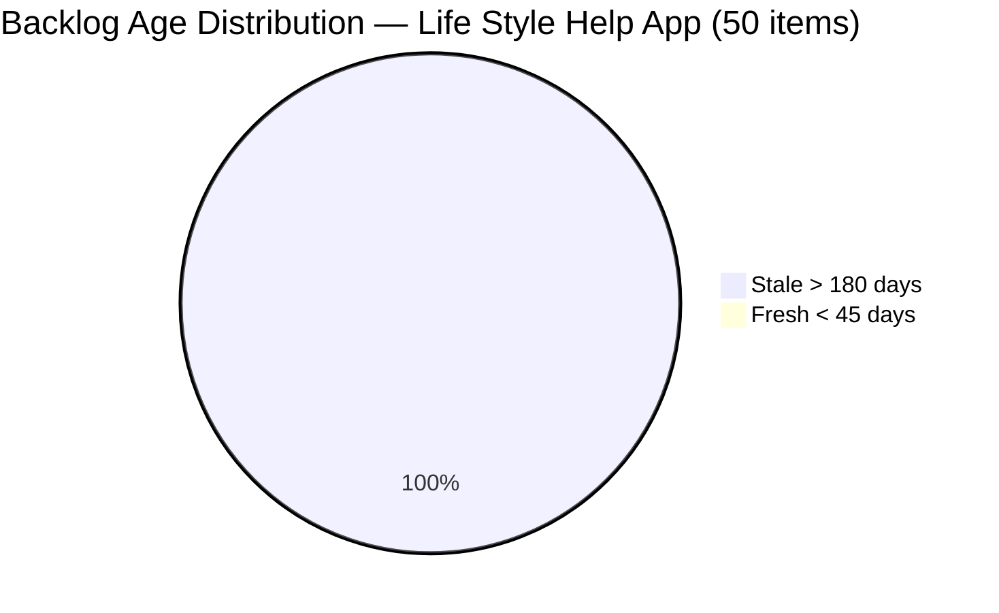
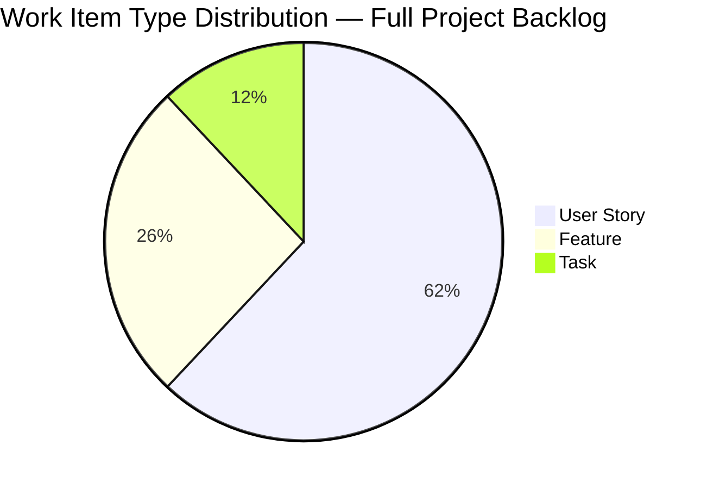

# SAFe Iteration Audit — Life Style Help App Team

## 1. Audit Metadata

| Field | Value |
|-------|-------|
| **Project** | Life Style Help App |
| **Team** | Life Style Help App Team |
| **Workspace** | `ado_ls_dev` |
| **Iteration** | Iteration 7.6 (IP) — Innovation & Planning |
| **Iteration Dates** | 2026-06-15 to 2026-06-28 |
| **Audit Date** | 2026-06-15 (PHT, UTC+8) |
| **Prior Audit Reference** | No files in `ado_ls_dev/audit/`. CLAUDE.md references `audit/AUDIT_20260318_210643.md` as last entry (2026-03-18) |
| **Overall Score** | **8.6 / 100** |
| **Risk Band** | CRITICAL (Red) |

---

## 2. Executive Summary

The Life Style Help App Team has **zero work items committed to Iteration 7.6 (IP)**. The team's Stories & Deliverables backlog is empty as seen by the ADO API, and a full project-wide query confirms that all 50 tracked work items reside in old iterations from PI1 (circa March–May 2024) or at the project root with no iteration assigned. No work has been scoped, planned, or started for the current IP iteration.

This is **Day 1** of the iteration. However, the absence of any sprint commitment — not just low delivery — is a fundamentally different problem from the other teams audited today. The Life Style Help App appears to be in a state of **project dormancy**: the backlog consists entirely of legacy items from 2024, with the most recent changes dated July 4, 2025 (nearly a year ago), and one item last changed in May 2024 (over two years ago).

The overall score of **8.6** (Critical) reflects complete absence of iteration planning and a stale, unrefined backlog. The 60-point Work Item Balance score is theoretical — the penalty for "no User Stories" is applied but no items exist to drive any other score.

> **Portfolio Note:** Per the portfolio CLAUDE.md, this workspace (`ado_ls_dev`) is excluded from portfolio-level health dashboards by owner request (2026-05-21). Individual audits are still executed.

---

## 3. Previous Audit Delta

No prior audit files exist in `ado_ls_dev/audit/`. CLAUDE.md records the last audit as `AUDIT_20260318_210643.md` (2026-03-18), but the file is absent. Based on the March 2026 audit history in CLAUDE.md, the team was active with sprint work. The current state represents a significant regression from that period.

Since the last documented audit (3 months ago), the team appears to have stopped committing work to iterations entirely. No new User Stories have been created in the project since at least March 2026, and no items are assigned to any iteration after PI1.

---

## 4. Current Iteration Snapshot

| Field | Value |
|-------|-------|
| **Iteration** | 7.6 (IP) — Innovation & Planning |
| **Start Date** | 2026-06-15 |
| **End Date** | 2026-06-28 |
| **Duration** | 14 days |
| **Root Items in Iteration (User Stories / Deliverables)** | 0 |
| **Total Project Work Items** | 50 (all in legacy iterations) |
| **Story Points Committed** | 0 |
| **Story Points Closed** | 0 |
| **Team Capacity** | Not configured (API: No iteration capacity assigned) |
| **Iteration Goal** | Not defined |
| **Active Contributors** | None assigned to current iteration |

---

## 5. Work Item Analysis

### 5.1 Backlog State

The team's Stories & Deliverables backlog returned empty via ADO API. A full project-level query returned 50 items, all residing in legacy iteration paths:

| Iteration Path | Item Count | Last Changed |
|----------------|-----------|--------------|
| Life Style Help App\PI 1\Iteration 1.1 | ~20 | 2025-07-04 |
| Life Style Help App\PI 1\Iteration 1.2 | ~22 | 2025-07-04 |
| Life Style Help App\PI 1\Iteration 1.4 | ~7 | 2025-07-04 |
| Life Style Help App\PI 1\Iteration 1.5 | 1 | 2025-07-04 |
| Life Style Help App (root, no iteration) | 2 | 2024-05-30 to 2025-07-04 |

**No items exist in PI7 or any iteration between PI2 and PI7.**

### 5.2 Backlog Age Assessment (50 items total)

| Age Category | Count | % of Backlog |
|-------------|-------|-------------|
| Fresh (< 45 days) | 0 | 0% |
| Stale > 90 days | 50 | 100% |
| Stale > 180 days | 50 | 100% |

All 50 items have `ChangedDate` of 2025-07-04 or older (340+ days ago), far exceeding the 180-day stale threshold. Two items (160513, 159062) show changes from 2024-03-31 to 2024-05-30 — over two years stale.

### 5.3 Item Type Distribution

| Type | Count |
|------|-------|
| User Story | 31 |
| Feature | 13 |
| Task | 6 |

All items are Closed. This project contains exclusively completed historical work — there are no open, active, or in-progress items anywhere in the backlog.

### 5.4 Key Historical Items (Sample)

| ID | Title | Type | State | SP | Last Changed |
|----|-------|------|-------|----|-------------|
| 158783 | Login Page Design | Feature | Closed | — | 2025-07-04 |
| 158786 | [Design] Login UI | User Story | Closed | — | 2025-07-04 |
| 159680 | [Authentication] Login Functionality | Feature | Closed | — | 2025-07-04 |
| 159763 | [Login] Login page Layout | User Story | Closed | 2 | 2025-07-04 |
| 159764 | [Login] Google Authentication | User Story | Closed | 2 | 2025-07-04 |
| 160513 | Dashboard Module | Feature | Closed | — | 2024-05-30 |
| 159062 | [Design] Design System | User Story | Closed | — | 2025-07-04 |

All items are Closed. The project completed PI1 work (Login, Registration, Forgot Password modules) and has not had new activity since.

---

## 6. SAFe Compliance Scorecard

| # | Dimension | Score | Evidence | Notes |
|---|-----------|-------|----------|-------|
| 1 | Iteration Planning | **0.0** | visible_root_backlog = 0; current_iter_root = 0 | No items in current iteration |
| 2 | Team Capacity | **0.0** | contributors_with_current_work = 0; no capacity configured | ADO: "No iteration capacity assigned" |
| 3 | Estimation | **0.0** | point_eligible = 0 (no items in iteration) | Nothing to estimate |
| 4 | DoR Compliance | **0.0** | current_iter_root = 0; formula undefined → 0 | No items to evaluate |
| 5 | Work Item Balance | **60.0** | No User Stories in current iteration (-40); no items → dominant type undefined (no -30); no spikes | Only partial penalty applied at 0-item state |
| 6 | Backlog Refinement | **0.0** | visible_root = 0; base = 0 | Backlog is empty per team scope |
| 7 | Delivery Predictability | **0.0** | committed_SP = 0 → formula = 0 | Day 1; no commitments |
| | **Overall** | **8.6** | Average of 7 dimensions | Critical Risk |

---

## 7. Dimension Findings

### 7.1 Iteration Planning (0.0)
No items have been committed to Iteration 7.6 (IP) or any iteration after PI1 (which ended circa May 2024). The team has not conducted iteration planning for at least the past 12+ months. This is a fundamental process breakdown.

### 7.2 Team Capacity (0.0)
ADO returned "No iteration capacity assigned to the teams" for the current iteration. The team has not set up capacity, days-off, or activity allocations for Iteration 7.6 (IP). There are no current assignees on any iteration work.

### 7.3 Estimation (0.0)
No items to estimate. Of the historical 50 items, only a subset have Story Points (the User Stories in PI1). The 31 historical User Stories show SP values between 1 and 3 SP each — indicating good estimation practice was in place during active development.

### 7.4 DoR Compliance (0.0)
No current-iteration items to evaluate. Historical items show strong DoR compliance — most User Stories in PI1 have detailed Descriptions (user-voice narrative format) and multi-point Acceptance Criteria. If development resumes, this historical quality provides a good template to follow.

### 7.5 Work Item Balance (60.0)
No items in current iteration. The -40 penalty for "no User Story items" is applied. Dominant type penalty (-30) is not applied since there are no items to establish a dominant type. No spikes. Result: max(0, 100-40) = 60. This is a theoretical score reflecting structural absence rather than an imbalanced portfolio.

### 7.6 Backlog Refinement (0.0)
The team's visible root backlog is empty (0 items). All 50 historical items are Closed and have not been updated in 11+ months. There is no active backlog to refine. The base formula (fresh/visible_root) is 0/0 = undefined, treated as 0. All 50 items exceed the 180-day staleness threshold.

### 7.7 Delivery Predictability (0.0)
Committed SP = 0; formula returns 0. **Day 1 of IP iteration — no delivery expected.** However, unlike the other teams audited today, the absence of delivery cannot be attributed to "early sprint" — the team has had 0 delivery for multiple iterations preceding today.

---

## 8. Risks and Bottlenecks

| Risk | Severity | Status |
|------|----------|--------|
| Zero sprint commitment — no items in current or recent iterations | Critical | Active |
| Project appears dormant — no new items created since PI1 (~mid-2024) | Critical | Active |
| Entire 50-item backlog is Closed legacy work (>180 days stale) | Critical | Active |
| No team capacity configured for current iteration | High | Active |
| No iteration goal or PI objectives | High | Active |
| No active assignees on any sprint work | High | Active |
| Ownership concentration risk (Samantha Babael noted in CLAUDE.md) — cannot confirm from ADO since no active items | Moderate | Cannot verify |
| DoR enforcement flagged in CLAUDE.md audit considerations — moot until items are added | Low | Latent |

---

## 9. Prioritized Recommendations

1. **[Immediate — This IP Iteration]** Conduct a project status assessment: determine whether the Life Style Help App is actively developed, on hold, or effectively archived. If active, a formal project restart is needed. If on hold, the ADO board should be formally archived or marked inactive to avoid misleading portfolio dashboards.

2. **[This IP Iteration]** If the project is to be restarted, create new User Stories for the next phase of work (post-PI1 features: Dashboard Module, Client Profiles, etc.). Do not reuse or reopen the closed PI1 items — create fresh items with current DoR standards.

3. **[This IP Iteration]** Archive or close the two items sitting at the project root iteration path (159062 and 160513). These Feature/Story items with no iteration assignment contribute to backlog noise.

4. **[This IP Iteration]** Configure team capacity for Iteration 7.6 in ADO — even if planning is nominal (1–2 hours/day for IP retrospective work), having capacity configured is required for SAFe compliance.

5. **[Before Sprint 8.1]** If development resumes, hold a formal Iteration Planning event with the team before the next sprint. Define an Iteration Goal, pull user stories from a refined backlog, assign SP, and configure DoR gates. The historical PI1 stories provide excellent templates for the format expected.

6. **[Strategic]** Consider whether the Life Style Help App should remain a separate ADO project or be merged into Jairosoft FINOPS as a sub-team. Running a separate project with no active work creates administrative overhead and risks being overlooked in portfolio audits.

7. **[Strategic]** Clarify the team roster. CLAUDE.md lists Ramon Aseniero Jr (ramon@jairosoft.com) as project owner, but no team members are assigned to any current work. Identify who the delivery team is before any new sprint begins.

---

## 10. Evidence Gaps and Limitations

| Gap | Impact |
|-----|--------|
| `wit_list_backlog_work_items` returned empty — could mean backlog is unconfigured or team scope excludes all items | Confirmed by project-wide WIQL: no items in any iteration >= PI2. Empty backlog is accurate. |
| No prior audit files in `ado_ls_dev/audit/` — CLAUDE.md references March 2026 audits | Cannot compute dimension-level delta. Qualitative comparison only. |
| `work_get_iteration_capacities` returned "No iteration capacity assigned" | Confirms zero capacity configuration. Not an API error. |
| No items in Iteration 7.6 (IP) returned by full-project WIQL | Query confirmed against both IterationPath and WorkItemType filters. Absence is real. |
| Samantha Babael (noted in CLAUDE.md as ownership concentration risk) has no items in ADO — cannot verify current role | Context note only; cannot audit what is not present in ADO. |
| Project excluded from portfolio dashboards per owner request (2026-05-21) | Individual audit still required; noted for completeness. |

---

## Appendix: Mermaid Diagrams





```mermaid
bar
    title SAFe Compliance Scorecard — Life Style Help App Team — Iteration 7.6 (IP)
    x-axis [Iter Planning, Team Capacity, Estimation, DoR Compliance, Work Bal, Backlog Ref, Delivery Pred]
    y-axis "Score (0-100)" 0 --> 100
    bar [0, 0, 0, 0, 60, 0, 0]
```
