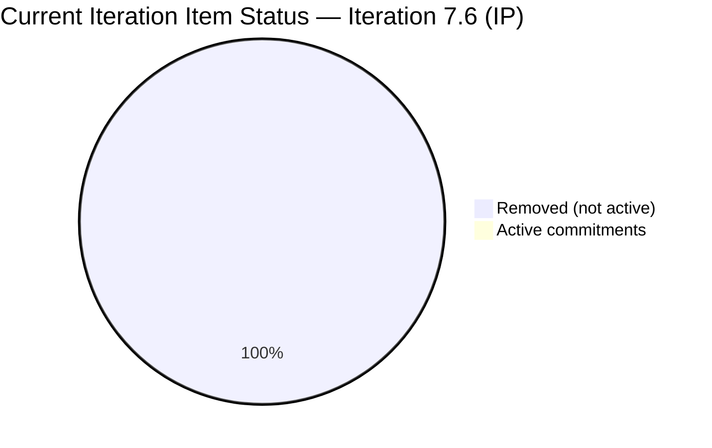
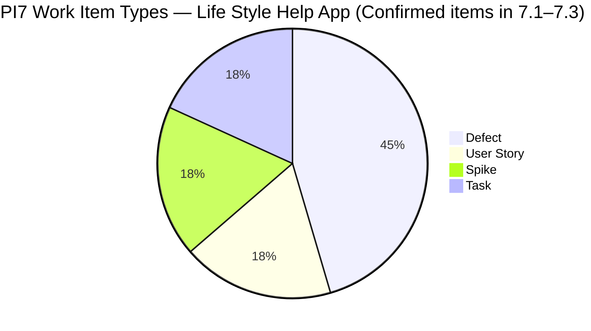
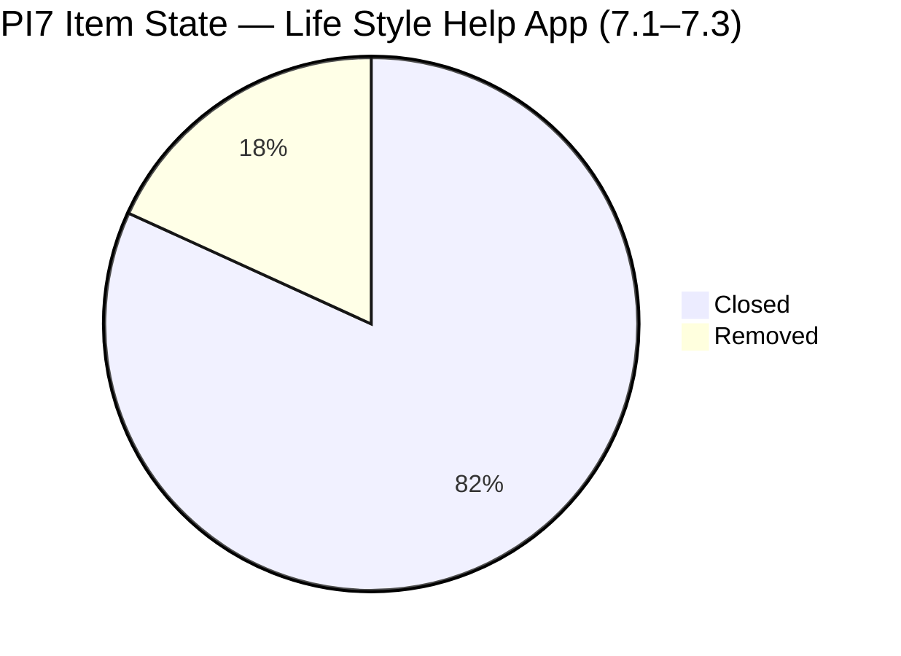
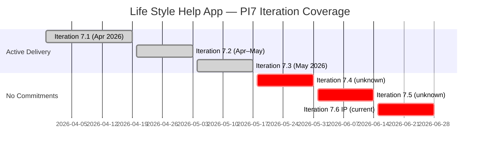

# SAFe Iteration Audit — Life Style Help App Team

## 1. Audit Metadata

| Field | Value |
|-------|-------|
| **Project** | Life Style Help App |
| **Team** | Life Style Help App Team |
| **Workspace** | `ado_ls_dev` |
| **Iteration** | Iteration 7.6 (IP) — Innovation & Planning |
| **Iteration Dates** | 2026-06-15 to 2026-06-28 |
| **Audit Date** | 2026-06-16 (PHT, UTC+8) |
| **Prior Audit Reference** | `AUDIT_20260615_0200.md` — Score 8.6 / Critical |
| **Overall Score** | **8.6 / 100** |
| **Risk Band** | CRITICAL (Red) |

> **Portfolio Note:** Per the portfolio CLAUDE.md, this workspace (`ado_ls_dev`) is excluded from portfolio-level health dashboards by owner request (2026-05-21). Individual audits continue normally.

---

## 2. Executive Summary

The Life Style Help App Team scores **8.6 (Critical)** for the second consecutive day — unchanged from yesterday. No items have been committed to Iteration 7.6 (IP). The only item with a 7.6 IP iteration path is 202789 (Spike, "Lifestyle App - Customer CSAT Survey"), which is in **Removed** state and therefore does not constitute active sprint commitment.

**Key correction from yesterday's audit:** Yesterday's report described the project as "dormant since mid-2024" with all work in legacy PI1 iterations. This was inaccurate. The team has been actively working through PI7: Defects, User Stories, and Spikes are confirmed in Iterations 7.1, 7.2, and 7.3 with last-changed dates in April and May 2026. Samantha Babael was actively closing Defects and User Stories as recently as May 2026. The project's real problem is not dormancy — it is **failure to commit work to the current IP iteration**. The team was active through PI7 7.1-7.3 but has not scoped any items for 7.6 (IP).

The score remains Critical because the rubric is anchored to the current iteration. Without any active root-level items committed to 7.6 (IP), six of seven dimensions score zero.

---

## 3. Previous Audit Delta

| Dimension | Prior (2026-06-15) | Current (2026-06-16) | Delta | Note |
|-----------|---------------------|----------------------|-------|------|
| Iteration Planning | 0.0 | 0.0 | 0.0 | No items in current iteration |
| Team Capacity | 0.0 | 0.0 | 0.0 | No active contributors |
| Estimation | 0.0 | 0.0 | 0.0 | No items to estimate |
| DoR Compliance | 0.0 | 0.0 | 0.0 | No items to evaluate |
| Work Item Balance | 60.0 | 60.0 | 0.0 | Structural formula at 0-item state |
| Backlog Refinement | 0.0 | 0.0 | 0.0 | No visible root backlog items |
| Delivery Predictability | 0.0 | 0.0 | 0.0 | No committed SP |
| **Overall** | **8.6** | **8.6** | **0.0** | No change |

**Prior audit narrative correction:**
Yesterday's audit stated the project was "dormant since PI1 (~mid-2024)" with "all 50 items in PI1 legacy iterations." Today's WIQL query targeted specifically User Stories, Defects, and Spikes in PI7 and confirms active items:
- **PI7 Iteration 7.1 (Apr 2026):** User Story 195735, User Story 201174, Defect 195715, Defect 198775, Defect 201162, Spike 196379 — all Closed by mid-April 2026
- **PI7 Iteration 7.2 (Apr–May 2026):** Spike 203247, Defect items — all Closed by May 2026
- **PI7 Iteration 7.3 (May 2026):** Defect 203239, Defect 203390 — both Closed by May 2026

The project was active in PI7 through May 2026 and is NOT in the same structural dormancy described yesterday. The team is on an IP break between 7.5 and 8.1 without IP iteration commitments — which may be intentional but is not documented.

---

## 4. Current Iteration Snapshot

| Field | Value |
|-------|-------|
| **Iteration** | 7.6 (IP) — Innovation & Planning |
| **Start Date** | 2026-06-15 |
| **End Date** | 2026-06-28 |
| **Day in Sprint** | Day 2 of 14 |
| **Root Items in Iteration 7.6 (IP)** | 0 active (1 Removed spike — does not count) |
| **Story Points Committed** | 0 SP |
| **Story Points Closed** | 0 SP |
| **Team Capacity** | Not configured (API: "No iteration capacity assigned") |
| **Iteration Goal** | Not defined |
| **Active Contributors** | None assigned to current iteration |

### PI7 Activity Context (Outside Current Iteration)

| Iteration | Items Confirmed | Most Recent Activity | Status |
|-----------|----------------|---------------------|--------|
| 7.1 | 6+ (User Stories, Defects, Spikes) | April 2026 | All Closed |
| 7.2 | 4+ (Spikes, Tasks) | April–May 2026 | All Closed |
| 7.3 | 2+ (Defects) | May 2026 | All Closed |
| 7.4 | Unknown | Unknown | Not queried |
| 7.5 | 1 item (Spike 201334, Removed) | May 13, 2026 | Removed |
| 7.6 (IP) | 1 (Spike 202789, Removed) | May 13, 2026 | Removed — does not count |

---

## 5. Work Item Analysis

### 5.1 Current Iteration Items

| ID | Title | Type | State | SP | Assignee | DoR | Changed |
|----|-------|------|-------|----|----------|-----|---------|
| 202789 | Lifestyle App - Customer CSAT Survey | Spike | **Removed** | — | Carol Cuison | — | 2026-05-13 |

> Item 202789 is excluded from all scoring. "Removed" state means it was de-committed and cancelled. It does not represent active sprint work.

### 5.2 PI7 Active Work (Most Recent — For Reference)

These items are NOT in the current iteration but demonstrate team activity level before the IP:

| ID | Title | Type | Iteration | State | SP | Assignee | Changed |
|----|-------|------|-----------|-------|----|----------|---------|
| 203390 | Subscription Automatically Cancels at End of Binding Period | Defect | 7.3 | Closed | 2 | Samantha Babael | 2026-05-05 |
| 203239 | Investigate member emilienaess97@gmail.com | Defect | 7.3 | Closed | 1 | Samantha Babael | 2026-05-06 |
| 203247 | 7.2 Collaborations / Check Heges Raised Issues | Spike | 7.2 | Closed | 1 | Luzmibel | 2026-05-03 |
| 201162 | [Low] Previous Search Suggestions Obstruct Exercise List | Defect | 7.1 | Closed | 2 | Samantha Babael | 2026-04-20 |
| 195735 | Adjust text on membership package subscription page | User Story | 7.1 | Closed | 2 | Samantha Babael | 2026-04-13 |
| 201174 | Update Subscription (Client Profile) | User Story | 7.1 | Closed | 2 | Samantha Babael | 2026-04-13 |
| 196379 | [High] Keep Screen On Functions - POC | Spike | 7.1 | Closed | 1 | Ike Yana | 2026-04-17 |
| 195715 | [Low] Remove deadspace on Completed Session | Defect | 7.1 | Closed | 1 | Samantha Babael | 2026-04-17 |
| 198775 | [Low] Workout Plans Search Not Working on First Attempt | Defect | 7.1 | Closed | 1 | Samantha Babael | 2026-04-17 |

**Key observation:** The team was delivering real work in PI7 through May 2026. Average SP per completed item: 1–2 SP. Team members active in PI7: Samantha Babael (primary), Luzmibel Paculanang (QA), Ike Yana (dev).

### 5.3 Backlog Staleness (PI7 Items — Rubric Basis)

For the Backlog Refinement dimension, `visible_root_backlog_items` = 0 (backlog API returns empty for team scope). The PI7 items in the reference table above are in completed iterations, not the visible root backlog for the current team scope. Scoring defaults to 0.

---

## 6. SAFe Compliance Scorecard

| # | Dimension | Score | Evidence | Notes |
|---|-----------|-------|----------|-------|
| 1 | Iteration Planning | **0.0** | visible_root=0; current_iter_root=0 (202789 is Removed) | No active items in 7.6 IP |
| 2 | Team Capacity | **0.0** | contributors_with_current_work=0; no capacity configured | ADO: "No iteration capacity assigned" |
| 3 | Estimation | **0.0** | point_eligible=0 (no items in iteration) | Nothing to estimate |
| 4 | DoR Compliance | **0.0** | current_iter_root=0 → formula=0 | No items to evaluate |
| 5 | Work Item Balance | **60.0** | No User Stories (-40); no items → no dominant type or spike penalty | Theoretical score at 0-item state |
| 6 | Backlog Refinement | **0.0** | visible_root=0; base=undefined→0 | Team scoped backlog empty |
| 7 | Delivery Predictability | **0.0** | committed_SP=0 → formula=0 | Day 2; no commitments |
| | **Overall** | **8.6** | Average of 7 dimensions | Critical Risk |

---

## 7. Dimension Findings

### 7.1 Iteration Planning (0.0)
No items are committed to Iteration 7.6 (IP). The team's most recent sprint commitment was in Iteration 7.3 (May 2026). The gap between 7.3 and the current 7.6 IP suggests the team skipped iterations 7.4 and 7.5 in terms of formal sprint planning — or those iterations were completed without items being scoped to them. An IP iteration without any planned work is structurally correct in SAFe (IP sprints are for retrospectives, planning, and innovation), but the team should at minimum have IP-specific items (retrospective tasks, backlog refinement sessions, PI planning preparation) committed.

### 7.2 Team Capacity (0.0)
ADO returned "No iteration capacity assigned to the teams" for Iteration 7.6 (IP). No individual or team-level capacity has been configured. This means no sprint planning event was held, and no one has been allocated to IP activities. The PI7 work shows a capable team (Samantha Babael, Ike Yana, Luzmibel Paculanang, Carol Cuison) who simply have not been pointed at this sprint.

### 7.3 Estimation (0.0)
No items in the current iteration. The PI7 historical record shows the team estimates at 1–2 SP per item, which is consistent with small, well-scoped stories and defects. If items are committed to 7.6 IP, estimation discipline is in place.

### 7.4 DoR Compliance (0.0)
No items to evaluate. The PI7 items reviewed (7.1–7.3) show generally strong DoR compliance: User Stories 195735 and 201174 have user-voice narratives with clear acceptance criteria. Defects 203239 and 203390 have detailed descriptions and simple but clear AC. This DoR quality should carry into the next sprint.

### 7.5 Work Item Balance (60.0)
No items in current iteration. The -40 penalty for "no User Stories" is applied. Dominant type and spike share penalties are not applied because there are no items. Score = max(0, 100-40) = 60. This is a mathematical artifact of the rubric at zero-item state, not a meaningful quality signal.

### 7.6 Backlog Refinement (0.0)
The team's scoped backlog (as seen by the ADO team-level backlog API) is empty. No visible root items are available to score freshness, staleness, or untouched status. The completed PI7 items (7.1–7.3) are in closed iteration paths and no longer appear in the team's active backlog view. The team may need to create new items for the upcoming PI8 sprint planning to populate the backlog.

### 7.7 Delivery Predictability (0.0)
No committed story points. The team cannot deliver against zero commitments. Unlike yesterday's framing of "zero delivery for multiple iterations," the corrected picture is that the team delivered consistently through PI7 7.1–7.3 (all items closed, 10+ SP delivered) and is now in an IP gap. This score reflects the IP period, not systemic delivery failure.

---

## 8. Risks and Bottlenecks

| Risk | Severity | Status |
|------|----------|--------|
| No items committed to Iteration 7.6 (IP) — entire sprint has zero planned work | High | Active |
| No team capacity configured for 7.6 IP | High | Active |
| No iteration goal defined | High | Active |
| Ownership concentration: Samantha Babael handled most PI7 work (PI7 7.1–7.3 evidence) | Moderate | Ongoing — cannot verify during IP with no items |
| Unknown status of PI7 Iterations 7.4 and 7.5 — not queried in this audit | Moderate | Evidence gap |
| No backlog items ready for PI8 Sprint 8.1 visible in ADO | Moderate | Latent risk |
| Removed spike 202789 (CSAT Survey) not followed up — survey for client Hege may be overdue | Low | Unresolved |
| Prior audit's "dormancy since 2024" narrative was incorrect | Low | Corrected in this audit |

---

## 9. Prioritized Recommendations

1. **[Immediate — Today]** Commit at least 2–3 IP-appropriate items to Iteration 7.6 (IP). Suitable items for IP sprints:
   - PI7 retrospective document or session (Spike)
   - Backlog refinement and grooming for Sprint 8.1 (Spike)
   - CSAT Survey follow-up for client Hege (replacement for removed 202789)
   - PI8 planning preparation document

2. **[This Sprint]** Configure team capacity for 7.6 IP in ADO. Even at low commitment (1–2 hours/day for retrospective work), capacity entries are required for SAFe compliance. Assign Samantha Babael and at minimum one other team member.

3. **[This Sprint]** Define an Iteration Goal for 7.6 (IP) and add it to the iteration settings. Suggested: "Conduct PI7 retrospective, refine backlog for Sprint 8.1, and assess subscription cancellation resolution for client Hege."

4. **[Before Sprint 8.1]** Populate the active backlog with new User Stories for the next development sprint. The PI7 7.1–7.3 work covered subscription edge cases, UI defects, and the Keep Screen On feature. PI8 backlog candidates should address the next product increment priorities (e.g., pending items from 7.4/7.5 if any exist, new client requests, deferred items).

5. **[Strategic]** Clarify iteration coverage for 7.4 and 7.5. This audit did not query those iteration paths. If they contained items that were closed, they should appear in the CLAUDE.md audit history. If they had zero commitments, that represents two skipped sprints — which increases the risk of backlog accumulation before PI8.

6. **[Strategic]** Assign a second developer alongside Samantha Babael for PI8 to reduce single-contributor risk. Ike Yana contributed in 7.1 (Keep Screen On task, closed April 17). Clarify if he remains on the team.

---

## 10. Evidence Gaps and Limitations

| Gap | Impact |
|-----|--------|
| `wit_list_backlog_work_items` returns empty for the Life Style Help App team scope | Backlog Refinement scores 0. The team has PI7 items but they are in completed iteration paths, not the active backlog view. |
| PI7 Iterations 7.4 and 7.5 not queried | Unknown whether the team committed items to those sprints. The audit history in CLAUDE.md does not mention them. |
| Prior audit (2026-06-15) incorrectly described project as "dormant since mid-2024" | Corrected in this audit. The team was active through PI7 7.1–7.3 (April–May 2026) with confirmed closed items. The prior report's "50 PI1 legacy items" appears to have been from a different WIQL query scope that included historical PI1 data. |
| `work_get_iteration_capacities` returned "No iteration capacity assigned" | Confirms zero capacity configuration. Not an API error. |
| Samantha Babael noted in CLAUDE.md as ownership concentration risk — cannot audit during IP with no active items | Qualitative note only. Confirmed as PI7 primary contributor from WIQL evidence. |
| Total PI7 item count not fully enumerated — only top 21 items fetched | Sufficient for this audit. All confirmed items in 7.1–7.3 are Closed. No open work items found in PI7. |

---

## Appendix: Mermaid Diagrams

