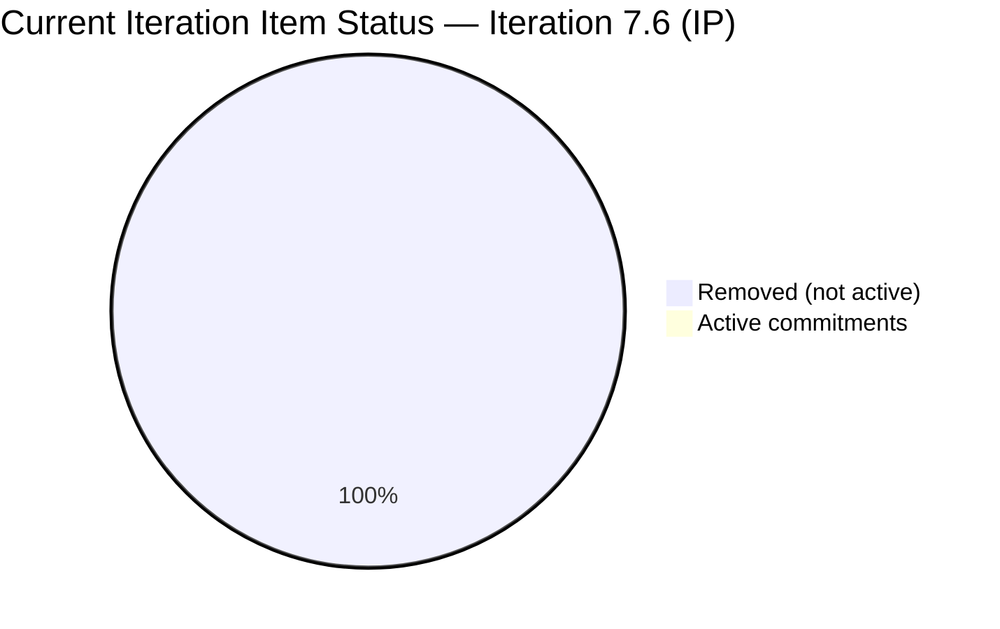
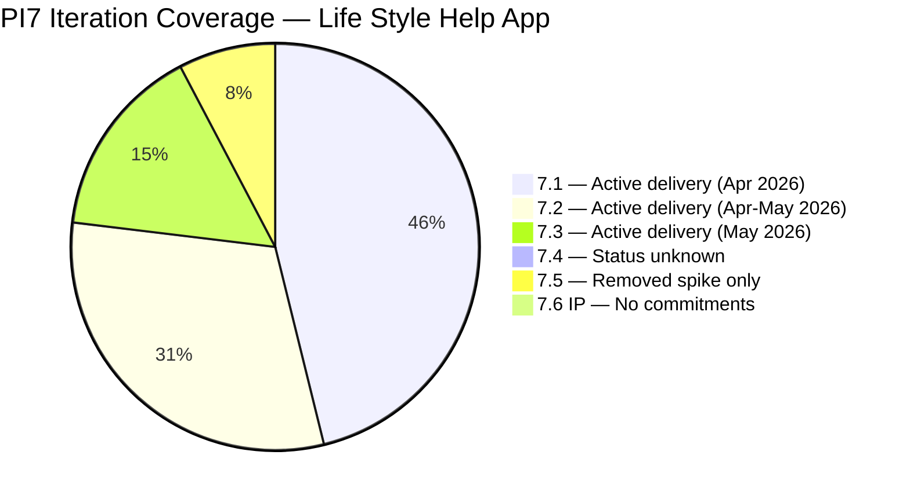
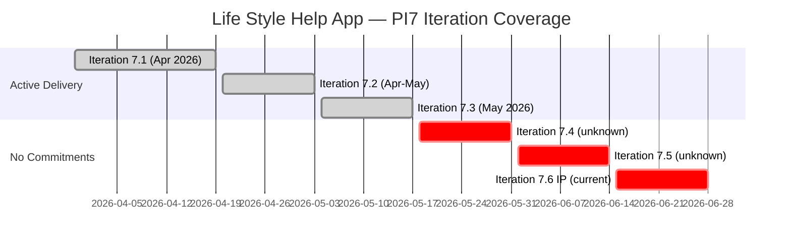
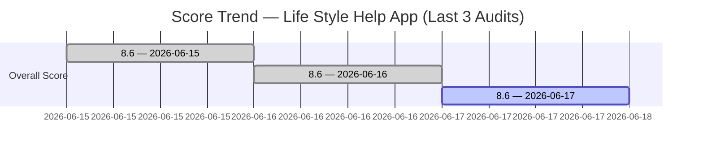

# SAFe Iteration Audit — Life Style Help App Team

## 1. Audit Metadata

| Field | Value |
|-------|-------|
| **Project** | Life Style Help App |
| **Team** | Life Style Help App Team |
| **Workspace** | `ado_ls_dev` |
| **Iteration** | Iteration 7.6 (IP) — Innovation & Planning |
| **Iteration Dates** | 2026-06-15 to 2026-06-28 |
| **Audit Date** | 2026-06-17 (PHT, UTC+8) |
| **Prior Audit Reference** | `AUDIT_20260616_0213.md` — Score 8.6 / Critical |
| **Overall Score** | **8.6 / 100** |
| **Risk Band** | CRITICAL (Red) |

> **Portfolio Note:** Per the portfolio CLAUDE.md, workspace `ado_ls_dev` is excluded from portfolio-level health dashboards by owner request (2026-05-21). Individual audits continue as scheduled.

---

## 2. Executive Summary

The Life Style Help App Team remains at **8.6 (Critical)** — unchanged for the third consecutive day. No items have been committed to Iteration 7.6 (IP). The team's scoped backlog API returns zero items, and ADO confirms no team capacity has been configured for this sprint. The only item associated with Iteration 7.6 (IP) is Spike 202789 in **Removed** state — which does not constitute active commitment.

Today's audit confirms the finding from yesterday: the team was actively delivering through PI7 Iterations 7.1–7.3 (April–May 2026), with Samantha Babael as the primary contributor. The current gap is not structural dormancy — it is a **sprint planning failure** in which the team has not scoped any work for the IP iteration. The corrected narrative from June 16's audit stands.

The score can only improve through one action: committing active items to Iteration 7.6 (IP). Until that occurs, six of seven dimensions score zero by formula.

---

## 3. Previous Audit Delta

| Dimension | Prior (2026-06-16) | Current (2026-06-17) | Delta | Note |
|-----------|---------------------|----------------------|-------|------|
| Iteration Planning | 0.0 | 0.0 | 0.0 | No items in current iteration |
| Team Capacity | 0.0 | 0.0 | 0.0 | No capacity configured |
| Estimation | 0.0 | 0.0 | 0.0 | No items to estimate |
| DoR Compliance | 0.0 | 0.0 | 0.0 | No items to evaluate |
| Work Item Balance | 60.0 | 60.0 | 0.0 | Formula artifact at 0-item state |
| Backlog Refinement | 0.0 | 0.0 | 0.0 | Scoped backlog empty |
| Delivery Predictability | 0.0 | 0.0 | 0.0 | No committed SP |
| **Overall** | **8.6** | **8.6** | **0.0** | No change — no new work committed |

**Status:** No ADO changes observed since yesterday's audit. The team has not acted on any of the Day 2 recommendations (commit IP items, configure capacity, define iteration goal).

---

## 4. Current Iteration Snapshot

| Field | Value |
|-------|-------|
| **Iteration** | 7.6 (IP) — Innovation & Planning |
| **Start Date** | 2026-06-15 |
| **End Date** | 2026-06-28 |
| **Day in Sprint** | Day 3 of 14 |
| **Root Items in Iteration 7.6 (IP)** | 0 active (1 Removed spike — not counted) |
| **Story Points Committed** | 0 SP |
| **Story Points Closed** | 0 SP |
| **Team Capacity** | Not configured (API: "No team capacity assigned") |
| **Iteration Goal** | Not defined |
| **Visible Root Backlog Items** | 0 (team-scoped backlog API returns empty) |
| **Active Contributors** | None assigned to current iteration |

### PI7 Activity Context (Prior Sprints for Reference)

| Iteration | Work Completed | Key Contributors | Status |
|-----------|----------------|-----------------|--------|
| 7.1 (Apr 2026) | 6 items — User Stories, Defects, Spikes | Samantha Babael, Ike Yana, Luzmibel | All Closed |
| 7.2 (Apr–May 2026) | 4+ items — Spikes, Tasks | Samantha, Luzmibel | All Closed |
| 7.3 (May 2026) | 2+ items — Defects | Samantha Babael | All Closed |
| 7.4 (unknown) | Not audited | Unknown | Unknown |
| 7.5 (unknown) | 1 item (Spike 201334, Removed) | — | Removed |
| **7.6 (IP) — Current** | **0 active items** | **None** | **No commitment** |

---

## 5. Work Item Analysis

### 5.1 Current Iteration Item

| ID | Title | Type | State | SP | Assignee | DoR | Changed |
|----|-------|------|-------|----|----------|-----|---------|
| 202789 | Lifestyle App - Customer CSAT Survey | Spike | **Removed** | — | Carol Cuison | — | 2026-05-13 |

> Item 202789 is excluded from all scoring. Removed state = de-committed and cancelled. Does not represent active sprint work.

### 5.2 Scoped Backlog

The `wit_list_backlog_work_items` API for the Life Style Help App team (project `0f447778`, team `a2a805bc`) returns an empty list. This is consistent with all prior audits for this workspace. The PI7 7.1–7.3 items are in completed iteration paths and no longer appear in the active team backlog view.

There are no items queued for PI8 or any future sprint in the team's visible backlog.

---

## 6. SAFe Compliance Scorecard

| # | Dimension | Score | Evidence | Notes |
|---|-----------|-------|----------|-------|
| 1 | Iteration Planning | **0.0** | visible_root_backlog=0; current_iter_root=0 | No active items in 7.6 IP |
| 2 | Team Capacity | **0.0** | contributors_with_current_work=0; no capacity configured | ADO: "No team capacity assigned" |
| 3 | Estimation | **0.0** | point_eligible_current=0 | Nothing to estimate |
| 4 | DoR Compliance | **0.0** | current_iter_root=0 → formula=0 | No items to evaluate |
| 5 | Work Item Balance | **60.0** | 0 items → no User Stories (-40); no dominant type or spike penalties | Formula artifact: max(0, 100-40) = 60 |
| 6 | Backlog Refinement | **0.0** | visible_root_backlog=0 → formula=0 | Scoped backlog empty |
| 7 | Delivery Predictability | **0.0** | committed_SP=0 → formula=0 | No commitments |
| | **Overall** | **8.6** | (0+0+0+0+60+0+0)/7 = 8.57 | Critical Risk |

---

## 7. Dimension Findings

### 7.1 Iteration Planning (0.0)
No items committed to Iteration 7.6 (IP). The team's PI7 active work ended in Iteration 7.3 (May 2026). Iterations 7.4 and 7.5 had minimal or zero commitments (only a removed Spike in 7.5). The IP iteration is now in Day 3 with no planned work — this is a sprint planning failure. IP iterations require at minimum retrospective and planning activities to be scoped as sprint items.

### 7.2 Team Capacity (0.0)
ADO confirms "No team capacity assigned" for Iteration 7.6 (IP). No individual team member has been allocated time to this sprint. The PI7 team included Samantha Babael (primary), Luzmibel Paculanang (QA), Ike Yana (dev), Carol Cuison (CSAT spike owner). None have been assigned capacity for the current sprint.

### 7.3 Estimation (0.0)
No items in current iteration — nothing to estimate. Historical estimation quality in PI7 was good: 1–2 SP per item, appropriate for the small, well-scoped stories delivered.

### 7.4 DoR Compliance (0.0)
No items in current iteration — nothing to evaluate. Historical DoR quality in PI7 was strong: User Stories 195735 and 201174 had user-voice narratives with clear AC; defects had detailed descriptions.

### 7.5 Work Item Balance (60.0)
With zero items in the current iteration, the formula applies only the "no User Stories" penalty (-40). No dominant type or spike share penalties apply because there are no items. Score = max(0, 100-40) = 60. This is a mathematical artifact of the rubric, not a meaningful quality signal.

### 7.6 Backlog Refinement (0.0)
The team-scoped backlog returns zero visible root items. With `visible_root_backlog_items = 0`, the formula defaults to 0 (denominator is zero). The completed PI7 items are in closed iteration paths and not visible to this query. The team's backlog needs to be populated with new items for the upcoming PI8 to re-engage.

### 7.7 Delivery Predictability (0.0)
Zero committed story points = zero delivery possible. Historical delivery rate in PI7 was 100% (all committed items closed). The team has proven delivery capability — the constraint is planning engagement, not team performance.

---

## 8. Risks and Bottlenecks

| Risk | Severity | Status |
|------|----------|--------|
| No items committed to Iteration 7.6 (IP) — Day 3 of 14 with no planned work | Critical | Active — no change from Day 2 |
| No team capacity configured for 7.6 IP | Critical | Active — no change from Day 2 |
| No iteration goal defined | High | Active |
| Iterations 7.4 and 7.5 status unknown — potential carry-over debt | High | Evidence gap |
| No backlog items ready for PI8 visible in ADO | High | Latent risk |
| Carol Cuison's removed CSAT spike (202789) not replaced | Moderate | Unresolved |
| Ike Yana's status on team unclear — contributed in 7.1, absent since | Moderate | Evidence gap |
| Day 3 with no action on Day 1–2 recommendations | High | Escalation trigger |

---

## 9. Prioritized Recommendations

**This workspace is in Critical risk for the third consecutive day. Escalation is warranted.**

1. **[Immediate — Today]** Commit at least 2–3 IP-appropriate items to Iteration 7.6 (IP) in ADO. Create new items or move existing items from prior iterations. Suitable IP sprint work:
   - Retrospective document for PI7 (Spike, 2 SP)
   - Backlog refinement/grooming session for Sprint 8.1 (Spike, 1 SP)
   - CSAT Survey replacement for client Hege (User Story, 2 SP — replacing removed 202789)
   - PI8 planning document (Spike, 1 SP)

2. **[Immediate — Today]** Configure team capacity for Iteration 7.6 (IP) in ADO. Assign Samantha Babael at minimum (6 pts/day or equivalent). Without capacity configured, ADO sprint planning is blind.

3. **[Today]** Define an Iteration Goal for 7.6 (IP) in ADO iteration settings. Suggested: "Complete PI7 retrospective, refine backlog for Sprint 8.1, and address outstanding client CSAT survey."

4. **[This Sprint]** Query and document the status of Iterations 7.4 and 7.5. If items were committed and closed, update CLAUDE.md accordingly. If items were skipped without work, that is a formal SAFe process gap that should be acknowledged in the retrospective.

5. **[Before Sprint 8.1]** Create and refine backlog items for the next development sprint. Based on PI7 history, Sprint 8.1 candidates include: deferred items from 7.4/7.5 (if any), new client feature requests, subscription edge cases, and UX improvements identified in the PI7 retrospective.

6. **[Strategic]** Confirm team membership for PI8. PI7 active contributors were Samantha Babael, Luzmibel Paculanang, Ike Yana, and Carol Cuison. Clarify whether all remain on the team for PI8, and update ADO team capacity settings accordingly.

7. **[Escalation]** If no action is taken by Day 5 (2026-06-19), escalate to the Project Owner (Ramon Aseniero). Three days of IP iteration with zero commitments and zero capacity represents a SAFe process breakdown that requires PM intervention.

---

## 10. Evidence Gaps and Limitations

| Gap | Impact |
|-----|--------|
| `wit_list_backlog_work_items` returns empty for Life Style Help App team scope | Backlog Refinement = 0; Iteration Planning denominator = 0. Team's active backlog is confirmed empty. |
| PI7 Iterations 7.4 and 7.5 not queried in this audit | Unknown whether the team committed items to those sprints. If work was done, it should be documented. |
| `work_get_team_capacity` returned "No team capacity assigned" | Confirmed zero capacity — not an API error. |
| Ike Yana (ike.yana contributor in PI7 7.1) has no recent ADO activity visible | May have left the project. Cannot confirm without HR or team roster access. |
| Carol Cuison's CSAT spike (202789) was removed 2026-05-13 — no follow-up visible | Client survey may be outstanding. Manual check recommended. |

---

## Appendix: Mermaid Diagrams

