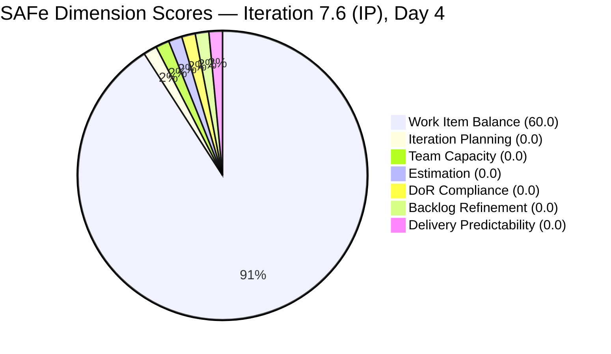
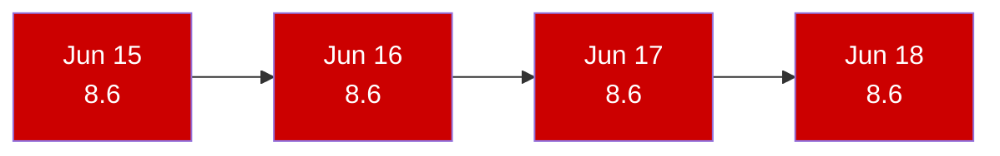
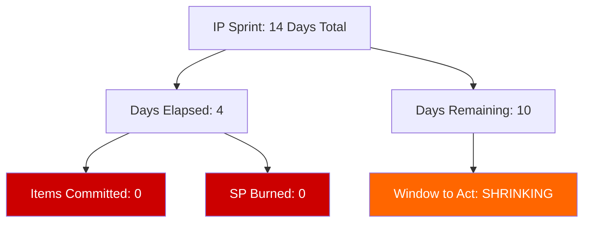

# SAFe Iteration Audit — Life Style Help App Team

## 1. Audit Metadata

| Field | Value |
|-------|-------|
| **Project** | Life Style Help App |
| **Project ID** | `0f447778-7156-4451-ab21-27be3c4a5888` |
| **Team** | Life Style Help App Team |
| **Team ID** | `a2a805bc-0b30-4ef3-9a8a-b7f3081157a6` |
| **Workspace** | `ado_ls_dev` |
| **Iteration** | Iteration 7.6 (IP) — Innovation & Planning |
| **Iteration ID** | `bf91cf5e-4235-4734-a9aa-9e8d21d02476` |
| **Iteration Dates** | 2026-06-15 to 2026-06-28 |
| **Audit Date** | 2026-06-18 (Day 4 of 14) |
| **Prior Audit Reference** | `AUDIT_20260617_0205.md` — Score 8.6 / Critical |
| **Overall Score** | **8.6 / 100** |
| **Risk Band** | CRITICAL (Red) |

> **Portfolio Note:** Per the portfolio CLAUDE.md, workspace `ado_ls_dev` is excluded from portfolio-level health dashboards by owner request (2026-05-21). Individual audits continue as scheduled.

---

## 2. Executive Summary

The Life Style Help App Team remains at **8.6 (Critical)** for the fourth consecutive day. The team-scoped Stories and Deliverables backlog API returns zero items. ADO confirms no team capacity has been configured for Iteration 7.6 (IP). No items have been committed to the current sprint.

This is now Day 4 of a 14-day IP iteration with zero sprint planning activity recorded in ADO. The team delivered meaningfully in PI7 iterations 7.1–7.3 (April–May 2026) — the current gap is an **active sprint planning failure**, not team dormancy or project shutdown.

The score of 8.6 derives entirely from the Work Item Balance formula's behavior when current_iteration items = 0: since there are no User Story items in the sprint (-40 penalty), but no other type dominates and no Spike excess exists, the formula yields 60.0 for that one dimension. Divided across 7 dimensions, this gives 8.6.

The score cannot improve until at least one item is committed to Iteration 7.6 (IP).

---

## 3. Previous Audit Delta

| Dimension | Prior (2026-06-17) | Current (2026-06-18) | Delta | Note |
|-----------|---------------------|----------------------|-------|------|
| Iteration Planning | 0.0 | 0.0 | 0.0 | visible_root = 0; formula → 0 |
| Team Capacity | 0.0 | 0.0 | 0.0 | No capacity configured; no contributors with work |
| Estimation | 0.0 | 0.0 | 0.0 | No point-eligible items in sprint |
| DoR Compliance | 0.0 | 0.0 | 0.0 | No current iteration items to evaluate |
| Work Item Balance | 60.0 | 60.0 | 0.0 | No User Story items → -40; no other penalties apply |
| Backlog Refinement | 0.0 | 0.0 | 0.0 | visible_root = 0; base = 0 |
| Delivery Predictability | 0.0 | 0.0 | 0.0 | No committed SP |
| **Overall** | **8.6** | **8.6** | **0.0** | No change — no ADO activity detected |

**Status:** No ADO changes observed since the June 17 audit. The team has not acted on Day 2 or Day 3 recommendations. Day 4 is now complete with no progress.

---

## 4. Current Iteration Snapshot

| Field | Value |
|-------|-------|
| **Iteration** | 7.6 (IP) — Innovation & Planning |
| **Start Date** | 2026-06-15 |
| **End Date** | 2026-06-28 |
| **Day in Sprint** | Day 4 of 14 |
| **Visible Root Backlog Items** | 0 (team-scoped backlog API returns empty) |
| **Root Items in Iteration 7.6 (IP)** | 0 active |
| **Story Points Committed** | 0 SP |
| **Story Points Closed** | 0 SP |
| **Team Capacity** | Not configured (API: "No team capacity assigned to the team") |
| **Iteration Goal** | Not defined |
| **Active Contributors** | None assigned to current iteration |

### PI7 Historical Activity (for context)

| Iteration | Period | Items Completed | Key Contributors |
|-----------|--------|-----------------|-----------------|
| 7.1 | Apr 2026 | 6 items (US, Defects, Spikes) | Samantha Babael, Ike Yana, Luzmibel |
| 7.2 | Apr–May 2026 | 4+ items (Spikes, Tasks) | Samantha, Luzmibel |
| 7.3 | May 2026 | 2+ items (Defects) | Samantha Babael |
| 7.4–7.5 | May–Jun 2026 | Limited/removed items | Unclear |
| **7.6 (IP)** | **Jun 15–28, 2026** | **0 active items** | **None** |

The team's last known delivery activity was in Iteration 7.3 (May 2026). There are 10 days remaining in the IP iteration.

---

## 5. Work Item Analysis

### 5.1 Current Iteration

The team-scoped `Microsoft.RequirementCategory` backlog returns zero items. The ADO API is queried against the full Stories and Deliverables category for Life Style Help App Team (`a2a805bc-0b30-4ef3-9a8a-b7f3081157a6`) in project `0f447778-7156-4451-ab21-27be3c4a5888`. The response is confirmed empty — this is not an API error.

### 5.2 Known Previous Items (from prior audit history)

Prior audits documented active items in the team's backlog through PI7 iterations 7.1–7.3. Those items were completed or closed. The current backlog has been fully depleted without new items being added for the IP sprint.

**Primary contributor known from prior audits:** Samantha Babael (`sbabael@jairosoft.com`) — was the primary delivery driver through PI7. Her current sprint assignment status is unknown.

---

## 6. SAFe Compliance Scorecard

| Dimension | Score | Evidence | Notes |
|-----------|-------|----------|-------|
| Iteration Planning | **0.0** | visible_root = 0; formula: if visible=0 → 0 | No items in backlog scope |
| Team Capacity | **0.0** | contributors_with_current_work = 0 → 0 | API: "No team capacity assigned" |
| Estimation | **0.0** | point_eligible = 0 → 0 | No items to estimate |
| DoR Compliance | **0.0** | current_iteration = 0 → 0 | No items to evaluate |
| Work Item Balance | **60.0** | Start 100, -40 (no User Story items) | No dominant type; no spike excess |
| Backlog Refinement | **0.0** | visible = 0; base = 0/0 → 0 | Empty backlog |
| Delivery Predictability | **0.0** | committed = 0 → 0 | No SP to measure |
| **Overall** | **8.6** | (0+0+0+0+60+0+0)/7 = 8.57 → 8.6 | Critical Risk (Red) |

---

## 7. Dimension Findings

### 7.1 Iteration Planning — 0.0 (Critical)
The formula requires visible_root_backlog_items > 0 to produce any score. The team's scoped backlog is empty — there are no root-level items visible in the Stories and Deliverables backlog for the Life Style Help App Team. Until items are added to the backlog and committed to an iteration, this score remains 0.

### 7.2 Team Capacity — 0.0 (Critical)
No contributors have work assigned in the current iteration. The capacity API returns no configuration. This means the team has not performed any sprint planning activity in ADO for Iteration 7.6 (IP), including allocation of available hours or assignment of team members to activities.

### 7.3 Estimation — 0.0 (Critical)
Zero point-eligible items exist in the current iteration. The formula returns 0 when point_eligible = 0. This dimension will recover immediately once items are committed.

### 7.4 DoR Compliance — 0.0 (Critical)
Zero items to evaluate. DoR cannot be assessed when the sprint is empty. Historical context: in prior sprints (PI7 7.1–7.3), the team carried DoR deficiencies — items lacking acceptance criteria and description were a recurring finding. Any new items committed to the IP sprint should be vetted for DoR before commitment.

### 7.5 Work Item Balance — 60.0 (Formula Artifact)
The formula applies the -40 penalty for absence of User Story items. With zero items committed, User Stories are absent by definition. The 60.0 score is a mathematical artifact of the formula's behavior on empty state, not an indication of health. No additional penalties apply (no dominant type among zero items; no spike excess).

### 7.6 Backlog Refinement — 0.0 (Critical)
The visible_root_backlog_items = 0, making the base calculation 0/0. The formula yields 0. No refinement activity can be measured on an empty backlog.

### 7.7 Delivery Predictability — 0.0 (Critical)
Committed story points = 0, so the formula returns 0. This is distinct from the early-sprint annotation used for teams that have committed SP but not yet closed any — here there is simply nothing to measure.

---

## 8. Risks and Bottlenecks

| Risk | Severity | Status |
|------|----------|--------|
| Zero items committed to IP sprint (Day 4 of 14) | Critical | Unresolved — 4th consecutive day |
| No team capacity configured | Critical | Unresolved |
| No iteration goal defined | Critical | Unresolved |
| Delivery gap since Iteration 7.3 (May 2026) | High | Pattern of inactivity growing |
| 10 days remaining — PI8 planning window closing | High | IP is planning sprint — no plans recorded |
| Samantha Babael status unknown — sole prior contributor | High | No current sprint assignment |
| Risk of PI8 start without any PI7 IP work captured | High | IP sprint purpose (planning, innovation) unfulfilled |

---

## 9. Prioritized Recommendations

**The following recommendations have been issued on Days 1, 2, and 3. They remain unacted upon. Escalation to the Product Owner (Ramon Aseniero) is recommended.**

1. **[URGENT — Day 4] Commit items to Iteration 7.6 (IP)** — Add at minimum 3–5 User Stories or Spikes to the current sprint backlog. Even a minimal sprint scope (e.g., technical spike on LifeStyleHelpApp.com next-release scope, backlog grooming items, or innovation experiments) satisfies the planning intent of an IP sprint and prevents a 5th consecutive zero-commitment day.

2. **[URGENT — Day 4] Configure team capacity** — Navigate to Iteration 7.6 (IP) capacity settings for Life Style Help App Team and assign capacity to active contributors. At minimum, configure Samantha Babael's capacity if she is the primary contributor.

3. **[URGENT — Day 4] Define an iteration goal** — Write a one-sentence IP sprint goal. This has been missing for every Iteration 7.x sprint. Example: "Evaluate next feature candidates for LifeStyleHelpApp.com and define PI8 sprint scope."

4. **[THIS WEEK] Conduct PI8 planning prep** — The IP sprint purpose is innovation and planning for the next PI. Even if the team skips active development, capturing PI8 scope, writing User Stories, and grooming the backlog would unlock Iteration Planning, Estimation, and DoR scoring immediately.

5. **[STRATEGIC] Assess project viability** — Four consecutive days of zero sprint commitment following completion of PI7 7.1–7.3 work raises a question about project health. If LifeStyleHelpApp.com is deprioritized, the appropriate SAFe action is to formally park the team (remove from active PI planning) rather than leave the ADO board in empty-sprint state. This should be a deliberate decision by the Product Owner.

---

## 10. Evidence Gaps and Limitations

- **No work item IDs available** — The backlog API returns empty. There are no work items to examine for DoR, SP, state, or type.
- **Samantha Babael status** — Prior audits identified Samantha as the primary contributor. Whether she is available, reassigned, or on leave cannot be determined from ADO data alone.
- **Historical items may exist in non-current iterations** — Items closed in 7.1–7.3 would not appear in the team-scoped backlog API (which shows active/in-progress root items). The empty result is consistent with full prior sprint closure.
- **Portfolio exclusion** — This team is excluded from portfolio-level dashboards per owner request (2026-05-21), so this finding is not reflected in portfolio health metrics. Individual audit continues per schedule.
- **ADO capacity query confirms "No team capacity assigned"** — This is a hard API response, not an inference. The team has definitively not configured sprint capacity.

---

## Visualization

### Score Breakdown — Iteration 7.6 (IP), Day 4

### Score Trend (Days 1–4, IP Sprint)

### Days Remaining in Sprint vs. Delivery Status

