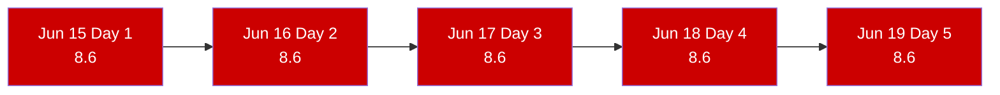
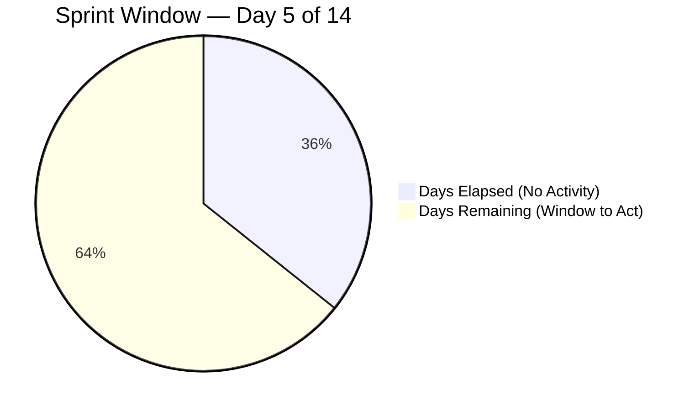
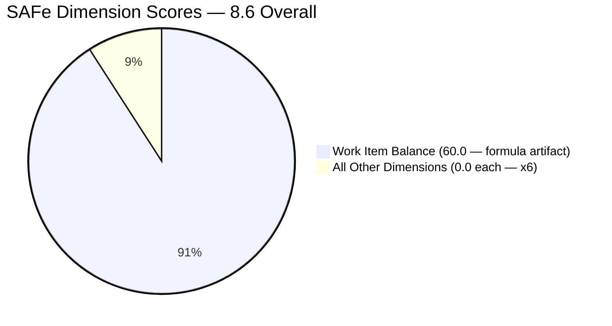

# SAFe Iteration Audit — Life Style Help App Team

## 1. Audit Metadata

| Field | Value |
|-------|-------|
| **Project** | Life Style Help App |
| **Project ID** | `0f447778-7156-4451-ab21-27be3c4a5888` |
| **Team** | Life Style Help App Team |
| **Team ID** | `a2a805bc-0b30-4ef3-9a8a-b7f3081157a6` |
| **Workspace** | `ado_ls_dev` |
| **Iteration** | Iteration 7.6 (IP) — Innovation & Planning |
| **Iteration ID** | `bf91cf5e-4235-4734-a9aa-9e8d21d02476` |
| **Iteration Dates** | 2026-06-15 to 2026-06-28 |
| **Audit Date** | 2026-06-19 (Day 5 of 14) |
| **Prior Audit Reference** | `AUDIT_20260618_0204.md` — Score 8.6 / Critical |
| **Overall Score** | **8.6 / 100** |
| **Risk Band** | CRITICAL (Red) |

> **Portfolio Note:** Per the portfolio CLAUDE.md, workspace `ado_ls_dev` is excluded from portfolio-level health dashboards by owner request (2026-05-21). Individual audits continue as scheduled.

---

## 2. Executive Summary

The Life Style Help App Team remains at **8.6 (Critical)** for the fifth consecutive day of Iteration 7.6 (IP). The team-scoped Stories and Deliverables backlog API returns zero items for the fifth day running. No team capacity has been configured. No items have been committed to the current sprint. No ADO activity has been detected since the start of this iteration on June 15.

This is now Day 5 of a 14-day IP iteration — the halfway point of the first week — with zero sprint planning activity in ADO. Nine days remain. The window to deliver any meaningful Innovation & Planning output is shrinking. If the team does not commit items by Day 7, the IP sprint will effectively be lost, and PI8 will begin without captured planning or innovation output for this team.

The score of 8.6 is a stable mathematical artifact of the formula when all inputs are zero except Work Item Balance (-40 penalty for absence of User Stories yields 60.0 in that one dimension; average of 7 dimensions = 8.6). The score cannot improve without at least one item committed to the sprint.

---

## 3. Previous Audit Delta

| Dimension | Prior (2026-06-18) | Current (2026-06-19) | Delta | Note |
|-----------|---------------------|----------------------|-------|------|
| Iteration Planning | 0.0 | 0.0 | 0.0 | visible_root = 0 |
| Team Capacity | 0.0 | 0.0 | 0.0 | No capacity configured |
| Estimation | 0.0 | 0.0 | 0.0 | No items to estimate |
| DoR Compliance | 0.0 | 0.0 | 0.0 | No items to evaluate |
| Work Item Balance | 60.0 | 60.0 | 0.0 | Formula artifact — -40 for no User Stories |
| Backlog Refinement | 0.0 | 0.0 | 0.0 | visible = 0; base = 0 |
| Delivery Predictability | 0.0 | 0.0 | 0.0 | No committed SP |
| **Overall** | **8.6** | **8.6** | **0.0** | Fifth consecutive day at 8.6 — no ADO activity |

**Status:** No ADO changes detected between June 18 and June 19. Recommendations from Days 1–4 remain entirely unacted upon. This is the fifth daily Critical audit for this team on this iteration.

---

## 4. Current Iteration Snapshot

| Field | Value |
|-------|-------|
| **Iteration** | 7.6 (IP) — Innovation & Planning |
| **Start Date** | 2026-06-15 |
| **End Date** | 2026-06-28 |
| **Day in Sprint** | Day 5 of 14 |
| **Visible Root Backlog Items** | 0 (team-scoped backlog API returns empty) |
| **Root Items in Iteration 7.6 (IP)** | 0 |
| **Story Points Committed** | 0 SP |
| **Story Points Closed** | 0 SP |
| **Team Capacity** | Not configured (API confirmed: "No team capacity assigned") |
| **Iteration Goal** | Not defined |
| **Active Contributors** | None assigned to current iteration |
| **Days Remaining** | 9 |
| **IP Sprint Purpose** | Innovation, planning, and PI8 backlog preparation — not captured in ADO |

### Historical Activity (for context)

| Iteration | Period | Known Delivery |
|-----------|--------|----------------|
| 7.1 | Apr 2026 | 6 items delivered |
| 7.2 | Apr–May 2026 | 4+ items delivered |
| 7.3 | May 2026 | 2+ items (Defects) |
| 7.4–7.5 | May–Jun 2026 | Minimal/removed items |
| **7.6 (IP)** | **Jun 15–28, 2026** | **0 items committed (Day 5)** |

---

## 5. Work Item Analysis

### 5.1 Current Iteration — Empty

The team-scoped `Microsoft.RequirementCategory` backlog returns zero items. This is an API-confirmed empty result (not an error or authentication gap). The Life Style Help App Team has no root-level stories or deliverables visible in their ADO board for any iteration.

### 5.2 Known Prior Activity (from audit history)

Prior audits through Iteration 7.3 documented active items involving:
- **Samantha Babael** (`sbabael@jairosoft.com`) — primary delivery contributor in PI7 7.1–7.3
- Defect-type and Spike-type items were the last known committed work items
- All prior PI7 items appear to have been closed; the backlog is fully depleted

The current sprint is not in progress. The team appears to have concluded its prior sprint commitments and entered the IP sprint without initiating new planning.

---

## 6. SAFe Compliance Scorecard

| Dimension | Score | Evidence | Notes |
|-----------|-------|----------|-------|
| Iteration Planning | **0.0** | visible_root = 0; formula: if visible = 0 → 0 | API confirms empty backlog |
| Team Capacity | **0.0** | contributors_with_current_work = 0 → 0 | API: "No team capacity assigned" |
| Estimation | **0.0** | point_eligible = 0 → 0 | No items to estimate |
| DoR Compliance | **0.0** | current_iteration = 0 → 0 | No items to evaluate |
| Work Item Balance | **60.0** | Start 100, -40 (no User Story items) | Formula artifact; no other penalties |
| Backlog Refinement | **0.0** | visible = 0; base = 0/0 → 0 | Empty backlog |
| Delivery Predictability | **0.0** | committed_SP = 0 → 0 | No SP to measure |
| **Overall** | **8.6** | (0+0+0+0+60+0+0)/7 = 8.57 → 8.6 | Critical Risk (Red) |

---

## 7. Dimension Findings

### 7.1 Iteration Planning — 0.0 (Critical)
The formula returns 0 when `visible_root_backlog_items` = 0. The team has no active backlog items — no items in any state (New, Active, Ready) are visible in the team-scoped backlog. This condition has persisted across all 5 days of the current iteration. No items have been created or moved to the backlog since the PI7 completion.

### 7.2 Team Capacity — 0.0 (Critical)
No contributors have been assigned to the current iteration in ADO. The ADO capacity API returns no configuration data for the Life Style Help App Team in Iteration 7.6 (IP). This means no sprint planning has been initiated — not even the first step of configuring who is available to work.

### 7.3 Estimation — 0.0 (Critical)
No point-eligible items exist. Estimation will recover immediately once items are committed to the sprint. Historical context: the team had DoR and estimation gaps in prior sprints; new items should be vetted before commitment.

### 7.4 DoR Compliance — 0.0 (Critical)
No items to evaluate. DoR cannot be measured on an empty sprint. When items are committed, each should have a proper user-voice description (≥ 30 non-whitespace chars) and structured acceptance criteria (≥ 20 non-whitespace chars) before being moved to the iteration.

### 7.5 Work Item Balance — 60.0 (Formula Artifact)
The -40 penalty applies because no User Story items exist in the sprint. With zero items committed, User Stories are absent by definition. The 60.0 score is not indicative of team health — it is a formula boundary condition. No dominant-type or spike-excess penalties apply on a zero-item sprint.

### 7.6 Backlog Refinement — 0.0 (Critical)
The `visible_root_backlog_items` = 0 results in a base calculation of 0/0. The formula returns 0. No refinement activity can be measured. The IP sprint is specifically designed for backlog refinement and planning — this dimension should be the team's primary focus during IP weeks.

### 7.7 Delivery Predictability — 0.0 (Critical)
No committed story points exist. Unlike teams with committed-but-undelivered SP (where early-sprint annotation applies), this team has no denominator at all. There is simply nothing to predict or deliver.

---

## 8. Risks and Bottlenecks

| Risk | Severity | Status |
|------|----------|--------|
| Zero items committed to IP sprint — Day 5 of 14 | Critical | Unresolved — 5th consecutive day |
| No team capacity configured | Critical | Unresolved |
| No iteration goal | Critical | Unresolved |
| 9 days remaining — planning window closing | High | Approaching point of no return |
| Samantha Babael status unknown — sole historical contributor | High | No ADO signal |
| PI8 will begin without PI7 IP planning output captured | High | Systemic risk |
| Project viability question — LifeStyleHelpApp.com roadmap unclear | Moderate | Requires PO decision |

---

## 9. Prioritized Recommendations

> **These recommendations have been issued on Days 1–4. No action has been taken. Escalation to Product Owner (Ramon Aseniero) is recommended as of Day 5. If no items are committed by Day 7, the IP sprint will effectively be lost and PI8 will begin without planning capture.**

1. **[URGENT — Day 5] Commit at minimum 3 items to Iteration 7.6 (IP)** — The most direct path to score recovery is adding items to the sprint backlog. Even 3 User Stories or Spikes covering PI8 scope, technical discovery, or innovation experiments satisfies the IP sprint purpose. Minimum effort: navigate to the ADO board, create 3 items in the Stories and Deliverables backlog, and assign them to Iteration 7.6 (IP).

2. **[URGENT — Day 5] Configure team capacity** — Open Iteration 7.6 (IP) capacity settings for Life Style Help App Team and enter at minimum Samantha Babael's capacity. This single action restores Team Capacity score from 0 to a positive number.

3. **[URGENT — Day 5] Define iteration goal** — Write a one-sentence IP sprint goal. Example: "Define LifeStyleHelpApp.com PI8 scope and conduct technical discovery for the next release cycle." This has been absent for every PI7 iteration.

4. **[THIS WEEK — Days 6–7] Conduct PI8 planning session** — The IP sprint purpose is to plan and innovate. Even if development is paused, document: (a) what was learned in PI7, (b) what PI8 priorities are, (c) what technical spikes or research are needed. Write these as User Stories or Spikes and commit them to the sprint.

5. **[STRATEGIC] Make a formal project status decision** — Five consecutive days of zero ADO activity following PI7 delivery creates ambiguity. The SAFe-appropriate response is one of three options: (a) actively plan for PI8, (b) formally park the project in the PI7 IP sprint with a documented pause rationale, or (c) close out the project with a final retrospective and ADO board archival. Leaving the board in empty-sprint limbo is not a valid SAFe state.

---

## 10. Evidence Gaps and Limitations

- **No work item data** — The backlog API returns empty. All scoring is from formula boundary conditions, not live item evaluation.
- **Samantha Babael status** — The primary historical contributor has no ADO footprint in this iteration. Her availability, assignment status, or leave cannot be determined from ADO data.
- **ADO capacity API confirmation** — "No team capacity assigned to the team" is a hard API response, not an inference. Sprint planning has definitively not been initiated.
- **Portfolio exclusion** — This team is excluded from portfolio-level dashboards per owner request (2026-05-21). This Critical finding does not appear in portfolio health metrics. Individual audit continues per schedule.
- **Prior items** — Closed items from PI7 7.1–7.3 do not appear in the backlog API (correct behavior — closed items are excluded from active backlogs). The empty result accurately reflects the current sprint state.

---

## Visualization

### Score Trend — All 5 Days of IP Sprint

### Sprint Time Remaining vs. Delivery

### SAFe Score Breakdown — All Dimensions

