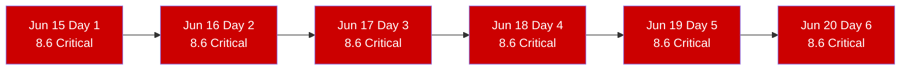
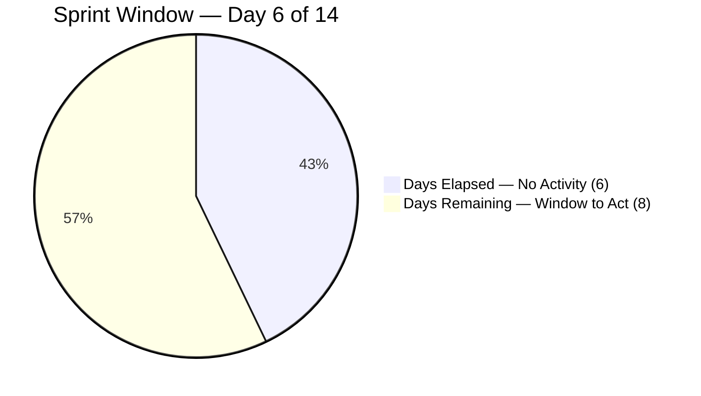
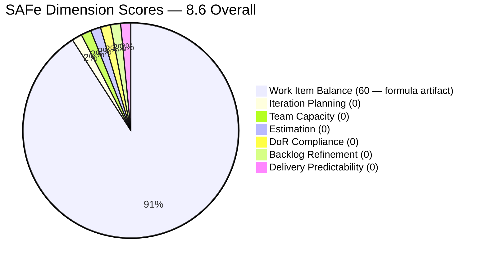

# SAFe Iteration Audit — Life Style Help App Team

## 1. Audit Metadata

| Field | Value |
|-------|-------|
| **Project** | Life Style Help App |
| **Project ID** | `0f447778-7156-4451-ab21-27be3c4a5888` |
| **Team** | Life Style Help App Team |
| **Team ID** | `a2a805bc-0b30-4ef3-9a8a-b7f3081157a6` |
| **Workspace** | `ado_ls_dev` |
| **Iteration** | Iteration 7.6 (IP) — Innovation & Planning |
| **Iteration ID** | `bf91cf5e-4235-4734-a9aa-9e8d21d02476` |
| **Iteration Dates** | 2026-06-15 to 2026-06-28 |
| **Audit Date** | 2026-06-20 (Day 6 of 14) — Philippine Standard Time (PST, UTC+8) |
| **Prior Audit Reference** | `AUDIT_20260619_0925.md` — Score 8.6 / Critical |
| **Overall Score** | **8.6 / 100** |
| **Risk Band** | CRITICAL (Red) |

> **Portfolio Note:** Per the portfolio `CLAUDE.md`, workspace `ado_ls_dev` is excluded from portfolio-level health dashboards and `portfolio-meeting-prep` by owner request (2026-05-21). Individual audits continue as scheduled.

---

## 2. Executive Summary

The Life Style Help App Team remains at **8.6 (Critical)** for the **sixth consecutive day** of Iteration 7.6 (IP). The team-scoped Stories and Deliverables backlog returns zero items. No team capacity has been configured. No items have been committed to the current sprint. No ADO activity has been detected at any point during this iteration.

**Day 6 of 14 means the first half of the IP sprint has elapsed with zero output captured in ADO.** Eight days remain. This is no longer an early-sprint or planning-lag situation — it is an active sprint failure in progress. The IP sprint specifically exists for innovation, planning, and PI8 backlog preparation. None of these activities are being tracked in ADO.

If no items are committed by **Day 7 (June 21)**, the IP sprint will be effectively unrecoverable for any meaningful SAFe audit score. The score of 8.6 is a mathematical artifact of the 7-dimension formula applied to a zero-item state and will not change until at least one item is committed.

---

## 3. Previous Audit Delta

| Dimension | Prior (2026-06-19) | Current (2026-06-20) | Delta | Note |
|-----------|---------------------|----------------------|-------|------|
| Iteration Planning | 0.0 | 0.0 | 0.0 | visible_root = 0 — sixth consecutive day |
| Team Capacity | 0.0 | 0.0 | 0.0 | No capacity configured — sixth consecutive day |
| Estimation | 0.0 | 0.0 | 0.0 | No items to estimate |
| DoR Compliance | 0.0 | 0.0 | 0.0 | No items to evaluate |
| Work Item Balance | 60.0 | 60.0 | 0.0 | Formula artifact — -40 for no User Stories |
| Backlog Refinement | 0.0 | 0.0 | 0.0 | visible = 0; base = 0/0 → 0 |
| Delivery Predictability | 0.0 | 0.0 | 0.0 | No committed SP |
| **Overall** | **8.6** | **8.6** | **0.0** | Sixth consecutive day at Critical — no ADO activity |

**Status:** No ADO changes detected between June 19 and June 20. All recommendations from Days 1–5 remain entirely unacted upon. This is the sixth consecutive Critical audit for this team on this iteration.

**Escalation note:** Five consecutive days of inaction (Days 1–5) have passed. Per SAFe norms, a team entering Day 6 of a 14-day IP sprint with zero backlog activity requires Product Owner escalation. The score and situation cannot improve without a direct PO decision and action.

---

## 4. Current Iteration Snapshot

| Field | Value |
|-------|-------|
| **Iteration** | 7.6 (IP) — Innovation & Planning |
| **Start Date** | 2026-06-15 |
| **End Date** | 2026-06-28 |
| **Day in Sprint** | Day 6 of 14 |
| **Days Remaining** | 8 |
| **Visible Root Backlog Items** | 0 (team-scoped backlog API — confirmed empty) |
| **Root Items in Iteration 7.6 (IP)** | 0 |
| **Story Points Committed** | 0 SP |
| **Story Points Closed** | 0 SP |
| **Team Capacity** | Not configured (API: "No team capacity assigned") |
| **Iteration Goal** | Not defined |
| **Active Contributors** | None assigned to current iteration |
| **IP Sprint Purpose** | Innovation, planning, PI8 backlog prep — none captured in ADO |

### Sprint Elapsed Context

| Day | Date | Items | SP Committed | SP Closed | Action |
|-----|------|-------|--------------|-----------|--------|
| 1 | Jun 15 | 0 | 0 | 0 | None |
| 2 | Jun 16 | 0 | 0 | 0 | None |
| 3 | Jun 17 | 0 | 0 | 0 | None |
| 4 | Jun 18 | 0 | 0 | 0 | None |
| 5 | Jun 19 | 0 | 0 | 0 | None |
| **6** | **Jun 20** | **0** | **0** | **0** | **None** |
| 7 | Jun 21 | — | — | — | **Point of no return** |
| 14 | Jun 28 | — | — | — | Sprint end |

---

## 5. Work Item Analysis

### 5.1 Current Iteration — Empty (Sixth Consecutive Day)

The team-scoped `Microsoft.RequirementCategory` backlog returns zero work items. This is an API-confirmed empty result, not an authentication or tooling error. The Life Style Help App Team has no root-level stories, deliverables, spikes, or defects visible in their ADO board.

### 5.2 Prior Activity Context (from audit history)

| Iteration | Period | Known Delivery |
|-----------|--------|----------------|
| PI7 7.1 | Apr 2026 | 6 items delivered |
| PI7 7.2 | Apr–May 2026 | 4+ items delivered |
| PI7 7.3 | May 2026 | 2+ items (Defects) |
| PI7 7.4–7.5 | May–Jun 2026 | Minimal or removed items |
| **PI7 7.6 (IP)** | **Jun 15–28** | **0 items (Day 1–6)** |

The team had active delivery through 7.1–7.3 (led by Samantha Babael). All prior PI7 items appear to have been closed; the backlog is fully depleted entering the IP sprint.

---

## 6. SAFe Compliance Scorecard

| Dimension | Score | Evidence | Notes |
|-----------|-------|----------|-------|
| Iteration Planning | **0.0** | visible_root = 0; if visible = 0 → 0 | API confirms empty backlog — sixth day |
| Team Capacity | **0.0** | contributors_with_current_work = 0 → 0 | API: "No team capacity assigned" |
| Estimation | **0.0** | point_eligible = 0 → 0 | No items to estimate |
| DoR Compliance | **0.0** | current_iteration = 0 → 0 | No items to evaluate |
| Work Item Balance | **60.0** | Start 100, -40 (no User Story items) | Formula boundary; not a health indicator |
| Backlog Refinement | **0.0** | visible = 0; 0/0 = 0 | Empty backlog |
| Delivery Predictability | **0.0** | committed_SP = 0 → 0 | No SP committed or delivered |
| **Overall** | **8.6** | (0+0+0+0+60+0+0)/7 = 8.57 → 8.6 | Critical Risk (Red) |

---

## 7. Dimension Findings

### 7.1 Iteration Planning — 0.0 (Critical)
Formula returns 0 when `visible_root_backlog_items` = 0. No items exist in any state. The condition has persisted for all 6 days of this iteration. No planning activity has been initiated in ADO.

### 7.2 Team Capacity — 0.0 (Critical)
No contributors have been assigned to this iteration in ADO capacity settings. The API returns "No team capacity assigned." Sprint capacity planning — the first step of SAFe iteration execution — has not been initiated.

### 7.3 Estimation — 0.0 (Critical)
No items to estimate. This dimension will recover immediately when items are committed to the sprint with story points.

### 7.4 DoR Compliance — 0.0 (Critical)
No items to evaluate. When items are committed, each should have a user-voice description (≥ 30 non-whitespace chars) and structured acceptance criteria (≥ 20 non-whitespace chars). Historical audits (PI7 7.1–7.3) showed DoR gaps on entry — items should be reviewed before commitment.

### 7.5 Work Item Balance — 60.0 (Formula Artifact)
The -40 penalty applies because no User Story items exist. This is a formula boundary condition, not a health indicator. The 60.0 score will be replaced by a meaningful score once items are committed.

### 7.6 Backlog Refinement — 0.0 (Critical)
`visible_root_backlog_items` = 0 → base = 0. The IP sprint is precisely the time for backlog refinement and PI8 preparation. This dimension should be the team's primary ADO focus during the remaining 8 days.

### 7.7 Delivery Predictability — 0.0 (Critical)
No committed story points. Unlike teams in early-sprint (Days 1–5), this team has no committed denominator at all. The formula returns 0 regardless of sprint day. There is nothing to predict.

---

## 8. Risks and Bottlenecks

| Risk | Severity | Status |
|------|----------|--------|
| Zero items committed — Day 6 of 14 | **Critical** | Unresolved — sixth consecutive day |
| No team capacity configured | **Critical** | Unresolved |
| No iteration goal | **Critical** | Unresolved |
| 8 days remaining — point of no return approaching (Day 7) | **High** | Immediate action required |
| Samantha Babael status unknown — sole historical contributor | High | No ADO signal for 6 days |
| PI8 will begin without PI7 IP planning output | High | Systemic risk if no action taken |
| Project strategic direction unclear — LifeStyleHelpApp.com | Moderate | PO decision required |

---

## 9. Prioritized Recommendations

> **Status notice:** These recommendations have been issued on Days 1–5 with no action taken. As of Day 6, **escalation to the Product Owner (Ramon Aseniero) is required**. Day 7 is the functional point of no return for meaningful sprint recovery.

1. **[URGENT — Day 6] PO escalation: Make a formal project decision** — Ramon (PO) must decide one of three paths by end of Day 6:
   - **(a) Active PI8 planning:** Commit at least 3 items to 7.6 (IP) today covering PI8 scope, technical discovery, or innovation experiments.
   - **(b) Formal pause:** Document the project pause with a rationale in ADO and commit 1 item (e.g., "PI7 IP Sprint Retrospective and Pause Documentation") as a record.
   - **(c) Project close:** Formally archive the ADO board with a retrospective item documenting lessons learned and next steps.
   
   None of these options is worse than the current state of silent inactivity. All three restore ADO hygiene and SAFe compliance.

2. **[URGENT — Day 6] Commit minimum 3 items to 7.6 (IP)** — Navigate to the ADO board, create 3 User Stories or Spikes in the Stories and Deliverables backlog, and assign them to Iteration 7.6 (IP). Even placeholder PI8 planning items qualify. This is the minimum action to make Day 7 auditable.

3. **[URGENT — Day 6] Configure team capacity** — Open Iteration 7.6 (IP) capacity settings and enter Samantha Babael's available days/capacity. This is a prerequisite for any delivery prediction.

4. **[TODAY] Define iteration goal** — Write one sentence capturing the IP sprint's purpose. Even a generic goal ("Plan PI8 roadmap for LifeStyleHelpApp.com and capture technical discovery gaps") satisfies the SAFe requirement and takes 30 seconds to enter.

5. **[THIS WEEK] Conduct a PI7 retrospective and PI8 planning session** — The IP sprint exists to process what was learned and plan what comes next. Even if development is paused, document: (a) what was accomplished in PI7 7.1–7.3, (b) what technical debt or UX gaps were identified, (c) what PI8 priorities are. Write these as Spikes or User Stories with a planning AC.

---

## 10. Evidence Gaps and Limitations

- **No work item data** — The backlog API returns empty. All scoring is derived from formula boundary conditions on zero inputs. The 60.0 Work Item Balance score is not a positive indicator — it is an artifact of the formula treating a missing category as a -40 penalty on a 100-point baseline.
- **Samantha Babael status** — The primary historical contributor has no ADO footprint for 6 consecutive days. Her availability, leave status, or assignment to other projects cannot be determined from ADO.
- **ADO capacity API** — "No team capacity assigned to the team" is a hard API response for the Life Style Help App Team in Iteration 7.6 (IP). Not an inference.
- **Portfolio exclusion** — This team is excluded from portfolio-level dashboards per owner request (2026-05-21). This Critical finding does not surface in portfolio health metrics. Individual audit continues per schedule.
- **Closed items from PI7** — All prior iteration items are closed and excluded from the active backlog (correct ADO behavior). The empty result accurately reflects the current live sprint state.

---

## Visualization

### Sprint Inactivity Timeline — Days 1–6 of 14

### Sprint Window Status — Day 6 of 14

### SAFe Score Breakdown

