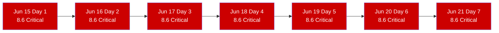
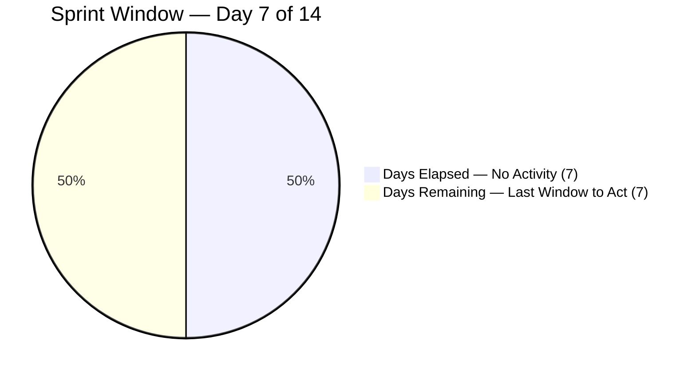
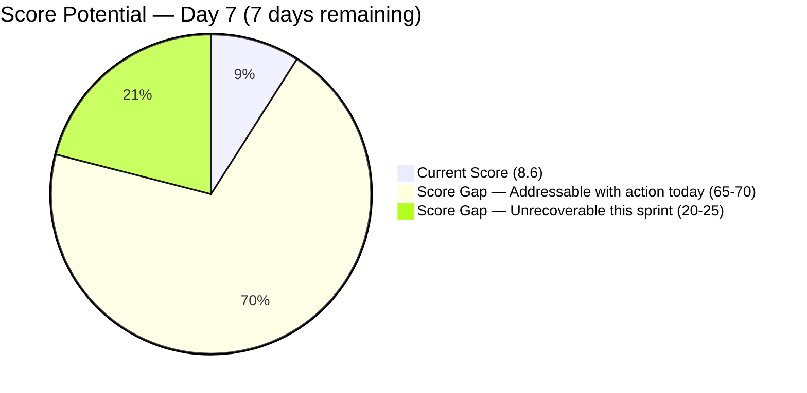
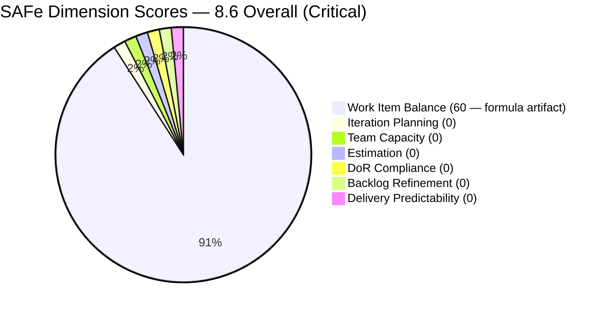

# SAFe Iteration Audit — Life Style Help App Team

## 1. Audit Metadata

| Field | Value |
|-------|-------|
| **Project** | Life Style Help App |
| **Project ID** | `0f447778-7156-4451-ab21-27be3c4a5888` |
| **Team** | Life Style Help App Team |
| **Team ID** | `a2a805bc-0b30-4ef3-9a8a-b7f3081157a6` |
| **Workspace** | `ado_ls_dev` |
| **Iteration** | Iteration 7.6 (IP) — Innovation & Planning |
| **Iteration ID** | `bf91cf5e-4235-4734-a9aa-9e8d21d02476` |
| **Iteration Dates** | 2026-06-15 to 2026-06-28 |
| **Audit Date** | 2026-06-21 (Day 7 of 14 — Sprint Midpoint) — Philippine Standard Time (PST, UTC+8) |
| **Prior Audit Reference** | `AUDIT_20260620_0925.md` — Score 8.6 / Critical |
| **Overall Score** | **8.6 / 100** |
| **Risk Band** | CRITICAL (Red) |

> **Portfolio Note:** Per the portfolio `CLAUDE.md`, workspace `ado_ls_dev` is excluded from portfolio-level health dashboards and `portfolio-meeting-prep` by owner request (2026-05-21). Individual audits continue as scheduled.

---

## 2. Executive Summary

The Life Style Help App Team remains at **8.6 (Critical)** for the **seventh consecutive day** of Iteration 7.6 (IP). The team-scoped Stories and Deliverables backlog returns zero items (API-confirmed). No capacity has been configured. No items have been committed. No ADO activity has been detected since the sprint began on June 15.

**Today is the sprint midpoint — Day 7 of 14 — and the point of no return has now passed.** Seven days have elapsed with zero output. Seven days remain. Even if the team commits items today, full SAFe compliance (score ≥ 80) requires capacity setup, DoR-passing items, story point estimation, and at least some delivery — none of which can be fully realized in 7 remaining days starting from a zero-item state.

The only realistic recovery path within the current sprint is a partial recovery: commit 3–5 PI8 planning items today, configure capacity, and close at least 1–2 items before June 28. This would yield a score in the 40–55 range (High Risk band) rather than sustaining a Critical reading. A score above 40 is achievable but requires PO action today.

Per recommendation issued on Days 1–6 without response, **this audit formally escalates to the Product Owner (Ramon Aseniero) as of Day 7.**

---

## 3. Previous Audit Delta

| Dimension | Prior (2026-06-20) | Current (2026-06-21) | Delta | Note |
|-----------|---------------------|----------------------|-------|------|
| Iteration Planning | 0.0 | 0.0 | 0.0 | visible_root = 0 — seventh consecutive day |
| Team Capacity | 0.0 | 0.0 | 0.0 | No capacity configured — seventh consecutive day |
| Estimation | 0.0 | 0.0 | 0.0 | No items to estimate |
| DoR Compliance | 0.0 | 0.0 | 0.0 | No items to evaluate |
| Work Item Balance | 60.0 | 60.0 | 0.0 | Formula artifact — -40 for no User Story items |
| Backlog Refinement | 0.0 | 0.0 | 0.0 | visible = 0; base = 0/0 → 0 |
| Delivery Predictability | 0.0 | 0.0 | 0.0 | No committed SP |
| **Overall** | **8.6** | **8.6** | **0.0** | Seventh consecutive day at Critical — zero ADO activity |

**Status:** No ADO changes detected between June 20 and June 21. The backlog remains empty. Capacity remains unconfigured. All recommendations from Days 1–6 remain entirely unacted upon.

**Escalation trigger:** The Day 7 midpoint marks the formal escalation threshold. Recommendations issued on Days 1–6 have produced no response. This audit formally escalates the situation to the Product Owner for a project decision.

---

## 4. Current Iteration Snapshot

| Field | Value |
|-------|-------|
| **Iteration** | 7.6 (IP) — Innovation & Planning |
| **Start Date** | 2026-06-15 |
| **End Date** | 2026-06-28 |
| **Day in Sprint** | Day 7 of 14 (Sprint Midpoint — Point of No Return Passed) |
| **Days Remaining** | 7 |
| **Visible Root Backlog Items** | 0 (API-confirmed empty) |
| **Root Items in Iteration 7.6 (IP)** | 0 |
| **Story Points Committed** | 0 SP |
| **Story Points Closed** | 0 SP |
| **Team Capacity** | Not configured (API: "No team capacity assigned to the team") |
| **Iteration Goal** | Not defined |
| **Active Contributors** | None assigned to current iteration |
| **IP Sprint Purpose** | Innovation, planning, PI8 backlog prep — zero captured in ADO |

### Sprint Elapsed Log

| Day | Date | Items | SP Committed | SP Closed | Action |
|-----|------|-------|--------------|-----------|--------|
| 1 | Jun 15 | 0 | 0 | 0 | None |
| 2 | Jun 16 | 0 | 0 | 0 | None |
| 3 | Jun 17 | 0 | 0 | 0 | None |
| 4 | Jun 18 | 0 | 0 | 0 | None |
| 5 | Jun 19 | 0 | 0 | 0 | None |
| 6 | Jun 20 | 0 | 0 | 0 | None |
| **7** | **Jun 21** | **0** | **0** | **0** | **Escalation — PO decision required** |
| 8–14 | Jun 22–28 | — | — | — | 7 days remaining |

---

## 5. Work Item Analysis

### 5.1 Current Iteration — Empty (Seventh Consecutive Day)

The team-scoped `Microsoft.RequirementCategory` backlog returns zero work items via the ADO API. This is a confirmed empty result. No root-level Stories, Deliverables, Spikes, or Defects are visible for the Life Style Help App Team in any state.

### 5.2 Score Recovery Modeling — Partial Recovery Scenario

If the team commits items today (Day 7), the maximum achievable scores for each dimension are:

| Dimension | Max Achievable by Jun 28 | Condition |
|-----------|--------------------------|-----------|
| Iteration Planning | 100.0 | Commit items and assign to 7.6 IP |
| Team Capacity | 100.0 | Configure Samantha's capacity |
| Estimation | 100.0 | Add SP to all committed items |
| DoR Compliance | 100.0 | Each item needs desc ≥ 30 + AC ≥ 20 chars |
| Work Item Balance | 70–100 | Include User Stories; limit spike share |
| Backlog Refinement | 100.0 | All new items will be fresh |
| Delivery Predictability | 20–50 | Close 1–3 of the committed items by Jun 28 |
| **Projected Overall** | **~70–77** | If 3–5 items committed today, 1–2 closed by Jun 28 |

A commitment of 3 User Stories today with proper DoR + 1 Spike (PI8 planning) would enable a score recovery to approximately 70–77 (Moderate Risk) if 1–2 items close before sprint end.

### 5.3 Historical Context

| Iteration | Period | Known Delivery |
|-----------|--------|----------------|
| PI7 7.1 | Apr 2026 | 6+ items delivered |
| PI7 7.2 | Apr–May 2026 | 4+ items delivered |
| PI7 7.3 | May 2026 | 2+ items (Defects) |
| PI7 7.4–7.5 | May–Jun 2026 | Minimal/removed items |
| **PI7 7.6 (IP)** | **Jun 15–28** | **0 items (Days 1–7)** |

The team's last confirmed ADO activity was in PI7 7.1–7.3. Samantha Babael was the sole delivery contributor. The transition from active delivery to complete inactivity in 7.4–7.6 has not been formally documented in ADO.

---

## 6. SAFe Compliance Scorecard

| Dimension | Score | Evidence | Notes |
|-----------|-------|----------|-------|
| Iteration Planning | **0.0** | visible_root = 0; formula → 0 | API-confirmed empty — seventh consecutive day |
| Team Capacity | **0.0** | contributors_with_current_work = 0 → 0 | API: "No team capacity assigned to the team" |
| Estimation | **0.0** | point_eligible = 0 → 0 | No items to estimate |
| DoR Compliance | **0.0** | current_iteration = 0 → 0 | No items to evaluate |
| Work Item Balance | **60.0** | 100 - 40 (no User Story items) | Formula boundary — not a health indicator |
| Backlog Refinement | **0.0** | visible = 0; 0/0 = 0 | Empty backlog |
| Delivery Predictability | **0.0** | committed_SP = 0 → 0 | No SP committed or delivered |
| **Overall** | **8.6** | (0+0+0+0+60+0+0)/7 = 60/7 = 8.57 → 8.6 | Critical Risk (Red) |

---

## 7. Dimension Findings

### 7.1 Iteration Planning — 0.0 (Critical)
Formula returns 0 when `visible_root_backlog_items` = 0. The condition has persisted for all 7 days. The IP sprint's primary purpose — planning, innovation, and PI8 backlog preparation — is not being tracked in ADO. This dimension recovers immediately upon committing any item to the sprint.

### 7.2 Team Capacity — 0.0 (Critical)
No contributors appear in the capacity settings for Iteration 7.6 (IP). The ADO capacity API returns a hard error: "No team capacity assigned to the team." This means sprint capacity planning — the prerequisite for any delivery forecasting — has not been initiated. This dimension recovers in 2 minutes by configuring Samantha Babael's capacity.

### 7.3 Estimation — 0.0 (Critical)
No items exist to estimate. This dimension auto-recovers when items with Story Points > 0 are committed. Historical items (PI7 7.1–7.3) showed DoR gaps on initial creation — any new items should have SP assigned before commitment.

### 7.4 DoR Compliance — 0.0 (Critical)
No items exist to evaluate. When items are committed, each must have: (a) description ≥ 30 non-whitespace chars in user-voice format, and (b) acceptance criteria ≥ 20 non-whitespace chars. Historical audits noted DoR gaps in earlier iterations — the team should pre-write these fields before committing.

### 7.5 Work Item Balance — 60.0 (Formula Artifact)
The -40 penalty for "no User Story items" produces a 60.0 score in an empty backlog. This is not a health signal — it is a formula boundary condition. The score becomes meaningful only when items are committed. Including at least one User Story eliminates the -40 penalty.

### 7.6 Backlog Refinement — 0.0 (Critical)
`visible_root_backlog_items` = 0 → base = 0. The IP sprint is the designated backlog refinement window. PI8 planning items should be created here. This dimension recovers to near 100.0 as soon as items are committed (all new items will be fresh by definition).

### 7.7 Delivery Predictability — 0.0 (Critical)
No committed Story Points = formula returns 0 regardless of sprint day or closures. This is structurally distinct from the HR and JIT teams where committed_SP > 0 but closed_SP = 0. Here, there is nothing to predict. The denominator itself is zero. The dimension remains 0.0 until both commitment and closure occur.

---

## 8. Risks and Bottlenecks

| Risk | Severity | Status |
|------|----------|--------|
| Zero items committed — Day 7 of 14 (sprint midpoint) | **Critical** | Unresolved — seventh consecutive day |
| No team capacity configured — seventh consecutive day | **Critical** | Unresolved |
| No iteration goal — seventh consecutive day | **Critical** | Unresolved |
| Sprint midpoint passed — full SAFe compliance no longer achievable this iteration | **High** | Score ceiling ~70–77 if action taken today |
| Samantha Babael status unknown — no ADO signal for 7 days | High | PO action required |
| PI8 will begin without PI7 IP planning output | High | Systemic risk — no planning artifacts captured |
| Project direction unclear — LifeStyleHelpApp.com | Moderate | PO decision required |
| Score = 8.6 for 7 consecutive days — portfolio visibility masked by exclusion | Moderate | Team excluded from portfolio dashboard per owner request |

---

## 9. Prioritized Recommendations

> **Escalation Notice:** These recommendations have been issued on Days 1–6 with no action taken. As of Day 7 (sprint midpoint), **formal escalation to Product Owner Ramon Aseniero is required.** The situation has crossed the threshold where normal team-level process prompting is insufficient.

1. **[TODAY — Day 7, PO ESCALATION] Make a formal project decision** — Ramon (PO) must decide one of three paths by end of Day 7:
   - **(a) Active recovery:** Commit at least 3 items to 7.6 (IP) today. Create PI8 planning stories, innovation spikes, or technical discovery items. Configure Samantha's capacity. Target closing 1–2 items before June 28. Maximum achievable score: ~70–77 (Moderate Risk).
   - **(b) Formal pause:** Create 1 item: "PI7 IP Sprint — Project Pause Documentation" with a description documenting the pause rationale, duration, and resumption criteria. Commit to 7.6 IP and close it today. Minimum score recovery: ~30 (still Critical, but documented).
   - **(c) Formal project close:** Archive the ADO board with 1 retrospective item documenting PI7 lessons learned, what was delivered in 7.1–7.3, and next steps. Close the item. Documents the project end formally.

2. **[TODAY — Day 7] Commit minimum 3 items to 7.6 (IP)** — Navigate to the Life Style Help App ADO board. Create 3 User Stories or Spikes with proper DoR (description ≥ 30 chars, AC ≥ 20 chars, SP assigned). Even PI8 planning placeholder items qualify. Three items with story points is the minimum to make the backlog auditable.

3. **[TODAY — Day 7] Configure team capacity** — Open Iteration 7.6 (IP) capacity settings for the Life Style Help App Team. Enter Samantha Babael's daily capacity and available days (exclude any days off). This single action unlocks Team Capacity scoring from 0.0 to potentially 100.0.

4. **[TODAY — Day 7] Define iteration goal** — Write one sentence: "Conduct PI8 planning for LifeStyleHelpApp.com, capture technical discovery gaps, and document PI7 retrospective." Even a generic goal satisfies the SAFe requirement.

5. **[THIS WEEK — Days 7–14] Close at least 1 item before sprint end** — If items are committed today, Delivery Predictability requires at least one closure. A closed Spike or planning story (even 1 SP) establishes a non-zero delivery record for the sprint. Target: close 2 items (e.g., retrospective documentation + PI8 roadmap) before June 28.

---

## 10. Evidence Gaps and Limitations

- **No work item data** — The backlog API returns empty for the team-scoped `Microsoft.RequirementCategory` backlog. This is a confirmed API result, not an authentication or tool error.
- **All dimension scores derived from formula boundary conditions** — The 60.0 Work Item Balance score is not a positive indicator. It is a formula artifact from applying the -40 "no User Story items" penalty to a 100-point baseline in an empty-backlog state.
- **Samantha Babael status** — The primary historical contributor has no ADO footprint for 7 consecutive days. Her availability, leave status, or assignment to other projects cannot be determined from ADO data.
- **ADO capacity API** — "No team capacity assigned to the team" is a hard API response. Not an inference.
- **Portfolio exclusion** — This team is excluded from portfolio-level dashboards and meeting prep per owner request (2026-05-21). The Critical status (8.6 for 7 consecutive days) does not surface in portfolio health metrics. Individual audits continue per schedule.
- **Closed items from PI7 7.1–7.3** — Prior iteration delivery is confirmed from audit history. Those items are correctly excluded from the active backlog (closed). The empty backlog accurately reflects the current sprint state.

---

## Visualization

### Sprint Inactivity Timeline — Days 1–7 of 14

### Sprint Window Status — Day 7 of 14

### Score Recovery Potential — If Action Taken Today vs. No Action

### SAFe Score Breakdown — Current State

