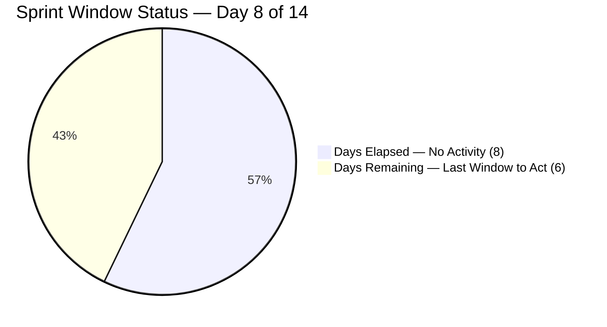
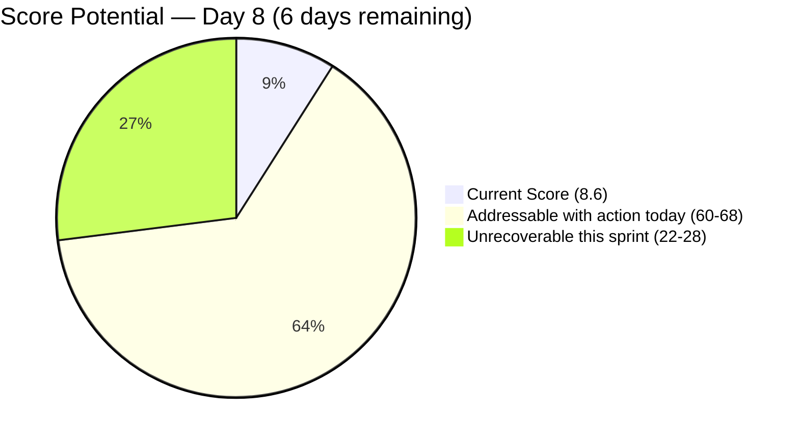
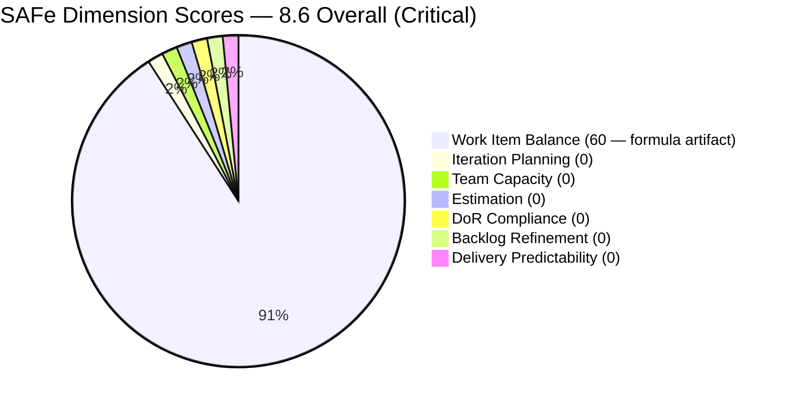

# SAFe Iteration Audit — Life Style Help App Team

## 1. Audit Metadata

| Field | Value |
|-------|-------|
| **Project** | Life Style Help App |
| **Project ID** | `0f447778-7156-4451-ab21-27be3c4a5888` |
| **Team** | Life Style Help App Team |
| **Team ID** | `a2a805bc-0b30-4ef3-9a8a-b7f3081157a6` |
| **Workspace** | `ado_ls_dev` |
| **Iteration** | Iteration 7.6 (IP) — Innovation & Planning |
| **Iteration ID** | `bf91cf5e-4235-4734-a9aa-9e8d21d02476` |
| **Iteration Dates** | 2026-06-15 to 2026-06-28 |
| **Audit Date** | 2026-06-22 (Day 8 of 14) — Philippine Standard Time (PST, UTC+8) |
| **Prior Audit Reference** | `AUDIT_20260621_0925.md` — Score 8.6 / Critical |
| **Overall Score** | **8.6 / 100** |
| **Risk Band** | CRITICAL (Red) |

> **Portfolio Note:** Per the portfolio `CLAUDE.md`, workspace `ado_ls_dev` is excluded from portfolio-level health dashboards and `portfolio-meeting-prep` by owner request (2026-05-21). Individual audits continue as scheduled.

---

## 2. Executive Summary

The Life Style Help App Team remains at **8.6 (Critical)** for the **eighth consecutive day** of Iteration 7.6 (IP). The team-scoped Stories and Deliverables backlog returns zero items (API-confirmed). No capacity has been configured. No items have been committed. No ADO activity has been detected since the sprint began on June 15.

**Day 8 of 14: the last viable recovery window has narrowed to 6 days.** The sprint midpoint passed yesterday. Even if the team commits items today, the formula mechanics mean a score above 80 (Low Risk) is no longer achievable this sprint. The maximum recovery ceiling for the remaining 6 days is approximately 70–77 (Moderate Risk), achievable only if items are committed today, capacity is configured today, and at least 1–2 items are closed before June 28.

The formal PO escalation issued on Day 7 has produced no observable ADO response. As of Day 8, this audit recommends a project status decision by end of business today. The Life Style Help App's complete inactivity since PI7 7.4 represents a material project risk that is not visible in the portfolio dashboard due to the exclusion applied on 2026-05-21.

---

## 3. Previous Audit Delta

| Dimension | Prior (2026-06-21) | Current (2026-06-22) | Delta | Note |
|-----------|---------------------|----------------------|-------|------|
| Iteration Planning | 0.0 | 0.0 | 0.0 | visible_root = 0 — eighth consecutive day |
| Team Capacity | 0.0 | 0.0 | 0.0 | No capacity configured — eighth consecutive day |
| Estimation | 0.0 | 0.0 | 0.0 | No items to estimate |
| DoR Compliance | 0.0 | 0.0 | 0.0 | No items to evaluate |
| Work Item Balance | 60.0 | 60.0 | 0.0 | Formula artifact — -40 for no User Story items |
| Backlog Refinement | 0.0 | 0.0 | 0.0 | visible = 0; base = 0/0 → 0 |
| Delivery Predictability | 0.0 | 0.0 | 0.0 | No committed SP |
| **Overall** | **8.6** | **8.6** | **0.0** | Eighth consecutive day at Critical — zero ADO activity |

**Status:** No ADO changes detected between June 21 and June 22. The backlog remains empty. Capacity remains unconfigured. The formal PO escalation issued on Day 7 (per yesterday's audit) has produced no observable response in ADO.

---

## 4. Current Iteration Snapshot

| Field | Value |
|-------|-------|
| **Iteration** | 7.6 (IP) — Innovation & Planning |
| **Start Date** | 2026-06-15 |
| **End Date** | 2026-06-28 |
| **Day in Sprint** | Day 8 of 14 |
| **Days Remaining** | 6 |
| **Visible Root Backlog Items** | 0 (API-confirmed empty) |
| **Root Items in Iteration 7.6 (IP)** | 0 |
| **Story Points Committed** | 0 SP |
| **Story Points Closed** | 0 SP |
| **Team Capacity** | Not configured (API: "No team capacity assigned to the team") |
| **Iteration Goal** | Not defined |
| **Active Contributors** | None assigned to current iteration |
| **IP Sprint Purpose** | Innovation, planning, PI8 backlog prep — zero captured in ADO |

### Sprint Elapsed Log

| Day | Date | Items | SP Committed | SP Closed | Action |
|-----|------|-------|--------------|-----------|--------|
| 1 | Jun 15 | 0 | 0 | 0 | None |
| 2 | Jun 16 | 0 | 0 | 0 | None |
| 3 | Jun 17 | 0 | 0 | 0 | None |
| 4 | Jun 18 | 0 | 0 | 0 | None |
| 5 | Jun 19 | 0 | 0 | 0 | None |
| 6 | Jun 20 | 0 | 0 | 0 | None |
| 7 | Jun 21 | 0 | 0 | 0 | PO Escalation issued |
| **8** | **Jun 22** | **0** | **0** | **0** | **No response to escalation — 6 days remain** |
| 9–14 | Jun 23–28 | — | — | — | 6 days remaining |

---

## 5. Work Item Analysis

### 5.1 Current Iteration — Empty (Eighth Consecutive Day)

The team-scoped `Microsoft.RequirementCategory` backlog returns zero work items via the ADO API. Confirmed empty. No root-level Stories, Deliverables, Spikes, or Defects are visible for the Life Style Help App Team in any state.

### 5.2 Maximum Score Recovery — 6 Days Remaining

If the team commits items today (Day 8), the maximum achievable scores for each dimension are:

| Dimension | Max Achievable by Jun 28 | Condition |
|-----------|--------------------------|-----------|
| Iteration Planning | 100.0 | Commit items and assign to 7.6 IP |
| Team Capacity | 100.0 | Configure Samantha's capacity |
| Estimation | 100.0 | Assign SP to all committed items |
| DoR Compliance | 100.0 | desc ≥ 30 + AC ≥ 20 chars on all items |
| Work Item Balance | 70–100 | Include User Stories; limit spike share |
| Backlog Refinement | 100.0 | All new items fresh by definition |
| Delivery Predictability | 15–40 | Close 1–2 items out of 3–5 committed by Jun 28 |
| **Projected Overall** | **~70–77** | Moderate Risk — achievable with Day 8 action |

A commitment starting Day 9 would reduce the Delivery Predictability ceiling further, making even Moderate Risk recovery difficult.

### 5.3 Historical Context

| Iteration | Period | Known Delivery |
|-----------|--------|----------------|
| PI7 7.1 | Apr 2026 | 6+ items delivered |
| PI7 7.2 | Apr–May 2026 | 4+ items delivered |
| PI7 7.3 | May 2026 | 2+ items (Defects) |
| PI7 7.4–7.5 | May–Jun 2026 | Minimal/removed items |
| **PI7 7.6 (IP)** | **Jun 15–28** | **0 items (Days 1–8)** |

---

## 6. SAFe Compliance Scorecard

| Dimension | Score | Evidence | Notes |
|-----------|-------|----------|-------|
| Iteration Planning | **0.0** | visible_root = 0; formula → 0 | API-confirmed empty — eighth consecutive day |
| Team Capacity | **0.0** | contributors_with_current_work = 0 → 0 | API: "No team capacity assigned to the team" |
| Estimation | **0.0** | point_eligible = 0 → 0 | No items to estimate |
| DoR Compliance | **0.0** | current_iteration = 0 → 0 | No items to evaluate |
| Work Item Balance | **60.0** | 100 - 40 (no User Story items) | Formula boundary — not a health indicator |
| Backlog Refinement | **0.0** | visible = 0; 0/0 = 0 | Empty backlog |
| Delivery Predictability | **0.0** | committed_SP = 0 → 0 | No SP committed or delivered |
| **Overall** | **8.6** | (0+0+0+0+60+0+0)/7 = 60/7 = 8.57 → 8.6 | Critical Risk (Red) |

---

## 7. Dimension Findings

### 7.1 Iteration Planning — 0.0 (Critical)
Formula returns 0 when `visible_root_backlog_items` = 0. The condition has persisted for all 8 days. The IP sprint's primary purpose — planning, innovation, and PI8 backlog preparation — is not being tracked in ADO. This dimension recovers immediately upon committing any item to the sprint.

### 7.2 Team Capacity — 0.0 (Critical)
No contributors appear in the capacity settings for Iteration 7.6 (IP). The ADO capacity API returns: "No team capacity assigned to the team." Sprint capacity planning — a prerequisite for any delivery forecasting — has not been initiated. This dimension recovers in 2 minutes by configuring Samantha Babael's capacity.

### 7.3 Estimation — 0.0 (Critical)
No items exist to estimate. Auto-recovers when items with Story Points > 0 are committed. Historical items (PI7 7.1–7.3) showed DoR gaps on initial creation — any new items should have SP assigned before commitment.

### 7.4 DoR Compliance — 0.0 (Critical)
No items exist to evaluate. When items are committed, each must have: (a) description ≥ 30 non-whitespace chars in user-voice format, and (b) acceptance criteria ≥ 20 non-whitespace chars. Template: "As a [user], I want to [action], so that [outcome]." minimum 4–5 sentence description.

### 7.5 Work Item Balance — 60.0 (Formula Artifact)
The -40 penalty for "no User Story items" produces a 60.0 score in an empty backlog. This is not a health signal — it is a formula boundary condition. The score becomes meaningful only when items are committed. Including at least one User Story eliminates the -40 penalty.

### 7.6 Backlog Refinement — 0.0 (Critical)
`visible_root_backlog_items` = 0 → base = 0. The IP sprint is the designated backlog refinement window. PI8 planning items should have been created during Days 1–7. This dimension recovers to near 100.0 as soon as items are committed — all new items will be fresh by definition.

### 7.7 Delivery Predictability — 0.0 (Critical)
No committed Story Points = formula returns 0. There is nothing to predict. The denominator itself is zero. The dimension requires both commitment and closure. A single closed 1-SP item would lift this to > 0, but the fraction would still be low without multiple closures.

---

## 8. Risks and Bottlenecks

| Risk | Severity | Status |
|------|----------|--------|
| Zero items committed — Day 8 of 14 | **Critical** | Unresolved — eighth consecutive day |
| No team capacity configured — eighth consecutive day | **Critical** | Unresolved |
| No iteration goal — eighth consecutive day | **Critical** | Unresolved |
| Recovery ceiling reduced — Low Risk (≥80) no longer achievable this sprint | **High** | Score ceiling ~70–77 if action taken today |
| PO escalation (Day 7) produced no ADO response | **High** | Requires synchronous decision today |
| Samantha Babael status unknown — no ADO signal for 8 days | High | PO action required |
| PI8 will begin without PI7 IP planning output | High | Systemic risk |
| Project direction unclear — LifeStyleHelpApp.com | Moderate | PO decision required |
| Score = 8.6 for 8 consecutive days — portfolio visibility masked | Moderate | Excluded from portfolio dashboard per owner request |

---

## 9. Prioritized Recommendations

> **Escalation Notice — Day 8:** The formal PO escalation issued in the Day 7 audit has produced no observable ADO response. As of Day 8, the following recommendations are directed to Product Owner **Ramon Aseniero** for immediate decision. These cannot be actioned by a team member alone.

1. **[TODAY — Day 8, PO DECISION REQUIRED] Choose one of three paths:**
   - **(a) Active recovery:** Commit at least 3 items to 7.6 (IP) today. Create PI8 planning stories, innovation spikes, or technical discovery items. Configure Samantha's capacity. Target closing 1–2 items before June 28. Maximum achievable score: ~70–77 (Moderate Risk).
   - **(b) Formal pause:** Create 1 item: "PI7 IP Sprint — Project Pause Documentation" with description documenting the pause rationale, duration, and resumption criteria. Commit to 7.6 IP and close it today. Score recovery: ~30 (still Critical, but formally documented).
   - **(c) Formal project close:** Archive the ADO board with 1 retrospective item documenting PI7 lessons learned, what was delivered in 7.1–7.3, and next steps. Close the item.

2. **[TODAY — Day 8] Commit minimum 3 items to 7.6 (IP)** — Create 3 User Stories or Spikes with DoR (description ≥ 30 chars, AC ≥ 20 chars, SP assigned). PI8 planning placeholder items qualify. Three items with story points is the minimum to make the backlog auditable.

3. **[TODAY — Day 8] Configure team capacity** — Open Iteration 7.6 (IP) capacity settings for the Life Style Help App Team. Enter Samantha Babael's daily capacity and available days. This single action unlocks Team Capacity from 0.0 to 100.0.

4. **[TODAY — Day 8] Define iteration goal** — Write one sentence: "Conduct PI8 planning for LifeStyleHelpApp.com, capture technical discovery gaps, and document PI7 retrospective findings."

5. **[DAYS 8–14] Close at least 1 item before sprint end** — A single closed item establishes a non-zero Delivery Predictability record. A closed Spike or planning story (1 SP) lifts the dimension above 0.0. Target: close 2 items (retrospective documentation + PI8 roadmap) before June 28.

---

## 10. Evidence Gaps and Limitations

- **No work item data** — The backlog API returns empty for the team-scoped `Microsoft.RequirementCategory` backlog. This is a confirmed API result, not an authentication or tool error.
- **All zero dimension scores are formula boundary conditions** — The 60.0 Work Item Balance score is not a positive indicator. It is a formula artifact.
- **Samantha Babael status** — The primary historical contributor has no ADO footprint for 8 consecutive days. Her availability, leave status, or assignment to other projects cannot be determined from ADO data.
- **ADO capacity API** — "No team capacity assigned to the team" is a hard API response. Not an inference.
- **Portfolio exclusion** — This team is excluded from portfolio-level dashboards and meeting prep per owner request (2026-05-21). The Critical status (8.6 for 8 consecutive days) does not surface in portfolio health metrics.
- **PO escalation response** — The Day 7 audit formally escalated to the PO. No ADO evidence of response exists as of the Day 8 audit run. This does not rule out offline communications.

---

## Visualization

### Sprint Inactivity Timeline — Days 1–8 of 14

```mermaid
graph LR
  A["Jun 15 Day 1<br/>8.6 Critical"] --> B["Jun 16 Day 2<br/>8.6 Critical"] --> C["Jun 17 Day 3<br/>8.6 Critical"] --> D["Jun 18 Day 4<br/>8.6 Critical"] --> E["Jun 19 Day 5<br/>8.6 Critical"] --> F["Jun 20 Day 6<br/>8.6 Critical"] --> G["Jun 21 Day 7<br/>8.6 Critical"] --> H["Jun 22 Day 8<br/>8.6 Critical"]
  style A fill:#cc0000,color:#fff
  style B fill:#cc0000,color:#fff
  style C fill:#cc0000,color:#fff
  style D fill:#cc0000,color:#fff
  style E fill:#cc0000,color:#fff
  style F fill:#cc0000,color:#fff
  style G fill:#cc0000,color:#fff
  style H fill:#cc0000,color:#fff
```

### Sprint Window — Day 8 of 14

### Score Recovery Potential — If Action Taken Today vs. No Action

### SAFe Score Breakdown — Current State

