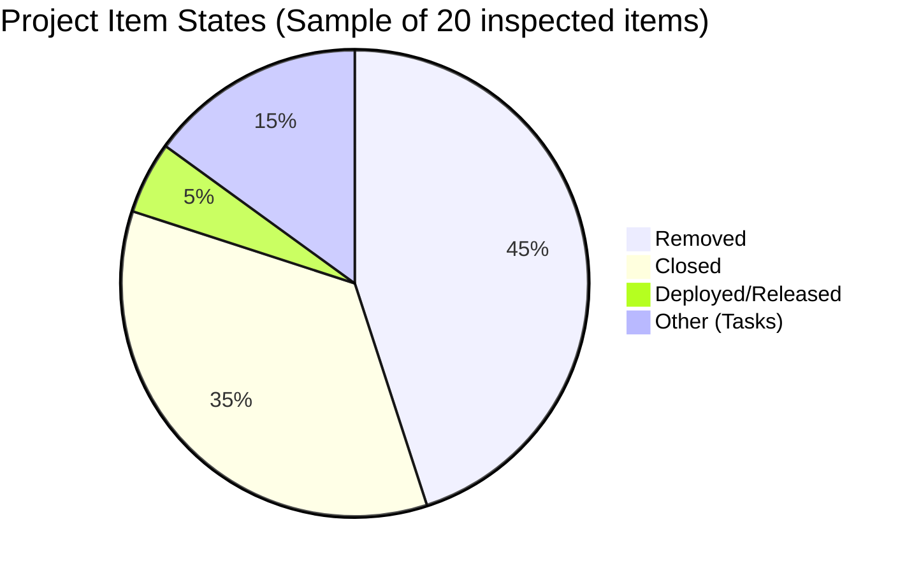

# SAFe Iteration Audit — Life Style Help App Team

## 1. Audit Metadata

| Field | Value |
|-------|-------|
| **Project** | Life Style Help App |
| **Project ID** | `0f447778-7156-4451-ab21-27be3c4a5888` |
| **Team** | Life Style Help App Team |
| **Team ID** | `a2a805bc-0b30-4ef3-9a8a-b7f3081157a6` |
| **Workspace** | `ado_ls_dev` |
| **Iteration** | Iteration 7.6 (IP) — Innovation & Planning |
| **Iteration ID** | `bf91cf5e-4235-4734-a9aa-9e8d21d02476` |
| **Iteration Dates** | 2026-06-15 to 2026-06-28 |
| **Audit Date** | 2026-06-23 (Day 9 of 14) — Philippine Standard Time (UTC+8) |
| **Prior Audit Reference** | `audit/AUDIT_20260318_210643.md` — Iteration 6.5 Day 10 |
| **Overall Score** | **0.0 / 100** |
| **Risk Band** | CRITICAL (Red) |

> **Portfolio Note:** Per `CLAUDE.md` (root repo), ado_ls_dev is excluded from portfolio-level analysis (portfolio-health, portfolio-meeting-prep) at owner request since 2026-05-21. Individual audits remain active.

---

## 2. Executive Summary

The Life Style Help App Team is in **CRITICAL** state for Iteration 7.6 (IP). The ADO backlog returns **zero visible root-level work items** — both the iteration and the Stories & Deliverables backlog are completely empty. The current iteration has no committed items, no team capacity configured, and no story points.

This is a **dormant sprint condition**: the team has not populated Iteration 7.6 (IP) with any work. All 7 scoring dimensions default to 0 due to empty backlog/iteration as specified by the formula rules.

Examination of project-level work items reveals:
- The majority of items in the project are in **Removed** state (items 194082, 194084, 195229, 195373, 195716, 195727, 196380, 201334, 202789 — all Removed)
- Remaining items visible include Closed tasks, a Deployed release package (203862), and individual Closed defects/spikes
- No User Stories, Spikes, or Enablers are in Active/Ready/New state

The last meaningful sprint activity was in **Iteration 6.5** (March 9–22, 2026) — over **93 days ago** — when a recovery from a stalled sprint was audited (Audit 6, AUDIT_20260318_210643.md).

**This team requires immediate leadership intervention to determine status: is the project paused, in a maintenance-only mode, or formally deprioritized?**

---

## 3. Previous Audit Delta

| Dimension | Prior (Iter 6.5, Mar 18) | Current (Iter 7.6 IP, Jun 23) | Delta | Note |
|-----------|--------------------------|-------------------------------|-------|------|
| Iteration Planning | ~45 (5 committed items) | 0.0 | -45 | Backlog empty — 0 items committed |
| Team Capacity | 0.0 (no capacity configured) | 0.0 | 0 | No team capacity in ADO |
| Estimation | ~50 (mixed) | 0.0 | -50 | No items to estimate |
| DoR Compliance | ~40 (mixed) | 0.0 | -40 | No items to assess |
| Work Item Balance | 0.0 | 0.0 | 0 | No items |
| Backlog Refinement | 0.0 | 0.0 | 0 | Empty backlog |
| Delivery Predictability | ~30 (partial delivery) | 0.0 | -30 | No committed SP |
| **Overall** | **~24** | **0.0** | **-24** | CRITICAL — dormant sprint |

> Prior audit scores are approximate conversions from the narrative-style 6.5 audit report (not 7-dimension structured scoring).

---

## 4. Current Iteration Snapshot

| Field | Value |
|-------|-------|
| **Iteration** | 7.6 (IP) — Innovation & Planning |
| **Start Date** | 2026-06-15 |
| **End Date** | 2026-06-28 |
| **Day in Sprint** | Day 9 of 14 |
| **Days Remaining** | 5 |
| **Total Visible Root Backlog Items** | **0** |
| **Root Items in Current Iteration** | **0** |
| **Items Closed** | 0 |
| **Story Points Committed** | 0 SP |
| **Story Points Closed** | 0 SP |
| **Team Capacity** | Not configured |
| **Iteration Goal** | Not defined |

### Project-Level Item Inventory (Non-Backlog)

| State | Count | Notes |
|-------|-------|-------|
| Removed | 9+ | Most User Stories, Enablers, Spikes in the project are Removed |
| Closed | 5+ | Historical tasks, defects, and spikes |
| Deployed | 1 | Release Package 203862 (April 2026) |
| Active/New/Ready | 0 | No open work items |

---

## 5. Work Item Analysis

### 5.1 Items Found in Project (Sample)

| ID | Title | Type | State | Note |
|----|-------|------|-------|------|
| 203862 | Lifestyle (Maintenance) Release Package April 2026 | Release | Deployed | Last release — April 2026 |
| 196379 | Keep Screen On Functions - POC | Spike | — | Child tasks closed (Jun 2026) |
| 203390 | Subscription Automatically Cancels at End of Binding Period | Defect | Closed | Historical |
| 203239 | Investigate member emilienaess97@gmail.com | Defect | Closed | Historical |
| 203247 | 7.2 Collaborations / Check Heges Raised Issues | Spike | Closed | Historical |
| 195716 | Hide recipe card labels | User Story | Removed | Tagged "Medium Prio" |
| 195727 | Meal time filter bug | User Story | Removed | Tagged "Low Prio" |
| 194082 | Customize "Servings" Label | User Story | Removed | Tagged "Low Prio" |

### 5.2 Backlog Status
The Stories & Deliverables backlog (Microsoft.RequirementCategory) returned **0 items**. This means there are no non-Closed, non-Removed root-level items visible to the team board.

---

## 6. SAFe Compliance Scorecard

| Dimension | Score | Evidence | Notes |
|-----------|-------|----------|-------|
| Iteration Planning | **0.0** | visible_root_backlog_items = 0 → formula defaults to 0 | Empty backlog — cannot compute ratio |
| Team Capacity | **0.0** | contributors_with_current_work = 0 → formula defaults to 0 | No capacity configured in ADO |
| Estimation | **0.0** | point_eligible_current_items = 0 → formula defaults to 0 | No items to estimate |
| DoR Compliance | **0.0** | current_iteration_root_items = 0 → formula defaults to 0 | No items to assess |
| Work Item Balance | **0.0** | current_iteration_root_items = 0 → formula defaults to 0 | No items to balance |
| Backlog Refinement | **0.0** | visible_root_backlog_items = 0 → formula defaults to 0 | Empty backlog |
| Delivery Predictability | **0.0** | committed_story_points = 0 → formula defaults to 0 | No committed SP |
| **Overall** | **0.0** | (0+0+0+0+0+0+0)/7 = 0.0 | CRITICAL (Red) |

---

## 7. Dimension Findings

### 7.1–7.7 All Dimensions — 0.0 (CRITICAL)
All seven scoring dimensions return 0.0 per formula rules when their required denominators equal zero. The root cause is a single condition: **the Life Style Help App Team has no work items in the Stories & Deliverables backlog or the current iteration**.

The formula specification states:
- Iteration Planning: `visible_root_backlog_items = 0 → score 0`
- Team Capacity: `contributors_with_current_work = 0 → score 0`
- Estimation: `point_eligible_current_items = 0 → score 0`
- DoR Compliance: `current_iteration_root_items = 0 → score 0`
- Work Item Balance: `current_iteration_root_items = 0 → score 0`
- Backlog Refinement: `visible_root_backlog_items = 0 → score 0`
- Delivery Predictability: `committed_story_points = 0 → score 0`

This is not a scoring methodology failure — it correctly reflects the team's operational state.

---

## 8. Risks and Bottlenecks

| Risk | Severity | Details |
|------|----------|---------|
| Zero visible backlog items | CRITICAL | No work exists in ADO for the team — sprint is structurally empty. |
| Dormant for 93+ days | CRITICAL | Last audit was March 18, 2026. No backlog activity visible since March 2026. |
| No team capacity configured | HIGH | Capacity has never been configured in recent audits. |
| Most items Removed | HIGH | Systematic removal of User Stories suggests the project may be winding down or restructuring. |
| No iteration goal | MODERATE | Persistent across all audits. |
| Last release April 2026 | MODERATE | Maintenance release 203862 (April 2026) — 60+ days since any deployment. |

---

## 9. Prioritized Recommendations

| Priority | Action | Owner | Target |
|----------|--------|-------|--------|
| P0 | Confirm project status with Ramon/product owner: Is Life Style Help App paused, in maintenance mode, or being shut down? | Ramon | Immediate |
| P1 | If active: Populate Iteration 7.6 IP with at least 3–5 work items before Day 11 (Jun 25) | Product Owner | Jun 25 |
| P1 | If active: Configure team capacity in ADO | Team Lead | Jun 25 |
| P2 | Review and formally close or archive the "Removed" items (194082, 195229, 195373, 195716, 195727, 196380, 201334, 202789) to clean up project inventory | Product Owner | Jun 28 |
| P3 | If project is being wound down: formally close ADO project or flag as inactive in portfolio metadata | Ramon | Post-sprint |

---

## 10. Evidence Gaps and Limitations

| Gap | Impact | Note |
|-----|--------|------|
| No active backlog items — all scores are formula-rule 0.0 | Score reflects true operational state, not evidence gap | The empty backlog IS the finding |
| Prior audit (AUDIT_20260318_210643.md) used narrative format, not 7-dimension scoring | Delta comparison is approximate | Next structured audit would establish proper baseline |
| Project items inspected via WIQL but most are Removed/Closed/Task types | Confirms 0 visible root backlog items | Batch inspection of 20 items confirms predominantly Removed state |

---

## Appendix: Score Breakdown

```mermaid
bar
    title SAFe Score — Life Style Help App Team Iteration 7.6 IP (2026-06-23)
    x-axis [Planning, Capacity, Estimation, DoR, Balance, Refinement, Delivery]
    y-axis 0 --> 100
    bar [0, 0, 0, 0, 0, 0, 0]
```


