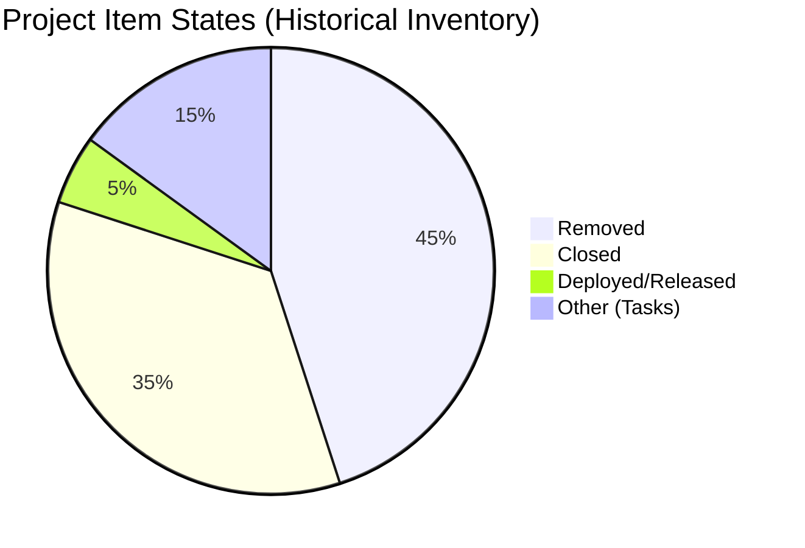

# SAFe Iteration Audit — Life Style Help App Team

## 1. Audit Metadata

| Field | Value |
|-------|-------|
| **Project** | Life Style Help App |
| **Project ID** | `0f447778-7156-4451-ab21-27be3c4a5888` |
| **Team** | Life Style Help App Team |
| **Team ID** | `a2a805bc-0b30-4ef3-9a8a-b7f3081157a6` |
| **Workspace** | `ado_ls_dev` |
| **Iteration** | Iteration 7.6 (IP) — Innovation & Planning |
| **Iteration ID** | `bf91cf5e-4235-4734-a9aa-9e8d21d02476` |
| **Iteration Dates** | 2026-06-15 to 2026-06-28 |
| **Audit Date** | 2026-06-24 (Day 10 of 14) — Philippine Standard Time (UTC+8) |
| **Prior Audit Reference** | `audit/AUDIT_20260623_0900.md` — Iteration 7.6 IP Day 9, Score 0.0 |
| **Overall Score** | **0.0 / 100** |
| **Risk Band** | CRITICAL (Red) |

> **Portfolio Note:** Per `CLAUDE.md` (root repo), `ado_ls_dev` is excluded from portfolio-level analysis (`portfolio-health`, `portfolio-meeting-prep`) at owner request since 2026-05-21. Individual audits remain active.

---

## 2. Executive Summary

The Life Style Help App Team remains in **CRITICAL** state for Iteration 7.6 (IP) Day 10. The ADO backlog returns **zero visible root-level work items** for the second consecutive day. The current iteration has no committed items, no story points, and no team capacity configured. All 7 scoring dimensions default to 0 per formula rules.

This is an unchanged **dormant sprint condition**: no work has been populated into Iteration 7.6 (IP) at any point during the current sprint (Days 1–10). There is no evidence of team activity in ADO since the last meaningful sprint, which was **Iteration 6.5** (March 9–22, 2026) — over **95 days ago**.

With 4 days remaining in the sprint, there is no path to a non-zero score unless the backlog is populated and items are closed before Jun 28.

---

## 3. Previous Audit Delta

| Dimension | Prior (Jun 23, Day 9) | Current (Jun 24, Day 10) | Delta | Note |
|-----------|----------------------|--------------------------|-------|------|
| Iteration Planning | 0.0 | 0.0 | 0 | Backlog empty — no change |
| Team Capacity | 0.0 | 0.0 | 0 | No capacity configured — no change |
| Estimation | 0.0 | 0.0 | 0 | No items to estimate — no change |
| DoR Compliance | 0.0 | 0.0 | 0 | No items to assess — no change |
| Work Item Balance | 0.0 | 0.0 | 0 | No items — no change |
| Backlog Refinement | 0.0 | 0.0 | 0 | Empty backlog — no change |
| Delivery Predictability | 0.0 | 0.0 | 0 | No SP committed — no change |
| **Overall** | **0.0** | **0.0** | **0** | CRITICAL — second consecutive 0.0 in 7.6 IP series |

---

## 4. Current Iteration Snapshot

| Field | Value |
|-------|-------|
| **Iteration** | 7.6 (IP) — Innovation & Planning |
| **Start Date** | 2026-06-15 |
| **End Date** | 2026-06-28 |
| **Day in Sprint** | Day 10 of 14 |
| **Days Remaining** | 4 |
| **Total Visible Root Backlog Items** | **0** |
| **Root Items in Current Iteration** | **0** |
| **Items Closed** | 0 |
| **Story Points Committed** | 0 SP |
| **Story Points Closed** | 0 SP |
| **Team Capacity** | Not configured (API returned no capacity entries) |
| **Iteration Goal** | Not defined |
| **Days Since Last Active Sprint** | 95+ (Iteration 6.5 ended March 22, 2026) |

---

## 5. Work Item Analysis

### 5.1 Backlog Status

The Stories & Deliverables backlog (Microsoft.RequirementCategory) returns **0 items**. This is confirmed on both Day 9 (Jun 23) and Day 10 (Jun 24). No items have been added to the backlog or iteration.

### 5.2 Known Project-Level Inventory (Historical, Non-Backlog)

From prior audit inspection:

| State | Count | Notes |
|-------|-------|-------|
| Removed | 9+ | Most User Stories, Enablers, Spikes systematically Removed |
| Closed | 5+ | Historical tasks and defects from Iteration 6.5 and earlier |
| Deployed | 1 | Release Package 203862 (Maintenance, April 2026) |
| Active/New/Ready | 0 | No open work items |

The systematic removal of User Stories and the absence of any New/Active items confirms the project has not resumed active development since April 2026.

---

## 6. SAFe Compliance Scorecard

| Dimension | Score | Formula Trigger | Evidence |
|-----------|-------|----------------|----------|
| Iteration Planning | **0.0** | `visible_root_backlog_items = 0 → score 0` | Empty backlog |
| Team Capacity | **0.0** | `contributors_with_current_work = 0 → score 0` | No capacity configured |
| Estimation | **0.0** | `point_eligible_current_items = 0 → score 0` | No items to estimate |
| DoR Compliance | **0.0** | `current_iteration_root_items = 0 → score 0` | No items to assess |
| Work Item Balance | **0.0** | `current_iteration_root_items = 0 → score 0` | No items |
| Backlog Refinement | **0.0** | `visible_root_backlog_items = 0 → score 0` | Empty backlog |
| Delivery Predictability | **0.0** | `committed_story_points = 0 → score 0` | 0 SP committed |
| **Overall** | **0.0** | (0+0+0+0+0+0+0)/7 = 0.0 | CRITICAL (Red) |

---

## 7. Dimension Findings

### 7.1–7.7 All Dimensions — 0.0 (CRITICAL)

All seven dimensions score 0.0 per formula default rules when their required denominators are zero. The root cause is singular: **the Life Style Help App Team has no work items in the Stories & Deliverables backlog or the current iteration**.

This is not a scoring methodology artifact — it correctly reflects the team's operational state. The backlog IS the finding.

**Formula-level zero triggers (all active):**
- Iteration Planning: `visible_root_backlog_items = 0 → score 0`
- Team Capacity: `contributors_with_current_work = 0 → score 0`
- Estimation: `point_eligible_current_items = 0 → score 0`
- DoR Compliance: `current_iteration_root_items = 0 → score 0`
- Work Item Balance: `current_iteration_root_items = 0 → score 0`
- Backlog Refinement: `visible_root_backlog_items = 0 → score 0`
- Delivery Predictability: `committed_story_points = 0 → score 0`

---

## 8. Risks and Bottlenecks

| Risk | Severity | Details |
|------|----------|---------|
| Zero backlog items — Day 10 | CRITICAL | Structurally empty sprint. 4 days remain; no path to non-zero score without immediate backlog population. |
| Dormant 95+ days | CRITICAL | No active sprint work since Iteration 6.5 (Mar 22, 2026). Last release April 2026. |
| No team capacity configured | HIGH | Persistent across all audits since Jun 2026. |
| No iteration goal defined | HIGH | Persistent across all audits in 7.6 IP series. |
| Systematic item removal | HIGH | Most User Stories and Enablers are in Removed state — project inventory being wound down. |

---

## 9. Prioritized Recommendations

| Priority | Action | Owner | Target |
|----------|--------|-------|--------|
| P0 | **Leadership decision required**: Confirm project status with Ramon. Is Life Style Help App paused, in maintenance-only mode, or formally deprioritized? A formal status determination ends the audit ambiguity. | Ramon | Immediate |
| P1 | If active: Populate Iteration 7.6 IP with at least 3–5 work items before Day 12 (Jun 26). No backlog items = no score improvement possible. | Product Owner | Jun 26 |
| P1 | If active: Configure team capacity in ADO for at least 1 contributor. | Team Lead | Jun 26 |
| P2 | If winding down: Formally update portfolio metadata to reflect inactive status. Consider closing the ADO project or flagging it with a "Paused" tag. | Ramon | Post-sprint |
| P3 | Archive or formally remove the remaining Removed items (194082, 195229, 195373, 195716, 195727, etc.) to clean up project inventory. | Product Owner | Post-sprint |

---

## 10. Evidence Gaps and Limitations

| Gap | Impact | Note |
|-----|--------|------|
| No backlog items returned | All scores are formula-rule 0.0 — not evidence gaps | The empty backlog IS the finding. No evidence gap; the score is accurate. |
| Team capacity API returned error (Day 9) / no entries (Day 10) | Cannot compute capacity dimension meaningfully | Consistent with no active contributors. |
| Prior audit (AUDIT_20260318_210643.md) used narrative format, not 7-dimension scoring | Delta comparison has been approximate since first structured audit | The 0.0 scores since 7.6 IP start are fully structured and accurate. |

---

## Appendix: Score Breakdown

```mermaid
bar
    title SAFe Score — Life Style Help App Team Iteration 7.6 IP (2026-06-24, Day 10)
    x-axis [Planning, Capacity, Estimation, DoR, Balance, Refinement, Delivery]
    y-axis 0 --> 100
    bar [0, 0, 0, 0, 0, 0, 0]
```


