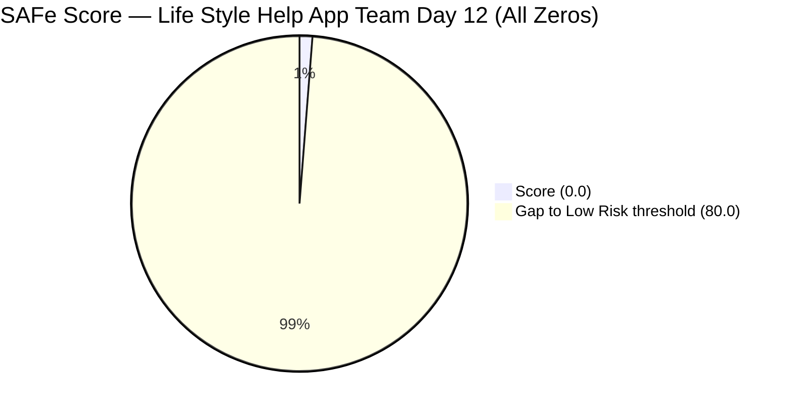
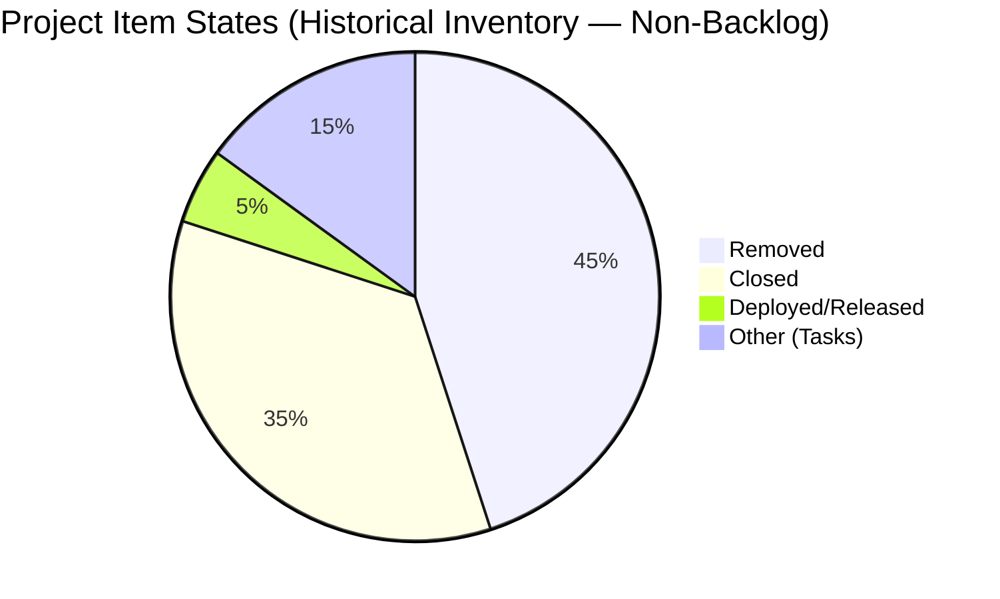
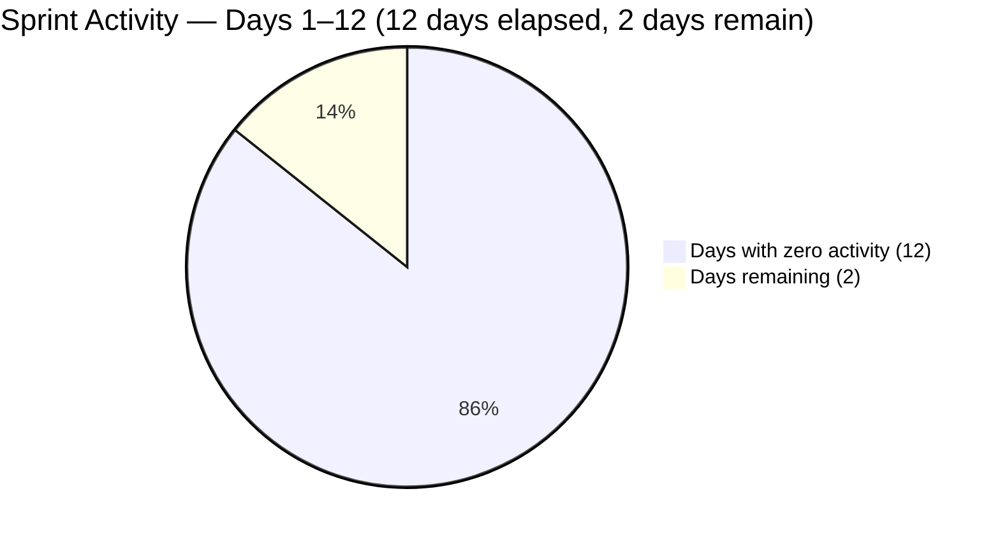

# SAFe Iteration Audit — Life Style Help App Team

## 1. Audit Metadata

| Field | Value |
|-------|-------|
| **Project** | Life Style Help App |
| **Project ID** | `0f447778-7156-4451-ab21-27be3c4a5888` |
| **Team** | Life Style Help App Team |
| **Team ID** | `a2a805bc-0b30-4ef3-9a8a-b7f3081157a6` |
| **Workspace** | `ado_ls_dev` |
| **Iteration** | Iteration 7.6 (IP) — Innovation & Planning |
| **Iteration ID** | `bf91cf5e-4235-4734-a9aa-9e8d21d02476` |
| **Iteration Dates** | 2026-06-15 to 2026-06-28 |
| **Audit Date** | 2026-06-26 (Day 12 of 14) — Philippine Standard Time (UTC+8) |
| **Prior Audit Reference** | `audit/AUDIT_20260624_0920.md` — Iteration 7.6 IP Day 10, Score 0.0 |
| **Overall Score** | **0.0 / 100** |
| **Risk Band** | CRITICAL (Red) |

> **Portfolio Note:** Per project `CLAUDE.md` and root repo `CLAUDE.md`, `ado_ls_dev` is excluded from portfolio-level analysis (`portfolio-health`, `portfolio-meeting-prep`) at owner request since 2026-05-21. Individual audits remain active and are run as scheduled.

---

## 2. Executive Summary

The Life Style Help App Team remains in **CRITICAL** state for Iteration 7.6 (IP) Day 12 — the fourth consecutive zero-score audit in this sprint. The ADO backlog returns **zero visible root-level work items** for the third consecutive day of inspection (Days 9, 10, 12). The current iteration has no committed items, no story points, and no team capacity configured. All seven scoring dimensions default to 0 per formula rules.

This is a **dormant sprint condition**: no work has been populated into Iteration 7.6 (IP) at any point during the sprint (Days 1–12). The sprint closes in 2 days (Jun 28). There is no path to any non-zero score unless the backlog is populated and items are closed before end of Day 14.

The pattern is now deeply established across multiple consecutive iteration audits. This warrants a formal leadership decision on project status.

---

## 3. Previous Audit Delta

| Dimension | Prior (Jun 24, Day 10) | Current (Jun 26, Day 12) | Delta | Note |
|-----------|----------------------|--------------------------|-------|------|
| Iteration Planning | 0.0 | 0.0 | 0 | Backlog empty — no change |
| Team Capacity | 0.0 | 0.0 | 0 | No capacity configured — no change |
| Estimation | 0.0 | 0.0 | 0 | No items to estimate — no change |
| DoR Compliance | 0.0 | 0.0 | 0 | No items to assess — no change |
| Work Item Balance | 0.0 | 0.0 | 0 | No items — no change |
| Backlog Refinement | 0.0 | 0.0 | 0 | Empty backlog — no change |
| Delivery Predictability | 0.0 | 0.0 | 0 | No SP committed — no change |
| **Overall** | **0.0** | **0.0** | **0** | CRITICAL — third consecutive 0.0 in 7.6 IP series |

---

## 4. Current Iteration Snapshot

| Field | Value |
|-------|-------|
| **Iteration** | 7.6 (IP) — Innovation & Planning |
| **Start Date** | 2026-06-15 |
| **End Date** | 2026-06-28 |
| **Day in Sprint** | Day 12 of 14 |
| **Days Remaining** | 2 |
| **Total Visible Root Backlog Items** | **0** |
| **Root Items in Current Iteration** | **0** |
| **Items Closed** | 0 |
| **Story Points Committed** | 0 SP |
| **Story Points Closed** | 0 SP |
| **Team Capacity** | Not configured (API confirmed: no capacity entries for iteration `bf91cf5e`) |
| **Iteration Goal** | Not defined |
| **Days Since Last Active Sprint** | ~97 (Iteration 6.5 ended March 22, 2026) |

---

## 5. Work Item Analysis

### 5.1 Backlog Status

The Stories & Deliverables backlog (Microsoft.RequirementCategory) returns **0 items** for the third consecutive audit (Days 9, 10, 12). No items have been added during the sprint.

The iteration work items query for `bf91cf5e-4235-4734-a9aa-9e8d21d02476` returns **0 work item relations** — confirming the iteration is entirely empty.

### 5.2 Project-Level Historical Inventory (Non-Backlog, for Reference)

From prior audit inspection and historical records:

| State | Count | Notes |
|-------|-------|-------|
| Removed | 9+ | Most User Stories, Enablers, Spikes systematically removed |
| Closed | 5+ | Historical tasks and defects from Iteration 6.5 and earlier |
| Deployed | 1 | Release Package 203862 (Maintenance, April 2026) |
| Active/New/Ready | 0 | No open work items |

The systematic removal of User Stories since April 2026 and the absence of any New/Active/Ready items confirms the project has not resumed active development since the maintenance release in April 2026.

### 5.3 Sprint Timeline Assessment

```
Iteration 7.6 (IP): Jun 15 – Jun 28, 2026
━━━━━━━━━━━━━━━━━━━━━━━━━━━━━━━━━━━━━━━━
Day  1  2  3  4  5  6  7  8  9 10 11 12 13 14
     ░  ░  ░  ░  ░  ░  ░  ░  ░  ░  ░  ■  □  □

░ = Day passed with 0 items committed/closed
■ = Current day (Day 12)
□ = Days remaining
```

12 of 14 days elapsed with no activity. 2 days remain. Sprint will close with 0.0 score unless items are created and closed on Jun 27–28.

---

## 6. SAFe Compliance Scorecard

| Dimension | Score | Formula Trigger | Evidence |
|-----------|-------|----------------|----------|
| Iteration Planning | **0.0** | `visible_root_backlog_items = 0 → score 0` | Backlog API: 0 items returned |
| Team Capacity | **0.0** | `contributors_with_current_work = 0 → score 0` | Iteration capacity API: no entries (confirmed error/empty) |
| Estimation | **0.0** | `point_eligible_current_items = 0 → score 0` | No items to estimate |
| DoR Compliance | **0.0** | `current_iteration_root_items = 0 → score 0` | No items to assess |
| Work Item Balance | **0.0** | `current_iteration_root_items = 0 → score 0` | No items |
| Backlog Refinement | **0.0** | `visible_root_backlog_items = 0 → score 0` | Empty backlog |
| Delivery Predictability | **0.0** | `committed_story_points = 0 → score 0` | 0 SP committed |
| **Overall** | **0.0** | (0+0+0+0+0+0+0) / 7 = 0.0 | **CRITICAL (Red)** |

---

## 7. Dimension Findings

### 7.1–7.7 All Dimensions — 0.0 (CRITICAL)

All seven dimensions score 0.0 per formula default rules when their required denominators are zero. The root cause is singular and unchanged: **the Life Style Help App Team has no work items in the Stories & Deliverables backlog and no items in the current iteration**.

This is not a scoring artifact — it accurately reflects the team's operational state across 12 consecutive days of the sprint.

**Active formula-level zero triggers:**
- Iteration Planning: `visible_root_backlog_items = 0 → score 0`
- Team Capacity: `contributors_with_current_work = 0 → score 0`
- Estimation: `point_eligible_current_items = 0 → score 0`
- DoR Compliance: `current_iteration_root_items = 0 → score 0`
- Work Item Balance: `current_iteration_root_items = 0 → score 0`
- Backlog Refinement: `visible_root_backlog_items = 0 → score 0`
- Delivery Predictability: `committed_story_points = 0 → score 0`

**Pattern across 7.6 IP audit series:**

| Audit Day | Score | Status |
|-----------|-------|--------|
| Day 9 (Jun 23) | 0.0 | CRITICAL |
| Day 10 (Jun 24) | 0.0 | CRITICAL |
| Day 12 (Jun 26) | 0.0 | CRITICAL |
| Day 14 (Jun 28, projected) | 0.0 | CRITICAL (projected) |

---

## 8. Risks and Bottlenecks

| Risk | Severity | Details |
|------|----------|---------|
| Zero backlog items — Day 12 | **CRITICAL** | Empty sprint. 2 days remain; no path to non-zero score without immediate backlog creation and closure on Jun 27–28. |
| Dormant ~97 days | **CRITICAL** | No active sprint work since Iteration 6.5 (Mar 22, 2026). Last release: maintenance package, April 2026. |
| No team capacity configured | HIGH | Confirmed via API: no capacity entries for the iteration. Persistent across all 7.6 IP audit checks. |
| No iteration goal defined | HIGH | Persistent across all audits in 7.6 IP and prior cycles. |
| Systematic item removal | HIGH | Most User Stories and Enablers are in Removed state — project inventory wound down. |
| Unresolved project status | HIGH | No formal communication of project pause, wind-down, or re-activation. Ambiguity persists. |

---

## 9. Prioritized Recommendations

| Priority | Action | Owner | Target |
|----------|--------|-------|--------|
| P0 | **Leadership decision required (overdue):** Confirm project status with Ramon. Is Life Style Help App (a) paused and will resume, (b) in maintenance-only mode, or (c) formally deprioritized/wound down? This decision was recommended on Day 10 — still unaddressed. | Ramon | Immediate |
| P1 | If resuming (option a): Populate at least 3–5 work items into the backlog and close them before Jun 28 to register any non-zero delivery. | Product Owner | Jun 27 |
| P1 | If resuming: Configure team capacity in ADO for at least 1 contributor. | Team Lead | Jun 27 |
| P2 | If winding down (option c): Update portfolio metadata, formally close the ADO project, and remove from future SAFe iteration audit scheduling per current exclusion policy. | Ramon | Post-sprint |
| P3 | If maintaining (option b): Define a maintenance-mode iteration structure with at least 1–2 items per sprint to maintain audit traceability. | Ramon/Product Owner | PI8 planning |

---

## 10. Evidence Gaps and Limitations

| Gap | Impact | Note |
|-----|--------|------|
| Empty backlog — confirmed via two APIs | All scores are formula-rule 0.0 — not evidence gaps | Both the backlog API and iteration work items API return 0 results |
| Team capacity API error/empty | Cannot compute capacity dimension meaningfully | Consistent with no active contributors across all 7.6 IP audits |
| No individual work items to inspect | No SP, State, Description, AC evidence available | Consistent with empty backlog |
| Project status remains unresolved since Day 10 recommendation | Audit continues in degraded mode indefinitely | Requires leadership decision to resolve |

---

## Appendix: Visualizations






