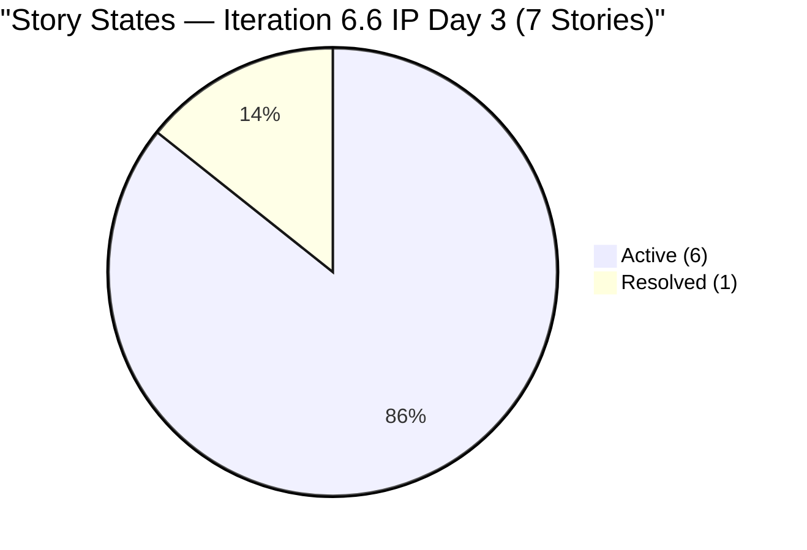
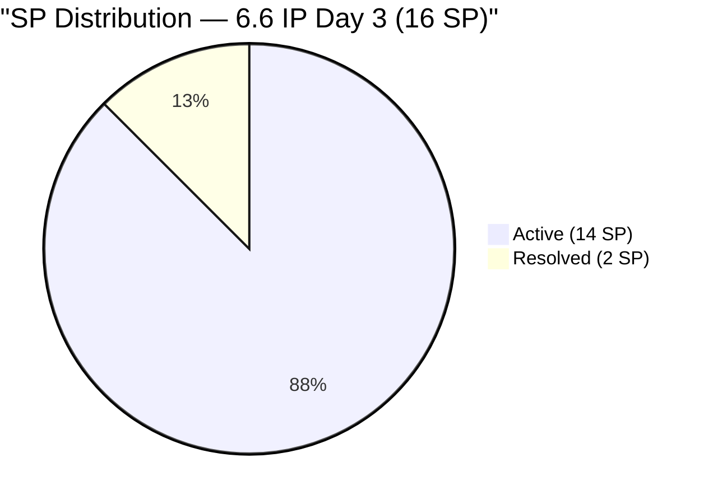
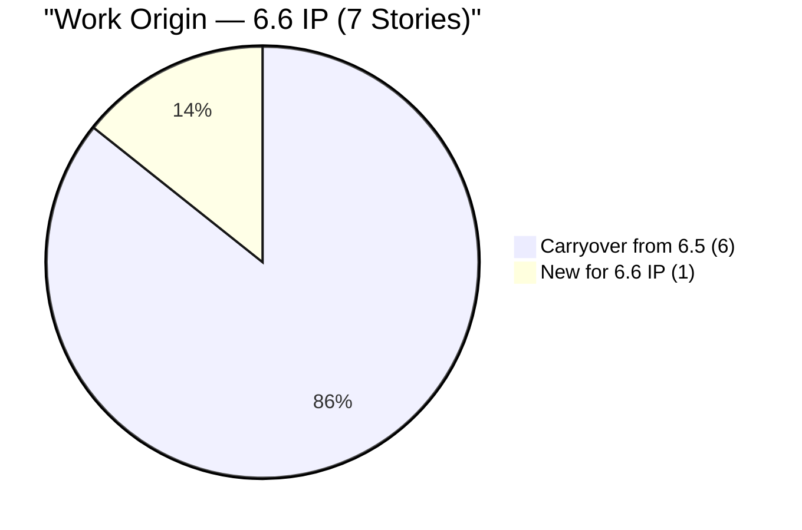
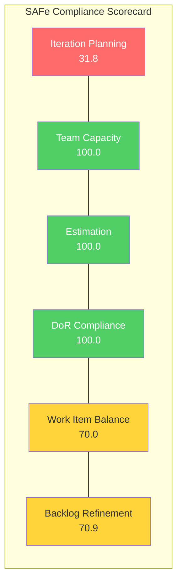

# SAFe Audit Report — OTP Iteration 6.6 (IP)

| Field              | Value                                                                           |
| ------------------ | ------------------------------------------------------------------------------- |
| **Project**        | OTP (Office of the President)                                                   |
| **ADO Org**        | jairo (`dev.azure.com/jairo`)                                                   |
| **ADO Project ID** | `e7739905-28a3-4ae1-9173-7f6cd13b3494`                                          |
| **Team**           | OTP Team (`64de61f0-1203-4b01-aee2-6b4415aec52b`)                               |
| **Backlog**        | Stories and Deliverables (`Microsoft.RequirementCategory`)                       |
| **Iteration**      | Iteration 6.6 (IP) — Mar 23, 2026 to Apr 5, 2026                               |
| **PI**             | 2026 - PI6                                                                      |
| **Audit Date**     | March 25, 2026                                                                  |
| **Auditor**        | SAFe EngProd Consultant (automated)                                             |
| **Previous Audit** | March 22, 2026 — AUDIT_20260322_232928 (Iteration 6.5 Day 14 Closing Audit)    |
| **Iteration Day**  | Day 3 of 14                                                                     |
| **Audit Sequence** | A14 (14th audit in this PI)                                                     |

---

## 1. Audit Metadata

- **Audit boundary:** OTP Team backlog within the `OTP` project (`e7739905-28a3-4ae1-9173-7f6cd13b3494`) in the `jairo` ADO organization.
- **Iteration source:** ADO team settings for OTP Team confirmed Iteration 6.6 (IP) as the current active iteration (timeframe = current).
- **Backlog scope:** `Microsoft.RequirementCategory` (Stories and Deliverables) for OTP Team. 22 visible root backlog items; 7 assigned to the current iteration.
- **Capacity source:** ADO team capacity API for iteration `9b20ed56-ced7-4346-904e-b72f14ddabc5`.
- **No other boards, teams, projects, or repositories were analyzed.**
- **Note:** This is an **Innovation & Planning (IP)** iteration. IP iterations in SAFe are intended for innovation, planning, infrastructure improvements, and addressing technical debt — not for standard feature delivery. Scoring is applied using the standard rubric, but interpretation should account for the IP context.

---

## 2. Executive Summary

This is the **opening audit** of Iteration 6.6 (IP), conducted on Day 3. The iteration is the Innovation & Planning sprint closing out PI6. Seven user stories are assigned to this iteration, six of which are **carryover items from Iteration 6.5** that were never formally closed despite having all tasks completed. The seventh is a new story (#201132 - ROD Compliance for TCT Transfer) added for this iteration.

**Overall SAFe Compliance Score: 78.8 / 100 (Moderate Risk)**

**Key findings:**
- **Carryover debt from 6.5:** Six of the seven stories in this iteration (198759, 198760, 198762, 199522, 200686, 200697) were carried forward from 6.5 where they had all tasks done but were never formally closed. This validates Finding 27 from A13 — the closure gap was not resolved before the iteration ended.
- **Iteration Planning is weak (31.8):** Only 7 of 22 backlog items are assigned to the current iteration. While low assignment ratios are somewhat expected in an IP sprint, 15 items remain unassigned in the root backlog.
- **100% DoR Compliance and 100% Estimation:** All 7 current-iteration stories have robust descriptions, acceptance criteria, and story point estimates.
- **Capacity configured but minimal:** Grace has 1 hr/day for Documentation — significantly reduced from the 2.0 hrs/day in 6.5. Total iteration capacity = 14 hrs for 16 SP of work.
- **4 of 7 current items are untouched since iteration start** (ChangedDate before Mar 23) — suggesting no active work has begun on these items in the first 3 days.

---

## 3. Previous Audit Delta

| Metric | A13 (6.5 Day 14) | A14 (6.6 Day 3) | Change |
|---|---|---|---|
| Iteration | 6.5 (closing) | 6.6 IP (opening) | New iteration |
| User Stories in iteration | 15 | 7 | -8 (8 closed stories dropped) |
| SP Committed | 42 | 16 | -26 (IP sprint, smaller scope) |
| Stories Closed | 8 (53%) | 0 (0%) | Day 3, none closed yet |
| Stories Resolved | 1 (7%) | 1 (14%) | #200697 carried as Resolved |
| Stories Active | 6 (40%) | 6 (86%) | Carryover from 6.5 |
| Tasks Closed / Total | 26/26 (100%) | 3/10 (30%) | New tasks added for carried stories |
| DoR Compliance | 100% | 100% | Maintained |
| Grace Capacity | 2.0 hrs/day | 1.0 hrs/day | -50% capacity reduction |
| Ramon Capacity | 0 | 0 | Unchanged (14 audits) |

**Resolution of A13 Findings:**

| # | Finding | A13 Status | A14 Status |
|---|---|---|---|
| 27 | 7 stories (17 SP) uncredited on final day | HIGH | **PARTIALLY RESOLVED** — Stories moved to 6.6 IP rather than closed in 6.5. Credit was lost for 6.5. |
| 24 | 3 visa stories pending closure 10+ days | HIGH | **CONTINUING** — Now 13+ days uncredited. Still Active in 6.6 IP. |
| 28 | Late scope addition (#201373, +3 SP Day 14) | MEDIUM | **RESOLVED** — #201373 is not in 6.6 IP backlog (presumably closed or removed). |
| 29 | Task pruning without documentation | MEDIUM | **RESOLVED** — Iteration boundary reset. New tasks created for carried stories. |
| 1 | Ramon at 0 capacity | MEDIUM | **CONTINUING** — 14th consecutive audit. |
| 17 | Capacity reduction not documented | LOW | **ESCALATED** — Capacity further reduced from 2.0 to 1.0 hrs/day without documented justification. |
| 18 | Over-commitment offset by execution | LOW | **CONTINUING** — 16 SP vs 14 hrs capacity (1.14 SP/hr). |

---

## 4. Current Iteration Snapshot

### 4.1 Iteration Work Items

| # | ID | Title | SP | State | Tasks (Closed/Total) | Origin |
|---|---|---|---|---|---|---|
| 1 | #198759 | Bomar Visa Application Requirements | 2 | Active | 0/1 | Carryover from 6.5 |
| 2 | #198760 | Jove Visa Application Requirement | 2 | Active | 0/1 | Carryover from 6.5 |
| 3 | #198762 | Bon Visa Application Requirement | 2 | Active | 0/1 | Carryover from 6.5 |
| 4 | #199522 | Renewal of PhilGeps | 4 | Active | 0/1 | Carryover from 6.5 |
| 5 | #200686 | Client Negotiation and Execution | 2 | Active | 0/2 | Carryover from 6.5 |
| 6 | #200697 | ISTIV Values Integration Workshop | 2 | Resolved | 3/3 | Carryover from 6.5 |
| 7 | #201132 | ROD Compliance for TCT Transfer | 2 | Active | 0/1 | New for 6.6 IP |
| | **Total** | | **16** | | **3/10** | |

### 4.2 Task Details

| Task ID | Parent | Title | State |
|---|---|---|---|
| #201543 | #198759 | FTC Schedule | Active |
| #201544 | #198760 | FTC Schedule | Active |
| #201545 | #198762 | FTC Schedule | Active |
| #199702 | #199522 | Submission of PhilGeps requirements | New |
| #200691 | #200686 | Incorporate client feedback into final version | New |
| #200693 | #200686 | Facilitate notarization and archiving | New |
| #200700 | #200697 | Workshop Execution | Closed |
| #200701 | #200697 | Innovation Brainstorm | Closed |
| #200702 | #200697 | Documentation & Reporting | Closed |
| #199689 | #201132 | Submission of Documents to ROD | Active |

### 4.3 Story State Distribution

### 4.4 Story Point Distribution

### 4.5 Carryover vs New Work

---

## 5. Work Item Analysis

### 5.1 Carryover Stories (from Iteration 6.5)

All six carryover stories had **all tasks completed** in 6.5 but were never moved to Closed state. In 6.6 IP, new tasks have been created for some of them:

- **Visa stories (#198759, #198760, #198762):** Each now has a single new task "FTC Schedule" (Active state). These stories have been in Active state with completed work since approximately March 12 (Day 4 of 6.5) — now **13+ days without formal closure**.
- **#199522 (PhilGeps Renewal):** Task #199702 "Submission of PhilGeps requirements" is in New state. This task was previously removed from iteration 6.5 and has been reassigned.
- **#200686 (Client Negotiation):** Two tasks in New state — client feedback incorporation and notarization facilitation.
- **#200697 (ISTIV Workshop):** All 3 tasks Closed, story in Resolved state. **This story should be closed immediately.**

### 5.2 New Story

- **#201132 (ROD Compliance for TCT Transfer):** New story added for 6.6 IP with 2 SP. Has one task (#199689 "Submission of Documents to ROD") in Active state. Good DoR compliance with detailed description and acceptance criteria (5 ACs).

### 5.3 Backlog Items NOT in Current Iteration (15 items)

| ID | Title | SP | State | Last Changed | Days Stale |
|---|---|---|---|---|---|
| #157728 | Davao Chamber of Commerce Membership | 2 | New | Feb 3 | 49 |
| #175360 | Canvass additional Fire Extinguisher | 2 | New | Feb 24 | 28 |
| #175361 | Comply Fire Exit width requirement | 2 | New | Feb 24 | 28 |
| #175362 | Comply Water Tank requirement | 3 | New | Feb 24 | 28 |
| #175363 | Comply Fire Alarm Panel | 5 | New | Feb 24 | 28 |
| #175365 | Supply water for Fire Pipe | 5 | New | Feb 24 | 28 |
| #184001 | Canvass Emergency Exit sign reflector | 2 | New | Feb 24 | 28 |
| #191906 | Fix Fire Exit Stairs | 5 | New | Feb 24 | 28 |
| #191933 | Submit proposal to Converge | 1 | New | Feb 24 | 28 |
| #195284 | Prepare Secretary's Certificate | 2 | New | Feb 1 | 51 |
| #195285 | Schedule Special Board Mtg | 2 | New | Feb 23 | 29 |
| #198587 | Installation of JIT Signage | 3 | New | Feb 23 | 29 |
| #199835 | Hire Principal Software Engineer for SSI | 2 | New | Feb 27 | 25 |
| #200073 | Notification & Due Process (Legal Phase) | 2 | New | Mar 9 | 15 |
| #200681 | Team Re-Architecture (Operational Phase) | 2 | New | Mar 9 | 15 |

All 15 unassigned items are in **New** state. Two items (#157728, #195284) are approaching the 90-day staleness threshold at 49 and 51 days respectively.

---

## 6. SAFe Compliance Scorecard

| # | Dimension | Score | Evidence | Notes |
|---|---|---|---|---|
| 1 | **Iteration Planning** | **31.8** | 7 of 22 backlog items assigned to 6.6 IP | Low — but partially expected for an IP sprint. 15 items idle in backlog. |
| 2 | **Team Capacity** | **100.0** | Grace: 1 hr/day (Documentation). 1/1 contributors configured. | Full score, but absolute capacity is very low (1 hr/day = 14 hrs total). |
| 3 | **Estimation** | **100.0** | 7/7 stories have Story Points > 0. Range: 2-4 SP. | Perfect. All items estimated. |
| 4 | **DoR Compliance** | **100.0** | 7/7 stories pass Description >= 30 chars AND AC >= 20 chars. | Perfect. All items well-documented with detailed AC. |
| 5 | **Work Item Balance** | **70.0** | 100% User Story (7/7). No Spikes, no Bugs, no Enablers. | -30 penalty for >60% single-type dominance. Acceptable for IP sprint. |
| 6 | **Backlog Refinement** | **70.9** | 20/22 fresh (<=45 days). 0 stale >90d. 4/7 untouched in current iteration (-20 penalty). | Base 90.9, -20 for 57.1% untouched current items. |
| | **Overall** | **78.8** | **Moderate Risk** | Dragged down by low Iteration Planning (31.8). |

### Score Visualization

---

## 7. Dimension Findings

### Finding 30 (NEW): HIGH — Chronic Closure Gap Persists Into 6.6 IP

**Source: ADO**

Six stories carried from 6.5 into 6.6 IP were never formally closed, despite having all tasks completed in the prior iteration. The three visa stories (#198759, #198760, #198762) have been effectively complete since March 12 — now **13+ days uncredited**. Story #200697 (ISTIV Workshop) is in Resolved state with all 3 tasks Closed and should be immediately closable.

This is a continuation and escalation of Findings 24 and 27 from A13. The team's pattern of completing work but failing to transition story states is now a **systemic process deficiency** spanning two iterations.

**Impact:** 6.5 officially closed with only 60% credited SP (25 of 42). The 17 SP of uncredited work is now assigned to 6.6 IP, which will inflate this iteration's reported output if/when closed here.

**Recommendation:** Close #200697 immediately (Resolved -> Closed). For the 5 Active stories, determine if new tasks represent genuinely new work or are administrative; if administrative, close the stories promptly.

### Finding 31 (NEW): MEDIUM — Capacity Reduced 50% Without Documentation

**Source: ADO**

Grace's capacity dropped from 2.0 hrs/day (6.5) to 1.0 hrs/day (6.6 IP). No documented justification was found in ADO. The activity type also changed to "Documentation" only, which may be intentional for an IP sprint but should be explicitly noted.

Total iteration capacity: 1.0 hrs/day x 14 days = **14 hrs** for 16 SP of committed work.

This escalates Finding 17 from A13.

### Finding 32 (NEW): MEDIUM — 57% of Current Items Untouched Since Iteration Start

**Source: ADO**

Four of seven current-iteration stories (199522, 198760, 198762, 200686) have not been updated since before the iteration started on March 23. On Day 3, this means over half the committed work shows no activity signal. While some of these are carryover items that may not need immediate updates, the lack of any state transition or task activity in the first 3 days is a concern.

### Finding 1 (CONTINUING): MEDIUM — Ramon at 0 Capacity

**Source: ADO**

**14 consecutive audits.** Ramon has had 0 capacity configured since A1 (Feb 24, 2026). This remains a structural decision that should be formally documented.

### Finding 17 (ESCALATED to Finding 31): MEDIUM — Capacity Reduction Not Documented

See Finding 31. Now at 1.0 hr/day, down from 3.0 (6.4) -> 2.0 (6.5) -> 1.0 (6.6 IP).

### Finding 18 (CONTINUING): LOW — Over-Commitment Relative to Capacity

**Source: ADO**

16 SP committed against 14 hrs capacity (1.14 SP/hr). Less pronounced than 6.5 (42 SP vs 28 hrs), but the ratio remains above 1:1.

---

## 8. Risks and Bottlenecks

| # | Risk | Severity | Source | Mitigation |
|---|---|---|---|---|
| R1 | Chronic closure gap inflates 6.6 IP velocity with 6.5 work | HIGH | ADO | Close carryover stories immediately. Track "inherited SP" separately from "new SP" in velocity. |
| R2 | 57% untouched items on Day 3 may indicate stalled work | MEDIUM | ADO | Review each untouched item in the next standup. Determine if new tasks are genuinely needed. |
| R3 | Capacity trending downward (3.0 -> 2.0 -> 1.0 hrs/day) | MEDIUM | ADO | Document the IP sprint capacity rationale. If structural, update the capacity model. |
| R4 | Two backlog items (#157728, #195284) approaching 90-day staleness | LOW | ADO | Review and either assign to an iteration or archive in the next refinement session. |
| R5 | Single-assignee model limits throughput ceiling | LOW | ADO | Accepted structural constraint per CLAUDE.md. Monitor but do not flag as failure. |

---

## 9. Prioritized Recommendations

### Immediate (This Week)

1. **Close #200697 (ISTIV Workshop) now.** All 3 tasks are Closed and the story is Resolved. This is a zero-effort state transition that credits 2 SP.

2. **Assess the 3 visa stories (#198759, #198760, #198762).** Each has a new "FTC Schedule" task in Active state. Determine whether this represents genuinely new work or an administrative placeholder. If the visa applications are complete, close the stories. These have been effectively done for 13+ days.

3. **Update #199522 and #200686.** Both have tasks in New state. Either begin the tasks or reassess whether these stories should remain in this iteration.

### Process Improvements for PI7

4. **Implement a Closure SLA.** Stories with all tasks Closed must be moved to Closed within 24 hours. The chronic multi-week closure gap is the single biggest drag on SAFe metrics across 6.4, 6.5, and now 6.6.

5. **Document capacity changes.** Each iteration's capacity allocation should have a one-line justification, especially when changing between iterations (3.0 -> 2.0 -> 1.0).

6. **Refine the backlog.** 15 of 22 visible backlog items are unassigned and in New state. Items like #157728 (49 days) and #195284 (51 days) need to be either scheduled or archived. Conduct a backlog grooming session to reduce noise.

7. **Separate carryover from new work in IP iterations.** Track which SP are "inherited debt" vs "new IP work" to maintain clean velocity metrics.

---

## 10. Evidence Gaps and Limitations

| # | Gap | Impact |
|---|---|---|
| G1 | No GitHub repositories are scoped for the OTP project. This is an administrative/operations-focused project with no software delivery component. | GitHub-related scoring dimensions (PR throughput, code review, etc.) are not applicable. |
| G2 | Ramon's capacity reasoning is not documented in ADO. | Cannot distinguish between structural decision and oversight. |
| G3 | No documented justification for Grace's capacity reduction (2.0 -> 1.0 hrs/day). | Treated as an IP sprint adjustment but flagged for documentation. |
| G4 | This is an IP iteration — standard SAFe scoring may not fully reflect the intended purpose of the sprint (innovation, planning, debt reduction). | Scores should be interpreted in the IP context. Low Iteration Planning (31.8) is less alarming in an IP sprint than in a regular delivery sprint. |
| G5 | Task origin unclear — new tasks on carryover stories may be genuinely new scope or administrative re-creation of previously pruned tasks from 6.5. | Cannot determine without team input whether the "FTC Schedule" tasks on visa stories represent new work. |

---

## Audit History Summary

| # | Date | Iteration | Day | Key Event |
|---|---|---|---|---|
| A1 | Feb 24 | 6.4 D2 | 2 | Initial: 10 findings |
| A2 | Feb 26 | 6.4 D4 | 4 | 7 findings resolved |
| A3 | Mar 4 | 6.4 D10 | 10 | Scope creep |
| A4 | Mar 5 | 6.4 D11 | 11 | 3-day stall begins |
| A5 | Mar 6 | 6.4 D12 | 12 | Deadline breach |
| A6 | Mar 9 | 6.5 D1 | 1 | 10 items stranded |
| A7 | Mar 10 | 6.5 D2 | 2 | Scope explosion (39 SP) |
| A8 | Mar 11 | 6.5 D3 | 3 | First 0-critical audit |
| A9 | Mar 12 | 6.5 D4 | 4 | Closures begin |
| A10 | Mar 16 | 6.5 D8 | 8 | Mid-sprint momentum |
| A11 | Mar 17 | 6.5 D9 | 9 | Record: 5 stories closed |
| A12 | Mar 18 | 6.5 D10 | 10 | 95% probability |
| A13 | Mar 22 | 6.5 D14 | 14 | 100% tasks done, 60% credited |
| **A14** | **Mar 25** | **6.6 IP D3** | **3** | **Opening audit: 6/7 carryover, 78.8 SAFe score, closure gap persists** |

---

*Report generated on March 25, 2026 at 09:48 UTC*
*SAFe Framework Reference: [https://ScaledAgileFramework.com](https://ScaledAgileFramework.com)*
*Previous Audit: A13 (AUDIT_20260322_232928)*
