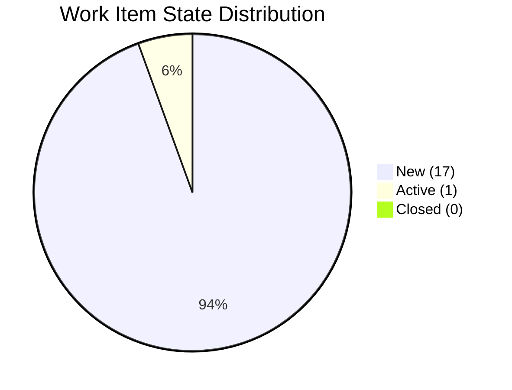
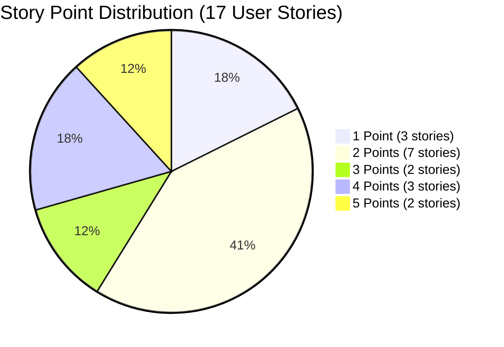
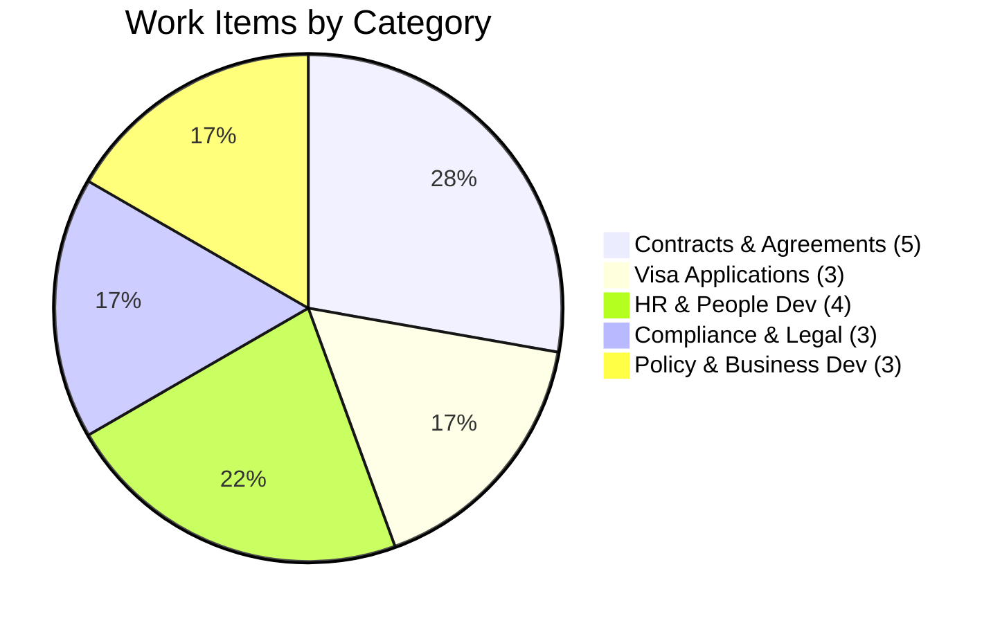
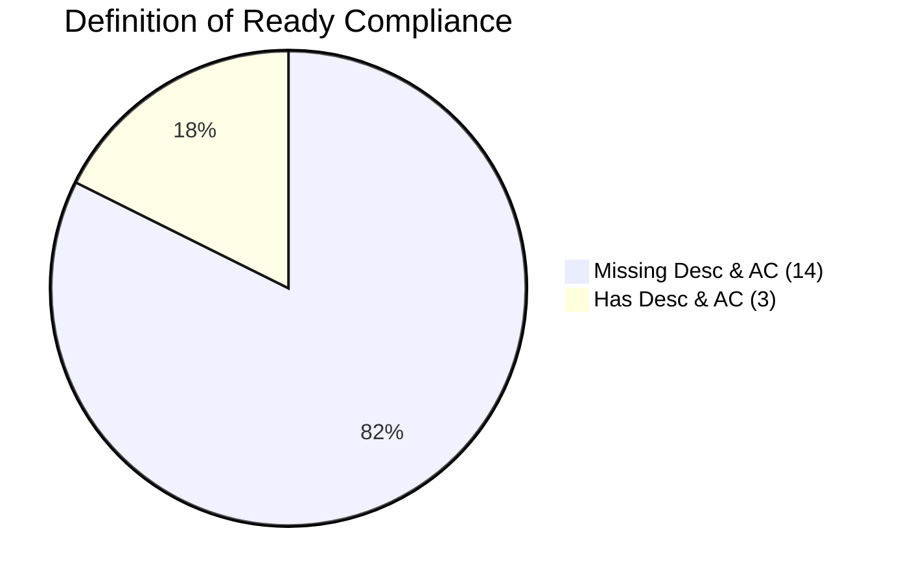
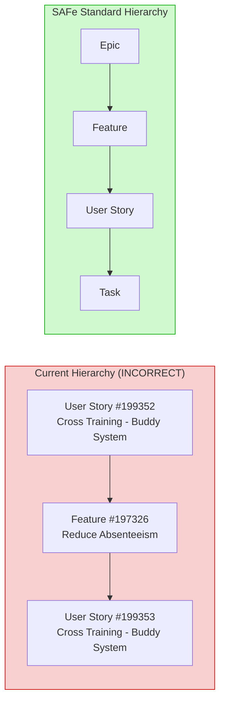
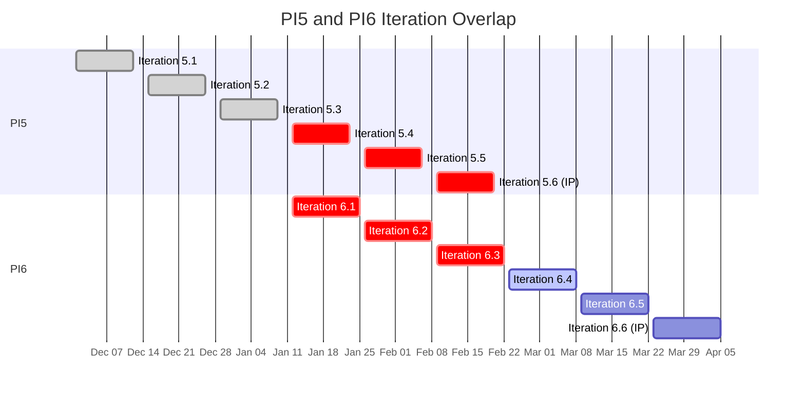
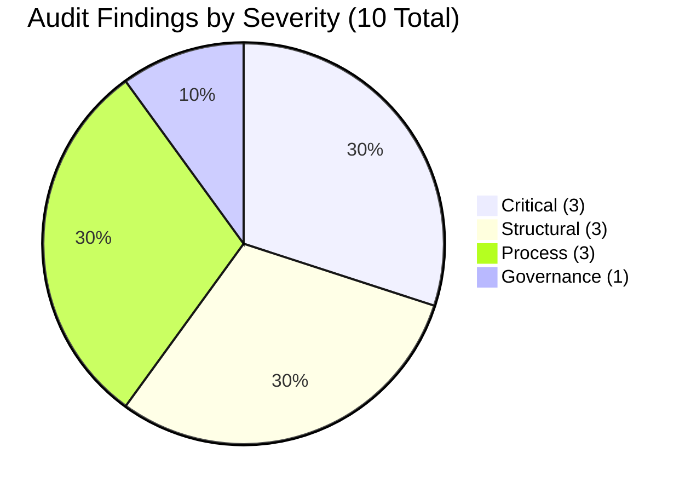
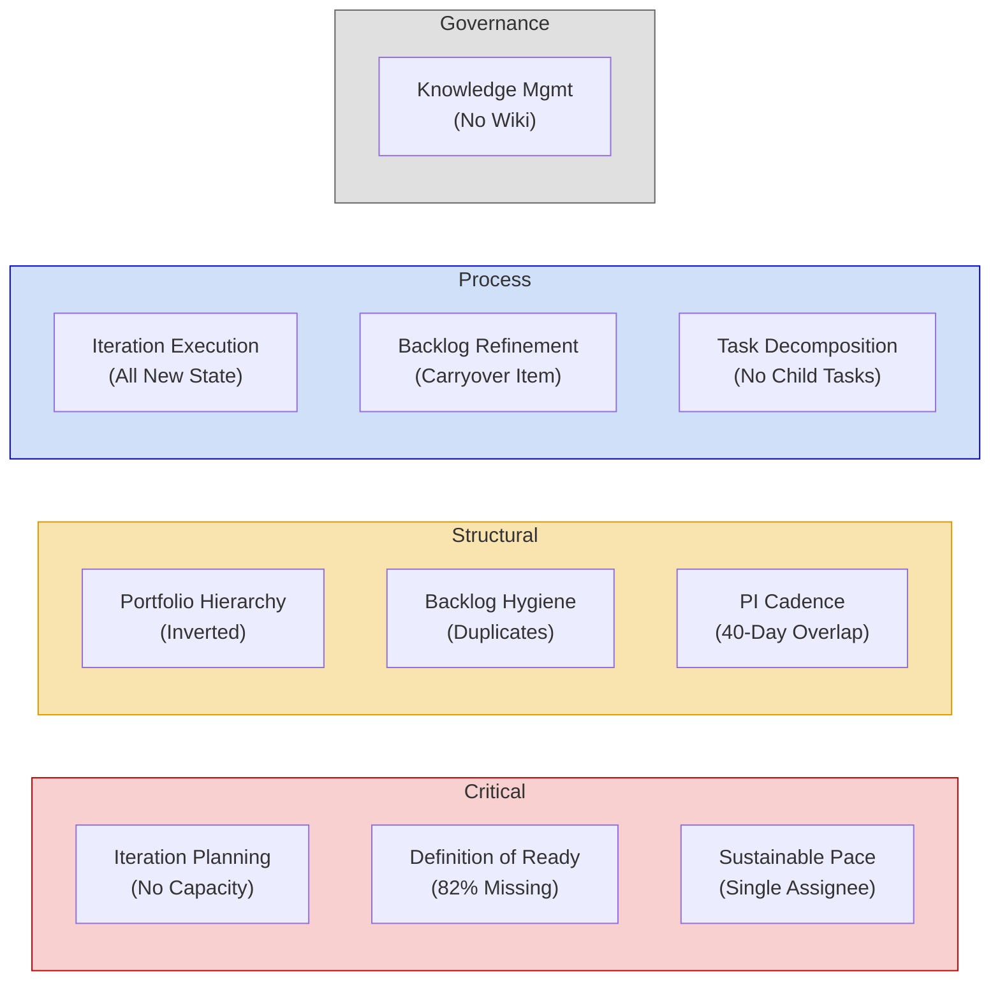

# SAFe Audit Report — OTP Project, Iteration 6.4

**Project:** OTP (Office of the President)
**Organization:** jairo (Azure DevOps)
**Team:** OTP Team
**Iteration:** 6.4 (Feb 23 – Mar 8, 2026)
**PI:** 2026 - PI6
**Audit Date:** February 24, 2026
**Auditor:** SAFe Agile Project Manager Consultant

---

## 1. Executive Summary

This audit evaluates Iteration 6.4 of the OTP project against SAFe (Scaled Agile Framework) standards and best practices. The iteration is on day 2 of a 14-day sprint, with 18 work items (1 Feature, 17 User Stories) totaling 45 story points, all assigned to a single team member (Grace).

The audit identified **10 findings** across four severity categories: 3 Critical, 3 Structural, 3 Process, and 1 Governance. The most pressing concerns are the absence of team capacity planning, widespread missing Definition of Ready fields, and concentrated workload on a single assignee.

---

## 2. Iteration 6.4 Overview

**Sprint Duration:** Feb 23 – Mar 8, 2026 (2 weeks)
**Position within PI6:** 4th of 6 iterations (Iterations 6.5 and 6.6 IP remain)
**Total Work Items:** 18 (1 Feature, 17 User Stories)
**Total Story Points:** 45 (across 17 User Stories)
**Assignee:** Grace (grace@jairosoft.com) — sole assignee for all items
**Team Capacity:** Not configured

### Work Item State Distribution

| State | Count | Percentage |
|-------|:-----:|:----------:|
| New | 17 | 94% |
| Active | 1 | 6% |
| Closed | 0 | 0% |

### Story Point Distribution

| Points | Count | User Stories |
|:------:|:-----:|-------------|
| 5 | 2 | ROD Requirements for Transfer of Title (#178753), Gather Adam Requirements (#199577) |
| 4 | 3 | Cross Training - Buddy System (#199352), Cross Training - Buddy System (#199353), Renewal of PhilGeps (#199522) |
| 3 | 2 | Proposal Presentation (#199524), Draft Travel Policy (#199578) |
| 2 | 7 | Bomar Visa Application Requirements (#198759), Jove Visa Application Requirement (#198760), Bon Visa Application Requirement (#198762), Echo Training (#198867), FTC Jove (#199355), Draft JESI Contract (#199575), Draft Chippens Contract (#199576) |
| 1 | 3 | Bomar Service Agreement (#199525), Ryan Service Agreement (#199579), Earl Service Agreement (#199580) |

### Work Items by Category

---

## 3. Audit Findings

### 3.1 CRITICAL — No Team Capacity Configured

**SAFe Reference:** Iteration Planning, Team Capacity

**Finding:** Team capacity has not been set for Iteration 6.4. The Capacity tab for the OTP Team is empty — no daily hours, no activities, and no days off have been defined.

**Impact:** Without capacity configured, Azure DevOps cannot generate a burndown chart, calculate remaining work versus available hours, or provide any workload visibility. The team is operating without a key SAFe guardrail for sustainable pace and predictability.

**Recommendation:** Immediately configure team capacity in OTP > Sprints > Iteration 6.4 > Capacity tab. Set daily capacity hours per team member and log any planned days off for the sprint period.

---

### 3.2 CRITICAL — 82% of User Stories Missing Description and Acceptance Criteria

**SAFe Reference:** Definition of Ready (DoR), User Story Quality

**Finding:** 14 of 17 User Stories (82%) have completely empty Description and Acceptance Criteria fields. Only 3 stories have both fields populated: ROD Requirements for Transfer of Title (#178753), Echo Training (#198867), and FTC Jove (#199355).

**Affected User Stories:**

| # | ID | Title |
|---|------|-------|
| 1 | #199352 | Cross Training - Buddy System |
| 2 | #199353 | Cross Training - Buddy System |
| 3 | #199524 | Proposal Presentation |
| 4 | #199525 | Bomar Service Agreement |
| 5 | #199522 | Renewal of PhilGeps |
| 6 | #198759 | Bomar Visa Application Requirements |
| 7 | #198760 | Jove Visa Application Requirement |
| 8 | #198762 | Bon Visa Application Requirement |
| 9 | #199575 | Draft JESI Contract |
| 10 | #199576 | Draft Chippens Contract |
| 11 | #199577 | Gather Adam Requirements |
| 12 | #199578 | Draft Travel Policy |
| 13 | #199579 | Ryan Service Agreement |
| 14 | #199580 | Earl Service Agreement |

**Impact:** Without Description and Acceptance Criteria, the team has no documented shared understanding of what each story entails or what "done" looks like. This violates the SAFe Definition of Ready and increases the risk of rework, misalignment, and incomplete deliverables.

**Recommendation:** Before any story moves to Active, it must have a properly written Description (including context and scope) and Acceptance Criteria (specific, testable conditions for completion). This should be enforced as a team working agreement.

---

### 3.3 CRITICAL — Entire Workload Assigned to a Single Person

**SAFe Reference:** Team Collaboration, Sustainable Pace

**Finding:** All 18 work items (1 Feature + 17 User Stories, totaling 45 story points) are assigned exclusively to Grace (grace@jairosoft.com). No other team member appears in the iteration.

**Impact:** This creates a single point of failure for the entire iteration. If Grace is unavailable for even a few days, the sprint goal is at risk. Additionally, 45 story points in 2 weeks for one person is a high commitment, especially given that many of these items involve external dependencies (government offices, visa processing, contract counterparties) that are outside of Grace's control. SAFe promotes cross-functional teams and shared ownership — this concentration of work is an anti-pattern.

**Recommendation:** Distribute work items across available team members. If Grace is the sole team member, the sprint backlog should be reduced to a sustainable level. Consider the team's historical velocity to determine an appropriate commitment.

---

### 3.4 STRUCTURAL — Hierarchy Inversion (User Story Parenting a Feature)

**SAFe Reference:** Portfolio Hierarchy, Work Item Structure (Epic → Feature → User Story → Task)

**Finding:** User Story #199352 ("Cross Training - Buddy System") is the parent of Feature #197326 ("Reduce Absenteeism - Increase Project Billable Hours"), which in turn is the parent of User Story #199353 ("Cross Training - Buddy System").

#### Current (Inverted) Hierarchy vs. SAFe Standard

**Impact:** In the standard SAFe/Agile hierarchy, Features are parents of User Stories, never the other way around. This inversion breaks portfolio-level reporting, rollup calculations, and PI-level planning views. It also confuses the relationship between strategic goals (Features) and tactical delivery items (User Stories).

**Recommendation:** Re-classify #199352 as an Epic or Feature representing the broader initiative, or remove it and link #199353 directly under Feature #197326 as the sole actionable User Story.

---

### 3.5 STRUCTURAL — Duplicate User Stories (#199352 and #199353)

**SAFe Reference:** Backlog Hygiene, INVEST Criteria

**Finding:** Two User Stories share the identical title "Cross Training - Buddy System," the same assignee (Grace), the same state (New), the same story points (4 each), and the same priority (2). Both were created within 40 seconds of each other on February 22, 2026.

**Impact:** This inflates the sprint's total story points by 4 (the effective commitment should be ~41, not 45). It also creates ambiguity about which item to update, where to log progress, and which one represents the actual deliverable. During sprint review, it could appear as two completed items when only one piece of work was done.

**Recommendation:** Remove or close the duplicate (#199352, which has the inverted hierarchy issue), and retain #199353 as the correctly parented item under Feature #197326.

---

### 3.6 STRUCTURAL — PI5 and PI6 Iteration Date Overlap

**SAFe Reference:** PI Cadence, Iteration Calendar

**Finding:** PI5 (Dec 1, 2025 – Feb 20, 2026) and PI6 (Jan 12, 2026 – Apr 5, 2026) overlap by 40 days (January 12 – February 20, 2026). Specifically:

- PI5 Iteration 5.4: Jan 12 – Jan 23, 2026
- PI6 Iteration 6.1: Jan 12 – Jan 25, 2026

These two iterations start on the exact same date.

**Impact:** Overlapping PIs create confusion in velocity tracking, PI burn-up charts, and capacity planning. Work items could inadvertently be assigned to iterations in both PIs, making it unclear which PI's objectives they serve. SAFe requires a clean, non-overlapping PI cadence.

**Recommendation:** Review and correct the PI calendar. Either adjust PI6's start date to begin after PI5 ends (Feb 21, 2026 or later), or close out PI5's iterations retroactively. The legacy PI naming (PI 1–5 with spaces) versus the newer naming (PI3–PI6 without spaces) also contributes to confusion and should be standardized.

---

### 3.7 PROCESS — All User Stories Still in "New" State

**SAFe Reference:** Iteration Execution, Visual Management

**Finding:** 17 of 17 User Stories remain in "New" state. Only Feature #197326 is marked as "Active."

**Impact:** While the iteration is only on day 2, SAFe recommends that stories planned for a sprint are moved to Active during or immediately after Sprint Planning to reflect the team's commitment. Stories remaining in "New" suggest that Sprint Planning may not have formally occurred, or that the board is not being actively managed.

**Recommendation:** Move stories that Grace is currently working on to "Active" state. Establish a practice of updating work item states at least daily.

---

### 3.8 PROCESS — Aged/Carryover Work Item (#178753)

**SAFe Reference:** Backlog Refinement, Flow Metrics

**Finding:** User Story #178753 ("ROD Requirements for Transfer of Title") has gone through 10 revisions, significantly more than any other item in the iteration. This suggests it has been carried forward from prior iterations without completion.

**Impact:** Persistent carryover items are a SAFe anti-pattern. They inflate the backlog, reduce predictability, and often indicate that the story is blocked, poorly defined, or too large to complete in a single iteration. They also negatively affect team morale and velocity accuracy.

**Recommendation:** Conduct a focused review of #178753. Determine if it is blocked (and by what), needs to be re-estimated, should be broken into smaller stories, or should be removed from the backlog entirely.

---

### 3.9 PROCESS — No Child Tasks Under User Stories

**SAFe Reference:** Task Decomposition, Daily Stand-up Enablement

**Finding:** Based on available data, User Stories in Iteration 6.4 do not appear to have child Tasks created beneath them.

**Impact:** Without Tasks, there is no way to track daily progress within a User Story, identify blockers at a granular level, or update remaining hours during stand-ups. SAFe recommends that User Stories are decomposed into Tasks during Sprint Planning so the team can manage work at a day-to-day level.

**Recommendation:** During Sprint Planning (or as an immediate follow-up), each User Story should be broken down into 2–5 actionable Tasks with estimated hours. This enables burndown tracking and daily stand-up discussions.

---

### 3.10 GOVERNANCE — No Project Wiki Configured

**SAFe Reference:** Knowledge Management, Built-In Quality

**Finding:** The OTP project has no wiki configured in Azure DevOps.

**Impact:** Without a wiki, there is no centralized place for process documentation, team working agreements, Definition of Done/Ready, retrospective action items, or onboarding materials. For an Office of the President project, this is a missed opportunity to capture institutional knowledge and ensure continuity.

**Recommendation:** Create a project wiki with at minimum: Team Working Agreements, Definition of Ready, Definition of Done, Sprint Ceremonies schedule, and a PI Planning reference page.

---

## 4. Summary Scorecard

| # | Finding | Severity | SAFe Area |
|---|---------|----------|-----------|
| 3.1 | No Team Capacity Configured | Critical | Iteration Planning |
| 3.2 | 82% of Stories Missing Description & Acceptance Criteria | Critical | Definition of Ready |
| 3.3 | Entire Workload on Single Assignee | Critical | Sustainable Pace |
| 3.4 | Hierarchy Inversion (User Story → Feature → User Story) | Structural | Portfolio Hierarchy |
| 3.5 | Duplicate User Stories (#199352 / #199353) | Structural | Backlog Hygiene |
| 3.6 | PI5 and PI6 Date Overlap (40 days) | Structural | PI Cadence |
| 3.7 | All User Stories Still in "New" State | Process | Iteration Execution |
| 3.8 | Aged Carryover Item (#178753, 10 revisions) | Process | Backlog Refinement |
| 3.9 | No Child Tasks Under User Stories | Process | Task Decomposition |
| 3.10 | No Project Wiki | Governance | Knowledge Management |

### Findings by SAFe Area

---

## 5. Recommended Immediate Actions

1. **Configure team capacity** for Iteration 6.4 before end of day.
2. **Add Description and Acceptance Criteria** to all 14 empty User Stories before moving any to Active.
3. **Remove or reclassify** duplicate User Story #199352 and fix the hierarchy inversion.
4. **Decompose User Stories into Tasks** during a mid-sprint planning session.
5. **Review and correct the PI calendar** to eliminate the PI5/PI6 overlap.
6. **Assess workload distribution** — either add team members or reduce the sprint commitment to a sustainable level.

---

*This audit was conducted following SAFe 6.0 framework standards and best practices as defined at [ScaledAgileFramework.com](https://ScaledAgileFramework.com).*
