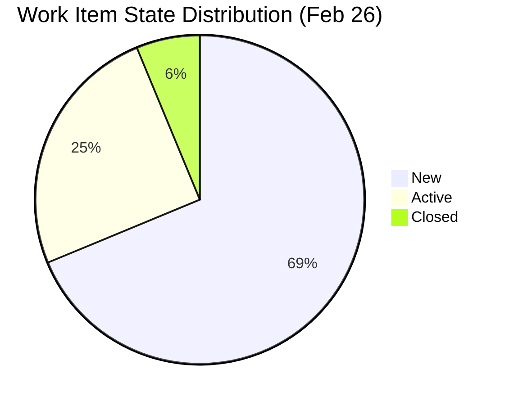
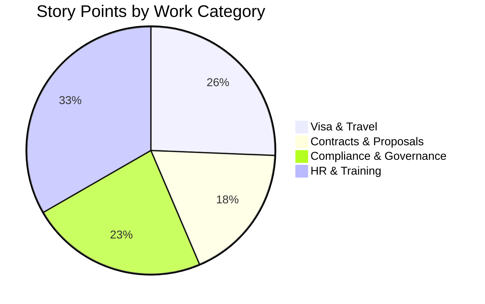
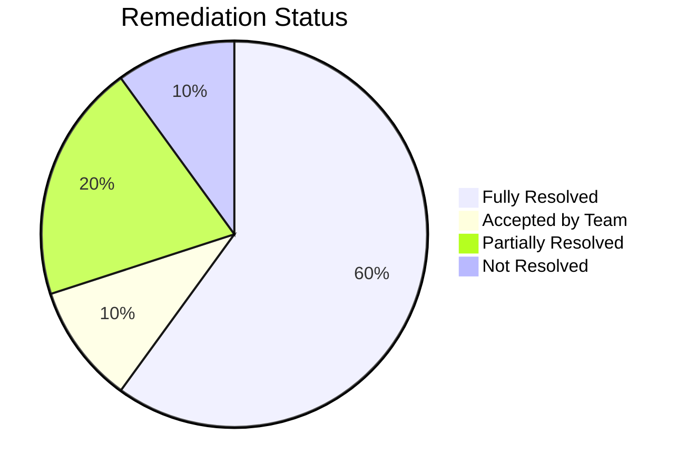
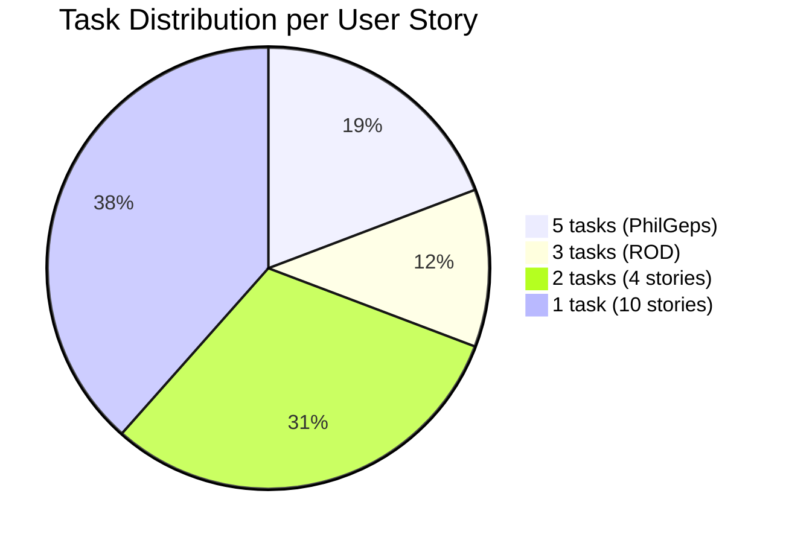
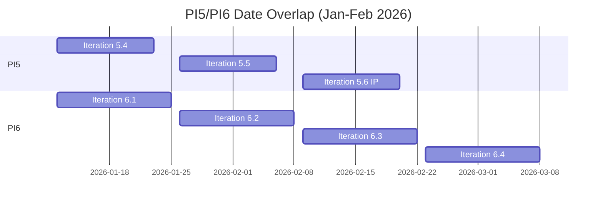
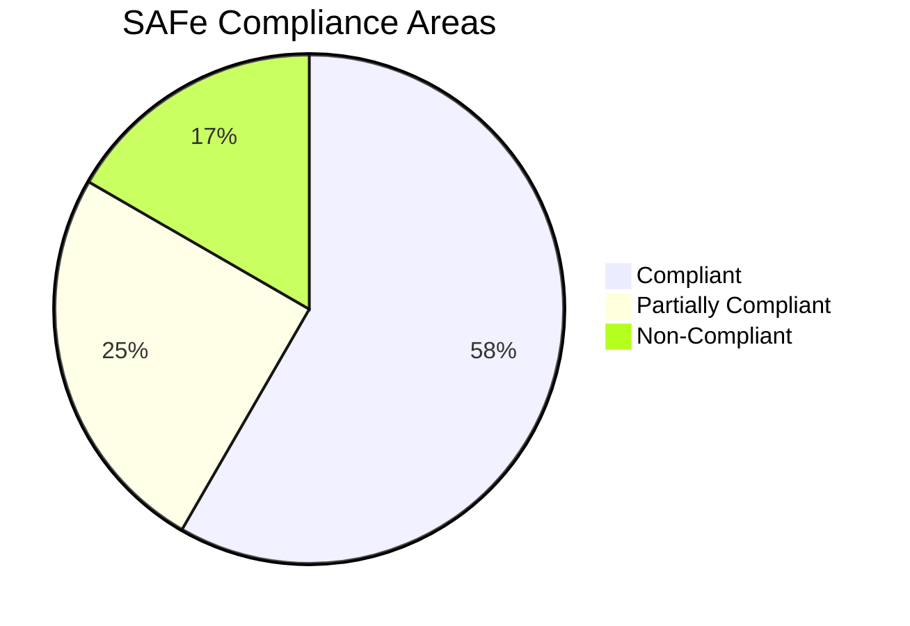
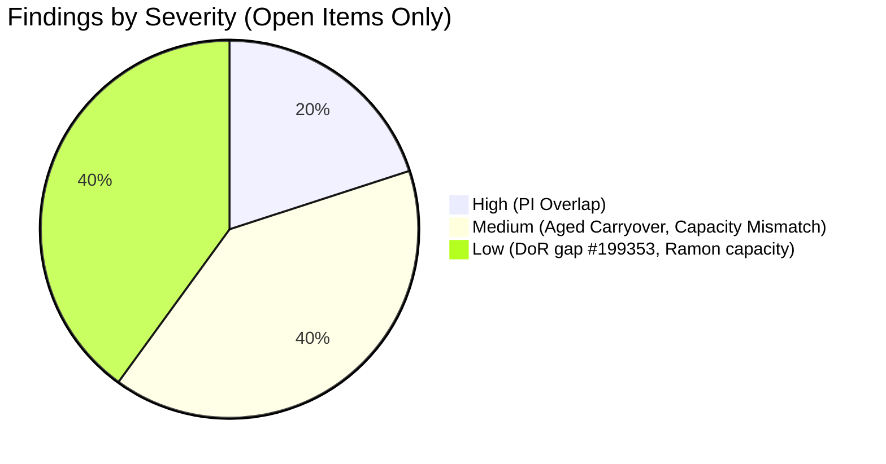
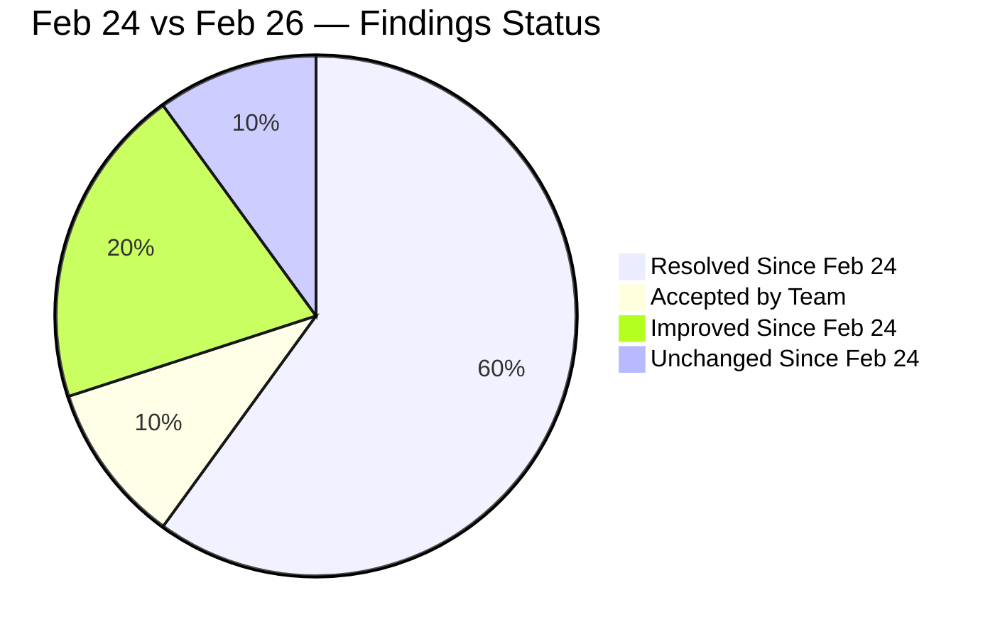

# SAFe Audit Report — OTP Iteration 6.4

| Field              | Value                                     |
| ------------------ | ----------------------------------------- |
| **Project**        | OTP (Office of the President)             |
| **Iteration**      | 6.4 (Feb 23 – Mar 8, 2026)                |
| **PI**             | 2026 - PI6                                |
| **Team**           | OTP Team                                  |
| **Audit Date**     | February 26, 2026                         |
| **Auditor**        | SAFe Agile PM Consultant                  |
| **Previous Audit** | February 24, 2026 (AUDIT_20260224_221243) |

---

## 1. Executive Summary

This is a follow-up audit of Iteration 6.4 of the OTP project, conducted two days after the initial audit on February 24, 2026. The previous audit identified **10 findings** across four severity categories. This report evaluates remediation progress and identifies remaining and new observations.

**Overall Score: 7 of 10 findings fully resolved, 2 partially resolved, 1 unresolved.** *(Finding #3 accepted by team.)*

---

## 2. Iteration Snapshot

| Metric | Previous (Feb 24) | Current (Feb 26) | Change |
|---|---|---|---|
| Total User Stories | 17 | 16 | -1 (duplicate removed) |
| Story Points | 45 | 39 | -6 |
| State: New | 17 (100%) | 11 (69%) | ↓ 31% |
| State: Active | 0 (0%) | 4 (25%) | ↑ 25% |
| State: Closed | 0 (0%) | 1 (6%) | ↑ 6% |
| Child Tasks | 0 | 26 | +26 |
| DoR Compliance | 3 of 17 (18%) | 15 of 16 (94%) | ↑ 76% |
| Team Capacity | 0 hrs/day | 3 hrs/day | Configured |
| Wiki | None | OTP.wiki | Created |

---

## 3. Work Item State Distribution

---

## 4. Story Points by Category

---

## 5. Remediation Status from Previous Audit

### 5.1 Finding Tracker

| #   | Finding                                       | Severity   | Previous                    | Current                          | Status             |
| --- | --------------------------------------------- | ---------- | --------------------------- | -------------------------------- | ------------------ |
| 1   | No Team Capacity configured                   | Critical   | Not Set                     | Grace: 3 hrs/day (Documentation) | ✅ FIXED            |
| 2   | 82% missing Description & Acceptance Criteria | Critical   | 14 of 17 missing            | 1 of 16 missing (#199353)        | ✅ MOSTLY FIXED     |
| 3   | Single assignee (Grace) for all work items    | Critical   | 17/17 Grace                 | 16/16 Grace                      | ✅ ACCEPTED BY TEAM |
| 4   | Hierarchy inversion (US → Feature → US)       | Structural | #199352 → #197326 → #199353 | #199352 removed                  | ✅ FIXED            |
| 5   | Duplicate User Stories (#199352 / #199353)    | Structural | Both present                | #199352 removed                  | ✅ FIXED            |
| 6   | PI5/PI6 40-day date overlap                   | Structural | Jan 12 – Feb 22 overlap     | Still overlapping                | ❌ NOT FIXED        |
| 7   | All work items in "New" state                 | Process    | 17/17 New                   | 11 New, 4 Active, 1 Closed       | ✅ MOSTLY FIXED     |
| 8   | Aged carryover item (#178753)                 | Process    | New state, from PI5         | Still New in 6.4                 | ❌ NOT FIXED        |
| 9   | No child tasks on any User Story              | Process    | 0 tasks                     | 26 tasks across 16 stories       | ✅ FIXED            |
| 10  | No wiki / knowledge management                | Governance | No wiki                     | OTP.wiki created                 | ✅ FIXED            |

### 5.2 Remediation Progress

---

## 6. Detailed Findings

### 6.1 RESOLVED Findings

#### Finding 1 — Team Capacity ✅

Team capacity is now configured for Grace at **3 hours/day** for the "Documentation" activity. However, Ramon Aseniero (the second team member) has **0 hrs/day** capacity set. Per SAFe, every team member contributing to the iteration should have capacity configured to enable accurate velocity and load tracking.

**Recommendation:** Set Ramon's capacity if he is contributing to this iteration, or remove him from the team iteration if he is not.

#### Finding 2 — Definition of Ready (DoR) Compliance ✅ (Partial)

**15 of 16** user stories now have both Description and Acceptance Criteria populated — a dramatic improvement from 18% to **94% compliance**.

**Remaining gap:** User Story **#199353** ("Cross Training - Buddy System") still has empty Description and Acceptance Criteria fields.

**SAFe Reference:** Stories must meet the team's Definition of Ready before being committed to an iteration.

#### Finding 4 & 5 — Hierarchy Inversion & Duplicates ✅

The duplicate User Story #199352 has been removed. The hierarchy inversion (User Story → Feature → User Story) no longer exists in the iteration backlog. User Story #199353 correctly sits as a child of Feature #197326 ("Reduce Absenteeism").

#### Finding 9 — Child Task Decomposition ✅

All 16 user stories now have child tasks, totaling **26 tasks**. Task decomposition breakdown:

| User Story | ID | Tasks |
|---|---|---|
| Renewal of PhilGeps | #199522 | 5 |
| ROD Requirements for Transfer of Title | #178753 | 3 |
| FTC Jove | #199355 | 2 |
| Draft JESI Contract | #199575 | 2 |
| Draft Chippens Contract | #199576 | 2 |
| Draft Travel Policy | #199578 | 2 |
| Echo Training | #198867 | 1 |
| Earl Service Agreement | #199580 | 1 |
| Ryan Service Agreement | #199579 | 1 |
| Bomar Service Agreement | #199525 | 1 |
| Intercompany Service Proposal | #199524 | 1 |
| Bomar Visa Application | #198759 | 1 |
| Jove Visa Application | #198760 | 1 |
| Bon Visa Application | #198762 | 1 |
| Gather Adam Requirements | #199577 | 1 |
| Cross Training - Buddy System | #199353 | 1 |

#### Finding 3 — Single Assignee ✅ (Accepted by Team)

All **16 user stories** remain assigned exclusively to **Grace**. While this would normally represent a bus-factor risk under SAFe guidelines, the team has formally acknowledged and accepted this configuration for Iteration 6.4. Grace is the sole contributor for this iteration cycle.

**Note:** This finding is closed as "Accepted Risk" per team decision. It is recommended to revisit workload distribution in future iterations as the team grows.

#### Finding 10 — Wiki ✅

The project wiki **"OTP.wiki"** has been created on the wikiMaster branch.

---

### 6.2 PARTIALLY RESOLVED Findings

#### Finding 7 — Work Item State Progress ⚠️

Progress has been made — 5 of 16 user stories have moved out of "New" state:

| State | Count | User Stories |
|---|---|---|
| Active | 4 | #199355 (FTC Jove), #199525 (Bomar SA), #199579 (Ryan SA), #199580 (Earl SA) |
| Closed | 1 | #198867 (Echo Training) |
| New | 11 | All remaining stories |

**Concern:** With the iteration **3 days in** (started Feb 23), having **69% of stories still in "New"** state indicates the team has not begun work on the majority of committed items.

**SAFe Reference:** Teams should aim to start work on committed stories early in the iteration. A high percentage of "New" items mid-iteration signals potential delivery risk.

---

### 6.3 UNRESOLVED Findings

#### Finding 6 — PI5/PI6 Date Overlap ❌

The Program Increment date overlap persists:

| PI5 Iterations | Dates | PI6 Iterations | Dates |
|---|---|---|---|
| Iteration 5.4 | Jan 12 – Jan 23 | Iteration 6.1 | Jan 12 – Jan 25 |
| Iteration 5.5 | Jan 26 – Feb 6 | Iteration 6.2 | Jan 26 – Feb 8 |
| Iteration 5.6 (IP) | Feb 9 – Feb 20 | Iteration 6.3 | Feb 9 – Feb 22 |

**Impact:** This creates ambiguity in velocity reporting, iteration assignment, and PI-level metrics. Work items could be double-counted across PIs.

**SAFe Reference:** Program Increments should be sequential with no overlap. Each PI boundary should be a clean hand-off point.

**Recommendation:** Adjust PI5's end date to end before PI6 begins (Jan 11, 2026), or adjust PI6's start date to begin after PI5 ends (Feb 21, 2026).

#### Finding 8 — Aged Carryover (#178753) ❌

User Story **#178753** ("ROD Requirements for Transfer of Title") remains in **"New"** state despite being created in a prior PI. This is now its second audit cycle without state progression.

**SAFe Reference:** Carryover items should be re-estimated and re-committed, not silently carried forward. Persistent carryover indicates either the work is blocked, deprioritized, or the story needs to be refined.

**Recommendation:** Either move this story to Active and begin work, or move it back to the backlog for re-prioritization in a future iteration.

---

## 7. New Observations

### 7.1 Capacity vs. Commitment Mismatch

| Metric | Value |
|---|---|
| Grace's capacity | 3 hrs/day × 10 days = **30 hours** |
| Committed story points | **39 points** |
| Ratio | **1.3 pts/hr** |

This ratio is concerning. If each story point represents roughly 2-4 hours of effort (common SAFe benchmark), the iteration is **over-committed by 2x to 4x**.

### 7.2 Feature #197326 Reason Code

Feature #197326 ("Reduce Absenteeism") has reason code **"Acceptance tests fail"** while in Active state. This should be investigated — it may indicate the Feature's acceptance criteria are not being met despite child stories being worked.

---

## 8. SAFe Compliance Summary

| SAFe Practice | Status | Notes |
|---|---|---|
| Iteration Planning | ⚠️ Partial | Work committed but capacity mismatch |
| Definition of Ready | ✅ Compliant | 94% of stories meet DoR |
| Task Decomposition | ✅ Compliant | All stories have child tasks |
| Team Capacity | ⚠️ Partial | Grace configured; Ramon at 0 |
| Workload Balance | ✅ Accepted | Single assignee accepted by team |
| PI Cadence | ❌ Non-Compliant | PI5/PI6 overlap |
| WIP Management | ⚠️ Partial | 69% still in New state |
| Backlog Hygiene | ❌ Non-Compliant | Aged carryover without progression |
| Knowledge Management | ✅ Compliant | Wiki created |
| Hierarchy Integrity | ✅ Compliant | Inversion resolved |

---

## 9. Severity Distribution

---

## 10. Recommendations (Priority Order)

1. **HIGH — Fix PI5/PI6 date overlap** to restore clean PI boundaries
2. **MEDIUM — Address carryover #178753** — activate or move to backlog
3. **MEDIUM — Validate capacity vs. commitment** — consider descoping 2-3 stories
4. **LOW — Complete DoR for #199353** — add Description and Acceptance Criteria
5. **LOW — Set Ramon's capacity** or remove from iteration if not contributing

---

## 11. Comparison with Previous Audit

**Positive Trends:**
- DoR compliance jumped from 18% to 94%
- Task decomposition went from 0 to 26 child tasks
- Wiki was created
- Duplicate and hierarchy issues were cleaned up
- 5 stories progressed from New state

**Remaining Risks:**
- Over-commitment relative to capacity
- PI boundary ambiguity
- Aged carryover without progression

---

*Report generated on February 26, 2026 at 23:16 UTC*
*SAFe Framework Reference: [https://ScaledAgileFramework.com](https://ScaledAgileFramework.com)*
*Previous Audit: AUDIT_20260224_221243*
