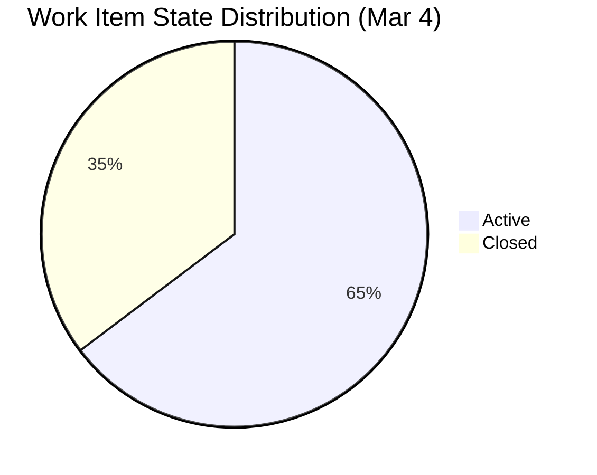
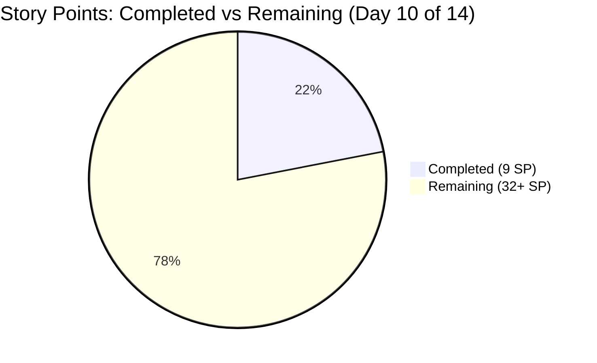
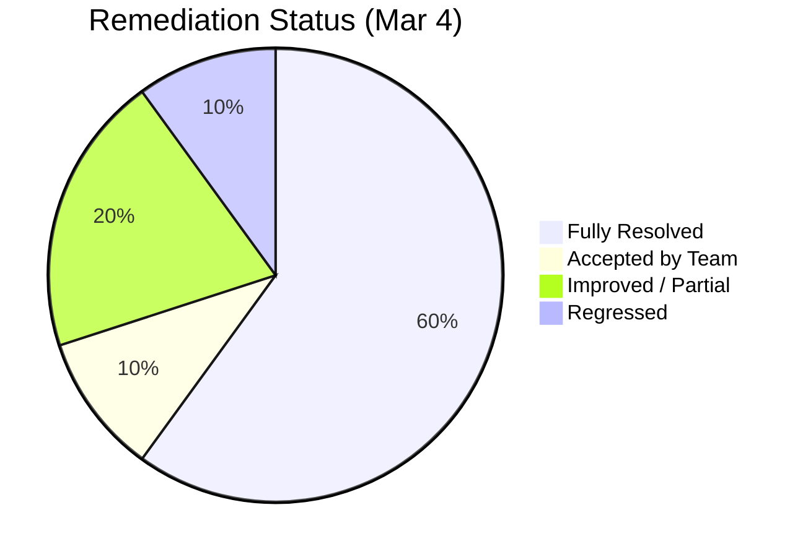
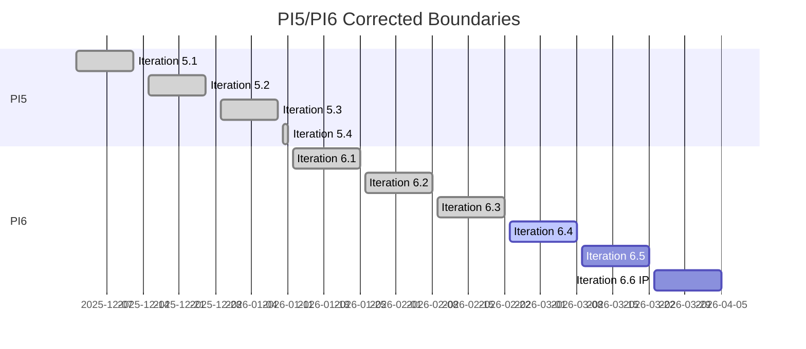
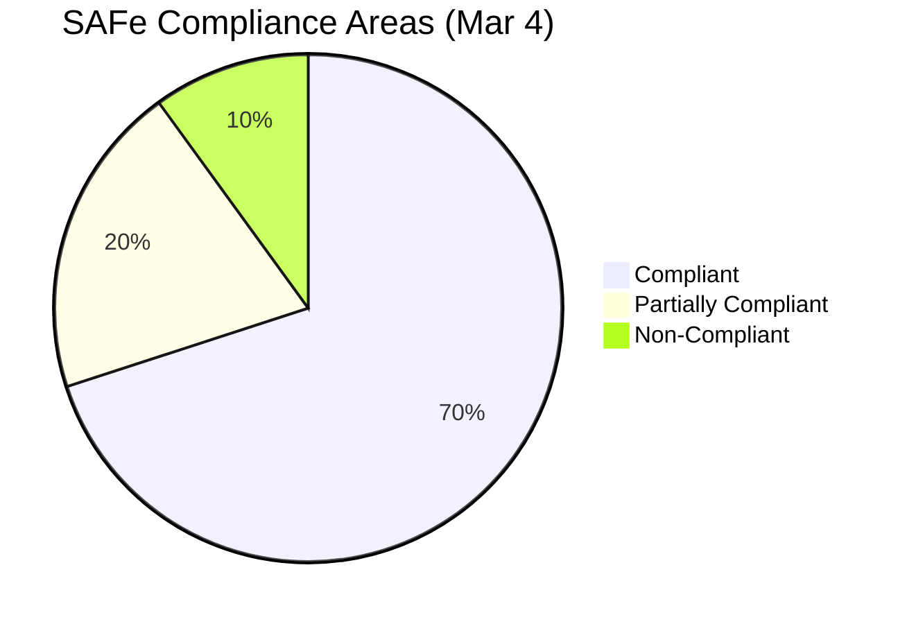
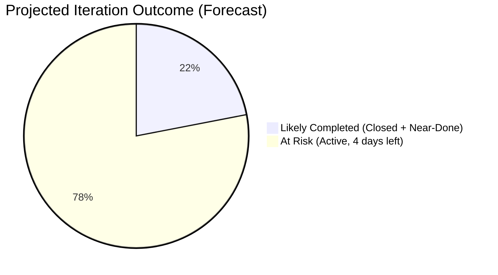
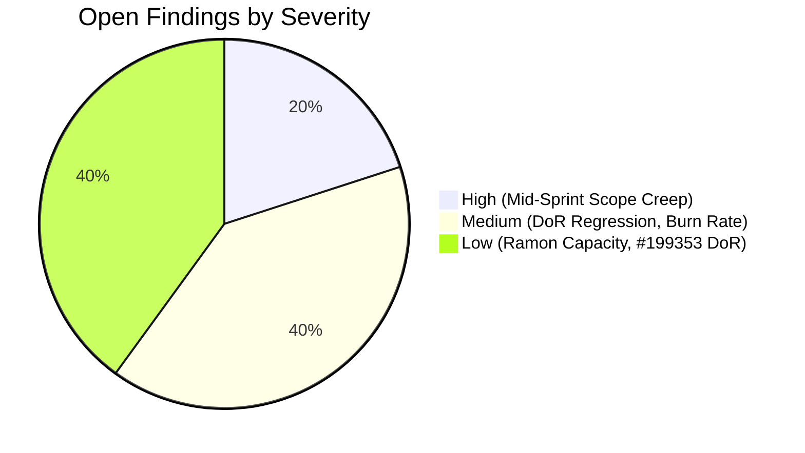

# SAFe Audit Report — OTP Iteration 6.4

| Field              | Value                                      |
| ------------------ | ------------------------------------------ |
| **Project**        | OTP (Office of the President)              |
| **Iteration**      | 6.4 (Feb 23 – Mar 8, 2026)                |
| **PI**             | 2026 - PI6                                 |
| **Team**           | OTP Team                                   |
| **Audit Date**     | March 4, 2026                              |
| **Auditor**        | SAFe Agile PM Consultant                   |
| **Previous Audit** | February 26, 2026 (AUDIT_20260226_231628)  |
| **Iteration Day**  | Day 10 of 14 (4 working days remaining)    |

---

## 1. Executive Summary

This is the third audit of Iteration 6.4 of the OTP project, conducted at the **10-day mark** of the 14-day iteration. The previous audit on February 26 reported 7 of 10 original findings fully resolved, 2 partially resolved, and 1 unresolved.

This audit finds **continued improvement** with significant progress on iteration execution. However, a **new scope change** was introduced mid-sprint, and the **burn rate** raises concerns about completing all committed work by the iteration end date.

**Overall Status: 8 of 10 original findings resolved. 1 new finding identified (mid-sprint scope creep). Delivery risk is ELEVATED with only 22% of story points completed and 4 days remaining.**

---

## 2. Iteration Snapshot

| Metric | Feb 24 (Audit 1) | Feb 26 (Audit 2) | Mar 4 (Audit 3) | Change (Audit 2→3) |
|---|---|---|---|---|
| Total User Stories | 17 | 16 | 17 | +1 (new item added) |
| Story Points | 45 | 39 | 41+ | +2 (new item unestimated) |
| State: New | 17 (100%) | 11 (69%) | 0 (0%) | ↓ 69% |
| State: Active | 0 (0%) | 4 (25%) | 11 (65%) | ↑ 40% |
| State: Closed | 0 (0%) | 1 (6%) | 6 (35%) | ↑ 29% |
| Child Tasks | 0 | 26 | 27+ | Maintained |
| DoR Compliance | 3/17 (18%) | 15/16 (94%) | 15/17 (88%) | ↓ 6% (regression) |
| Team Capacity | 0 hrs/day | 3 hrs/day | 3 hrs/day | Unchanged |
| Closed Story Points | 0 | 2 | 9 | +7 SP |

---

## 3. Work Item State Distribution

### Comparison Across Audits

```mermaid
xychart-beta
    title "Work Item State Progression Across Audits"
    x-axis ["Feb 24", "Feb 26", "Mar 4"]
    y-axis "Number of Work Items" 0 --> 18
    bar [17, 11, 0]
    bar [0, 4, 11]
    bar [0, 1, 6]
```

---

## 4. Closed Work Items (6 of 17)

| # | ID | Title | Story Points | Closed Date |
|---|---|---|---|---|
| 1 | #198867 | Echo Training | 2 | Feb 26 |
| 2 | #199355 | FTC Jove | 2 | Mar 2 |
| 3 | #199525 | Bomar Service Agreement | 1 | Mar 1 |
| 4 | #199576 | Draft Chippens Service Proposal | 2 | Mar 3 |
| 5 | #199579 | Ryan Service Agreement | 1 | Mar 1 |
| 6 | #199580 | Earl Service Agreement | 1 | Mar 1 |

**Total Closed: 9 Story Points (22% of 41 estimated)**

---

## 5. Active Work Items (11 of 17)

| # | ID | Title | SP | Days Active | Risk |
|---|---|---|---|---|---|
| 1 | #178753 | ROD Requirements for Transfer of Title | 5 | Carryover (365+ days old) | ⚠️ HIGH |
| 2 | #198759 | Bomar Visa Application Requirements | 2 | 22 | — |
| 3 | #198760 | Jove Visa Application Requirement | 2 | 22 | — |
| 4 | #198762 | Bon Visa Application Requirement | 2 | 22 | — |
| 5 | #199353 | Cross Training - Buddy System | 4 | 10 | ⚠️ No Desc/AC |
| 6 | #199522 | Renewal of PhilGeps | 4 | 10 | — |
| 7 | #199524 | Intercompany Service Proposal | 3 | 10 | — |
| 8 | #199575 | Draft JESI Contract | 2 | 8 | — |
| 9 | #199577 | Gather Adam Requirements | 5 | 8 | — |
| 10 | #199578 | Draft Travel Policy | 3 | 8 | — |
| 11 | #200069 | Dissolving Duplicate Positions | — | 1 | 🔴 No SP/Desc/AC |

**Total Active: 32+ Story Points (78% of estimated work)**

---

## 6. Burn Rate Analysis

| Metric | Value |
|---|---|
| Grace's total capacity | 3 hrs/day × 10 working days = **30 hours** |
| Hours elapsed (est.) | 3 hrs/day × 8 days worked = **24 hours used** |
| Hours remaining | **~12 hours** (4 working days × 3 hrs) |
| Story points completed | **9 SP** (22%) |
| Story points remaining | **32+ SP** (78%) |
| Required velocity to finish | **8+ SP/day** (vs. actual ~1.1 SP/day) |

**Assessment:** The team would need to complete work at approximately **7x the current pace** to finish all remaining story points. This indicates the iteration is **significantly over-committed** relative to capacity. Many of the remaining active items involve external dependencies (visa applications, government agencies, contract counterparties) that are inherently unpredictable.

---

## 7. Remediation Status from Previous Audits

### 7.1 Finding Tracker

| # | Finding | Severity | Audit 1 (Feb 24) | Audit 2 (Feb 26) | Audit 3 (Mar 4) | Status |
|---|---|---|---|---|---|---|
| 1 | No Team Capacity configured | Critical | Not Set | Grace: 3 hrs/day | Grace: 3 hrs/day; Ramon: 0 | ⚠️ PARTIAL |
| 2 | Missing Description & AC | Critical | 82% missing | 1/16 missing (94%) | 2/17 missing (88%) | ⚠️ REGRESSED |
| 3 | Single assignee (Grace) | Critical | 17/17 Grace | 16/16 Grace | 17/17 Grace | ✅ ACCEPTED |
| 4 | Hierarchy inversion | Structural | Present | Fixed | Fixed | ✅ FIXED |
| 5 | Duplicate User Stories | Structural | Present | Fixed | Fixed | ✅ FIXED |
| 6 | PI5/PI6 date overlap | Structural | 40-day overlap | Still overlapping | **PI5 ends Jan 11, PI6 starts Jan 12** | ✅ FIXED |
| 7 | All items in "New" state | Process | 100% New | 69% New | **0% New** | ✅ FIXED |
| 8 | Aged carryover #178753 | Process | New state | Still New | **Active state** | ⚠️ IMPROVED |
| 9 | No child tasks | Process | 0 tasks | 26 tasks | 27+ tasks | ✅ FIXED |
| 10 | No wiki | Governance | No wiki | Created | Maintained | ✅ FIXED |

### 7.2 Remediation Progress

---

## 8. Detailed Findings

### 8.1 NEWLY RESOLVED — Finding 6: PI5/PI6 Date Overlap ✅

**This is the most significant remediation since the last audit.** The PI5/PI6 date overlap has been corrected:

- **PI5** now spans Dec 1, 2025 – Jan 11, 2026 (4 iterations)
- **PI6** spans Jan 12, 2026 – Apr 5, 2026 (6 iterations)
- **No overlap exists** — the boundaries are clean and sequential

**SAFe Compliance:** PI cadence is now fully compliant with sequential, non-overlapping Program Increments.

---

### 8.2 NEWLY RESOLVED — Finding 7: Work Item State Progression ✅

All work items have moved out of "New" state. The board is now actively managed:

- **0% New** (down from 100% on Feb 24, 69% on Feb 26)
- **65% Active** — work is in progress
- **35% Closed** — 6 stories completed

This demonstrates healthy iteration execution and daily board management.

---

### 8.3 IMPROVED — Finding 8: Aged Carryover #178753 ⚠️

User Story #178753 ("ROD Requirements for Transfer of Title") has moved from **New → Active** state as of March 1. This is progress — the item is no longer stagnant. However, it has been in the system for over a year (created March 12, 2025), and with only 4 days left in the iteration, closure before Mar 8 is uncertain.

**Recommendation:** If this item cannot be completed in Iteration 6.4, it should be explicitly re-committed to 6.5 during the next Sprint Planning. Consider splitting into smaller deliverables if the ROD process has multiple independent milestones.

---

### 8.4 REGRESSED — Finding 2: DoR Compliance ⚠️

DoR compliance has **regressed from 94% to 88%** due to the addition of a new work item without meeting the Definition of Ready:

| # | ID | Title | Description | Acceptance Criteria | Story Points |
|---|---|---|---|---|---|
| 1 | #199353 | Cross Training - Buddy System | ❌ Missing | ❌ Missing | 4 |
| 2 | #200069 | Dissolving Duplicate Positions | ❌ Missing | ❌ Missing | ❌ Missing |

**SAFe Reference:** No story should enter an active iteration without meeting the team's Definition of Ready. Adding unrefined items mid-sprint undermines the iteration commitment.

---

### 8.5 PARTIAL — Finding 1: Team Capacity ⚠️

Capacity configuration is unchanged since February 26:

| Team Member | Capacity | Activity |
|---|---|---|
| Grace | 3 hrs/day | Documentation |
| Ramon Aseniero | 0 hrs/day | (none) |

If Ramon is not contributing to Iteration 6.4, consider removing him from the team iteration to avoid skewing capacity reports.

---

## 9. NEW Finding: Mid-Sprint Scope Creep (#200069) 🔴

**Severity: HIGH**

**Finding:** User Story **#200069** ("Dissolving Duplicate Positions (Traditional Roles)") was added to Iteration 6.4 on **March 3, 2026** — Day 9 of the sprint — with **no story points, no description, no acceptance criteria, and no parent Feature**.

| Field | Value |
|---|---|
| ID | #200069 |
| Title | Dissolving Duplicate Positions (Traditional Roles) |
| State | Active |
| Assigned To | Grace |
| Story Points | ❌ Not set |
| Description | ❌ Empty |
| Acceptance Criteria | ❌ Empty |
| Parent Feature | ❌ None |
| Created | March 3, 2026 |
| Iteration Day Added | Day 9 of 14 |

**SAFe Reference:** SAFe strongly discourages adding work to an iteration after Sprint Planning. Mid-sprint scope changes disrupt the team's commitment and predictability. If urgent work must be added, it should come with a corresponding descope of equivalent effort, be discussed in a team decision, and still meet the Definition of Ready.

**Impact:**

- Adds unknown effort to an already over-committed sprint
- Violates DoR — no description, no acceptance criteria, no estimation
- No parent Feature means this item is disconnected from any PI objective
- Undermines iteration predictability and velocity accuracy

**Recommendation:**

1. Either remove #200069 from Iteration 6.4 and place it in the backlog for refinement and planning in Iteration 6.5
2. Or — if the work is truly urgent — add description, acceptance criteria, story points, and a parent Feature immediately, and descope an equivalent amount of work from the current iteration

---

## 10. SAFe Compliance Summary

| SAFe Practice | Feb 26 Status | Mar 4 Status | Notes |
|---|---|---|---|
| Iteration Planning | ⚠️ Partial | ⚠️ Partial | Mid-sprint scope change undermines plan |
| Definition of Ready | ✅ Compliant | ⚠️ Partial | Regressed from 94% to 88% |
| Task Decomposition | ✅ Compliant | ✅ Compliant | All original stories have tasks |
| Team Capacity | ⚠️ Partial | ⚠️ Partial | Ramon still at 0 hrs |
| Workload Balance | ✅ Accepted | ✅ Accepted | Single assignee accepted |
| PI Cadence | ❌ Non-Compliant | ✅ Compliant | **PI5/PI6 overlap FIXED** |
| WIP Management | ⚠️ Partial | ✅ Compliant | All items active or closed |
| Backlog Hygiene | ❌ Non-Compliant | ⚠️ Partial | #178753 progressing; #200069 unrefined |
| Knowledge Management | ✅ Compliant | ✅ Compliant | Wiki maintained |
| Hierarchy Integrity | ✅ Compliant | ⚠️ Partial | #200069 has no parent Feature |

---

## 11. Velocity & Delivery Forecast

With 6 items closed (9 SP) and 11 items active (32+ SP), the team is on track to close approximately **12-15 SP** by end of iteration, assuming the recent completion velocity continues (~2-3 SP/day). This would result in:

- **Planned:** 41+ SP
- **Forecast Completed:** ~12-15 SP
- **Forecast Completion Rate:** ~30-37%

This is consistent with the capacity-commitment mismatch flagged in the previous audit. The iteration was over-committed relative to Grace's 30-hour capacity.

---

## 12. Severity Distribution of Open Items

---

## 13. Recommendations (Priority Order)

1. **HIGH — Address #200069 scope creep:** Either remove from the iteration or immediately add SP, description, AC, and parent Feature
2. **MEDIUM — Prepare for incomplete iteration:** Identify which active items will realistically close by Mar 8 vs. which will carry over to 6.5
3. **MEDIUM — Complete DoR for #199353:** Add description and acceptance criteria — this has been open for 3 audit cycles
4. **LOW — Set Ramon's capacity** or remove from the iteration team
5. **LOW — Plan Sprint Review/Retrospective:** Use the delivery gap as a retrospective topic to calibrate future sprint commitments

---

## 14. Trend Analysis: Three-Audit Comparison

| Metric | Feb 24 | Feb 26 | Mar 4 | Trend |
|---|---|---|---|---|
| Total Stories | 17 | 16 | 17 | ↔ |
| Story Points | 45 | 39 | 41+ | ↔ |
| % New | 100% | 69% | 0% | ✅ Improving |
| % Active | 0% | 25% | 65% | ✅ Improving |
| % Closed | 0% | 6% | 35% | ✅ Improving |
| DoR Compliance | 18% | 94% | 88% | ⚠️ Slight regression |
| Open Findings | 10 | 5 | 4 | ✅ Improving |
| PI Overlap | Yes | Yes | **No** | ✅ Fixed |

**Positive Trends:**

- PI5/PI6 overlap resolved — clean PI boundaries restored
- All items actively managed — no stale "New" items
- 6 stories closed, demonstrating delivery capability
- Aged carryover #178753 is now being worked on

**Remaining Risks:**

- Over-commitment relative to capacity (22% complete at Day 10)
- Mid-sprint scope addition without proper refinement
- Two items still missing Definition of Ready

---

*Report generated on March 4, 2026 at 22:12 UTC*
*SAFe Framework Reference: [https://ScaledAgileFramework.com](https://ScaledAgileFramework.com)*
*Previous Audits: AUDIT_20260224_221243, AUDIT_20260226_231628*
