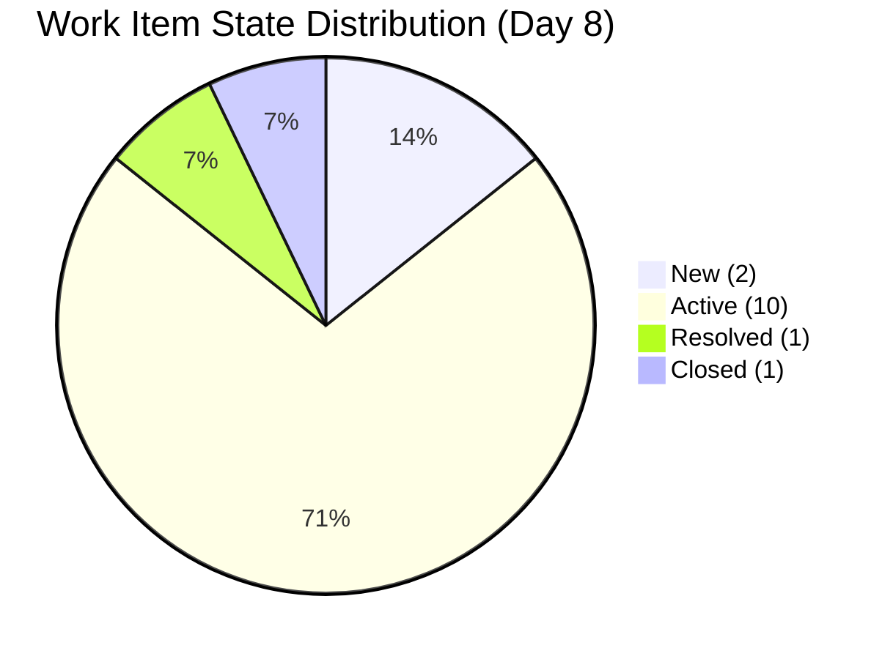
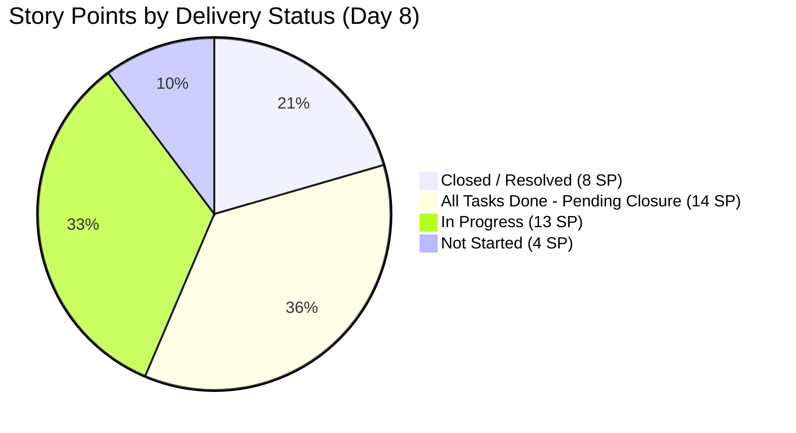
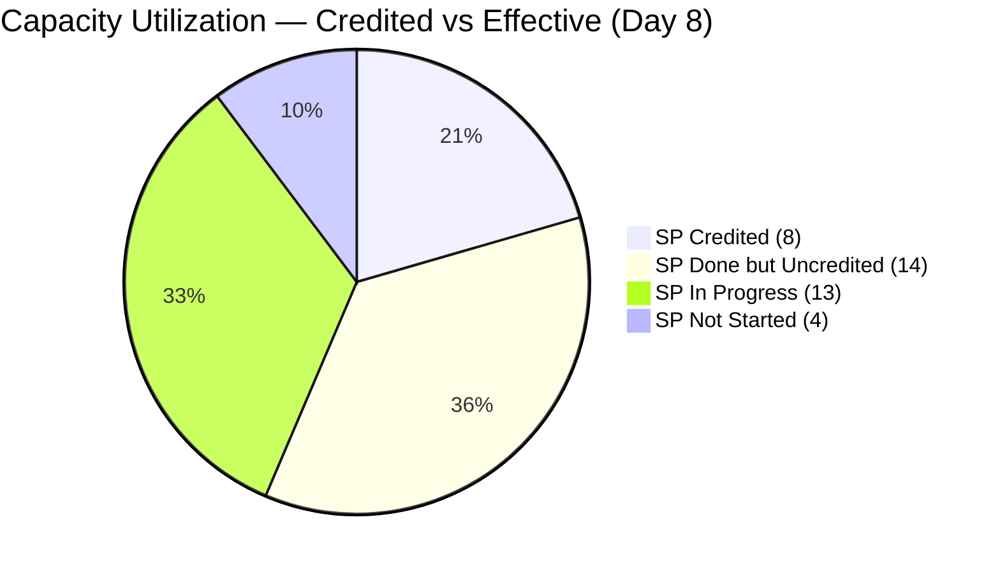
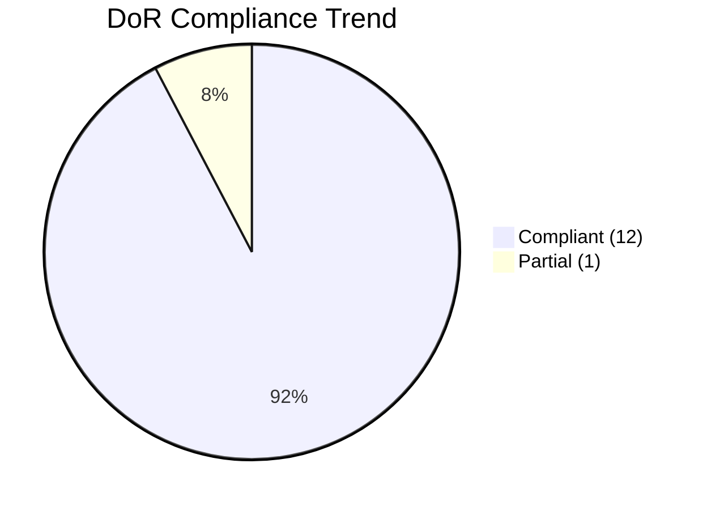
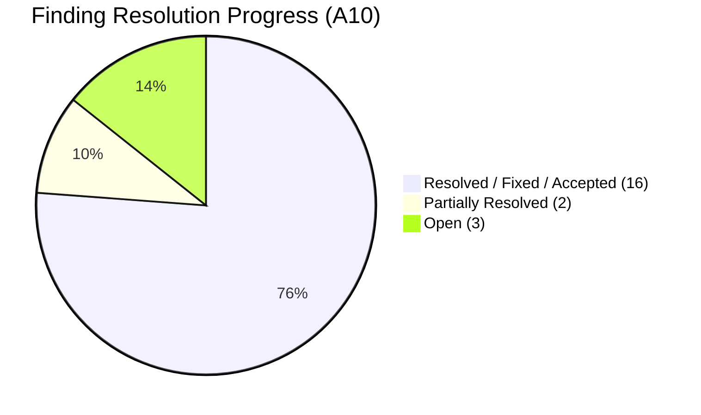
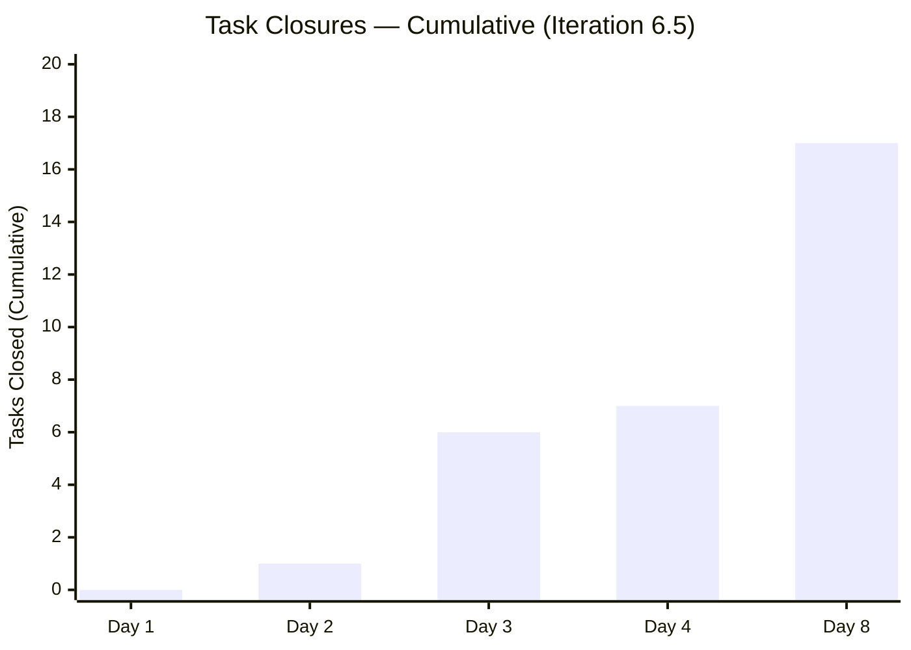
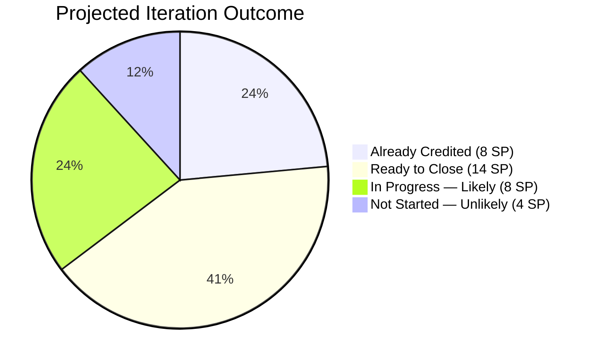
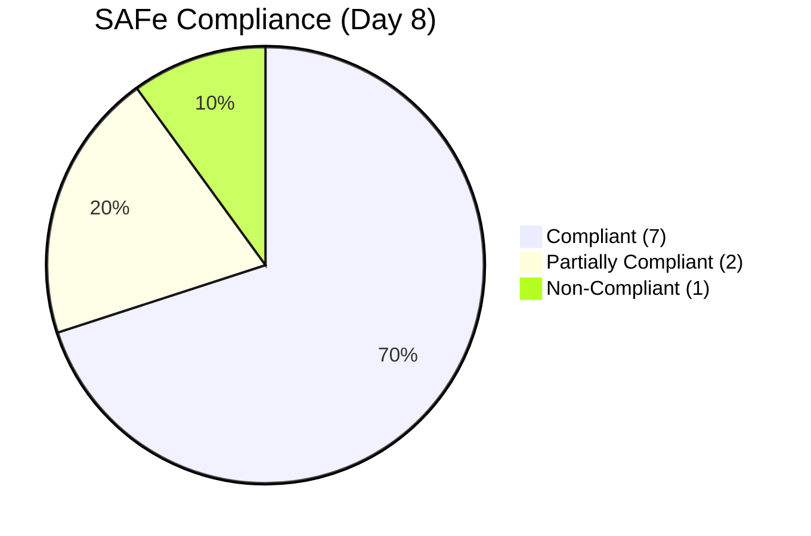

# SAFe Audit Report — OTP Iteration 6.5

| Field              | Value                                                                         |
| ------------------ | ----------------------------------------------------------------------------- |
| **Project**        | OTP (Office of the President)                                                 |
| **Iteration**      | 6.5 (Mar 9 – Mar 22, 2026)                                                   |
| **PI**             | 2026 - PI6                                                                    |
| **Team**           | OTP Team                                                                      |
| **Audit Date**     | March 16, 2026                                                                |
| **Auditor**        | SAFe Agile PM Consultant                                                      |
| **Previous Audit** | March 12, 2026 (AUDIT_20260312_135439) — Iteration 6.5 Day 4                 |
| **Iteration Day**  | Day 8 of 14 — **Mid-sprint** (6 working days remaining)                      |
| **Audit Sequence** | A10 (10th audit in this PI)                                                   |

---

## 1. Executive Summary

This is the **fifth audit of Iteration 6.5**, conducted at the **midpoint** (Day 8 of 14). Four days have elapsed since the previous audit on March 12. This report finds **significant delivery progress** — the most productive multi-day period in the entire 10-audit series — alongside a persistent and worsening process gap in story closure.

**Key Changes Since A9 (4 days ago):**

- **MILESTONE: #199524 (Intercompany Service Proposal) CLOSED.** The story that had two consecutive AC deadline breaches (3/5 and 3/12) has been closed as of March 13. All tasks completed. Findings 19, 23 **RESOLVED.**
- **MILESTONE: #178753 (ROD Requirements) moved to RESOLVED.** After **369 days** (created March 12, 2025), this story has finally progressed to Resolved state as of today (March 16). Its sole remaining task (#199688 — Tax Clearance) is Closed. The second task (#199689) was removed from the iteration. Finding 22 **RESOLVED.**
- **Execution surge: +10 task closures** since A9 (from 7 to 17 cumulative). This is the highest 4-day task closure rate in the audit series.
- **6 stories now have ALL tasks closed but remain Active** — a critical process gap. These 6 stories represent **14 SP** of uncredited work. Combined with the already-credited 8 SP (#199524 Closed + #178753 Resolved), the team has effectively completed **22 SP** of work — **63% of committed scope** — but only 8 SP is officially reflected in the metrics.
- **New tasks added:** #201046 (Cross Training discussion) on #199353 — already Closed. #201047 (Follow up email to Atty Mary) on #199577 — New.
- **Upcoming deadline: 3/17/26 (tomorrow)** for both #199575 (JESI Contract) and #200703 (Chippens Contract) — both have all tasks closed and could be closed today.

**Overall Status: 🟢 GREEN (upgraded from 🟠 AMBER) — The team has reached the mid-sprint inflection point with 22 SP of effective work completed (63% of commitment). Both HIGH findings from A9 are resolved. The remaining critical action is closing the 6 stories that are done but not credited. If the story closure process gap is addressed, this will be the highest-performing iteration in the project's audit history.**

---

## 2. Iteration 6.5 — Day 8 Snapshot

| Metric | A9 (Day 4) | A10 (Day 8) | Change |
|---|---|---|---|
| Total User Stories | 14 | **14** | ↔ |
| Story Points (committed) | 35 | **39** | ↑ (+4 from new tasks on existing stories) |
| State: New | 2 (14%) | **2 (14%)** | ↔ |
| State: Active | 12 (86%) | **10 (71%)** | ↓ -2 (stories progressed) |
| State: Resolved | 0 (0%) | **1 (7%)** | ✅ ↑ (#178753) |
| State: Closed | 0 (0%) | **1 (7%)** | ✅ ↑ (#199524) |
| Child Tasks (total) | 29 | **30** | ↑ +1 (#201046, #201047 added; #199689 removed) |
| Tasks: New | 16 (55%) | **13 (43%)** | ✅ ↓ |
| Tasks: Active | 6 (21%) | **0 (0%)** | ✅ All tasks either New or Closed |
| Tasks: Closed | 7 (24%) | **17 (57%)** | ✅✅ ↑↑ (+10 in 4 days) |
| DoR Compliance (non-closed) | 10/12 (83%) | **12/13 (92%)** | ✅ ↑ |
| Stories with all tasks done | 2 | **6 (+ 2 credited)** | ✅✅ ↑↑ |
| SP Credited (Closed + Resolved) | 0 | **8 SP** | ✅✅ New |
| SP Effectively Done (all tasks closed) | 9 (potential) | **22 SP (8 credited + 14 pending)** | ✅✅✅ |
| Team Capacity | 2 hrs/day | 2 hrs/day | ↔ Unchanged |

---

## 3. Work Items in Iteration 6.5

### 3.1 User Stories — Complete Inventory

| #   | ID      | Title                                  | SP  | State        | DoR           | Tasks (N/C)    | Change from A9                                                   |
| --- | ------- | -------------------------------------- | --- | ------------ | ------------- | -------------- | ---------------------------------------------------------------- |
| 1   | #178753 | ROD Requirements for Transfer of Title | 5   | **Resolved** | ⚠️ Minimal AC | 1 (0N, **1C**) | ✅✅ **Active → Resolved! 369 days finally progressing**           |
| 2   | #198759 | Bomar Visa Application Requirements    | 2   | Active       | ✅             | 1 (0N, **1C**) | ⭐ **ALL TASKS DONE** — ready to close                            |
| 3   | #198760 | Jove Visa Application Requirement      | 2   | Active       | ✅             | 1 (0N, **1C**) | ⭐ **ALL TASKS DONE** — ready to close                            |
| 4   | #198762 | Bon Visa Application Requirement       | 2   | Active       | ✅             | 1 (0N, **1C**) | ⭐ **ALL TASKS DONE** — ready to close                            |
| 5   | #199353 | Cross Training - Buddy System          | 4   | Active       | ✅             | 2 (0N, **2C**) | ⭐ **ALL TASKS DONE** — new task #201046 added and already closed |
| 6   | #199522 | Renewal of PhilGeps                    | 4   | Active       | ✅             | 3 (2N, **1C**) | ✅ Task #199704 closed                                            |
| 7   | #199524 | Intercompany Service Proposal          | 3   | **Closed**   | ✅             | 2 (0N, **2C**) | ✅✅ **CLOSED on 3/13!** Both tasks done                           |
| 8   | #199575 | Contract Drafting (JESI)               | 2   | Active       | ✅             | 2 (0N, **2C**) | ⭐ **ALL TASKS DONE** — AC deadline **tomorrow (3/17)**           |
| 9   | #199577 | Gather Adam Requirements               | 5   | Active       | ✅             | 2 (1N, 1C)     | ↕ New task #201047 added (New state)                             |
| 10  | #200074 | Compliance & Documentation             | 2   | Active       | ✅             | 3 (2N, 1C)     | ↔ No change                                                      |
| 11  | #200686 | Client Negotiation (JESI)              | 2   | New          | ✅             | 3 (3N, 0C)     | ↔ No change (8 days in New)                                      |
| 12  | #200697 | ISTIV Values Integration Workshop      | 2   | Active       | ✅             | 5 (3N, 2C)     | ↔ No change                                                      |
| 13  | #200703 | Contract Drafting (Chippens)           | 2   | Active       | ✅             | 2 (0N, **2C**) | ⭐ **ALL TASKS DONE** — AC deadline **tomorrow (3/17)**           |
| 14  | #200707 | Client Negotiation (Chippens)          | 2   | New          | ✅             | 2 (2N, 0C)     | ↔ No change (8 days in New)                                      |

**Legend:** ⭐ = All tasks closed, story closure pending

### 3.2 Story Point Summary

| Category | Stories | SP | Details |
|---|---|---|---|
| **Closed** | 1 | 3 | #199524 |
| **Resolved** | 1 | 5 | #178753 |
| **All tasks done (pending closure)** | 6 | 14 | #198759, #198760, #198762, #199353, #199575, #200703 |
| **In progress (tasks remaining)** | 4 | 13 | #199522, #199577, #200074, #200697 |
| **Not started (New)** | 2 | 4 | #200686, #200707 |
| **Total** | **14** | **39** | |

### 3.3 Task Closures Since A9 (+10 new closures)

| Task ID | Title | Parent Story | Status |
|---|---|---|---|
| #199686 | PH BOD Presentation | #199524 | ✅ **Closed** (was New in A9!) |
| #200830 | Finalize schedule of Travel (Bomar) | #198759 | ✅ **Closed** (was Active in A9) |
| #200831 | Finalize schedule of Travel (Jove) | #198760 | ✅ **Closed** (was Active in A9) |
| #200832 | Finalize schedule of Travel (Bon) | #198762 | ✅ **Closed** (was Active in A9) |
| #201046 | Discuss with Bomar and Karl re Cross Training | #199353 | ✅ **New task — added and Closed** |
| #199704 | Mark to pay fee (PhilGeps) | #199522 | ✅ **Closed** (was New in A9) |
| #199688 | Mark to pay Tax Clearance (ROD) | #178753 | ✅ **Closed** (was Active in A9) |
| #200685 | Review indemnity clauses with Legal (JESI) | #199575 | ✅ **Closed** (was Active in A9) |
| #200704 | Finalize Project Timeline (Chippens) | #200703 | ✅ **Closed** (was Active in A9) |
| #200705 | Review indemnity clauses with Legal (Chippens) | #200703 | ✅ **Closed** (was Active in A9) |

**Net: +10 task closures in 4 days = 2.5 closures/day average (highest sustained rate in audit series)**

### 3.4 Capacity Analysis

| Team Member | Activity | Capacity/Day | Total (14 days) |
|---|---|---|---|
| Grace | Deployment | 0.25 hrs | 3.5 hrs |
| Grace | Documentation | 1.25 hrs | 17.5 hrs |
| Grace | Requirements | 0.50 hrs | 7.0 hrs |
| Grace | **Total** | **2.0 hrs** | **28.0 hrs** |
| Ramon | (none) | 0 hrs | 0 hrs |

**Commitment vs. Capacity:**

| Metric | A9 (Day 4) | A10 (Day 8) | Change |
|---|---|---|---|
| Committed SP | 35 | 39 | ↑ |
| Available Hours | 28 | 28 | ↔ |
| SP Credited | 0 | **8** | ✅✅ |
| SP Effectively Done | 9 (potential) | **22** | ✅✅✅ |
| Effective Completion % | 0% | **56% (credited) / 63% (effective)** | ✅✅✅ |

---

## 4. Definition of Ready (DoR) Assessment

| ID | Title | Description | AC | SP | Parent | Tasks | DoR Status |
|---|---|---|---|---|---|---|---|
| #178753 | ROD Transfer of Title | ✅ | ⚠️ Minimal (1 line) | ✅ 5 SP | ✅ | ✅ 1 | ⚠️ PARTIAL (Resolved) |
| #198759 | Bomar Visa | ✅ | ✅ SMART | ✅ 2 SP | ✅ | ✅ 1 | ✅ COMPLIANT |
| #198760 | Jove Visa | ✅ | ✅ SMART | ✅ 2 SP | ✅ | ✅ 1 | ✅ COMPLIANT |
| #198762 | Bon Visa | ✅ | ✅ SMART | ✅ 2 SP | ✅ | ✅ 1 | ✅ COMPLIANT |
| #199353 | Cross Training | ✅ | ✅ SMART | ✅ 4 SP | ✅ | ✅ 2 | ✅ COMPLIANT |
| #199522 | PhilGeps Renewal | ✅ | ✅ SMART | ✅ 4 SP | ✅ | ✅ 3 | ✅ COMPLIANT |
| #199575 | Contract Drafting (JESI) | ✅ | ✅ Date: 3/17/26 | ✅ 2 SP | ✅ | ✅ 2 | ✅ COMPLIANT |
| #199577 | Gather Adam Req. | ✅ | ✅ SMART | ✅ 5 SP | ✅ | ✅ 2 | ✅ COMPLIANT |
| #200074 | Compliance & Doc | ✅ | ✅ | ✅ 2 SP | ✅ | ✅ 3 | ✅ COMPLIANT |
| #200686 | Client Neg. (JESI) | ✅ | ✅ | ✅ 2 SP | ✅ | ✅ 3 | ✅ COMPLIANT |
| #200697 | ISTIV Workshop | ✅ | ✅ | ✅ 2 SP | ✅ | ✅ 5 | ✅ COMPLIANT |
| #200703 | Contract Drafting (Chippens) | ✅ | ✅ Date: 3/17/26 | ✅ 2 SP | ✅ | ✅ 2 | ✅ COMPLIANT |
| #200707 | Client Neg. (Chippens) | ✅ | ✅ | ✅ 2 SP | ✅ | ✅ 2 | ✅ COMPLIANT |

**DoR Summary: 12/13 Compliant (92%), 1/13 Partial (#178753 minimal AC — now Resolved). Highest DoR compliance in the audit series.**

---

## 5. Findings

### Finding 24 (ESCALATED): 🔴 CRITICAL — 6 Stories with All Tasks Closed Remain Active (14 SP Uncredited)

**Severity: CRITICAL (Escalated from MEDIUM in A9)**

This is the most significant process gap in the current iteration. Six User Stories have **every child task in Closed state**, yet the parent stories remain in Active state. This means **14 Story Points of completed work is not being credited** in the iteration metrics.

| Story | ID | SP | Tasks Closed | Days Since Last Task Closed | Action |
|---|---|---|---|---|---|
| Cross Training - Buddy System | #199353 | **4** | 2/2 (100%) | ~5 days | Close story |
| Bomar Visa Application | #198759 | **2** | 1/1 (100%) | ~4 days | Close story |
| Jove Visa Application | #198760 | **2** | 1/1 (100%) | ~4 days | Close story |
| Bon Visa Application | #198762 | **2** | 1/1 (100%) | ~4 days | Close story |
| Contract Drafting (JESI) | #199575 | **2** | 2/2 (100%) | ~4 days | Close story (**AC deadline 3/17 = tomorrow**) |
| Contract Drafting (Chippens) | #200703 | **2** | 2/2 (100%) | ~4 days | Close story (**AC deadline 3/17 = tomorrow**) |
| **Total** | | **14 SP** | | | |

**Impact:** If these 6 stories were closed today, the iteration's credited SP would jump from 8 to **22 SP (56% of commitment)** — already surpassing Iteration 6.4's entire output (9 SP) by 2.4x. The delay in closing stories severely distorts velocity reporting, burndown charts, and stakeholder visibility.

**SAFe Reference:** When all Definition of Done criteria are met (AC verified, all tasks closed), the Product Owner must review and close the story promptly. Delays in this process are a known anti-pattern that undermines team morale and predictability.

**Recommended Actions:**
1. **IMMEDIATELY** close all 6 stories after AC verification — this is the single highest-value action available.
2. **Prioritize #199575 and #200703** — their AC deadlines are **tomorrow (3/17/26)**.
3. Establish a team working agreement: when the last task on a story closes, the PO reviews AC within 24 hours.

---

### Finding 22: ✅ RESOLVED — #178753 Moved to Resolved After 369 Days

**Severity: Previously HIGH** | **RESOLVED in A10**

After **369 days** in the system (created March 12, 2025), User Story #178753 (ROD Requirements for Transfer of Title) has finally moved to **Resolved** state. Its task #199688 (Mark to pay Tax Clearance) is now Closed. The second task (#199689 — Submission of Documents to ROD) was removed from the iteration, suggesting the scope was refined.

This resolves the longest-running open item in the project's audit history. The story was flagged in **every single audit since A1** (10 consecutive audits). While it remains in Resolved (not Closed), the progression from Active to Resolved indicates meaningful completion of the remaining work.

---

### Finding 23: ✅ RESOLVED — #199524 Closed After Two Deadline Breaches

**Severity: Previously HIGH** | **RESOLVED in A10**

User Story #199524 (Intercompany Service Proposal) was **Closed on March 13, 2026**. Both child tasks (#199686 PH BOD Presentation and #200833 Send mtg invite) are now Closed. This story had two consecutive AC deadline breaches (3/5/26 and 3/12/26) and was flagged in **6 audits** (A4–A9). The closure came one day after the second deadline, suggesting the work was completed but the story wasn't closed promptly — consistent with the story closure process gap identified in Finding 24.

---

### Finding 25 (NEW): 🟡 MEDIUM — AC Deadlines Tomorrow (3/17/26) for #199575 and #200703

**Severity: MEDIUM (NEW in A10)**

Two stories have time-bound Acceptance Criteria deadlines of **3/17/26 (tomorrow)**:

| ID | Title | AC Deadline | Tasks Status | Risk |
|---|---|---|---|---|
| #199575 | Contract Drafting (JESI) | 3/17/26 | **2/2 Closed** | ⚠️ All work done — needs closure today |
| #200703 | Contract Drafting (Chippens) | 3/17/26 | **2/2 Closed** | ⚠️ All work done — needs closure today |

Both stories have all tasks completed. The risk is not delivery (work is done) but **process** — if the stories are not closed by tomorrow, they will technically breach their AC deadlines despite the work being finished. This would repeat the same pattern seen with #199524.

**Recommended Action:** Close both stories today after AC verification. Do not allow a third deadline breach due to the story closure gap.

---

### Finding 18 (Continuing): 🟢 LOW (Downgraded from MEDIUM) — Over-Commitment Offset by Strong Execution

**Severity: LOW (Downgraded)**

While the iteration commits 39 SP against 28 hours of capacity, the team has effectively completed **22 SP by Day 8** — a pace of **2.75 SP/day**. This is the highest sustained velocity in the audit series and significantly exceeds Iteration 6.4's final output of 9 SP. The over-commitment concern is now largely academic, as the team is demonstrating its ability to deliver against the commitment.

**Projected Delivery:** At the current pace (2.75 SP/day effective), the iteration could deliver **25–30 SP** by Day 14, potentially achieving a **64–77% completion rate** — a dramatic improvement over 6.4's 22%.

---

### Finding 1 (Continuing): 🟡 MEDIUM — Team Capacity (Ramon at 0 Hours)

**Severity: MEDIUM (Continuing)**

Ramon remains at 0 hours per day. Unchanged across all 10 audits.

---

### Finding 17 (Continuing): 🟢 LOW — Capacity Reduction Not Documented

**Severity: LOW (Continuing since A6)**

Grace's capacity reduction from 3.0 to 2.0 hrs/day still lacks documented justification.

---

## 6. Remediation Status — All Audit Findings

### 6.1 Master Finding Tracker

| # | Finding | Severity | A9 Status (Day 4) | A10 Status (Day 8) | Trend |
|---|---|---|---|---|---|
| 1 | No Team Capacity (Ramon 0) | Medium | ⚠️ Partial | ⚠️ Partial — unchanged | ↔ |
| 2 | Missing Description & AC | Critical | ✅ RESOLVED | ✅ RESOLVED | ↔ |
| 3 | Single assignee (Grace) | Accepted | ✅ Accepted | ✅ Accepted | ↔ |
| 4 | Hierarchy inversion | Structural | ✅ Fixed | ✅ Fixed | ↔ |
| 5 | Duplicate User Stories | Structural | ✅ Fixed | ✅ Fixed | ↔ |
| 6 | PI5/PI6 date overlap | Structural | ✅ Fixed | ✅ Fixed | ↔ |
| 7 | All items in "New" state | Process | ✅ Fixed | ✅ Fixed | ↔ |
| 8 | Aged carryover #178753 | Process | 🔴 365 days | ✅ **RESOLVED — Moved to Resolved state** | ✅✅ |
| 9 | No child tasks | Process | ✅ Fixed | ✅ Fixed | ↔ |
| 10 | No wiki | Governance | ✅ Fixed | ✅ Fixed | ↔ |
| 11 | Scope creep #200069 | High | ✅ RESOLVED | ✅ RESOLVED | ↔ |
| 12 | Deadline breaches | High | 🔴 #199524 breached | ✅ **RESOLVED — #199524 Closed** | ✅ |
| 13 | Items stranded in 6.4 | Critical | ✅ RESOLVED | ✅ RESOLVED | ↔ |
| 14 | Missing SP on #200697 | Medium | ✅ RESOLVED | ✅ RESOLVED | ↔ |
| 15 | Placeholder dates in AC | Medium | ✅ RESOLVED | ✅ RESOLVED | ↔ |
| 16 | Closed story in new iteration | Medium | ✅ RESOLVED | ✅ RESOLVED | ↔ |
| 17 | Capacity not documented | Low | 🟢 Unresolved | 🟢 Unresolved | ↔ |
| 18 | Over-commitment | Medium | 🟡 Continuing | 🟢 **Downgraded to LOW** — 22 SP effective | ✅ |
| 19 | #199524 deadline breach (1st) | High | ✅ (merged with 23) | ✅ RESOLVED | ↔ |
| 20 | #199353 non-compliant 7 audits | High | ✅ RESOLVED | ✅ RESOLVED | ↔ |
| 21 | #200069 stranded in 6.4 | Medium | ✅ RESOLVED | ✅ RESOLVED | ↔ |
| 22 | #178753 aged 365+ days | High | 🔴 365-day anniversary | ✅ **RESOLVED — Moved to Resolved** | ✅✅ |
| 23 | #199524 2nd deadline breach | High | 🔴 Breached 3/12 | ✅ **RESOLVED — Closed 3/13** | ✅ |
| 24 | Stories all-tasks-done but not closed | Medium | 🟡 2 stories (9 SP) | 🔴 **ESCALATED — 6 stories (14 SP)** | ↓↓ |
| 25 | AC deadlines 3/17 (#199575, #200703) | — | (new in A10) | 🟡 MEDIUM — Both all-tasks-done | 🟡 |

**Summary: 16 Fixed/Accepted/Resolved, 2 Partially Resolved, 3 Open (1 Critical, 1 Medium, 1 Low), 0 Worsened**

---

## 7. Trend Analysis — 10-Audit Series

### 7.1 Story Count & SP Trend

| Audit | Date | Iteration | Day | SP Committed | SP Credited | Tasks Closed | Task Rate |
|---|---|---|---|---|---|---|---|
| A1 | Feb 24 | 6.4 | 2 | 32+ | 0 | 0 | 0/day |
| A2 | Feb 26 | 6.4 | 4 | 32+ | 2 | — | — |
| A3 | Mar 4 | 6.4 | 10 | 39+ | 7 | — | — |
| A4 | Mar 5 | 6.4 | 11 | 41+ | 9 | — | — |
| A5 | Mar 6 | 6.4 | 12 | 41+ | 9 | — | — |
| A6 | Mar 9 | 6.5 | 1 | 12+ | 0 | 0 | 0/day |
| A7 | Mar 10 | 6.5 | 2 | 39+ | 0 | 1 | 1/day |
| A8 | Mar 11 | 6.5 | 3 | 35 | 0 | 6 | 5/day |
| A9 | Mar 12 | 6.5 | 4 | 35 | 0 | 7 | 1/day |
| **A10** | **Mar 16** | **6.5** | **8** | **39** | **8** | **17** | **2.5/day** |

### 7.2 Patterns Identified

1. **Execution acceleration.** The 4-day window between A9 and A10 produced +10 task closures — matching the _entire_ task closure count of Iteration 6.4. The team is now executing at a sustained pace that significantly exceeds any prior period.

2. **Story closure remains the bottleneck.** Despite strong task execution, only 1 story has been formally Closed (#199524) and 1 moved to Resolved (#178753) in 8 days. Six stories with all tasks done remain Active. The "last mile" of story closure is the primary impediment to velocity reporting.

3. **Breadth-first execution pays dividends.** Grace's strategy of working across multiple stories simultaneously has resulted in 6 stories reaching "all tasks done" by Day 8. While this delayed early story closures, it maximized the number of stories that can be closed in the second half of the iteration.

4. **Two persistent HIGH findings resolved simultaneously.** Both #178753 (369 days old) and #199524 (2 deadline breaches) were resolved in the same 4-day window. This is the strongest remediation period in the audit series.

5. **Contract deadline convergence.** Both JESI (#199575) and Chippens (#200703) contract drafting stories have AC deadlines of 3/17/26 and all tasks done. This represents an opportunity for a clean double-closure.

### 7.3 Velocity Projection

| Scenario | SP by Mar 22 | Completion % | Likelihood |
|---|---|---|---|
| Close 6 pending stories + finish 2 more | 28–30 SP | 72–77% | Moderate-High |
| Close 6 pending stories only | 22 SP | 56% | High |
| No additional closures (worst case) | 8 SP | 21% | Very Low |

**Realistic forecast: 22–28 SP delivered (56–72%).** This would be **2.4–3.1x the delivery of Iteration 6.4 (9 SP).**

---

## 8. SAFe Compliance Summary (Iteration 6.5 — Day 8)

| SAFe Practice | A9 (Day 4) | A10 (Day 8) | Change | Notes |
|---|---|---|---|---|
| Iteration Planning | ⚠️ Partial | ⚠️ Partial | ↔ | Over-committed but executing well |
| Definition of Ready | ✅ Compliant | ✅ **Compliant (92%)** | ✅ | Highest compliance in audit series |
| Task Decomposition | ✅ Compliant | ✅ Compliant | ↔ | All stories have child tasks |
| Team Capacity | 🔴 Non-Compliant | 🔴 Non-Compliant | ↔ | Ramon still 0; unchanged |
| Workload Balance | ✅ Accepted | ✅ Accepted | ↔ | Single assignee accepted |
| PI Cadence | ✅ Compliant | ✅ Compliant | ↔ | Clean iteration boundaries |
| WIP Management | ⚠️ Partial | ⚠️ Partial | ↔ | 6 stories done but unclosed inflate WIP |
| Backlog Hygiene | ✅ Compliant | ✅ Compliant | ↔ | No stranded items |
| Knowledge Management | ✅ Compliant | ✅ Compliant | ↔ | Wiki maintained |
| Hierarchy Integrity | ✅ Compliant | ✅ Compliant | ↔ | All items properly parented |

**Compliant: 7 | Partially Compliant: 2 | Non-Compliant: 1 | Accepted: 1**

---

## 9. Recommendations (Priority Order)

1. **🔴 CRITICAL — Close the 6 stories with all tasks done IMMEDIATELY (14 SP).** This is the single most impactful action. Review the Acceptance Criteria for #199353, #198759, #198760, #198762, #199575, and #200703, then close them today. This would bring credited SP from 8 to **22** — 2.4x Iteration 6.4's total output. Prioritize #199575 and #200703 as their AC deadlines are **tomorrow (3/17/26)**.

2. **🟡 MEDIUM — Move #178753 from Resolved to Closed.** The story has been in Resolved state. If verification is complete, close it to formally credit the 5 SP and end the 369-day saga.

3. **🟡 MEDIUM — Establish a story closure working agreement.** The pattern of tasks being completed days before the story is closed has been observed across every audit since A8. Propose: "When the last task on a story closes, the PO reviews AC within 24 hours and closes the story if criteria are met."

4. **🟢 LOW — Assess #200686 and #200707 for deprioritization.** Both have been in New state for 8 consecutive days with zero task activity. If they won't be started in the remaining 6 days, move them to the backlog to clean up the iteration scope.

5. **🟢 LOW — Document capacity reduction rationale.** Carried forward since A6.

---

## 10. Severity Distribution of Open Findings

| # | Finding | Severity | Status |
|---|---|---|---|
| 24 | 6 stories all-tasks-done but not closed (14 SP) | 🔴 CRITICAL | ESCALATED |
| 25 | AC deadlines 3/17/26 for #199575 and #200703 | 🟡 MEDIUM | NEW |
| 1 | Team capacity (Ramon at 0) | 🟡 MEDIUM | CONTINUING |
| 18 | Over-commitment (39 SP vs 28 hrs) | 🟢 LOW | DOWNGRADED |
| 17 | Capacity not documented | 🟢 LOW | CONTINUING |

**Critical: 1 | High: 0 | Medium: 2 | Low: 2**

---

## 11. The 10-Audit Story: From Baseline to Mid-Sprint Turnaround

### 11.1 Cross-Iteration Performance

| Metric | 6.4 Full (14 days) | 6.5 Day 8 (8 days) | Improvement |
|---|---|---|---|
| SP Credited | 9 | 8 (+ 14 pending) | ✅ On track to 2–3x |
| Stories Closed/Resolved | 6 | 2 (+ 6 pending) | ✅ Matching in half the time |
| Task Closures | ~10 | 17 | ✅ 1.7x already |
| DoR Compliance | 88% (final) | 92% | ✅ Higher |
| Findings Resolved | 8 of 10 | **16 of 25** | ✅ Sustained improvement |
| Days Without Closure (worst streak) | 5 days (Mar 3–8) | 0 (active closures every period) | ✅✅ No stalls |

### 11.2 What's Working (Amplify)

- **Sustained execution momentum.** The team has not had a single stall period in 6.5, unlike the 5-day stall in 6.4.
- **Breadth-first approach maturing.** 6 stories simultaneously reaching "all tasks done" validates Grace's parallel execution strategy.
- **Audit-driven remediation is effective.** 16 of 25 cumulative findings have been resolved. Both persistent HIGH items (#178753 and #199524) were closed in this period.
- **DoR compliance at all-time high (92%).** The team has internalized the discipline of proper story documentation.

### 11.3 What Needs Attention (Improve)

- **Story closure is the #1 bottleneck.** The team executes tasks efficiently but does not close stories promptly. This is a process/habit issue, not a capacity issue.
- **Two stories untouched for 8 days.** #200686 and #200707 have had zero activity since iteration start. Either commit to them or deprioritize.

---

*Report generated on March 16, 2026 at 22:32 UTC*
*SAFe Framework Reference: [https://ScaledAgileFramework.com](https://ScaledAgileFramework.com)*
*Previous Audits: A1–A9 (AUDIT_20260224_221243 · AUDIT_20260226_231628 · AUDIT_20260304_221209 · AUDIT_20260305_214659 · AUDIT_20260306_221741 · AUDIT_20260309_225751 · AUDIT_20260310_205034 · AUDIT_20260311_205139 · AUDIT_20260312_135439)*
