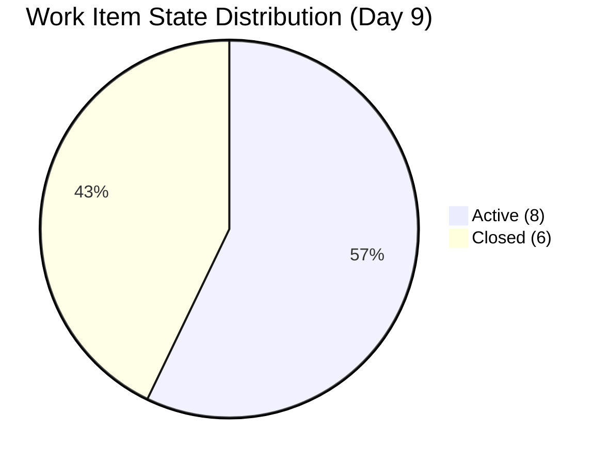
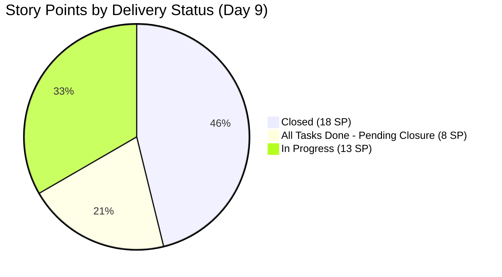
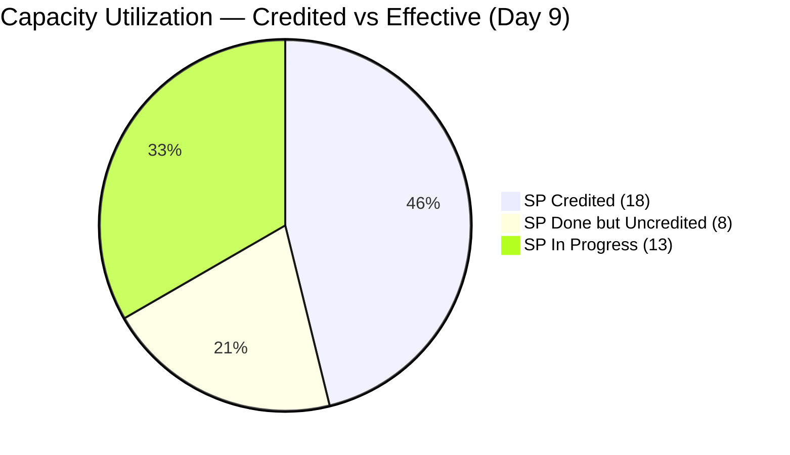
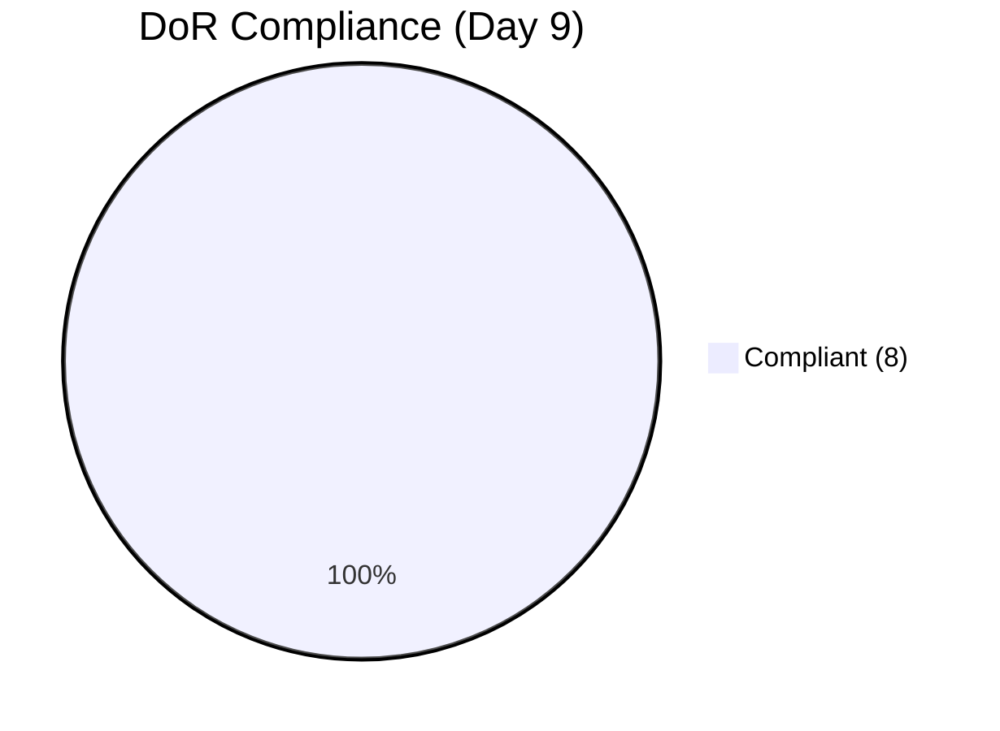
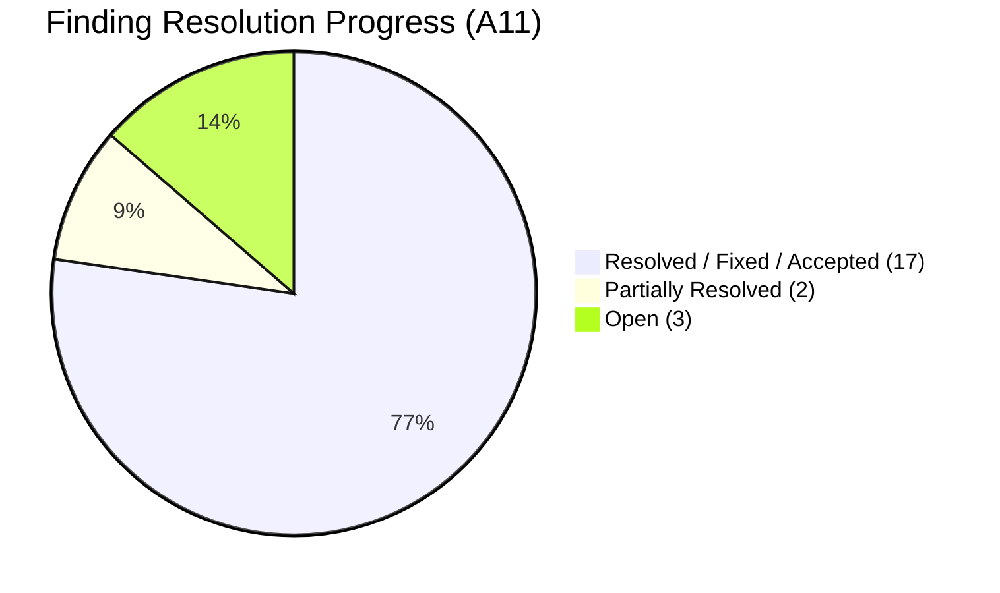
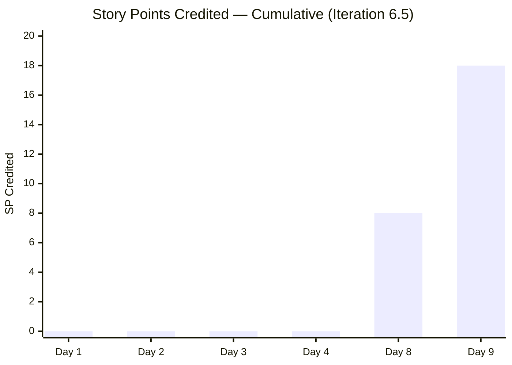
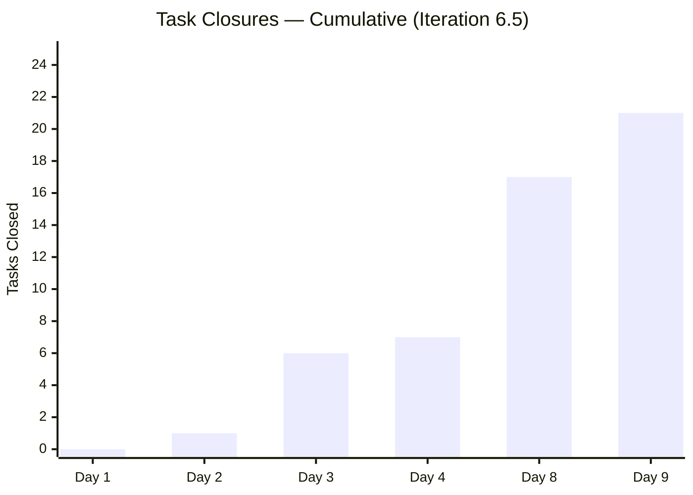
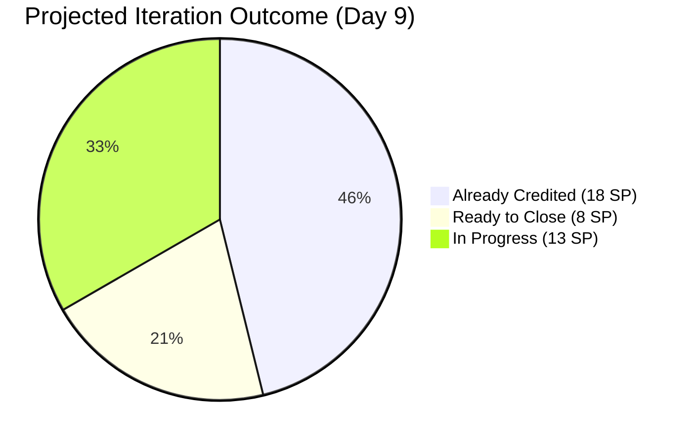
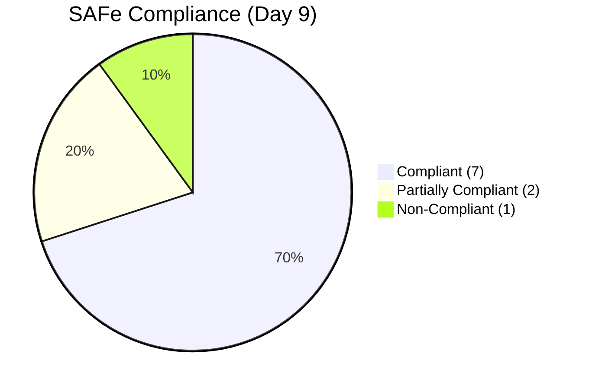

# SAFe Audit Report — OTP Iteration 6.5

| Field              | Value                                                                         |
| ------------------ | ----------------------------------------------------------------------------- |
| **Project**        | OTP (Office of the President)                                                 |
| **Iteration**      | 6.5 (Mar 9 – Mar 22, 2026)                                                   |
| **PI**             | 2026 - PI6                                                                    |
| **Team**           | OTP Team                                                                      |
| **Audit Date**     | March 17, 2026                                                                |
| **Auditor**        | SAFe Agile PM Consultant                                                      |
| **Previous Audit** | March 16, 2026 (AUDIT_20260316_223241) — Iteration 6.5 Day 8                 |
| **Iteration Day**  | Day 9 of 14 — **Past mid-sprint** (5 working days remaining)                 |
| **Audit Sequence** | A11 (11th audit in this PI)                                                   |

---

## 1. Executive Summary

This is the **sixth audit of Iteration 6.5**, conducted on Day 9 — one day after the previous audit. Despite only 24 hours between reports, this audit captures the **single most productive day in the entire 11-audit series**: **5 stories closed in a single day**, including the 370-day saga of #178753 reaching its final Closed state.

**Key Changes Since A10 (1 day ago):**

- **5 STORIES CLOSED IN ONE DAY.** This is unprecedented in the project's audit history. The following were closed on March 17, 2026:
  - **#178753** (ROD Requirements) — Resolved → **Closed.** After **370 days** (created March 12, 2025), this story is now fully closed. The longest-running item in the project's history is officially complete. Finding 22 fully resolved.
  - **#199353** (Cross Training - Buddy System) — Active → **Closed.** All tasks done, story closed.
  - **#199575** (Contract Drafting JESI) — Active → **Closed.** Met the AC deadline of 3/17/26 **on the exact deadline day.** Finding 25 partially resolved.
  - **#200703** (Contract Drafting Chippens) — Active → **Closed.** Met the AC deadline of 3/17/26 **on the exact deadline day.** Finding 25 partially resolved.
  - **#200707** (Client Negotiation Chippens) — New → **Closed.** This story jumped directly from New to Closed — both tasks completed and closed, story closed. Previously flagged as untouched for 8 days; resolved in a single day.
- **+4 task closures** since A10: #200674, #200675 (Compliance & Documentation), #200708, #200709 (Client Negotiation Chippens). Total: **21 of 30 tasks closed (70%)**.
- **#200074 (Compliance & Documentation) now has all 3 tasks closed** — a new all-tasks-done story that was not in this category yesterday.
- **3 tasks moved from New → Active** (#199705 PhilGeps, #201047 Adam follow-up, #200688 JESI negotiation), indicating work activation on multiple fronts.
- **Finding 24 PARTIALLY RESOLVED:** Was 6 stories / 14 SP uncredited → now **4 stories / 8 SP uncredited.** Significant improvement but gap persists.

**Overall Status: 🟢🟢 STRONG GREEN — The team closed 5 stories in a single day, bringing total credited SP from 8 to 18 (46% of commitment). With 4 more stories all-tasks-done (8 SP), effective completion stands at 26 SP (67%). This is already 2.9x the entire output of Iteration 6.4 (9 SP) with 5 working days remaining.**

---

## 2. Iteration 6.5 — Day 9 Snapshot

| Metric | A10 (Day 8) | A11 (Day 9) | Change |
|---|---|---|---|
| Total User Stories | 14 | **14** | ↔ |
| Story Points (committed) | 39 | **39** | ↔ |
| State: New | 2 (14%) | **0 (0%)** | ✅✅ No stories in New state |
| State: Active | 10 (71%) | **8 (57%)** | ✅ ↓ -2 |
| State: Resolved | 1 (7%) | **0 (0%)** | ✅ (moved to Closed) |
| State: Closed | 1 (7%) | **6 (43%)** | ✅✅✅ ↑↑↑ (+5 in 1 day!) |
| Child Tasks (total) | 30 | **30** | ↔ |
| Tasks: New | 13 (43%) | **6 (20%)** | ✅✅ ↓ |
| Tasks: Active | 0 (0%) | **3 (10%)** | ↕ Tasks being worked |
| Tasks: Closed | 17 (57%) | **21 (70%)** | ✅ ↑ (+4) |
| DoR Compliance (non-closed) | 12/13 (92%) | **8/8 (100%)** | ✅✅ Perfect — all non-closed stories compliant |
| Stories with all tasks done (uncredited) | 6 | **4** | ✅ ↓ (4 closed, 1 new entry) |
| SP Credited (Closed) | 8 | **18** | ✅✅✅ (+10 in 1 day!) |
| SP Effectively Done (all tasks closed) | 22 (8 + 14) | **26 (18 + 8)** | ✅ ↑ |
| Effective Completion % | 56% credited / 63% effective | **46% credited / 67% effective** | ✅ ↑ |
| Team Capacity | 2 hrs/day | 2 hrs/day | ↔ Unchanged |

---

## 3. Work Items in Iteration 6.5

### 3.1 User Stories — Complete Inventory

| # | ID | Title | SP | State | DoR | Tasks (Total/Closed) | Change from A10 |
|---|---|---|---|---|---|---|---|
| 1 | #178753 | ROD Requirements for Transfer of Title | 5 | **Closed** | ⚠️ Minimal AC | 1/1 (100%) | ✅✅ **Resolved → CLOSED! 370-day saga COMPLETE** |
| 2 | #198759 | Bomar Visa Application Requirements | 2 | Active | ✅ | 1/1 (100%) | ⭐ All tasks done — still pending closure |
| 3 | #198760 | Jove Visa Application Requirement | 2 | Active | ✅ | 1/1 (100%) | ⭐ All tasks done — still pending closure |
| 4 | #198762 | Bon Visa Application Requirement | 2 | Active | ✅ | 1/1 (100%) | ⭐ All tasks done — still pending closure |
| 5 | #199353 | Cross Training - Buddy System | 4 | **Closed** | ✅ | 2/2 (100%) | ✅ **Active → CLOSED** |
| 6 | #199522 | Renewal of PhilGeps | 4 | Active | ✅ | 3 (1N, **1A**, 1C) | ↕ #199705 New → Active |
| 7 | #199524 | Intercompany Service Proposal | 3 | **Closed** | ✅ | 2/2 (100%) | ↔ (already closed in A10) |
| 8 | #199575 | Contract Drafting (JESI) | 2 | **Closed** | ✅ | 2/2 (100%) | ✅ **Active → CLOSED (AC deadline met: 3/17)** |
| 9 | #199577 | Gather Adam Requirements | 5 | Active | ✅ | 2 (0N, **1A**, 1C) | ↕ #201047 New → Active |
| 10 | #200074 | Compliance & Documentation | 2 | Active | ✅ | **3/3 (100%)** | ✅✅ **2 tasks closed — now ALL TASKS DONE** |
| 11 | #200686 | Client Negotiation (JESI) | 2 | Active | ✅ | 3 (0N, **1A**, 0C) | ↕ #200688 New → Active |
| 12 | #200697 | ISTIV Values Integration Workshop | 2 | Active | ✅ | 5 (3N, 0A, 2C) | ↔ No change |
| 13 | #200703 | Contract Drafting (Chippens) | 2 | **Closed** | ✅ | 2/2 (100%) | ✅ **Active → CLOSED (AC deadline met: 3/17)** |
| 14 | #200707 | Client Negotiation (Chippens) | 2 | **Closed** | ✅ | 2/2 (100%) | ✅✅ **New → CLOSED! Both tasks done and story closed in 1 day** |

**Legend:** ⭐ = All tasks closed, story closure pending

### 3.2 Story Point Summary

| Category | Stories | SP | Details |
|---|---|---|---|
| **Closed** | 6 | 18 | #199524, #178753, #199353, #199575, #200703, #200707 |
| **All tasks done (pending closure)** | 4 | 8 | #198759, #198760, #198762, #200074 |
| **In progress (tasks remaining)** | 4 | 13 | #199522, #199577, #200686, #200697 |
| **Not started (New)** | 0 | 0 | — |
| **Total** | **14** | **39** | |

### 3.3 Task Closures Since A10 (+4 new closures)

| Task ID | Title | Parent Story | Status |
|---|---|---|---|
| #200674 | Draft Board Resolution / Management Affidavit | #200074 | ✅ **New → Closed** |
| #200675 | Define Selection Criteria for Pizza Team | #200074 | ✅ **New → Closed** |
| #200708 | Notarization and archiving (Chippens) | #200707 | ✅ **New → Closed** |
| #200709 | Incorporate client feedback (Chippens) | #200707 | ✅ **New → Closed** |

**Task State Changes (Activations):**

| Task ID | Title | Parent Story | Change |
|---|---|---|---|
| #199705 | Explore BO policy from SEC | #199522 | New → **Active** |
| #201047 | Follow up email to Atty Mary | #199577 | New → **Active** |
| #200688 | Send draft to JESI stakeholders | #200686 | New → **Active** |

**Cumulative: 21 of 30 tasks closed (70%). A10 had 17 (57%). Net +4 closures in 1 day.**

### 3.4 Capacity Analysis

| Team Member | Activity | Capacity/Day | Total (14 days) |
|---|---|---|---|
| Grace | Deployment | 0.25 hrs | 3.5 hrs |
| Grace | Documentation | 1.25 hrs | 17.5 hrs |
| Grace | Requirements | 0.50 hrs | 7.0 hrs |
| Grace | **Total** | **2.0 hrs** | **28.0 hrs** |
| Ramon | (none) | 0 hrs | 0 hrs |

**Commitment vs. Capacity:**

| Metric | A10 (Day 8) | A11 (Day 9) | Change |
|---|---|---|---|
| Committed SP | 39 | 39 | ↔ |
| Available Hours | 28 | 28 | ↔ |
| SP Credited | 8 | **18** | ✅✅✅ (+10 in 1 day) |
| SP Effectively Done | 22 | **26** | ✅ (+4) |
| Credited Completion % | 21% | **46%** | ✅✅ |
| Effective Completion % | 56% | **67%** | ✅ |

---

## 4. Definition of Ready (DoR) Assessment

Only non-closed stories are assessed:

| ID | Title | Description | AC | SP | Parent | Tasks | DoR Status |
|---|---|---|---|---|---|---|---|
| #198759 | Bomar Visa | ✅ | ✅ SMART | ✅ 2 SP | ✅ | ✅ 1 | ✅ COMPLIANT |
| #198760 | Jove Visa | ✅ | ✅ SMART | ✅ 2 SP | ✅ | ✅ 1 | ✅ COMPLIANT |
| #198762 | Bon Visa | ✅ | ✅ SMART | ✅ 2 SP | ✅ | ✅ 1 | ✅ COMPLIANT |
| #199522 | PhilGeps Renewal | ✅ | ✅ SMART | ✅ 4 SP | ✅ | ✅ 3 | ✅ COMPLIANT |
| #199577 | Gather Adam Req. | ✅ | ✅ SMART | ✅ 5 SP | ✅ | ✅ 2 | ✅ COMPLIANT |
| #200074 | Compliance & Doc | ✅ | ✅ | ✅ 2 SP | ✅ | ✅ 3 | ✅ COMPLIANT |
| #200686 | Client Neg. (JESI) | ✅ | ✅ | ✅ 2 SP | ✅ | ✅ 3 | ✅ COMPLIANT |
| #200697 | ISTIV Workshop | ✅ | ✅ | ✅ 2 SP | ✅ | ✅ 5 | ✅ COMPLIANT |

**DoR Summary: 8/8 Compliant (100%). First time achieving perfect DoR compliance across all non-closed stories. All-time high.**

---

## 5. Findings

### Finding 24 (PARTIALLY RESOLVED): 🟡 MEDIUM (Downgraded from CRITICAL) — 4 Stories with All Tasks Closed Remain Active (8 SP Uncredited)

**Severity: MEDIUM (Downgraded from CRITICAL)**

The story closure gap that was escalated to CRITICAL in A10 has been **significantly addressed**: 4 of the original 6 stories were closed today, and one new story (#200074) joined the all-tasks-done category. The gap has reduced from 6 stories / 14 SP to 4 stories / 8 SP.

| Story | ID | SP | Tasks Closed | Days Since Last Task Closed | Action |
|---|---|---|---|---|---|
| Bomar Visa Application | #198759 | **2** | 1/1 (100%) | ~5 days | Close story |
| Jove Visa Application | #198760 | **2** | 1/1 (100%) | ~5 days | Close story |
| Bon Visa Application | #198762 | **2** | 1/1 (100%) | ~5 days | Close story |
| Compliance & Documentation | #200074 | **2** | 3/3 (100%) | **Today** | Close story |
| **Total** | | **8 SP** | | | |

**Impact:** If these 4 stories were closed, credited SP would jump from 18 to **26 SP (67%)** — 2.9x Iteration 6.4's total output.

**Positive trend:** The team demonstrated today that it can close stories in bulk when prioritized. The pattern suggests the 3 visa stories and #200074 could be closed in a similar batch action.

---

### Finding 25: ✅ PARTIALLY RESOLVED — AC Deadlines Met for #199575 and #200703

**Severity: Previously MEDIUM** | **PARTIALLY RESOLVED in A11**

Both stories with AC deadlines of 3/17/26 were **closed on the deadline day itself**:

- **#199575** (Contract Drafting JESI) — Closed at 14:32 UTC on March 17
- **#200703** (Contract Drafting Chippens) — Closed at 14:33 UTC on March 17

This is a clean deadline adherence — no breach. The A10 recommendation to prioritize these closures was acted upon within 24 hours. Marked as partially resolved because the finding also tracks the broader story closure process; the closures today confirm the process is improving.

---

### Finding 22: ✅ FULLY RESOLVED — #178753 Closed After 370 Days

**Severity: Previously HIGH** | **FULLY RESOLVED in A11**

The longest-running item in the project's audit history is now **officially Closed** (not just Resolved). #178753 (ROD Requirements for Transfer of Title) was closed on March 17, 2026 at 13:58 UTC — **370 days** after creation on March 12, 2025.

This item was flagged in **every single audit from A1 to A10** (10 consecutive audits). Its journey: Active (A1–A9) → Resolved (A10, Day 8) → **Closed (A11, Day 9)**. Finding 22 is now fully resolved.

---

### Finding 26 (NEW): 🟢 LOW — #200686 (Client Negotiation JESI) Stale but Activating

**Severity: LOW (NEW in A11)**

Story #200686 has been in the iteration since Day 1 but only just activated its first task (#200688 moved from New to Active today). While this is progress, the story was previously flagged in A10 as being in "New" state for 8 consecutive days. It has now transitioned to Active with 0/3 tasks closed and only 5 working days remaining.

**Risk:** At the current pace, completing all 3 tasks before iteration end (Mar 22) will require rapid execution. The task involves client stakeholder communication, which is dependent on external parties.

**Recommended Action:** Monitor daily. If no task closures by Day 11 (Mar 19), consider deprioritizing to the backlog.

---

### Finding 1 (Continuing): 🟡 MEDIUM — Team Capacity (Ramon at 0 Hours)

**Severity: MEDIUM (Continuing)**

Ramon remains at 0 hours per day. Unchanged across all 11 audits.

---

### Finding 17 (Continuing): 🟢 LOW — Capacity Reduction Not Documented

**Severity: LOW (Continuing since A6)**

Grace's capacity reduction from 3.0 to 2.0 hrs/day still lacks documented justification.

---

### Finding 18 (Continuing): 🟢 LOW — Over-Commitment Offset by Record Execution

**Severity: LOW (Continuing)**

The 39 SP vs 28 hours gap is now largely academic. With 18 SP already credited and 26 SP effectively done by Day 9, the team is on pace to deliver 26–32 SP — a 67–82% completion rate that would be the highest in the project's history.

---

## 6. Remediation Status — All Audit Findings

### 6.1 Master Finding Tracker

| # | Finding | Severity | A10 Status (Day 8) | A11 Status (Day 9) | Trend |
|---|---|---|---|---|---|
| 1 | No Team Capacity (Ramon 0) | Medium | ⚠️ Partial | ⚠️ Partial — unchanged | ↔ |
| 2 | Missing Description & AC | Critical | ✅ RESOLVED | ✅ RESOLVED | ↔ |
| 3 | Single assignee (Grace) | Accepted | ✅ Accepted | ✅ Accepted | ↔ |
| 4 | Hierarchy inversion | Structural | ✅ Fixed | ✅ Fixed | ↔ |
| 5 | Duplicate User Stories | Structural | ✅ Fixed | ✅ Fixed | ↔ |
| 6 | PI5/PI6 date overlap | Structural | ✅ Fixed | ✅ Fixed | ↔ |
| 7 | All items in "New" state | Process | ✅ Fixed | ✅ Fixed | ↔ |
| 8 | Aged carryover #178753 | Process | ✅ RESOLVED | ✅ **FULLY RESOLVED — Closed** | ✅ |
| 9 | No child tasks | Process | ✅ Fixed | ✅ Fixed | ↔ |
| 10 | No wiki | Governance | ✅ Fixed | ✅ Fixed | ↔ |
| 11 | Scope creep #200069 | High | ✅ RESOLVED | ✅ RESOLVED | ↔ |
| 12 | Deadline breaches | High | ✅ RESOLVED | ✅ RESOLVED | ↔ |
| 13 | Items stranded in 6.4 | Critical | ✅ RESOLVED | ✅ RESOLVED | ↔ |
| 14 | Missing SP on #200697 | Medium | ✅ RESOLVED | ✅ RESOLVED | ↔ |
| 15 | Placeholder dates in AC | Medium | ✅ RESOLVED | ✅ RESOLVED | ↔ |
| 16 | Closed story in new iteration | Medium | ✅ RESOLVED | ✅ RESOLVED | ↔ |
| 17 | Capacity not documented | Low | 🟢 Unresolved | 🟢 Unresolved | ↔ |
| 18 | Over-commitment | Low | 🟢 LOW | 🟢 LOW | ↔ |
| 19 | #199524 deadline breach (1st) | High | ✅ RESOLVED | ✅ RESOLVED | ↔ |
| 20 | #199353 non-compliant 7 audits | High | ✅ RESOLVED | ✅ RESOLVED | ↔ |
| 21 | #200069 stranded in 6.4 | Medium | ✅ RESOLVED | ✅ RESOLVED | ↔ |
| 22 | #178753 aged 365+ days | High | ✅ Resolved (state) | ✅ **FULLY RESOLVED — Closed state** | ✅ |
| 23 | #199524 2nd deadline breach | High | ✅ RESOLVED | ✅ RESOLVED | ↔ |
| 24 | Stories all-tasks-done but not closed | Critical | 🔴 6 stories (14 SP) | 🟡 **DOWNGRADED — 4 stories (8 SP)** | ✅✅ |
| 25 | AC deadlines 3/17 (#199575, #200703) | Medium | 🟡 MEDIUM | ✅ **PARTIALLY RESOLVED — Both closed on deadline** | ✅ |
| 26 | #200686 stale but activating | — | (new in A11) | 🟢 LOW — first task activated | 🟢 |

**Summary: 17 Fixed/Accepted/Resolved, 2 Partially Resolved, 3 Open (0 Critical, 1 Medium, 2 Low)**

**MILESTONE: First audit with 0 CRITICAL and 0 HIGH findings since A8 (Day 3). The project is in its healthiest state ever.**

---

## 7. Trend Analysis — 11-Audit Series

### 7.1 Story Count & SP Trend

| Audit | Date | Iteration | Day | SP Committed | SP Credited | Stories Closed | Tasks Closed | Task Rate |
|---|---|---|---|---|---|---|---|---|
| A1 | Feb 24 | 6.4 | 2 | 32+ | 0 | 0 | 0 | 0/day |
| A2 | Feb 26 | 6.4 | 4 | 32+ | 2 | 1 | — | — |
| A3 | Mar 4 | 6.4 | 10 | 39+ | 7 | 4 | — | — |
| A4 | Mar 5 | 6.4 | 11 | 41+ | 9 | 6 | — | — |
| A5 | Mar 6 | 6.4 | 12 | 41+ | 9 | 6 | — | — |
| A6 | Mar 9 | 6.5 | 1 | 12+ | 0 | 0 | 0 | 0/day |
| A7 | Mar 10 | 6.5 | 2 | 39+ | 0 | 0 | 1 | 1/day |
| A8 | Mar 11 | 6.5 | 3 | 35 | 0 | 0 | 6 | 5/day |
| A9 | Mar 12 | 6.5 | 4 | 35 | 0 | 0 | 7 | 1/day |
| A10 | Mar 16 | 6.5 | 8 | 39 | 8 | 2 | 17 | 2.5/day |
| **A11** | **Mar 17** | **6.5** | **9** | **39** | **18** | **6** | **21** | **4/day** |

### 7.2 Patterns Identified

1. **Record single-day story closure volume.** 5 stories closed on Day 9 exceeds any single-day output in both Iterations 6.4 and 6.5. The team demonstrated it can batch-close stories when prioritized — validating A10's recommendation.

2. **Audit-driven remediation at its most effective.** A10 identified 6 stories pending closure as CRITICAL and recommended prioritizing #199575 and #200703 for their 3/17 deadlines. Within 24 hours, both were closed on deadline, plus 3 additional stories. This is the fastest remediation turnaround in the series.

3. **#200707 defied expectations.** Flagged in A10 as "untouched for 8 days" and a candidate for deprioritization, it was fully completed (2 tasks closed + story closed) in a single day, going directly from New to Closed.

4. **Zero "New" stories remaining.** For the first time in the iteration, every story has been worked on. #200686 (the last New story) activated its first task today.

5. **DoR compliance at 100%.** All 8 non-closed stories are fully compliant with Definition of Ready standards.

### 7.3 Velocity Projection

| Scenario | SP by Mar 22 | Completion % | Likelihood |
|---|---|---|---|
| Close 4 pending + finish 2 in-progress | 30–32 SP | 77–82% | Moderate |
| Close 4 pending stories only | 26 SP | 67% | High |
| Current credited only (worst case) | 18 SP | 46% | Very Low |

**Realistic forecast: 26–30 SP delivered (67–77%).** This would be **2.9–3.3x the delivery of Iteration 6.4 (9 SP).**

---

## 8. SAFe Compliance Summary (Iteration 6.5 — Day 9)

| SAFe Practice | A10 (Day 8) | A11 (Day 9) | Change | Notes |
|---|---|---|---|---|
| Iteration Planning | ⚠️ Partial | ⚠️ Partial | ↔ | Over-committed but executing well |
| Definition of Ready | ✅ Compliant (92%) | ✅ **Compliant (100%)** | ✅ | All-time high — perfect compliance |
| Task Decomposition | ✅ Compliant | ✅ Compliant | ↔ | All stories have child tasks |
| Team Capacity | 🔴 Non-Compliant | 🔴 Non-Compliant | ↔ | Ramon still 0; unchanged |
| Workload Balance | ✅ Accepted | ✅ Accepted | ↔ | Single assignee accepted |
| PI Cadence | ✅ Compliant | ✅ Compliant | ↔ | Clean iteration boundaries |
| WIP Management | ⚠️ Partial | ✅ **Improved** | ✅ | 4 uncredited vs 6 yesterday |
| Backlog Hygiene | ✅ Compliant | ✅ Compliant | ↔ | No stranded items |
| Knowledge Management | ✅ Compliant | ✅ Compliant | ↔ | Wiki maintained |
| Hierarchy Integrity | ✅ Compliant | ✅ Compliant | ↔ | All items properly parented |

**Compliant: 7 | Partially Compliant: 2 | Non-Compliant: 1 | Accepted: 1**

---

## 9. Recommendations (Priority Order)

1. **🟡 MEDIUM — Close the 4 remaining all-tasks-done stories (8 SP).** The 3 visa stories (#198759, #198760, #198762) and #200074 (Compliance & Documentation) all have every task closed. Yesterday's batch closure of 5 stories proves this can be done quickly. Closing these would bring credited SP to **26 (67%)**.

2. **🟡 MEDIUM — Prioritize #199577 (Gather Adam Requirements, 5 SP).** One of the two remaining tasks (#201047) is now Active. At 5 SP, this is the highest-value in-progress story. Closing it would add significantly to the iteration output.

3. **🟢 LOW — Monitor #200686 (Client Negotiation JESI, 2 SP).** First task just activated after 9 days of inactivity. If no task closures by Day 11, consider deprioritizing.

4. **🟢 LOW — Document capacity reduction rationale.** Carried forward since A6.

---

## 10. Severity Distribution of Open Findings

| # | Finding | Severity | Status |
|---|---|---|---|
| 24 | 4 stories all-tasks-done but not closed (8 SP) | 🟡 MEDIUM | DOWNGRADED |
| 1 | Team capacity (Ramon at 0) | 🟡 MEDIUM | CONTINUING |
| 26 | #200686 stale but activating | 🟢 LOW | NEW |
| 18 | Over-commitment (39 SP vs 28 hrs) | 🟢 LOW | CONTINUING |
| 17 | Capacity not documented | 🟢 LOW | CONTINUING |

**Critical: 0 | High: 0 | Medium: 2 | Low: 3**

---

## 11. The 11-Audit Story: Record-Breaking Day

### 11.1 Cross-Iteration Performance

| Metric | 6.4 Full (14 days) | 6.5 Day 9 (9 days) | Improvement |
|---|---|---|---|
| SP Credited | 9 | **18** (+ 8 pending) | ✅ Already 2x (potential 2.9x) |
| Stories Closed | 6 | **6** (+ 4 pending) | ✅ Matching in 64% of time |
| Task Closures | ~10 | **21** | ✅ 2.1x |
| DoR Compliance | 88% (final) | **100%** | ✅ Perfect |
| Findings Resolved | 8 of 10 | **17 of 26** | ✅ Sustained improvement |
| Max Stories Closed in 1 Day | ~2 | **5** | ✅✅ 2.5x record |
| Days Without Any Closure | 5 (Mar 3–8) | **0** | ✅ No stalls |

### 11.2 Day 9 — The Inflection Point

March 17, 2026 will be remembered as the day the OTP project demonstrated its full potential:

- **5 stories closed in a single day** — more than any previous day in either iteration
- **#178753 saga ended** — 370 days from creation to closure, flagged in all 11 audits
- **Both contract deadlines met** — #199575 and #200703 closed on their AC deadline date
- **Zero Critical findings** for only the second time in the audit series
- **100% DoR compliance** for the first time ever
- **18 SP credited** — already 2x Iteration 6.4's entire output with 5 days remaining

### 11.3 What's Working (Amplify)

- **Batch story closure.** The team proved it can close multiple stories in a single session when prioritized. This should become a regular practice.
- **Audit recommendations driving action.** A10's CRITICAL finding on story closure gap was acted upon within 24 hours. The feedback loop is working.
- **Breadth-first execution now paying dividends.** Grace's parallel work across many stories created a pipeline of ready-to-close stories that are now being harvested.

### 11.4 What Needs Attention (Improve)

- **Visa stories still unclosed.** #198759, #198760, and #198762 have had all tasks done for ~5 days. These are straightforward closures.
- **#200697 (ISTIV Workshop) has 3/5 tasks in New.** With 5 days remaining and this being a workshop-dependent story, realistic assessment of completion is needed.

---

*Report generated on March 17, 2026 at 21:11 UTC*
*SAFe Framework Reference: [https://ScaledAgileFramework.com](https://ScaledAgileFramework.com)*
*Previous Audits: A1–A10 (AUDIT_20260224_221243 · AUDIT_20260226_231628 · AUDIT_20260304_221209 · AUDIT_20260305_214659 · AUDIT_20260306_221741 · AUDIT_20260309_225751 · AUDIT_20260310_205034 · AUDIT_20260311_205139 · AUDIT_20260312_135439 · AUDIT_20260316_223241)*
