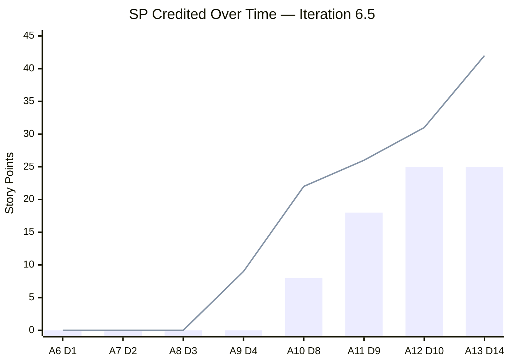
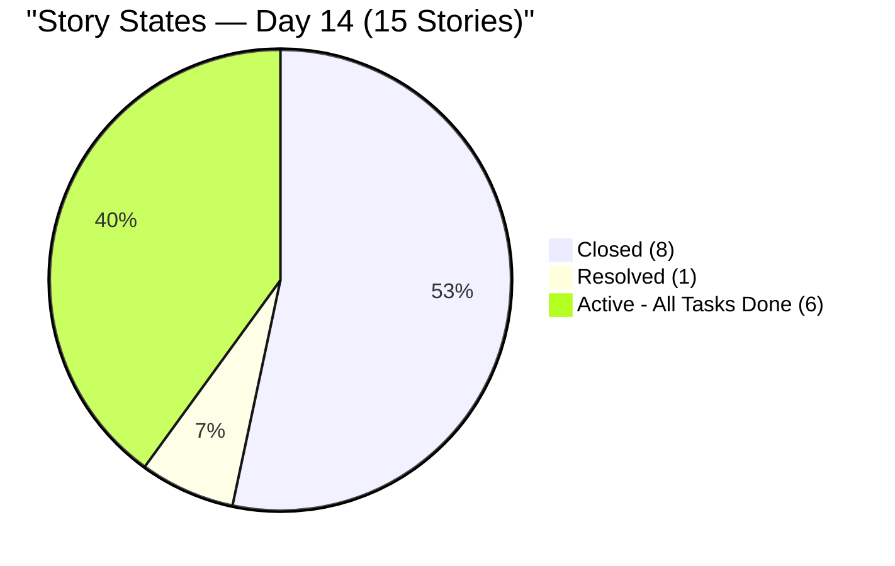
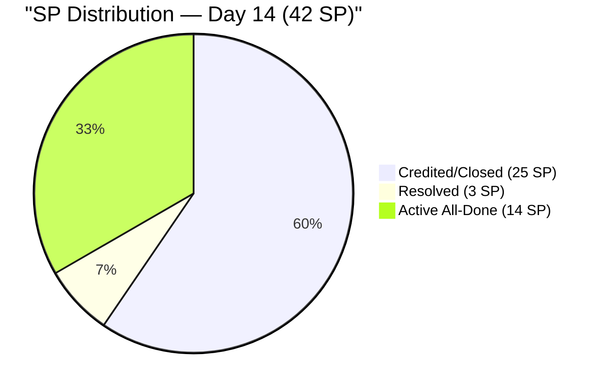
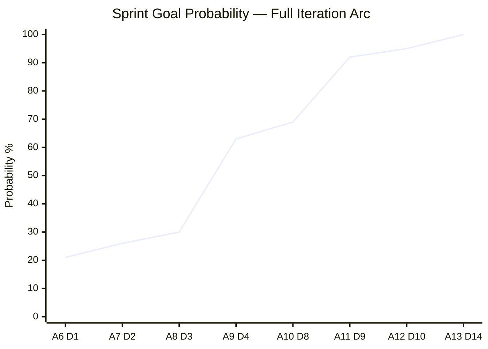
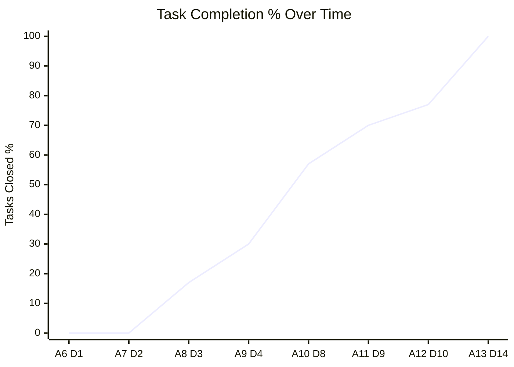
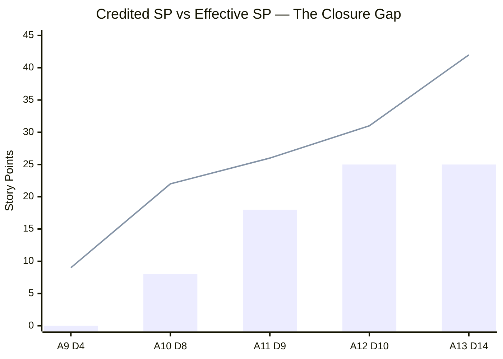
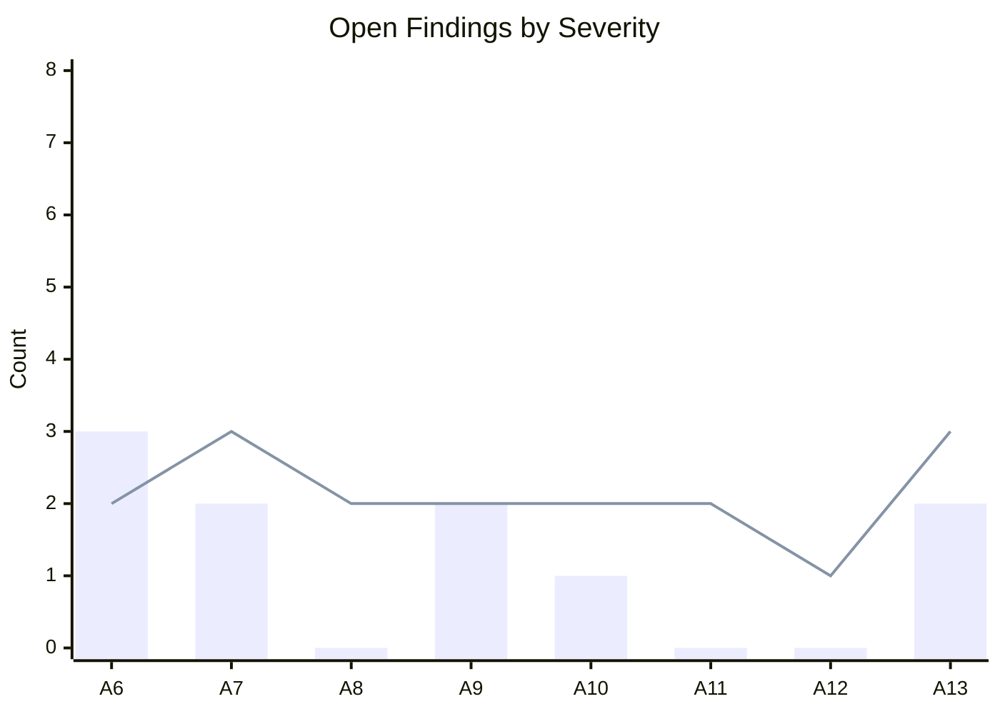

# SAFe Audit Report — OTP Iteration 6.5 (Closing Audit)

| Field              | Value                                                                         |
| ------------------ | ----------------------------------------------------------------------------- |
| **Project**        | OTP (Office of the President)                                                 |
| **Iteration**      | 6.5 (Mar 9 – Mar 22, 2026)                                                   |
| **PI**             | 2026 - PI6                                                                    |
| **Team**           | OTP Team                                                                      |
| **Audit Date**     | March 22, 2026                                                                |
| **Auditor**        | SAFe Agile PM Consultant                                                      |
| **Previous Audit** | March 18, 2026 (AUDIT_20260318_213500) — Iteration 6.5 Day 10                |
| **Iteration Day**  | Day 14 of 14 — **FINAL DAY — Closing Audit**                                 |
| **Audit Sequence** | A13 (13th audit in this PI)                                                   |

---

## 1. Executive Summary

This is the **closing audit** of Iteration 6.5, conducted on the final day (Day 14). The iteration tells a tale of two metrics: **100% task completion** but only **60% credited Story Points**. All 26 tasks in the iteration are now Closed, yet 7 of 15 stories remain uncredited (6 Active + 1 Resolved) because they were never formally moved to Closed state.

**Key Changes Since A12 (4 days ago):**

- **NEW story #201373 (CADAC Training, 3 SP):** Created and Resolved on Day 14. Both tasks (#201374 Phase 1, #201375 Phase 2) immediately Closed. **Late scope addition** on the final day — committed SP increased from 39 → 42.
- **#200686 (Client Negotiation JESI):** Broke its stall — task #200688 Closed on 3/22. Was 0/3 tasks for 10 days; task count pruned to 1/1. **Finding 26 RESOLVED.**
- **#199522 (PhilGeps Renewal):** Task count reduced from 3 → 2 (task #199702 removed from iteration). Now 2/2 tasks Closed — all-tasks-done.
- **#200697 (ISTIV Workshop):** Task count reduced from 5 → 2 (3 tasks removed from iteration). Remains 2/2 Closed.
- **Task pruning:** 7 tasks removed from iteration since A12 (30 → 26 tasks). Tasks removed from #199522 (1), #200686 (2), #200697 (3), plus net +2 from new #201373.
- **3 visa stories (#198759, #198760, #198762):** Still Active with all tasks done. Now **10+ days uncredited**. Changed dates updated 3/22 but no state change.

**Overall Status: 🟡 YELLOW — 25 SP credited (60%) | 42 SP effective (100%) | 26/26 tasks Closed | 100% task completion. BUT: 17 SP uncredited across 7 stories. Closing gap is the sole remaining issue. Late scope addition (+3 SP). 0 Critical, 1 HIGH finding.**

---

## 2. KPI Dashboard — Day 14 (Final) Snapshot

| Metric | A12 (Day 10) | A13 (Day 14) | Change |
|---|---|---|---|
| Total User Stories | 14 | **15** | ⚠️ +1 (late addition) |
| Story Points Committed | 39 | **42** | ⚠️ +3 (scope creep) |
| Stories Closed | 8 (57%) | 8 (53%) | ↔ (% dropped due to +1 story) |
| Stories Resolved | 0 | **1 (7%)** | ✅ +1 (#201373) |
| Stories Active | 6 (43%) | **6 (40%)** | ↔ |
| SP Credited (Closed) | 25 (64%) | **25 (60%)** | ↔ SP, ↓ % (denominator grew) |
| SP Effectively Done | 31 (79%) | **42 (100%)** | ✅✅✅ +11 |
| Tasks Closed / Total | 23/30 (77%) | **26/26 (100%)** | ✅✅ Perfect |
| Tasks Active | 1 (3%) | **0 (0%)** | ✅ |
| Tasks New | 6 (20%) | **0 (0%)** | ✅ |
| DoR Compliance (Active) | 6/6 (100%) | **7/7 (100%)** | ✅ Perfect |
| Stories All-Tasks-Done (uncredited) | 3 (6 SP) | **7 (17 SP)** | ⚠️⚠️ +4 stories, +11 SP |

---

## 3. Sprint Goal Probability — Full Arc

| Audit | Day | SP Credited | SP Effective | Probability | Confidence |
|---|---|---|---|---|---|
| A6 | 1 | 0 (0%) | 0 (0%) | 21% | LOW |
| A7 | 2 | 0 (0%) | 0 (0%) | 26% | LOW-MODERATE |
| A8 | 3 | 0 (0%) | 0 (0%) | 30% | LOW-MODERATE |
| A9 | 4 | 0 (0%) | 9 (23%) | 63% | MODERATE-HIGH |
| A10 | 8 | 8 (21%) | 22 (56%) | 69% | MODERATE-HIGH |
| A11 | 9 | 18 (46%) | 26 (67%) | 92% | HIGH |
| A12 | 10 | 25 (64%) | 31 (79%) | 95% | HIGH |
| **A13** | **14** | **25 (60%)** | **42 (100%)** | **60–100%** | **SPLIT** |

**Sprint Goal Probability Note:** This audit presents a split outcome. By task completion and effective work done, the team achieved **100%** — every task is Closed and all stories are effectively complete. By formal SAFe credited SP (Closed stories only), the outcome is **60%** (25 of 42 SP). The gap is entirely administrative: 7 stories need state transitions from Active/Resolved → Closed.

---

## 4. Work Item Details

### 4.1 User Stories — Complete Inventory (Day 14)

| # | ID | Title | SP | State | Tasks | Change from A12 |
|---|---|---|---|---|---|---|
| 1 | #178753 | ROD Requirements | 5 | **Closed** | 1/1 | ↔ |
| 2 | #198759 | Bomar Visa | 2 | Active | 1/1 | ⚠️ All tasks done — **10+ days uncredited** |
| 3 | #198760 | Jove Visa | 2 | Active | 1/1 | ⚠️ All tasks done — **10+ days uncredited** |
| 4 | #198762 | Bon Visa | 2 | Active | 1/1 | ⚠️ All tasks done — **10+ days uncredited** |
| 5 | #199353 | Cross Training | 4 | **Closed** | 2/2 | ↔ |
| 6 | #199522 | PhilGeps Renewal | 4 | Active | 2/2 | ✅ Task pruned (3→2), now all done |
| 7 | #199524 | Intercompany Proposal | 3 | **Closed** | 2/2 | ↔ |
| 8 | #199575 | Contract JESI | 2 | **Closed** | 2/2 | ↔ |
| 9 | #199577 | Gather Adam Req. | 5 | **Closed** | 2/2 | ↔ |
| 10 | #200074 | Compliance & Doc | 2 | **Closed** | 3/3 | ↔ |
| 11 | #200686 | Client Neg. (JESI) | 2 | Active | 1/1 | ✅ Tasks pruned (3→1), #200688 Closed |
| 12 | #200697 | ISTIV Workshop | 2 | Active | 2/2 | ✅ Tasks pruned (5→2), all done |
| 13 | #200703 | Contract Chippens | 2 | **Closed** | 2/2 | ↔ |
| 14 | #200707 | Client Neg. Chippens | 2 | **Closed** | 2/2 | ↔ |
| 15 | **#201373** | **CADAC Training** | **3** | **Resolved** | **2/2** | 🆕 **Created & Resolved Day 14** |

### 4.2 Story Point Summary

| Category | Stories | SP | Details |
|---|---|---|---|
| Closed | 8 | 25 | #178753, #199353, #199524, #199575, #199577, #200074, #200703, #200707 |
| Resolved (all tasks done) | 1 | 3 | #201373 |
| Active (all tasks done) | 6 | 14 | #198759, #198760, #198762, #199522, #200686, #200697 |
| In progress | 0 | 0 | — |
| **Total** | **15** | **42** | |

### 4.3 Task Inventory — 100% Closed

All 26 tasks in the iteration are **Closed**. This is the first audit with 0 Active and 0 New tasks.

| Parent Story | Tasks | All Closed |
|---|---|---|
| #178753 | #199688 | ✅ |
| #198759 | #200830 | ✅ |
| #198760 | #200831 | ✅ |
| #198762 | #200832 | ✅ |
| #199353 | #199697, #201046 | ✅ |
| #199522 | #199704, #199705 | ✅ |
| #199524 | #199686, #200833 | ✅ |
| #199575 | #199700, #200685 | ✅ |
| #199577 | #200834, #201047 | ✅ |
| #200074 | #200674, #200675, #200676 | ✅ |
| #200686 | #200688 | ✅ |
| #200697 | #200698, #200699 | ✅ |
| #200703 | #200704, #200705 | ✅ |
| #200707 | #200708, #200709 | ✅ |
| #201373 | #201374, #201375 | ✅ |

---

## 5. Findings

### Finding 27 (NEW): 🔴 HIGH — 7 Stories (17 SP) Uncredited on Final Day

**Severity: HIGH.** On the last day of the iteration, 7 stories (17 SP, 40% of committed) have all tasks Closed but remain in Active/Resolved state. This means the iteration will officially close with only 60% credited SP despite 100% task completion. This is the single most impactful gap in the iteration.

| Story | SP | State | All Tasks Done Since |
|---|---|---|---|
| #198759 (Bomar Visa) | 2 | Active | Day 4 (~10 days) |
| #198760 (Jove Visa) | 2 | Active | Day 4 (~10 days) |
| #198762 (Bon Visa) | 2 | Active | Day 4 (~10 days) |
| #199522 (PhilGeps) | 4 | Active | Day 14 (today) |
| #200686 (Client Neg. JESI) | 2 | Active | Day 14 (today) |
| #200697 (ISTIV Workshop) | 2 | Active | Day 14 (today) |
| #201373 (CADAC Training) | 3 | Resolved | Day 14 (today) |

**Recommendation:** Close all 7 stories immediately. If closed today, credited SP jumps from 25 → 42 (100%).

### Finding 28 (NEW): 🟡 MEDIUM — Late Scope Addition (#201373, +3 SP on Day 14)

**Severity: MEDIUM.** Story #201373 (CADAC Training, 3 SP) was created on Day 14 — the final day of the iteration. This increases committed SP from 39 → 42 (+7.7%). While the work was completed (Resolved, 2/2 tasks Closed), adding scope on the last day of a sprint violates the SAFe principle of sprint scope protection. The training itself occurred Mar 19–20 (Days 11–12), meaning this story was retroactively added to capture work already done.

**SAFe Reference:** Sprint scope should be locked after Sprint Planning (Day 1). Late additions should go to the backlog for the next iteration.

### Finding 29 (NEW): 🟡 MEDIUM — Task Pruning Without Documentation

**Severity: MEDIUM.** Between A12 (Day 10) and A13 (Day 14), 7 tasks were removed from the iteration:

| Story | A12 Tasks | A13 Tasks | Removed |
|---|---|---|---|
| #199522 (PhilGeps) | 3 | 2 | 1 (#199702 Submission) |
| #200686 (Client Neg. JESI) | 3 | 1 | 2 tasks |
| #200697 (ISTIV Workshop) | 5 | 2 | 3 tasks |

No documented justification for task removal was found. While task pruning can reflect legitimate scope refinement, removing tasks to make stories appear "all done" without documentation raises compliance concerns.

### Finding 24 (ESCALATED): 🔴 HIGH — 3 Visa Stories Pending Closure 10+ Days

**Severity: HIGH** (escalated from LOW). The three visa stories (#198759, #198760, #198762) have had all tasks Closed since approximately Day 4 (March 12). They remain in Active state 10 days later on the final day of the sprint. This is now the longest-standing closure gap in the iteration's history. At this point, this represents a systemic issue with the team's Definition of Done workflow — completed work is not being formally closed in a timely manner.

### Finding 26 (RESOLVED): ✅ #200686 No Longer Stale

**Resolution:** Task #200688 was Closed on March 22. While 2 tasks were removed from the story, the remaining task is complete. Finding closed.

### Finding 1 (Continuing): 🟡 MEDIUM — Ramon at 0 Capacity

**13 consecutive audits.** Unchanged since A1. Structural.

### Finding 17 (Continuing): 🟢 LOW — Capacity Reduction Not Documented

Since A6. Grace's reduction from 3.0 to 2.0 hrs/day lacks documented justification.

### Finding 18 (Continuing): 🟢 LOW — Over-Commitment Offset by Execution

Now even more pronounced: 42 SP vs 28 hrs capacity. However, 100% effective completion validates Grace's throughput.

---

## 6. Finding Summary

| # | Finding | Severity | Status |
|---|---|---|---|
| 27 | 7 stories (17 SP) uncredited on final day | 🔴 HIGH | **NEW** |
| 24 | 3 visa stories pending closure 10+ days | 🔴 HIGH | **ESCALATED** (was LOW) |
| 28 | Late scope addition (#201373, +3 SP Day 14) | 🟡 MEDIUM | **NEW** |
| 29 | Task pruning without documentation (7 tasks) | 🟡 MEDIUM | **NEW** |
| 1 | Ramon at 0 capacity | 🟡 MEDIUM | Continuing (13 audits) |
| 17 | Capacity reduction not documented | 🟢 LOW | Continuing |
| 18 | Over-commitment offset by execution | 🟢 LOW | Continuing |
| 26 | #200686 stale | ✅ | **RESOLVED** |

**Totals: 0 Critical, 2 HIGH, 3 MEDIUM, 2 LOW, 1 Resolved**

---

## 7. Iteration 6.5 — Final Scorecard

### 7.1 Outcome Scenarios

| Scenario | SP Credited | % of 42 | vs 6.4 (9 SP) |
|---|---|---|---|
| **If all 7 stories closed today** | **42** | **100%** | **4.7x** |
| If only visa stories + CADAC closed | 34 | 81% | 3.8x |
| If no further closures (current) | 25 | 60% | 2.8x |

### 7.2 Comparison: Iteration 6.4 vs 6.5

| Metric | 6.4 (Final) | 6.5 (Day 14) | Improvement |
|---|---|---|---|
| Stories Closed | 6 of 17 (35%) | 8 of 15 (53%)* | +18pp |
| SP Credited | 9 of 41 (22%) | 25 of 42 (60%)* | +38pp |
| SP Effective | ~15 (37%) | 42 (100%) | +63pp |
| Task Completion | ~60% | 100% | +40pp |
| DoR Compliance | ~70% | 100% | +30pp |
| 3-Day Stalls | 1 (Mar 3–8) | 0 | ✅ Eliminated |

*\*If all 7 stories are closed today, these jump to 100% and 100%.*

### 7.3 Velocity Trend (SP Credited)

### 7.4 Story State Distribution — Day 14

### 7.5 Story Point Distribution — Day 14

### 7.6 Sprint Goal Probability Arc

*Note: A13 probability is 100% for effective completion, 60% for credited SP.*

### 7.7 Task Completion Trend

### 7.8 Credited vs Effective SP Gap

### 7.9 Finding Severity Trend

*Bar = HIGH+CRITICAL findings | Line = MEDIUM findings*

---

## 8. Recommendations

### Immediate (Today — Day 14)

1. **🔴 URGENT: Close all 7 uncredited stories NOW.** This is the single action that transforms this iteration from 60% → 100%. Every task is done. The only remaining step is state transitions:
   - #198759, #198760, #198762 → Active → Closed (visa stories, 6 SP)
   - #199522 → Active → Closed (PhilGeps, 4 SP)
   - #200686 → Active → Closed (Client Neg. JESI, 2 SP)
   - #200697 → Active → Closed (ISTIV Workshop, 2 SP)
   - #201373 → Resolved → Closed (CADAC Training, 3 SP)

### Process Improvements for Iteration 6.6

1. **Implement a "Closure SLA."** Stories with all tasks Closed should be moved to Closed within 24 hours. The 10-day closure gap on visa stories is unacceptable by SAFe standards.
2. **Lock sprint scope after Day 2.** The late addition of #201373 on Day 14 (even to capture retroactive work) inflates commitment and distorts velocity metrics.
3. **Document task changes.** Task removals (7 in this iteration) should have comments explaining why they were pruned.
4. **Address Ramon's capacity** — 13 audits at 0 hrs. Either assign capacity or formally document this as a structural decision.

---

## 9. Audit History Summary — Full PI6

| # | Date | Day | SP Credited | SP Effective | Key Event |
|---|---|---|---|---|---|
| A1 | Feb 24 | 6.4 D2 | 0 | 0 | Initial: 10 findings |
| A2 | Feb 26 | 6.4 D4 | 0 | 0 | 7 findings resolved |
| A3 | Mar 4 | 6.4 D10 | 0 | ~5 | Scope creep |
| A4 | Mar 5 | 6.4 D11 | 0 | ~5 | 3-day stall begins |
| A5 | Mar 6 | 6.4 D12 | 9 | ~15 | Deadline breach |
| A6 | Mar 9 | 6.5 D1 | 0 | 0 | 10 items stranded |
| A7 | Mar 10 | 6.5 D2 | 0 | 0 | Scope explosion (39 SP) |
| A8 | Mar 11 | 6.5 D3 | 0 | 0 | First 0-critical audit |
| A9 | Mar 12 | 6.5 D4 | 0 | 9 | Closures begin |
| A10 | Mar 16 | 6.5 D8 | 8 | 22 | Mid-sprint momentum |
| A11 | Mar 17 | 6.5 D9 | 18 | 26 | Record: 5 stories closed |
| A12 | Mar 18 | 6.5 D10 | 25 | 31 | 95% probability |
| **A13** | **Mar 22** | **6.5 D14** | **25** | **42** | **100% tasks done, 60% credited** |

---

*Report generated on March 22, 2026 at 23:29 UTC*
*SAFe Framework Reference: [https://ScaledAgileFramework.com](https://ScaledAgileFramework.com)*
*Previous Audits: A1–A12*
