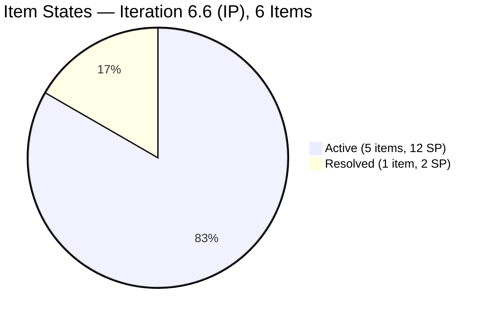
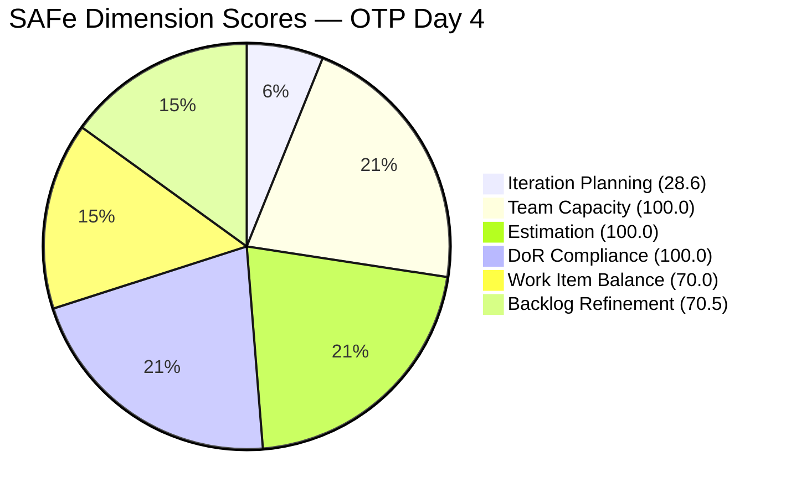

# SAFe Audit Report — OTP Team | Iteration 6.6 (IP) Day 4 (Opening Audit)

## 1. Audit Metadata

| Field | Value |
|---|---|
| **Project** | OTP (Office of the President) |
| **Project ID** | `e7739905-28a3-4ae1-9173-7f6cd13b3494` |
| **Team** | OTP Team |
| **Workspace Folder** | `ado_otp` |
| **Current Iteration** | Iteration 6.6 (IP) |
| **Iteration Path** | `OTP\2026 - PI6\Iteration 6.6 (IP)` |
| **Iteration Start** | March 23, 2026 |
| **Iteration Finish** | April 5, 2026 |
| **Iteration Day** | Day 4 of 14 (29% elapsed) |
| **Audit Date** | March 26, 2026 — 16:30 UTC |
| **Auditor** | Claude (AI EngProd Consultant) |
| **Framework** | SAFe 6.0 |
| **Scoring Rubric** | ADO SAFe v1 (six-dimension deterministic) |
| **Prior Audit** | AUDIT_20260322_232928.md (Iteration 6.5 Closing Audit, A13) |
| **Audit Sequence** | A14 — First audit of Iteration 6.6 (IP) |
| **Overall Score** | **78.2 / 100** |
| **Risk Band** | **Moderate Risk** |

---

## 2. Executive Summary

This is the **opening audit of Iteration 6.6 (IP)** — the Innovation and Planning iteration of PI6 for the OTP Team. This audit follows the Iteration 6.5 closing audit (A13, Mar 22), which recorded 25 SP credited (60%) and 42 SP effective (100%), with 7 uncredited stories as the primary gap.

**Key findings on Day 4:**

- **6 items are currently assigned to Iteration 6.6 (IP)**: 4 carry-overs from 6.5 (the visa stories and PhilGeps) and 2 new items (#200686 Client Negotiation JESI — also a 6.5 carryover, and #201132 TCT Transfer — created today and already Resolved)
- **#201132 (TCT Transfer Documents) was created and Resolved today** (Mar 26) — a new item immediately moved to Resolved state, indicating work was completed before formal planning
- **All 3 visa stories (#198759, #198760, #198762) remain Active** — these were uncredited in 6.5 and have been carried into 6.6 rather than being closed at 6.5 boundary
- **#199522 (PhilGeps Renewal) is Active** in 6.6 — also a 6.5 carryover; its tasks were Closed on Mar 22
- **100% DoR compliance** across all 6 current items — strong definition-of-ready posture maintained from 6.5
- **15 backlog items remain unassigned** to any iteration, all in OTP root — refinement opportunity for the IP period
- **2 current items are untouched since before the iteration start** (#199522, #200686, last changed Mar 22) — triggering a Backlog Refinement penalty
- **Grace's capacity is configured at 1 hr/day** (down from 2 hrs/day in Iteration 6.5)

**Team note:** Grace is the sole assignee for all OTP work items. This is an accepted structural constraint, not an audit failure.

**Overall Score: 78.2/100 (Moderate Risk)** — the team enters 6.6 (IP) with strong quality metrics but limited iteration planning depth.

---

## 3. Previous Audit Delta

### 6.5 Closing State vs 6.6 Opening State

| Metric | A13 — 6.5 Closing (Mar 22) | A14 — 6.6 Opening (Mar 26) | Delta |
|---|---|---|---|
| **Overall Score** | N/A (non-rubric closing audit) | **78.2/100** | First 6.6 score |
| **Risk Band** | — | **Moderate Risk** | — |
| **Current Iteration** | Iteration 6.5 (Mar 9–22) | **Iteration 6.6 IP (Mar 23–Apr 5)** | New iteration |
| **Items in iteration** | 15 stories | **6 items** | −9 (6.5 closed; lighter IP load) |
| **SP committed** | 42 SP (6.5 final) | **14 SP in 6 items** | Significantly lighter |
| **SP credited (6.5)** | 25 of 42 (60%) | — | 6.5 ended with 17 SP gap |
| **Stories Closed (6.5)** | 8 of 15 | — | 7 stories were uncredited at 6.5 close |
| **Visa stories (#198759, #198760, #198762)** | Active, all tasks done, uncredited | **Active in 6.6** | Carried forward; not closed |
| **#199522 (PhilGeps)** | Active, all tasks done | **Active in 6.6** | Carried forward |
| **#200686 (Client Neg. JESI)** | Active (Resolved at close) | **Active in 6.6** | Carried forward |
| **#201132 (TCT Transfer)** | Did not exist | **Resolved (new today)** | New item, immediately completed |
| **Grace capacity/day** | 2 hrs/day | **1 hr/day** | Reduced by 50% |

**Transition observation:** The 7 uncredited stories from 6.5 were not closed at iteration boundary. Four have been formally moved to 6.6 (visa stories + PhilGeps), while two others (#200686, #200697) carry into 6.6 as well. The ISTIV Workshop story (#200697) does not appear in the current 6.6 backlog — its disposition is unclear.

---

## 4. Current Iteration Snapshot

### Sprint Scope

| Metric | Value |
|---|---|
| **Root items in iteration** | 6 |
| **Total Story Points** | 14 SP |
| **Unestimated items** | 0 |
| **Items by state** | Active: 4, Resolved: 1, New: 0, Closed: 1* |
| **Iteration type** | IP (Innovation & Planning) |

*Note: #201132 is in Resolved state (completed today). No items are formally Closed yet.

### State Distribution

| State | Count | SP | Items |
|---|---|---|---|
| **Active** | 4 | 10 SP | #198759, #198760, #198762, #199522 |
| **Resolved** | 1 | 2 SP | #201132 (TCT Transfer — new today) |
| **Active** | 1 | 2 SP | #200686 (Client Neg. JESI) |

### Team Capacity

| Member | Capacity/Day | Activity | Items | SP |
|---|---|---|---|---|
| **grace** | 1 hr | Documentation | 6 | 14 SP |
| **TOTAL** | **1 hr/day** | — | **6** | **14 SP** |

> Grace is the sole assignee for all OTP work items. This is an accepted structural constraint per team agreement. The capacity reduction from 2 hrs/day (6.5) to 1 hr/day is noted as a potential concern.

---

## 5. Work Item Analysis

### Current Iteration Items (6 Items)

| ID | Type | Title | State | SP | Changed | Origin |
|---|---|---|---|---|---|---|
| #198759 | User Story | Bomar Visa (US B1/B2) | Active | 2 | Mar 25 | Carried from 6.5 (all tasks done since ~Day 4 of 6.5) |
| #198760 | User Story | Jove Visa (US B1/B2) | Active | 2 | **Mar 26** | Carried from 6.5 (all tasks done since ~Day 4 of 6.5) |
| #198762 | User Story | Bon Visa (US B1/B2) | Active | 2 | **Mar 26** | Carried from 6.5 (all tasks done since ~Day 4 of 6.5) |
| #199522 | User Story | PhilGeps Platinum Renewal | Active | 4 | Mar 22 | Carried from 6.5 (all tasks Closed Mar 22) |
| #200686 | User Story | Client Negotiation JESI | Active | 2 | Mar 22 | Carried from 6.5 (task Closed Mar 22) |
| #201132 | User Story | TCT Transfer Documents | Resolved | 2 | **Mar 26** | NEW — created and resolved today |

### Carryover Analysis

All 5 pre-existing items in 6.6 were unresolved/uncredited at the close of Iteration 6.5:

| ID | 6.5 Closing State | Tasks at 6.5 Close | 6.6 Opening State | Gap |
|---|---|---|---|---|
| #198759 | Active | 1/1 Closed | Active | Uncredited 14+ days |
| #198760 | Active | 1/1 Closed | Active | Uncredited 14+ days |
| #198762 | Active | 1/1 Closed | Active | Uncredited 14+ days |
| #199522 | Active | 2/2 Closed | Active | All tasks done; state not advanced |
| #200686 | Active | 1/1 Closed | Active | All tasks done; state not advanced |

> All 5 carryovers have had their tasks Closed since 6.5. The work is done. The only remaining action is story state transitions to Closed.

### Non-Current Backlog (15 items)

All 15 non-current items are in the OTP root (no iteration assigned):

| ID | Type | State | SP | Changed | DoR Status |
|---|---|---|---|---|---|
| #157728 | User Story | New | 2 | Feb 03 | Partial (desc OK, AC too short) |
| #175360 | User Story | New | 2 | Feb 24 | Fail (no AC) |
| #175361 | User Story | New | 2 | Feb 24 | Fail (no AC) |
| #175362 | User Story | New | 3 | Feb 24 | Fail (no desc, no AC) |
| #175363 | User Story | New | 5 | Feb 24 | Fail (no desc, no AC) |
| #175365 | User Story | New | 5 | Feb 24 | Fail (no desc, no AC) |
| #184001 | User Story | New | 2 | Feb 24 | Pass |
| #191906 | User Story | New | 5 | Feb 24 | Fail (no desc, no AC) |
| #191933 | User Story | New | 1 | Feb 24 | Pass |
| #195284 | User Story | New | 2 | Feb 01 | Pass |
| #195285 | User Story | New | 2 | Feb 23 | Fail (no desc, no AC) |
| #198587 | User Story | New | 3 | Feb 23 | Partial (AC too short) |
| #199835 | User Story | New | 2 | Feb 27 | Pass |
| #200073 | User Story | New | 2 | Mar 09 | Pass |
| #200681 | User Story | New | 2 | Mar 09 | Partial (no AC) |

> IP iterations are ideal for backlog refinement. These 15 items offer significant grooming opportunity during the 6.6 (IP) period.

---

## 6. SAFe Compliance Scorecard

| # | Dimension | Score | Evidence | Notes |
|---|---|---|---|---|
| 1 | **Iteration Planning** | **28.6** | 6 of 21 visible items in current iteration | IP iteration with 15 items unscheduled; lightweight IP load is expected |
| 2 | **Team Capacity** | **100.0** | 1/1 contributor with work has capacity configured | Grace: 1 hr/day Documentation; single-assignee model accepted |
| 3 | **Estimation** | **100.0** | 6/6 point-eligible items have SP > 0 | All items estimated |
| 4 | **DoR Compliance** | **100.0** | 6/6 current items have Description ≥ 30 chars and AC ≥ 20 chars | Strong quality posture maintained from 6.5 |
| 5 | **Work Item Balance** | **70.0** | All 6 current items are User Stories (100% concentration) | −30 penalty: dominant type > 60%; IP iteration naturally skews to User Stories |
| 6 | **Backlog Refinement** | **70.5** | 19/21 items fresh; 0 stale_90; 0 stale_180; 2/6 current items untouched (33%) | −20 penalty: untouched > 30% of current items (#199522, #200686 last changed Mar 22, before iter start) |
| | **Overall** | **78.2** | Average of 6 dimensions | **Moderate Risk** (60–79.9) |

### Score Computation Detail

| Dimension | Formula | Calculation | Result |
|---|---|---|---|
| Iteration Planning | current / visible × 100 | 6 / 21 × 100 | 28.6 |
| Team Capacity | cap_with_work / work_assignees × 100 | 1 / 1 × 100 | 100.0 |
| Estimation | estimated / point_eligible × 100 | 6 / 6 × 100 | 100.0 |
| DoR Compliance | dor_compliant / current × 100 | 6 / 6 × 100 | 100.0 |
| Work Item Balance | 100 − penalties | 100 − 30 (dominant > 60%) | 70.0 |
| Backlog Refinement | base(90.5) − penalties | 90.5 − 20 (untouched > 30%) | 70.5 |
| **Overall** | average(all 6) | (28.6+100+100+100+70+70.5)/6 | **78.2** |

**Backlog Refinement penalty detail:**

- `fresh` = 19/21 = 90.5% (items #157728 and #195284 last changed Feb 3 and Feb 1 — within 45-day window since Feb 9 is the threshold, these are NOT fresh)
- `stale_90` = 0 (no items changed before Dec 27, 2025) → no penalty
- `stale_180` = 0 → no penalty
- `untouched` = 2/6 current items (33.3%) changed before iteration start (Mar 23) → penalty −20 (> 30%)

---

## 7. Dimension Findings

### 7.1 Iteration Planning (28.6/100)

Only 6 of 21 visible backlog items are assigned to the current iteration. This is the lowest dimension score and is structurally expected for an IP iteration where the primary focus is planning, retrospective, and backlog grooming rather than delivery. However, the IP period is an opportunity to schedule the 15 unassigned backlog items into PI7 iterations — currently none have been assigned.

**Assessment:** Planning depth is very light. The IP period should produce iteration assignments for at least the next 3-4 iterations of PI7.

### 7.2 Team Capacity (100.0/100)

Grace is the sole contributor with work in this iteration and has capacity configured (1 hr/day, Documentation). The formula returns 100.0. The single-assignee model is an accepted structural constraint for OTP and is not penalized.

**Concern:** Grace's capacity dropped from 2 hrs/day in Iteration 6.5 to 1 hr/day in 6.6 (IP). With 14 SP committed to 6 items, the committed load appears manageable for an IP period, but any new items added mid-iteration would need to account for the reduced capacity baseline.

### 7.3 Estimation (100.0/100)

All 6 current items have Story Points assigned. This continues the 100% estimation rate from Iteration 6.5's later audits.

### 7.4 DoR Compliance (100.0/100)

All 6 current items have adequate Description (≥ 30 chars) and Acceptance Criteria (≥ 20 chars). The visa stories carry particularly strong DoR artifacts — detailed DS-160 process descriptions and SMART acceptance criteria. The PhilGeps and JESI items also have thorough documentation.

**Notable:** #201132 (TCT Transfer Documents, created today) already has a full DoR-compliant description and acceptance criteria, suggesting it was drafted before being entered into ADO.

### 7.5 Work Item Balance (70.0/100)

All 6 current items are User Stories, resulting in 100% type concentration. The −30 penalty applies. This is expected for an IP iteration focused on compliance, legal processes, and operational carry-overs. The absence of Enablers or Spikes reflects the operational (non-technical) nature of the OTP team's work.

### 7.6 Backlog Refinement (70.5/100)

Base score: 90.5% (19/21 items fresh). Items #157728 (Feb 3) and #195284 (Feb 1) fall just outside the 45-day freshness window. Neither crosses the 90-day threshold, so no additional stale penalties apply. However, the −20 penalty for untouched current items (33.3% > 30% threshold) brings the score to 70.5.

**Untouched items:** #199522 and #200686 were last changed on March 22 — one day before the iteration started. They were not updated on or after March 23 (the iteration start date), making them technically "untouched" in this iteration. These are carryover stories with all tasks Closed; their state transitions to Closed are the only remaining actions.

**Path to improvement:** Closing #199522 and #200686 (as recommended) would update their ChangedDate to today (March 26), moving them out of the "untouched" category and eliminating the −20 penalty. This would push Backlog Refinement from 70.5 to 90.5, and Overall from 78.2 to ~81.5 (Low Risk).

---

## 8. Risks and Bottlenecks

| # | Risk | Severity | Evidence | Recommended Action |
|---|---|---|---|---|
| R1 | **5 carryover stories have all tasks done but remain Active** | HIGH | #198759, #198760, #198762, #199522, #200686 — all tasks Closed since 6.5; 14+ days uncredited for visa stories | Close all 5 today: state transitions Active → Closed |
| R2 | **Untouched carryovers triggering Backlog Refinement penalty** | MEDIUM | #199522 and #200686 last changed Mar 22; classified as untouched in 6.6 | Closing these items updates ChangedDate and eliminates the −20 penalty |
| R3 | **Iteration Planning depth very low (28.6)** | MEDIUM | 15 backlog items in OTP root with no iteration assignment | Use IP period to assign backlog items to PI7 iterations |
| R4 | **Grace capacity halved (2h → 1h/day)** | MEDIUM | No documented reason for reduction from 6.5 to 6.6 | Document rationale; monitor for impact on IP-period backlog grooming activities |
| R5 | **15 backlog items lack DoR compliance** | MEDIUM | Most items in OTP root have missing or incomplete Description and AC | IP period is ideal for bulk DoR cleanup; 9 of 15 items need AC authoring |
| R6 | **#200697 (ISTIV Workshop) disposition unknown** | LOW | Was Active in 6.5 (all tasks done); not found in 6.6 backlog | Verify: was it Closed? Removed? Needs tracking |
| R7 | **#201132 retroactive closure pattern** | LOW | New item created and immediately Resolved on Day 4 (same-day entry and resolution) | Work was completed before formal planning; consistent with Finding 28 from 6.5 (late scope addition pattern) |
| R8 | **IP period with no Spike or Enabler items** | LOW | 100% User Stories; no innovation, technical debt, or process improvement items planned | Consider adding 1 Spike for process improvement (e.g., closure workflow automation) |

---

## 9. Prioritized Recommendations

| Priority | Action | Owner | Expected Outcome | Target |
|---|---|---|---|---|
| **P1** | **Close #198759, #198760, #198762, #199522, #200686** — All tasks are done. These 5 stories require only state transitions (Active → Closed). Closing them today would credit 12 additional SP, clean up the backlog, and improve Backlog Refinement from 70.5 to ~90.5. | Grace | Score improves from 78.2 to ~81.5 (Low Risk); eliminates R1, R2 | **Today** |
| **P2** | **Close #201132 (TCT Transfer)** — Currently in Resolved state. Transition to Closed to formally complete this item. | Grace | Fully credits 2 SP; clears Resolved queue | Today |
| **P3** | **Assign backlog items to PI7 iterations** — The IP period (Mar 23–Apr 5) is the designated time for PI planning. Assign the 15 unscheduled OTP backlog items to PI7 iterations based on priority and capacity. | Grace / Ramon | Improves Iteration Planning for future audits; reduces planning debt | By Day 10 (Apr 1) |
| **P4** | **Author DoR for 9 backlog items missing AC** — Items #175360, #175361, #175362, #175363, #175365, #191906, #195285, #200681 need Acceptance Criteria added. #175360 and #175361 also need Description updates. | Grace | Improves backlog readiness for PI7; positions items for immediate Active use | During IP period |
| **P5** | **Document Grace's capacity reduction** — The drop from 2 hrs/day to 1 hr/day should be formally noted in the iteration settings or a comment. | Ramon / Grace | Creates audit trail; addresses R4 (Finding 17 from prior PI) | Day 4-5 |
| **P6** | **Verify disposition of #200697 (ISTIV Workshop)** — Confirm whether it was Closed, removed from the project, or needs action. | Ramon / Grace | Closes R6; ensures no work falls through the gaps | Day 4-5 |

---

## 10. Evidence Gaps and Limitations

| # | Gap | Impact | Mitigation |
|---|---|---|---|
| G1 | **6.5 → 6.6 closure gap not formally resolved** | 7 stories were uncredited at 6.5 close; recommendation to close them was in A13 but not actioned before iteration boundary | Documented in R1; immediate closure in 6.6 is the highest-priority action |
| G2 | **Iteration Planning score is structurally low for IP iterations** | 28.6 reflects that IP iterations carry fewer items by design | Noted in findings; score is expected; more meaningful metric is backlog assignment completeness |
| G3 | **#200697 (ISTIV Workshop) absent from backlog** | Item existed in 6.5 but is not in the current visible backlog; its state is unknown | Flagged as R6; requires manual investigation |
| G4 | **Grace capacity reduction not documented** | System shows 1h/day for 6.6 vs 2h/day for 6.5; no ADO comment or iteration note explains this | Finding 17 from prior PI is still unresolved; documented as R4 |
| G5 | **Single-assignee model limits capacity metric** | D2 (Team Capacity) always scores 100.0 because the single contributor always has capacity; the metric does not capture utilization risk | Structural constraint noted; single-assignee is accepted per project exception |
| G6 | **#201132 same-day entry and resolution** | Work was clearly performed before the item was created; retroactive ADO entry is inconsistent with SAFe sprint scope protection | Consistent with Finding 28 pattern from 6.5; recommend establishing a "log-as-you-go" practice |

---

## 11. Iteration 6.5 → 6.6 Transition Summary

| Aspect | 6.5 Final State | 6.6 Opening Action Needed |
|---|---|---|
| **SP Credited** | 25/42 (60%) | Close 5 carryover stories to formally credit remaining 12 SP |
| **Uncredited Stories** | 7 stories (17 SP) | 5 moved to 6.6 (Active); 2 unaccounted for |
| **Task Completion** | 100% (26/26 tasks) | No task action needed |
| **Closure SLA** | 10+ days uncredited for visa stories | Implement within-24h closure rule |
| **Capacity** | 2 hrs/day | Reduced to 1 hr/day — document reason |
| **DoR** | 100% | Sustained at 100% |

---

*Report generated: March 26, 2026 16:30 UTC | SAFe 6.0 Framework | ADO SAFe v1 Rubric*
*OTP — OTP Team | Iteration 6.6 (IP): Mar 23 – Apr 5, 2026*
*Overall Score: 78.2/100 (Moderate Risk) | Day 4 of 14 (29% elapsed) | A14*
*Previous: AUDIT_20260322_232928.md (6.5 Closing, A13) | First 6.6 audit*
