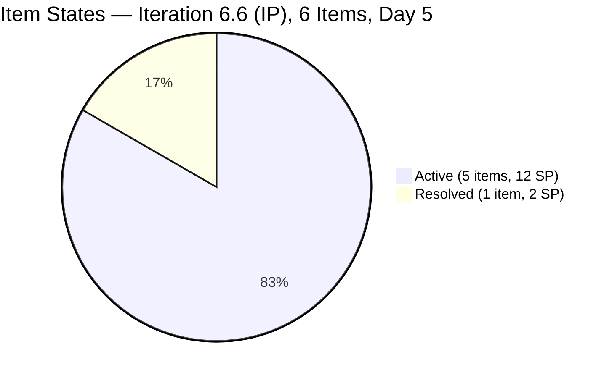
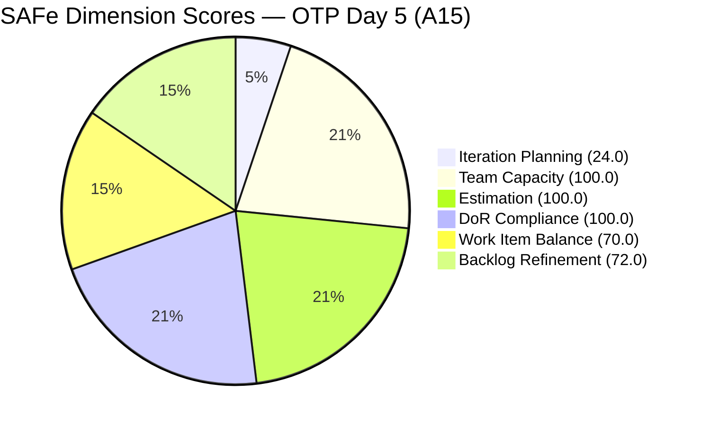
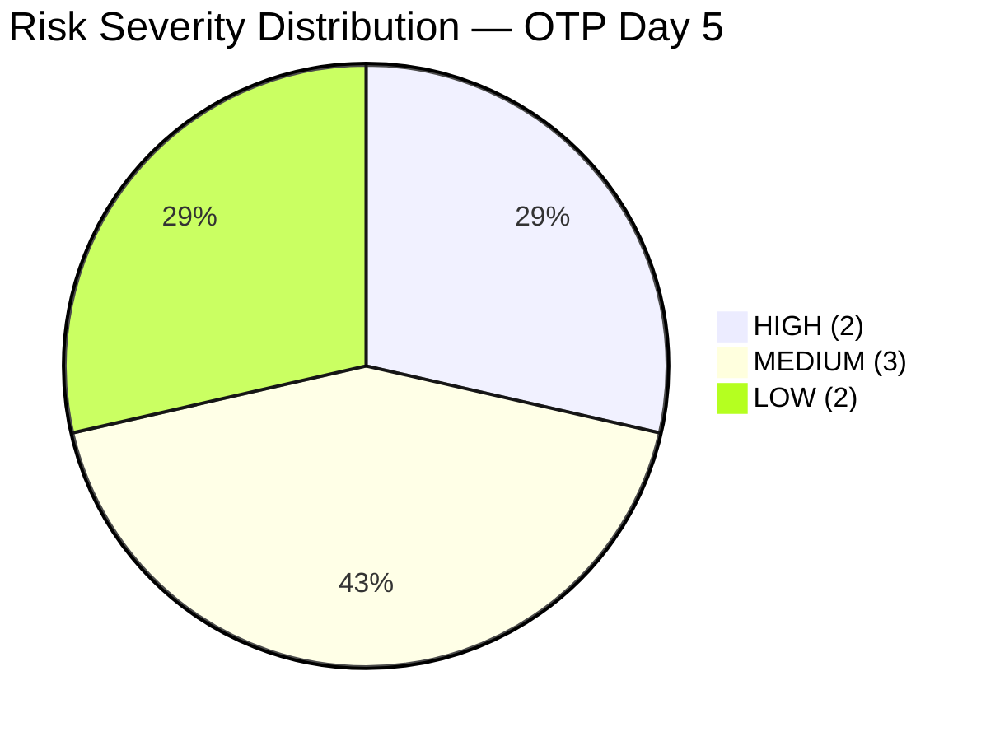

# SAFe Audit Report — OTP Team | Iteration 6.6 (IP) Day 5

## 1. Audit Metadata

| Field | Value |
|---|---|
| **Project** | OTP (Office of the President) |
| **Project ID** | `e7739905-28a3-4ae1-9173-7f6cd13b3494` |
| **Team** | OTP Team |
| **Workspace Folder** | `ado_otp` |
| **Current Iteration** | Iteration 6.6 (IP) |
| **Iteration Path** | `OTP\2026 - PI6\Iteration 6.6 (IP)` |
| **Iteration Start** | March 23, 2026 |
| **Iteration Finish** | April 5, 2026 |
| **Iteration Day** | Day 5 of 14 (36% elapsed) |
| **Audit Date** | March 27, 2026 |
| **Auditor** | Claude (AI EngProd Consultant) |
| **Framework** | SAFe 6.0 |
| **Scoring Rubric** | ADO SAFe v1 (six-dimension deterministic) |
| **Prior Audit** | AUDIT_20260326_1630.md (A14, Day 4, Score: 78.2/100) |
| **Audit Sequence** | A15 — Day 5 of Iteration 6.6 (IP) |
| **Overall Score** | **77.7 / 100** |
| **Risk Band** | **Moderate Risk** |

---

## 2. Executive Summary

This is the **Day 5 audit of Iteration 6.6 (IP)** for the OTP Team (A15). The overall score declined marginally from 78.2 to 77.7 (−0.5). The team remains in the **Moderate Risk** band. The score regression is driven by two compounding factors: (1) the **Day 4 high-priority action items were not completed** — #199522 and #200686 remain Active with tasks done and no state transition — and (2) **four new backlog items were added today**, expanding the visible backlog from 21 to 25 items and reducing the Iteration Planning score.

**Key findings on Day 5:**

- **#199522 (PhilGeps Renewal) and #200686 (Client Negotiation JESI) are still Active** — the Day 4 P1 recommendation to close both items has not been actioned; they remain "untouched" within this iteration (last changed Mar 22, before iteration start), sustaining the Backlog Refinement −20 penalty
- **4 new User Stories were added today** — all are part of a new Solar Panel installation initiative for the Davao office (#201807, #201811, #201815 in OTP root; #201820 in PI6 root). This expands the non-current backlog from 15 to 19 items
- **Current iteration remains at 6 items** — unchanged from Day 4; no new items entered the current iteration
- **#201132 (TCT Transfer Documents) remains in Resolved state** — still not Closed; the Day 4 P2 recommendation was not actioned
- **Backlog Refinement improved slightly** from 70.5 (Day 4) to 72.0 (Day 5) due to the new items being freshly added today, raising the fresh ratio from 19/21 to 23/25 — but the untouched penalty persists
- **Grace's capacity is 1 hr/day** — consistent with Day 4

**Team note:** Grace is the sole assignee for all OTP work items. This is an accepted structural constraint, not a scoring penalty.

**Overall Score: 77.7/100 (Moderate Risk)** — trajectory is slightly downward; closing 2 carryover stories would immediately restore the score to approximately 81.5 (Low Risk).

---

## 3. Previous Audit Delta

| Metric | A14 — Day 4 (Mar 26, 16:30 UTC) | A15 — Day 5 (Mar 27) | Delta |
|---|---|---|---|
| **Overall Score** | 78.2/100 | **77.7/100** | **−0.5** |
| **Risk Band** | Moderate Risk | Moderate Risk | Stable (downward pressure) |
| **Current Iteration Items** | 6 | **6** | Stable |
| **Visible Backlog** | 21 items | **25 items** | **+4** (solar panel initiative) |
| **Iteration Planning** | 28.6 (6/21) | **24.0 (6/25)** | **−4.6** |
| **Estimation** | 100.0 | **100.0** | Stable |
| **DoR Compliance** | 100.0 | **100.0** | Stable |
| **Team Capacity** | 100.0 | **100.0** | Stable |
| **Work Item Balance** | 70.0 | **70.0** | Stable |
| **Backlog Refinement** | 70.5 | **72.0** | **+1.5** (more fresh items) |
| **#199522 closed?** | No (Active) | **No (Active)** | Not actioned |
| **#200686 closed?** | No (Active) | **No (Active)** | Not actioned |
| **#201132 closed?** | No (Resolved) | **No (Resolved)** | Not actioned |
| **New backlog items today** | 0 | **4** (#201807, #201811, #201815, #201820) | Solar initiative |

**Critical observation:** Both Day 4 P1 actions (close #199522 and #200686) were not completed. These two items are the single biggest lever for score improvement: closing them would update their ChangedDate, remove the untouched penalty, and push Backlog Refinement from 72.0 to 92.0 — lifting the Overall score from 77.7 to approximately 81.3 (Low Risk band).

---

## 4. Current Iteration Snapshot

### Sprint Scope

| Metric | Value |
|---|---|
| **Root items in iteration** | 6 |
| **Total Story Points** | 14 SP |
| **Unestimated items** | 0 |
| **Items by state** | Active: 5, Resolved: 1 |
| **Iteration type** | IP (Innovation & Planning) |
| **Iteration elapsed** | 36% (Day 5 of 14) |

### State Distribution

| State | Count | SP | Items |
|---|---|---|---|
| **Active** | 5 | 12 SP | #198759, #198760, #198762, #199522, #200686 |
| **Resolved** | 1 | 2 SP | #201132 (TCT Transfer — resolved Mar 26) |

### Team Capacity

| Member | Capacity/Day | Activity | Items | SP |
|---|---|---|---|---|
| **grace** | 1 hr | Documentation | 6 | 14 SP |
| **TOTAL** | **1 hr/day** | — | **6** | **14 SP** |

> Grace is the sole assignee for all OTP work items. Single-assignee model is an accepted structural constraint per project exception.

---

## 5. Work Item Analysis

### Current Iteration Items (6 Items)

| ID | Type | Title | State | SP | Changed | DoR | Notes |
|---|---|---|---|---|---|---|---|
| #198759 | User Story | Bomar Visa (US B1/B2) | Active | 2 | Mar 25 | Pass | All tasks done since 6.5; pending state transition |
| #198760 | User Story | Jove Visa (US B1/B2) | Active | 2 | Mar 26 | Pass | All tasks done since 6.5; pending state transition |
| #198762 | User Story | Bon Visa (US B1/B2) | Active | 2 | Mar 26 | Pass | All tasks done since 6.5; pending state transition |
| #199522 | User Story | PhilGeps Platinum Renewal | Active | 4 | **Mar 22** | Pass | Tasks Closed Mar 22; **untouched in this iteration — close today** |
| #200686 | User Story | Client Negotiation JESI | Active | 2 | **Mar 22** | Pass | Task Closed Mar 22; **untouched in this iteration — close today** |
| #201132 | User Story | TCT Transfer Documents | Resolved | 2 | Mar 26 | Pass | Created and Resolved on Day 4; needs Closed transition |

> Items #199522 and #200686 are highlighted because they are the only items creating a Backlog Refinement penalty. Their tasks were completed in Iteration 6.5. The only remaining action is a state transition from Active → Closed.

### New Backlog Items Added Today (Not in Current Iteration)

| ID | Type | Title | State | SP | Iter Path | DoR |
|---|---|---|---|---|---|---|
| #201807 | User Story | Davao Office Solar Assessment | New | 2 | OTP (root) | Pass (desc+AC present) |
| #201811 | User Story | Solar Provider Selection & Procurement | New | 2 | OTP (root) | Pass (desc+AC present) |
| #201815 | User Story | Solar Panel Installation | New | 2 | OTP (root) | Pass (desc+AC present) |
| #201820 | User Story | Solar Monitoring & Commissioning | New | 2 | OTP/2026-PI6 | Pass (desc+AC present) |

> All 4 new items are part of a solar panel initiative for the Davao office. They are well-formed (DoR-compliant) but unscheduled. The IP period is the right time to assign these to PI7 iterations.

### Non-Current Backlog (19 items)

| Location | Count | DoR Status |
|---|---|---|
| OTP root (no iteration) | 18 | Mixed — 9 items need AC authoring; 4 new solar items are DoR-compliant |
| OTP/2026-PI6 (root level) | 1 | #201820 — DoR-compliant, new today |

---

## 6. SAFe Compliance Scorecard

| # | Dimension | Score | Evidence | Notes |
|---|---|---|---|---|
| 1 | **Iteration Planning** | **24.0** | 6 of 25 visible items in current iteration | −4.6 from Day 4; 4 new backlog items added today increased denominator |
| 2 | **Team Capacity** | **100.0** | 1/1 contributor with work has capacity configured | Grace: 1 hr/day; single-assignee model accepted |
| 3 | **Estimation** | **100.0** | 6/6 point-eligible items have SP > 0 | All items estimated; no change from Day 4 |
| 4 | **DoR Compliance** | **100.0** | 6/6 current items have Description ≥ 30 chars and AC ≥ 20 chars | Maintained from Day 4 |
| 5 | **Work Item Balance** | **70.0** | All 6 current items are User Stories (100% concentration) | −30 penalty: dominant type > 60% |
| 6 | **Backlog Refinement** | **72.0** | 23/25 items fresh; 0 stale_90; 0 stale_180; 2/6 current items untouched (33.3%) | −20 penalty persists: #199522 and #200686 not closed; base improved to 92.0 |
| | **Overall** | **77.7** | Average of 6 dimensions | **Moderate Risk** (60–79.9) |

### Score Computation Detail

| Dimension | Formula | Calculation | Result |
|---|---|---|---|
| Iteration Planning | current / visible × 100 | 6 / 25 × 100 | 24.0 |
| Team Capacity | cap_with_work / work_assignees × 100 | 1 / 1 × 100 | 100.0 |
| Estimation | estimated / point_eligible × 100 | 6 / 6 × 100 | 100.0 |
| DoR Compliance | dor_compliant / current × 100 | 6 / 6 × 100 | 100.0 |
| Work Item Balance | 100 − penalties | 100 − 30 (dominant > 60%) | 70.0 |
| Backlog Refinement | base(92.0) − penalties | 92.0 − 20 (untouched > 30%) | 72.0 |
| **Overall** | average(all 6) | (24.0+100+100+100+70+72.0)/6 | **77.7** |

**Backlog Refinement detail:**

- `fresh` = 23/25 = 92.0% (items #157728, Feb 3 and #195284, Feb 1 fall outside 45-day window)
- `stale_90` = 0 → no penalty
- `stale_180` = 0 → no penalty
- `untouched` = 2/6 current items (33.3%) changed before iteration start (Mar 23) → penalty −20

**Score if #199522 and #200686 were closed today:**

- `untouched` drops to 0/6 → penalty removed
- Backlog Refinement: 92.0 − 0 = **92.0**
- Overall: (24.0+100+100+100+70+92.0)/6 = **81.0** (**Low Risk**)

---

## 7. Dimension Findings

### 7.1 Iteration Planning (24.0/100)

6 of 25 visible backlog items are in the current iteration. This score regressed −4.6 from Day 4 (28.6) because 4 new solar initiative items were added to the backlog today without being assigned to an iteration. While adding well-formed backlog items is positive behavior (good backlog hygiene), it increases the visible denominator and reduces the IP ratio unless paired with iteration assignments.

**IP-period opportunity:** The 4 new solar items (#201807–#201820) plus the existing 15 unscheduled backlog items represent 19 items ready to be assigned to PI7 iterations. The remaining IP days (Day 5–14) are the right time for this planning activity.

### 7.2 Team Capacity (100.0/100)

Grace is the sole contributor. Capacity is configured at 1 hr/day. Single-assignee model is accepted. Score is 100.0 and will remain so as long as Grace's capacity record is maintained.

### 7.3 Estimation (100.0/100)

All 6 current items have Story Points. New backlog items (#201807–#201820) are all estimated at 2 SP each — good practice by Grace or Ramon when creating the items.

### 7.4 DoR Compliance (100.0/100)

All 6 current items pass the DoR threshold (Description ≥ 30 chars, AC ≥ 20 chars). The visa stories remain the strongest DoR examples across all portfolios — detailed DS-160 process descriptions with SMART acceptance criteria. The 4 new solar items also appear DoR-compliant based on description and AC content.

**Ongoing gap:** 9 of the non-current backlog items still have missing or incomplete AC. The IP period is the window to address these before PI7 planning.

### 7.5 Work Item Balance (70.0/100)

All 6 current items are User Stories (100% concentration). The −30 penalty applies. No change from Day 4. This is structurally expected for OTP's operational, non-technical nature. No Spikes, Enablers, or Training items are planned.

### 7.6 Backlog Refinement (72.0/100)

Base score improved slightly to 92.0 (23/25 fresh vs 90.5 previously) due to the 4 new items added today all having March 27 change dates. The untouched penalty (−20) persists because #199522 and #200686 were last changed on March 22 — one day before the iteration started. This is the second consecutive audit with this penalty active, despite Day 4's P1 recommendation to close both items.

**The path is clear:** Close #199522 and #200686 → ChangedDate updates to today → untouched count drops to 0 → penalty removed → D6: 72.0 → 92.0 → Overall: 77.7 → 81.0 (Low Risk).

---

## 8. Risks and Bottlenecks

| # | Risk | Severity | Evidence | Recommended Action |
|---|---|---|---|---|
| R1 | **#199522 and #200686 still Active — 2nd day unactioned** | HIGH | Day 4 P1 recommendation not executed; tasks Closed since Mar 22; untouched penalty now in its 2nd consecutive audit | Close both items today — this is a 5-minute ADO update with immediate 3.3-point score impact |
| R2 | **Iteration Planning score in freefall** | HIGH | D1: 28.6 (Day 4) → 24.0 (Day 5); each new unscheduled item reduces the ratio further; 19 items currently unscheduled | Assign solar items and top-priority backlog items to PI7 iterations during IP period |
| R3 | **#201132 still Resolved, not Closed** | MEDIUM | TCT Transfer Documents completed and Resolved on Mar 26 (Day 4); still not transitioned to Closed; P2 from Day 4 unactioned | Close #201132 today — part of the same 5-minute ADO session as R1 |
| R4 | **19 backlog items unscheduled for PI7** | MEDIUM | 4 new solar items + 15 existing root items have no iteration assignment; IP period ends Apr 5 | Schedule PI7 iteration planning session before Day 10 (Apr 1) |
| R5 | **9 non-current items missing DoR** | MEDIUM | Items #175360, #175361, #175362, #175363, #175365, #191906, #195285, #200681 still lack AC; #175362, #175363, #175365, #191906 have no description or AC | Author AC for all 9 items during IP period; prioritize items most likely to enter PI7 |
| R6 | **Solar initiative entered without iteration scheduling** | LOW | 4 new items added today; #201820 is in PI6 root (not an iteration); #201807–#201815 are in OTP root | Assign all 4 to PI7 iterations now while context is fresh; good momentum to capitalize on |
| R7 | **Grace's capacity reduction still undocumented** | LOW | 1 hr/day in 6.6 vs 2 hrs/day in 6.5; no ADO comment or note explaining the change | Add an ADO iteration note documenting the capacity reduction rationale |

---

## 9. Prioritized Recommendations

| Priority | Action | Owner | Expected Outcome | Target |
|---|---|---|---|---|
| **P1** | **Close #199522 (PhilGeps) and #200686 (Client JESI) — NOW** — This is the 2nd consecutive day this action has been deferred. All tasks are Closed. The only work remaining is clicking "Close" in ADO. Estimated time: 5 minutes. Outcome: Backlog Refinement improves from 72.0 to 92.0; Overall score moves from 77.7 to 81.0 (Low Risk). | Grace / Ramon | Score: 77.7 → **81.0** (crosses Low Risk threshold); eliminates R1 | **Today — do this first** |
| **P2** | **Close #201132 (TCT Transfer)** — In Resolved state since Mar 26. Transition to Closed to formally credit the 2 SP. | Grace | Clears Resolved queue; formally credits work; reduces R3 | Today |
| **P3** | **Schedule PI7 iteration assignments for new solar items** — The 4 solar items (#201807, #201811, #201815, #201820) are well-written and DoR-ready. Assign them to PI7 iterations while the context is fresh. This also addresses the growing R2 risk. | Ramon / Grace | Improves future Iteration Planning scores; capitalizes on today's backlog work | This week (by Day 7) |
| **P4** | **Author AC for the 9 backlog items missing it** — This is the most labor-intensive IP-period task but has the highest payoff for PI7 readiness. Prioritize the items most likely to be selected in PI7 planning. | Grace | Improves backlog quality; positions items for immediate PI7 activation | During IP period (by Apr 1) |
| **P5** | **Assign solar backlog items to PI7 iterations** — Once DoR is addressed, formally schedule all new solar items into PI7 sprints based on logical sequencing: Assessment → Procurement → Installation → Monitoring. | Ramon / Grace | Raises Iteration Planning scores in future audits; demonstrates IP-period productivity | By Day 10 (Apr 1) |
| **P6** | **Document Grace's capacity reduction** — Add a comment to the iteration record explaining the 2 hrs/day → 1 hr/day reduction. | Ramon | Creates audit trail; closes R7; addresses recurring gap noted since A6 | Today (30 seconds) |

---

## 10. Evidence Gaps and Limitations

| # | Gap | Impact | Mitigation |
|---|---|---|---|
| G1 | **P1 from Day 4 not executed** | #199522 and #200686 remain Active with tasks done; recommendation was explicit in A14 but not actioned before this audit | Escalated to P1 again; if not actioned today, Ramon may need to act directly |
| G2 | **Iteration Planning score structurally low for IP iterations** | 24.0 reflects IP design (fewer active items); combined with new backlog additions, the ratio continues to decline | IP period planning activity (P3/P5) is the mitigation |
| G3 | **Solar initiative scope unclear** | 4 items added today suggest a new initiative (Davao office solar panels); no Epic or Feature links visible; unclear if this is part of a larger PI7 initiative or standalone items | Recommend creating a Feature or Epic to group these 4 items |
| G4 | **Grace capacity reduction still undocumented** | Structural constraint since 6.6 IP started; no ADO record explaining the change | Flagged as R7/P6 for the second consecutive audit |
| G5 | **#201820 placed in PI6 root, not PI7** | This item was added to `OTP\2026 - PI6` (not the current iteration and not PI7); it may be an accidental placement | Verify: should it be in PI7 or the current iteration? |

---

## 11. Action Item Tracking — A14 → A15

| A14 Recommendation | Completed? | Status |
|---|---|---|
| P1: Close #199522 and #200686 | **No** | Both still Active; untouched penalty persists |
| P2: Close #201132 | **No** | Still in Resolved state |
| P3: Assign backlog items to PI7 | **Partial** | 4 new items added to backlog but not yet assigned to PI7 iterations |
| P4: Author DoR for 9 backlog items | **No** | Existing items unchanged |
| P5: Document Grace's capacity reduction | **No** | Still undocumented |
| P6: Verify #200697 (ISTIV Workshop) | **Unknown** | Item not visible in current backlog; status unknown |

> 0 of 5 testable A14 actions were completed between Day 4 and Day 5. The team is drifting on execution during the IP period. P1 alone (closing 2 items) would move the score to Low Risk.

---

*Report generated: March 27, 2026 | SAFe 6.0 Framework | ADO SAFe v1 Rubric*
*OTP — OTP Team | Iteration 6.6 (IP): Mar 23 – Apr 5, 2026*
*Overall Score: 77.7/100 (Moderate Risk) | Day 5 of 14 (36% elapsed) | A15*
*Previous: AUDIT_20260326_1630.md (A14, Day 4, 78.2/100) | −0.5 regression*
