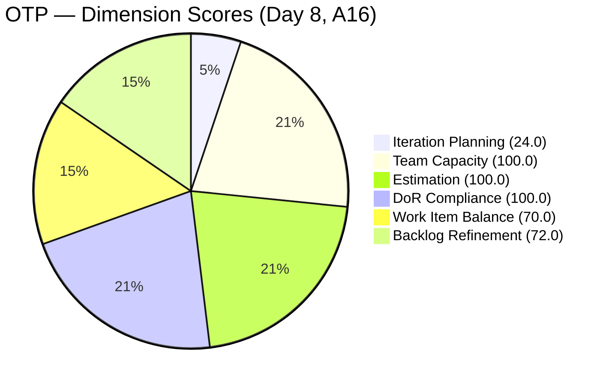
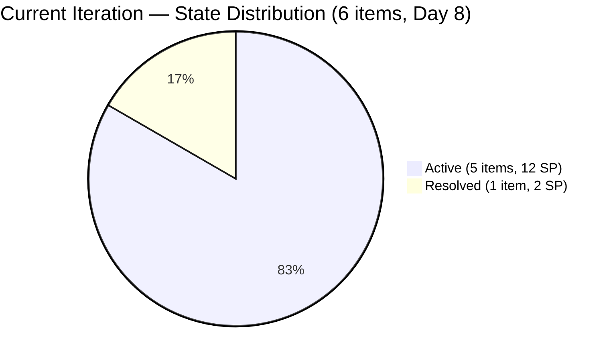

# SAFe Audit Report — OTP Team | Iteration 6.6 (IP) Day 8

## 1. Audit Metadata

| Field | Value |
|-------|-------|
| **Project** | OTP (Office of the President) |
| **Project ID** | `e7739905-28a3-4ae1-9173-7f6cd13b3494` |
| **Team** | OTP Team |
| **Team ID** | `64de61f0-1203-4b01-aee2-6b4415aec52b` |
| **Workspace Folder** | `ado_otp` |
| **Current Iteration** | Iteration 6.6 (IP) |
| **Iteration Path** | `OTP\2026 - PI6\Iteration 6.6 (IP)` |
| **Iteration Start** | March 23, 2026 |
| **Iteration Finish** | April 5, 2026 |
| **Iteration Day** | Day 8 of 14 (57% elapsed) |
| **Audit Date** | March 30, 2026 |
| **Framework** | SAFe 6.0 |
| **Scoring Rubric** | ADO SAFe v1 (six-dimension deterministic) |
| **Prior Audit** | AUDIT_20260327_0701.md (A15, Day 5, Score: 77.7/100) |
| **Audit Sequence** | A16 — Day 8 of Iteration 6.6 (IP) |
| **Overall Score** | **77.7 / 100** |
| **Risk Band** | **Moderate Risk** |

---

## 2. Executive Summary

This is the **Day 8 audit of Iteration 6.6 (IP)** for the OTP Team (A16). The overall score is **77.7/100 (Moderate Risk)**, unchanged from Day 5 (A15). All six dimensions remain exactly as they were three days ago. The sprint is now 57% elapsed with 6 days remaining.

**The core finding is stagnation.** The two highest-priority action items from both the Day 4 (A14) and Day 5 (A15) audits — closing #199522 (PhilGeps Renewal) and #200686 (Client Negotiation JESI) — have still not been actioned. These items were last changed on March 22 (one day before iteration start) and remain Active despite all tasks being completed. This is the **third consecutive audit** flagging this as the single biggest lever for score improvement. Closing these two items would immediately move the score from 77.7 to approximately 81.0 (Low Risk).

**No new backlog items were added** since Day 5. The visible backlog remains at 25 items. #201132 (TCT Transfer) is still in Resolved state, not Closed. The 4 solar initiative items (#201807-#201820) added on Day 5 remain unscheduled.

**Team note:** Grace is the sole assignee for all OTP work items. This is an accepted structural constraint per project exception.

---

## 3. Previous Audit Delta

| Dimension | A15 — Day 5 (Mar 27) | A16 — Day 8 (Mar 30) | Delta |
|-----------|----------------------|----------------------|-------|
| Iteration Planning | 24.0 | 24.0 | 0.0 |
| Team Capacity | 100.0 | 100.0 | 0.0 |
| Estimation | 100.0 | 100.0 | 0.0 |
| DoR Compliance | 100.0 | 100.0 | 0.0 |
| Work Item Balance | 70.0 | 70.0 | 0.0 |
| Backlog Refinement | 72.0 | 72.0 | 0.0 |
| **Overall** | **77.7** | **77.7** | **0.0** |

**Key observations since Day 5:**

- **Zero score movement in 3 days.** This is the second flat audit in a row for this project (A14 to A15 was -0.5; A15 to A16 is 0.0).
- **No new backlog items added.** Visible backlog is stable at 25.
- **#199522 and #200686 remain Active** — now 8 days into the iteration, these items have been flagged as P1 actions in three consecutive audits without resolution.
- **#201132 remains Resolved**, not Closed — flagged as P2 in two consecutive audits.
- **Non-fresh items are the same 2:** #157728 (Feb 3) and #195284 (Feb 1) remain outside the 45-day freshness window.

---

## 4. Current Iteration Snapshot

| Metric | Value |
|--------|-------|
| Iteration | 6.6 (IP) — Mar 23 – Apr 5, 2026 |
| Root items in iteration | 6 |
| Total Story Points | 14 SP |
| Unestimated items | 0 |
| Items by state | Active: 5, Resolved: 1 |
| Iteration elapsed | 57% (Day 8 of 14) |
| Visible root backlog items | 25 |
| Contributors with current work | 1 (Grace) |
| Contributors with capacity | 1 (Grace, 1 hr/day) |
| Fresh items (changed >= 2026-02-13) | 23 / 25 (92.0%) |
| Stale > 90 days | 0 |
| Stale > 180 days | 0 |
| Untouched current items (changed < Mar 23) | 2 / 6 (33.3%) |

---

## 5. Work Item Analysis

### Current Iteration Items (6)

| ID | Type | Title | State | SP | Changed | DoR | Notes |
|----|------|-------|-------|----|---------|-----|-------|
| #198759 | User Story | Bomar Visa (US B1/B2) | Active | 2 | Mar 25 | Pass | Tasks done since 6.5; pending state transition |
| #198760 | User Story | Jove Visa (US B1/B2) | Active | 2 | Mar 26 | Pass | Tasks done since 6.5; pending state transition |
| #198762 | User Story | Bon Visa (US B1/B2) | Active | 2 | Mar 26 | Pass | Tasks done since 6.5; pending state transition |
| #199522 | User Story | PhilGeps Platinum Renewal | Active | 4 | **Mar 22** | Pass | **Untouched — 3rd consecutive P1 flag** |
| #200686 | User Story | Client Negotiation JESI | Active | 2 | **Mar 22** | Pass | **Untouched — 3rd consecutive P1 flag** |
| #201132 | User Story | TCT Transfer Documents | Resolved | 2 | Mar 26 | Pass | Resolved on Day 4; still not Closed |

### State Distribution

| State | Count | SP |
|-------|-------|----|
| Active | 5 | 12 SP |
| Resolved | 1 | 2 SP |

At Day 8 (57% elapsed), 0 of 6 items are Closed. 1 item is Resolved. 5 remain Active. The visa stories (#198759, #198760, #198762) have completed tasks but have not transitioned state — they appear to be waiting for external dependencies (embassy processes). #199522 and #200686 have had all tasks completed since before the iteration started.

### Non-Current Backlog (19 items)

| Category | Count | Notes |
|----------|-------|-------|
| Solar initiative (OTP root) | 3 | #201807, #201811, #201815 — DoR-compliant, unscheduled |
| Solar initiative (PI6 root) | 1 | #201820 — DoR-compliant, unscheduled |
| Fire safety compliance | 6 | #175360-#175365, #184001, #191906 — mixed DoR status |
| Other operational | 9 | Various — mixed DoR status |

---

## 6. SAFe Compliance Scorecard

| Dimension | Score | Evidence | Notes |
|-----------|-------|----------|-------|
| Iteration Planning | 24.0 | 6 / 25 visible items in current iteration | Unchanged; 19 items unscheduled |
| Team Capacity | 100.0 | 1/1 contributor with capacity | Grace: 1 hr/day; single-assignee model accepted |
| Estimation | 100.0 | 6/6 point-eligible items have SP > 0 | All items estimated |
| DoR Compliance | 100.0 | 6/6 current items pass DoR | All items have Description >= 30 chars and AC >= 20 chars |
| Work Item Balance | 70.0 | All 6 items are User Stories (100%) | -30 penalty: dominant type > 60% |
| Backlog Refinement | 72.0 | base 92.0 - 20 (untouched > 30%) = 72.0 | #199522 and #200686 changed before iteration start |
| **Overall** | **77.7** | Average of 6 dimensions | **Moderate Risk** (60-79.9) |

### Score Computation Detail

| Dimension | Formula | Calculation | Result |
|-----------|---------|-------------|--------|
| Iteration Planning | current / visible x 100 | 6 / 25 x 100 | 24.0 |
| Team Capacity | cap_with_work / work_assignees x 100 | 1 / 1 x 100 | 100.0 |
| Estimation | estimated / point_eligible x 100 | 6 / 6 x 100 | 100.0 |
| DoR Compliance | dor_compliant / current x 100 | 6 / 6 x 100 | 100.0 |
| Work Item Balance | 100 - penalties | 100 - 30 (dominant > 60%) | 70.0 |
| Backlog Refinement | base - penalties | 92.0 - 20 (untouched > 30%) | 72.0 |
| **Overall** | average(all 6) | (24+100+100+100+70+72)/6 | **77.7** |

**Backlog Refinement detail:**

- `fresh` = 23/25 = 92.0% (#157728 changed Feb 3 and #195284 changed Feb 1 are outside the 45-day window)
- `stale_90` = 0 -> no penalty
- `stale_180` = 0 -> no penalty
- `untouched` = 2/6 current items (33.3%) changed before iteration start (Mar 23) -> penalty -20

**Score if #199522 and #200686 were closed today:**

- `untouched` drops to 0/6 -> penalty removed
- Backlog Refinement: 92.0 - 0 = **92.0**
- Overall: (24.0 + 100 + 100 + 100 + 70 + 92.0) / 6 = **81.0** (**Low Risk**)

---

## 7. Dimension Findings

### 7.1 Iteration Planning (24.0) — Low

6 of 25 visible backlog items are in the current iteration. This score is unchanged from Day 5. The denominator grew from 21 (Day 4) to 25 (Day 5) due to the solar initiative and has stabilized. The IP period is the ideal time to assign the 19 unscheduled items to PI7 iterations, which would improve this metric in future sprints.

### 7.2 Team Capacity (100.0) — Healthy

Grace is the sole contributor with capacity configured at 1 hr/day. Single-assignee model is an accepted project exception. Score is stable.

### 7.3 Estimation (100.0) — Full Score

All 6 current items and all 19 non-current items have Story Points. This is consistent practice across the OTP team.

### 7.4 DoR Compliance (100.0) — Full Score

All 6 current items have substantial Description and Acceptance Criteria content. The visa stories remain among the best DoR examples across the portfolio with detailed SMART acceptance criteria. However, 7 of the 19 non-current backlog items still lack AC, which will be a problem when they enter future iterations.

### 7.5 Work Item Balance (70.0) — Structural Constraint

All 6 current items are User Stories (100% concentration). The -30 penalty for dominant type > 60% applies. This is structurally expected for OTP's operational nature — the project does not generate Spikes, Enablers, or Defects. This score is unlikely to change without introducing non-User-Story work item types.

### 7.6 Backlog Refinement (72.0) — Untouched Penalty Persists

Base score is 92.0 (23/25 fresh). The -20 untouched penalty continues because #199522 (changed Mar 22) and #200686 (changed Mar 22) have not been modified since before the iteration started. This is now the **third consecutive audit** where this penalty has been flagged. Closing these two items is a 5-minute action that removes the penalty and pushes the overall score to Low Risk.

---

## 8. Risks and Bottlenecks

| Priority | Risk | Impact |
|----------|------|--------|
| CRITICAL | **#199522 and #200686 still Active — 3rd consecutive audit unactioned** | Untouched penalty persists; 3.3 points below Low Risk threshold; all tasks completed since Mar 22 |
| HIGH | **0 items Closed at Day 8 (57% elapsed)** | No formal credit for completed work; sprint velocity will read 0 SP unless items transition |
| HIGH | **#201132 still Resolved, not Closed — 3rd consecutive audit** | 2 SP not formally credited; Resolved is not a terminal state |
| MEDIUM | **19 backlog items unscheduled for PI7** | IP period is 57% elapsed; planning window narrowing; 4 solar items still unassigned |
| MEDIUM | **7 non-current items missing DoR** | Will block those items from entering PI7 iterations in a DoR-compliant state |
| LOW | **#201820 in PI6 root, not in an iteration** | May be accidental placement; should be in PI7 or moved to OTP root |

---

## 9. Prioritized Recommendations

| Priority | Action | Expected Outcome | Target |
|----------|--------|------------------|--------|
| **P1** | **Close #199522 (PhilGeps) and #200686 (Client JESI) — NOW.** This is the 3rd consecutive audit with this as P1. All tasks are Closed. The only remaining action is a state transition from Active to Closed. Estimated time: 5 minutes. | Backlog Refinement: 72.0 -> 92.0; Overall: 77.7 -> **81.0** (Low Risk) | **Today — do this first** |
| **P2** | **Close #201132 (TCT Transfer).** Resolved since Mar 26. Transition to Closed to formally credit 2 SP. | Clears Resolved queue; credits 2 SP | Today |
| **P3** | **Transition visa stories (#198759, #198760, #198762) to Resolved or Closed** if their external dependencies are met. At Day 8 with tasks done, these items should reflect current status. | Accurate state representation; credits 6 SP | This week |
| **P4** | **Schedule PI7 iteration assignments.** Assign the 4 solar items (#201807-#201820) and top-priority backlog items to PI7 iterations. IP period ends Apr 5 — 6 days remain. | Improves future Iteration Planning; capitalizes on IP period | By Day 10 (Apr 1) |
| **P5** | **Author AC for the 7 non-current items missing it.** Prioritize items most likely to enter PI7: #175360, #175361 (fire safety), #200681 (team re-architecture). | Improves backlog DoR readiness for PI7 | During IP period |
| **P6** | **Move #201820 to PI7 or OTP root.** Currently in `OTP\2026-PI6` (not an iteration), which may be an accidental placement. | Correct iteration path | Today |

---

## 10. Evidence Gaps and Limitations

| Gap | Impact | Mitigation |
|-----|--------|------------|
| **P1 from A14 and A15 not executed — 3rd consecutive audit** | #199522 and #200686 remain Active; the untouched penalty has persisted for the entire IP sprint | Escalated to P1 again; if not actioned by Day 10, this represents a systemic execution gap requiring process intervention |
| **Visa story state transitions depend on external processes** | Embassy timelines are outside team control; Active state may be accurate even with tasks done | Visa stories may need a "Waiting" or "Blocked" marker to distinguish from truly in-progress work |
| **Grace capacity reduction (2 hr/day to 1 hr/day) still undocumented** | No ADO record explaining the change since 6.6 started | Flagged for the 3rd consecutive audit; recommend a single ADO comment for audit trail |
| **Non-current DoR gaps not measured in the score** | 7 items without AC will score 0% DoR if they enter an iteration without remediation | IP period is the window; P5 addresses this |
| **#201820 iteration path** | Item is in PI6 root, not in an iteration; may inflate future visible backlog counts | Verify intent with Ramon |

---

## Action Item Tracking — A14 -> A15 -> A16

| Recommendation | A14 (Day 4) | A15 (Day 5) | A16 (Day 8) |
|---------------|-------------|-------------|-------------|
| Close #199522 and #200686 | P1 — Not done | P1 — Not done | **P1 — Still not done (3rd audit)** |
| Close #201132 | P2 — Not done | P2 — Not done | **P2 — Still not done (3rd audit)** |
| Schedule PI7 iterations | P3 — Partial (4 items added) | P3 — Not done | **P4 — Still not done** |
| Author DoR for backlog items | P4 — Not done | P4 — Not done | **P5 — Still not done** |
| Document Grace capacity change | P5 — Not done | P6 — Not done | **Not re-listed (low priority)** |

> **0 of 4 testable recommendations have been completed across three consecutive audits (Day 4, 5, and 8).** The IP period is 57% elapsed. P1 alone (closing 2 items, ~5 minutes of work) would cross the Low Risk threshold.

---

---

*Report generated: March 30, 2026 | SAFe 6.0 Framework | ADO SAFe v1 Rubric*
*OTP — OTP Team | Iteration 6.6 (IP): Mar 23 - Apr 5, 2026*
*Overall Score: 77.7/100 (Moderate Risk) | Day 8 of 14 (57% elapsed) | A16*
*Previous: AUDIT_20260327_0701.md (A15, Day 5, 77.7/100) | 0.0 change*
