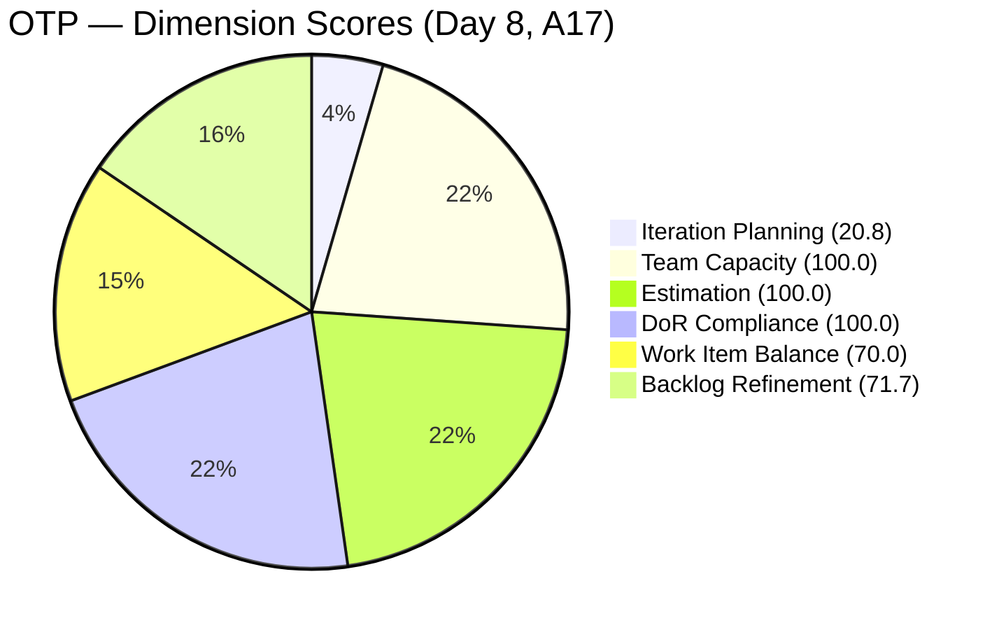
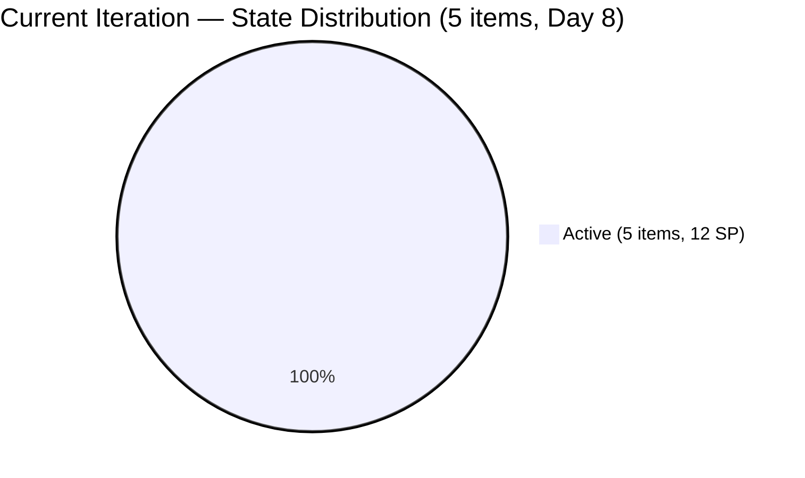
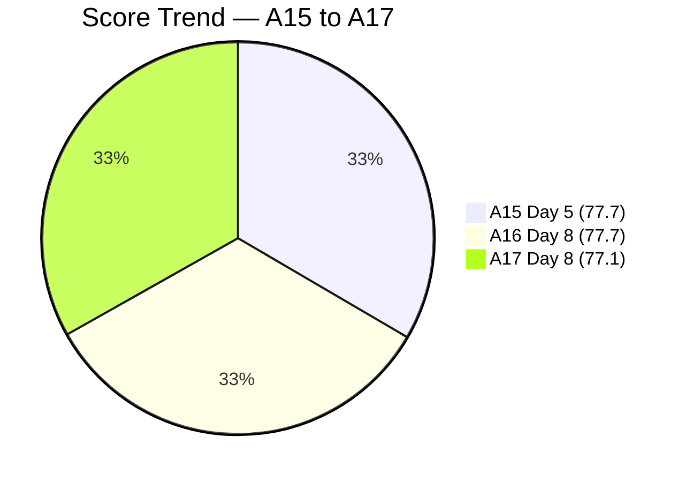

# SAFe Audit Report — OTP Team | Iteration 6.6 (IP) Day 8

## 1. Audit Metadata

| Field | Value |
|-------|-------|
| **Project** | OTP (Office of the President) |
| **Project ID** | `e7739905-28a3-4ae1-9173-7f6cd13b3494` |
| **Team** | OTP Team |
| **Team ID** | `64de61f0-1203-4b01-aee2-6b4415aec52b` |
| **Workspace Folder** | `ado_otp` |
| **Current Iteration** | Iteration 6.6 (IP) |
| **Iteration Path** | `OTP\2026 - PI6\Iteration 6.6 (IP)` |
| **Iteration Start** | March 23, 2026 |
| **Iteration Finish** | April 5, 2026 |
| **Iteration Day** | Day 8 of 14 (57% elapsed) |
| **Audit Date** | March 30, 2026 (PHT) |
| **Framework** | SAFe 6.0 |
| **Scoring Rubric** | ADO SAFe v1 (six-dimension deterministic) |
| **Prior Audit** | AUDIT_20260330_0900.md (A16, Day 8, Score: 77.7/100) |
| **Audit Sequence** | A17 — Day 8 of Iteration 6.6 (IP) |
| **Overall Score** | **77.1 / 100** |
| **Risk Band** | **Moderate Risk** |

---

## 2. Executive Summary

The OTP Team scores **77.1/100 (Moderate Risk)** on this second Day 8 audit (A17), a **-0.6 point decline** from the earlier same-day audit (A16, 77.7). The decline is caused by a single structural change: **#201132 (TCT Transfer Documents) has been Closed** and dropped from the visible backlog. This is a positive action — the P2 recommendation from three consecutive audits has finally been executed — but it reduces the visible backlog from 25 to 24 items and the current iteration count from 6 to 5, which mechanically lowers Iteration Planning from 24.0 to 20.8 and Backlog Refinement from 72.0 to 71.7.

The P1 recommendation remains unactioned for the **fourth consecutive audit**: #199522 (PhilGeps Renewal) and #200686 (Client Negotiation JESI) are still Active with all tasks completed, unchanged since March 22. Closing these two items would remove the untouched penalty from Backlog Refinement but would further reduce current iteration count (to 3), with a complex net effect on the overall score.

**Team note:** Grace is the sole assignee for all OTP work items. This is an accepted structural constraint per project exception.

---

## 3. Previous Audit Delta

| Dimension | A16 — Day 8 AM (Mar 30) | A17 — Day 8 (Mar 30) | Delta |
|-----------|--------------------------|----------------------|-------|
| Iteration Planning | 24.0 | 20.8 | -3.2 |
| Team Capacity | 100.0 | 100.0 | 0.0 |
| Estimation | 100.0 | 100.0 | 0.0 |
| DoR Compliance | 100.0 | 100.0 | 0.0 |
| Work Item Balance | 70.0 | 70.0 | 0.0 |
| Backlog Refinement | 72.0 | 71.7 | -0.3 |
| **Overall** | **77.7** | **77.1** | **-0.6** |

**Key observations since A16:**

- **#201132 (TCT Transfer) has been Closed.** This removes 1 item from both the visible backlog (25 to 24) and the current iteration (6 to 5). The P2 recommendation from A14/A15/A16 has been actioned.
- **Iteration Planning drops from 24.0 to 20.8** because the ratio changed from 6/25 to 5/24. Closing a current-iteration item reduces both numerator and denominator, but the effect is negative when the ratio is below 50%.
- **Backlog Refinement drops from 72.0 to 71.7** because the fresh base changed from 23/25 (92.0%) to 22/24 (91.7%), and the untouched penalty increased from 2/6 (33.3%) to 2/5 (40.0%).
- **#199522 and #200686 remain Active** — now flagged for the fourth consecutive audit.
- **No other changes observed** in backlog composition or work item states.

---

## 4. Current Iteration Snapshot

| Metric | Value |
|--------|-------|
| Iteration | 6.6 (IP) — Mar 23 to Apr 5, 2026 |
| Root items in iteration | 5 |
| Total Story Points | 12 SP |
| Unestimated items | 0 |
| Items by state | Active: 5 |
| Iteration elapsed | 57% (Day 8 of 14) |
| Visible root backlog items | 24 |
| Contributors with current work | 1 (Grace) |
| Contributors with capacity | 1 (Grace, 1 hr/day) |
| Fresh items (changed >= 2026-02-13) | 22 / 24 (91.7%) |
| Stale > 90 days | 0 |
| Stale > 180 days | 0 |
| Untouched current items (changed < Mar 23) | 2 / 5 (40.0%) |

---

## 5. Work Item Analysis

### Current Iteration Items (5)

| ID | Type | Title | State | SP | Changed | DoR | Notes |
|----|------|-------|-------|----|---------|-----|-------|
| #198759 | User Story | Bomar Visa (US B1/B2) | Active | 2 | Mar 25 | Pass | Tasks done; pending external dependency |
| #198760 | User Story | Jove Visa (US B1/B2) | Active | 2 | Mar 26 | Pass | Tasks done; pending external dependency |
| #198762 | User Story | Bon Visa (US B1/B2) | Active | 2 | Mar 26 | Pass | Tasks done; pending external dependency |
| #199522 | User Story | PhilGeps Platinum Renewal | Active | 4 | **Mar 22** | Pass | **Untouched — 4th consecutive P1 flag** |
| #200686 | User Story | Client Negotiation JESI | Active | 2 | **Mar 22** | Pass | **Untouched — 4th consecutive P1 flag** |

### State Distribution

| State | Count | SP |
|-------|-------|----|
| Active | 5 | 12 SP |

At Day 8 (57% elapsed), 0 of 5 items are Closed or Resolved. All 5 remain Active. The positive news: #201132 (TCT Transfer, 2 SP) was Closed between A16 and A17, crediting 2 SP for the iteration.

### Non-Current Backlog (19 items)

| Category | Count | Notes |
|----------|-------|-------|
| Solar initiative (OTP root) | 3 | #201807, #201811, #201815 — DoR-compliant, unscheduled |
| Solar initiative (PI6 root) | 1 | #201820 — DoR-compliant, in PI6 root (not in iteration) |
| Fire safety compliance | 6 | #175360-#175365, #184001, #191906 — mixed DoR status |
| Other operational | 9 | Various — mixed DoR status |

### Non-Fresh Items (2)

| ID | Title | Changed | Age |
|----|-------|---------|-----|
| #157728 | Davao Chamber of Commerce | Feb 3, 2026 | 55 days |
| #195284 | Prepare Secretary's Certificate | Feb 1, 2026 | 57 days |

Both are outside the 45-day freshness window but well within 90 days.

---

## 6. SAFe Compliance Scorecard

| Dimension | Score | Evidence | Notes |
|-----------|-------|----------|-------|
| Iteration Planning | 20.8 | 5 current / 24 visible | Down from 24.0 due to #201132 closure reducing both numerator and denominator |
| Team Capacity | 100.0 | 1/1 contributor with capacity | Grace: 1 hr/day; single-assignee model accepted |
| Estimation | 100.0 | 5/5 point-eligible items have SP > 0 | All items estimated |
| DoR Compliance | 100.0 | 5/5 current items pass DoR | All items have Description >= 30 chars and AC >= 20 chars |
| Work Item Balance | 70.0 | All 5 items are User Stories (100%) | -30 penalty: dominant type > 60% |
| Backlog Refinement | 71.7 | base 91.7 - 20 (untouched 40.0% > 30%) = 71.7 | Untouched penalty worsened (was 33.3%, now 40.0%) |
| **Overall** | **77.1** | Average of 6 dimensions | **Moderate Risk** (60-79.9) |

### Score Computation Detail

| Dimension | Formula | Calculation | Result |
|-----------|---------|-------------|--------|
| Iteration Planning | current / visible x 100 | 5 / 24 x 100 | 20.8 |
| Team Capacity | cap_with_work / work_assignees x 100 | 1 / 1 x 100 | 100.0 |
| Estimation | estimated / point_eligible x 100 | 5 / 5 x 100 | 100.0 |
| DoR Compliance | dor_compliant / current x 100 | 5 / 5 x 100 | 100.0 |
| Work Item Balance | 100 - penalties | 100 - 30 (dominant > 60%) | 70.0 |
| Backlog Refinement | base - penalties | 91.7 - 20 (untouched > 30%) | 71.7 |
| **Overall** | average(all 6) | (20.8+100+100+100+70+71.7)/6 | **77.1** |

---

## 7. Dimension Findings

### 7.1 Iteration Planning (20.8) — Low (was 24.0)

5 of 24 visible backlog items are in the current iteration. The closure of #201132 paradoxically lowered this score: removing one current-iteration item from a below-50% ratio worsens the percentage. This is a known scoring artifact — closing work is the right action even when the metric temporarily dips. The IP period remains the ideal time to assign backlog items to PI7 iterations.

### 7.2 Team Capacity (100.0) — Healthy

Grace is the sole contributor with capacity configured at 1 hr/day. Single-assignee model is an accepted project exception.

### 7.3 Estimation (100.0) — Full Score

All 5 current items have Story Points. All 19 non-current items are also estimated. Consistent practice.

### 7.4 DoR Compliance (100.0) — Full Score

All 5 current items have substantial Description and Acceptance Criteria. The visa stories remain exemplary DoR implementations. However, 7 of the 19 non-current items still lack AC (fire safety items, #195285, #200681).

### 7.5 Work Item Balance (70.0) — Structural Constraint

All 5 current items are User Stories (100% concentration). The -30 penalty for dominant type > 60% applies. This is structurally expected for OTP's operational nature and unlikely to change.

### 7.6 Backlog Refinement (71.7) — Untouched Penalty Persists (was 72.0)

Base score: 91.7% (22/24 fresh). The -20 untouched penalty continues because #199522 (changed Mar 22) and #200686 (changed Mar 22) have not been modified since before the iteration started. The untouched percentage worsened from 33.3% (2/6) to 40.0% (2/5) due to #201132 leaving the denominator.

---

## 8. Risks and Bottlenecks

| Priority | Risk | Impact |
|----------|------|--------|
| CRITICAL | **#199522 and #200686 still Active — 4th consecutive audit unactioned** | Untouched penalty persists; all tasks completed since Mar 22; 2.9 points below Low Risk threshold |
| HIGH | **0 items Closed at Day 8 (57% elapsed)** | #201132 was Closed (2 SP credited) but remaining 5 items are all Active; sprint velocity reads 2 SP |
| MEDIUM | **19 backlog items unscheduled for PI7** | IP period is 57% elapsed; planning window narrowing; 4 solar items + fire safety items unassigned |
| MEDIUM | **7 non-current items missing DoR** | Will block items from entering PI7 iterations in DoR-compliant state |
| LOW | **#201820 in PI6 root, not in an iteration** | May be accidental placement; should be in PI7 or OTP root |
| LOW | **Closing current items paradoxically lowers score** | Iteration Planning scoring artifact when ratio < 50%; team should understand this is expected |

---

## 9. Prioritized Recommendations

| Priority | Action | Expected Outcome | Target |
|----------|--------|------------------|--------|
| **P1** | **Close #199522 (PhilGeps) and #200686 (Client JESI).** This is the **4th consecutive audit** with this as P1. All tasks are Closed. State transition from Active to Closed. Estimated time: 5 minutes. | Removes untouched penalty; Backlog Refinement improves. Note: Iteration Planning will further decrease (3/22) but the net overall effect depends on the magnitude of the refinement gain vs. planning loss. | **Today** |
| **P2** | **Transition visa stories (#198759, #198760, #198762) to Resolved or Closed** if external dependencies are met. At Day 8 with tasks done, these should reflect current status. | Accurate state representation; credits 6 SP | This week |
| **P3** | **Schedule PI7 iteration assignments.** Assign the 4 solar items (#201807-#201820) and top-priority backlog items to PI7 iterations. IP period ends Apr 5 — 6 days remain. | Improves future Iteration Planning; capitalizes on IP period | By Day 10 (Apr 1) |
| **P4** | **Author AC for the 7 non-current items missing it.** Prioritize fire safety items (#175360, #175361, #175362, #175363, #175365, #191906) and #200681 (team re-architecture). | Improves backlog DoR readiness for PI7 | During IP period |
| **P5** | **Move #201820 to PI7 or OTP root.** Currently in `OTP\2026-PI6` (not an iteration). | Correct iteration path | Today |

---

## 10. Evidence Gaps and Limitations

| Gap | Impact | Mitigation |
|-----|--------|------------|
| **P1 from A14-A16 not executed — 4th consecutive audit** | #199522 and #200686 remain Active; untouched penalty persists for the entire IP sprint | Escalated to P1 again; represents a systemic execution gap |
| **#201132 closure confirmed indirectly** | Item disappeared from backlog between A16 and A17; no direct state transition observed but absence from backlog API confirms Closed status | Treated as Closed per ADO backlog behavior |
| **Visa story state transitions depend on embassy processes** | Active state may be accurate even with tasks done; external dependencies outside team control | May need a "Blocked" marker to distinguish from in-progress work |
| **Grace capacity at 1 hr/day undocumented** | No ADO record explaining the reduction from 2 hr/day | 4th consecutive audit flagging this |
| **Non-current DoR gaps not scored** | 7 items without AC will score 0% DoR if they enter an iteration | IP period is the remediation window |
| **Description/AC character counts are approximate** | Based on stripping HTML tags; actual non-whitespace may differ slightly | All current items have clearly substantial content |

---

## Action Item Tracking — A14 to A17

| Recommendation | A14 (Day 4) | A15 (Day 5) | A16 (Day 8) | A17 (Day 8) |
|---------------|-------------|-------------|-------------|-------------|
| Close #199522 and #200686 | P1 — Not done | P1 — Not done | P1 — Not done | **P1 — Still not done (4th audit)** |
| Close #201132 | P2 — Not done | P2 — Not done | P2 — Not done | **DONE** |
| Transition visa stories | — | P3 — Not done | P3 — Not done | P2 — Not done |
| Schedule PI7 iterations | P3 — Partial | P3 — Not done | P4 — Not done | P3 — Not done |
| Author DoR for backlog | P4 — Not done | P4 — Not done | P5 — Not done | P4 — Not done |

> **1 of 5 tracked recommendations completed (Close #201132).** The highest-priority action (closing 2 items, ~5 minutes) remains unactioned after four audits spanning 5 calendar days.

---

---

*Report generated: March 30, 2026 | SAFe 6.0 Framework | ADO SAFe v1 Rubric*
*OTP — OTP Team | Iteration 6.6 (IP): Mar 23 - Apr 5, 2026*
*Overall Score: 77.1/100 (Moderate Risk) | Day 8 of 14 (57% elapsed) | A17*
*Previous: AUDIT_20260330_0900.md (A16, Day 8, 77.7/100) | -0.6 change*
