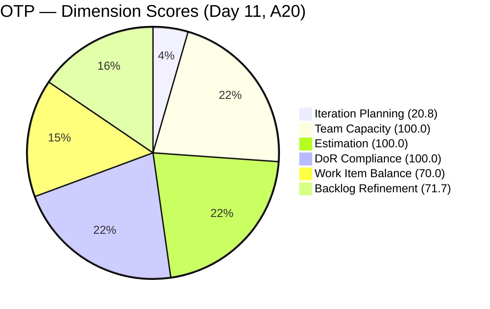
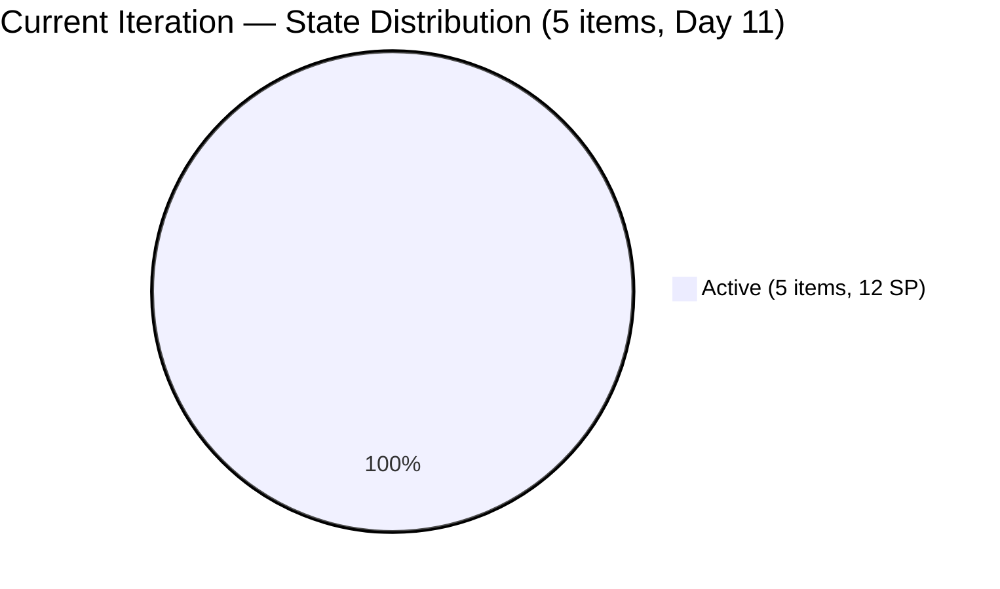
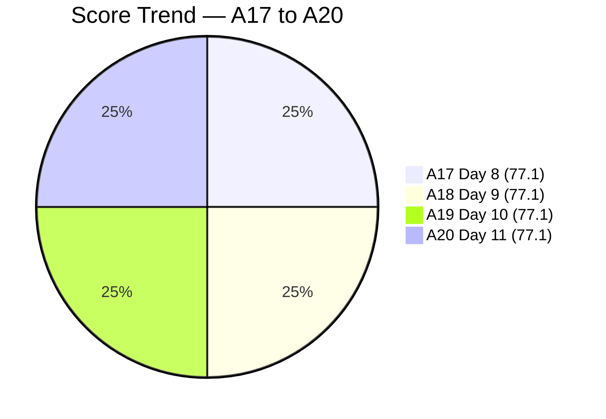
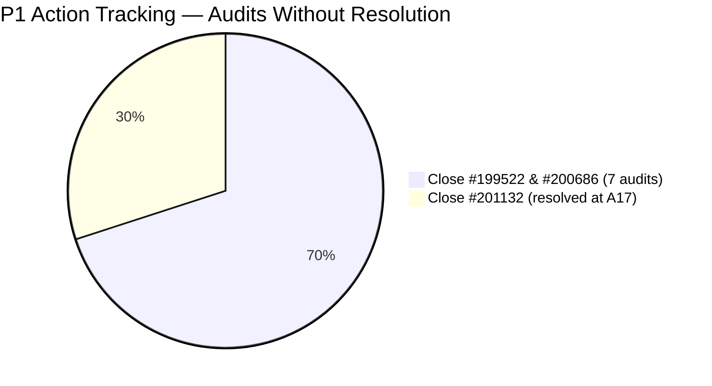

# SAFe Audit Report — OTP Team | Iteration 6.6 (IP) Day 11

## 1. Audit Metadata

| Field | Value |
|-------|-------|
| **Project** | OTP (Office of the President) |
| **Project ID** | `e7739905-28a3-4ae1-9173-7f6cd13b3494` |
| **Team** | OTP Team |
| **Team ID** | `64de61f0-1203-4b01-aee2-6b4415aec52b` |
| **Workspace Folder** | `ado_otp` |
| **Current Iteration** | Iteration 6.6 (IP) |
| **Iteration Path** | `OTP\2026 - PI6\Iteration 6.6 (IP)` |
| **Iteration Start** | March 23, 2026 |
| **Iteration Finish** | April 5, 2026 |
| **Iteration Day** | Day 11 of 14 (79% elapsed) |
| **Audit Date** | April 2, 2026 |
| **Framework** | SAFe 6.0 |
| **Scoring Rubric** | ADO SAFe v1 (six-dimension deterministic) |
| **Prior Audit** | AUDIT_20260401_0900.md (A19, Day 10, Score: 77.1/100) |
| **Audit Sequence** | A20 — Day 11 of Iteration 6.6 (IP) |
| **Overall Score** | **77.1 / 100** |
| **Risk Band** | **Moderate Risk** |

---

## 2. Executive Summary

The OTP Team holds at **77.1/100 (Moderate Risk)** on Day 11 of Iteration 6.6 (IP), **unchanged from the prior audit** (A19, Day 10). One change was detected: **#198759 (Bomar Visa) was updated on April 1** (ChangedDate moved from Mar 25 to Apr 1, with a comment added), breaking the three-audit freeze on board activity. However, no state transitions occurred and no items were closed, so the score remains identical.

The P1 recommendation to close #199522 (PhilGeps Renewal) and #200686 (Client Negotiation JESI) remains unactioned for the **seventh consecutive audit** spanning 8 calendar days. Both items have all tasks completed and ChangedDate of March 22, predating the iteration start.

The team is 2.9 points below the Low Risk threshold (80.0). With only **3 calendar days remaining** in the IP sprint, the window for PI7 planning and backlog hygiene is nearly closed.

**Team note:** Grace is the sole assignee for all OTP work items. This is an accepted structural constraint per project exception.

---

## 3. Previous Audit Delta

| Dimension | A19 — Day 10 (Apr 1) | A20 — Day 11 (Apr 2) | Delta |
|-----------|----------------------|----------------------|-------|
| Iteration Planning | 20.8 | 20.8 | 0.0 |
| Team Capacity | 100.0 | 100.0 | 0.0 |
| Estimation | 100.0 | 100.0 | 0.0 |
| DoR Compliance | 100.0 | 100.0 | 0.0 |
| Work Item Balance | 70.0 | 70.0 | 0.0 |
| Backlog Refinement | 71.7 | 71.7 | 0.0 |
| **Overall** | **77.1** | **77.1** | **0.0** |

**Key observations since A19:**
- **Score unchanged.** All six dimensions are identical. This is the **fourth consecutive audit** with the same overall score.
- **One work item change detected:** #198759 (Bomar Visa) ChangedDate updated from Mar 25 to Apr 1 (a comment was added). This breaks the three-audit board freeze.
- **No state transitions.** All 5 current items remain Active. All 19 non-current items remain in their prior states.
- **#199522 and #200686 remain Active** with ChangedDate of Mar 22 — now 11 days without modification, flagged for the **seventh consecutive audit**.
- **Visa stories (#198760, #198762) unchanged** at Mar 26; #198759 updated Apr 1.
- **PI7 iteration planning has not begun** — 19 backlog items remain unscheduled.

---

## 4. Current Iteration Snapshot

| Metric | Value |
|--------|-------|
| Iteration | 6.6 (IP) — Mar 23 to Apr 5, 2026 |
| Root items in iteration | 5 |
| Total Story Points | 12 SP |
| Unestimated items | 0 |
| Items by state | Active: 5 |
| Iteration elapsed | 79% (Day 11 of 14) |
| Visible root backlog items | 24 |
| Contributors with current work | 1 (Grace) |
| Contributors with capacity | 1 (Grace, 1 hr/day Documentation) |
| Fresh items (changed >= 2026-02-16) | 22 / 24 (91.7%) |
| Stale > 90 days | 0 |
| Stale > 180 days | 0 |
| Untouched current items (changed < Mar 23) | 2 / 5 (40.0%) |

---

## 5. Work Item Analysis

### Current Iteration Items (5)

| ID | Type | Title | State | SP | Changed | DoR | Notes |
|----|------|-------|-------|----|---------|-----|-------|
| #198759 | User Story | Bomar Visa (US B1/B2) | Active | 2 | **Apr 1** | Pass | **Updated** — comment added; tasks done; pending external dependency |
| #198760 | User Story | Jove Visa (US B1/B2) | Active | 2 | Mar 26 | Pass | Tasks done; pending external dependency |
| #198762 | User Story | Bon Visa (US B1/B2) | Active | 2 | Mar 26 | Pass | Tasks done; pending external dependency |
| #199522 | User Story | PhilGeps Platinum Renewal | Active | 4 | **Mar 22** | Pass | **Untouched — 7th consecutive P1 flag** |
| #200686 | User Story | Client Negotiation JESI | Active | 2 | **Mar 22** | Pass | **Untouched — 7th consecutive P1 flag** |

### State Distribution

| State | Count | SP |
|-------|-------|----|
| Active | 5 | 12 SP |

At Day 11 (79% elapsed), 0 of 5 items are Closed or Resolved. All 5 remain Active.

### Non-Current Backlog (19 items)

| Category | Count | Notes |
|----------|-------|-------|
| Solar initiative (OTP root) | 3 | #201807, #201811, #201815 — DoR-compliant, unscheduled |
| Solar initiative (PI6 root) | 1 | #201820 — DoR-compliant, in PI6 root (not in iteration) |
| Fire safety compliance | 6 | #175360-#175365, #184001, #191906 — mixed DoR status |
| Other operational | 9 | Various — mixed DoR status |

### Non-Fresh Items (2)

| ID | Title | Changed | Age (days) |
|----|-------|---------|------------|
| #157728 | Davao Chamber of Commerce | Feb 3, 2026 | 58 |
| #195284 | Prepare Secretary's Certificate | Feb 1, 2026 | 60 |

Both are outside the 45-day freshness window but well within 90 days.

---

## 6. SAFe Compliance Scorecard

| Dimension | Score | Evidence | Notes |
|-----------|-------|----------|-------|
| Iteration Planning | 20.8 | 5 current / 24 visible | Unchanged; IP period underutilized for scheduling |
| Team Capacity | 100.0 | 1/1 contributor with capacity | Grace: 1 hr/day Documentation; single-assignee model accepted |
| Estimation | 100.0 | 5/5 point-eligible items have SP > 0 | All items estimated |
| DoR Compliance | 100.0 | 5/5 current items pass DoR | All items have Description >= 30 chars and AC >= 20 chars |
| Work Item Balance | 70.0 | All 5 items are User Stories (100%) | -30 penalty: dominant type > 60% |
| Backlog Refinement | 71.7 | base 91.7 - 20 (untouched 40.0% > 30%) = 71.7 | Untouched penalty persists from A15 |
| **Overall** | **77.1** | Average of 6 dimensions | **Moderate Risk** (60-79.9) |

### Score Computation Detail

| Dimension | Formula | Calculation | Result |
|-----------|---------|-------------|--------|
| Iteration Planning | current / visible x 100 | 5 / 24 x 100 | 20.8 |
| Team Capacity | cap / work_assignees x 100 | 1 / 1 x 100 | 100.0 |
| Estimation | estimated / point_eligible x 100 | 5 / 5 x 100 | 100.0 |
| DoR Compliance | dor_compliant / current x 100 | 5 / 5 x 100 | 100.0 |
| Work Item Balance | 100 - penalties | 100 - 30 (dominant > 60%) | 70.0 |
| Backlog Refinement | base - penalties | 91.7 - 20 (untouched > 30%) | 71.7 |
| **Overall** | average(all 6) | (20.8+100+100+100+70+71.7)/6 | **77.1** |

---

## 7. Dimension Findings

### 7.1 Iteration Planning (20.8) — Low (unchanged)
5 of 24 visible backlog items are in the current iteration. The IP period is 79% elapsed with no backlog items assigned to PI7 iterations. The 4 solar initiative items (#201807, #201811, #201815, #201820) added on Mar 27 remain unscheduled. Only 3 calendar days remain in the IP sprint to perform PI7 planning.

### 7.2 Team Capacity (100.0) — Healthy
Grace is the sole contributor with capacity configured at 1 hr/day (Documentation activity). Single-assignee model is an accepted project exception.

### 7.3 Estimation (100.0) — Full Score
All 5 current items have Story Points. All 19 non-current items are also estimated. Consistent practice across the entire backlog.

### 7.4 DoR Compliance (100.0) — Full Score
All 5 current items have substantial Description and Acceptance Criteria. The visa stories remain exemplary DoR implementations. Non-current items have mixed DoR status (7 items lack AC).

### 7.5 Work Item Balance (70.0) — Structural Constraint
All 5 current items are User Stories (100% concentration). The -30 penalty for dominant type > 60% applies. This is structurally expected for OTP's operational nature and unlikely to change.

### 7.6 Backlog Refinement (71.7) — Untouched Penalty Persists (unchanged)
Base score: 91.7% (22/24 fresh). The -20 untouched penalty continues because #199522 (changed Mar 22) and #200686 (changed Mar 22) have not been modified since before the iteration started. The untouched percentage remains at 40.0% (2/5). This penalty has persisted since A15 (Day 5).

Notable: #198759 was updated on Apr 1 (comment added), which means it is no longer a candidate for the untouched list. This confirms that the board is not entirely frozen — only #199522 and #200686 remain stale.

---

## 8. Risks and Bottlenecks

| Priority | Risk | Impact |
|----------|------|--------|
| CRITICAL | **#199522 and #200686 still Active — 7th consecutive audit unactioned** | Untouched penalty persists; all tasks completed since Mar 22; 2.9 points below Low Risk |
| HIGH | **0 items Closed at Day 11 (79% elapsed)** | All 5 items remain Active; only 3 days left |
| HIGH | **Score stagnant at 77.1 for 5 consecutive audits** | No improvement trajectory; team 2.9 points from Low Risk |
| MEDIUM | **19 backlog items unscheduled for PI7** | IP period is 79% elapsed; planning window nearly closed; 4 solar items + fire safety items unassigned |
| MEDIUM | **7 non-current items missing DoR** | Will block items from entering PI7 iterations in DoR-compliant state |
| LOW | **#201820 in PI6 root, not in an iteration** | May be accidental placement; should be in PI7 or OTP root |

---

## 9. Prioritized Recommendations

| Priority | Action | Expected Outcome | Target |
|----------|--------|------------------|--------|
| **P1** | **Close #199522 (PhilGeps) and #200686 (Client JESI).** This is the **7th consecutive audit** with this as P1. All tasks are Closed. State transition from Active to Closed. Estimated time: 5 minutes. | Removes untouched penalty; Backlog Refinement improves. Net effect: overall ~80.9 (Low Risk). | **Today** |
| **P2** | **Transition visa stories (#198759, #198760, #198762) to Resolved or Closed** if external dependencies are met. At Day 11 with tasks done, these should reflect current status. | Accurate state representation; credits 6 SP | This week |
| **P3** | **Schedule PI7 iteration assignments.** Assign the 4 solar items (#201807-#201820) and top-priority backlog items to PI7 iterations. IP period ends Apr 5 — 3 days remain. | Improves future Iteration Planning; capitalizes on IP period | By Day 12 (Apr 3) |
| **P4** | **Author AC for the 7 non-current items missing it.** Prioritize fire safety items (#175360, #175361, #175362, #175363, #175365, #191906) and #200681 (team re-architecture). | Improves backlog DoR readiness for PI7 | During IP period |
| **P5** | **Move #201820 to PI7 or OTP root.** Currently in `OTP\2026-PI6` (not an iteration). | Correct iteration path | Today |

---

## 10. Evidence Gaps and Limitations

| Gap | Impact | Mitigation |
|-----|--------|------------|
| **P1 from A14-A19 not executed — 7th consecutive audit** | #199522 and #200686 remain Active; untouched penalty persists for nearly the entire IP sprint | Escalated to P1 again; represents a systemic execution gap |
| **#198759 updated via comment, not state change** | ChangedDate moved to Apr 1, but state remains Active; tasks remain done | Indicates engagement but not closure |
| **Visa story state transitions depend on embassy processes** | Active state may be accurate even with tasks done; external dependencies outside team control | May need a "Blocked" marker to distinguish from in-progress work |
| **Grace capacity at 1 hr/day** | Configured as Documentation activity; no ADO record explaining the reduced capacity | Carried forward from prior audits |
| **Non-current DoR gaps not scored** | 7 items without AC will score 0% DoR if they enter an iteration | IP period is the remediation window |
| **Description/AC character counts are approximate** | Based on stripping HTML tags; actual non-whitespace may differ slightly | All current items have clearly substantial content |

---

## Action Item Tracking — A14 to A20

| Recommendation | A14 (Day 4) | A15 (Day 5) | A16 (Day 8) | A17 (Day 8) | A18 (Day 9) | A19 (Day 10) | A20 (Day 11) |
|---------------|-------------|-------------|-------------|-------------|-------------|-------------|-------------|
| Close #199522 and #200686 | P1 — Not done | P1 — Not done | P1 — Not done | P1 — Not done | P1 — Not done | P1 — Not done | **P1 — Still not done (7th audit)** |
| Close #201132 | P2 — Not done | P2 — Not done | P2 — Not done | **DONE** | Done | Done | Done |
| Transition visa stories | — | P3 — Not done | P3 — Not done | P2 — Not done | P2 — Not done | P2 — Not done | P2 — Not done |
| Schedule PI7 iterations | P3 — Partial | P3 — Not done | P4 — Not done | P3 — Not done | P3 — Not done | P3 — Not done | P3 — Not done |
| Author DoR for backlog | P4 — Not done | P4 — Not done | P5 — Not done | P4 — Not done | P4 — Not done | P4 — Not done | P4 — Not done |

> **1 of 5 tracked recommendations completed (Close #201132).** The highest-priority action (closing 2 items, ~5 minutes) remains unactioned after seven audits spanning 8 calendar days.

---

### P1 Impact Simulation

If #199522 and #200686 are Closed today:
- Visible backlog: 24 -> 22 (both leave backlog)
- Current iteration: 5 -> 3
- Fresh: 20/22 = 90.9%
- Untouched: 0/3 = 0%
- Iteration Planning: 3/22 x 100 = 13.6 (-7.2)
- Backlog Refinement: 90.9 - 0 = 90.9 (+19.2)
- Overall: (13.6+100+100+100+70+90.9)/6 = **79.1** (+2.0)

**Best path to Low Risk:** Close #199522 and #200686, then assign 2-3 backlog items to the current iteration to maintain planning ratio.
- If 2 items assigned: IP = 5/22 = 22.7, Overall = (22.7+100+100+100+70+90.9)/6 = **80.6 (Low Risk)**

---

---

*Report generated: April 2, 2026 | SAFe 6.0 Framework | ADO SAFe v1 Rubric*
*OTP — OTP Team | Iteration 6.6 (IP): Mar 23 - Apr 5, 2026*
*Overall Score: 77.1/100 (Moderate Risk) | Day 11 of 14 (79% elapsed) | A20*
*Previous: AUDIT_20260401_0900.md (A19, Day 10, 77.1/100) | 0.0 change*
