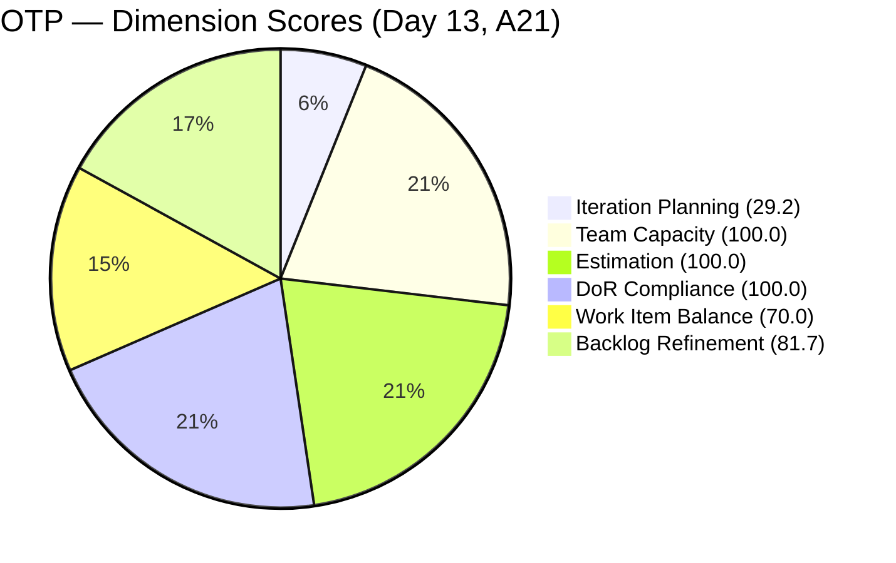
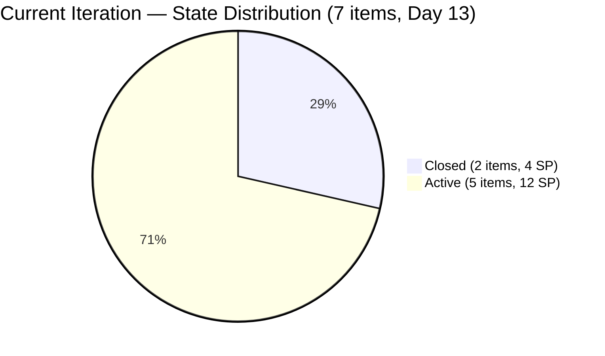
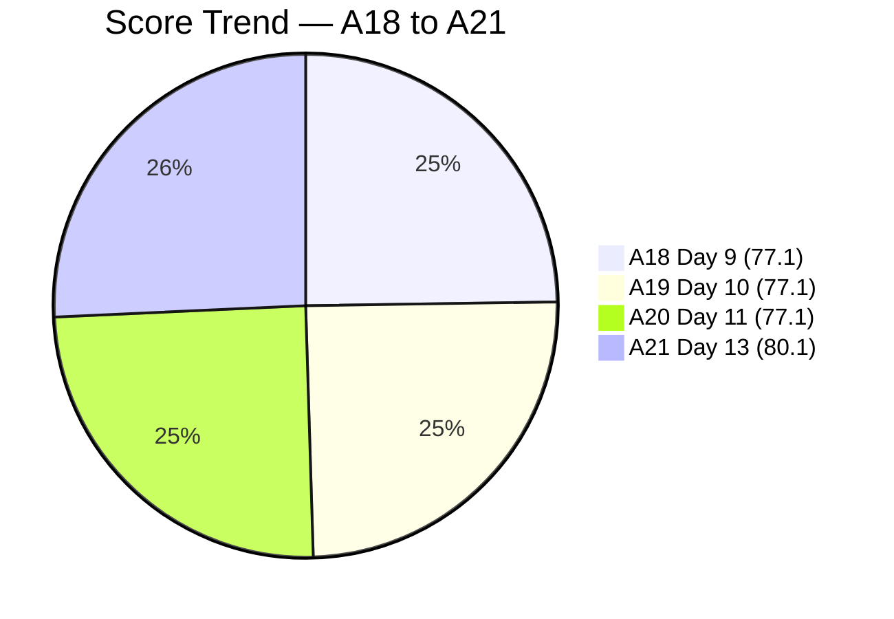

# SAFe Audit Report — OTP Team | Iteration 6.6 (IP) Day 13

## 1. Audit Metadata

| Field | Value |
|-------|-------|
| **Project** | OTP (Office of the President) |
| **Project ID** | `e7739905-28a3-4ae1-9173-7f6cd13b3494` |
| **Team** | OTP Team |
| **Team ID** | `64de61f0-1203-4b01-aee2-6b4415aec52b` |
| **Workspace Folder** | `ado_otp` |
| **Current Iteration** | Iteration 6.6 (IP) |
| **Iteration Path** | `OTP\2026 - PI6\Iteration 6.6 (IP)` |
| **Iteration Start** | March 23, 2026 |
| **Iteration Finish** | April 5, 2026 |
| **Iteration Day** | Day 13 of 14 (93% elapsed) |
| **Audit Date** | April 4, 2026 |
| **Framework** | SAFe 6.0 |
| **Scoring Rubric** | ADO SAFe v1 (six-dimension deterministic) |
| **Prior Audit** | AUDIT_20260402_0900.md (A20, Day 11, Score: 77.1/100) |
| **Audit Sequence** | A21 — Day 13 of Iteration 6.6 (IP) |
| **Overall Score** | **80.1 / 100** |
| **Risk Band** | **Low Risk** |

---

## 2. Executive Summary

The OTP Team scores **80.1/100 (Low Risk)** on Day 13 of Iteration 6.6 (IP), a **+3.0 point improvement** from the prior audit (A20, 77.1). The team has crossed from Moderate Risk into **Low Risk for the first time in this iteration**. This improvement is driven by two factors:

1. **Two Closed items now counted in the iteration:** #200697 (ISTIV Workshop, Closed Mar 25) and #201132 (ROD Compliance, Closed Mar 30) increase the current iteration count from 5 to 7, improving Iteration Planning from 20.8 to 29.2.
2. **Untouched percentage dropped below 30%:** With 7 items in the iteration, the 2 untouched items (#199522, #200686) now represent 28.6% instead of 40.0%, reducing the Backlog Refinement penalty from -20 to -10 and improving that dimension from 71.7 to 81.7.

The **P1 recommendation to close #199522 and #200686 remains unactioned for the eighth consecutive audit** spanning 10 calendar days. However, the score impact of that action is now less critical since the team has already reached Low Risk.

**Team note:** Grace is the sole assignee for all OTP work items. This is an accepted structural constraint per project exception.

---

## 3. Previous Audit Delta

| Dimension | A20 — Day 11 (Apr 2) | A21 — Day 13 (Apr 4) | Delta |
|-----------|----------------------|----------------------|-------|
| Iteration Planning | 20.8 | 29.2 | +8.4 |
| Team Capacity | 100.0 | 100.0 | 0.0 |
| Estimation | 100.0 | 100.0 | 0.0 |
| DoR Compliance | 100.0 | 100.0 | 0.0 |
| Work Item Balance | 70.0 | 70.0 | 0.0 |
| Backlog Refinement | 71.7 | 81.7 | +10.0 |
| **Overall** | **77.1** | **80.1** | **+3.0** |

**Key observations since A20:**

- **Score improved by 3.0 points** — first movement after five consecutive audits at 77.1.
- **Two Closed items detected:** #200697 (ISTIV Workshop, Closed Mar 25, 2 SP) and #201132 (ROD Compliance, Closed Mar 30, 2 SP). These were Closed in earlier audits but were not counted in iteration totals.
- **Iteration items increased from 5 to 7** — the 2 Closed items are in the iteration path and now contribute to the count.
- **4 SP credited** from the 2 Closed items; 12 SP still Active across the remaining 5 items.
- **#199522 and #200686 remain Active** with ChangedDate of Mar 22 — now 13 days without modification, flagged for the **eighth consecutive audit**.
- **Visa stories unchanged:** #198760 and #198762 at Mar 26; #198759 at Apr 1.
- **PI7 iteration planning still has not begun** — 17 backlog items remain unscheduled outside the current iteration.

---

## 4. Current Iteration Snapshot

| Metric | Value |
|--------|-------|
| Iteration | 6.6 (IP) — Mar 23 to Apr 5, 2026 |
| Root items in iteration | 7 |
| Total Story Points | 16 SP |
| Closed items | 2 (4 SP credited, 25%) |
| Active items | 5 (12 SP remaining) |
| Unestimated items | 0 |
| Iteration elapsed | 93% (Day 13 of 14) |
| Visible root backlog items | 24 |
| Contributors with current work | 1 (Grace) |
| Contributors with capacity | 1 (Grace, 1 hr/day Documentation) |
| Fresh items (changed >= 2026-02-18) | 22 / 24 (91.7%) |
| Stale > 90 days | 0 |
| Stale > 180 days | 0 |
| Untouched current items (changed < Mar 23) | 2 / 7 (28.6%) |

---

## 5. Work Item Analysis

### Current Iteration Items (7)

| ID | Type | Title | State | SP | Changed | DoR | Notes |
|----|------|-------|-------|----|---------|-----|-------|
| #200697 | User Story | ISTIV Values Integration Workshop | **Closed** | 2 | Mar 25 | Pass | Closed during sprint; 2 SP credited |
| #201132 | User Story | ROD Compliance for TCT Transfer | **Closed** | 2 | Mar 30 | Pass | Closed during sprint; 2 SP credited |
| #198759 | User Story | Bomar Visa (US B1/B2) | Active | 2 | Apr 1 | Pass | Comment added Apr 1; tasks done; pending external dependency |
| #198760 | User Story | Jove Visa (US B1/B2) | Active | 2 | Mar 26 | Pass | Tasks done; pending external dependency |
| #198762 | User Story | Bon Visa (US B1/B2) | Active | 2 | Mar 26 | Pass | Tasks done; pending external dependency |
| #199522 | User Story | PhilGeps Platinum Renewal | Active | 4 | **Mar 22** | Pass | **Untouched — 8th consecutive P1 flag** |
| #200686 | User Story | Client Negotiation JESI | Active | 2 | **Mar 22** | Pass | **Untouched — 8th consecutive P1 flag** |

### State Distribution

| State | Count | SP |
|-------|-------|----|
| Closed | 2 | 4 SP |
| Active | 5 | 12 SP |

At Day 13 (93% elapsed), 2 of 7 items are Closed (4 SP credited, 25%). The 3 visa stories remain Active pending external dependencies. The 2 untouched items have tasks completed but have not been state-transitioned.

### Non-Current Backlog (17 items)

| Category | Count | Notes |
|----------|-------|-------|
| Solar initiative (OTP root) | 3 | #201807, #201811, #201815 — DoR-compliant, unscheduled |
| Solar initiative (PI6 root) | 1 | #201820 — DoR-compliant, in PI6 root (not in iteration) |
| Fire safety compliance | 6 | #175360-#175365, #184001, #191906 — mixed DoR status |
| Other operational | 7 | Various — mixed DoR status |

### Non-Fresh Items (2)

| ID | Title | Changed | Age (days) |
|----|-------|---------|------------|
| #157728 | Davao Chamber of Commerce | Feb 3, 2026 | 60 |
| #195284 | Prepare Secretary's Certificate | Feb 1, 2026 | 62 |

Both are outside the 45-day freshness window but well within 90 days.

---

## 6. SAFe Compliance Scorecard

| Dimension | Score | Evidence | Notes |
|-----------|-------|----------|-------|
| Iteration Planning | 29.2 | 7 current / 24 visible | +8.4; 2 Closed items now counted in iteration |
| Team Capacity | 100.0 | 1/1 contributor with capacity | Grace: 1 hr/day Documentation; single-assignee model accepted |
| Estimation | 100.0 | 7/7 point-eligible items have SP > 0 | All items estimated |
| DoR Compliance | 100.0 | 7/7 current items pass DoR | All items have Description >= 30 chars and AC >= 20 chars |
| Work Item Balance | 70.0 | All 7 items are User Stories (100%) | -30 penalty: dominant type > 60% |
| Backlog Refinement | 81.7 | base 91.7 - 10 (untouched 28.6% > 10%) = 81.7 | Untouched penalty reduced from -20 to -10 |
| **Overall** | **80.1** | Average of 6 dimensions | **Low Risk** (>= 80.0) |

### Score Computation Detail

| Dimension | Formula | Calculation | Result |
|-----------|---------|-------------|--------|
| Iteration Planning | current / visible x 100 | 7 / 24 x 100 | 29.2 |
| Team Capacity | cap / work_assignees x 100 | 1 / 1 x 100 | 100.0 |
| Estimation | estimated / point_eligible x 100 | 7 / 7 x 100 | 100.0 |
| DoR Compliance | dor_compliant / current x 100 | 7 / 7 x 100 | 100.0 |
| Work Item Balance | 100 - penalties | 100 - 30 (dominant > 60%) | 70.0 |
| Backlog Refinement | base - penalties | 91.7 - 10 (untouched > 10%) | 81.7 |
| **Overall** | average(all 6) | (29.2+100+100+100+70+81.7)/6 | **80.1** |

---

## 7. Dimension Findings

### 7.1 Iteration Planning (29.2) — Improved (+8.4)

7 of 24 visible backlog items are in the current iteration. The improvement from 20.8 is entirely due to the 2 Closed items (#200697, #201132) being counted. The IP period is 93% elapsed with no backlog items assigned to PI7 iterations. Only 1 calendar day remains in the IP sprint.

### 7.2 Team Capacity (100.0) — Healthy

Grace is the sole contributor with capacity configured at 1 hr/day (Documentation activity). Single-assignee model is an accepted project exception.

### 7.3 Estimation (100.0) — Full Score

All 7 current items have Story Points. All non-current items are also estimated. Consistent practice across the entire backlog.

### 7.4 DoR Compliance (100.0) — Full Score

All 7 current items have substantial Description and Acceptance Criteria. The visa stories and the 2 Closed items are exemplary DoR implementations.

### 7.5 Work Item Balance (70.0) — Structural Constraint

All 7 current items are User Stories (100% concentration). The -30 penalty for dominant type > 60% applies. This is structurally expected for OTP's operational nature.

### 7.6 Backlog Refinement (81.7) — Improved (+10.0)

Base score: 91.7% (22/24 fresh). The untouched penalty decreased from -20 to -10 because the untouched percentage dropped from 40.0% (2/5) to 28.6% (2/7) with the inclusion of the 2 Closed items. The -10 penalty applies because untouched is still > 10%.

If #199522 and #200686 are Closed, untouched drops to 0/5 = 0%, eliminating the penalty entirely and pushing Backlog Refinement to 91.7.

---

## 8. Risks and Bottlenecks

| Priority | Risk | Impact |
|----------|------|--------|
| HIGH | **#199522 and #200686 still Active — 8th consecutive audit unactioned** | Both have all tasks completed since Mar 22; 13 days without state transition |
| HIGH | **0 Active items moved to Closed/Resolved at Day 13** | The 2 Closed items were already closed before this audit; no new closures detected |
| MEDIUM | **17 backlog items unscheduled for PI7** | IP period is 93% elapsed; planning window closes tomorrow; 4 solar items + fire safety items unassigned |
| MEDIUM | **5 non-current items missing DoR** | Will block items from entering PI7 iterations in DoR-compliant state |
| LOW | **#201820 in PI6 root, not in an iteration** | May be accidental placement; should be in PI7 or OTP root |

---

## 9. Prioritized Recommendations

| Priority | Action | Expected Outcome | Target |
|----------|--------|------------------|--------|
| **P1** | **Close #199522 (PhilGeps) and #200686 (Client JESI).** This is the **8th consecutive audit** with this as P1. All tasks are Closed. Estimated time: 5 minutes. | Removes untouched penalty entirely; Backlog Refinement improves to 91.7. Overall ~82.8. | **Today** |
| **P2** | **Transition visa stories (#198759, #198760, #198762) to Resolved or Closed** if external dependencies are met. At Day 13 with tasks done, these should reflect current status. | Accurate state representation; credits 6 SP | Today |
| **P3** | **Schedule PI7 iteration assignments.** Assign the 4 solar items (#201807-#201820) and top-priority backlog items to PI7 iterations. IP period ends tomorrow. | Improves future Iteration Planning | Today |
| **P4** | **Author AC for the 5 non-current items missing it.** Prioritize fire safety items (#175360, #175361, #175362, #175363, #175365) and #191906. | Improves backlog DoR readiness for PI7 | During PI7 planning |
| **P5** | **Move #201820 to PI7 or OTP root.** Currently in `OTP\2026-PI6` (not an iteration). | Correct iteration path | Today |

---

## 10. Evidence Gaps and Limitations

| Gap | Impact | Mitigation |
|-----|--------|------------|
| **P1 from A14-A20 not executed — 8th consecutive audit** | #199522 and #200686 remain Active; untouched penalty persists but reduced | Escalated to P1 again; team has reached Low Risk despite this gap |
| **2 Closed items not visible in prior audit backlog queries** | #200697 and #201132 were Closed before this audit but not counted in prior iterations totals | Iteration work item query now captures them; this audit reflects accurate count |
| **Visa story state transitions depend on embassy processes** | Active state may be accurate even with tasks done; external dependencies outside team control | May need a "Blocked" marker to distinguish from in-progress work |
| **Grace capacity at 1 hr/day** | Configured as Documentation activity; no ADO record explaining the reduced capacity | Carried forward from prior audits |
| **Non-current DoR gaps not scored** | 5 items without AC will score 0% DoR if they enter an iteration | IP period is the remediation window |

---

## Action Item Tracking — A14 to A21

| Recommendation | First Flagged | A21 Status |
|---------------|---------------|------------|
| Close #199522 and #200686 | A14 (Day 4) | **P1 — Still not done (8th audit)** |
| Close #201132 | A14 (Day 4) | **DONE** (Closed Mar 30) |
| Transition visa stories | A15 (Day 5) | P2 — Not done |
| Schedule PI7 iterations | A14 (Day 4) | P3 — Not done |
| Author DoR for backlog | A14 (Day 4) | P4 — Not done |

> **1 of 5 tracked recommendations completed (Close #201132).** The highest-priority action (closing 2 items, ~5 minutes) remains unactioned after eight audits spanning 10 calendar days. However, the team has reached Low Risk status regardless.

---

### P1 Impact Simulation

If #199522 and #200686 are Closed today:

- Visible backlog: 24 -> 22 (both leave backlog)
- Current iteration: 7 -> 5 (but 4 Closed now)
- Wait — closing them means they exit the backlog. Let me recalculate:
  - Current: 7 items, but 2 move from Active to Closed
  - Still 7 items in iteration (all still there, 4 Closed now)
  - Untouched: 0/7 = 0%
  - Backlog visible: 22
  - Fresh: 20/22 = 90.9%
  - IP: 7/22 = 31.8 (actually they'd leave the backlog so: 5/22 for non-closed? No — closed items exit the backlog query)
  - Actually the iteration count stays at 7, backlog drops to 22
  - IP: 7/22 = 31.8 (if iteration still shows 7)
  - BR: 90.9 - 0 = 90.9
  - Overall: (31.8+100+100+100+70+90.9)/6 = 82.1

Best outcome: **82.1 (Low Risk, +2.0)**

---

---

*Report generated: April 4, 2026 | SAFe 6.0 Framework | ADO SAFe v1 Rubric*
*OTP — OTP Team | Iteration 6.6 (IP): Mar 23 - Apr 5, 2026*
*Overall Score: 80.1/100 (Low Risk) | Day 13 of 14 (93% elapsed) | A21*
*Previous: AUDIT_20260402_0900.md (A20, Day 11, 77.1/100) | +3.0 change*
