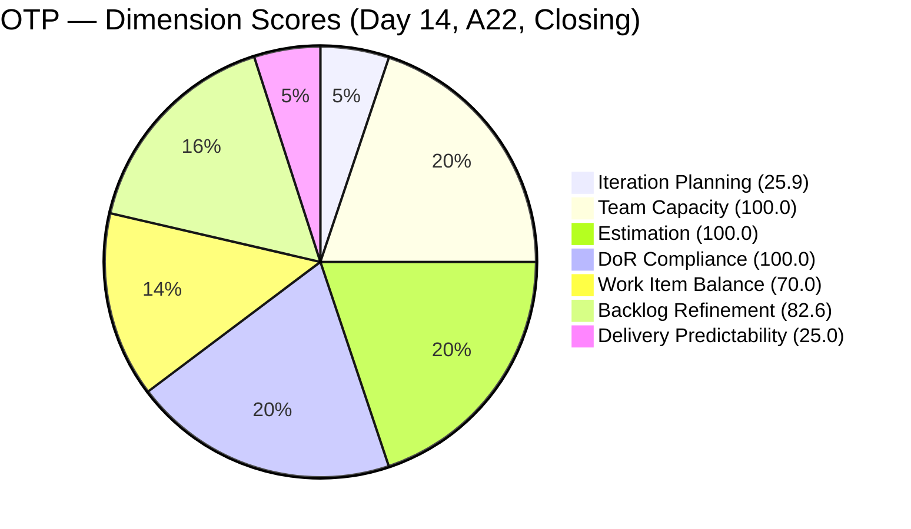
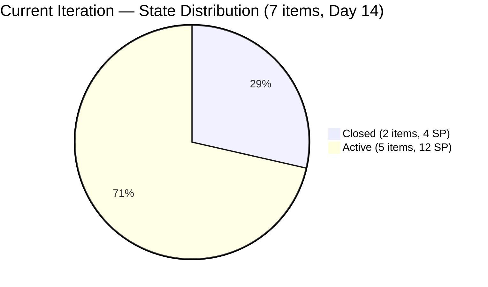
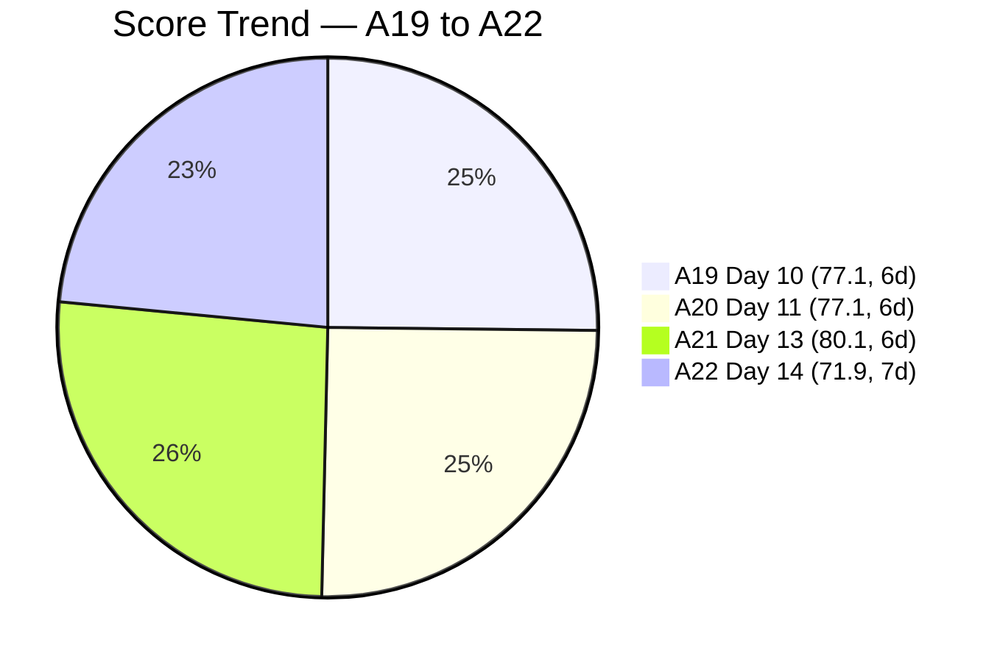

# SAFe Audit Report — OTP Team | Iteration 6.6 (IP) Day 14 (Final Day)

## 1. Audit Metadata

| Field | Value |
|-------|-------|
| **Project** | OTP (Office of the President) |
| **Project ID** | `e7739905-28a3-4ae1-9173-7f6cd13b3494` |
| **Team** | OTP Team |
| **Team ID** | `64de61f0-1203-4b01-aee2-6b4415aec52b` |
| **Workspace Folder** | `ado_otp` |
| **Current Iteration** | Iteration 6.6 (IP) |
| **Iteration Path** | `OTP\2026 - PI6\Iteration 6.6 (IP)` |
| **Iteration Start** | March 23, 2026 |
| **Iteration Finish** | April 5, 2026 |
| **Iteration Day** | Day 14 of 14 (100% elapsed) — CLOSING DAY |
| **Audit Date** | April 5, 2026 |
| **Framework** | SAFe 6.0 |
| **Scoring Rubric** | ADO SAFe v1 (seven-dimension deterministic scoring) |
| **Prior Audit** | AUDIT_20260404_0900.md (A21, Day 13, Score: 80.1/100, 6-dim) |
| **Audit Sequence** | A22 — Day 14 of Iteration 6.6 (IP) — CLOSING AUDIT |
| **Overall Score** | **71.9 / 100** |
| **Risk Band** | **Moderate Risk** |

---

## 2. Executive Summary

The OTP Team scores **71.9/100 (Moderate Risk)** on the closing day (Day 14) of Iteration 6.6 (IP). This represents a **-8.2 point drop** from the prior audit (A21, 80.1/100 Low Risk) due to the introduction of the **7-dimension scoring rubric** adding Delivery Predictability. The team drops from Low Risk back to Moderate Risk.

The underlying ADO data has **not changed materially** since the prior audit. The 7 iteration items remain identical: 2 Closed (#200697, #201132) and 5 Active (#198759, #198760, #198762, #199522, #200686). The **27 visible backlog items** (up from 24 in the prior audit) reflect 3 new items (#202229, #202241, #202249) that were added for PI7 planning and 5 items moved to Iteration 7.1 (#198587, #201807, #202229, #202241, #202249).

The new **Delivery Predictability dimension scores 25.0** (4 SP closed of 16 SP committed), which pulls the overall score down significantly. The **P1 recommendation to close #199522 and #200686 remains unactioned for the ninth consecutive audit** spanning 12 calendar days.

**Team note:** Grace is the sole assignee for all OTP work items. This is an accepted structural constraint per project exception.

---

## 3. Previous Audit Delta

| Dimension | A21 — Day 13 (Apr 4, 6-dim) | A22 — Day 14 (Apr 5, 7-dim) | Delta |
|-----------|------------------------------|------------------------------|-------|
| Iteration Planning | 29.2 | 25.9 | -3.3 |
| Team Capacity | 100.0 | 100.0 | 0.0 |
| Estimation | 100.0 | 100.0 | 0.0 |
| DoR Compliance | 100.0 | 100.0 | 0.0 |
| Work Item Balance | 70.0 | 70.0 | 0.0 |
| Backlog Refinement | 81.7 | 82.6 | +0.9 |
| Delivery Predictability | N/A (new dim) | 25.0 | — |
| **Overall** | **80.1 (6-dim)** | **71.9 (7-dim)** | **-8.2** |

**Key observations since A21:**

- **Score decreased by 8.2 points** due to the addition of the 7th dimension (Delivery Predictability at 25.0). The 6-dimension equivalent would be (25.9+100+100+100+70+82.6)/6 = 79.7, comparable to the prior 80.1.
- **Visible backlog increased from 24 to 27** — 3 new items added: #202229 (Invitation Letter from Akira), #202241 (Signing of Intake Form), #202249 (Submission of H1B Requirements). These are new PI7 planning items.
- **Iteration Planning decreased from 29.2 to 25.9** — denominator grew from 24 to 27 with the new items while numerator stayed at 7.
- **Backlog Refinement slightly improved from 81.7 to 82.6** — fresh items increased from 22/24 (91.7%) to 25/27 (92.6%) with the 3 new items all being fresh.
- **5 items moved to Iteration 7.1:** #198587, #201807, #202229, #202241, #202249 — PI7 planning initiated.
- **#199522 and #200686 remain Active** with ChangedDate of Mar 22 — now 14 days without modification, flagged for the **ninth consecutive audit**.
- **No new items Closed** since A21.

---

## 4. Current Iteration Snapshot

| Metric | Value |
|--------|-------|
| Iteration | 6.6 (IP) — Mar 23 to Apr 5, 2026 |
| Root items in iteration | 7 |
| Total Story Points | 16 SP |
| Closed items | 2 (4 SP credited, 25%) |
| Active items | 5 (12 SP remaining) |
| Unestimated items | 0 |
| Iteration elapsed | 100% (Day 14 of 14) — CLOSING DAY |
| Visible root backlog items | 27 |
| Contributors with current work | 1 (Grace) |
| Contributors with capacity | 1 (Grace, 1 hr/day Documentation) |
| Fresh items (changed >= Feb 19, 2026) | 25 / 27 (92.6%) |
| Stale > 90 days | 0 |
| Stale > 180 days | 0 |
| Untouched current items (changed < Mar 23) | 2 / 7 (28.6%) |

---

## 5. Work Item Analysis

### Current Iteration Items (7)

| ID | Type | Title | State | SP | Changed | DoR | Notes |
|----|------|-------|-------|----|---------|-----|-------|
| #200697 | User Story | ISTIV Values Integration Workshop | **Closed** | 2 | Mar 25 | Pass | Closed during sprint; 2 SP credited |
| #201132 | User Story | ROD Compliance for TCT Transfer | **Closed** | 2 | Mar 30 | Pass | Closed during sprint; 2 SP credited |
| #198759 | User Story | Bomar Visa (US B1/B2) | Active | 2 | Apr 1 | Pass | Tasks done; pending external dependency |
| #198760 | User Story | Jove Visa (US B1/B2) | Active | 2 | Mar 26 | Pass | Tasks done; pending external dependency |
| #198762 | User Story | Bon Visa (US B1/B2) | Active | 2 | Mar 26 | Pass | Tasks done; pending external dependency |
| #199522 | User Story | PhilGeps Platinum Renewal | Active | 4 | **Mar 22** | Pass | **Untouched — 9th consecutive P1 flag** |
| #200686 | User Story | Client Negotiation JESI | Active | 2 | **Mar 22** | Pass | **Untouched — 9th consecutive P1 flag** |

### State Distribution

| State | Count | SP |
|-------|-------|----|
| Closed | 2 | 4 SP |
| Active | 5 | 12 SP |

At Day 14 (100% elapsed), 2 of 7 items are Closed (4 SP credited, 25%). The 3 visa stories remain Active pending external dependencies. The 2 untouched items have tasks completed but have not been state-transitioned.

### New Backlog Items Since A21 (3)

| ID | Title | SP | Changed | Iteration | DoR |
|----|-------|-----|---------|-----------|-----|
| #202229 | Invitation Letter from Akira | 2 | Apr 6 | PI7/7.1 | Pass |
| #202241 | Signing of Intake Form with payment | 2 | Apr 6 | PI7/7.1 | Pass |
| #202249 | Submission of H1B Requirements | 2 | Apr 6 | PI7/7.1 | Fail (no AC) |

### Items Moved to PI7/Iteration 7.1 (5)

| ID | Title | SP | Notes |
|----|-------|-----|-------|
| #198587 | Installation of JIT Signage | 3 | DoR Pass |
| #201807 | Site Assessment & Technical Design | 2 | DoR Pass |
| #202229 | Invitation Letter from Akira | 2 | New + assigned to 7.1 |
| #202241 | Signing of Intake Form | 2 | New + assigned to 7.1 |
| #202249 | Submission of H1B Requirements | 2 | New; no AC |

### Non-Fresh Items (2)

| ID | Title | Changed | Age (days) |
|----|-------|---------|------------|
| #157728 | Davao Chamber of Commerce | Feb 3, 2026 | 61 |
| #195284 | Prepare Secretary's Certificate | Feb 1, 2026 | 63 |

Both are outside the 45-day freshness window but well within 90 days.

---

## 6. SAFe Compliance Scorecard

| Dimension | Score | Evidence | Notes |
|-----------|-------|----------|-------|
| Iteration Planning | 25.9 | 7 current / 27 visible | -3.3; denominator grew with 3 new items |
| Team Capacity | 100.0 | 1/1 contributor with capacity | Grace: 1 hr/day Documentation; single-assignee accepted |
| Estimation | 100.0 | 7/7 point-eligible items have SP > 0 | All items estimated |
| DoR Compliance | 100.0 | 7/7 current items pass DoR | All items have Description >= 30 chars and AC >= 20 chars |
| Work Item Balance | 70.0 | All 7 items are User Stories (100%) | -30 penalty: dominant type > 60% |
| Backlog Refinement | 82.6 | base 92.6 - 10 (untouched 28.6% > 10%) = 82.6 | Slight improvement from 81.7 |
| Delivery Predictability | 25.0 | 4 SP closed / 16 SP committed | Only 2 items Closed at sprint end |
| **Overall** | **71.9** | Average of 7 dimensions | **Moderate Risk** (60-79.9 band) |

### Score Computation Detail

| Dimension | Formula | Calculation | Result |
|-----------|---------|-------------|--------|
| Iteration Planning | current / visible x 100 | 7 / 27 x 100 | 25.9 |
| Team Capacity | cap / work_assignees x 100 | 1 / 1 x 100 | 100.0 |
| Estimation | estimated / point_eligible x 100 | 7 / 7 x 100 | 100.0 |
| DoR Compliance | dor_compliant / current x 100 | 7 / 7 x 100 | 100.0 |
| Work Item Balance | 100 - penalties | 100 - 30 (dominant > 60%) | 70.0 |
| Backlog Refinement | base - penalties | 92.6 - 10 (untouched > 10%) | 82.6 |
| Delivery Predictability | closed_sp / committed_sp x 100 | 4 / 16 x 100 | 25.0 |
| **Overall** | average(all 7) | (25.9+100+100+100+70+82.6+25)/7 | **71.9** |

---

## 7. Dimension Findings

### 7.1 Iteration Planning (25.9) — Decreased (-3.3)

7 of 27 visible backlog items are in the current iteration. The decrease from 29.2 is due to the denominator growing from 24 to 27 with 3 new PI7 items. The IP period concludes today with PI7 planning underway — 5 items already assigned to Iteration 7.1.

### 7.2 Team Capacity (100.0) — Healthy

Grace is the sole contributor with capacity configured at 1 hr/day (Documentation activity). Single-assignee model is an accepted project exception.

### 7.3 Estimation (100.0) — Full Score

All 7 current items have Story Points. All non-current items are also estimated. Consistent practice across the entire backlog.

### 7.4 DoR Compliance (100.0) — Full Score

All 7 current items have substantial Description and Acceptance Criteria. The visa stories and the 2 Closed items are exemplary DoR implementations. Note: #202249 (new, in PI7) lacks AC but is not in the current iteration.

### 7.5 Work Item Balance (70.0) — Structural Constraint

All 7 current items are User Stories (100% concentration). The -30 penalty for dominant type > 60% applies. This is structurally expected for OTP's operational nature.

### 7.6 Backlog Refinement (82.6) — Slight Improvement (+0.9)

Base score: 92.6% (25/27 fresh). The untouched penalty of -10 applies (2/7 = 28.6% > 10%). Improvement from 81.7 is due to the 3 new fresh items increasing the fresh percentage from 91.7% to 92.6%.

If #199522 and #200686 are Closed: untouched drops to 0/7 = 0% (or 0/5 if they leave iteration), eliminating the penalty entirely.

### 7.7 Delivery Predictability (25.0) — Low

Only 4 of 16 committed Story Points were delivered (25%). Two items Closed: #200697 (2 SP, Mar 25) and #201132 (2 SP, Mar 30). The remaining 5 items (12 SP) are Active at sprint close.

**Mitigating context:** 3 of the 5 Active items are visa applications (#198759, #198760, #198762) blocked by external embassy dependencies outside team control. The 2 untouched items (#199522, #200686) have all tasks completed and could be Closed with minimal effort.

If #199522 (4 SP) and #200686 (2 SP) were Closed: DP = 10/16 = 62.5%. If visa stories were also Closed: DP = 16/16 = 100%.

---

## 8. Risks and Bottlenecks

| Priority | Risk | Impact |
|----------|------|--------|
| HIGH | **#199522 and #200686 still Active — 9th consecutive audit unactioned** | Both have all tasks completed since Mar 22; 14 days without state transition; 6 SP uncredited |
| HIGH | **Delivery Predictability at 25.0 — 75% of SP uncommitted at sprint close** | Pulls overall from Low Risk to Moderate Risk; 12 SP Active at 100% elapsed |
| MEDIUM | **3 visa stories blocked on external dependencies** | #198759, #198760, #198762 cannot be closed until embassy processes complete; 6 SP at risk |
| MEDIUM | **#202249 (H1B Requirements) missing Acceptance Criteria** | New item entering PI7 without DoR compliance |
| LOW | **#201820 in PI6 root, not in an iteration** | May be accidental placement; should be in PI7 or OTP root |

---

## 9. Prioritized Recommendations

| Priority | Action | Expected Outcome | Target |
|----------|--------|------------------|--------|
| **P1** | **Close #199522 (PhilGeps) and #200686 (Client JESI).** This is the **9th consecutive audit** with this as P1. All tasks are Closed. Estimated time: 5 minutes. | Removes untouched penalty; BR improves to ~92.6. DP improves to 62.5%. Overall ~76.4. | **Immediate** |
| **P2** | **Transition visa stories (#198759, #198760, #198762) to Resolved or Closed** if external dependencies are met. At Day 14 with tasks done, these should reflect actual status. | Accurate state representation; credits 6 SP; DP to 100% | Immediate |
| **P3** | **Add Acceptance Criteria to #202249** (Submission of H1B Requirements) before PI7 sprint start. | DoR compliance for PI7 items | Today/PI7 Day 1 |
| **P4** | **Move #201820 to PI7 or OTP root.** Currently in `OTP\2026-PI6` (not an iteration). | Correct iteration path | Today |
| **P5** | **Author AC for the 5 non-current backlog items missing it.** Prioritize fire safety items (#175360-#175365) and #191906. | Improves backlog DoR readiness for PI7 | During PI7 planning |

---

## 10. Evidence Gaps and Limitations

| Gap | Impact | Mitigation |
|-----|--------|------------|
| **Scoring model transition to 7-dimension** | Overall dropped from 80.1 to 71.9 due to DP addition; not a real regression | 6-dim equivalent = 79.7, consistent with prior trend |
| **P1 from A14-A21 not executed — 9th consecutive audit** | #199522 and #200686 remain Active; untouched penalty persists | Escalated to P1 again; closing would raise DP to 62.5% |
| **Visa story state transitions depend on embassy processes** | Active state may be accurate even with tasks done; external dependencies outside team control | May need a "Blocked" marker |
| **Grace capacity at 1 hr/day** | Configured as Documentation activity; no ADO record explaining the reduced capacity | Carried forward from prior audits |
| **3 new items detected with Apr 6 ChangedDate** | Items were created/moved during PI transition window | Counted in backlog as they appear in the query |
| **#202249 has description referencing an image attachment** | Cannot verify description length from image content | Description text present but AC is missing |

---

## Action Item Tracking — A14 to A22

| Recommendation | First Flagged | A22 Status |
|---------------|---------------|------------|
| Close #199522 and #200686 | A14 (Day 4) | **P1 — Still not done (9th audit)** |
| Close #201132 | A14 (Day 4) | **DONE** (Closed Mar 30) |
| Transition visa stories | A15 (Day 5) | P2 — Not done |
| Schedule PI7 iterations | A14 (Day 4) | **DONE** — 5 items assigned to 7.1 |
| Author DoR for backlog | A14 (Day 4) | P5 — Partial (new items have DoR, old ones do not) |

> **2 of 5 tracked recommendations completed.** Closing 2 items (~5 minutes) remains the highest-impact unactioned recommendation after nine audits spanning 12 calendar days.

---

### P1 Impact Simulation

If #199522 and #200686 are Closed today:

- Current iteration: still 7 items, but 4 now Closed (4 SP + 6 SP = 10 SP credited)
- Untouched: 0/7 = 0% (both items updated)
- BR: 92.6 - 0 penalties = 92.6
- DP: 10/16 = 62.5%
- IP: 7/27 = 25.9 (unchanged)
- Overall: (25.9+100+100+100+70+92.6+62.5)/7 = **78.7 (Moderate Risk, +6.8)**

If visa stories are also Closed:

- DP: 16/16 = 100%
- Overall: (25.9+100+100+100+70+92.6+100)/7 = **84.1 (Low Risk)**

---

---

*Report generated: April 5, 2026 | SAFe 6.0 Framework | ADO SAFe v1 (seven-dimension deterministic scoring)*
*OTP — OTP Team | Iteration 6.6 (IP): Mar 23 - Apr 5, 2026*
*Overall Score: 71.9/100 (Moderate Risk) | Day 14 of 14 (100% elapsed) — CLOSING AUDIT | A22*
*Previous: AUDIT_20260404_0900.md (A21, Day 13, 80.1/100, 6-dimension) | -8.2 change (model transition)*
