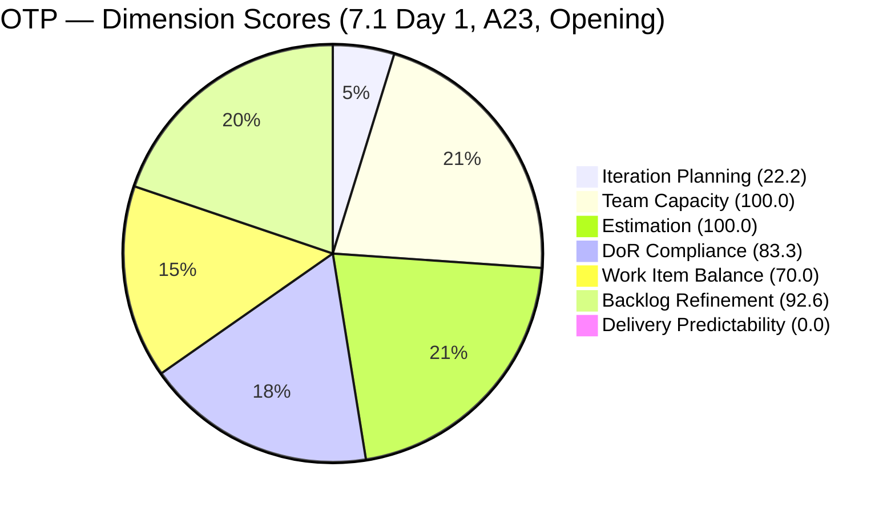
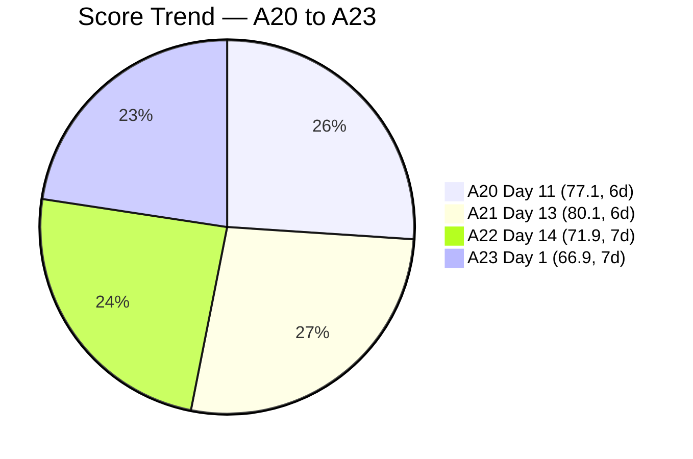

# SAFe Audit Report — OTP Team | Iteration 7.1 Day 1 (Opening)

## 1. Audit Metadata

| Field | Value |
|-------|-------|
| **Project** | OTP (Office of the President) |
| **Project ID** | `e7739905-28a3-4ae1-9173-7f6cd13b3494` |
| **Team** | OTP Team |
| **Team ID** | `64de61f0-1203-4b01-aee2-6b4415aec52b` |
| **Workspace Folder** | `ado_otp` |
| **Current Iteration** | Iteration 7.1 |
| **Iteration Path** | `OTP\2026 - PI7\Iteration 7.1` |
| **Iteration Start** | April 6, 2026 |
| **Iteration Finish** | April 19, 2026 |
| **Iteration Day** | Day 1 of 14 (7% elapsed) |
| **Audit Date** | April 6, 2026 (PST) |
| **Framework** | SAFe 6.0 |
| **Scoring Rubric** | ADO SAFe v1 (seven-dimension deterministic scoring) |
| **Prior Audit** | AUDIT_20260405_0900.md (A22, Day 14 closing, Iteration 6.6 IP, Score: 71.9/100) |
| **Audit Sequence** | A23 — Day 1 of Iteration 7.1 — OPENING AUDIT |
| **Overall Score** | **66.9 / 100** |
| **Risk Band** | **Moderate Risk** |

---

## 2. Executive Summary

The OTP Team scores **66.9/100 (Moderate Risk)** on the opening day (Day 1) of Iteration 7.1, the first sprint of PI7. This is a **-5.0 point drop** from the closing audit of Iteration 6.6 IP (71.9, Moderate Risk), keeping the team in the Moderate Risk band.

The score drop is driven by **Delivery Predictability falling from 25.0 to 0.0** (expected on Day 1 with no closed items) offset by improvements in **DoR Compliance (83.3, down from 100 due to #202249)** and a healthy **Backlog Refinement of 92.6** with zero penalties.

Iteration 7.1 contains **6 items totaling 13 SP** — a mix of carried-forward items (#198587, #201807) and 3 new items (#200681, #202229, #202241, #202249) created during PI transition. Notably, the **5 items from Iteration 6.6 IP that were flagged for closure (#199522, #200686, and the 3 visa stories) remain in Iteration 6.6 IP** and are NOT in Iteration 7.1 — they sit on the backlog but in the prior iteration path.

Grace's capacity has been **doubled from 1 hr/day to 2 hr/day** (Deployment + Documentation activities), the first capacity increase in the audit series. The single-assignee model remains an accepted project exception.

**The P1 recommendation to close #199522 and #200686 remains unactioned for the 10th consecutive audit.**

---

## 3. Previous Audit Delta

| Dimension | A22 — 6.6 IP Day 14 (Apr 5) | A23 — 7.1 Day 1 (Apr 6) | Delta |
|-----------|------------------------------|---------------------------|-------|
| Iteration Planning | 25.9 | 22.2 | -3.7 |
| Team Capacity | 100.0 | 100.0 | 0.0 |
| Estimation | 100.0 | 100.0 | 0.0 |
| DoR Compliance | 100.0 | 83.3 | -16.7 |
| Work Item Balance | 70.0 | 70.0 | 0.0 |
| Backlog Refinement | 82.6 | 92.6 | +10.0 |
| Delivery Predictability | 25.0 | 0.0 | -25.0 |
| **Overall** | **71.9** | **66.9** | **-5.0** |

**Key observations since A22:**

- **New iteration, new PI:** Iteration 7.1 is the first sprint of PI7. The team transitioned from the IP sprint.
- **6 items in 7.1 vs 7 in 6.6 IP:** The iteration roster changed substantially. #199522, #198759, #198760, #198762, #200686 (all from 6.6 IP) are NOT in 7.1 — they remain in their old iteration path on the backlog. New items: #200681 (Team Re-Architecture), #202229 (Akira Invitation), #202241 (Intake Form), #202249 (H1B Requirements).
- **Backlog count stable at 27** — same as the closing audit.
- **Grace capacity increased to 2 hr/day** (Deployment + Documentation) from 1 hr/day (Documentation only).
- **DoR Compliance dropped from 100.0 to 83.3** — #202249 (Submission of H1B Requirements) has no Acceptance Criteria, the same gap flagged in A22.
- **Backlog Refinement improved from 82.6 to 92.6** — the untouched penalty that applied in 6.6 IP (from #199522 and #200686) no longer applies because neither item is in the current iteration. All 6 current items were touched today (Apr 6).
- **#199522 and #200686 still Active in 6.6 IP** — now the **10th consecutive audit** with this as the P1 recommendation.

---

## 4. Current Iteration Snapshot

| Metric | Value |
|--------|-------|
| Iteration | 7.1 — Apr 6 to Apr 19, 2026 |
| Root items in iteration | 6 |
| Total Story Points | 13 SP |
| Closed items | 0 |
| New items | 6 (all in New state) |
| Iteration elapsed | 7% (Day 1 of 14) |
| Visible root backlog items | 27 |
| Contributors with current work | 1 (Grace) |
| Contributors with capacity | 1 (Grace, 2 hr/day: Deployment + Documentation) |
| Fresh items (changed >= Feb 20, 2026) | 25 / 27 (92.6%) |
| Stale > 90 days | 0 |
| Stale > 180 days | 0 |
| Untouched current items (changed < Apr 6) | 0 / 6 (0.0%) |

---

## 5. Work Item Analysis

### Current Iteration Items (6)

| ID | Type | Title | State | SP | Changed | DoR | Notes |
|----|------|-------|-------|----|---------|-----|-------|
| #198587 | User Story | Installation of JIT Signage | New | 3 | Apr 6 | Pass | Carried from 6.6 IP; has 5 tasks |
| #200681 | User Story | Team Re-Architecture (Operational Phase) | New | 2 | Apr 6 | Pass | New PI7 item; has 3 tasks |
| #201807 | User Story | Site Assessment & Technical Design | New | 2 | Apr 6 | Pass | Carried from 6.6 IP; solar project |
| #202229 | User Story | Invitation Letter from Akira | New | 2 | Apr 6 | Pass | New; H-1B visa process |
| #202241 | User Story | Signing of Intake Form with payment | New | 2 | Apr 6 | Pass | New; H-1B visa process |
| #202249 | User Story | Submission of H1B Requirements | New | 2 | Apr 6 | **Fail** (no AC) | New; description references image |

### Items Remaining in 6.6 IP (Not in 7.1) — On Backlog

| ID | Title | State | SP | Changed | Notes |
|----|-------|-------|----|---------|-------|
| #199522 | Renewal of PhilGeps | Active | 4 | Mar 22 | **P1 — 10th consecutive audit unactioned** |
| #200686 | Client Negotiation JESI | Active | 2 | Mar 22 | **P1 — 10th consecutive audit unactioned** |
| #198759 | Bomar Visa (US B1/B2) | Active | 2 | Apr 1 | External dependency (embassy) |
| #198760 | Jove Visa (US B1/B2) | Active | 2 | Mar 26 | External dependency (embassy) |
| #198762 | Bon Visa (US B1/B2) | Active | 2 | Mar 26 | External dependency (embassy) |

### Non-Fresh Backlog Items (2)

| ID | Title | Changed | Age (days) |
|----|-------|---------|------------|
| #157728 | Davao Chamber of Commerce | Feb 3, 2026 | 62 |
| #195284 | Prepare Secretary's Certificate | Feb 1, 2026 | 64 |

Both are outside the 45-day freshness window but well within 90 days.

### State Distribution (Current Iteration)

| State | Count | SP |
|-------|-------|----|
| New | 6 | 13 |

All 6 items are in New state on Day 1. No work has started yet.

---

## 6. SAFe Compliance Scorecard

| Dimension | Score | Evidence | Notes |
|-----------|-------|----------|-------|
| Iteration Planning | 22.2 | 6 current / 27 visible | -3.7; fewer items in 7.1 than in 6.6 IP |
| Team Capacity | 100.0 | 1/1 contributor with capacity | Grace: 2 hr/day (Deployment + Documentation); single-assignee accepted |
| Estimation | 100.0 | 6/6 point-eligible items have SP > 0 | All items estimated |
| DoR Compliance | 83.3 | 5/6 current items pass DoR | -16.7; #202249 missing Acceptance Criteria |
| Work Item Balance | 70.0 | All 6 items are User Stories (100%) | -30 penalty: dominant type > 60% |
| Backlog Refinement | 92.6 | base 92.6 - 0 penalties = 92.6 | +10.0; no untouched penalty in new iteration |
| Delivery Predictability | 0.0 | 0 SP closed / 13 SP committed | Early-sprint Day 1 — low delivery expected |
| **Overall** | **66.9** | Average of 7 dimensions | **Moderate Risk** (60-79.9 band) |

### Score Computation Detail

| Dimension | Formula | Calculation | Result |
|-----------|---------|-------------|--------|
| Iteration Planning | current / visible x 100 | 6 / 27 x 100 | 22.2 |
| Team Capacity | cap / work_assignees x 100 | 1 / 1 x 100 | 100.0 |
| Estimation | estimated / point_eligible x 100 | 6 / 6 x 100 | 100.0 |
| DoR Compliance | dor_compliant / current x 100 | 5 / 6 x 100 | 83.3 |
| Work Item Balance | 100 - penalties | 100 - 30 (dominant > 60%) | 70.0 |
| Backlog Refinement | base - penalties | 92.6 - 0 | 92.6 |
| Delivery Predictability | closed_sp / committed_sp x 100 | 0 / 13 x 100 | 0.0 |
| **Overall** | average(all 7) | (22.2+100+100+83.3+70+92.6+0)/7 | **66.9** |

---

## 7. Dimension Findings

### 7.1 Iteration Planning (22.2) — Decreased (-3.7)

6 of 27 visible backlog items are in Iteration 7.1. The decrease from 25.9 is due to fewer items in the current iteration (6 vs 7) while the denominator remains 27. The 5 items from 6.6 IP (#199522, #200686, #198759, #198760, #198762) were not moved to 7.1 and remain in their old iteration path.

### 7.2 Team Capacity (100.0) — Healthy

Grace is the sole contributor with capacity configured. Her capacity has been increased to 2 hr/day with two activities: Deployment (1 hr/day) and Documentation (1 hr/day). This is the first capacity increase in the audit series. Single-assignee model is an accepted project exception.

### 7.3 Estimation (100.0) — Full Score

All 6 current items have Story Points. Total committed: 13 SP. Backlog estimation is also strong — all 27 visible items have SP assigned.

### 7.4 DoR Compliance (83.3) — Decreased (-16.7)

5 of 6 current items pass DoR. The non-compliant item:

- **#202249** (Submission of H1B Requirements): Has Description (references image) but no Acceptance Criteria. This was flagged as P3 in the A22 closing audit and remains unresolved.

### 7.5 Work Item Balance (70.0) — Unchanged

All 6 current items are User Stories (100% concentration). The -30 penalty for dominant type > 60% applies. This is structurally expected for OTP's operational nature — the team works exclusively with User Stories.

### 7.6 Backlog Refinement (92.6) — Improved (+10.0)

Base score: 92.6% (25/27 fresh). No penalties apply:

- stale_90 = 0/27 = 0% -> none
- stale_180 = 0 -> none
- untouched = 0/6 = 0% -> none (all items changed Apr 6)

The improvement from 82.6 is due to the elimination of the untouched penalty. In the prior audit, #199522 and #200686 (both with ChangedDate Mar 22) were in the iteration and triggered the -10 penalty for > 10% untouched. Neither is in 7.1, so the penalty no longer applies.

### 7.7 Delivery Predictability (0.0) — Early-Sprint Day 1

0 of 13 committed SP closed. Expected on Day 1. Early-sprint annotation applies per rubric.

---

## 8. Risks and Bottlenecks

| Priority | Risk | Impact |
|----------|------|--------|
| HIGH | **#199522 and #200686 still Active in 6.6 IP — 10th consecutive audit unactioned** | 6 SP uncredited; both have all tasks Closed since Mar 22; 15+ days without state transition |
| HIGH | **5 items stranded in Iteration 6.6 IP path** | #199522, #200686, #198759, #198760, #198762 are on the backlog but not in any active iteration; they risk becoming orphaned |
| MEDIUM | **#202249 missing Acceptance Criteria** | DoR gap; H1B compliance item should have documented scope before work begins |
| MEDIUM | **3 visa stories blocked on external dependencies** | #198759, #198760, #198762 cannot be closed until embassy processes complete; 6 SP stranded |
| LOW | **All items in New state** | Expected on Day 1; monitor for progression by Day 3 |

---

## 9. Prioritized Recommendations

| Priority | Action | Expected Outcome | Target |
|----------|--------|------------------|--------|
| **P1** | **Close #199522 (PhilGeps) and #200686 (Client JESI).** This is the **10th consecutive audit** with this as P1. All tasks are Closed. Estimated time: 5 minutes. | Removes 6 SP of stranded work from the backlog. | **Immediate** |
| **P2** | **Move #199522, #200686, and the 3 visa stories to Iteration 7.1 or close them.** They are stranded in Iteration 6.6 IP which has ended. | Proper iteration hygiene; items either credited or properly relocated. | Day 1 |
| **P3** | **Add Acceptance Criteria to #202249** (Submission of H1B Requirements). | DoR compliance rises from 83.3 to 100.0 (+2.4 overall). | Day 1-2 |
| **P4** | **Begin work on the 6 iteration items.** All are in New state — target at least 2 items to Active by Day 3. | Evidence of sprint engagement; avoids stalled-sprint pattern. | Day 1-3 |
| **P5** | **Transition visa stories (#198759, #198760, #198762) if embassy status allows.** | Clears 6 SP of blocked work from the backlog. | When dependencies resolve |

---

## 10. Evidence Gaps and Limitations

| Gap | Impact | Mitigation |
|-----|--------|------------|
| **Day 1 audit context** | DP = 0.0 is expected; overall score will rise as items are completed | Early-sprint annotation applied |
| **5 items stranded in 6.6 IP** | Not counted as current iteration items; they inflate the backlog but don't contribute to 7.1 metrics | Flagged in P2 recommendation |
| **P1 from A14 — 10th consecutive audit** | #199522 and #200686 remain Active despite all tasks Closed | Escalated to P1 again |
| **Grace capacity at 2 hr/day** | New activity (Deployment) added; first change in capacity configuration across the audit series | Positive signal; monitor actual output |
| **#202249 description references image** | Cannot verify full scope from image content alone | Description text is present; AC is the gap |

---

## Action Item Tracking — A14 to A23

| Recommendation | First Flagged | A23 Status |
|---------------|---------------|------------|
| Close #199522 and #200686 | A14 (Day 4) | **P1 — Still not done (10th audit)** |
| Close #201132 | A14 (Day 4) | **DONE** (Closed Mar 30) |
| Transition visa stories | A15 (Day 5) | P5 — Not done; external dependency |
| Schedule PI7 iterations | A14 (Day 4) | **DONE** — Iteration 7.1 active with 6 items |
| Add AC to #202249 | A22 (Day 14) | P3 — Not done |
| Author DoR for backlog | A14 (Day 4) | P5 — Partial |

> **2 of 6 tracked recommendations completed.** The P1 (5 minutes of effort) is now entering its 3rd week unactioned.

---

### P1 Impact Simulation

If #199522 and #200686 are Closed today (and moved to 7.1):

- Current iteration: 8 items, 2 Closed (6 SP), 6 New (13 SP) = 19 SP total
- IP: 8/27 = 29.6%
- DP: 6/19 = 31.6%
- Untouched: 2/8 = 25% > 10% -> -10 penalty on BR
- BR: 92.6 - 10 = 82.6
- Overall: (29.6+100+100+83.3+70+82.6+31.6)/7 = **71.0 (Moderate Risk, +4.1)**

If only Closed (staying in 6.6 IP):

- Backlog shrinks to 25, iteration stays at 6
- IP: 6/25 = 24.0
- Fresh: 23/25 = 92.0
- BR: 92.0 - 0 = 92.0
- Overall: (24.0+100+100+83.3+70+92.0+0)/7 = **67.0 (Moderate Risk, +0.1)**

---

> Note: Delivery Predictability shown as 0.1 for chart visibility; actual score is 0.0.

---

*Report generated: April 6, 2026 | SAFe 6.0 Framework | ADO SAFe v1 (seven-dimension deterministic scoring)*
*OTP — OTP Team | Iteration 7.1: Apr 6 - Apr 19, 2026*
*Overall Score: 66.9/100 (Moderate Risk) | Day 1 of 14 (7% elapsed) — OPENING AUDIT | A23*
*Previous: AUDIT_20260405_0900.md (A22, Day 14 closing, 71.9/100, Iteration 6.6 IP) | -5.0 change (new iteration)*
