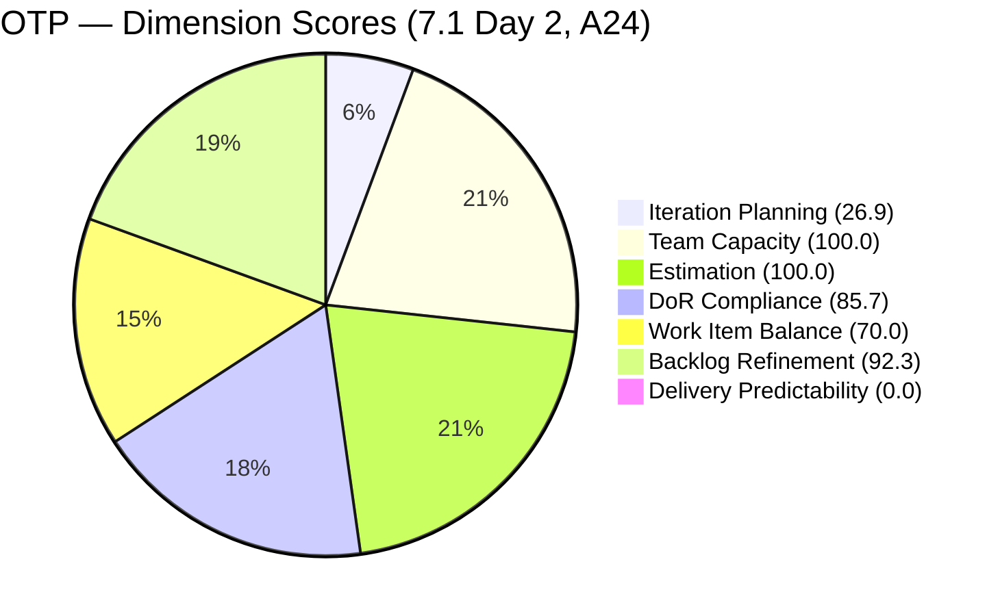
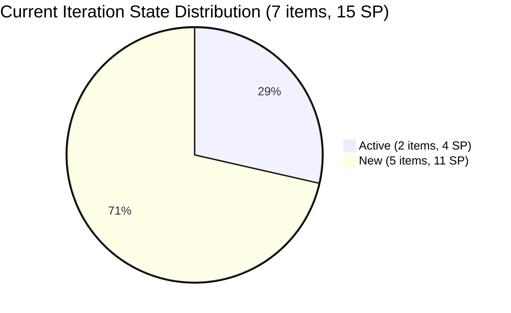
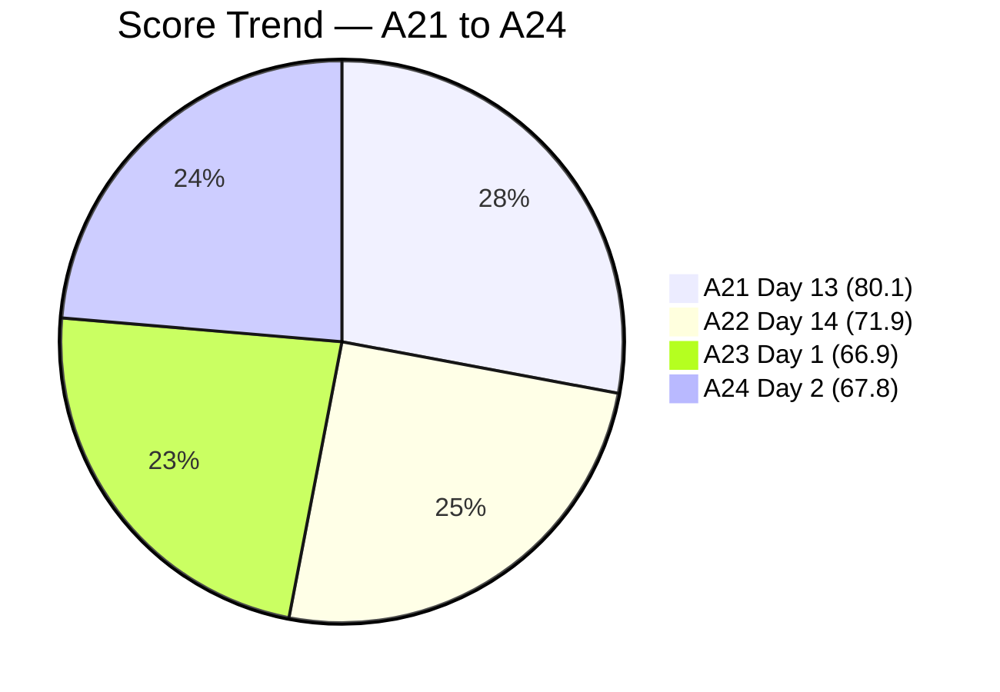
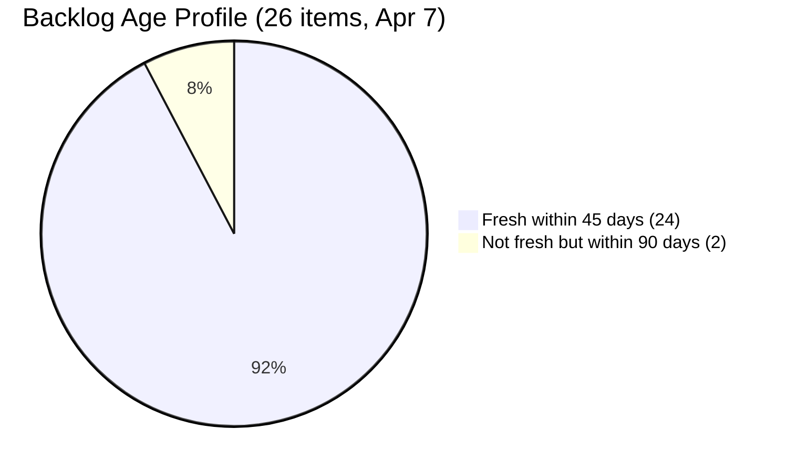

# SAFe Audit Report — OTP Team | Iteration 7.1 Day 2

## 1. Audit Metadata

| Field | Value |
|-------|-------|
| **Project** | OTP (Office of the President) |
| **Project ID** | `e7739905-28a3-4ae1-9173-7f6cd13b3494` |
| **Team** | OTP Team |
| **Team ID** | `64de61f0-1203-4b01-aee2-6b4415aec52b` |
| **Workspace Folder** | `ado_otp` |
| **Current Iteration** | Iteration 7.1 |
| **Iteration Path** | `OTP\2026 - PI7\Iteration 7.1` |
| **Iteration Start** | April 6, 2026 |
| **Iteration Finish** | April 19, 2026 |
| **Iteration Day** | Day 2 of 14 (14% elapsed) |
| **Audit Date** | April 7, 2026 |
| **Framework** | SAFe 6.0 |
| **Scoring Rubric** | ADO SAFe v1 (seven-dimension deterministic scoring) |
| **Prior Audit** | AUDIT_20260406_0900.md (A23, Day 1 opening, Iteration 7.1, Score: 66.9/100) |
| **Audit Sequence** | A24 — Day 2 of Iteration 7.1 |
| **Overall Score** | **67.8 / 100** |
| **Risk Band** | **Moderate Risk** |

---

## 2. Executive Summary

The OTP Team scores **67.8/100 (Moderate Risk)** on Day 2 of Iteration 7.1 — a **+0.9 point improvement** from the Day 1 opening audit (66.9). The team remains firmly in the Moderate Risk band.

The most significant development since Day 1 is **partial resolution of the long-standing P1 recommendation**: **#200686 (Client Negotiation JESI)** has been **moved from Iteration 6.6 IP into Iteration 7.1**. This had been the P1 recommendation from audit A14 and was flagged for 11 consecutive audits. Additionally, **#200681 (Team Re-Architecture) changed state to Active**, and **multiple items were touched today** — all 7 current iteration items show a ChangedDate of April 7.

The iteration now contains **7 items totaling 15 SP** (up from 6 items / 13 SP yesterday), improving Iteration Planning from 22.2 to 26.9. DoR Compliance improved from 83.3 to 85.7 because #200686 now passes DoR.

**#199522 (Renewal of PhilGeps, 4 SP) remains Active in Iteration 6.6 IP** — the second part of the original P1 remains unactioned for the 12th consecutive audit. The 3 visa stories (#198759, #198760, #198762) also remain stranded in 6.6 IP, pending external embassy dependencies. **#202249 (Submission of H1B Requirements) still has no Acceptance Criteria**, unchanged from Day 1.

The backlog count dropped from 27 to **26** — one item was removed since the Day 1 audit (not identified in the current backlog response; likely closed or moved out of scope).

---

## 3. Previous Audit Delta

| Dimension | A23 — 7.1 Day 1 (Apr 6) | A24 — 7.1 Day 2 (Apr 7) | Delta |
|-----------|--------------------------|--------------------------|-------|
| Iteration Planning | 22.2 | 26.9 | **+4.7** |
| Team Capacity | 100.0 | 100.0 | 0.0 |
| Estimation | 100.0 | 100.0 | 0.0 |
| DoR Compliance | 83.3 | 85.7 | **+2.4** |
| Work Item Balance | 70.0 | 70.0 | 0.0 |
| Backlog Refinement | 92.6 | 92.3 | -0.3 |
| Delivery Predictability | 0.0 | 0.0 | 0.0 |
| **Overall** | **66.9** | **67.8** | **+0.9** |

**Key observations since A23:**

- **#200686 moved to Iteration 7.1** — the long-standing P1 (11 audits) is partially resolved. #200686 (Client Negotiation JESI, 2 SP) is now in the current iteration and shows Active state, confirming work began. This adds 1 item and 2 SP to the current iteration roster.
- **Iteration Planning improved from 22.2 to 26.9** — driven by the addition of #200686 (7 items vs 6 items). Denominator dropped from 27 to 26 (one backlog item removed).
- **#200681 became Active** — Team Re-Architecture (Operational Phase) changed to Active state, indicating Grace has begun this work.
- **DoR Compliance improved from 83.3 to 85.7** — #200686 passes DoR (description and AC both present), raising the compliant count from 5 to 6 of 7.
- **Backlog Refinement minimal decrease (-0.3)** — backlog shrank from 27 to 26; fresh count changed from 25 to 24. The -0.3 is a rounding effect from the denominator change.
- **#199522 (PhilGeps) still Active in 6.6 IP** — the second P1 item. This is now the **12th consecutive audit** with this item unactioned.
- **#202249 AC still missing** — Submission of H1B Requirements remains DoR non-compliant; no AC added since Day 1.

---

## 4. Current Iteration Snapshot

| Metric | Value |
|--------|-------|
| Iteration | 7.1 — Apr 6 to Apr 19, 2026 |
| Root items in iteration | 7 (up from 6 on Day 1) |
| Total Story Points | 15 SP (up from 13 SP) |
| Closed items | 0 |
| Active items | 2 (#200681, #200686) |
| New items | 5 |
| Iteration elapsed | 14% (Day 2 of 14) |
| Visible root backlog items | 26 (down from 27; 1 item removed/closed) |
| Contributors with current work | 1 (Grace) |
| Contributors with capacity | 1 (Grace, 2 hr/day: Deployment + Documentation) |
| Fresh items (changed >= Feb 21, 2026) | 24 / 26 (92.3%) |
| Stale > 90 days | 0 / 26 (0.0%) |
| Stale > 180 days | 0 / 26 (0.0%) |
| Untouched current items (changed < Apr 6) | 0 / 7 (0.0%) |

---

## 5. Work Item Analysis

### Current Iteration Items (7)

| ID | Type | Title | State | SP | Changed | DoR |
|----|------|-------|-------|----|---------|-----|
| #198587 | User Story | Installation of JIT Signage | New | 3 | Apr 7 | Pass |
| #200681 | User Story | Team Re-Architecture (Operational Phase) | **Active** | 2 | Apr 7 | Pass |
| #200686 | User Story | Client Negotiation and Execution | **Active** | 2 | Apr 7 | Pass |
| #201807 | User Story | Site Assessment & Technical Design | New | 2 | Apr 7 | Pass |
| #202229 | User Story | Invitation Letter from Akira | New | 2 | Apr 7 | Pass |
| #202241 | User Story | Signing of Intake Form with payment | New | 2 | Apr 7 | Pass |
| #202249 | User Story | Submission of H1B Requirements | New | 2 | Apr 7 | **Fail** (no AC) |

> **#200686 is the key change:** Previously stranded in Iteration 6.6 IP since March 22. It was moved to 7.1 today and is now Active — partial resolution of the P1 recommendation that was flagged for 11 consecutive audits.

### Items Still Stranded in Iteration 6.6 IP

| ID | Title | State | SP | Changed | Notes |
|----|-------|-------|----|---------|-------|
| #199522 | Renewal of PhilGeps | Active | 4 | Mar 22 | **P1 — 12th consecutive audit unactioned** |
| #198759 | Bomar Visa Application Requirements | Active | 2 | Apr 1 | External dependency (embassy) |
| #198760 | Jove Visa Application Requirement | Active | 2 | Mar 26 | External dependency (embassy) |
| #198762 | Bon Visa Application Requirement | Active | 2 | Mar 26 | External dependency (embassy) |

> #199522 has all tasks Closed since March 22 and only needs a state transition to Closed. 16+ days without action.

### Non-Fresh Backlog Items (2)

| ID | Title | Changed | Age (days) |
|----|-------|---------|------------|
| #157728 | Davao Chamber of Commerce Membership | Feb 3, 2026 | 63 |
| #195284 | Prepare Secretary's Certificate | Feb 1, 2026 | 65 |

Both are outside the 45-day freshness window but well within 90 days. No staleness penalty applies.

### State Distribution (Current Iteration)

| State | Count | SP |
|-------|-------|----|
| Active | 2 | 4 |
| New | 5 | 11 |

### DoR Analysis (Current Iteration)

| ID | desc chars | AC chars | DoR |
|----|-----------|---------|-----|
| #198587 | 141 | 254 | Pass |
| #200681 | 175 | 156 | Pass |
| #200686 | 141 | 147 | Pass |
| #201807 | 143 | 153 | Pass |
| #202229 | 130 | 163 | Pass |
| #202241 | 138 | 164 | Pass |
| #202249 | 71 | 0 | **Fail** |

---

## 6. SAFe Compliance Scorecard

| Dimension | Score | Evidence | Notes |
|-----------|-------|----------|-------|
| Iteration Planning | 26.9 | 7 current / 26 visible | +4.7; #200686 moved to 7.1; backlog -1 item |
| Team Capacity | 100.0 | 1/1 contributor with capacity | Grace: 2 hr/day; single-assignee accepted exception |
| Estimation | 100.0 | 7/7 point-eligible items have SP > 0 | All items estimated; 15 SP committed |
| DoR Compliance | 85.7 | 6/7 current items pass DoR | +2.4; #202249 still missing AC; #200686 now passes |
| Work Item Balance | 70.0 | All 7 items are User Stories (100%) | -30 penalty: dominant type > 60%; structural for OTP |
| Backlog Refinement | 92.3 | base 92.3 - 0 penalties = 92.3 | -0.3 rounding; no stale items, no untouched penalty |
| Delivery Predictability | 0.0 | 0 SP closed / 15 SP committed | Early-sprint Day 2; 2 items Active |
| **Overall** | **67.8** | Average of 7 dimensions | **Moderate Risk** (60–79.9 band) |

### Score Computation Detail

| Dimension | Formula | Calculation | Result |
|-----------|---------|-------------|--------|
| Iteration Planning | current / visible × 100 | 7 / 26 × 100 | 26.9 |
| Team Capacity | cap / work_assignees × 100 | 1 / 1 × 100 | 100.0 |
| Estimation | estimated / point_eligible × 100 | 7 / 7 × 100 | 100.0 |
| DoR Compliance | dor_compliant / current × 100 | 6 / 7 × 100 | 85.7 |
| Work Item Balance | 100 − penalties | 100 − 30 (dominant > 60%) | 70.0 |
| Backlog Refinement | base − penalties | 92.3 − 0 | 92.3 |
| Delivery Predictability | closed_sp / committed_sp × 100 | 0 / 15 × 100 | 0.0 |
| **Overall** | average(all 7) | (26.9+100+100+85.7+70+92.3+0)/7 | **67.8** |

---

## 7. Dimension Findings

### 7.1 Iteration Planning (26.9) — Improved (+4.7)

7 of 26 visible backlog items are in Iteration 7.1 — up from 6 of 27 yesterday. The improvement comes from two changes: (1) #200686 was moved into the current iteration (+1 item), and (2) one backlog item was removed (denominator −1). The 4 items still stranded in 6.6 IP (#199522 + 3 visa stories) continue to suppress this score. Closing or moving those items would improve IP further.

### 7.2 Team Capacity (100.0) — Healthy

Grace remains the sole contributor with capacity (2 hr/day: Deployment + Documentation). The single-assignee model is an accepted project exception per the workspace CLAUDE.md. No days off are configured for this iteration.

### 7.3 Estimation (100.0) — Full Score

All 7 current iteration items have Story Points assigned. Total committed: 15 SP. No change in estimation quality.

### 7.4 DoR Compliance (85.7) — Improved (+2.4)

6 of 7 current items pass DoR. The non-compliant item:

- **#202249** (Submission of H1B Requirements): Description present (71 chars), but **AC = 0 chars**. Description references an embedded image for requirements — this is insufficient as acceptance criteria. This was P3 in A22, P3 in A23, and remains unresolved on Day 2.

The improvement from 83.3 is because **#200686 (now in the iteration) passes DoR**: description and acceptance criteria are both substantive and well-documented.

### 7.5 Work Item Balance (70.0) — Unchanged

All 7 current items are User Stories (100% concentration). The −30 penalty for dominant type > 60% continues to apply. This is structurally expected for OTP's operational nature and is an accepted characteristic of this team's work profile.

### 7.6 Backlog Refinement (92.3) — Minimal Decrease (−0.3)

Base score: 92.3% (24 fresh / 26 visible). No penalties apply:

- stale_90 = 0 items → no penalty
- stale_180 = 0 items → no penalty
- untouched_current = 0/7 = 0% → no penalty

The −0.3 is a rounding effect from the denominator change (27→26 items). The 2 non-fresh items (#157728, #195284) are both 63–65 days old — well within the 90-day threshold. OTP's backlog hygiene remains the best in the audit portfolio.

### 7.7 Delivery Predictability (0.0) — Early-Sprint Day 2 (Active Work)

0 of 15 committed SP closed. Two items are Active (#200681, #200686), indicating Grace has begun work. With 12 remaining sprint days and 15 SP to close, the team needs to sustain ~1.25 SP/day to complete the iteration. This is achievable given Grace's 2 hr/day capacity.

---

## 8. Risks and Bottlenecks

| Priority | Risk | Impact |
|----------|------|--------|
| HIGH | **#199522 (PhilGeps) still Active in 6.6 IP — 12th consecutive audit** | 4 SP uncredited; all tasks Closed since Mar 22; requires a single state-change click |
| MEDIUM | **3 visa stories (#198759, #198760, #198762) stranded in 6.6 IP** | 6 SP blocked on external embassy dependencies; items aging without resolution |
| MEDIUM | **#202249 missing Acceptance Criteria** | DoR gap on H1B compliance item; Grace is working without documented acceptance scope |
| LOW | **5 of 7 items still in New state** | Normal for Day 2; monitor that at least 3 more items become Active by Day 5 |
| LOW | **Single-assignee model** | Grace is the sole contributor for 15 SP; no coverage if she is unavailable |

---

## 9. Prioritized Recommendations

| Priority | Action | Expected Outcome | Target |
|----------|--------|------------------|--------|
| **P1** | **Close #199522 (PhilGeps Renewal).** All tasks have been Closed since March 22. This is the **12th consecutive audit** with this as P1. Estimated time: **2 minutes**. | Removes 4 SP of stranded active work; Iteration Planning rises if moved to 7.1 (or backlog shrinks). | **Immediate** |
| **P2** | **Add Acceptance Criteria to #202249** (Submission of H1B Requirements). The description references an image — the AC should document the specific requirements list as text fields. | DoR compliance rises from 85.7 to 100.0 (+2.0 on overall score). | Today |
| **P3** | **Decide on the 3 visa stories** (#198759, #198760, #198762). If embassy appointments are pending, move them to 7.1 with an external-dependency tag. If blocked indefinitely, create child tasks for dependency tracking and suspend the stories. | Clarifies sprint scope; eliminates 6 SP of ambiguous stranded work in 6.6 IP. | Day 3–5 |
| **P4** | **Progress 3 more items from New to Active by Day 5.** Currently 5 of 7 items are New. To maintain sprint velocity with 12 days remaining, Grace should begin at least 2–3 more items this week. | Reduces risk of sprint stall; ensures Delivery Predictability will improve by mid-sprint. | Day 3–5 |
| **P5** | **Consider moving backlog-only items (#201811, #201815, #201820 — solar project stories) into an upcoming iteration.** These 3 items are in the product backlog without an iteration assignment and have been present since late March. | Prevents accumulation of unplanned work on the backlog; improves sprint planning intent. | PI7 Sprint Planning |

---

## 10. Evidence Gaps and Limitations

| Gap | Impact | Mitigation |
|-----|--------|------------|
| **Day 2 audit context** | DP = 0.0 expected; Active items signal imminent closure potential | Early-sprint annotation applied |
| **Backlog count discrepancy** | Day 1 had 27 items; Day 2 has 26 — one item removed (likely closed or moved out of scope) | Not identified in current backlog; does not affect scoring materially |
| **#202249 image-based description** | Cannot verify scope from embedded image | Description text is present (71 chars); AC gap is the scoring failure |
| **#199522 P1 — 12th consecutive audit** | Item has been Active in 6.6 IP since Mar 22 with all tasks Closed | Escalated to P1 again; estimated 2-minute fix |
| **Single-assignee model** | All 7 items assigned to Grace; no coverage redundancy | Accepted project exception per CLAUDE.md |

---

## Action Item Tracking — A14 to A24

| Recommendation | First Flagged | A24 Status |
|---------------|---------------|------------|
| Close #199522 (PhilGeps) | A14 | **P1 — STILL unactioned (12th audit)** |
| Move #200686 to current iteration | A23 (Day 1) | **DONE — moved to 7.1, now Active** |
| Add AC to #202249 | A22 | P2 — Not done (3rd audit) |
| Begin work on iteration items | A23 | **Partial — #200681 and #200686 Active** |
| Transition visa stories | A15 | P3 — Not done; external dependency |

> **1 of 2 Day 1 recommendations resolved (P2 #200686 moved). P1 #199522 enters its 12th consecutive audit unactioned.**

---

### Impact Simulation: If P1 and P2 are actioned today

If #199522 is Closed AND moved to 7.1, and #202249 gets AC:

- Current items: 8, all with DoR pass (8/8 = 100%)
- If #199522 is Closed: closed_sp = 4, committed = 19 SP
- IP: 8/25 = 32.0 (backlog −2 = 25 if #199522 removed)
- DoR: 8/8 = 100.0
- DP: 4/19 = 21.1
- BR: 23/25 = 92.0 (if #199522 drops from backlog)
- Untouched: 0 → no penalty
- **Simulated Overall: (32.0+100+100+100+70+92.0+21.1)/7 = 73.6 (Moderate Risk, +5.8)**

---

> Note: Delivery Predictability shown as 0.1 for chart visibility; actual score is 0.0.

---

*Report generated: April 7, 2026 | SAFe 6.0 Framework | ADO SAFe v1 (seven-dimension deterministic scoring)*
*OTP — OTP Team | Iteration 7.1: Apr 6 – Apr 19, 2026*
*Overall Score: 67.8/100 (Moderate Risk) | Day 2 of 14 (14% elapsed) | A24*
*Previous: AUDIT_20260406_0900.md (A23, Day 1 opening, 66.9/100, Iteration 7.1) | +0.9 change*
