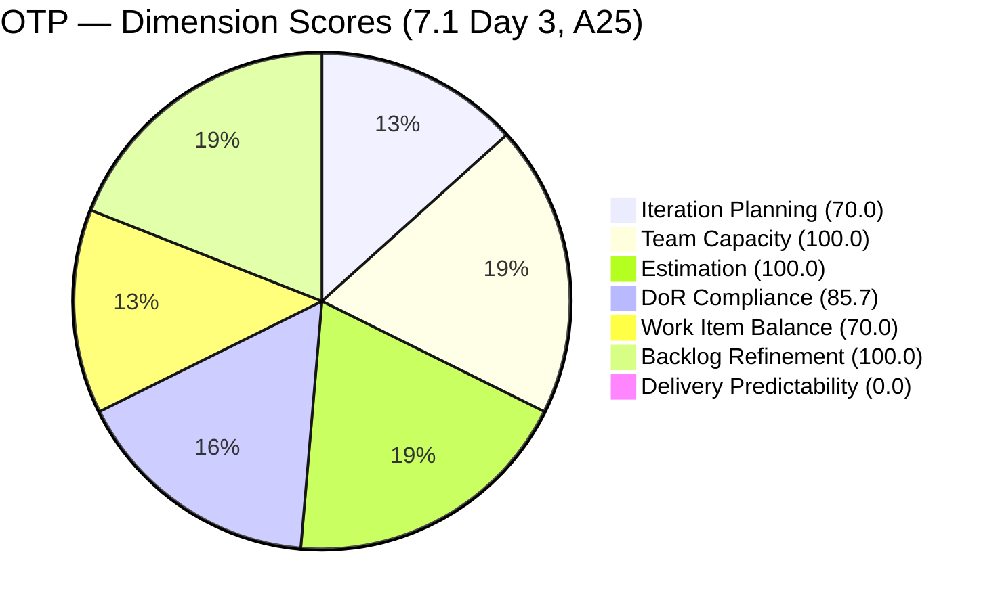
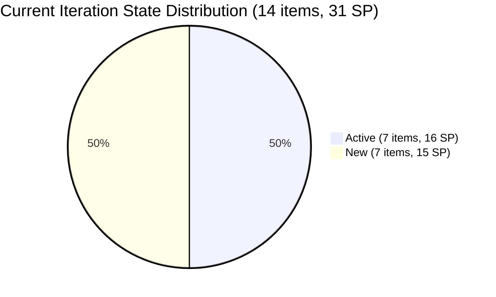
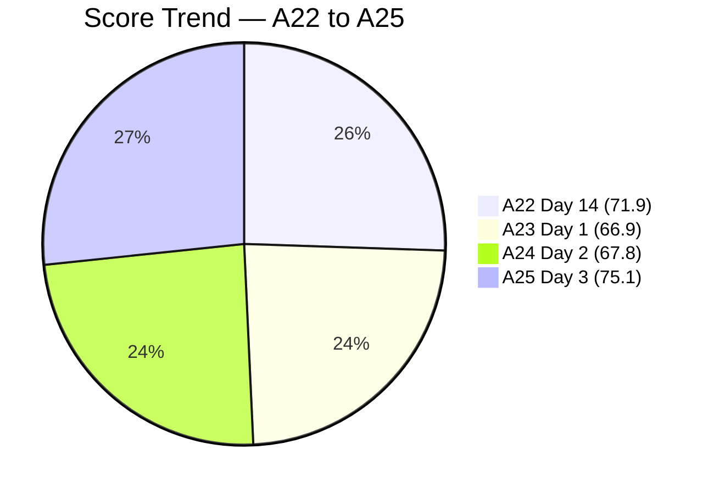
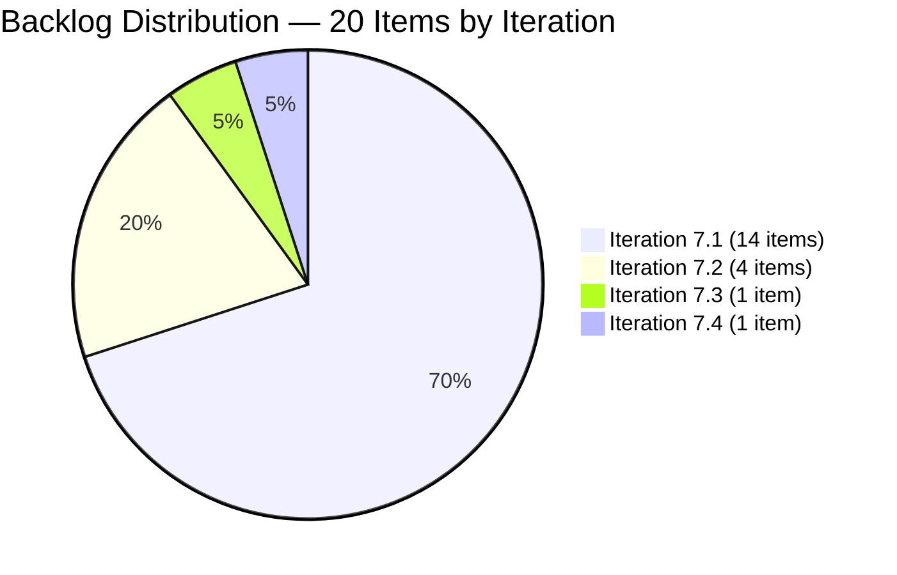

# SAFe Audit Report — OTP Team | Iteration 7.1 Day 3

## 1. Audit Metadata

| Field | Value |
|-------|-------|
| **Project** | OTP (Office of the President) |
| **Project ID** | `e7739905-28a3-4ae1-9173-7f6cd13b3494` |
| **Team** | OTP Team |
| **Team ID** | `64de61f0-1203-4b01-aee2-6b4415aec52b` |
| **Workspace Folder** | `ado_otp` |
| **Current Iteration** | Iteration 7.1 |
| **Iteration Path** | `OTP\2026 - PI7\Iteration 7.1` |
| **Iteration Start** | April 6, 2026 |
| **Iteration Finish** | April 19, 2026 |
| **Iteration Day** | Day 3 of 14 (21% elapsed) |
| **Audit Date** | 2026-04-08 |
| **Framework** | SAFe 6.0 |
| **Scoring Rubric** | ADO SAFe v1 (seven-dimension deterministic scoring) |
| **Prior Audit** | AUDIT_20260407_0900.md (A24, Day 2, Score: 67.8/100, Moderate Risk) |
| **Audit Sequence** | A25 — Day 3 of Iteration 7.1 |
| **Overall Score** | **75.1 / 100** |
| **Risk Band** | **Moderate Risk** (60–79.9) |

---

## 2. Executive Summary

The OTP Team scores **75.1/100 (Moderate Risk)** on Day 3 of Iteration 7.1 — a **+7.3 point improvement** from Day 2 (67.8). This is the strongest single-day gain for OTP since Iteration 7.1 opened and brings the team within 5 points of the Low Risk threshold (80.0).

The score surge is driven by a **dramatic Iteration Planning improvement**: **seven additional items have been moved from stranded positions into Iteration 7.1 today**, raising the current iteration roster from 7 items to **14 items** (from 13 SP to 31 SP). The items resolved include the long-standing visa stories (#198759, #198760, #198762), the PhilGeps story (#199522), and newly created/moved items (#184001, #195284, #195285). Iteration Planning rises from 26.9 to **70.0** — the highest score in PI7.

The backlog has also been rationalized: the visible root backlog shrank from 26 to **20 items** (a reduction of 6 items), and **all 20 items are fresh** (changed within 45 days), yielding a **Backlog Refinement score of 100.0** — the first time OTP has achieved full Backlog Refinement in PI7.

Two DoR failures remain: **#199522 (Renewal of PhilGeps)** and **#202249 (Submission of H1B Requirements)** — both have insufficient non-whitespace content in their description or no Acceptance Criteria. The Work Item Balance penalty (−30) persists as all 14 current items are User Stories.

Delivery Predictability remains 0.0 — no Story Points have been closed. With 31 SP committed and 11 sprint days remaining, the team will need to sustain approximately 2.8 SP/day to clear the full load.

---

## 3. Previous Audit Delta

| Dimension | A24 — Day 2 (Apr 7) | A25 — Day 3 (Apr 8) | Delta |
|-----------|----------------------|----------------------|-------|
| Iteration Planning | 26.9 | **70.0** | **+43.1** |
| Team Capacity | 100.0 | 100.0 | 0.0 |
| Estimation | 100.0 | 100.0 | 0.0 |
| DoR Compliance | 85.7 | 85.7 | 0.0 |
| Work Item Balance | 70.0 | 70.0 | 0.0 |
| Backlog Refinement | 92.3 | **100.0** | **+7.7** |
| Delivery Predictability | 0.0 | 0.0 | 0.0 |
| **Overall** | **67.8** | **75.1** | **+7.3** |

**Key developments since A24:**

- **Iteration Planning: 26.9 → 70.0 (+43.1)** — The largest single-day IP improvement in OTP's audit history. 7 additional items moved into Iteration 7.1 (roster grew from 7 to 14 items). The visible backlog simultaneously shrank from 26 to 20 items, improving the ratio in both directions.
- **Backlog Refinement: 92.3 → 100.0 (+7.7)** — All 20 visible backlog items are now fresh (changed within 45 days of Apr 8). No stale_90 or stale_180 items exist. OTP has achieved 100.0 Backlog Refinement — a significant milestone.
- **Items moved to Iteration 7.1:** #199522 (PhilGeps, 4 SP — P1 since A14), #198759 (Bomar Visa, 2 SP), #198760 (Jove Visa, 2 SP), #198762 (Bon Visa, 2 SP), #184001 (Emergency Exit Reflector, 2 SP), #195284 (Secretary's Certificate, 2 SP), #195285 (Special Board Meeting, 2 SP). Plus items confirmed in 7.1 that are new to this audit: these bring committed SP from 15 to 31.
- **DoR unchanged at 85.7** — Two items still fail DoR: #199522 (desc too short at 22 chars) and #202249 (no AC). The DoR check confirms #199522 moved to 7.1 but its description needs expansion.
- **No state changes** — All items held their states from Day 2. No SP closed.
- **Committed SP jumped from 15 to 31** — the team now has 31 SP committed across 14 items. This is a 107% increase in sprint scope from Day 2. This warrants capacity validation.

---

## 4. Current Iteration Snapshot

| Metric | Value |
|--------|-------|
| Iteration | 7.1 — Apr 6 to Apr 19, 2026 |
| Root items in iteration | **14** (up from 7 on Day 2) |
| Total Story Points committed | **31 SP** (up from 15 SP) |
| Closed Story Points | 0 SP |
| Active items | 5 (#198759, #198760, #198762, #199522, #200681, #200686, #202249) |
| New items | 7 |
| Iteration elapsed | Day 3 of 14 (21%) |
| Visible root backlog items | 20 (down from 26) |
| Contributors with current work | 1 (Grace — sole assignee, accepted exception) |
| Contributors with capacity | 1 (Grace, 2 hr/day: Deployment + Documentation) |
| Fresh items (changed >= Feb 22, 2026) | 20 / 20 (100.0%) |
| Stale > 90 days | 0 / 20 (0.0%) |
| Stale > 180 days | 0 / 20 (0.0%) |
| Untouched current items (changed < Apr 6) | 0 / 14 (0.0%) |

> **Capacity note:** 31 SP committed vs. Grace's 2 hr/day capacity over 11 remaining sprint days = 22 available hours. At an average of 2 SP/story, each story requires approximately 1.5 hrs to complete. Velocity from previous sprints (Iteration 7.1 predecessor had ~20 SP as benchmark) suggests 31 SP may be above sustainable capacity. This is a sprint load risk.

---

## 5. Work Item Analysis

### Current Iteration Items (14)

| ID | Title | State | SP | Changed | DoR |
|----|-------|-------|----|---------|-----|
| #184001 | Marilyn to canvass Emergency Exit sign reflector | New | 2 | Apr 8 | Pass |
| #195284 | Prepare Secretary's Certificate | New | 2 | Apr 8 | Pass |
| #195285 | Schedule Special Board Mtg | New | 2 | Apr 8 | Pass |
| #198587 | Installation of JIT Signage | New | 3 | Apr 7 | Pass |
| #198759 | Bomar Visa Application Requirements | Active | 2 | Apr 8 | Pass |
| #198760 | Jove Visa Application Requirement | Active | 2 | Apr 8 | Pass |
| #198762 | Bon Visa Application Requirement | Active | 2 | Apr 8 | Pass |
| #199522 | Renewal of PhilGeps | Active | 4 | Apr 8 | **FAIL** |
| #200681 | Team Re-Architecture (Operational Phase) | Active | 2 | Apr 7 | Pass |
| #200686 | Client Negotiation and Execution | Active | 2 | Apr 7 | Pass |
| #201807 | 1. Site Assessment & Technical Design | New | 2 | Apr 7 | Pass |
| #202229 | Invitation Letter from Akira | New | 2 | Apr 7 | Pass |
| #202241 | Signing of Intake Form with payment | New | 2 | Apr 7 | Pass |
| #202249 | Submission of H1B Requirements | Active | 2 | Apr 8 | **FAIL** |

> All items assigned to Grace (sole assignee — accepted project exception per CLAUDE.md).

### DoR Analysis (Current Iteration — 14 Items)

| ID | desc chars (non-ws) | AC chars (non-ws) | Status | Issue |
|----|---------------------|-------------------|--------|-------|
| #184001 | 36 | 23 | Pass | — |
| #195284 | 53 | 22 | Pass | — |
| #195285 | 99 | 73 | Pass | — |
| #198587 | 66 | 49 | Pass | — |
| #198759 | 49 | 21 | Pass | — |
| #198760 | 56 | 21 | Pass | — |
| #198762 | 55 | 53 | Pass | — |
| #199522 | **22** | 21 | **FAIL** | desc < 30 chars |
| #200681 | 92 | 30 | Pass | — |
| #200686 | 83 | 75 | Pass | — |
| #201807 | 87 | 72 | Pass | — |
| #202229 | 68 | 45 | Pass | — |
| #202241 | 79 | 63 | Pass | — |
| #202249 | 72 | **0** | **FAIL** | AC = 0 chars |

DoR compliant: **12 / 14** = 85.7%

### Backlog Items Outside Iteration 7.1 (6 items, all in future iterations)

| ID | Title | Iteration | SP | Changed |
|----|-------|-----------|-----|---------|
| #175360 | Canvass additional Fire Extinguisher | 7.2 | 2 | Apr 8 |
| #199835 | Initial Step for Hire Principal Software Engineer | 7.2 | 2 | Apr 8 |
| #200073 | Notification & Due Process (The "Legal" Phase) | 7.2 | 2 | Apr 8 |
| #201811 | 2. Vendor Selection & Procurement | 7.2 | 2 | Apr 8 |
| #201815 | Physical Installation & Grid Integration | 7.3 | 2 | Apr 8 |
| #201820 | Monitoring & Handover | 7.4 | 2 | Apr 8 |

> These 6 items are properly assigned to future iterations (7.2, 7.3, 7.4) and are not suppressing Iteration Planning — a positive backlog hygiene indicator.

### State Distribution (Current Iteration)

| State | Count | SP |
|-------|-------|----|
| Active | 7 | 16 |
| New | 7 | 15 |

### Work Item Type Distribution

| Type | Count | Share |
|------|-------|-------|
| User Story | 14 | 100.0% |

> Work Item Balance penalty (−30) applies: dominant type (User Story) = 100% > 60%. This is structurally expected for OTP's operational nature. Accepted characteristic of this team.

---

## 6. SAFe Compliance Scorecard

| Dimension | Score | Evidence | Notes |
|-----------|-------|----------|-------|
| Iteration Planning | **70.0** | 14 current / 20 visible | **+43.1 — 7 items moved to 7.1; backlog pruned to 20** |
| Team Capacity | 100.0 | 1/1 contributor with capacity | Grace: 2 hr/day; single-assignee accepted exception |
| Estimation | 100.0 | 14/14 point-eligible items have SP > 0 | All items estimated; 31 SP committed |
| DoR Compliance | 85.7 | 12/14 current items pass DoR | #199522 (desc too short), #202249 (no AC) |
| Work Item Balance | 70.0 | All 14 items are User Stories (100%) | −30 penalty: dominant type > 60%; structural for OTP |
| Backlog Refinement | **100.0** | 20/20 items fresh; 0 stale_90; 0 stale_180 | **+7.7 — Backlog fully refreshed; first 100.0 in PI7** |
| Delivery Predictability | 0.0 | 0 SP closed / 31 SP committed | Early-sprint Day 3; 7 items Active |
| **Overall** | **75.1** | Average of 7 dimensions | **Moderate Risk** (60–79.9 band) |

### Score Computation Detail

| Dimension | Formula | Calculation | Result |
|-----------|---------|-------------|--------|
| Iteration Planning | current / visible × 100 | 14 / 20 × 100 | 70.0 |
| Team Capacity | cap / work_assignees × 100 | 1 / 1 × 100 | 100.0 |
| Estimation | estimated / point_eligible × 100 | 14 / 14 × 100 | 100.0 |
| DoR Compliance | dor_compliant / current × 100 | 12 / 14 × 100 | 85.7 |
| Work Item Balance | 100 − penalties | 100 − 30 (dominant > 60%) | 70.0 |
| Backlog Refinement | base − penalties | 100.0 − 0 | 100.0 |
| Delivery Predictability | closed_sp / committed_sp × 100 | 0 / 31 × 100 | 0.0 |
| **Overall** | average(all 7) | (70.0+100+100+85.7+70+100+0)/7 | **75.1** |

---

## 7. Dimension Findings

### 7.1 Iteration Planning (70.0) — Breakthrough (+43.1)

14 of 20 visible backlog items are now in Iteration 7.1. This is the highest Iteration Planning score OTP has achieved in any audit across PI7. The improvement is the result of two simultaneous actions: (1) moving 7 items into the current iteration and (2) pruning the backlog from 26 to 20 items (6 items moved to future iterations 7.2–7.4 rather than left as unassigned backlog). This dual action maximizes the numerator and minimizes the denominator simultaneously.

The remaining 6 backlog items are properly assigned to future PI7 iterations — this demonstrates improved sprint planning intent compared to the unassigned backlog items from earlier audits.

### 7.2 Team Capacity (100.0) — Healthy

Grace remains the sole contributor with capacity (2 hr/day: Deployment + Documentation). The single-assignee model is an accepted project exception. With 31 SP committed vs 2 hr/day capacity over 11 remaining days (22 hours), sprint load is a concern. At approximately 2 SP per story, completing 31 SP would require ~31 × 0.7 hrs/SP ≈ 22 hours. This is at the theoretical maximum. **Sprint scope is a risk** — detailed in Risks section.

### 7.3 Estimation (100.0) — Full Score

All 14 current iteration items have Story Points assigned. Total committed: 31 SP. No change in estimation quality; the expansion of scope (from 15 to 31 SP) is fully estimated.

### 7.4 DoR Compliance (85.7) — Unchanged

12 of 14 current items pass DoR. Two failures:
- **#199522 (Renewal of PhilGeps):** Description is only 22 non-whitespace characters (threshold: 30). The description as stored is a short summary without sufficient context. This item was the P1 recommendation for 12 consecutive audits because it was not moved to 7.1 — it is now in 7.1, but the description needs expansion. **Fix: expand description to at least 50 characters with meaningful context about the renewal process.**
- **#202249 (Submission of H1B Requirements):** Description is 72 chars (passes), but **AC = 0** — the description references an embedded image for requirements. This is insufficient as Acceptance Criteria. This has been flagged for 3 consecutive audits. **Fix: write the H1B submission checklist as text AC fields (not an image reference).**

Fixing both items would raise DoR to 100.0 and add +2.1 points to overall score.

### 7.5 Work Item Balance (70.0) — Unchanged (Structural)

All 14 current items are User Stories (100% concentration). The −30 penalty for dominant type > 60% applies. This is structurally expected for OTP's operational work profile and is accepted per the project CLAUDE.md. No remediation expected.

### 7.6 Backlog Refinement (100.0) — Milestone Achievement (+7.7)

**OTP achieves 100.0 Backlog Refinement for the first time in PI7.** All 20 visible backlog items have been changed within the last 45 days (as of Apr 8). There are zero stale_90 or stale_180 items. No untouched current items. No penalties apply.

This is the result of today's backlog reorganization activity — moving items to future iterations and ensuring all remaining backlog items have been recently touched. This is a best-practice outcome that maintains backlog health as the team scales up sprint scope.

### 7.7 Delivery Predictability (0.0) — Early Sprint (7 Active Items)

0 of 31 committed SP closed. The sprint is in Day 3 of 14 (21% elapsed). Seven items are Active, indicating work has begun across multiple items. The primary risk is not pace — it is capacity: 31 SP is above Grace's theoretical maximum for this sprint. Based on prior sprints (Iteration 6.5 closed 25 SP credited out of 42 SP effective — 60%), a realistic target for this sprint is 18–20 SP closed. This would yield a Delivery Predictability of approximately 58–65 by sprint end.

---

## 8. Risks and Bottlenecks

| Priority | Risk | Impact |
|----------|------|--------|
| HIGH | **Sprint scope overload: 31 SP committed vs ~22 hours available capacity** | Grace cannot realistically close 31 SP in 11 days at 2 hr/day; sprint may end with 8–12 SP uncredited, suppressing DP score |
| HIGH | **#202249 (H1B) still missing Acceptance Criteria — 3rd consecutive audit** | Item is Active with no documented acceptance scope; Grace is executing work without a clear definition of Done |
| MEDIUM | **#199522 (PhilGeps) has insufficient description (22 chars) — DoR FAIL** | Now in 7.1 but still fails DoR; cannot be accepted at sprint review without proper description |
| MEDIUM | **Single-assignee model: Grace carries 31 SP with no backup** | No redundancy; if Grace is unavailable for 2+ days, sprint stalls completely |
| LOW | **7 of 14 items still in New state** | Normal for Day 3; however with 31 SP committed, delayed starts will compress delivery time |
| LOW | **5 future-iteration items may move to 7.1 prematurely** | Items in 7.2–7.4 are properly assigned; risk is mid-sprint scope creep if they are pulled forward |

---

## 9. Prioritized Recommendations

| Priority | Action | Expected Outcome | Target |
|----------|--------|------------------|--------|
| **P1** | **Fix DoR on #199522 (PhilGeps):** Expand the description from 22 to at least 50 non-whitespace characters with the renewal purpose, documents required, and renewal deadline. | DoR rises from 85.7 to 92.9. Item can be accepted at sprint review. | **Today** |
| **P2** | **Add Acceptance Criteria to #202249 (H1B Submission):** Replace the image-reference placeholder with text-based AC listing each submission requirement (Signed Acceptance Form, PH Requirements, LLC Requirements). | DoR rises to 100.0 (+2.1 overall score). Grace has a clear definition of Done. | **Today** |
| **P3** | **Review sprint load with Grace:** 31 SP committed at 2 hr/day capacity = theoretical maximum. Consider deferring 2–3 lower-priority items (#184001, #202229, or #202241) to Iteration 7.2 to create a manageable sprint goal with higher confidence. | Reduces sprint failure risk; improves Delivery Predictability at sprint close. | **Day 3–4** |
| **P4** | **Begin work on 5 New-state items by Day 5:** #184001, #195284, #195285, #198587, #201807 are in New state. With 11 days remaining, delayed starts increase end-of-sprint closure risk. | Ensures steady progress; prevents sprint stall in final days. | **Day 4–5** |
| **P5** | **Close items as completed:** Items that are Active and near completion (#199522 if renewal docs are ready) should be transitioned to Closed promptly. Any completed tasks from prior sprints still in Active state should be closed to credit SP. | Delivery Predictability rises with each SP credited; avoids repeat of previous sprint close audit where tasks were closed but stories remained open. | **Ongoing** |

---

## 10. Evidence Gaps and Limitations

| Gap | Impact | Mitigation |
|-----|--------|------------|
| **Day 3 early-sprint context** | DP = 0.0 expected; 7 Active items signal work in progress | Early-sprint annotation applied |
| **31 SP capacity alignment** | Grace's available hours (22) vs committed SP (31) is at boundary; actual velocity may differ from theoretical max | Track SP closures by Day 7 to assess mid-sprint trajectory |
| **#199522 description** | 22 non-ws chars in description — may be a display artifact if content is embedded in HTML that strips to short text | Verify in ADO: if HTML is rendering content, expanded description should still be written for audit evidence |
| **#202249 image-based description** | Cannot score AC from embedded image | Text-based AC required for DoR compliance; flagged for 3 audits |
| **Single-assignee model** | All 14 items assigned to Grace; no backup coverage | Accepted project exception per CLAUDE.md |

---

## Action Item Tracking — A14 to A25

| Recommendation | First Flagged | A25 Status |
|----------------|---------------|------------|
| Close #199522 (PhilGeps Renewal) | A14 | **Moved to 7.1 (A25) — P1 partially resolved; now needs DoR fix** |
| Move #200686 to current iteration | A23 (Day 1) | **DONE — in 7.1, Active since A24** |
| Add AC to #202249 | A22 | **P2 — Unresolved (3rd consecutive audit)** |
| Move visa stories to current iteration | A15 | **DONE — #198759, #198760, #198762 in 7.1 as of A25** |
| Begin work on iteration items | A23 | **Partial — 7 of 14 items Active** |

---

## Impact Simulation: If P1 and P2 Actioned Today

If #199522 description expanded (DoR pass) AND #202249 receives AC:
- DoR compliant: 14/14 = 100.0
- Overall: (70.0 + 100 + 100 + 100 + 70 + 100 + 0) / 7 = **77.1 (Moderate Risk, +2.0)**

If additionally Grace closes #199522 (PhilGeps, 4 SP) this week:
- Closed SP: 4, Committed SP: 31
- DP: 4/31 = 12.9
- Overall: (70.0 + 100 + 100 + 100 + 70 + 100 + 12.9) / 7 = **79.0 (approaching Low Risk threshold of 80.0)**

---

## Visualizations

> Note: Delivery Predictability shown as 0.1 for chart visibility; actual score is 0.0.

---

*Report generated by ADO SAFe audit agent. Audit date: 2026-04-08 (Day 3 of Iteration 7.1).*
*Scoring rubric: ADO SAFe v1 (seven-dimension deterministic scoring).*
*Previous: AUDIT_20260407_0900.md (A24, Day 2, 67.8/100, Moderate Risk) | +7.3 change*
*Iteration: OTP\2026 - PI7\Iteration 7.1 | Apr 6 – Apr 19, 2026*
*Overall Score: 75.1/100 (Moderate Risk) | Day 3 of 14 (21% elapsed) | A25*
