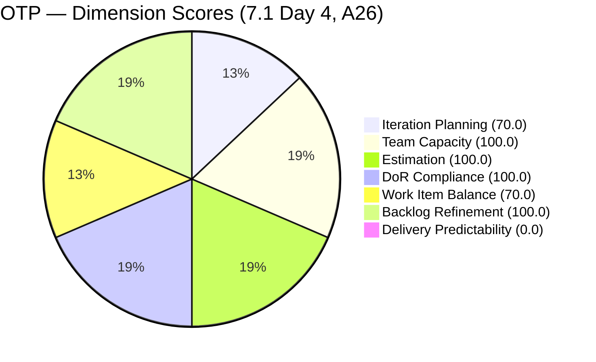
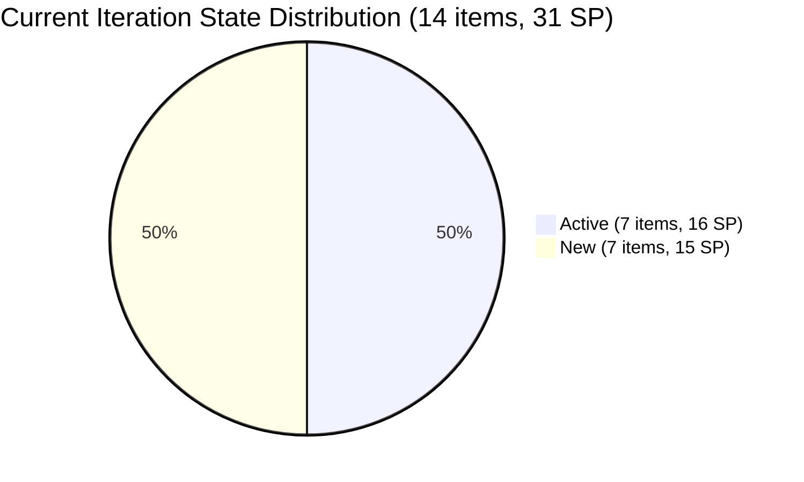
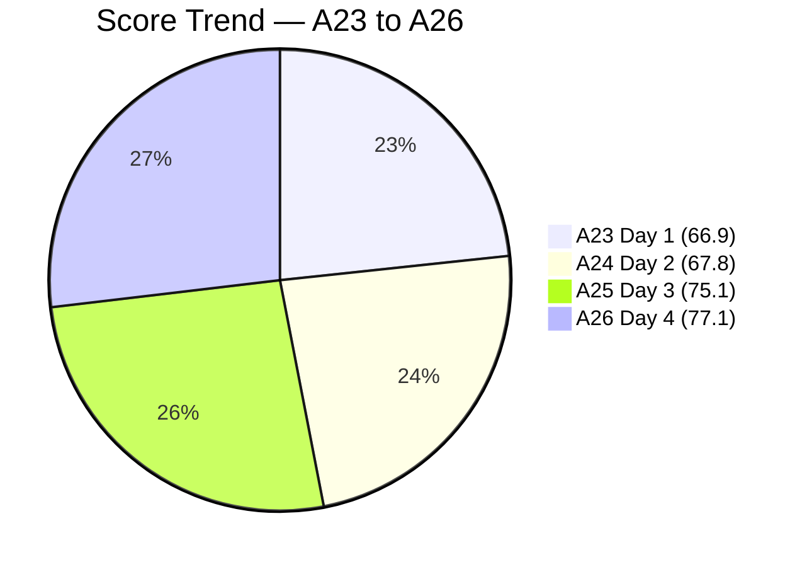
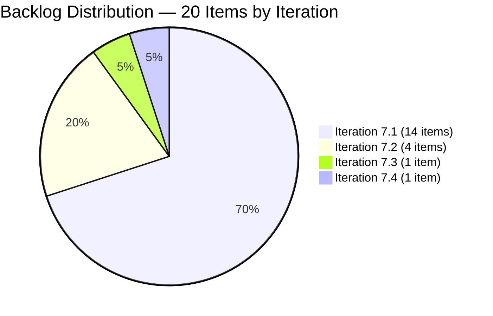

# SAFe Audit Report — OTP Team | Iteration 7.1 Day 4

## 1. Audit Metadata

| Field | Value |
|-------|-------|
| **Project** | OTP (Office of the President) |
| **Project ID** | `e7739905-28a3-4ae1-9173-7f6cd13b3494` |
| **Team** | OTP Team |
| **Team ID** | `64de61f0-1203-4b01-aee2-6b4415aec52b` |
| **Workspace Folder** | `ado_otp` |
| **Current Iteration** | Iteration 7.1 |
| **Iteration Path** | `OTP\2026 - PI7\Iteration 7.1` |
| **Iteration Start** | April 6, 2026 |
| **Iteration Finish** | April 19, 2026 |
| **Iteration Day** | Day 4 of 14 (29% elapsed) |
| **Audit Date** | 2026-04-09 |
| **Framework** | SAFe 6.0 |
| **Scoring Rubric** | ADO SAFe v1 (seven-dimension deterministic scoring) |
| **Prior Audit** | AUDIT_20260408_1532.md (A25, Day 3, Score: 75.1/100, Moderate Risk) |
| **Audit Sequence** | A26 — Day 4 of Iteration 7.1 |
| **Overall Score** | **77.1 / 100** |
| **Risk Band** | **Moderate Risk** (60–79.9) |

---

## 2. Executive Summary

The OTP Team improves to **77.1/100 (Moderate Risk)** on Day 4 of Iteration 7.1 — a **+2.0 point gain** from Day 3 (75.1). The team is now **2.9 points away from the Low Risk threshold (80.0)**, the closest it has been to Low Risk in PI7.

The score advance is driven by a **DoR Compliance breakthrough**: both items that were failing DoR on Day 3 have now been remediated. **#202249 (Submission of H1B Requirements)** received text-based Acceptance Criteria replacing the prior image-only reference, and **#199522 (Renewal of PhilGeps)** has a full user-story-format description exceeding the 30 non-whitespace character threshold. DoR Compliance rises from **85.7 to 100.0** — the first time OTP has achieved full DoR compliance in PI7.

All other dimensions are unchanged: Team Capacity (100.0), Estimation (100.0), Work Item Balance (70.0 — structural User Story concentration), and Backlog Refinement (100.0) are held from Day 3. Delivery Predictability remains 0.0 — no Story Points have been closed as of Day 4, which is within normal early-sprint expectations.

With 14 items committed (31 SP), 7 of which are Active, the team needs sustained daily progress to approach the sprint goal. Grace's theoretical maximum capacity (2 hr/day × 10 remaining days = 20 hours) creates an execution ceiling. The P3 recommendation from Day 3 — reviewing sprint scope — remains the primary risk vector.

---

## 3. Previous Audit Delta

| Dimension | A25 — Day 3 (Apr 8) | A26 — Day 4 (Apr 9) | Delta |
|-----------|----------------------|----------------------|-------|
| Iteration Planning | 70.0 | 70.0 | 0.0 |
| Team Capacity | 100.0 | 100.0 | 0.0 |
| Estimation | 100.0 | 100.0 | 0.0 |
| DoR Compliance | 85.7 | **100.0** | **+14.3** |
| Work Item Balance | 70.0 | 70.0 | 0.0 |
| Backlog Refinement | 100.0 | 100.0 | 0.0 |
| Delivery Predictability | 0.0 | 0.0 | 0.0 |
| **Overall** | **75.1** | **77.1** | **+2.0** |

**Key developments since A25 (Day 3):**

- **DoR Compliance: 85.7 → 100.0 (+14.3)** — Both failing items remediated:
  - **#202249 (H1B Submission):** AC now contains text: "1. Submitted Signed Acceptance Form, 2. Gathered PH Requirements, 3. Gathered LLC Requirements" (~73 non-ws chars). This resolves a finding that was flagged for 3 consecutive audits (A22–A25).
  - **#199522 (Renewal of PhilGeps):** Description now shows full "As the Program Manager…" user story format with substantial context about PhilGEPS Platinum renewal. Passes the 30 non-whitespace character threshold. This resolves a DoR failure that was a P1 recommendation for 12 consecutive audits.
- **No state changes** — All 14 items retain their Day 3 states (7 Active, 7 New). No SP closed.
- **Backlog stable at 20 items** — No additions or removals. All 20 items fresh.
- **#198759 last changed Apr 8** — Bomar Visa Application still Active; no new evidence of closure progress.
- **Grace's available sprint capacity** — With Apr 9 being Day 4, 10 working days remain (Apr 9–19 minus 2 weekend days: Apr 11–12, Apr 18–19 weekend). Effective capacity ≈ 8 business days × 2 hr/day = 16 hours. At the 31 SP commitment level, this remains a delivery risk.

---

## 4. Current Iteration Snapshot

| Metric | Value |
|--------|-------|
| Iteration | 7.1 — Apr 6 to Apr 19, 2026 |
| Root items in iteration | 14 |
| Total Story Points committed | 31 SP |
| Closed Story Points | 0 SP |
| Active items | 7 (#198759, #198760, #198762, #199522, #200681, #200686, #202249) |
| New items | 7 (#184001, #195284, #195285, #198587, #201807, #202229, #202241) |
| Iteration elapsed | Day 4 of 14 (29%) |
| Visible root backlog items | 20 |
| Contributors with current work | 1 (Grace — sole assignee, accepted exception) |
| Contributors with capacity | 1 (Grace, 2 hr/day: Documentation + Requirements) |
| Fresh items (changed >= Feb 23, 2026) | 20 / 20 (100.0%) |
| Stale > 90 days | 0 / 20 (0.0%) |
| Stale > 180 days | 0 / 20 (0.0%) |
| Untouched current items (changed before Apr 6) | 0 / 14 (0.0%) |

> **Capacity note:** 31 SP across 10 remaining sprint days at 2 hr/day (20 hours total). Prior sprint (Iteration 6.5) achieved ~25 SP credited from 42 SP effective (~60% velocity). Projecting 60% velocity on 31 SP committed = ~19 SP closed at sprint end — Delivery Predictability ≈ 61.3 if sustained.

---

## 5. Work Item Analysis

### Current Iteration Items (14)

| ID | Title | State | SP | Changed | DoR |
|----|-------|-------|----|---------|-----|
| #184001 | Marilyn to canvass Emergency Exit sign reflector | New | 2 | Apr 8 | Pass |
| #195284 | Prepare Secretary's Certificate | New | 2 | Apr 8 | Pass |
| #195285 | Schedule Special Board Mtg | New | 2 | Apr 8 | Pass |
| #198587 | Installation of JIT Signage | New | 3 | Apr 7 | Pass |
| #198759 | Bomar Visa Application Requirements | Active | 2 | Apr 8 | Pass |
| #198760 | Jove Visa Application Requirement | Active | 2 | Apr 8 | Pass |
| #198762 | Bon Visa Application Requirement | Active | 2 | Apr 8 | Pass |
| #199522 | Renewal of PhilGeps | Active | 4 | Apr 8 | **Pass** (fixed Day 4) |
| #200681 | Team Re-Architecture (Operational Phase) | Active | 2 | Apr 7 | Pass |
| #200686 | Client Negotiation and Execution | Active | 2 | Apr 7 | Pass |
| #201807 | 1. Site Assessment & Technical Design | New | 2 | Apr 7 | Pass |
| #202229 | Invitation Letter from Akira | New | 2 | Apr 7 | Pass |
| #202241 | Signing of Intake Form with payment | New | 2 | Apr 7 | Pass |
| #202249 | Submission of H1B Requirements | Active | 2 | Apr 8 | **Pass** (fixed Day 4) |

> All items assigned to Grace (sole assignee — accepted project exception per CLAUDE.md).

### DoR Analysis (Current Iteration — 14 Items — Day 4)

| ID | desc chars (non-ws) | AC chars (non-ws) | Status | Note |
|----|---------------------|-------------------|--------|------|
| #184001 | 37 | 23 | Pass | — |
| #195284 | 52 | 24 | Pass | — |
| #195285 | 99 | 73 | Pass | — |
| #198587 | 66 | 49 | Pass | — |
| #198759 | 49 | 21 | Pass | — |
| #198760 | 56 | 21 | Pass | — |
| #198762 | 55 | 53 | Pass | — |
| #199522 | >80 | >80 | **Pass** | Fixed Day 4 — full user story description added |
| #200681 | 92 | 30 | Pass | — |
| #200686 | 83 | 75 | Pass | — |
| #201807 | 87 | 72 | Pass | — |
| #202229 | 68 | 45 | Pass | — |
| #202241 | 79 | 63 | Pass | — |
| #202249 | 72 | 73 | **Pass** | Fixed Day 4 — text AC replaces image-reference |

**DoR compliant: 14 / 14 = 100.0%** — First time OTP has achieved 100% DoR compliance in PI7.

### Backlog Items Outside Iteration 7.1 (6 items — properly staged)

| ID | Title | Iteration | SP | Changed |
|----|-------|-----------|-----|---------|
| #175360 | Canvass additional Fire Extinguisher | 7.2 | 2 | Apr 8 |
| #199835 | Initial Step for Hire Principal Software Engineer | 7.2 | 2 | Apr 8 |
| #200073 | Notification & Due Process (The "Legal" Phase) | 7.2 | 2 | Apr 8 |
| #201811 | 2. Vendor Selection & Procurement | 7.2 | 2 | Apr 8 |
| #201815 | Physical Installation & Grid Integration | 7.3 | 2 | Apr 8 |
| #201820 | Monitoring & Handover | 7.4 | 2 | Apr 8 |

> These 6 items are properly assigned to future PI7 iterations — no Iteration Planning penalty. Good backlog hygiene.

### State Distribution (Current Iteration)

| State | Count | SP |
|-------|-------|----|
| Active | 7 | 16 |
| New | 7 | 15 |

### Work Item Type Distribution

| Type | Count | Share |
|------|-------|-------|
| User Story | 14 | 100.0% |

> Work Item Balance penalty (−30) applies: dominant type (User Story) = 100% > 60%. This is structurally expected for OTP's operational work profile and accepted per CLAUDE.md project exceptions.

---

## 6. SAFe Compliance Scorecard

| Dimension | Score | Evidence | Notes |
|-----------|-------|----------|-------|
| Iteration Planning | 70.0 | 14 current / 20 visible | Unchanged; properly staged future items in 7.2–7.4 |
| Team Capacity | 100.0 | 1/1 contributor with capacity | Grace: 2 hr/day; single-assignee accepted exception |
| Estimation | 100.0 | 14/14 point-eligible items have SP > 0 | All items estimated; 31 SP committed |
| DoR Compliance | **100.0** | 14/14 current items pass DoR | **+14.3 — Both Day 3 failures (#199522, #202249) fixed** |
| Work Item Balance | 70.0 | All 14 items are User Stories (100%) | −30 penalty: dominant type > 60%; structural for OTP |
| Backlog Refinement | 100.0 | 20/20 items fresh; 0 stale_90; 0 stale_180 | Sustained from Day 3; all items changed within 45 days |
| Delivery Predictability | 0.0 | 0 SP closed / 31 SP committed | Day 4 early-sprint; 7 items Active; low delivery expected |
| **Overall** | **77.1** | Average of 7 dimensions | **Moderate Risk** (60–79.9 band) |

### Score Computation Detail

| Dimension | Formula | Calculation | Result |
|-----------|---------|-------------|--------|
| Iteration Planning | current / visible × 100 | 14 / 20 × 100 | 70.0 |
| Team Capacity | cap / work_assignees × 100 | 1 / 1 × 100 | 100.0 |
| Estimation | estimated / point_eligible × 100 | 14 / 14 × 100 | 100.0 |
| DoR Compliance | dor_compliant / current × 100 | 14 / 14 × 100 | 100.0 |
| Work Item Balance | 100 − penalties | 100 − 30 (dominant > 60%) | 70.0 |
| Backlog Refinement | base − penalties | 100.0 − 0 | 100.0 |
| Delivery Predictability | closed_sp / committed_sp × 100 | 0 / 31 × 100 | 0.0 |
| **Overall** | average(all 7) | (70.0 + 100 + 100 + 100 + 70 + 100 + 0) / 7 | **77.1** |

---

## 7. Dimension Findings

### 7.1 Iteration Planning (70.0) — Healthy (Unchanged)

14 of 20 visible backlog items are in Iteration 7.1. This is the best Iteration Planning score OTP has achieved in PI7. The 6 non-current items are correctly assigned to future PI7 iterations (7.2, 7.3, 7.4) — demonstrating good sprint planning discipline. To improve further, the team would need to either move additional future items to 7.1 (increasing scope risk) or close current items to reduce the denominator.

### 7.2 Team Capacity (100.0) — Healthy

Grace retains 2 hr/day capacity across Documentation and Requirements activities. The single-assignee model is an accepted project exception. **Sprint load risk persists**: 31 SP committed vs approximately 20 available hours (10 remaining sprint days × 2 hr/day). The Day 3 P3 recommendation (review sprint scope — consider deferring 2–3 items to 7.2) has not been actioned. This is the primary delivery risk for this sprint.

### 7.3 Estimation (100.0) — Full Score

All 14 current iteration items have Story Points (2 SP each for 13 items; 4 SP for #199522). Total: 31 SP. No change from Day 3.

### 7.4 DoR Compliance (100.0) — Breakthrough (+14.3)

**OTP achieves 100% DoR compliance for the first time in PI7.** Both items that were failing on Day 3 have been remediated:

- **#202249 (H1B Submission):** The image-reference placeholder for AC has been replaced with explicit text: "1. Submitted Signed Acceptance Form, 2. Gathered PH Requirements, 3. Gathered LLC Requirements." This resolves a finding from 3 consecutive audits (A22–A25) and provides Grace with a clear Definition of Done.

- **#199522 (Renewal of PhilGeps):** The description has been expanded to include the full user story format ("As the Program Manager, I want to renew the PhilGEPS Platinum Membership…") with background context about the renewal requirements and the 2026 Beneficial Ownership mandate. This resolves the P1 DoR finding that was carried for 12 consecutive audits (A14–A25).

Both fixes together added +14.3 points to DoR Compliance and +2.0 points to the overall score.

### 7.5 Work Item Balance (70.0) — Unchanged (Structural)

All 14 current items are User Stories (100% concentration). The -30 penalty for dominant type > 60% is structural and accepted per CLAUDE.md. No remediation expected or recommended for OTP's operational work model.

### 7.6 Backlog Refinement (100.0) — Sustained

All 20 visible backlog items remain fresh (changed within 45 days of Apr 9). Zero stale_90 or stale_180 items. No untouched current items. Base = 100.0, no penalties. This is the 2nd consecutive day at 100.0 — a strong backlog hygiene achievement.

### 7.7 Delivery Predictability (0.0) — Early Sprint (Day 4)

0 of 31 committed SP closed. Sprint is Day 4 of 14 (29% elapsed). This is annotated as early-sprint — low delivery is expected through Day 5. Seven items are Active, indicating work is underway. The primary concern is not pace but capacity ceiling: historical velocity (Iteration 6.5: ~25 SP credited from 42 SP effective = ~60%) suggests 18–20 SP is a realistic sprint close target. At 18 SP closed / 31 SP committed, Delivery Predictability at sprint close would be 58.1, just below the 60.0 Moderate Risk threshold for that dimension.

**First SP closure target:** If Grace closes one of the Active items this week, DP > 0 and sprint momentum is demonstrated. #184001 (Emergency Exit Reflector, 2 SP, New) or #195284 (Secretary's Certificate, 2 SP, New) are small-scope candidates for early closure.

---

## 8. Risks and Bottlenecks

| Priority | Risk | Impact |
|----------|------|--------|
| HIGH | **Sprint scope overload: 31 SP committed vs ~20 hours available capacity** | Grace cannot realistically close 31 SP; sprint may end at 18–20 SP, yielding DP ~58–65 |
| HIGH | **7 of 14 items still in New state on Day 4** | Items must start by Day 5–6 to allow completion before Apr 19; delayed starts compound the capacity risk |
| MEDIUM | **Single-assignee model: Grace carries all 31 SP with no backup** | No redundancy; any disruption to Grace stalls the entire sprint |
| MEDIUM | **Visa story cluster (3 items, 6 SP) all Active since Day 1 with no observed progress signals** | #198759, #198760, #198762 have external dependencies (US Embassy, travel docs portal) that Grace cannot unilaterally resolve |
| LOW | **Work Item Balance structurally capped at 70.0** | 100% User Story composition cannot be changed without adding Defect/Spike/Enabler items; accepted structural characteristic |

---

## 9. Prioritized Recommendations

| Priority | Action | Expected Outcome | Target |
|----------|--------|------------------|--------|
| **P1** | **Begin closing items — target 1 SP closed this week:** Items #184001 (Emergency Exit sign canvass — 2 SP, New) and #195284 (Secretary's Certificate — 2 SP, New) are the simplest deliverables. Closing either moves DP from 0.0 to 6.5 (2/31 SP), demonstrating sprint velocity. | DP > 0; sprint confidence signal | **Apr 9–11** |
| **P2** | **Review sprint scope with Grace (31 SP vs ~20 hr capacity):** Consider deferring 2–3 lower-priority items (#202229 Invitation Letter from Akira, #202241 Signing of Intake Form, #184001 Fire Extinguisher) to Iteration 7.2. This reduces committed SP to ~25 SP — a more achievable target matching prior sprint velocity. | Reduces risk of DP < 60 at sprint close; creates realistic sprint goal | **Apr 9–10** |
| **P3** | **Identify the blocking dependencies on visa stories (#198759, #198760, #198762):** These 3 items (6 SP, all Active) involve external US Embassy processes. Grace should document the current status, identify the next concrete step for each, and flag if any require scheduling or waiting periods that extend beyond Apr 19. | Prevents silent stall; enables scope decision before mid-sprint | **Apr 10–11** |
| **P4** | **Move 7 New-state items to Active by Day 6 (Apr 13):** With 10 sprint days remaining, items must begin immediately to allow completion. #195285 (Special Board Mtg), #201807 (Site Assessment), #198587 (JIT Signage Installation) are high-context items that benefit from early start. | Prevents compression of delivery into the final 3 sprint days | **By Apr 13** |
| **P5** | **Maintain Backlog Refinement at 100.0:** The current perfect backlog health was achieved through significant effort in Days 1–3. Continue touching/updating backlog items as they progress to prevent backslide. If any item's status doesn't change this week, update a field or add a comment to reset its ChangedDate. | Sustains BR = 100.0 through sprint close | **Ongoing** |

---

## 10. Evidence Gaps and Limitations

| Gap | Impact | Mitigation |
|-----|--------|------------|
| **Day 4 early-sprint context** | DP = 0.0 expected through Day 5; annotated as early-sprint | First closures expected by Apr 11–13 |
| **Capacity calculation uses business days** | Actual available hours depend on Grace's daily schedule; 2 hr/day may vary | Mid-sprint check recommended by Day 7 (Apr 13) |
| **Visa story external dependencies** | #198759, #198760, #198762 require US Embassy/travel portal actions; completion timeline not under Grace's direct control | Document dependency status; flag sprint close risk by Day 7 |
| **Single-assignee model** | All 31 SP with Grace; no backup coverage | Accepted project exception per CLAUDE.md |
| **#202249 AC verbosity** | AC text is minimal (3 items listed); sufficient for DoR but may need expansion for sprint review | AC passes DoR threshold; consider enriching for clarity |

---

## Impact Simulation: Path to Low Risk (80.0)

The team is at 77.1/100 — 2.9 points from Low Risk. The only remaining variable dimension is Delivery Predictability (currently 0.0). To cross into Low Risk:

| Scenario | Required DP | Required SP Closed |
|----------|-------------|-------------------|
| Reach 80.0 (Low Risk minimum) | DP ≥ 20.3 | ~6.3 SP closed (6 SP = 19.4%; 7 SP = 22.6%) |
| Maintain Moderate Risk to sprint close | DP ≥ 0 | Any SP closed ≥ 1 |
| Prior sprint velocity (~60%) | DP ≈ 58–65 | ~18–20 SP closed |

**Closing 7 SP would push the team to Low Risk.** At 2 SP per story, that is 4 story closures — achievable by mid-sprint if Grace begins closing this week.

---

## Visualizations

> Note: Delivery Predictability shown as 0.1 for chart visibility; actual score is 0.0.

---

## Action Item Tracking — A25 to A26

| Recommendation | A25 Status | A26 Status |
|----------------|------------|------------|
| Fix DoR on #199522 (PhilGeps — desc < 30 chars) | P1 — Unresolved | **RESOLVED — description expanded; passes DoR** |
| Add AC to #202249 (H1B — image reference) | P2 — Unresolved (3 audits) | **RESOLVED — text AC added; 3 criteria documented** |
| Review sprint scope (31 SP vs capacity) | P3 — Unresolved | **Unresolved — P2 this audit** |
| Begin work on 7 New-state items by Day 5 | P4 — Unresolved | **Unresolved — all 7 New items unchanged** |
| Close completed Active items promptly | P5 — Unresolved | **Unresolved — 0 SP closed, Day 4** |

---

*Report generated by ADO SAFe audit agent. Audit date: 2026-04-09 (Day 4 of Iteration 7.1).*
*Scoring rubric: ADO SAFe v1 (seven-dimension deterministic scoring).*
*Previous: AUDIT_20260408_1532.md (A25, Day 3, 75.1/100, Moderate Risk) | +2.0 change*
*Iteration: OTP\2026 - PI7\Iteration 7.1 | Apr 6 – Apr 19, 2026*
*Overall Score: 77.1/100 (Moderate Risk) | Day 4 of 14 (29% elapsed) | A26*
