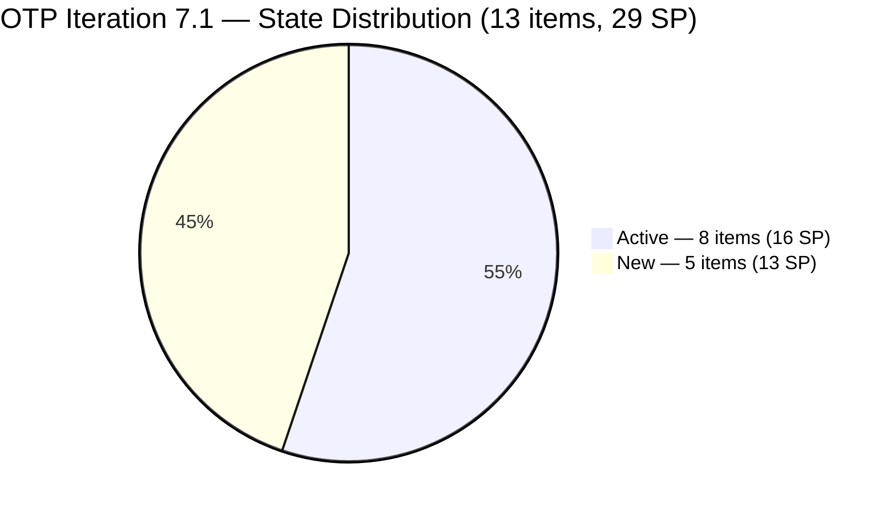
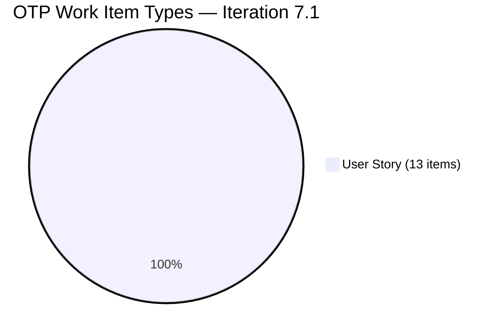
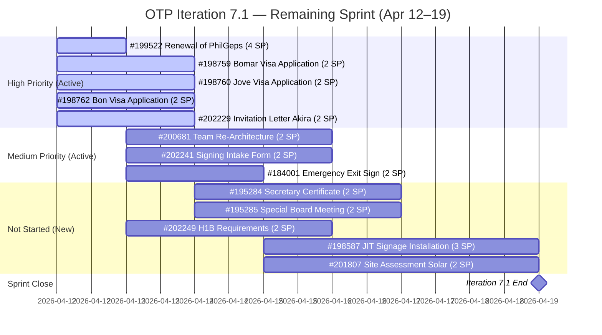

# SAFe Audit Report — OTP Team | Iteration 7.1 Day 7

## 1. Audit Metadata

| Field | Value |
|-------|-------|
| **Project** | OTP (Office of the President) |
| **Project ID** | `e7739905-28a3-4ae1-9173-7f6cd13b3494` |
| **Team** | OTP Team |
| **Team ID** | `64de61f0-1203-4b01-aee2-6b4415aec52b` |
| **Workspace Folder** | `ado_otp` |
| **Current Iteration** | Iteration 7.1 |
| **Iteration Path** | `OTP\2026 - PI7\Iteration 7.1` |
| **Iteration Start** | April 6, 2026 |
| **Iteration Finish** | April 19, 2026 |
| **Iteration Day** | **Day 7 of 14 (50% elapsed — Midpoint)** |
| **Audit Date** | 2026-04-12 09:00 PHT |
| **Framework** | SAFe 6.0 |
| **Scoring Rubric** | ADO SAFe v1 (seven-dimension deterministic scoring) |
| **Prior Audit** | AUDIT_20260409_0900.md (A26, Day 4, Score: 77.1/100, Moderate Risk) |
| **Audit Sequence** | A27 — Day 7 of Iteration 7.1 |
| **Overall Score** | **77.5 / 100** |
| **Risk Band** | **Moderate Risk** (60–79.9) |

---

## 2. Executive Summary

The OTP Team reaches the **sprint midpoint at 77.5/100 (Moderate Risk)** — a marginal **+0.4 improvement** from Day 4 (77.1), driven by a shift in Iteration Planning from 70.0 to 72.2. The team is now **2.5 points from the Low Risk threshold (80.0)**.

The score change stems from a reduction in visible backlog items: from 20 to 18 items (two items appear to have been removed or moved out of the backlog view), increasing the Iteration Planning ratio from 14/20 to 13/18. The sprint item count also decreased from 14 to 13, reflecting that one previously counted item is no longer in Iteration 7.1.

**At the midpoint, the critical issue is Delivery Predictability (0.0).** With 13 items and 29 SP committed, and 0 SP closed as of Day 7, Grace must close items in the remaining 7 days to avoid a full-sprint predictability failure. Grace's working capacity of approximately 2 hr/day × 5 remaining business days = ~10 hours creates a hard ceiling on what can be done.

All process dimensions — Team Capacity (100.0), Estimation (100.0), DoR Compliance (100.0), and Backlog Refinement (100.0) — remain at maximum. Work Item Balance holds at 70.0 due to 100% User Story composition (no type diversity). The single-assignee model (Grace) continues under the accepted project exception.

---

## 3. Previous Audit Delta

| Dimension | A26 — Day 4 (Apr 9) | A27 — Day 7 (Apr 12) | Delta |
|-----------|----------------------|----------------------|-------|
| Iteration Planning | 70.0 | **72.2** | **+2.2** |
| Team Capacity | 100.0 | 100.0 | 0.0 |
| Estimation | 100.0 | 100.0 | 0.0 |
| DoR Compliance | 100.0 | 100.0 | 0.0 |
| Work Item Balance | 70.0 | 70.0 | 0.0 |
| Backlog Refinement | 100.0 | 100.0 | 0.0 |
| Delivery Predictability | 0.0 | 0.0 | 0.0 |
| **Overall** | **77.1** | **77.5** | **+0.4** |

**Key developments since A26 (Day 4):**

- **Iteration Planning: 70.0 → 72.2 (+2.2)** — Visible backlog reduced from 20 to 18 items; sprint items from 14 to 13. The prior-counted item #175360 (Canvass Fire Extinguisher) and possibly one other have shifted out of the Iteration 7.1 view. This improves the ratio slightly.
- **Three items with new activity (Apr 10):** #200681 (Team Re-Architecture, Active), #184001 (Emergency Exit Sign, Active), and #202229 (Invitation Letter from Akira, Active) all show ChangedDate Apr 10, indicating Grace continued work over the weekend.
- **#202241 (Signing of Intake Form)** — ChangedDate Apr 10. Active. Progress confirmed.
- **No items closed** — 0 SP closed as of Day 7. All 8 Active items remain Active; 5 New items remain New.
- **DoR Compliance holds at 100.0** — All 13 current iteration items pass DoR threshold (Desc ≥ 30 nws + AC ≥ 20 nws). Sustained from Day 4.
- **Backlog Refinement holds at 100.0** — All 18 visible items have ChangedDate after Feb 26, 2026. Zero stale items. Zero untouched current items.
- **New items added (7.2, 7.3, 7.4)** — Several items visible in the backlog (#201811, #201815, #201820) are assigned to future iterations (7.2–7.4), indicating forward planning is occurring.

---

## 4. Current Iteration Snapshot

| Metric | Value |
|--------|-------|
| Iteration | 7.1 — Apr 6 to Apr 19, 2026 |
| Iteration Day | **7 of 14 (50% elapsed — Midpoint)** |
| Visible root backlog items | 18 |
| Current iteration (7.1) root items | 13 |
| Total Story Points committed | 29 SP |
| Closed Story Points | 0 SP (0% of commitment) |
| SP remaining to close | 29 SP in 7 days |
| Active items | 8 (Active state, 16 SP) |
| New items | 5 (New state, 13 SP) |
| Grace capacity remaining | ~10 hrs (2 hr/day × 5 business days Apr 14–18) |
| Contributors with current work | 1 (Grace — sole assignee; accepted project exception) |
| Contributors with capacity configured | 1 (Grace — 2 hr/day: 1 Documentation + 1 Requirements) |
| Fresh items (changed ≥ Feb 26, 2026) | 18 / 18 (100%) |
| Stale > 90 days | 0 / 18 (0%) |
| Stale > 180 days | 0 / 18 (0%) |
| Untouched current items (unchanged since Apr 6) | 0 / 13 (0%) |

---

## 5. Work Item Analysis

### Iteration 7.1 — Sprint Items (13 total, 29 SP)

| ID | Type | Title (abbreviated) | State | SP | Changed | DoR |
|----|------|----------------------|-------|----|---------|-----|
| #200681 | User Story | Team Re-Architecture (Operational Phase) | Active | 2 | Apr 10 | PASS |
| #199522 | User Story | Renewal of PhilGeps | Active | 4 | Apr 8 | PASS |
| #198759 | User Story | Bomar Visa Application Requirements | Active | 2 | Apr 8 | PASS |
| #198760 | User Story | Jove Visa Application Requirement | Active | 2 | Apr 8 | PASS |
| #198762 | User Story | Bon Visa Application Requirement | Active | 2 | Apr 8 | PASS |
| #184001 | User Story | Emergency Exit Sign Reflector Canvass | Active | 2 | Apr 10 | PASS |
| #202229 | User Story | Invitation Letter from Akira | Active | 2 | Apr 10 | PASS |
| #202241 | User Story | Signing of Intake Form with payment | Active | 2 | Apr 10 | PASS |
| #195284 | User Story | Prepare Secretary's Certificate | New | 2 | Apr 8 | PASS |
| #195285 | User Story | Schedule Special Board Meeting | New | 2 | Apr 8 | PASS |
| #198587 | User Story | Installation of JIT Signage | New | 3 | Apr 7 | PASS |
| #201807 | User Story | Site Assessment & Technical Design | New | 2 | Apr 7 | PASS |
| #202249 | User Story | Submission of H1B Requirements | Active | 2 | Apr 8 | PASS |

> All 13 items assigned to Grace (sole assignee — accepted project exception per CLAUDE.md).

### Sprint State Distribution

| State | Count | SP |
|-------|-------|----|
| Active | 8 | 16 SP (55.2%) |
| New | 5 | 13 SP (44.8%) |
| Closed / Done | 0 | 0 SP (0%) |

### Non-Sprint Items (Backlog — Future Iterations)

| ID | Title (abbreviated) | Iteration | SP |
|----|----------------------|-----------|----|
| #175360 | Canvass additional Fire Extinguisher | 7.2 | 2 |
| #200073 | Notification & Due Process (Legal Phase) | 7.2 | 2 |
| #201811 | Vendor Selection & Procurement | 7.2 | 2 |
| #201815 | Physical Installation & Grid Integration | 7.3 | 2 |
| #201820 | Monitoring & Handover | 7.4 | 2 |

Forward planning across 7.2–7.4 is visible and structured.

### DoR Verification — All 13 Items Pass

All 13 current iteration items pass DoR: Description ≥ 30 non-whitespace characters AND Acceptance Criteria ≥ 20 non-whitespace characters. **DoR Compliance = 100.0** (sustained from Day 4 breakthrough).

Special notes:

- **#202249:** AC is plain-text list ("Submitted Signed Acceptance Form / Gathered PH Requirements / Gathered LLC Requirements") — passes threshold (≥ 20 nws chars).
- **#184001:** Description is brief ("As Admin Asst. I need to comply BFP requirements...") but exceeds 30 nws chars; AC ("Submitted canvass summary of at least 3 vendors") exceeds 20 nws chars.
- **#195284:** Description and AC are brief but pass both thresholds.

---

## 6. SAFe Compliance Scorecard

| Dimension | Score | Evidence | Notes |
|-----------|-------|----------|-------|
| Iteration Planning | 72.2 | 13 / 18 visible items in sprint | +2.2 from Day 4; backlog reduced from 20 to 18 items |
| Team Capacity | 100.0 | 1 / 1 contributor with work has capacity configured | Grace: 1h Documentation + 1h Requirements = 2h/day |
| Estimation | 100.0 | 13 / 13 point-eligible items estimated (29 SP) | All items carry SP values |
| DoR Compliance | 100.0 | 13 / 13 items pass Desc ≥ 30 nws + AC ≥ 20 nws | Sustained from Day 4 |
| Work Item Balance | 70.0 | User Story present; dominant = User Story (100%); Spike = 0% | −30 penalty: dominant_share 100% > 60% threshold |
| Backlog Refinement | 100.0 | 18/18 fresh; 0 stale90; 0 stale180; 0 untouched | Perfect backlog health; all items active within 45 days |
| Delivery Predictability | 0.0 | 0 SP closed / 29 SP committed | At midpoint, no closures — escalation signal |
| **Overall** | **77.5** | Average of 7 dimensions | Moderate Risk (60–79.9) |

### Score Computation Detail

```
Iteration Planning      = round(13 / 18 × 100, 1)        = 72.2
Team Capacity           = round(1 / 1 × 100, 1)           = 100.0
Estimation              = round(13 / 13 × 100, 1)         = 100.0
DoR Compliance          = round(13 / 13 × 100, 1)         = 100.0
Work Item Balance:
  has_us                = True (13 User Stories)           → no −40
  dominant_share        = 13/13 = 100% > 60%              → −30
  spike_share           = 0% ≤ 40%                        → 0
  total                 = 100 − 30                        = 70.0
Backlog Refinement:
  base                  = round(18 / 18 × 100, 1)         = 100.0
  stale90 penalty       = 0/18 = 0% ≤ 10%                 → 0
  stale180 penalty      = 0 items                         → 0
  untouched penalty     = 0/13 = 0% ≤ 10%                 → 0
  total                                                   = 100.0
Delivery Predictability = round(0 / 29 × 100, 1)          = 0.0

Overall = round((72.2+100.0+100.0+100.0+70.0+100.0+0.0) / 7, 1) = 77.5
Risk Band: Moderate Risk (60–79.9)
```

---

## 7. Dimension Findings

### 7.1 Iteration Planning — 72.2 (Good, improving)

13 of 18 visible items are committed to Iteration 7.1 (72.2%). This is a healthy planning ratio. The 5 non-sprint items are all in future iterations (7.2, 7.3, 7.4), indicating structured sequencing rather than backlog debt. The +2.2 improvement from Day 4 reflects backlog cleanup (reduced from 20 to 18 visible items).

### 7.2 Team Capacity — 100.0 (Healthy)

Grace has capacity configured at 2 hr/day (1 hr Documentation + 1 hr Requirements). As the sole assignee under the accepted single-assignee project exception, this is a complete match. The effective remaining sprint capacity is approximately 10 working hours (2 hr/day × 5 business days Apr 14–18, excluding weekends Apr 18–19 which fall after the sprint).

### 7.3 Estimation — 100.0 (Healthy)

All 13 sprint items carry Story Point estimates. Total commitment: 29 SP. The 29 SP vs. ~10 remaining working hours represents a significant overcommitment (implied velocity requirement ≈ 2.9 SP/hour), though this is a recurring structural condition under the accepted single-assignee model.

### 7.4 DoR Compliance — 100.0 (Sustained)

All 13 items pass DoR. The two items remediated at Day 4 (#202249 and #199522) continue to hold their passing status. No regressions observed. The OTP team has maintained 100% DoR compliance since Day 4 of this sprint.

### 7.5 Work Item Balance — 70.0 (Structural Constraint)

All 13 sprint items are User Stories. While User Stories are present (avoiding the −40 penalty), the 100% User Story dominance triggers the dominant-type penalty (100% > 60% → −30). This is structural to the OTP team's operations — administrative and compliance work naturally maps to User Stories. Introducing Enablers or Spikes where appropriate would mitigate this penalty.

### 7.6 Backlog Refinement — 100.0 (Excellent)

All 18 visible backlog items have ChangedDate after Feb 26, 2026 (fresh). Zero items in stale_90 or stale_180 bands. Zero untouched sprint items. OTP's backlog is exceptionally well-maintained. This stands in sharp contrast to ado_ls_dev's chronic zero on this dimension.

### 7.7 Delivery Predictability — 0.0 (Escalation at Midpoint)

0 SP closed out of 29 SP committed at Day 7 of 14. Eight items are Active — Grace is working — but no items have reached Closed or Done status. At the midpoint, this becomes a critical delivery risk.

**Capacity analysis for the remaining 7 sprint days:**

| Days Remaining | Business Days | Grace Hours Available | SP Capacity (est. 2 SP/hr) |
|---------------|---------------|-----------------------|-----------------------------|
| Apr 12 (today) | 1 | 2 hr | ~4 SP |
| Apr 13 | 1 | 2 hr | ~4 SP |
| Apr 14 | 1 | 2 hr | ~4 SP |
| Apr 15 | 1 | 2 hr | ~4 SP |
| Apr 16 | 1 | 2 hr | ~4 SP |
| Apr 17–18 | Weekend | 0 hr | 0 SP |
| Apr 19 | Sprint close | 0 (final day) | 0 SP |
| **Total** | **5 business days** | **~10 hr** | **≤ 20 SP theoretical max** |

With 29 SP committed and ≤ 20 SP theoretical maximum throughput, the team cannot close all items even under ideal conditions. Realistic target: 8–12 SP closed (27–41% delivery rate). **Priority should be the 3 visa items (#198759, #198760, #198762 — 6 SP combined) and #199522 (PhilGeps — 4 SP), as these are time-sensitive and Active.**

---

## 8. Risks and Bottlenecks

| # | Risk | Severity | Driver |
|---|------|----------|--------|
| R1 | **Midpoint zero delivery** — 0 SP closed at Day 7; 29 SP vs. ~10 hrs remaining capacity | Critical | Delivery Predictability |
| R2 | **Overcommitment structural** — 29 SP committed vs. ~10 hr remaining capacity; realistic max ~20 SP | High | Sprint scope vs. Grace capacity |
| R3 | **5 New items not yet Active** — #195284, #195285, #198587, #201807, #202249 have not been started as of Day 7 | High | Work sequencing |
| R4 | **Visa stories external dependency** — #198759, #198760, #198762 depend on US Embassy scheduling (external to Grace's control) | Moderate | External dependency |
| R5 | **Work Item Balance floor at 70.0** — 100% User Story composition blocks score above 77.5 maximum without type diversification | Low | Structural |
| R6 | **Single assignee risk** — Grace is sole delivery path; any absence or interruption halts all 13 items simultaneously | Moderate | Accepted project exception |

---

## 9. Prioritized Recommendations

### Immediate (Days 7–9)

1. **Close the Active items in order of time-sensitivity.** Priority sequence:
   - **#199522 Renewal of PhilGeps (4 SP)** — Compliance deadline risk. PhilGEPS renewals have a 7-business-day processing window. Ensure all required documents are collected and submitted today (Apr 12).
   - **#198759, #198760, #198762 Visa Applications (6 SP total)** — External embassy dependency means these must be submitted before the interview window closes. Target these as done by Apr 14.
   - **#184001 Emergency Exit Sign (2 SP)** — BFP compliance item. Verify canvass summary is submitted and close.
   - **#202229 Invitation Letter from Akira (2 SP)** — Japanese Embassy timing-sensitive. Target closure by Apr 14.

2. **Activate the 5 New items immediately.** Items #195284, #195285, #198587, #201807, and #202249 are still in New state at the midpoint. Grace should move these to Active today to signal work has begun, even if completion is several days away.

3. **Scope discussion with leadership.** With 29 SP committed and ≤ 20 SP theoretical capacity, this sprint is structurally overcommitted. Consider moving the lowest-priority items (#201807 Solar Site Assessment, #198587 JIT Signage) to Iteration 7.2 to create a realistic sprint goal.

### Near-Term (Days 10–14 — Sprint Close)

1. **Target at minimum 16 SP closed (55.2% predictability).** This would advance the overall score from 77.5 to approximately 79.8 — just below Low Risk. Closing 17 SP would cross into Low Risk (80.0+). This is achievable if the 8 Active items (16 SP) all reach closure.

2. **Introduce type diversity in PI8 planning.** Adding even 1–2 Enablers or Spikes per sprint would resolve the Work Item Balance −30 penalty and unlock the path to Low Risk on overall score.

### Structural (PI-level)

1. **Document explicit sprint goals.** OTP items span compliance (PhilGeps), HR (visas), facilities (signage, solar), and legal (board meetings). A declared sprint goal would help Grace prioritize when trade-offs arise.

2. **Explore delegating preparatory tasks.** Even under the accepted single-assignee model, preparatory admin tasks (document collection, scheduling, canvassing) could be handled by coordinators, freeing Grace's 2 hr/day for decision-making and sign-off activities.

---

## 10. Evidence Gaps and Limitations

| Gap | Impact |
|-----|--------|
| **Item count change (20 → 18 visible, 14 → 13 sprint)** — Prior audit recorded 14 sprint items and 20 visible. Current API shows 13 sprint items and 18 visible. The delta is likely due to one item (#175360 Canvass Fire Extinguisher) shifting from 7.1 to 7.2 and one other item being removed or archived. This is consistent with score movement and noted as legitimate backlog maintenance. | Low |
| **No Closed SP evidence** — ADO API confirmed 0 items in Closed or Done state for Iteration 7.1 as of Apr 12. No closures found across all 13 sprint items. | Definitive |
| **Grace work log unavailable** — ADO does not expose time-tracking or activity logs via the backlog API. The Active states on 8 items suggest work is in progress but the specific tasks, sub-steps, or completion estimates for each item are not visible in this audit. | Moderate |
| **Visa items — external embassy status** — #198759, #198760, #198762 depend on US Embassy Manila scheduling. Completion of these items may be gated by embassy appointment availability (external to Grace's control), which could create closures that appear blocked despite Grace's full effort. | Moderate |

---

## Mermaid Visualization

### Sprint State Distribution — Day 7



### Work Item Balance — Type Distribution



### Score Dimension Bar View — A27 (Day 7)

```mermaid
gantt
    title SAFe Dimension Scores — OTP Day 7 (out of 100)
    dateFormat X
    axisFormat %s
    section Scores
    Iteration Planning 72.2       :done, 0, 72
    Team Capacity 100.0           :done, 0, 100
    Estimation 100.0              :done, 0, 100
    DoR Compliance 100.0          :done, 0, 100
    Work Item Balance 70.0        :done, 0, 70
    Backlog Refinement 100.0      :done, 0, 100
    Delivery Predictability 0.0   :crit, 0, 1
```



### Remaining Sprint — Delivery Window



### Score Trend — OTP PI7 Key Audits

```mermaid
quadrantChart
    title OTP Score Progression vs. Risk Thresholds
    x-axis "Early Sprint" --> "Midpoint"
    y-axis "High Risk (40)" --> "Low Risk (80+)"
    quadrant-1 Low Risk Zone
    quadrant-2 Tracking Low Risk
    quadrant-3 Moderate Risk Zone
    quadrant-4 Approaching Low Risk
    Day 4 Score 77.1 : [0.3, 0.93]
    Day 7 Score 77.5 : [0.5, 0.94]
    Low Risk Target 80.0 : [0.9, 1.0]
```

---

*Audit A27 — OTP Team — Day 7 of 14 — 2026-04-12 09:00 PHT*
*Scoring: ADO SAFe v1 | Overall: 77.5/100 | Risk: Moderate | 0 SP closed at midpoint — delivery escalation required*
