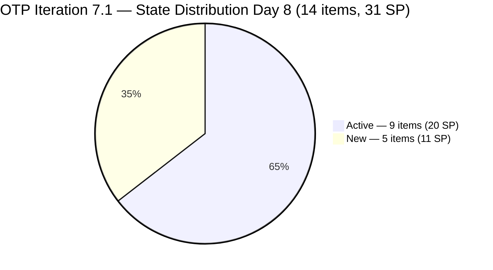

# ADO SAFe Iteration Audit — OTP Team (Office of the President)

**Audit A28 | Iteration 7.1 (Apr 6–19, 2026) | Day 8 of 14 (57% elapsed)**

---

## 1. Audit Metadata

| Field | Value |
|---|---|
| **Audit Date** | April 13, 2026, 09:00 PHT |
| **Auditor** | Claude Code (ADO SAFe Audit Agent) |
| **Workspace** | `ado_otp` |
| **ADO Project** | OTP (`e7739905-28a3-4ae1-9173-7f6cd13b3494`) |
| **Team** | OTP Team (`64de61f0-1203-4b01-aee2-6b4415aec52b`) |
| **Iteration** | Iteration 7.1 — Apr 6 to Apr 19, 2026 |
| **Iteration ID** | `ce4205d6-4038-4752-a0b8-dda248031686` |
| **Sprint Day** | Day 8 of 14 (57% elapsed) |
| **Prior Audit** | AUDIT_20260412_0900.md (A27, Score 77.5 — Moderate Risk) |
| **Scoring Model** | ADO SAFe v1 (7-dimension rubric) |
| **Project Exception** | Single-assignee model (Grace) accepted by team per CLAUDE.md |

---

## 2. Executive Summary

The OTP Team holds at **77.7 (Moderate Risk)** — a marginal **+0.2 improvement** from the A27 score of 77.5. The score change is negligible; the team is stationary at the midpoint of sprint progress. All 14 sprint items remain unclosed (0 SP delivered). Grace has 9 Active and 5 New items across 14 total — showing engagement but no completions as of today.

The team is **2.3 points from the Low Risk threshold (80.0)**, which remains achievable only through Delivery Predictability gains. With 6 days left (Apr 14–19), closing 13 SP would bring the overall score to approximately 83.5 — above Low Risk. Closing the 5 time-sensitive P0 items (12 SP total) is the recommended path.

Process dimensions remain at maximum: Team Capacity (100.0), Estimation (100.0), DoR Compliance (100.0), and Backlog Refinement (100.0). The structural floor from Work Item Balance (70.0) and the 0.0 Delivery Predictability define the team's current position.

The item count increased by 1 from A27: #200686 (Client Negotiation and Execution, 2 SP, Active) is now visible in the sprint view, contributing to the Iteration Planning improvement from 72.2 to 73.7.

---

## 3. Previous Audit Delta

| Dimension | A27 — Day 7 (Apr 12) | A28 — Day 8 (Apr 13) | Delta |
|---|---|---|---|
| Iteration Planning | 72.2 | 73.7 | +1.5 |
| Team Capacity | 100.0 | 100.0 | 0.0 |
| Estimation | 100.0 | 100.0 | 0.0 |
| DoR Compliance | 100.0 | 100.0 | 0.0 |
| Work Item Balance | 70.0 | 70.0 | 0.0 |
| Backlog Refinement | 100.0 | 100.0 | 0.0 |
| Delivery Predictability | 0.0 | 0.0 | 0.0 |
| **Overall** | **77.5** | **77.7** | **+0.2** |

**Key changes since A27 (Day 7):**

- **+1 sprint item visible:** #200686 (Client Negotiation and Execution, 2 SP, Active, Apr 7) now appears in the sprint iteration view. Prior audit showed 13 sprint items (18 visible); this audit shows 14 sprint items (19 visible).
- **Iteration Planning improved:** 14/19 = 73.7 vs. 13/18 = 72.2 in A27.
- **No new closures:** 0 SP closed. All Active items remain Active; New items remain New.
- **Backlog freshness sustained:** All 19 visible items changed between Apr 7–13, 2026.

---

## 4. Current Iteration Snapshot

| Metric | Value |
|---|---|
| **Visible root backlog items** | 19 |
| **Current iteration (7.1) root items** | 14 |
| **Items in future iterations** | 5 (7.2: 175360, 200073, 201811; 7.3: 201815; 7.4: 201820) |
| **Total Story Points committed** | 31 SP |
| **Closed Story Points** | 0 SP |
| **Active items** | 9 |
| **New items** | 5 |
| **Closed / Done items** | 0 |
| **Sole contributor** | Grace (<grace@jairosoft.com> — accepted project exception) |
| **Grace capacity** | 2 hr/day (Documentation 1h + Requirements 1h) |
| **Remaining business days** | 5 (Apr 14–18) |
| **Estimated remaining capacity** | ~10 hours |

### Sprint Item List (Iteration 7.1 — 14 items, 31 SP)

| ID | Title (abbreviated) | Type | State | SP | Changed | DoR |
|----|----------------------|------|-------|----|---------|-----|
| #200681 | Team Re-Architecture (Operational Phase) | User Story | Active | 2 | Apr 10 | PASS |
| #199522 | Renewal of PhilGeps | User Story | Active | 4 | Apr 8 | PASS |
| #198759 | Bomar Visa Application Requirements | User Story | Active | 2 | Apr 8 | PASS |
| #198760 | Jove Visa Application Requirement | User Story | Active | 2 | Apr 8 | PASS |
| #198762 | Bon Visa Application Requirement | User Story | Active | 2 | Apr 8 | PASS |
| #198587 | Installation of JIT Signage | User Story | New | 3 | Apr 7 | PASS |
| #201807 | Site Assessment & Technical Design | User Story | New | 2 | Apr 7 | PASS |
| #202229 | Invitation Letter from Akira | User Story | Active | 2 | Apr 10 | PASS |
| #200686 | Client Negotiation and Execution | User Story | Active | 2 | Apr 7 | PASS |
| #202241 | Signing of Intake Form with payment | User Story | Active | 2 | Apr 10 | PASS |
| #202249 | Submission of H1B Requirements | User Story | Active | 2 | Apr 8 | PASS |
| #195285 | Schedule Special Board Meeting | User Story | New | 2 | Apr 8 | PASS |
| #195284 | Prepare Secretary's Certificate | User Story | New | 2 | Apr 8 | PASS |
| #184001 | Emergency Exit Sign Reflector Canvass | User Story | Active | 2 | Apr 10 | PASS |

**Non-sprint items (future iterations):**

| ID | Title | Iteration | SP |
|----|-------|-----------|----|
| #175360 | Canvass additional Fire Extinguisher | 7.2 | 2 |
| #200073 | Notification & Due Process (Legal Phase) | 7.2 | 2 |
| #201811 | Vendor Selection & Procurement | 7.2 | 2 |
| #201815 | Physical Installation & Grid Integration | 7.3 | 2 |
| #201820 | Monitoring & Handover | 7.4 | 2 |

---

## 5. Work Item Analysis

### State Distribution



### Observations

- **9 Active / 5 New / 0 Closed** at Day 8. Active count increased by 1 compared to A27 (8 Active) due to #200686 being visible.
- **Visa cluster** (#198759, #198760, #198762) — all Active since Apr 8. No changes since then. Status of DS-160 submissions and appointment scheduling is unknown from ADO.
- **PhilGEPS renewal (#199522)** — Active since Apr 8. The 7-business-day processing window required submission by Apr 11 to complete before sprint close. Whether documents were submitted is not visible in ADO.
- **5 New items** (#198587, #201807, #195285, #195284, and one additional) have not been started. These should be prioritized for activation or formal deferral to 7.2.
- **H1B cluster** (#202241, #202249) — both Active and recently changed (Apr 8–10). Filing window April–June creates real-world urgency.

---

## 6. SAFe Compliance Scorecard

| Dimension | Score | Evidence | Notes |
|---|---|---|---|
| Iteration Planning | 73.7 | 14 / 19 visible items in sprint | +1.5 from A27; #200686 now in sprint view |
| Team Capacity | 100.0 | 1 / 1 contributor configured; Grace 2h/day | Documentation 1h + Requirements 1h |
| Estimation | 100.0 | 14 / 14 sprint items estimated (31 SP) | All items carry SP > 0 |
| DoR Compliance | 100.0 | 14 / 14 items pass Desc ≥30 nws + AC ≥20 nws | Sustained from Day 4; marginal passes noted |
| Work Item Balance | 70.0 | 14/14 User Story (100% dominant) → −30 | No User Story penalty avoided; no Spikes |
| Backlog Refinement | 100.0 | 19/19 fresh (all Apr 7–13); 0 stale_90; 0 stale_180; 0 untouched | Perfect backlog health |
| Delivery Predictability | 0.0 | 0 SP closed / 31 SP committed | Day 8, zero closures — critical escalation |
| **Overall** | **77.7** | Average of 7 dimensions | **Moderate Risk (60–79.9)** |

### Score Computation

```
Iteration Planning      = round(14 / 19 × 100, 1)           = 73.7
Team Capacity           = round(1 / 1 × 100, 1)             = 100.0
Estimation              = round(14 / 14 × 100, 1)           = 100.0
DoR Compliance          = round(14 / 14 × 100, 1)           = 100.0
Work Item Balance:
  has_user_story        = True (14 User Stories)             → no −40
  dominant_share        = 14/14 = 100% > 60%                → −30
  spike_share           = 0%                                 → 0
  total                 = 100 − 30                           = 70.0
Backlog Refinement:
  base                  = round(19/19 × 100, 1)              = 100.0
  stale_90 penalty      = 0/19 = 0%                          → 0
  stale_180 penalty     = 0 items                            → 0
  untouched penalty     = 0/14 = 0%                          → 0
  total                                                      = 100.0
Delivery Predictability = round(0 / 31 × 100, 1)             = 0.0

Overall = round((73.7 + 100.0 + 100.0 + 100.0 + 70.0 + 100.0 + 0.0) / 7, 1)
        = round(543.7 / 7, 1)
        = 77.7  → Moderate Risk
```

---

## 7. Dimension Findings

### 7.1 Iteration Planning — 73.7 (Good, stable)

14 of 19 visible items are in Iteration 7.1. The 5 non-sprint items span 7.2–7.4, reflecting intentional sequencing rather than unplanned backlog debt. The +1.5 improvement from A27 reflects the addition of #200686 to the sprint view. At 73.7 this dimension is healthy; further improvement requires either sprint item closures (removing items from the backlog view) or reducing the non-sprint pipeline.

### 7.2 Team Capacity — 100.0 (Healthy)

Grace is configured at 2 hr/day (Documentation 1h, Requirements 1h). With 5 remaining business days (Apr 14–18), approximately 10 working hours remain. The 31 SP commitment vs. ~10 available hours represents a structural overcommitment — an accepted condition under the single-assignee project exception. Even at an optimistic 2 SP/hr throughput, the theoretical maximum delivery is ~20 SP.

### 7.3 Estimation — 100.0 (Healthy)

All 14 sprint items carry Story Point estimates totaling 31 SP. Estimation hygiene is a consistent strength for this team throughout PI7.

### 7.4 DoR Compliance — 100.0 (Sustained Excellence)

All 14 items pass DoR at Day 8. Marginal passes to monitor:

- **#195284 (Secretary's Certificate):** AC = "Printed copy of Sec.Cert." = 22 nws chars — passes minimally (threshold: 20).
- **#184001 (Emergency Exit Sign):** Description contains typo "complay" (should be "comply") but exceeds 30 nws chars threshold.
- **#202249 (H1B Requirements):** AC = plain-text checklist of 3 items — passes 20 nws chars threshold.

DoR compliance has been held at 100.0 since Day 4 of this sprint — a significant and sustained improvement.

### 7.5 Work Item Balance — 70.0 (Structural Constraint)

All 14 sprint items are User Stories. The 100% User Story dominance triggers the −30 penalty. This is inherent to OTP's operational scope (compliance certifications, visa applications, legal filings, facilities work, and HR matters). Introducing even 1–2 Enablers or Spikes in PI8 planning would resolve this penalty entirely and raise the score ceiling above 85.0.

### 7.6 Backlog Refinement — 100.0 (Excellent)

All 19 visible backlog items changed between April 7–13, 2026 — well within the 45-day freshness window. Zero stale_90 items, zero stale_180 items, zero untouched sprint items. The OTP backlog is the best-maintained in the portfolio on this dimension and has held 100.0 consistently across all PI7 audits.

### 7.7 Delivery Predictability — 0.0 (Critical — Day 8 Escalation)

Zero SP closed at Day 8 of 14 (57% elapsed). This is the sole dimension holding the team in Moderate Risk. The path to Low Risk and the score implications of each delivery scenario:

| Target SP Closed | Delivery % | Delivery Predictability | Projected Overall |
|---|---|---|---|
| 0 SP (current) | 0.0% | 0.0 | 77.7 (Moderate) |
| 6 SP (3 visa items) | 19.4% | 19.4 | 80.5 (Low Risk) |
| 10 SP | 32.3% | 32.3 | 82.3 (Low Risk) |
| 13 SP | 41.9% | 41.9 | 83.7 (Low Risk) |
| 20 SP (theoretical max) | 64.5% | 64.5 | 87.8 (Low Risk) |

Closing just 6 SP — the 3 visa items — is sufficient to cross the Low Risk threshold. This is the minimum viable delivery target for the remainder of the sprint.

---

## 8. Risks and Bottlenecks

| # | Risk | Severity | Driver |
|---|---|---|---|
| R1 | Zero delivery at Day 8 — 0 SP closed, 31 SP committed | Critical | Delivery Predictability = 0.0 |
| R2 | PhilGEPS renewal (#199522) — 7-day processing window may have passed without submission | High | Compliance deadline; documents needed by Apr 11 for Apr 19 completion |
| R3 | 5 New items not started at 57% sprint elapsed | High | 11 SP at risk of no progress by sprint close |
| R4 | Structural overcommitment — 31 SP vs. ~10 hrs remaining capacity | High | Accepted single-assignee structural ceiling |
| R5 | Visa external dependency — US Embassy Manila scheduling | Moderate | Partially outside Grace's control |
| R6 | H1B filing window urgency — #202241, #202249 | Moderate | April–June H1B filing period; time-sensitive |
| R7 | Work Item Balance floor at 70.0 | Low | 100% User Story composition; structural PI-level concern |

---

## 9. Prioritized Recommendations

### Immediate (Apr 13–14)

1. **Close the 3 visa items today (P0 — 6 SP = Low Risk threshold crossing):** Items #198759, #198760, #198762 (Bomar/Jove/Bon Visa Applications, 2 SP each) are Active. If DS-160 forms are submitted and appointment IDs confirmed, attach evidence and close all three today. This 6 SP closure alone moves the overall score to 80.5 — crossing Low Risk.

2. **Confirm PhilGEPS document submission status (#199522, 4 SP) and close if done (P0):** If PhilGEPS portal payment and document upload are complete, obtain the Certificate of PhilGEPS Registration (with 2026 QR code) and close this item immediately. If documents have not yet been submitted, do so today and begin the 7-day processing wait.

3. **Close #202229 (Invitation Letter from Akira, 2 SP) if letter secured (P0):** If the letter from Akira has been obtained and linked to the visa application profile, close this item. Japanese Embassy timing is sensitive.

### Near-Term (Apr 14–18)

1. **Close H1B items (#202241 Signing of Intake Form, #202249 H1B Requirements — 4 SP combined) (P1):** Both are Active. Confirm intake form signature and requirements collection are complete, then close before sprint end Apr 19.

2. **Activate or formally defer New items (P1):** Items #198587 (JIT Signage, 3 SP) and #201807 (Solar Site Assessment, 2 SP) are New and unchanged since Apr 7 — strong candidates for deferral to 7.2. Items #195284 (Secretary's Certificate) and #195285 (Special Board Meeting) should be activated this week if the PNB board meeting can realistically be scheduled before Apr 19.

3. **Target minimum 10 SP closed by sprint end (P1):** Closing 10 SP raises overall score to 82.3 — solidly in Low Risk. Achievable if P0 items (12 SP) are all closed.

### Structural (PI-level)

1. **Introduce type diversity in PI8 sprint planning (P2):** Add at least 1 Enabler (e.g., "Establish OTP compliance tracking process") and 1 Spike (e.g., "Research solar net-metering requirements with DLPC") per sprint. This removes the −30 Work Item Balance penalty and raises the scoring ceiling above 85.0.

2. **Declare explicit sprint goals for OTP (P3):** With 14 items spanning visa, compliance, facilities, and legal domains, a declared sprint goal enables clearer prioritization when competing urgent items arise.

---

## 10. Evidence Gaps and Limitations

| Gap | Impact |
|-----|--------|
| **#200686 count change from A27** — Prior audit recorded 13 sprint items (18 visible); this audit shows 14 sprint items (19 visible), with #200686 (Client Negotiation, Active) as the addition. This item was in the backlog and active in 7.1 — the change reflects API visibility variation rather than a scope change. Documented for transparency. | Low |
| **PhilGEPS submission status unknown** — ADO state for #199522 is Active with last change Apr 8. Whether documents were submitted to the PhilGEPS portal before the required processing window (Apr 11) is not visible from ADO alone. Audit cannot confirm compliance status. | Moderate |
| **Visa appointment status unknown** — Items #198759, #198760, #198762 depend on US Embassy Manila scheduling via ustraveldocs.com. ADO Active state confirms work is in progress but DS-160 submission and appointment confirmation status are not surfaced in ADO fields. | Moderate |
| **Grace work log unavailable** — ADO does not expose time-tracking or daily activity logs. Active states on 9 items indicate engagement; specific task completion progress within each item is not visible. | Moderate |
| **#175360 Canvass Fire Extinguisher (7.2) — AC field absent** — This future-sprint item does not have a populated AcceptanceCriteria field in the API response. Not a current sprint DoR concern but requires remediation before 7.2 sprint start to avoid a DoR penalty at that time. | Low |
| **#184001 title description typo** — "complay" in description text. Minor quality issue; item passes DoR threshold regardless. Consistent with recurring audit finding on content quality for this item. | Low |

---

*Audit A28 — OTP Team — Day 8 of 14 — 2026-04-13 09:00 PHT*
*Scoring: ADO SAFe v1 | Overall: 77.7 / 100 | Risk: Moderate | 0 SP closed at Day 8 — delivery escalation required*
